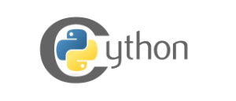

# Nautilus Trader

#### Features
* **Fast:** C level speed and type safety provided through Cython. ZeroMQ message transport, MsgPack wire serialization.
* **Flexible:** Any FIX or REST broker API can be integrated into the platform with no changes to your strategy scripts.
* **Backtesting:** Multiple instruments and strategies simultaneously with historical tick and/or bar data.
* **AI Agent Training:** Backtest engine fast enough to be used to train Reinforcement Learning or Evolutionary AI trading agents.
* **Teams Support:** Support for teams with many trader boxes. Suitable for professional algorithmic traders or small hedge funds.
* **Cloud Enabled:** Flexible deployment schemas - run with data and execution services embedded on a single box, or deploy across many boxes in a networked or cloud enviornment.

[Documentation](https://nautechsystems.io/nautilus/api)

#### Installation
First make sure all required packages are installed (as found in the `setup.py` requirements).
Then install via pip by running the below command;

    $ pip install -U git+https://github.com/nautechsystems/nautilus_trader

#### Development
[Development Documentation](docs/development)

To run the tests, first compile the C extensions for the package;

    $ python setup.py build_ext --inplace

All tests can be run via the `runtests.py` script, or through pytest.

#### Support
Please direct all questions, comments or bug reports to info@nautechsystems.io

  

Copyright (C) 2015-2019 Nautech Systems Pty Ltd. All rights reserved.

> https://nautechsystems.io
