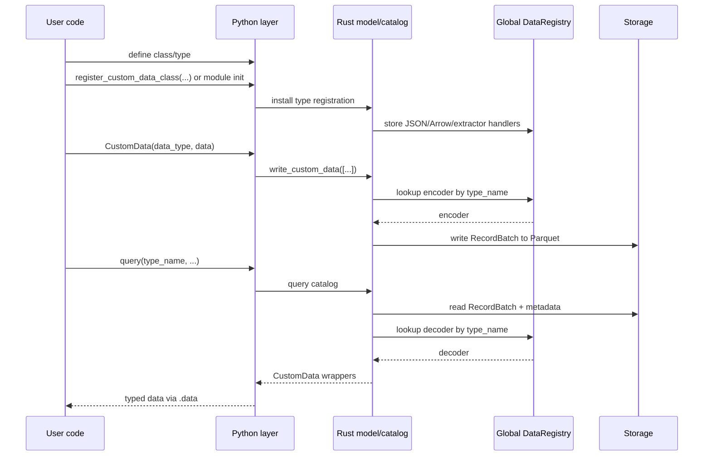
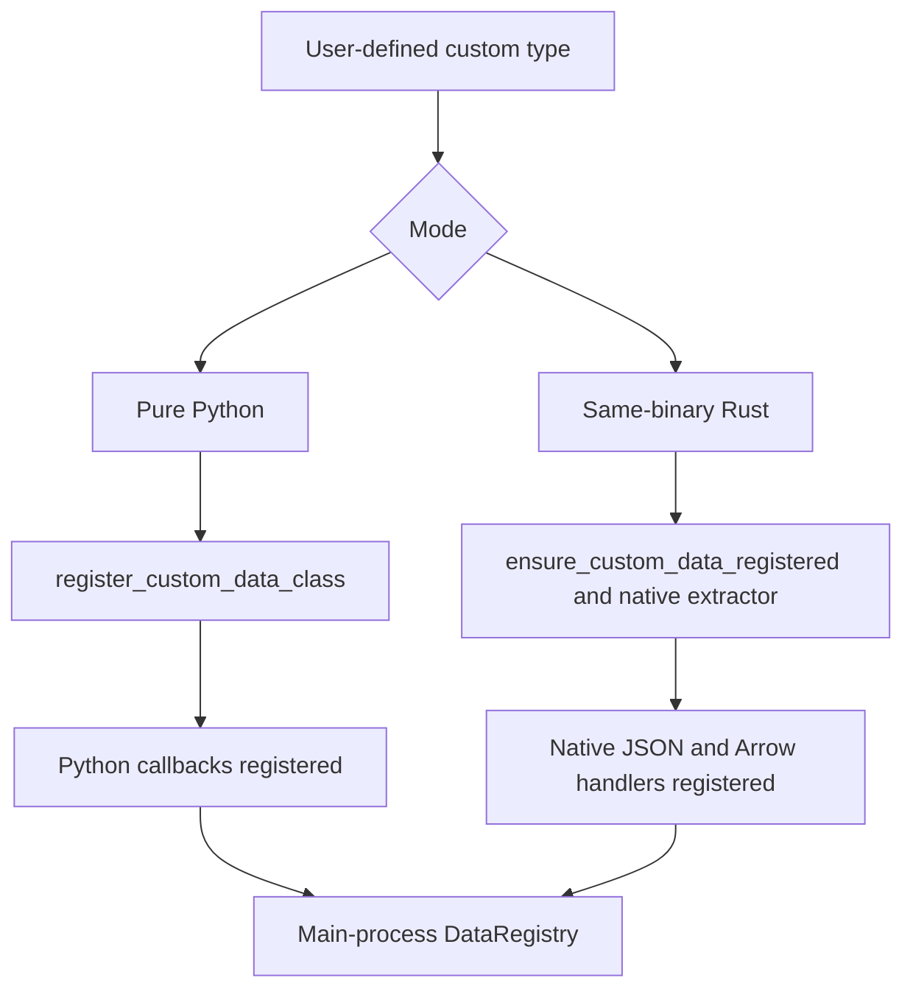
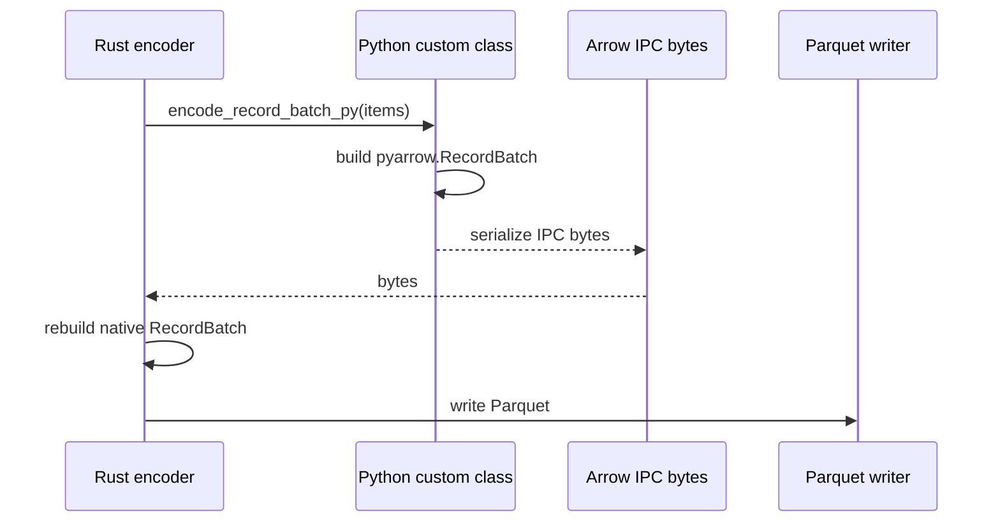

# Custom data architecture

Nautilus Trader supports custom data authored in Python and Rust, and moves
that data through the same runtime, persistence, and query pipeline used
by the rest of the platform.

This document explains how custom data is:

- registered at runtime,
- wrapped across the Python/Rust boundary,
- serialized to and from Arrow/Parquet,
- routed through actors and strategies.

## Goals

The custom-data architecture satisfies the following requirements:

- Let users define custom data in pure Python without writing Rust code.
- Let Rust-defined custom data use native Rust JSON and Arrow handlers.
- Preserve a single user-facing `CustomData` wrapper at the PyO3 boundary.
- Support persistence in `ParquetDataCatalogV2` using dynamic type registration
  instead of hardcoded schemas.
- Make custom data routable through the normal data-engine, actor, and strategy
  subscription flow.

## High-level model

There are two supported authoring modes:

| Mode              | Example                                            | Registration path                                      | Encode/decode path     | Wrapper backend           |
|-------------------|----------------------------------------------------|---------------------------------------------------------|------------------------|---------------------------|
| Pure Python       | `@customdataclass_pyo3` class                      | `register_custom_data_class(...)`                       | Python callback + Arrow IPC bridge | `PythonCustomDataWrapper` |
| Same-binary Rust  | `#[custom_data]` or `#[custom_data(pyo3)]` type    | `ensure_custom_data_registered::<T>()` and native extractor | Native Rust            | Native Rust payload       |

Both modes converge on the same outer PyO3 `CustomData` wrapper and the same
`DataType` identity model.

## End-to-end flow

## Core components

### `DataRegistry`

`crates/model/src/data/registry.rs` is the central runtime registry for custom
data in the main process. Registration uses atomic `DashMap::entry()` so that
concurrent `register_*` and `ensure_*` calls do not race.

It stores:

- JSON deserializers keyed by `type_name`.
- Arrow schemas keyed by `type_name`.
- Arrow encoders and decoders keyed by `type_name`.
- Python extractors that can convert a Python object into
  `Arc<dyn CustomDataTrait>`.

Instead of hardcoding every type into the main binary, Nautilus resolves
handlers at runtime using the `type_name` stored in `DataType` and Parquet
metadata.

### `CustomData`

The outer PyO3 `CustomData` wrapper is the common container that crosses the
FFI boundary.

Constructor signature: `CustomData(data_type, data)` -- the `DataType` comes
first, then the inner payload.

It contains:

- a `DataType`,
- an inner custom payload implementing `CustomDataTrait`,
- timestamps used for ordering, routing, and persistence.

On the Python side, `CustomData` exposes value semantics: `__eq__` and
`__repr__` are implemented (equality uses the Rust `PartialEq` logic).
Instances are intentionally unhashable so that equality remains consistent with
the inner payload comparison.

This wrapper is shared across both custom-data modes. User code interacts with
one API even though the underlying payload may be:

- a Python-backed wrapper,
- a same-binary Rust value.

#### CustomData JSON envelope

When serialized to JSON (e.g. for `to_json_bytes` / `from_json_bytes`, SQL
cache, or Redis), `CustomData` uses a single canonical envelope so that
deserialization does not depend on user payload field names:

- `type`: the custom type name (from `CustomDataTrait::type_name`).
- `data_type`: an object with `type_name`, `metadata`, and optional
  `identifier`.
- `payload`: the inner payload only (the result of `CustomDataTrait::to_json`
  parsed as a value). Registered deserializers receive only this value in
  `from_json`, so user structs can use any field names (including `value`)
  without conflicting with wrapper metadata.

This envelope is produced by Rust `CustomData` serialization and consumed by
`DataRegistry` when deserializing custom data from JSON.

### `DataType`

`DataType` is part of the identity of persisted and routed custom data.

Constructor: `DataType(type_name, metadata=None, identifier=None)`.

It includes:

- `type_name`,
- optional `metadata`,
- optional `identifier` (exposed as a property and used in catalog pathing).

Custom-data storage and queries use `DataType`, not just the bare Rust/Python
class name. This allows the same logical type to be stored under different
metadata or identifiers while still decoding through the same registered
handler.

## Registration architecture

Registration bridges the gap between Python objects and Rust trait objects.

### Pure Python registration

When Python code calls `register_custom_data_class(MyType)`:

1. The type is registered in the Python serialization layer for JSON and Arrow
   support.
2. Rust registers a Python extractor that wraps Python instances as
   `PythonCustomDataWrapper`.
3. Rust registers Arrow schema/encode/decode callbacks in `DataRegistry`.

This path is flexible and user-friendly, but Arrow encoding and reconstruction
rely on Python callbacks.

### Same-binary Rust registration

For Rust types defined inside Nautilus:

1. `#[custom_data]` or `#[custom_data(pyo3)]` generates the necessary trait,
   JSON, and Arrow implementations.
2. `ensure_custom_data_registered::<T>()` inserts native schema/encoder/decoder
   handlers into `DataRegistry`.
3. For PyO3-exposed types, a native extractor can convert Python instances back
   into the concrete Rust type rather than a Python fallback wrapper.

This path stays fully native in Rust for encode/decode.

### Registration precedence

`register_custom_data_class(...)` resolves types in the following order:

1. same-binary native Rust registration,
2. pure Python fallback registration.

That ordering preserves the fastest available path for types already known
natively by the main binary.

## Wrapper backends

Internally, the outer `CustomData` wrapper can hold different payload
implementations.

### `PythonCustomDataWrapper`

Used for pure Python custom data.

Responsibilities:

- stores a reference to the Python object,
- caches `ts_event`, `ts_init`, and `type_name`,
- implements `CustomDataTrait`,
- calls Python methods for JSON and Arrow-related operations under the GIL.

This is the fallback path when the main process does not have a native Rust
representation for the type.

### Native same-binary Rust payload

For Rust types compiled into Nautilus, the inner payload is the concrete Rust
type itself and can be downcast directly from `Arc<dyn CustomDataTrait>`.

No Python callback path is needed for serialization or decode.

## Persistence architecture

### Why dynamic Arrow registration is needed

Built-in Nautilus data types have schemas and encoders known statically to the
Rust binary. Custom data does not. The persistence layer therefore resolves
custom data dynamically using the registered `type_name`.

### Catalog write flow

`ParquetDataCatalogV2` expects custom writes to come in as `CustomData` values.

The custom-data write path:

1. extracts `type_name`, `metadata`, and `identifier` from `DataType`,
2. looks up the Arrow encoder in `DataRegistry`,
3. encodes the values to a `RecordBatch`,
4. appends a `data_type` column containing the persisted `DataType`,
5. attaches `type_name` and metadata to the Arrow schema,
6. writes the batch to Parquet under the custom-data path.

The path layout is:

- `data/custom/<type_name>/<identifier...>`

Identifiers are normalized before becoming path segments.

### Catalog read flow

On query:

1. the catalog reads matching Parquet files,
2. extracts `type_name` from schema metadata,
3. asks `DataRegistry` for the registered decoder,
4. decodes the `RecordBatch` into `Vec<Data>`,
5. reconstructs `CustomData` with the original `DataType`.

This makes custom-data query resolution symmetric with write-time registration.
When converting a Feather stream to Parquet (e.g. after a backtest), the
custom-data branch decodes batches and writes them via
`write_custom_data_batch` so that custom data written through the Feather
writer is correctly converted to Parquet.

## The Feather bridge

Pure Python custom data cannot provide native Rust Arrow encode logic directly.
For those types, Nautilus uses an Arrow IPC bridge.

### Pure Python encode path

For pure Python classes:

1. Rust acquires the GIL.
2. Rust calls `encode_record_batch_py(...)`.
3. Python converts objects to `pyarrow.RecordBatch`.
4. Python serializes the batch to Arrow IPC bytes.
5. Rust reconstructs a native `RecordBatch` and writes it.

### Native paths

The Feather bridge is not used for same-binary Rust custom data. Those types
use native Rust encode/decode handlers registered in the main process.

## Reconstruction on query

When custom data is loaded back from the catalog, reconstruction depends on the
backend:

- Same-binary Rust types decode directly to native Rust values.
- Pure Python types reconstruct through the registered Python class using
  `from_dict` or `from_json`.

In all cases the caller receives the same outer `CustomData` wrapper at the
PyO3 API boundary.

## Runtime integration

Custom data is not only a persistence feature. It also participates in Nautilus
runtime routing.

Relevant integrations include:

- `crates/data/src/engine/mod.rs` publishes `CustomData` through the message
  bus.
- `crates/common/src/msgbus/switchboard.rs` derives custom topics from
  `DataType`.
- `crates/common/src/actor/*` routes custom data into actor subscriptions.
- `crates/trading/src/python/strategy.rs` exposes custom data to Python
  strategy `on_data`.
- `crates/backtest/src/engine.rs` treats `Data::Custom` as
  data-engine-delivered input rather than exchange-routed data.

A registered custom type can be persisted, queried, subscribed to, and consumed
through the same runtime interfaces as other data families.

## SQL cache and database integration

The SQL cache/database layer also supports `CustomData`.

Current behavior:

- PostgreSQL stores custom data in the `custom` table.
- The stored record includes `data_type`, `metadata`, `identifier`, and full
  JSON payload.
- Reads reconstruct `CustomData` using `CustomData::from_json_bytes(...)`.
- Python SQL bindings expose `add_custom_data` and `load_custom_data`.
- Redis cache stores custom data under keys
  `custom:<ts_init_020>:<uuid>` with full `CustomData` JSON as value.
- Redis `add_custom_data` and `load_custom_data` filter by `DataType`
  (type_name, metadata, identifier) and return results sorted by `ts_init`;
  this is exposed via the PyO3 `RedisCacheDatabase` API.

## Relationship to legacy Cython custom data

Legacy Cython `@customdataclass` remains separate from this architecture.

This document describes the PyO3 custom-data system:

- PyO3 `CustomData`,
- dynamic runtime registration,
- Arrow/Parquet persistence,
- native Rust execution paths.

Legacy Cython support is intentionally left unchanged.

## Practical implications

This architecture gives Nautilus two important properties:

1. Python-first extensibility for users who only want to write Python.
2. Native Rust performance for built-in or compiled custom types.

The result is one conceptual custom-data system with two backends, rather than
separate feature silos for Python-only and Rust-only data types.
