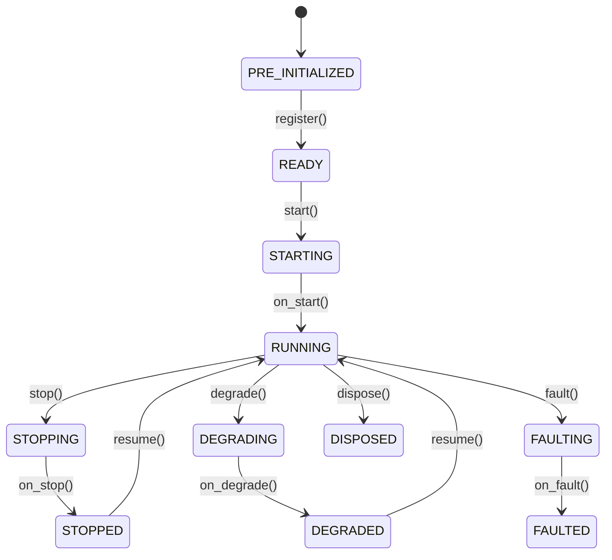

# Actors

The `DataActor` class receives data, handles events, and manages state. The `Strategy` class extends it
with order management capabilities.

**Key capabilities**:

- Data subscription and requests (market data, custom data).
- Event handling and publishing.
- Timers and alerts.
- Cache access.
- Logging.

## Basic example

Actors support configuration through a pattern similar to strategies.

```python
from collections.abc import Sequence

from nautilus_trader.common import DataActor
from nautilus_trader.config import DataActorConfig
from nautilus_trader.model import Bar
from nautilus_trader.model import BarType
from nautilus_trader.model import InstrumentId


class MyActorConfig(DataActorConfig):
    def __init__(
        self,
        instrument_id: InstrumentId,
        bar_type: BarType,
        lookback_period: int = 10,
        **_kwargs,
    ) -> None:
        self.instrument_id = instrument_id
        self.bar_type = bar_type
        self.lookback_period = lookback_period


class MyActor(DataActor):
    def __init__(self, config: MyActorConfig) -> None:
        super().__init__(config)

        # Custom state variables
        self.count_of_processed_bars: int = 0

    def on_start(self) -> None:
        # Subscribe to bars matching the configured bar type
        self.subscribe_bars(self.config.bar_type)

    def on_bar(self, bar: Bar) -> None:
        self.count_of_processed_bars += 1
```

## Actor configuration and IDs

Data actors can receive a `DataActorConfig` subclass. The base config may include an `actor_id`;
if supplied, the actor registers with that ID. If omitted, the system derives a runtime
actor ID.

Treat configuration as construction data for the actor. Read user-supplied settings through
`self.config`, and keep runtime state on the actor itself.

:::info Rust implementation
For Rust actors, generated or assigned runtime IDs live on the actor core rather than being
written back into `DataActorConfig`. This differs from Python bridge paths which may copy
inherited config fields into runtime state when a Python object is created from an importable
config.

Rust authors implement `DataActor` and use the facade methods on `self`.
`DataActorNative` is native-only access for runtime wiring and borrowed
core state. Import it only for same-binary performance paths or internal runtime wiring.
:::

## Lifecycle

Actors follow a defined state machine through their lifecycle:



Override these methods to hook into lifecycle events:

| Method         | When called                                                         |
| -------------- | ------------------------------------------------------------------- |
| `on_start()`   | Actor is starting (subscribe to data here).                         |
| `on_stop()`    | Actor is stopping (cancel timers, clean up resources).              |
| `on_resume()`  | Actor is resuming from a stopped state.                             |
| `on_reset()`   | Reset indicators and internal state (called between backtest runs). |
| `on_degrade()` | Actor is entering a degraded state (partial functionality).         |
| `on_fault()`   | Actor has encountered a fault.                                      |
| `on_dispose()` | Actor is being disposed (final cleanup).                            |

## Timers and alerts

Actors have access to a clock for scheduling:

```python
def on_start(self) -> None:
    # Set a recurring timer with a callback (fires every 5 seconds)
    self.clock.set_timer(
        "my_timer",
        timedelta(seconds=5),
        callback=self._on_timer,
    )

    # Set a one-time alert with a callback
    self.clock.set_time_alert(
        "my_alert",
        self.clock.utc_now() + timedelta(minutes=1),
        callback=self._on_alert,
    )


def on_stop(self) -> None:
    # Cancel timers to prevent resource leaks across stop/resume cycles
    self.clock.cancel_timer("my_timer")


def _on_timer(self, event: TimeEvent) -> None:
    self.log.info("Timer fired!")


def _on_alert(self, event: TimeEvent) -> None:
    self.log.info("Alert triggered!")
```

Pass a `callback` to direct `TimeEvent` objects to your own method. If you omit the callback, the
event is delivered to `on_time_event` instead.

## System access

Actors have access to core system components:

| Property     | Description                                                             |
| ------------ | ----------------------------------------------------------------------- |
| `self.cache` | Shared state for instruments, orders, positions, etc.                   |
| `self.clock` | Current time and timer/alert scheduling.                                |
| `self.log`   | Structured logging.                                                     |
| Signals      | Publish and subscribe with `publish_signal()` and `subscribe_signal()`. |

For supported custom messaging between Python components, use signals. The raw message bus remains
an internal runtime surface.

## Data handling and callbacks

The system uses different callback handlers depending on whether data is historical or real-time.
Understanding the relationship between data *requests/subscriptions* and their handlers is key.

### Historical vs real-time data

The system distinguishes between two data flows:

1. **Historical data** (from *requests*):
   - Obtained through methods like `request_bars()`, `request_quotes()`, etc.
   - Processed through type-specific batch handlers such as `on_historical_bars()` and
     `on_historical_quotes()`.
   - Custom data uses `on_historical_data()` once per response. A scalar `CustomData` arrives as
     that object, while a batch arrives as one list, including an empty list.
   - Used for initial data loading and historical analysis.

2. **Real-time data** (from *subscriptions*):
   - Obtained through methods like `subscribe_bars()`, `subscribe_quotes()`, etc.
   - Processed through specific handlers like `on_bar()`, `on_quote()`, etc.
   - Used for live data processing.

### Callback handlers

Different data operations map to these handlers:

| Operation                       | Category   | Handler                         | Purpose                                         |
| ------------------------------- | ---------- | ------------------------------- | ----------------------------------------------- |
| `subscribe_data()`              | Real‑time  | `on_data()`                     | Live data updates.                              |
| `subscribe_instrument()`        | Real‑time  | `on_instrument()`               | Live instrument definition updates.             |
| `subscribe_instruments()`       | Real‑time  | `on_instrument()`               | Live instrument definition updates (for venue). |
| `subscribe_book_deltas()`       | Real‑time  | `on_book_deltas()`              | Live order book deltas.                         |
| `subscribe_book_depth10()`      | Real‑time  | `on_book_depth()`               | Live order book depth snapshots.                |
| `subscribe_book_at_interval()`  | Real‑time  | `on_book()`                     | Live order book snapshots at intervals.         |
| `subscribe_quotes()`            | Real‑time  | `on_quote()`                    | Live quote updates.                             |
| `subscribe_trades()`            | Real‑time  | `on_trade()`                    | Live trade updates.                             |
| `subscribe_mark_prices()`       | Real‑time  | `on_mark_price()`               | Live mark price updates.                        |
| `subscribe_index_prices()`      | Real‑time  | `on_index_price()`              | Live index price updates.                       |
| `subscribe_bars()`              | Real‑time  | `on_bar()`                      | Live bar updates.                               |
| `subscribe_funding_rates()`     | Real‑time  | `on_funding_rate()`             | Live funding rate updates.                      |
| `subscribe_instrument_status()` | Real‑time  | `on_instrument_status()`        | Live instrument status updates.                 |
| `subscribe_instrument_close()`  | Real‑time  | `on_instrument_close()`         | Live instrument close updates.                  |
| `subscribe_option_greeks()`     | Real‑time  | `on_option_greeks()`            | Live option greeks updates.                     |
| `subscribe_option_chain()`      | Real‑time  | `on_option_chain()`             | Live option chain slice snapshots.              |
| `request_data()`                | Historical | `on_historical_data()`          | Historical custom data.                         |
| `request_book_deltas()`         | Historical | `on_historical_book_deltas()`   | Historical order book deltas.                   |
| `request_book_depth()`          | Historical | `on_historical_book_depth()`    | Historical order book depth.                    |
| `request_book_snapshot()`       | Historical | `on_book()`                     | Historical order book snapshot.                 |
| `request_instrument()`          | Historical | `on_instrument()`               | Instrument definition.                          |
| `request_instruments()`         | Historical | `on_instrument()`               | Instrument definitions.                         |
| `request_quotes()`              | Historical | `on_historical_quotes()`        | Historical quotes.                              |
| `request_trades()`              | Historical | `on_historical_trades()`        | Historical trades.                              |
| `request_bars()`                | Historical | `on_historical_bars()`          | Historical bars.                                |
| `request_funding_rates()`       | Historical | `on_historical_funding_rates()` | Historical funding rates.                       |

### Example

This example shows both historical and real-time data handling:

```python
from nautilus_trader.common import DataActor
from nautilus_trader.config import DataActorConfig
from nautilus_trader.model import Bar
from nautilus_trader.model import BarType
from nautilus_trader.model import InstrumentId


class MyActorConfig(DataActorConfig):
    def __init__(self, instrument_id: InstrumentId, bar_type: BarType, **_kwargs) -> None:
        self.instrument_id = instrument_id
        self.bar_type = bar_type


class MyActor(DataActor):
    def __init__(self, config: MyActorConfig) -> None:
        super().__init__(config)
        self.bar_type = config.bar_type

    def on_start(self) -> None:
        # Request historical bars, which are processed by on_historical_bars()
        self.request_bars(
            bar_type=self.bar_type,
            start=None,
            end=None,
            limit=None,
            client_id=None,
            params=None,
        )

        # Subscribe to real-time data - will be processed by on_bar() handler
        self.subscribe_bars(
            bar_type=self.bar_type,
            # Many optional parameters
            client_id=None,  # ClientId, optional
            params=None,  # dict[str, Any], optional
        )

    def on_historical_bars(self, bars: Sequence[Bar]) -> None:
        for bar in bars:
            self.log.info(f"Received historical bar: {bar}")

    def on_bar(self, bar: Bar) -> None:
        # Handle real-time bar updates (from subscriptions)
        self.log.info(f"Received real-time bar: {bar}")
```

Separating historical and real-time handlers lets you apply different processing logic
based on context. For example:

- Use historical data to initialize indicators or establish baseline metrics.
- Process real-time data differently for live trading decisions.
- Apply different validation or logging for historical vs real-time data.

:::tip
When debugging data flow issues, check that you're looking at the correct handler for your data source.
If you're not seeing data in `on_bar()` but see log messages about receiving bars, check
`on_historical_bars()` because the data might be coming from a request rather than a subscription.
:::

## Order event handling

The Python `DataActor` API does not expose order event callbacks or the raw message bus. Handle
order events in a `Strategy` through its specific order callbacks or `on_order_event()`. Use signals
to pass derived values to a data actor when another component needs them. See
[Strategies: order management](strategies.md#order-management) for the callback list.

## Related guides

- [Strategies](strategies.md) - Strategies extend actors with order management capabilities.
- [Data](data/) - Data types and subscriptions available to actors.
- [Message Bus](message_bus.md) - The messaging system actors use for communication.
