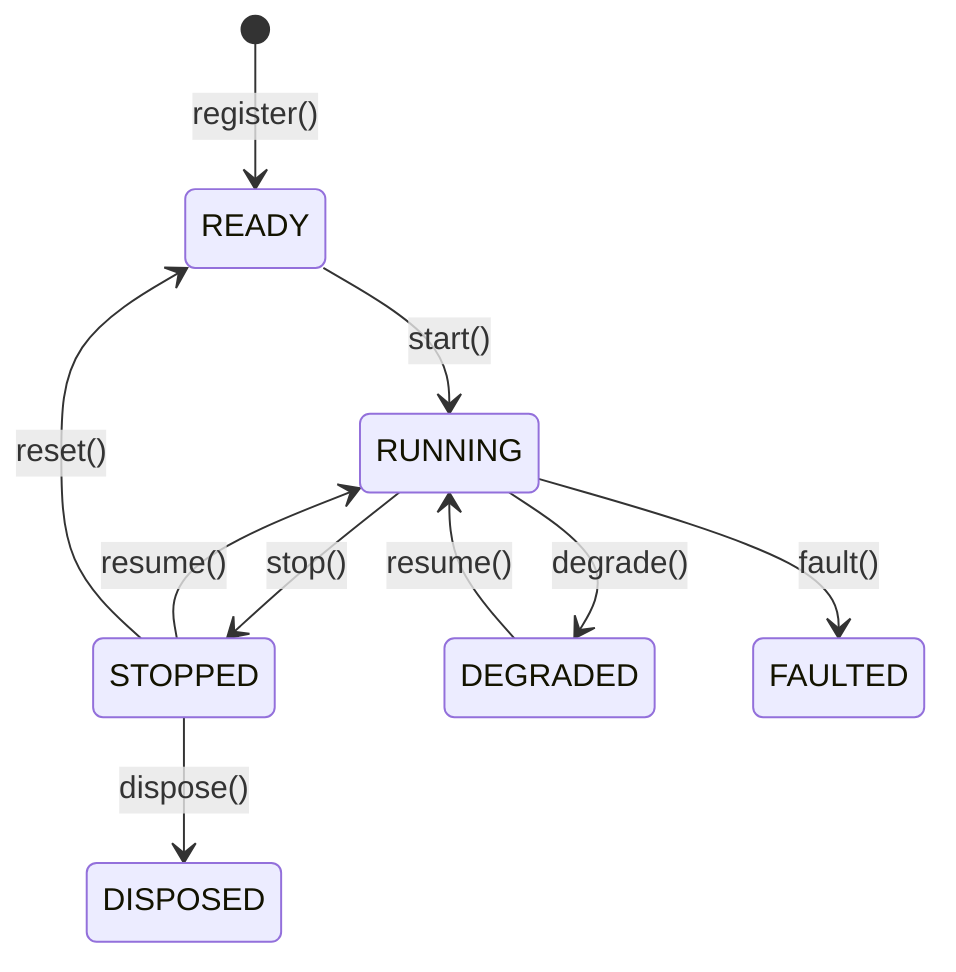

# Actors

A data actor receives requested and subscribed data, handles system events, and manages component
state. In Python, extend the `DataActor` class; in Rust, implement the `DataActor` trait. A strategy
adds order‑management capabilities.

**Key capabilities**:

- Market and custom data subscriptions and requests.
- Custom data and signal publishing.
- Event, timer, and alert handling.
- Cache access.
- Structured logging.

## Basic Python example

Actors support configuration through a pattern similar to strategies.

```python
from nautilus_trader.common import DataActor
from nautilus_trader.config import DataActorConfig
from nautilus_trader.model import Bar
from nautilus_trader.model import BarType


class MyActorConfig(DataActorConfig):
    def __init__(self, bar_type: BarType, **_kwargs) -> None:
        self.bar_type = bar_type


class MyActor(DataActor):
    def __init__(self, config: MyActorConfig) -> None:
        super().__init__(config)

        # Keep runtime state on the actor
        self.count_of_processed_bars: int = 0

    def on_start(self) -> None:
        # Subscribe to bars matching the configured bar type
        self.subscribe_bars(self.config.bar_type)

    def on_bar(self, bar: Bar) -> None:
        self.count_of_processed_bars += 1
```

## Actor configuration and IDs

Data actors can receive a `DataActorConfig` subclass. The base config accepts an optional `actor_id`.
If supplied, the actor registers with that ID; otherwise, the system derives a runtime actor ID.

Treat configuration as construction data for the actor. Read user‑supplied settings through
`self.config`, and keep runtime state on the actor itself.

:::info Rust implementation
Rust actors store runtime identity and state in `DataActorCore`. Read the runtime ID through
`actor_id()` rather than expecting a generated ID to be written back into `DataActorConfig`.

Rust authors implement `DataActor` and use the facade methods on `self`.
`DataActorNative` is native‑only access for runtime wiring and borrowed
core state. Import it only for same‑binary performance paths or internal runtime wiring.
:::

## Lifecycle

Actors move through the main stable states shown below:



Main flow only: transitional states and less common valid edges are omitted. For actions with a
lifecycle handler, the actor reaches the destination state only after that handler succeeds.

Override these methods to hook into lifecycle events:

| Method         | When called                                                                    |
| -------------- | ------------------------------------------------------------------------------ |
| `on_start()`   | Actor is starting; subscribe to data here.                                     |
| `on_stop()`    | Actor is stopping; clean up actor‑owned resources.                             |
| `on_resume()`  | Actor is resuming after it stopped or degraded.                                |
| `on_reset()`   | Actor is resetting, including when the engine resets between backtest runs.    |
| `on_degrade()` | Actor is entering a degraded state and may provide only partial functionality. |
| `on_fault()`   | Actor is entering the faulted state after it encounters a fault.               |
| `on_dispose()` | Actor is being disposed and must release its remaining resources.              |

## Timers and alerts

Actors have access to a clock for scheduling:

```python
from datetime import timedelta

from nautilus_trader.common import TimeEvent


def on_start(self) -> None:
    self._schedule_clock_events()


def on_resume(self) -> None:
    self._schedule_clock_events()


def on_stop(self) -> None:
    self._cancel_clock_events()


def on_degrade(self) -> None:
    self._cancel_clock_events()


def _cancel_clock_events(self) -> None:
    self.clock.cancel_timer("my_actor.timer")
    self.clock.cancel_timer("my_actor.alert")


def _schedule_clock_events(self) -> None:
    # Set a recurring timer with a callback that fires every 5 seconds
    self.clock.set_timer(
        "my_actor.timer",
        timedelta(seconds=5),
        callback=self._on_timer,
    )

    # Set a one-time alert with a callback
    self.clock.set_time_alert(
        "my_actor.alert",
        self.clock.utc_now() + timedelta(minutes=1),
        callback=self._on_alert,
    )


def _on_timer(self, event: TimeEvent) -> None:
    self.log.info("Timer fired!")


def _on_alert(self, event: TimeEvent) -> None:
    self.log.info("Alert triggered!")
```

Pass a `callback` to direct `TimeEvent` objects to your own method. Without one, the actor runtime
connects the clock's registered default handler to `on_time_event()`. Use explicit callbacks when
components share a clock. Timer names also share the clock's namespace, so use names unique to the
component; registering the same name replaces the existing timer.

## System access

Actors have access to core system components:

| API                                       | Description                                          |
| ----------------------------------------- | ---------------------------------------------------- |
| `self.cache`                              | Shared state for instruments, orders, and positions. |
| `self.clock`                              | Current time and timer or alert scheduling.          |
| `self.log`                                | Structured logging.                                  |
| `publish_data()` / `subscribe_data()`     | Structured custom data messaging.                    |
| `publish_signal()` / `subscribe_signal()` | Lightweight alerts and notifications.                |
| `subscribe_queue_state()`                 | Live runner queue pressure state changes.            |
| `subscribe_socket_state()`                | Live socket transport state changes.                 |
| `unsubscribe_queue_state()`               | Stop receiving runner queue pressure state changes.  |
| `unsubscribe_socket_state()`              | Stop receiving socket transport state changes.       |
| `on_queue_state()`                        | Handle a runner queue pressure state change.         |
| `on_socket_state()`                       | Handle a socket transport state change.              |

The Python `DataActor` and `Strategy` APIs do not expose `self.msgbus`. Use custom data for
structured payloads and signals for lightweight values.

### Queue pressure state

Actors can subscribe to runner queue pressure state changes:

```rust tab="Rust"
use nautilus_common::{
    actor::DataActor,
    messages::system::QueueStateChanged,
};

impl DataActor for MyActor {
    fn on_start(&mut self) -> anyhow::Result<()> {
        self.subscribe_queue_state(Some(50));
        Ok(())
    }

    fn on_stop(&mut self) -> anyhow::Result<()> {
        self.unsubscribe_queue_state();
        Ok(())
    }

    fn on_queue_state(&mut self, event: &QueueStateChanged) -> anyhow::Result<()> {
        log::warn!(
            "Queue {:?} changed {:?} to {:?} at depth {}",
            event.channel,
            event.condition,
            event.state,
            event.queue_depth,
        );
        Ok(())
    }
}
```

```python tab="Python"
from nautilus_trader.common import QueueStateChanged


def on_start(self) -> None:
    self.subscribe_queue_state(priority=50)


def on_stop(self) -> None:
    self.unsubscribe_queue_state()


def on_queue_state(self, event: QueueStateChanged) -> None:
    self.log.warning(
        f"Queue {event.channel} changed {event.condition} to {event.state} "
        f"at depth {event.queue_depth}",
    )
```

The optional priority controls delivery order among matching subscribers. Higher values run first.
Subscribing again does not change an existing priority; unsubscribe before subscribing with a new
priority.

`QueueStateChanged` includes the trader ID, runner channel, queue condition, condition state, queue
depth, mean dispatch time, event ID, and timestamps. Delivery uses the typed in‑process message bus
and has no external wire representation. See
[Queue pressure monitoring](live.md#queue-pressure-monitoring) for the trigger and clear semantics.

### Socket transport state

Actors can subscribe to socket state changes from live adapters that report them:

```rust tab="Rust"
use nautilus_common::{
    actor::DataActor,
    messages::system::SocketStateChanged,
};

impl DataActor for MyActor {
    fn on_start(&mut self) -> anyhow::Result<()> {
        self.subscribe_socket_state(Some(50));
        Ok(())
    }

    fn on_stop(&mut self) -> anyhow::Result<()> {
        self.unsubscribe_socket_state();
        Ok(())
    }

    fn on_socket_state(&mut self, event: &SocketStateChanged) -> anyhow::Result<()> {
        log::info!(
            "Socket {} for {} changed to {:?}",
            event.endpoint,
            event.client_id,
            event.state,
        );
        Ok(())
    }
}
```

```python tab="Python"
from nautilus_trader.common import SocketStateChanged


def on_start(self) -> None:
    self.subscribe_socket_state(priority=50)


def on_stop(self) -> None:
    self.unsubscribe_socket_state()


def on_socket_state(self, event: SocketStateChanged) -> None:
    self.log.info(
        f"Socket {event.endpoint} for {event.client_id} changed to {event.state}",
    )
```

The optional priority controls delivery order among matching subscribers. Higher values run first.
Subscribing again does not change an existing priority; unsubscribe before subscribing with a new
priority.

`SocketStateChanged` includes the trader ID, client ID, optional venue, stable endpoint label,
transport state, event ID, and timestamps. `SocketState.CONNECTED` reports transport availability,
not authentication, subscription replay, or adapter readiness. `SocketState.DISCONNECTED` reports
the loss of an active transport. The endpoint is a non‑secret logical label, not a raw connection
URL.

Delivery uses the typed in‑process message bus and has no external wire representation. See
[Socket transport state](live.md#socket-transport-state) for supported adapters and the precise
connection edge semantics.

## Data handling and callbacks

The system dispatches request responses separately from subscribed updates. The operation determines
which callback handles the data.

### Request responses and subscriptions

The system distinguishes between two data flows:

1. **Request responses**:
   - Obtained through methods like `request_bars()`, `request_quotes()`, etc.
   - Processed through type‑specific batch handlers such as `on_historical_bars()` and
     `on_historical_quotes()`.
   - Custom data uses `on_historical_data()` once per response. A scalar `CustomData` arrives as
     that object, while a batch arrives as one list, including an empty list.
   - Used for initial data loading and historical analysis.

2. **Subscribed data**:
   - Obtained through methods like `subscribe_bars()`, `subscribe_quotes()`, etc.
   - Processed through specific handlers like `on_bar()`, `on_quote()`, etc.
   - Used for ongoing event processing.

### Callback handlers

Common data operations map to these handlers:

| Operation                       | Category     | Handler                         | Purpose                                    |
| ------------------------------- | ------------ | ------------------------------- | ------------------------------------------ |
| `subscribe_data()`              | Subscription | `on_data()`                     | Custom data updates.                       |
| `subscribe_signal()`            | Subscription | `on_signal()`                   | Signal updates.                            |
| `subscribe_instrument()`        | Subscription | `on_instrument()`               | Instrument definition updates.             |
| `subscribe_instruments()`       | Subscription | `on_instrument()`               | Instrument definition updates for a venue. |
| `subscribe_book_deltas()`       | Subscription | `on_book_deltas()`              | Order book deltas.                         |
| `subscribe_book_depth10()`      | Subscription | `on_book_depth()`               | Order book depth snapshots.                |
| `subscribe_book_at_interval()`  | Subscription | `on_book()`                     | Order book snapshots at intervals.         |
| `subscribe_quotes()`            | Subscription | `on_quote()`                    | Quote updates.                             |
| `subscribe_trades()`            | Subscription | `on_trade()`                    | Trade updates.                             |
| `subscribe_mark_prices()`       | Subscription | `on_mark_price()`               | Mark price updates.                        |
| `subscribe_index_prices()`      | Subscription | `on_index_price()`              | Index price updates.                       |
| `subscribe_bars()`              | Subscription | `on_bar()`                      | Bar updates.                               |
| `subscribe_funding_rates()`     | Subscription | `on_funding_rate()`             | Funding rate updates.                      |
| `subscribe_instrument_status()` | Subscription | `on_instrument_status()`        | Instrument status updates.                 |
| `subscribe_instrument_close()`  | Subscription | `on_instrument_close()`         | Instrument close updates.                  |
| `subscribe_option_greeks()`     | Subscription | `on_option_greeks()`            | Option Greek updates.                      |
| `subscribe_option_chain()`      | Subscription | `on_option_chain()`             | Option chain slice snapshots.              |
| `request_data()`                | Request      | `on_historical_data()`          | Historical custom data.                    |
| `request_book_deltas()`         | Request      | `on_historical_book_deltas()`   | Historical order book deltas.              |
| `request_book_depth()`          | Request      | `on_historical_book_depth()`    | Historical order book depth.               |
| `request_book_snapshot()`       | Request      | `on_book()`                     | Order book snapshot.                       |
| `request_instrument()`          | Request      | `on_instrument()`               | Instrument definition.                     |
| `request_instruments()`         | Request      | `on_instrument()`               | Instrument definitions.                    |
| `request_quotes()`              | Request      | `on_historical_quotes()`        | Historical quotes.                         |
| `request_trades()`              | Request      | `on_historical_trades()`        | Historical trades.                         |
| `request_bars()`                | Request      | `on_historical_bars()`          | Historical bars.                           |
| `request_funding_rates()`       | Request      | `on_historical_funding_rates()` | Historical funding rates.                  |

### Request and subscription example

This example shows both request and subscription handling:

```python
from collections.abc import Sequence

from nautilus_trader.common import DataActor
from nautilus_trader.config import DataActorConfig
from nautilus_trader.model import Bar
from nautilus_trader.model import BarType


class MyActorConfig(DataActorConfig):
    def __init__(self, bar_type: BarType, **_kwargs) -> None:
        self.bar_type = bar_type


class MyActor(DataActor):
    def __init__(self, config: MyActorConfig) -> None:
        super().__init__(config)

    def on_start(self) -> None:
        # Limit the historical response, which is handled by on_historical_bars()
        self.request_bars(
            bar_type=self.config.bar_type,
            limit=100,
        )

        # Deliver subscribed updates to on_bar()
        self.subscribe_bars(self.config.bar_type)

    def on_historical_bars(self, bars: Sequence[Bar]) -> None:
        for bar in bars:
            self.log.info(f"Received historical bar: {bar}")

    def on_bar(self, bar: Bar) -> None:
        self.log.info(f"Received subscribed bar: {bar}")
```

Separate request and subscription handlers let an actor distinguish bootstrap data from ongoing
updates. Use historical bars to initialize indicators or baseline state, and apply different
validation or logging to response batches and individual subscribed updates.

:::tip
When debugging data flow issues, check that you're looking at the correct handler for your data source.
If you're not seeing data in `on_bar()` but see log messages about receiving bars, check
`on_historical_bars()` because the data might be coming from a request rather than a subscription.
:::

## Order event handling

Data actors do not manage orders or define order event callbacks. Handle order events in a `Strategy`
through its specific order callbacks or `on_order_event()`. Use custom data or signals to pass
derived values to a data actor when another component needs them. See
[Strategies: order management](strategies.md#order-management) for the callback list.

## Related guides

- [Strategies](strategies.md): Strategies extend actors with order‑management capabilities.
- [Data](data/): Data types and subscriptions available to actors.
- [Message Bus](message_bus.md): The messaging system actors use for communication.
