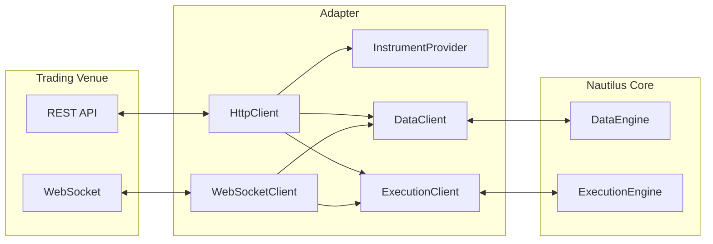

# Adapters

Adapters connect data providers and trading venues to NautilusTrader. They translate
venue-specific protocols into the domain objects and events used by the data and execution engines.
Official Python adapters are available from `nautilus_trader.adapters`; the
[integration guides](../integrations/index.md) document their supported capabilities.

An adapter typically comprises these components:



| Component            | Purpose                                                   |
| -------------------- | --------------------------------------------------------- |
| `HttpClient`         | REST API communication.                                   |
| `WebSocketClient`    | Real-time streaming connection.                           |
| `InstrumentProvider` | Loads and parses instrument definitions from the venue.   |
| `DataClient`         | Handles market data subscriptions and requests.           |
| `ExecutionClient`    | Handles order submission, modification, and cancellation. |

## Configuration and routing

Each adapter exposes configuration types and factories for the clients it supports. Configs select
venue-specific settings such as the product, environment, credentials, and instrument loading
policy. Factories construct the clients when a `LiveNode` is built. Actors and strategies then use
the common Nautilus APIs rather than calling adapter transports directly.

A node can register multiple data and execution clients. Pass `client_id` from an actor or strategy
when a specific client must handle a request, subscription, or order. Without an explicit client,
the data and execution engines use the venue and default routes configured by the node.

## Custom adapters

You can develop an adapter as a separate Python package without rebuilding NautilusTrader. Custom
adapters implement the same data and execution responsibilities as built-in adapters, and can run
alongside them in one `LiveNode`. Strategies continue to use the standard request, subscription, and
order APIs; the node routes those operations to the registered clients.

A custom package can implement its clients in Python or delegate venue operations to its own
Rust/PyO3 extension. Both use the [Python client interface](../developer_guide/python_adapters.md).
An independent extension exchanges Python objects from the installed NautilusTrader wheel through
PyO3 and the GIL. It does not require a shared Rust ABI or a second copy of the Nautilus model types.
Choose a package version tested against your installed NautilusTrader release.

Register the package's factories and configs with the node under distinct client names. Custom
configs can retain venue-specific fields, and importable configs support loading factories from
package paths. Set venue and default routes as you would for built-in clients, or select a client
explicitly from a strategy. The [deterministic Python template](../../examples/live/_template/README.md)
demonstrates data delivery, execution reconciliation, and an order fill without a venue connection.

### Cache and state ownership

Custom clients receive a read-only cache view. They can inspect instruments, quotes, orders,
accounts, and positions, but cannot mutate the core cache. Returned objects are snapshots: changing
a snapshot does not change the state seen by strategies or engines.

Adapters operate outside the synchronous core boundary. They submit typed data, responses, and
execution events for the core to process, so an adapter's output call does not mean the corresponding
cache update has already occurred. This keeps cache mutation and engine state transitions under
core ownership. Cache access and output remain bound to the owning node's thread and lifetime;
holding the GIL alone does not permit access from another thread or after disposal.

### Running and stopping

Use `node.run()` when the node owns its event loop, or await `node.run_async()` inside an existing
asyncio application. Both launch modes support custom Python and independent PyO3 clients. The
node binds clients to the running loop before connection, then uses its normal startup,
reconciliation, and shutdown sequence. Constructors do not start networking or background tasks.

Commands and subscription changes execute in admission order for each custom client. Historical
requests and reconciliation can progress separately. A slow command delays later commands for that
client, and a full command queue rejects new work rather than silently dropping it.

Await shutdown before closing a host event loop. Disconnection stops admission and asks adapter
work to terminate; requesting cancellation does not prove that work has finished. Incomplete
cleanup is reported. Client instances belong to one node run and must not be reused for another.

Redis/PostgreSQL cache backing is unsupported with custom clients in either launch mode. The
interface also requires migration of v1 Cython adapters rather than accepting their source
unchanged. See the [migration details and remaining limitations](../developer_guide/python_adapters.md#migration-from-v1)
for historical request completion, revised bars, custom publication/subscription, and networking
API differences. For independent extensions, see
[package construction and installed-wheel validation](../developer_guide/python_adapters.md#independent-rustpyo3-packages).

## Instrument providers

Instrument providers load venue definitions and parse them into Nautilus `Instrument` objects.
Each adapter owns this behavior. Its Python API may expose a standalone loader, a dedicated
provider config, loading behavior through its client config, or a combination of these.

An `InstrumentProvider` serves two use cases:

- Standalone discovery of available instruments for research or backtesting
- Runtime loading in a `sandbox` or `live` [environment context](architecture.md#environment-contexts)
  for actors and strategies

### Research and backtesting

This example loads one Binance USD-M instrument through the public Python API:

```python
import asyncio

from nautilus_trader.adapters.binance import BinanceDataClientConfig
from nautilus_trader.adapters.binance import BinanceEnvironment
from nautilus_trader.adapters.binance import BinanceInstrumentProviderConfig
from nautilus_trader.adapters.binance import BinanceProductType
from nautilus_trader.adapters.binance import load_binance_instruments


async def main() -> None:
    config = BinanceDataClientConfig(
        product_type=BinanceProductType.USD_M,
        environment=BinanceEnvironment.LIVE,
        instrument_provider=BinanceInstrumentProviderConfig(
            load_all=False,
            load_ids=["BTCUSDT-PERP.BINANCE"],
        ),
    )
    instruments = await load_binance_instruments(config)

    for instrument in instruments:
        print(instrument.id)


if __name__ == "__main__":
    asyncio.run(main())
```

### Live trading

Each integration handles startup loading differently. For example, the Binance provider config can
load the full catalog:

```python
from nautilus_trader.adapters.binance import BinanceInstrumentProviderConfig

BinanceInstrumentProviderConfig(load_all=True)
```

It can instead load only specified instruments:

```python
BinanceInstrumentProviderConfig(
    load_all=False,
    load_ids=["BTCUSDT-PERP.BINANCE", "ETHUSDT-PERP.BINANCE"],
)
```

`load_ids` contains Nautilus instrument IDs, including the venue suffix, rather than raw venue
symbols.

Instrument-loading settings, defaults, and filters vary by integration. Check the relevant
integration guide before copying a config between adapters.

Subscriptions, order submission, and execution reconciliation do not load instruments by themselves.
Configure the adapter to load each required instrument at startup, or request it explicitly and wait
until it reaches the cache before using it. For how reconciliation treats a report whose instrument
is not loaded, see
[instrument availability](execution/reconciliation.md#instrument-availability).

## Data clients

Data clients handle market data subscriptions and requests for a venue. They connect to venue APIs
and normalize incoming data into Nautilus types.

### Requesting data

Actors and strategies can request data using built-in methods. Data returns via callbacks:

```python
from collections.abc import Sequence
from typing import Any

from nautilus_trader.model import Bar
from nautilus_trader.model import BarType
from nautilus_trader.model import InstrumentId
from nautilus_trader.trading import Strategy


class MyStrategy(Strategy):
    def on_start(self) -> None:
        # Request an instrument definition
        self.request_instrument(InstrumentId.from_str("BTCUSDT-PERP.BINANCE"))

        # Request historical bars
        self.request_bars(BarType.from_str("BTCUSDT-PERP.BINANCE-1-HOUR-LAST-EXTERNAL"))

    def on_instrument(self, instrument: Any) -> None:
        self.log.info(f"Received instrument: {instrument.id}")

    def on_historical_bars(self, bars: Sequence[Bar]) -> None:
        self.log.info(f"Received {len(bars)} historical bars")
```

### Subscribing to data

For real-time data, use subscription methods:

```python
from nautilus_trader.model import Bar
from nautilus_trader.model import BarType
from nautilus_trader.model import InstrumentId
from nautilus_trader.model import TradeTick
from nautilus_trader.trading import Strategy


class MyStrategy(Strategy):
    def on_start(self) -> None:
        # Assumes the instrument has already been loaded into the cache
        self.subscribe_trades(InstrumentId.from_str("BTCUSDT-PERP.BINANCE"))
        self.subscribe_bars(BarType.from_str("BTCUSDT-PERP.BINANCE-1-MINUTE-LAST-EXTERNAL"))

    def on_trade(self, trade: TradeTick) -> None:
        self.log.info(f"Trade: {trade}")

    def on_bar(self, bar: Bar) -> None:
        self.log.info(f"Bar: {bar}")
```

:::tip
See the [Actors](actors.md) documentation for a complete reference of available
request and subscription methods with their corresponding callbacks.
:::

## Execution clients

Execution clients handle order management for a venue. They translate Nautilus order commands
into venue-specific API calls and process execution reports back into Nautilus events.

Responsibilities:

- Submit, modify, and cancel orders.
- Process fills and execution reports.
- Reconcile order state with the venue.
- Handle account and position updates.

Execution clients can declare the lower time limit applied to historical reconciliation and whether
the required order, fill, and position sources completed. When an adapter supplies this contract,
the engine can recover authoritative order state without applying historical position or portfolio
economics that the available evidence cannot support. See
[Bounded history safety](execution/reconciliation.md#bounded-history-safety).

### Reduce-only execution contract

An execution client **must never silently discard** `reduce_only=true`. It must either send a
documented venue instruction that enforces the same intent or reject the order before transport.
The venue can still reject an encoded instruction when the product does not support it, the order
would not reduce an open position, or another venue rule makes the combination invalid.

An equivalent enforcing instruction can replace the literal venue flag. For example, a Binance
Futures close-all conditional order retains `reduce_only=true` in the Nautilus order, but the
adapter sends `closePosition=true` without Binance's incompatible `reduceOnly` field. See
[Binance Futures close-position orders](../integrations/binance.md#close-position).

Backtest and sandbox matching engines enforce reduce-only when `use_reduce_only` is enabled and
reject reduce-only orders when it is disabled. Custom execution clients and external routes follow
the same send-or-reject contract.

Order commands and venue results are asynchronous. `OrderSubmitted` means that the adapter has
started the submission path, not that the venue has accepted the order. A transport failure can
leave the outcome unknown, so adapters use stream updates, queries, or reconciliation rather than
assuming a rejection.

For a new order, the `ExecutionEngine` uses an explicitly selected client, venue routing, or the
configured default. Later commands for an existing order return to its originating client when
known. See the [Execution](execution/) guide for order management from a strategy perspective.

:::tip
For building a custom adapter, see the [Adapter Developer Guide](../developer_guide/adapters.md).
:::

## Related guides

- [Live trading](live.md): Configure and run live trading with adapters.
- [Execution](execution/): Order execution through adapters.
- [Data](data/): Market data provided by adapters.
