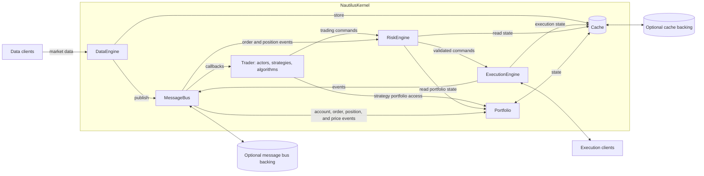
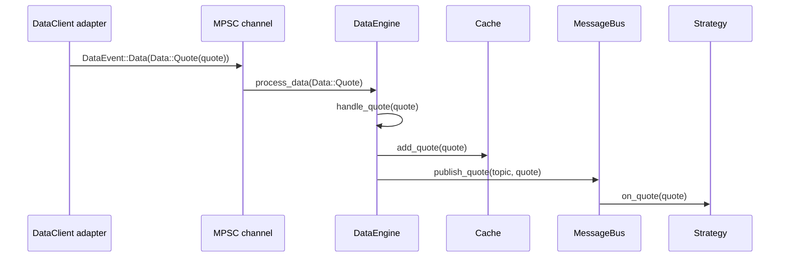
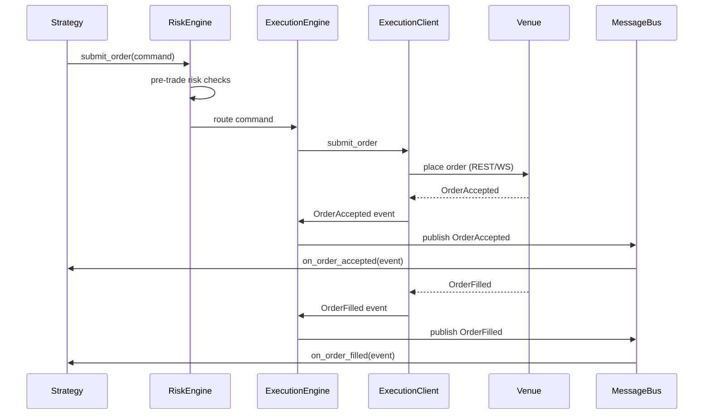
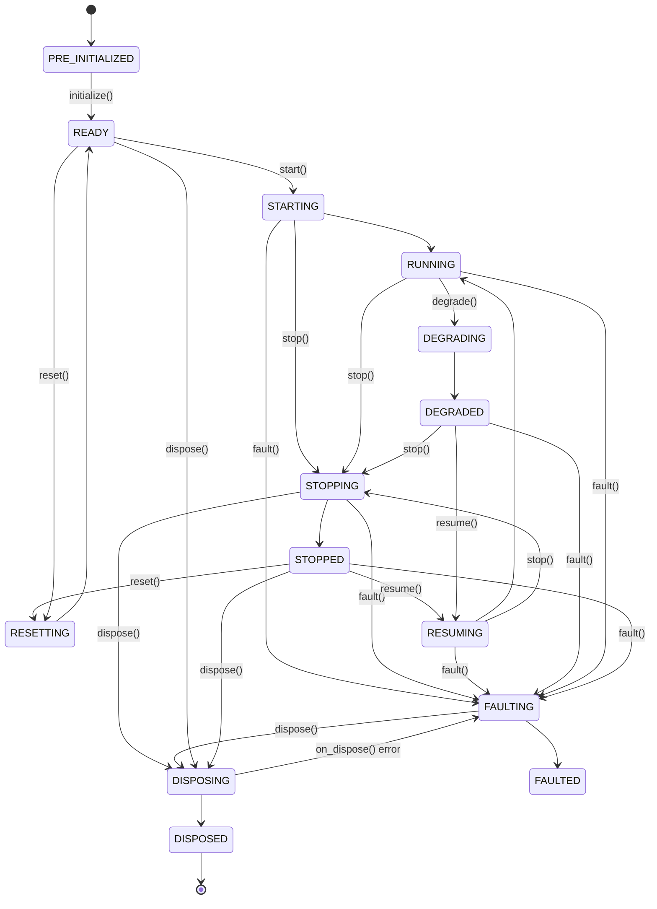
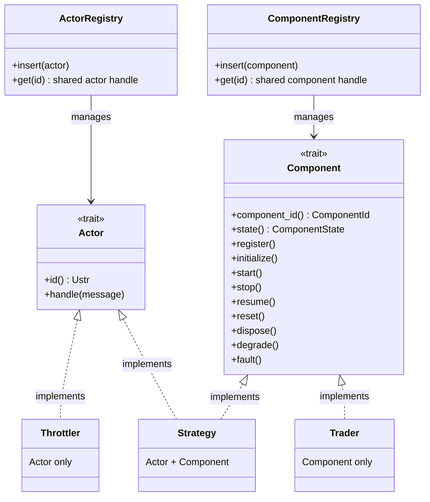
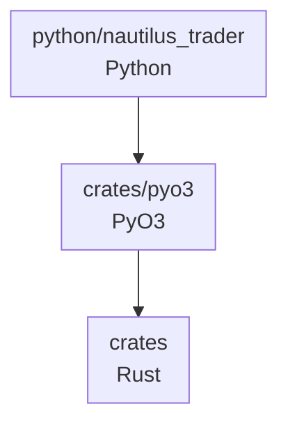
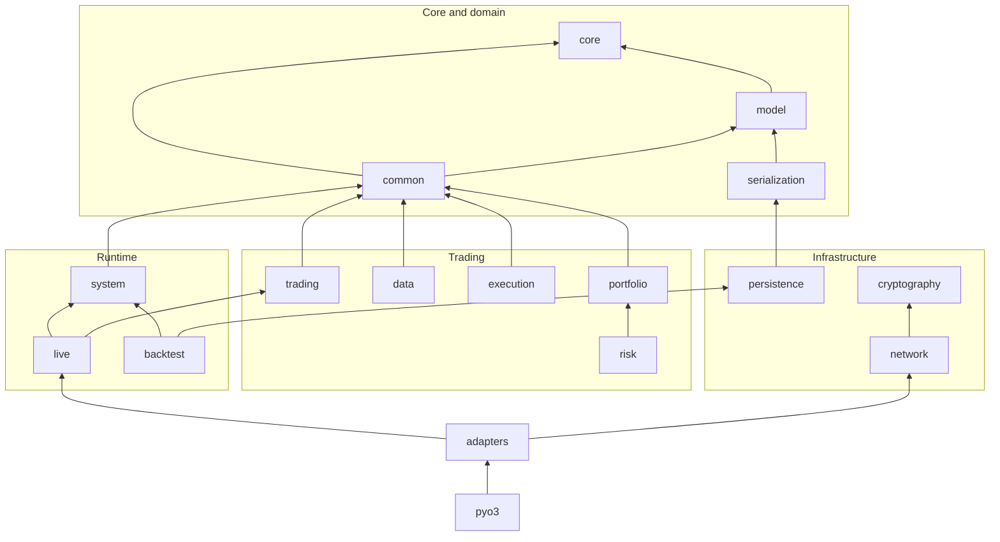

# Architecture

This page describes NautilusTrader's components, runtime boundaries, and data flows.
The [design principles and policies](../developer_guide/design_principles.md) guide this structure.

:::note
For this guide, the *Nautilus system boundary* means the runtime of one Nautilus node instance.
:::

## Architectural style

NautilusTrader uses these architectural techniques and design patterns:

- [Domain-driven design (DDD)](https://en.wikipedia.org/wiki/Domain-driven_design)
- [Event-driven architecture](https://en.wikipedia.org/wiki/Event-driven_programming)
- [Messaging patterns](https://en.wikipedia.org/wiki/Messaging_pattern) (publish/subscribe,
  request/response, and point-to-point)
- [Ports and adapters](https://en.wikipedia.org/wiki/Hexagonal_architecture_(software))
- [Crash-only design](#crash-only-design)

The [design principles and policies](../developer_guide/design_principles.md) state the priorities and contracts
these techniques support.

## System architecture

NautilusTrader provides both a framework for composing trading systems and default implementations
for several [environment contexts](#environment-contexts).

The kernel owns the shared trading core; adapters exchange market data and execution messages
through the engine boundaries.

### Core components

#### `NautilusKernel`

The central orchestration component:

- Initializes and manages the shared core components.
- Configures the messaging infrastructure.
- Selects environment-specific clocks and behavior.
- Coordinates shared resources and lifecycle management.
- Provides one lifecycle boundary for system operations.

#### `MessageBus`

`MessageBus` centrally routes inter-component communication:

- **Publish/subscribe**: Broadcasts events and data to multiple consumers.
- **Request/response**: Correlates requests with their responses.
- **Command/event messaging**: Routes actions and state changes through typed endpoints.
- **Optional external backing**: Sends selected publications and, for live nodes, receives
  configured external streams through a backing such as Redis. These streams provide live
  transport; durable state recovery belongs to the cache or event store.

#### `Cache`

`Cache` keeps trading state in memory:

- Stores instruments, accounts, orders, positions, and more.
- Provides indexed reads for trading components.
- Optionally persists configured state through a cache database backing.

#### `DataEngine`

Processes and routes market data throughout the system:

- Handles quotes, trades, bars, order books, custom data, and other supported types.
- Manages subscriptions and correlated request/response flows through data clients.
- Keeps each client subscription active until its final owner releases it, retaining the original
  client route and parameters for the final unsubscribe.
- Routes resulting data to consumers according to their subscriptions and requests.
- Manages data flow from external sources to internal components.

#### `ExecutionEngine`

Manages order lifecycle and execution:

- Routes trading commands to the appropriate execution clients.
- Tracks order and position states.
- Coordinates with risk management systems.
- Handles execution reports and fills from venues.
- Handles reconciliation of external execution state.

#### `RiskEngine`

Provides risk management:

- Validates order fields, balances, quantities, notionals, reduce-only behavior, and trading state.
- Applies configurable submission and modification rate limits.
- Monitors order and position events used by its controls.

#### `Portfolio`

Maintains derived account and position state:

- Tracks balances, net positions, margin, realized and unrealized profit and loss (PnL), and
  exposure.
- Updates state and valuations from account, order, position, quote, bar, and mark-price events.

#### `Trader`

Coordinates user trading components:

- Registers actors, strategies, and execution algorithms.
- Manages their lifecycle, clocks, and event subscriptions.

### Environment contexts

An environment context defines the data source and execution setting for a node:

- `Backtest`: Historical data with simulated execution.
- `Sandbox`: Real-time data with simulated execution.
- `Live`: Real-time data with live venue connections, including paper or real accounts.

### Common core

Backtest, sandbox, and live systems share the `NautilusKernel` struct from the `nautilus-system`
crate. The kernel owns the common cache, portfolio, engines, trader, clock, and messaging
infrastructure.

The *ports and adapters* architectural style enables modular components to be integrated into the
core through explicit client, backing-store, and component interfaces, including custom
implementations.

### Data and execution flow patterns

#### Data flow: life of a quote tick

The following trace shows the path a `QuoteTick` takes from the network to a
strategy. Trades and bars follow the same cache-then-publish path with different
handler names. Order book deltas and depth snapshots take a different route (see
the note below the steps).

1. **Adapter receives raw data.** A venue-specific `DataClient`, such as Binance or Bybit,
   receives a WebSocket message, parses it, and constructs a `QuoteTick`.
1. **Adapter sends a data event.** The adapter sends
   `DataEvent::Data(Data::Quote(quote))` through an MPSC channel. In live mode
   this is an async unbounded channel; in backtests the engine feeds data directly.
1. **`DataEngine` processes the event.** The channel receiver routes the event to
   `DataEngine::process_data`, which dispatches to `handle_quote`.
1. **`Cache` stores the quote.** `handle_quote` calls `cache.add_quote(quote)`. When the insertion
   succeeds, components can read it through `self.cache.quote(instrument_id)`.
1. **`MessageBus` publishes.** The engine publishes the quote on a topic derived
   from the instrument ID, such as `data.quotes.BINANCE.BTCUSDT-PERP`. The
   `MessageBus` finds all handlers subscribed to that topic.
1. **Strategy handler runs.** Each subscribed strategy's `on_quote(quote)` runs on the
   single-threaded core. After a successful cache insertion,
   `self.cache.quote(instrument_id)` returns the same quote.

:::note
For quotes, trades, and bars, the engine attempts cache insertion before publication. A synchronous
persistence or enqueue error prevents the in-memory insertion, but the engine logs the error and
still publishes the value. Built-in database backings perform the actual write asynchronously, so a
later database error does not roll back the cache insertion. Order book deltas and depth snapshots
are published directly, while `BookUpdater` subscriptions maintain book state separately.
:::

#### Execution flow: life of an order

A submitted order flows through validation and routing, then returns to the strategy as execution
events:

1. **Strategy creates a command.** The strategy calls `self.submit_order(order)`.
1. **`RiskEngine` validates.** Configured order, balance, quantity, notional, trading-state, and
   rate checks run. If a check fails, the strategy receives `OrderDenied`,
   and the order never reaches the venue.
1. **`ExecutionEngine` routes.** The command is routed to the `ExecutionClient`
   for the target venue.
1. **`ExecutionClient` submits.** The adapter sends the order to the venue over
   REST or WebSocket.
1. **Events flow back.** The venue responds with acknowledgments and fills.
   Each event (`Accepted`, `Filled`, `Canceled`, `Rejected`, or `Expired`) flows through
   the `ExecutionEngine`, which updates order state in the `Cache` and delivers
   the event to the strategy's handler. Fill events also trigger position and
   portfolio updates.

#### Component state management

Types that implement the `Component` trait use a finite state machine. `ComponentState` defines
stable and transitional states, while `ComponentTrigger` constrains valid transitions:

**Stable states:**

- **PRE_INITIALIZED**: The component exists but is not ready to fulfill its specification.
- **READY**: The component is configured and can start.
- **RUNNING**: The component operates normally and can fulfill its specification.
- **STOPPED**: The component has stopped successfully.
- **DEGRADED**: The component may not meet its full specification.
- **FAULTED**: The component has shut down because of a detected fault.
- **DISPOSED**: The component has shut down and released its resources.

**Transitional states:**

- **STARTING**: The component is executing its `start` actions.
- **STOPPING**: The component is executing its `stop` actions.
- **RESUMING**: The component is executing its `resume` actions after a stop or degradation.
- **RESETTING**: The component is executing its `reset` actions.
- **DISPOSING**: The component is executing its `dispose` actions.
- **DEGRADING**: The component is executing its `degrade` actions.
- **FAULTING**: The component is executing its `fault` actions.

Transitional states cover the corresponding lifecycle callback and should remain brief. If a
callback returns an error, the transition halts in its transitional state. `dispose()` is the
exception: a failing `on_dispose` moves the component to FAULTED so it can still be retired.
A failed `on_stop` or `on_fault` leaves the component in its transitional state, from which trader
retirement can still invoke `dispose()` and finish cleanup.

After a successful reset, the component releases its retained data subscriptions before returning
to READY. Its next start acquires fresh subscriptions against the reset data engine. If `on_reset`
fails, the component remains in RESETTING with its subscriptions intact.

During normal retirement, the trader runs `on_dispose`, releases the component's retained data
subscriptions, and then removes its registry and bookkeeping entries. If `on_dispose` fails, the
component remains registered with its subscriptions intact. Retiring the resulting FAULTED
component releases those subscriptions without invoking the failed disposal hook again.

Each component release removes its message bus handlers and decrements ownership on the routed
data client. The data client sends an upstream unsubscribe only after the final owner releases the
same physical subscription. Engine-managed resources, including book snapshots, synthetic feeds,
spread quotes, internal bars, and option chains, follow the same final-owner rule.

#### Actor vs Component traits

The Rust implementation separates targeted message dispatch from lifecycle management:

**`Actor` trait: message dispatch**

- Provides the `handle` method for receiving messages dispatched through the actor registry.
- Supports lookup by actor ID; typed unchecked accessors check the concrete actor type at runtime
  and return an `ActorRef` guard.
- Used by types that receive targeted messages, such as strategies and throttlers.

**`Component` trait: lifecycle management**

- Manages state transitions such as `start`, `stop`, `resume`, `reset`, and `dispose`.
- Registers a component with the trader ID, clock, and cache.
- Tracks component state via the finite state machine described above.
- Used by actors, strategies, execution algorithms, and the `Trader` when they need managed
  lifecycle behavior. The data, risk, and execution engines expose their own lifecycle methods but
  do not implement this trait.

:::note
Message bus access does not depend on the `Actor` trait. Code running on the node thread can use the
thread-local `MessageBus` APIs, while `Actor` specifically enables registry-based dispatch to an
actor ID.
:::

This separation allows:

- **Actor only**: Lightweight message handlers without lifecycle, such as `Throttler`.
- **Component only**: Lifecycle-managed types without targeted actor dispatch, such as `Trader`.
- **Both traits**: Data actors, including strategies and execution algorithms, that need lifecycle
  management and targeted dispatch.

Separate thread-local registries support these access patterns. Both registry `get` methods return
shared `Rc<UnsafeCell<dyn ...>>` handles. Component lifecycle wrapper functions use a private borrow
guard to reject overlapping lifecycle access; that protection does not apply to arbitrary access
through a raw registry handle. Typed actor accessors return `ActorRef` guards, which do not prevent
two simultaneous guards for the same actor. Creating overlapping mutable references is undefined
behavior. Obtain, use, and drop an `ActorRef` within one synchronous scope. Never store one or hold
it across an `.await` point. Same-actor re-entrant lookup is a constraint of the current dispatch
model, not a safe aliasing guarantee.

For queued dispatch, releasing an actor guard alone does not establish a safe delivery boundary:
enclosing mutable runtime borrows must also end. Subscriber admission order alone does not preserve
publication order during nested fan-out. Pending deliveries need registration and lifecycle identity
to enforce the [dispatch requirements](../developer_guide/design_principles.md#queued-callback-dispatch-requirements).

### Messaging

The `MessageBus` passes data, commands, and events between components without requiring direct
component references.

#### Threading model

Within a node, the core consumes and dispatches messages on a single thread. This includes:

- The `MessageBus` and actor callback dispatch.
- Strategy logic and order management.
- Risk engine checks and execution coordination.
- Cache reads and writes.

Serial processing coordinates state changes within the node. Synchronous reentry still has the
constraints described above; the [queued dispatch requirements](../developer_guide/design_principles.md#queued-callback-dispatch-requirements)
define publication ordering across nested callbacks. Live inputs and latency can cause behavioral
differences from backtests. Components consume messages synchronously in a pattern *similar* to the
[actor model](https://en.wikipedia.org/wiki/Actor_model).

:::note
The [LMAX architecture](https://martinfowler.com/articles/lmax.html) is a related example of
single-threaded transaction processing.
:::

Background services use separate threads or the process-wide, multi-threaded Tokio runtime. The
runtime's worker count is configurable:

- **Network and adapters**: WebSocket connections, REST clients, and data feeds run as async tasks.
- **Logging**: A worker receives log events outside the synchronous core.
- **Persistence**: Redis and PostgreSQL cache backings queue writes to async tasks. DataFusion runs
  catalog query futures on a Tokio runtime.

Async producers send data and execution events through channels. The node runner receives them and
uses the thread-local `MessageBus` to dispatch them to engine endpoints on the core thread. Each
thread has its own bus instance; channels bridge work from other threads or tasks.

## Crash-only design

NautilusTrader draws on [crash-only design](https://en.wikipedia.org/wiki/Crash-only_software) when
handling unrecoverable faults. Repository release builds abort on panic, allowing an external
supervisor to restart the process instead of letting it continue with potentially invalid state.

Recovery behavior:

- **Startup recovery**: Configured cache and event-store recovery run through normal startup rather
  than through a separate crash-only entry point. Ordinary startup and focused recovery tests
  exercise the same initialization flow.
- **External state**: Configured backing stores preserve selected state across process restarts,
  reducing recovery work and the risk of losing state. Durability depends on the backing store and
  its settings.
- **Supervisor-managed restart**: An external process supervisor owns restart policy after an
  unrecoverable failure. Aborting skips graceful cleanup inside the failed process; actual downtime
  depends on the supervisor, configured state, and backing store.
- **Prompt recovery**: The design aims to minimize downtime by using normal startup recovery after
  a supervisor restarts the process. Recovery time depends on the state to restore and its backing
  store.
- **Execution recovery**: Venue commands are not generally safe to retry blindly; execution
  reconciliation handles that boundary.

:::note
Normal operation still uses graceful shutdown flows such as `stop` and `dispose`. They tear down
clients and, when configured, save state and flush writers. Crash-only behavior applies to
unrecoverable faults, where continuing normal cleanup may be unsafe.
:::

This design complements the
[data-integrity policy](../developer_guide/design_principles.md#data-integrity-and-failure): a panic
caused by an unrecoverable invariant violation immediately terminates a process built with the
repository release profile.

**References:**

- [Crash-Only Software](https://www.usenix.org/conference/hotos-ix/crash-only-software): Candea and
  Fox, HotOS 2003.
- [Microreboot: A technique for cheap recovery](https://www.usenix.org/events/osdi04/tech/candea.html):
  Candea et al., OSDI 2004.
- [The properties of crash-only software](https://brooker.co.za/blog/2012/01/22/crash-only.html):
  Marc Brooker.
- [Crash-only software: More than meets the eye](https://lwn.net/Articles/191059/): LWN.net.
- [Recovery-Oriented Computing (ROC) Project](http://roc.cs.berkeley.edu/): UC Berkeley and
  Stanford.

## Framework organization

The Rust workspace groups related behavior into crates under `crates/`. The public package under
`python/nautilus_trader/` provides Python facades and supporting utilities over the Rust
implementation.

### Core and domain

- `core`: Low-level time, string, serialization, and runtime primitives.
- `model`: Trading domain types, including instruments, accounts, orders, positions, and market
  data.
- `common`: Shared runtime services, including the cache, message bus, clocks, actors, components,
  and logging.
- `serialization`: Schema and encoding support for model and event types.

### Trading and analysis

- `analysis`: Trading performance statistics and analysis.
- `indicators`: Technical indicators.
- `data`: Market-data engines, aggregation, and data tooling.
- `execution`: Order execution, emulation, and reconciliation primitives.
- `portfolio`: Portfolio accounting and state.
- `risk`: Pre-trade controls, position sizing, and trading state.
- `trading`: Strategies and execution algorithms.

### Infrastructure and runtimes

- `network` and `cryptography`: Networking clients, transport support, signing, and cryptographic
  providers.
- `infrastructure`, `persistence`, and `event_store`: Database backings, data catalogs, object
  storage, and event-store integration.
- `system`: The kernel shared by backtest, sandbox, and live
  [environment contexts](#environment-contexts).
- `backtest` and `live`: Environment-specific engines and nodes.
- `adapters/*`: Venue, broker, data, blockchain, and sandbox integrations.
- `pyo3`: The Python extension aggregator.
- `plugin`, `cli`, and `testkit`: Plugin interfaces, command-line tools, and test support.

## Code structure

The `crates/` directory contains the Rust implementation. PyO3 collects its Python bindings into
the `nautilus_trader._libnautilus` extension module, and `python/nautilus_trader/` exposes the public
Python facades.

The `nautilus-core` and `nautilus-model` crates retain an optional C FFI for native consumers. Other
workspace crates use Rust APIs or PyO3 bindings.

### Dependency flow

### Rust crates

Rust crate manifests declare workspace dependencies and optional feature flags. Features enable
optional functionality without adding it to minimal builds.

Selected direct workspace dependencies are shown below; arrows point to dependencies. The diagram
omits edges that do not clarify the overall direction.

**Crate categories:**

| Category         | Crates                                                                        | Purpose                                                 |
| ---------------- | ----------------------------------------------------------------------------- | ------------------------------------------------------- |
| Core and domain  | `core`, `model`, `common`, `serialization`                                    | Primitives, domain types, shared runtime, and encoding. |
| Trading          | `analysis`, `indicators`, `data`, `execution`, `portfolio`, `risk`, `trading` | Analysis, strategies, engines, and portfolio state.     |
| Infrastructure   | `network`, `cryptography`, `infrastructure`, `persistence`, `event_store`     | Transport, signing, databases, catalogs, and events.    |
| Runtime          | `system`, `live`, `backtest`                                                  | Kernel and environment-specific nodes.                  |
| Integrations     | `adapters/*`                                                                  | Venue, broker, data, blockchain, and sandbox clients.   |
| Interfaces/tools | `pyo3`, `plugin`, `cli`, `testkit`                                            | Python bindings, plugins, CLI, and test support.        |

**Feature flags:**

| Feature     | Main crates                               | Effect                                                           |
| ----------- | ----------------------------------------- | ---------------------------------------------------------------- |
| `streaming` | `data`, `system`, `live`, `backtest`      | Adds persistence support for catalog streaming.                  |
| `cloud`     | `persistence`                             | Adds AWS, Azure, GCP, and HTTP object-store backends.            |
| `python`    | Python-facing crates                      | Adds PyO3 bindings and the transitive features each crate needs. |
| `defi`      | Domain, data, runtime, and binding crates | Adds DeFi and blockchain types and runtime paths.                |

:::note
Source builds require Rust. Prebuilt Python wheels do not require a Rust toolchain at runtime.
:::

### Type safety

The Rust codebase relies on the compiler's guarantees for safe code. Each `unsafe` block explicitly
opts out of those guarantees, so memory and type safety depend on its documented invariants. See the
Rust section of the [Developer Guide](../developer_guide/rust.md).

PyO3 validates bound arguments and converts Rust errors into Python exceptions:

:::info
Passing an incompatible Python value to a typed PyO3 parameter raises a Python exception before the
Rust method body runs.
:::

### Errors and exceptions

API documentation describes expected errors from NautilusTrader and the conditions that produce
them.

:::warning
Python's standard library and third-party dependencies can also raise exceptions outside those
documented contracts.
:::

### Processes and threads

:::warning[One node per process]
Running multiple `LiveNode` or `BacktestNode` instances **concurrently** in the same process is not
supported because their runtime state is not isolated:

- **Logger mode and timestamps**: The logging subsystem uses global state; backtests switch the
  logging clock between static and real-time modes.
- **Thread-local runtime state**: A node installs its message bus, actor and component registries,
  and channel senders for the thread that drives it.
- **Process-wide runtime state**: The Tokio runtime and logging worker are shared by the process.

Sequential execution of multiple nodes is supported when each node is disposed before the next
one starts. Focused tests exercise sequential node construction and cache-backed state recovery
across disposed nodes.

For production deployments, add multiple strategies to one `LiveNode` within a process.
For parallel execution or workload isolation, run each node in its own separate process.
:::

### Memory allocation

The event-driven core allocates and frees small objects at high frequency: message bus dispatch,
order event handling, and order book maintenance all exercise the heap on every event. Default
system allocators handle this pattern poorly; profiling shows allocator overhead approaching half
of hot-loop time on both the Windows CRT heap and glibc malloc under order-flow workloads.

The `nautilus` CLI and Python wheels use [mimalloc](https://crates.io/crates/mimalloc) for Rust
allocations. Backtest engine benchmarks run roughly 3% to 44% faster depending on workload, with
order-flow heavy paths gaining the most. The trade-off is a modest increase in resident memory from
mimalloc's segment caching.

A Rust binary links exactly one global allocator, and libraries do not impose one, so the
NautilusTrader crates remain allocator-neutral. When building directly against the crates,
opt in from your own binary (see the [Rust guide](rust.md#memory-allocator)).

## Related guides

- [Design principles](../developer_guide/design_principles.md): Principles, policies, and trade-offs.
- [Identifier storage](../developer_guide/rust.md#identifier-storage): Identifier lifetimes and memory costs.
- [Behavioral models](behavioral_models.md): Model representation and dispatch.
- [Overview](overview.md): High-level introduction to NautilusTrader.
- [Python](python.md): Python ownership, runtime, and public API boundaries.
- [Rust](rust.md): Native Rust APIs and runtime use.
- [Message Bus](message_bus.md): Core messaging infrastructure.
