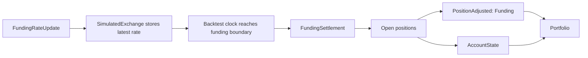

# Backtest Accounts and Margin

Backtest venues use simulated accounts for balances, margin, and funding settlement. For the full
account model and margin formulas, see [Accounting](../accounting.md).

## Funding

Backtests settle perpetual funding at funding boundaries from `FundingRateUpdate` data. When an
update has `next_funding_ns`, the simulated exchange stores the latest rate, and the backtest clock
emits one `FundingSettlement` at that timestamp. Without `next_funding_ns`, the exchange settles
only when `ts_event` lands on the `interval` boundary. Updates without a boundary remain strategy
data and do not create funding payments.



The settlement adjusts the open position and the matching account balance before the portfolio
observes the new state.

`PositionAdjusted` remains the position accounting event. A positive funding rate debits long
positions and credits short positions. The resulting adjustment changes realized PnL, and the
matching account balance update records the cash movement.

## Accounts

Every backtest venue uses one of three `account_type` values: `CASH`, `MARGIN`, or `BETTING`.
The low-level API accepts model types directly:

```python
from nautilus_trader.backtest import BacktestEngine
from nautilus_trader.backtest import BacktestEngineConfig
from nautilus_trader.model import AccountType
from nautilus_trader.model import Money
from nautilus_trader.model import OmsType
from nautilus_trader.model import Venue

engine = BacktestEngine(BacktestEngineConfig())
engine.add_venue(
    venue=Venue("BINANCE"),
    oms_type=OmsType.NETTING,
    account_type=AccountType.CASH,
    starting_balances=[Money.from_str("10_000 USDT")],
)
```

The high-level API accepts the same enum values but represents starting balances as strings:

```python
from nautilus_trader.backtest import BacktestVenueConfig
from nautilus_trader.model import AccountType
from nautilus_trader.model import BookType
from nautilus_trader.model import OmsType

venue = BacktestVenueConfig(
    name="SIM",
    oms_type=OmsType.NETTING,
    account_type=AccountType.CASH,
    book_type=BookType.L1_MBP,
    starting_balances=["10_000 USDT"],
)
```

## Margin models

Margin accounts use `LeveragedMarginModel` by default. Pass `StandardMarginModel` when the
simulation should reserve the instrument's fixed initial and maintenance margin percentages
without reducing them by account leverage.

```python
from nautilus_trader.backtest import BacktestVenueConfig
from nautilus_trader.model import AccountType
from nautilus_trader.model import BookType
from nautilus_trader.model import OmsType
from nautilus_trader.model import StandardMarginModel

venue = BacktestVenueConfig(
    name="SIM",
    oms_type=OmsType.NETTING,
    account_type=AccountType.MARGIN,
    book_type=BookType.L1_MBP,
    starting_balances=["1_000_000 USD"],
    margin_model=StandardMarginModel(),
)
```

`BacktestVenueConfig` accepts the built-in `StandardMarginModel` and `LeveragedMarginModel`
objects directly. The current high-level configuration does not load custom margin models from
class-path strings.
