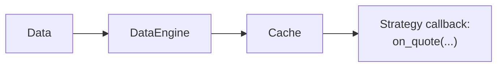

# Cache

The `Cache` is the central in-memory store for trading state and recent market data. Actors and
strategies use it to read data maintained by the data and execution engines or to share raw bytes
under application-defined keys.

The cache:

- Stores current order books and bounded histories of quotes, trades, bars, and other market data.
- Tracks orders, positions, accounts, instruments, and currencies until they are purged or reset.
- Shares caller-serialized data between components and persists it when a backing database is
  configured.

## How caching works

The engines add built-in data to the `Cache` as events flow through the system. Live adapters feed
events to the engine asynchronously, so the cache changes when the engine processes an event, not
when the adapter first receives it.

For quotes, trades, and bars, the `DataEngine` attempts to write to the `Cache` before publishing to
subscribers. After a successful write, the latest value is available by the time the strategy
handler runs. Order book deltas and depth snapshots are published directly; `BookUpdater`
subscriptions maintain current book state separately:



For the full step-by-step trace, see
[Data flow: life of a quote tick](architecture.md#data-flow-life-of-a-quote-tick).

### Basic example

Within a strategy, access the shared `Cache` through `self.cache`:

```python
def on_bar(self, bar: Bar) -> None:
    # Read recent bars from the cache.
    last_bar = self.cache.bar(self.bar_type, index=0)  # Same bar after a successful cache write.
    previous_bar = self.cache.bar(self.bar_type, index=1)
    third_last_bar = self.cache.bar(self.bar_type, index=2)

    # Read current position state.
    if self.last_position_opened_id is not None:
        position = self.cache.position(self.last_position_opened_id)
        if position is not None and position.is_open:
            open_quantity = position.quantity

    # Read open orders for the instrument.
    open_orders = self.cache.orders_open(instrument_id=self.instrument_id)
```

## Configuration

Use the `CacheConfig` class to configure the `Cache` behavior and capacity.
Pass it to a `BacktestEngine` or `LiveNode`, depending on the
[environment context](architecture.md#environment-contexts).

The same capacity settings apply in both environments:

```python
from nautilus_trader.config import BacktestEngineConfig
from nautilus_trader.config import CacheConfig
from nautilus_trader.config import LiveNodeConfig

# For backtesting
engine_config = BacktestEngineConfig(
    cache=CacheConfig(
        tick_capacity=10_000,  # Store last 10,000 ticks per instrument
        bar_capacity=5_000,  # Store last 5,000 bars per bar type
    ),
)

# For live trading
node_config = LiveNodeConfig(
    cache=CacheConfig(
        tick_capacity=10_000,
        bar_capacity=5_000,
    ),
)
```

:::tip
By default, the `Cache` keeps up to 10,000 values in each per-instrument tick sequence and 10,000
bars for each bar type. These are separate limits, not combined totals. Increase them when a
strategy needs a longer in-memory lookback and the additional memory use is acceptable.
:::

### Configuration options

The `CacheConfig` type supports these parameters:

```rust
use nautilus_common::{cache::CacheConfig, enums::SerializationEncoding};

let config = CacheConfig {
    encoding: SerializationEncoding::MsgPack,
    timestamps_as_iso8601: false,
    buffer_interval_ms: None,
    bulk_read_batch_size: None,
    use_trader_prefix: true,
    use_instance_id: false,
    flush_on_start: false,
    drop_instruments_on_reset: true,
    tick_capacity: 10_000,
    bar_capacity: 10_000,
    persist_account_events: true,
    save_market_data: false,
};
```

:::note
Each bar type maintains its own capacity. For example, if you use both 1-minute and 5-minute bars,
each stores up to `bar_capacity` bars.
When `bar_capacity` is reached, the `Cache` automatically removes the oldest data.
:::

### Database configuration

Configure a database backing to recover successfully persisted, supported cache records after a
restart. Restorable records include general data, currencies, instruments, accounts, orders, and
positions. Startup does not restore bounded market-data histories or the running process.

`CacheConfig` controls cache behavior. Connection settings belong to the concrete backing config,
such as `RedisCacheConfig` or `PostgresCacheConfig`.

A backing is a recovery mechanism, not a complete event archive or a synchronized distributed
cache. Each node owns its in-memory cache; pointing multiple nodes at the same database namespace
does not keep those caches coherent.

Rust-native callers build a concrete database config and use the `CacheDatabaseFactory` trait to
construct the adapter passed into the system builder:

```rust
use nautilus_common::{
    cache::{CacheConfig, database::CacheDatabaseFactory},
    enums::SerializationEncoding,
};
use nautilus_infrastructure::redis::cache::RedisCacheConfig;

let config = CacheConfig {
    encoding: SerializationEncoding::MsgPack,
    timestamps_as_iso8601: true,
    buffer_interval_ms: Some(100),
    ..Default::default()
};

let database = RedisCacheConfig {
    host: Some("localhost".to_string()),
    port: Some(6379),
    connection_timeout: 2,
    response_timeout: 2,
    ..Default::default()
};

let cache_database = database
    .create(trader_id, instance_id, config.clone())
    .await?;
```

For a Rust-native live node, attach the adapter before startup:

```rust
let node_config = LiveNodeConfig {
    trader_id,
    ..Default::default()
};
let mut node = LiveNode::build("LiveNode".to_string(), Some(node_config))?;
node.set_cache_database(cache_database)?;
node.run().await?;
```

With the default `LiveExecEngineConfig.load_cache = true`, the node restores persisted cache state
and rebuilds derived indexes before connecting clients or reconciling execution state. Setting
`CacheConfig.flush_on_start = true` clears the backing instead.

Python passes the same database config to `LiveNodeBuilder.with_cache_database_factory`. The node
constructs and owns the adapter when it starts, so the connection opens only when the node runs:

```python
from nautilus_trader.common import Environment
from nautilus_trader.infrastructure import RedisCacheConfig
from nautilus_trader.live import LiveNode
from nautilus_trader.model import TraderId

node = (
    LiveNode.builder("LiveNode", TraderId("TRADER-001"), Environment.LIVE)
    .with_cache_database_factory(RedisCacheConfig(host="localhost", port=6379))
    .build()
)

try:
    node.run()
finally:
    node.dispose()
```

Pass `PostgresCacheConfig` instead to back cache data with Postgres. Postgres does not support actor
or strategy state persistence, so do not combine it with `load_state` or `save_state`. Both configs
come from `nautilus_trader.infrastructure`.

:::warning
Always dispose the node. `dispose()` closes the backing, which flushes writes still held in the
buffer when `CacheConfig.buffer_interval_ms` is set. Returning straight from `run()` can drop them.
:::

## Using the cache

### Accessing market data

The `Cache` provides access to order books, quotes, trades, bars, and other market data. Bounded
market-data sequences use reverse indexing, so the most recent entry sits at index 0.

#### Bar access

```python
# Get all cached bars for a bar type.
bars = self.cache.bars(bar_type)  # Returns list[Bar] or None.

# Get the most recent bar.
latest_bar = self.cache.bar(bar_type)  # Returns Bar or None.

# Get a historical bar by index (0 = most recent).
second_last_bar = self.cache.bar(bar_type, index=1)  # Returns Bar or None.

# Check whether bars exist and get the count.
bar_count = self.cache.bar_count(bar_type)
has_bars = self.cache.has_bars(bar_type)
```

#### Quote ticks

```python
# Get quotes.
quotes = self.cache.quotes(instrument_id)  # Returns list[QuoteTick] or None.
latest_quote = self.cache.quote(instrument_id)  # Returns QuoteTick or None.
second_last_quote = self.cache.quote(instrument_id, index=1)  # Returns QuoteTick or None.

# Check quote availability.
quote_count = self.cache.quote_count(instrument_id)
has_quotes = self.cache.has_quote_ticks(instrument_id)
```

#### Trade ticks

```python
# Get trades.
trades = self.cache.trades(instrument_id)  # Returns list[TradeTick] or None.
latest_trade = self.cache.trade(instrument_id)  # Returns TradeTick or None.
second_last_trade = self.cache.trade(instrument_id, index=1)  # Returns TradeTick or None.

# Check trade availability.
trade_count = self.cache.trade_count(instrument_id)
has_trades = self.cache.has_trade_ticks(instrument_id)
```

#### Order book

```python
# Get the current order book.
book = self.cache.order_book(instrument_id)  # Returns OrderBook or None.

# Check whether an order book exists.
has_book = self.cache.has_order_book(instrument_id)

# Get the number of applied book updates.
update_count = self.cache.book_update_count(instrument_id)
```

#### Price access

```python
from nautilus_trader.model import PriceType

# Get the current price by type. Returns Price or None.
price = self.cache.price(
    instrument_id=instrument_id,
    price_type=PriceType.MID,  # Options: BID, ASK, MID, LAST
)
```

#### Bar types

```python
from nautilus_trader.model import AggregationSource, PriceType

# Get all available bar types for an instrument. Returns list[BarType].
bar_types = self.cache.bar_types(
    instrument_id=instrument_id,
    price_type=PriceType.LAST,  # Options: BID, ASK, MID, LAST
    aggregation_source=AggregationSource.EXTERNAL,
)
```

#### Simple example

```python
from nautilus_trader.model import Bar, BarType
from nautilus_trader.trading import Strategy


class MarketDataStrategy(Strategy):
    def on_start(self) -> None:
        # Subscribe to 1-minute bars.
        self.bar_type = BarType.from_str(f"{self.instrument_id}-1-MINUTE-LAST-EXTERNAL")
        self.subscribe_bars(self.bar_type)

    def on_bar(self, bar: Bar) -> None:
        bars = (self.cache.bars(self.bar_type) or [])[:3]
        if len(bars) < 3:
            return

        # Access the latest three bars for analysis.
        current_bar = bars[0]
        prev_bar = bars[1]
        prev_prev_bar = bars[2]

        # Read the latest quote and trade.
        latest_quote = self.cache.quote(self.instrument_id)
        latest_trade = self.cache.trade(self.instrument_id)

        if latest_quote is not None:
            current_spread = latest_quote.ask_price - latest_quote.bid_price
            self.log.info(f"Current spread: {current_spread}")
```

### Trading objects

The `Cache` provides access to trading objects such as:

- Orders
- Positions
- Accounts
- Instruments

#### Orders

Query orders by venue, strategy, instrument, account, or order side.

##### Basic order access

```python
# Get a specific order by its client order ID
order = self.cache.order(ClientOrderId("O-123"))

# Get all orders in the system
orders = self.cache.orders()

# Get orders filtered by specific criteria
orders_for_venue = self.cache.orders(venue=venue)  # All orders for a specific venue
orders_for_strategy = self.cache.orders(
    strategy_id=strategy_id
)  # All orders for a specific strategy
orders_for_instrument = self.cache.orders(
    instrument_id=instrument_id
)  # All orders for an instrument
```

##### Order state queries

```python
# Get orders by their current state
open_orders = self.cache.orders_open()  # Orders currently active at the venue
closed_orders = self.cache.orders_closed()  # Orders that have completed their lifecycle
emulated_orders = self.cache.orders_emulated()  # Orders being simulated locally by the system
inflight_orders = (
    self.cache.orders_inflight()
)  # Orders submitted (or modified) to venue, but not yet confirmed
local_active_orders = (
    self.cache.orders_active_local()
)  # Orders still managed locally (initialized, emulated, or released)

# Check specific order states
exists = self.cache.order_exists(
    client_order_id
)  # Checks if an order with the given ID exists in the cache
is_open = self.cache.is_order_open(client_order_id)  # Checks if an order is currently open
is_closed = self.cache.is_order_closed(client_order_id)  # Checks if an order is closed
is_emulated = self.cache.is_order_emulated(
    client_order_id
)  # Checks if an order is being simulated locally
is_inflight = self.cache.is_order_inflight(
    client_order_id
)  # Checks if an order is submitted or modified, but not yet confirmed
is_active_local = self.cache.is_order_active_local(
    client_order_id
)  # Checks if an order is still managed locally
```

##### Order statistics

```python
# Get counts of orders in different states
open_count = self.cache.orders_open_count()  # Number of open orders
closed_count = self.cache.orders_closed_count()  # Number of closed orders
emulated_count = self.cache.orders_emulated_count()  # Number of emulated orders
inflight_count = self.cache.orders_inflight_count()  # Number of inflight orders
local_active_count = (
    self.cache.orders_active_local_count()
)  # Number of locally active orders (initialized, emulated, or released)
total_count = self.cache.orders_total_count()  # Total number of orders in the system

# Get filtered order counts
buy_orders_count = self.cache.orders_open_count(
    side=OrderSide.BUY
)  # Number of currently open BUY orders
venue_orders_count = self.cache.orders_total_count(
    venue=venue
)  # Total number of orders for a given venue
```

#### Positions

The `Cache` retains positions until they are purged or reset and provides several ways to query
them.

##### Position access

```python
# Get a specific position by its ID
position = self.cache.position(PositionId("P-123"))

# Get positions by their state
all_positions = self.cache.positions()  # All positions in the system
open_positions = self.cache.positions_open()  # All currently open positions
closed_positions = self.cache.positions_closed()  # All closed positions

# Get positions filtered by various criteria
venue_positions = self.cache.positions(venue=venue)  # Positions for a specific venue
instrument_positions = self.cache.positions(
    instrument_id=instrument_id
)  # Positions for a specific instrument
strategy_positions = self.cache.positions(
    strategy_id=strategy_id
)  # Positions for a specific strategy
long_positions = self.cache.positions(side=PositionSide.LONG)  # All long positions
```

##### Position state queries

```python
# Check position states
exists = self.cache.position_exists(position_id)  # Checks if a position with the given ID exists
is_open = self.cache.is_position_open(position_id)  # Checks if a position is open
is_closed = self.cache.is_position_closed(position_id)  # Checks if a position is closed

# Get position and order relationships
orders = self.cache.orders_for_position(position_id)  # All orders related to a specific position
position = self.cache.position_for_order(
    client_order_id
)  # Find the position associated with a specific order
```

##### Position statistics

```python
# Get position counts in different states
open_count = self.cache.positions_open_count()  # Number of currently open positions
closed_count = self.cache.positions_closed_count()  # Number of closed positions
total_count = self.cache.positions_total_count()  # Total number of positions in the system

# Get filtered position counts
long_positions_count = self.cache.positions_open_count(
    side=PositionSide.LONG
)  # Number of open long positions
instrument_positions_count = self.cache.positions_total_count(
    instrument_id=instrument_id
)  # Number of positions for a given instrument
```

#### Accounts

```python
# Access account information
account = self.cache.account(account_id)  # Retrieve account by ID
account = self.cache.account_for_venue(venue)  # Retrieve account for a specific venue
account_id = self.cache.account_id(venue)  # Retrieve account ID for a venue
```

#### Instruments

```python
# Get instrument information
instrument = self.cache.instrument(instrument_id)  # Retrieve a specific instrument by its ID
all_instruments = self.cache.instruments()  # Retrieve all instruments in the cache

# Get instruments for a venue.
venue_instruments = self.cache.instruments(venue=venue)  # Instruments for a specific venue

# Get instrument identifiers
instrument_ids = self.cache.instrument_ids()  # Get all instrument IDs
venue_instrument_ids = self.cache.instrument_ids(
    venue=venue
)  # Get instrument IDs for a specific venue
```

### Purging cached data

Long-running sessions accumulate closed orders, closed positions, account events, and
unused instruments. The cache exposes targeted and bulk purge methods so strategies and
the live trading engine can keep memory bounded without restarting the system.

#### Targeted purges

Use these to drop a single entity. Each refuses to purge while the entity is still active.

- `cache.purge_order(client_order_id)`: removes the order and every order-keyed index entry.
  Skips open orders.
- `cache.purge_position(position_id)`: removes the position, its snapshots, and position-keyed
  index entries. Skips open positions.
- `cache.purge_instrument(instrument_id)`: removes the instrument and every per-instrument
  map (order book, quotes, trades, mark/index/funding prices, instrument status, greeks,
  and bars referencing the instrument). Skips while any associated order is non-terminal
  (anything that has not reached a closed state, including initialized, submitted,
  accepted, emulated, released, and inflight orders) or any associated position is
  non-closed.

:::warning
`purge_instrument` is intended for actors and strategies with their own lifecycle logic
for deciding when an instrument is no longer needed. Purging an instrument that another
component still relies on causes missing instrument lookups and loses market-data
history. Active subscriptions belong to the data engine, so unsubscribe before purging
if you no longer want updates.
:::

#### Bulk purges

Use these to sweep older entries by age. They take the current timestamp and a buffer or
lookback window in seconds.

- `cache.purge_closed_orders(ts_now, buffer_secs)`: closed orders whose close timestamp is
  older than `buffer_secs`.
- `cache.purge_closed_positions(ts_now, buffer_secs)`: closed positions whose close timestamp
  is older than `buffer_secs`.
- `cache.purge_account_events(ts_now, lookback_secs)`: account state events older than
  `lookback_secs`. A value of `0` purges all events.

#### Automatic purging in live trading

`LiveExecEngineConfig` schedules the bulk purges on a timer. All purge intervals default to `None`,
which disables the corresponding loop. Set an interval to enable a loop and set its buffer or
lookback to control how recent entries remain protected. This example uses the recommended starting
values from the live-trading configuration guide:

```python
from nautilus_trader.config import LiveExecEngineConfig

exec_engine = LiveExecEngineConfig(
    purge_closed_orders_interval_mins=15,
    purge_closed_orders_buffer_mins=60,
    purge_closed_positions_interval_mins=15,
    purge_closed_positions_buffer_mins=60,
    purge_account_events_interval_mins=15,
    purge_account_events_lookback_mins=60,
)
```

A shorter interval runs a purge more often, while a shorter buffer or lookback removes newer data.
Choose each value separately based on memory limits and the recent execution context needed for
reconciliation or analysis. See
[Configure live trading: memory management](../how_to/configure_live_trading.md) for the
full parameter reference.

:::note
The instrument purge has no automatic loop because the right time to drop an instrument
depends on strategy state, not age. Call `cache.purge_instrument` from the actor or
strategy that owns the instrument's lifecycle.
:::

### Custom data

The `Cache` stores raw bytes under application-defined string keys. Serialize values before adding
them and deserialize them after retrieval. Actors and strategies can use these entries to share
small amounts of application data.

#### Basic storage and retrieval

```python
# Store serialized data.
self.cache.add(key="my_key", value=b"some binary data")

# Retrieve serialized data.
stored_data = self.cache.get("my_key")  # Returns bytes or None.
```

:::warning
The `Cache` is not a general database. Use a dedicated store for large datasets or complex queries.
:::

## Best practices and common questions

### Cache vs. portfolio usage

The `Cache` and `Portfolio` serve different purposes:

**Cache**:

- Retains execution objects, selected object histories, and bounded recent market data until purge
  or reset.
- Applies local state changes immediately, such as initializing an order before submission.
- Applies external events when the engine processes them, such as when an order fills.

**Portfolio**:

- Aggregates position, exposure, and account information.
- Computes current portfolio values from cached state and market prices.

```python
from nautilus_trader.model import PositionChanged
from nautilus_trader.trading import Strategy


class MyStrategy(Strategy):
    def on_position_changed(self, event: PositionChanged) -> None:
        # Read the fills retained by the cached position.
        position = self.cache.position(event.position_id)
        fills = position.events() if position is not None else []

        # Read current aggregate exposure from the portfolio.
        current_exposure = self.portfolio.net_exposure(event.instrument_id)
```

### Cache vs. strategy variables

Use cache entries for shared, serialized data and strategy variables for local working state.

**Cache storage**:

- Available to actors and strategies that share the system cache.
- Can persist general byte entries when a backing database is configured and writes complete.
- Remains available when an individual strategy resets, but a cache or execution-engine reset clears
  the in-memory entries.

**Strategy variables**:

- Keep typed, strategy-specific calculations and intermediate values encapsulated.
- Do not expose values to other components or persist them automatically.

Actor and strategy state persistence across process restarts uses separate `on_save` and `on_load`
hooks with a supported backing. See the
[cache database configuration](../how_to/configure_live_trading.md#cache-database-configuration)
section of the live-trading guide.

Serialize shared data before adding it to the cache:

```python
import json

from nautilus_trader.trading import Strategy


class MyStrategy(Strategy):
    def on_start(self) -> None:
        shared_data = {
            "last_reset": self.clock.timestamp_ns(),
            "trading_enabled": True,
        }
        self.cache.add("shared_strategy_info", json.dumps(shared_data).encode())
```

Another strategy can retrieve the cached data as follows:

```python
import json

from nautilus_trader.trading import Strategy


class AnotherStrategy(Strategy):
    def on_start(self) -> None:
        data_bytes = self.cache.get("shared_strategy_info")
        if data_bytes is not None:
            shared_data = json.loads(data_bytes)
            self.log.info(f"Shared data retrieved: {shared_data}")
```

## Related guides

- [Data](data/): Data types stored in the cache.
- [Strategies](strategies.md): Strategies access cache for market data and state.
- [Reports](reports.md): Generate reports from cached data.
