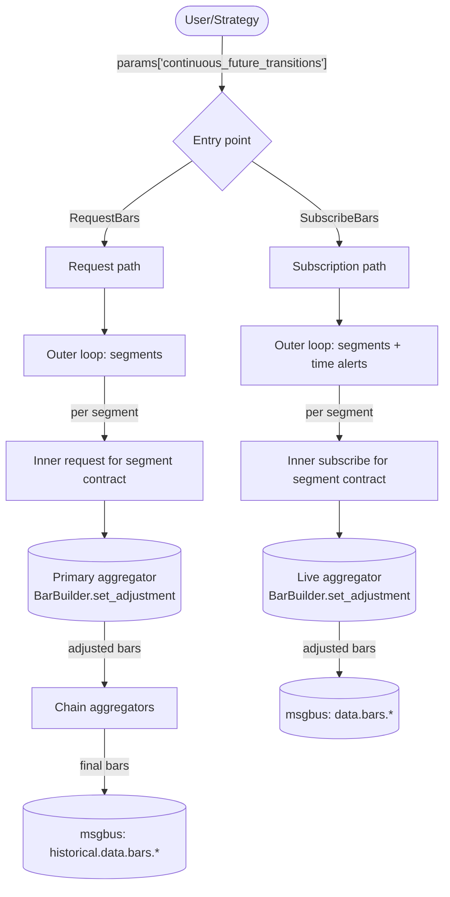
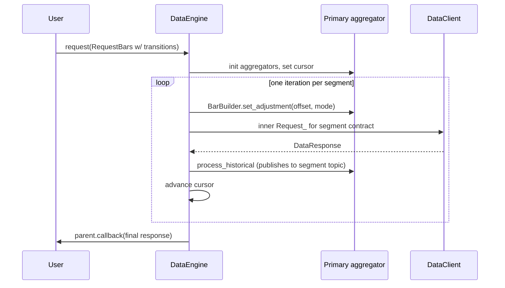
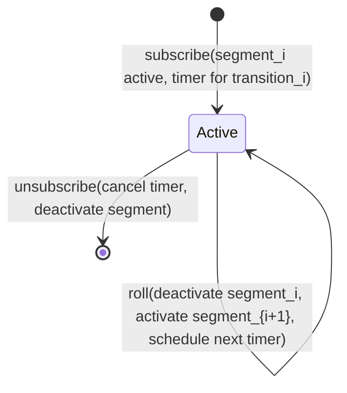
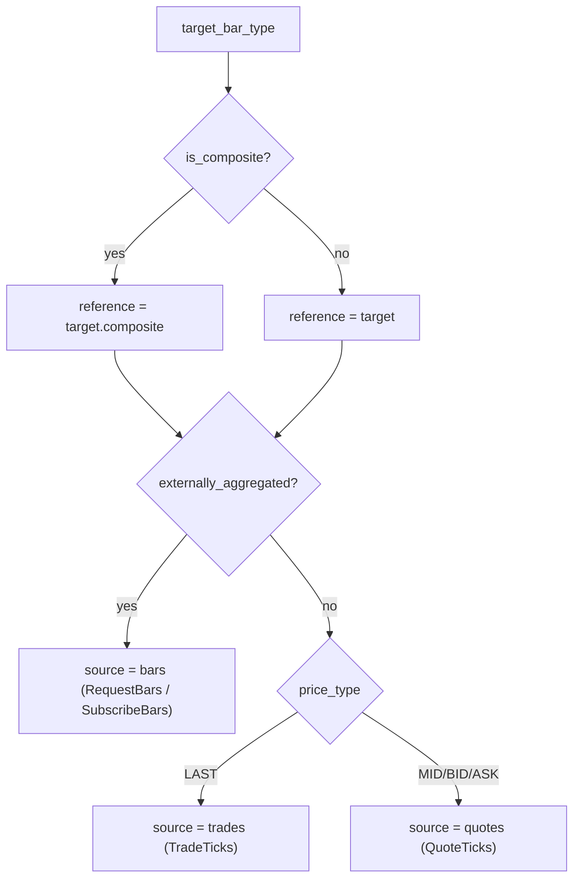
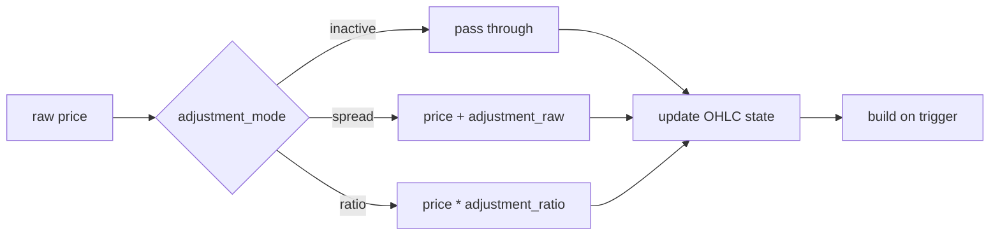

# Continuous Futures

A continuous future is a derived series that splices consecutive futures contracts into one
adjusted price stream. Each underlying contract expires; the continuous series stays active by
rolling to the next contract at a transition point and shifting historical prices into the new
contract's frame so the resulting series has no roll-induced jumps.

Nautilus models a continuous future as a target `BarType` plus an explicit list of roll
transitions supplied in request or subscribe params. The data engine walks per-contract segments,
computes the cumulative price adjustment per segment, and feeds adjusted source data through the
normal bar aggregation path.

## Adjustment modes

`ContinuousFutureAdjustmentType` combines direction (backward or forward) with operation
(spread or ratio):

| Mode              | Operation       | Anchor segment       |
|-------------------|-----------------|----------------------|
| `BACKWARD_SPREAD` | Additive        | Most recent contract |
| `FORWARD_SPREAD`  | Additive        | First contract       |
| `BACKWARD_RATIO`  | Multiplicative  | Most recent contract |
| `FORWARD_RATIO`   | Multiplicative  | First contract       |

The cumulative adjustment at segment `k` of `N` transitions is:

```text
BACKWARD_SPREAD: sum over i in [k, N) of (post_i - pre_i)
FORWARD_SPREAD:  sum over i in [0, k) of (pre_i - post_i)
BACKWARD_RATIO:  product over i in [k, N) of (post_i / pre_i)
FORWARD_RATIO:   product over i in [0, k) of (pre_i / post_i)
```

Spread modes accumulate additive offsets. Ratio modes accumulate multiplicative factors and
require strictly positive prices.

## Inputs

A continuous-future request or subscription is any `RequestBars` or `SubscribeBars` that carries
a `continuous_future_transitions` entry in `params`:

```python
params = {
    "continuous_future_transitions": [
        {
            "transition_time_ns": 1773671460000000000,  # when ESH26 rolls to ESM26
            "pre_instrument_id": "ESH26.XCME",
            "post_instrument_id": "ESM26.XCME",
            "pre_price": "6001.00",                     # last ESH26 price pre-roll
            "post_price": "5995.50",                    # first ESM26 price post-roll
        },
        # ... more transitions ...
    ],
    "continuous_future_adjustment_mode": ContinuousFutureAdjustmentType.BACKWARD_SPREAD,
    # Optional: cap the upper end of cumulative adjustment at the transition whose
    # post_instrument_id matches (the backward-mode anchor).
    # "last_post_instrument_id": "ESM26.XCME",
    # Optional: cap the lower end of cumulative adjustment at the transition whose
    # pre_instrument_id matches (the forward-mode anchor).
    # "first_pre_instrument_id": "ESM26.XCME",
}
```

The `bar_type` on the request or command is the **target** continuous bar type, for example
`"ES.XCME-1-MINUTE-LAST-INTERNAL@1-MINUTE-EXTERNAL"`. The root identifier (`ES.XCME`) is the
continuous root, not a real contract. Each segment's raw source data comes from the real contract
in the transitions list.

The continuous target bar type must be **internally aggregated**. Externally aggregated bars are
not supported as continuous targets, but they can serve as the per-segment source.

### Bounded chains

The two optional bounds restrict the active portion of the transition table:

- `last_post_instrument_id` caps the upper end at the first transition whose `post_instrument_id`
  matches. Backward modes use this as the anchor (cumulative adjustment for the anchor segment
  is zero); forward modes use it to cap how far later contracts accumulate.
- `first_pre_instrument_id` caps the lower end at the first transition whose `pre_instrument_id`
  matches. Forward modes use this as the anchor; backward modes use it to cap how far earlier
  contracts accumulate.

This lets callers pass a wide transition table while anchoring the adjusted series to a specific
contract on either side.

## Validation

Both entry points run `engine.pyx::_continuous_future_validate_transitions` before allocating
any aggregator:

- `continuous_future_adjustment_mode` must parse as a valid `ContinuousFutureAdjustmentType`.
- `continuous_future_transitions` must be a list or tuple of dict rows.
- Each row must include a non-negative integer `transition_time_ns`, and transition times must
  be strictly increasing.
- Each `pre_instrument_id` and `post_instrument_id` must parse as a valid `InstrumentId` whose
  venue equals the target venue.
- The chain must be continuous: row `i`'s `post_instrument_id` must equal row `i + 1`'s
  `pre_instrument_id`.
- Each row must include finite `pre_price` and `post_price`. Ratio modes additionally require
  both prices to be positive.
- If the caller supplies `last_post_instrument_id`, it must parse as an `InstrumentId`, match
  the target venue, and appear as a `post_instrument_id` in the transition list. The same
  applies to `first_pre_instrument_id`.

On validation failure the helper logs a specific error and returns. The request handler also
calls `_abort_request` to drop any workflow state it had begun to set up.

## Target instrument auto-synthesis

The continuous root (for example `ES.XCME`) is a synthetic id with no market data of its own,
but downstream consumers (aggregators, cache lookups, serialization) still expect an `Instrument`
in the cache. After validation, both entry points call
`engine.pyx::_continuous_future_ensure_target_instrument`:

- If the target id is already cached, the helper is a no-op. Callers can pre-register a custom
  continuous instrument and the engine respects it.
- Otherwise the helper fetches the first segment's instrument from the cache and clones it via
  `FuturesContract.to_dict_c` and `from_dict_c`, overriding only `id`, `raw_symbol`, and
  clearing `activation_ns` and `expiration_ns` to `0`. Every other field (currency, precision,
  increment, multiplier, lot size, underlying, fees, margins, exchange, tick scheme, info) is
  reused from the segment.
- If the first segment is not yet in the cache or is not a `FuturesContract`, the helper logs
  a warning and returns. The caller must then register the continuous instrument manually.

## Architecture overview



The design has two entry points, one outer loop shape (walk the segments), two ways to fetch
per-segment data (historical sub-requests or live sub-subscriptions), and one adjustment
mechanism (`BarBuilder.set_adjustment` at each segment boundary).

## Segments

A **segment** is a contiguous time slice owned by one real contract. Transitions separate
segments. Given `transitions[0..N)`:

- Segment 0: `(-inf, transitions[0].time)` on `transitions[0].pre_instrument_id`.
- Segment k, with k in `[1, N)`: `[transitions[k-1].time, transitions[k].time)` on
  `transitions[k].pre_instrument_id`.
- Segment N: `[transitions[N-1].time, +inf)` on `transitions[N-1].post_instrument_id`.

`engine.pyx::_continuous_future_next_segment` returns the next segment starting at `cursor_ns`,
clamped to `end_ns`.

## Request flow

The request path mirrors `_handle_long_request` one level up: each iteration fires one inner
request for one segment's worth of data, and the inner's completion callback advances the cursor.



If the caller sets `time_range_generator` and `durations_seconds` in params, the inner request
inherits them and itself becomes a long request that chunks the segment's time range into N
further sub-sub-requests. The outer continuous-future loop ignores the inner chunking: each
inner request still emits exactly one combined response back, which triggers the outer loop's
next segment.

### Chain aggregators

If the caller sets `bar_types = (bar_type_1, bar_type_2)` for multi-level internal aggregation,
the setup creates all aggregators keyed by `parent.id`. The primary (bottom of the chain)
receives segment source data via a per-segment msgbus subscription. Its emitted bars publish to
the historical topic that the next level subscribes to, so the chain walks up automatically.
Only the primary builder has `set_adjustment` called on it. Higher levels re-aggregate already
adjusted data.

## Subscription flow

A small state machine drives each active subscription via a single pending time alert:



When a transition fires, the engine deactivates the current segment (unsubscribes the source),
activates the next segment (resolves the new source, applies the new offset, subscribes), and
re-arms the timer for the next transition.

## Source resolution

For any continuous-future target `BarType`, the raw data feeding the primary aggregator lives on
the **segment contract**, not the continuous id. The target's shape decides the source type:



## BarBuilder adjustment

The builder applies adjustment **at ingress** on every `update(price, ...)` and
`update_bar(bar, ...)` call. The running OHLC state always sits in the adjusted (common) frame,
so a mid-bar adjustment change only affects subsequent prices. No partial-bar buffering is
needed.



The `BarBuilder` only cares about the ratio-vs-spread distinction to decide add-or-multiply.
The engine collapses direction information into the sign and magnitude of the cumulative offset
before calling `set_adjustment`. The `reset()` method clears per-bar OHLCV state for the next
bar in the series but intentionally preserves the adjustment configuration: rolls happen far
less often than bar resets, so the adjustment is treated as segment-scoped state.

## Mid-bar roll boundary

If a roll lands inside an in-progress target bar, the builder keeps the current OHLC state and
applies the new adjustment only to subsequent updates. The pre-boundary portion stays at the old
offset; the post-boundary portion uses the new offset. This is the intentional policy: rewriting
the running OHLC at every roll would require buffering raw input per segment, which adds cost
without changing the adjusted result for the common case where the adjusted segment is built
seamlessly across the boundary.

## Limitations

- The feature requires supplied transition metadata. The engine does not discover rolls, choose
  contracts, or infer roll prices: that is the caller's responsibility.
- Ratio adjustment goes through `float` in the hot path (`price_as_f64 * ratio` then
  `price_new`). For high-precision instruments the rounding can shift the resulting raw by 1
  ULP versus the equivalent `Decimal` multiplication. Spread mode is exact because it works
  directly on `PriceRaw` (int64/int128).
