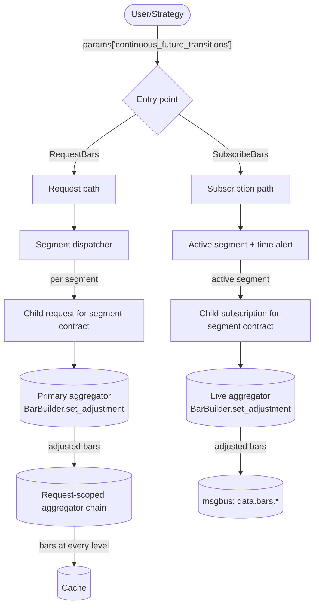
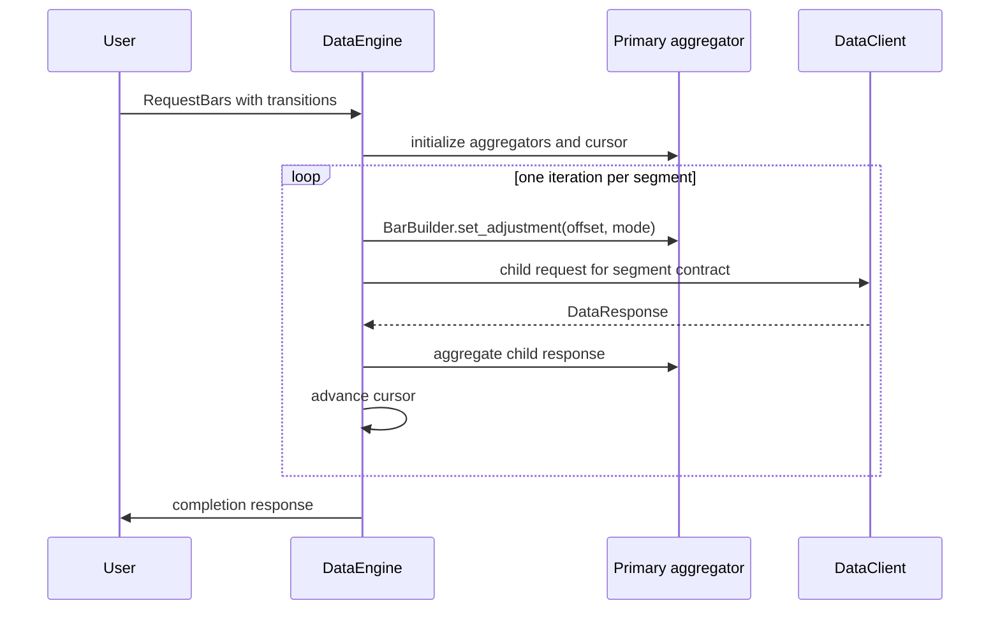
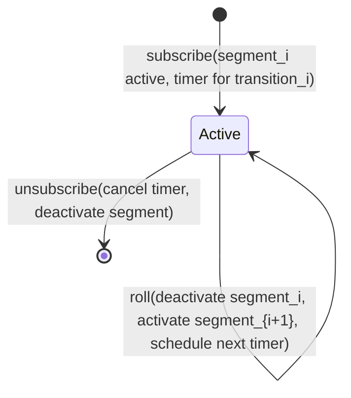
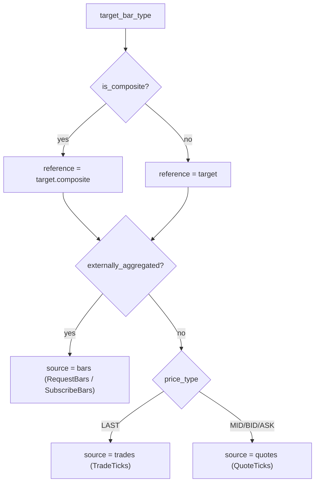
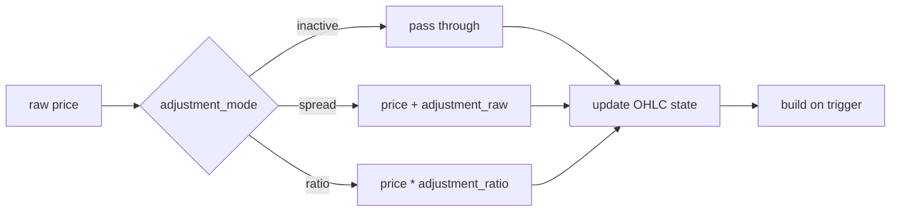

# Continuous Futures

A continuous future is a derived series that splices consecutive futures contracts into one
adjusted price stream. Each underlying contract expires, so the continuous series rolls to the
next contract at a transition point. Each segment is adjusted into a common price frame so contract
changes do not introduce artificial price jumps.

Nautilus models a continuous future as a target `BarType` plus an explicit list of roll
transitions supplied in request or subscription params. The data engine selects the real contract
for each time segment, computes its cumulative price adjustment, and feeds the adjusted source data
through the normal bar aggregation path.

## Adjustment modes

`ContinuousFutureAdjustmentType` combines direction (backward or forward) with operation
(spread or ratio):

| Mode              | Operation      | Anchor segment                      |
| ----------------- | -------------- | ----------------------------------- |
| `BACKWARD_SPREAD` | Additive       | Last contract in adjustment range.  |
| `FORWARD_SPREAD`  | Additive       | First contract in adjustment range. |
| `BACKWARD_RATIO`  | Multiplicative | Last contract in adjustment range.  |
| `FORWARD_RATIO`   | Multiplicative | First contract in adjustment range. |

The cumulative adjustment at segment `k` of `N` transitions is:

```text
BACKWARD_SPREAD: sum over i in [k, N) of (post_i - pre_i)
FORWARD_SPREAD:  sum over i in [0, k) of (pre_i - post_i)
BACKWARD_RATIO:  product over i in [k, N) of (post_i / pre_i)
FORWARD_RATIO:   product over i in [0, k) of (pre_i / post_i)
```

Spread modes accumulate additive offsets. Ratio modes accumulate multiplicative factors and
require strictly positive prices.

## Inputs

A continuous‑future request or subscription is any `RequestBars` or `SubscribeBars` that carries
a `continuous_future_transitions` entry in `params`:

```python
params = {
    "continuous_future_transitions": [
        {
            "transition_time_ns": 1773671460000000000,  # when ESH26 rolls to ESM26
            "pre_instrument_id": "ESH26.XCME",
            "post_instrument_id": "ESM26.XCME",
            "pre_price": "6001.00",  # last ESH26 price pre-roll
            "post_price": "5995.50",  # first ESM26 price post-roll
        },
        # ... more transitions ...
    ],
    "continuous_future_adjustment_mode": "BACKWARD_SPREAD",
    # Optional: cap the upper end of cumulative adjustment at the transition whose
    # post_instrument_id matches (the backward-mode anchor).
    # "last_post_instrument_id": "ESM26.XCME",
    # Optional: cap the lower end of cumulative adjustment at the transition whose
    # pre_instrument_id matches (the forward-mode anchor).
    # "first_pre_instrument_id": "ESM26.XCME",
}
```

`continuous_future_adjustment_mode` defaults to `BACKWARD_SPREAD` when omitted.

The `bar_type` on the request or command is the **target** continuous bar type, for example
`"ES.XCME-1-MINUTE-LAST-INTERNAL@1-MINUTE-EXTERNAL"`. The root identifier (`ES.XCME`) is the
continuous root, not a real contract. Each segment's raw source data comes from the real contract
in the transitions list.

The continuous target bar type must be **internally aggregated**. Externally aggregated bars are
not supported as continuous targets, but they can serve as the per‑segment source.

### Bounded chains

The two optional bounds restrict which transitions contribute to the cumulative adjustment. They
do not remove contract segments from the request or subscription:

- `last_post_instrument_id` caps the upper end at the first transition whose `post_instrument_id`
  matches. Backward modes use the matching post contract as the zero‑adjustment anchor; forward
  modes exclude later transitions from the cumulative adjustment.
- `first_pre_instrument_id` caps the lower end at the first transition whose `pre_instrument_id`
  matches. Forward modes use the matching pre contract as the zero‑adjustment anchor; backward
  modes exclude earlier transitions from the cumulative adjustment.

These bounds let callers pass a wider transition table while choosing the adjustment range.

## Validation

The request and subscription paths apply the same transition‑parameter validation rules before
allocating an aggregator or child segment state:

- When supplied, `continuous_future_adjustment_mode` must parse as a valid
  `ContinuousFutureAdjustmentType`.
- `continuous_future_transitions` must be a non‑empty array of transition rows.
- Each row must include a non‑negative integer `transition_time_ns`, and transition times must
  be strictly increasing.
- Each `pre_instrument_id` and `post_instrument_id` must parse as a valid `InstrumentId` whose
  venue equals the target venue.
- The chain must be continuous: row `i`'s `post_instrument_id` must equal row `i + 1`'s
  `pre_instrument_id`.
- Each row must include finite `pre_price` and `post_price`. Ratio modes additionally require
  both prices to be positive.
- If the caller supplies `last_post_instrument_id`, it must parse as an `InstrumentId`, match
  the target venue, and appear as a `post_instrument_id` in the transition list. The same
  applies to `first_pre_instrument_id`.

A validation error therefore returns before either path starts an aggregation workflow.

After validation, the request path releases its request‑scoped aggregators if setup or the initial
segment dispatch fails. A failure while dispatching a later segment still ends the request with a
completion response and normal aggregator cleanup.

## Target instrument auto-synthesis

The continuous root (for example `ES.XCME`) is a synthetic id with no market data of its own,
but downstream consumers (aggregators, cache lookups, serialization) still expect an `Instrument`
in the cache. After validation, both the request and subscription paths ensure the target
instrument exists:

- If the target id is already cached, the target setup is a no‑op. Callers can pre‑register a custom
  continuous instrument and the engine respects it.
- Otherwise the target setup fetches the first segment's instrument from the cache and clones it,
  overriding only `id`, `raw_symbol`, and clearing `activation_ns` and `expiration_ns` to `0`.
  Every other field (currency, precision, increment, multiplier, lot size, underlying, fees,
  margins, exchange, tick scheme, info) is reused from the segment.
- If the first segment is not yet in the cache or is not a `FuturesContract`, the setup logs
  a warning and returns. The caller must then register the continuous instrument manually.

## Architecture overview


```mermaid
flowchart TD
    User([User/Strategy]) -->|"params['continuous_future_transitions']"| Entry{"Entry point"}
    Entry -->|RequestBars| ReqPath[Request path]
    Entry -->|SubscribeBars| SubPath[Subscription path]

    ReqPath --> ReqSegments[Segment dispatcher]
    SubPath --> SubRoller[Active segment + time alert]

    ReqSegments -->|per segment| ChildReq[Child request for segment contract]
    SubRoller -->|active segment| ChildSub[Child subscription for segment contract]

    ChildReq --> Agg[(Primary aggregator<br/>BarBuilder.set_adjustment)]
    ChildSub --> Agg2[(Live aggregator<br/>BarBuilder.set_adjustment)]

    Agg -->|adjusted bars| ReqAgg[(Request-scoped aggregator chain)]
    ReqAgg -->|bars at every level| Cache[(Cache)]
    Agg2 -->|adjusted bars| MsgBus[(msgbus: data.bars.*)]
```

Request‑path bars land in the cache; subscription‑path bars publish to the message bus.

Both paths use the same segmentation, source resolution, and adjustment calculation. The request
path processes segments in sequence; the subscription path keeps one source active and switches it
when the time alert for the next transition fires.

## Segments

A **segment** is a contiguous time slice owned by one real contract. Transitions separate
segments. Given `transitions[0..N)`:

- Segment 0: `(-inf, transitions[0].time)` on `transitions[0].pre_instrument_id`.
- Segment k, with k in `[1, N)`: `[transitions[k-1].time, transitions[k].time)` on
  `transitions[k].pre_instrument_id`.
- Segment N: `[transitions[N-1].time, +inf)` on `transitions[N-1].post_instrument_id`.

The request path clips each segment to the requested time range and dispatches the segments in
order. The subscription path uses the engine clock to select the active segment and schedules the
next remaining transition.

## Request flow

The request path dispatches one child request at a time. When a child response arrives, the engine
aggregates its data and advances to the next segment.


```mermaid
sequenceDiagram
    participant User
    participant Engine as DataEngine
    participant Agg as Primary aggregator
    participant Client as DataClient

    User->>Engine: RequestBars with transitions
    Engine->>Agg: initialize aggregators and cursor
    loop one iteration per segment
        Engine->>Agg: BarBuilder.set_adjustment(offset, mode)
        Engine->>Client: child request for segment contract
        Client-->>Engine: DataResponse
        Engine->>Agg: aggregate child response
        Engine->>Engine: advance cursor
    end
    Engine->>User: completion response
```

Adjusted bars are written to the cache as each child response is processed. The completion response
signals that the request has finished and reports the source record count; it does not contain a
combined vector of adjusted bars.

### Chain aggregators

If a request sets `bar_types = (bar_type_1, bar_type_2)` for multi‑level internal aggregation, the
engine creates an isolated request‑scoped aggregator for each level. Segment source responses enter
the primary continuous target, and its emitted bars feed matching downstream aggregators. Only the
primary builder receives the adjustment; higher levels re‑aggregate already adjusted data.

## Subscription flow

A small state machine drives each active subscription via a single pending time alert:


```mermaid
stateDiagram-v2
    [*] --> Active: subscribe(segment_i active, timer for transition_i)
    Active --> Active: roll(deactivate segment_i, activate segment_{i+1}, schedule next timer)
    Active --> [*]: unsubscribe(cancel timer, deactivate segment)
```

When a transition fires, the engine deactivates the current segment (unsubscribes the source),
applies the next segment's adjustment, subscribes to the new source, and arms the timer for the
following transition.

## Source resolution

For any continuous‑future target `BarType`, the raw data feeding the primary aggregator lives on
the **segment contract**, not the continuous id. The target's shape decides the source type:


```mermaid
flowchart TD
    Target[target_bar_type] --> Check1{is_composite?}
    Check1 -->|yes| Ref[reference = target.composite]
    Check1 -->|no| RefNo[reference = target]
    Ref --> Check2{externally_aggregated?}
    RefNo --> Check2
    Check2 -->|yes| Bars["source = bars (RequestBars / SubscribeBars)"]
    Check2 -->|no| Check3{price_type}
    Check3 -->|LAST| Trades["source = trades (TradeTicks)"]
    Check3 -->|MID/BID/ASK| Quotes["source = quotes (QuoteTicks)"]
```

For internally aggregated sources, `LAST` uses trades, while `BID`, `ASK`, and `MID` use quotes.
Other price types are not supported by quote aggregation.

## BarBuilder adjustment

The builder applies the adjustment **at ingress** on every `update(price, ...)` and
`update_bar(bar, ...)` call. The running OHLC state therefore remains in the adjusted common frame.
Changing the adjustment during a bar affects only subsequent input.


```mermaid
flowchart LR
    Tick[raw price] --> AdjCheck{adjustment_mode}
    AdjCheck -->|inactive| Raw[pass through]
    AdjCheck -->|spread| SpreadApply[price + adjustment_raw]
    AdjCheck -->|ratio| RatioApply[price * adjustment_ratio]
    Raw --> Update[update OHLC state]
    SpreadApply --> Update
    RatioApply --> Update
    Update --> Build[build on trigger]
```

The `BarBuilder` uses the mode only to choose addition or multiplication. The engine resolves the
adjustment direction into a cumulative value before calling `set_adjustment`. The `reset()` method
clears per‑bar OHLCV state for the next bar but preserves the segment‑scoped adjustment.

## Mid-bar roll boundary

If a roll lands inside an in‑progress target bar, the builder keeps the current OHLC state and
applies the new adjustment only to subsequent updates. The pre‑boundary portion stays at the old
offset; the post‑boundary portion uses the new offset. Rewriting the existing OHLC under the new
adjustment would require raw input that the builder does not retain.

## Limitations

- The feature requires supplied transition metadata. The engine does not discover rolls, choose
  contracts, or infer roll prices: that is the caller's responsibility.
- Ratio adjustment converts the factor and each price through `f64` before rebuilding the adjusted
  `Price`. For high‑precision instruments, the result can differ from equivalent `Decimal`
  multiplication. Spread adjustment remains exact in the fixed‑point representation because it
  adds directly to `PriceRaw`.
