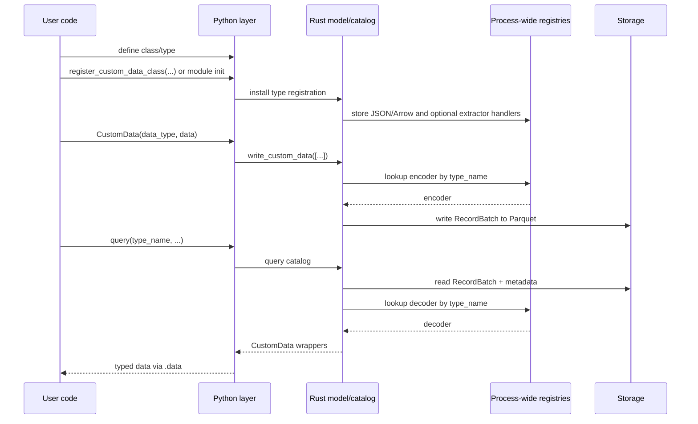
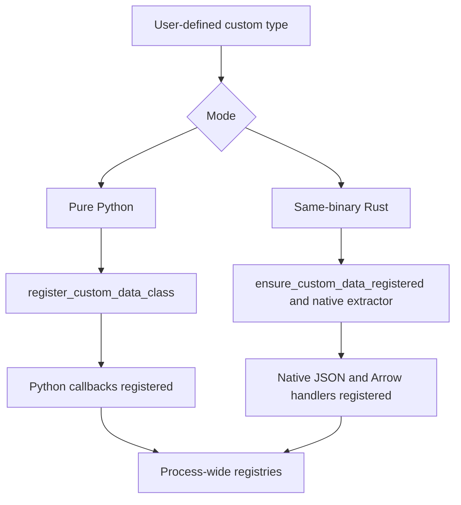
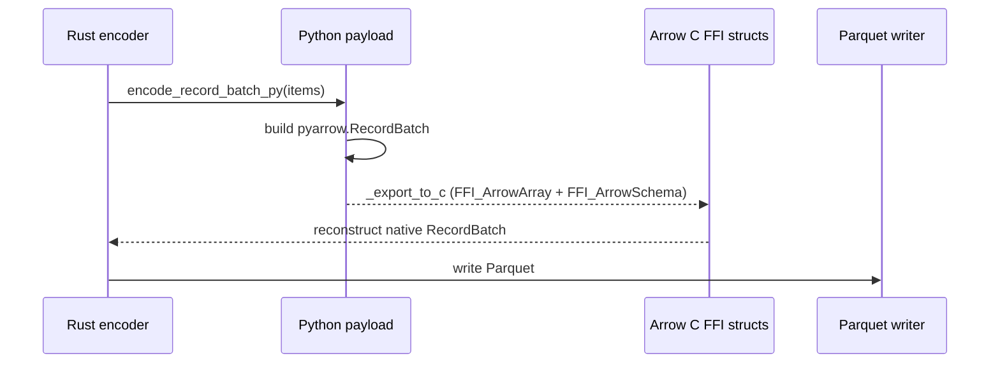

# Custom Data

NautilusTrader supports custom data authored in Python or Rust. Both forms use
the same runtime routing, persistence, and query pipeline as built-in data.

This document explains how custom data is:

- Registered at runtime.
- Wrapped across the Python/Rust boundary.
- Serialized to and from Arrow/Parquet.
- Routed through actors and strategies.

## Goals

The custom-data architecture satisfies the following requirements:

- Let users define custom data in pure Python without writing Rust code.
- Let Rust-defined custom data use native Rust JSON and Arrow handlers.
- Preserve a single user-facing `CustomData` wrapper at the PyO3 boundary.
- Support persistence in `ParquetDataCatalog` using dynamic type registration
  instead of hardcoded schemas.
- Make custom data routable through the normal data-engine, actor, and strategy
  subscription flow.

## High-level model

There are two supported authoring modes:

| Mode             | Authoring form                                  | Registration path                                                 | Encode/decode path            | Wrapper backend           |
| ---------------- | ----------------------------------------------- | ----------------------------------------------------------------- | ----------------------------- | ------------------------- |
| Pure Python      | Class with JSON and Arrow methods               | `register_custom_data_class(...)`                                 | Python callback + Arrow C FFI | `PythonCustomDataWrapper` |
| Same-binary Rust | `#[custom_data]` or `#[custom_data(pyo3)]` type | `ensure_custom_data_registered::<T>()` and extractor registration | Native Rust                   | Native Rust payload       |

Both modes converge on the same outer PyO3 `CustomData` wrapper and the same
`DataType` identity model.

## End-to-end flow

## Core components

### Registry module

`crates/model/src/data/registry.rs` holds the process-wide JSON, Arrow, and
Python extraction registries. Registration uses atomic `DashMap::entry()`
operations so concurrent `register_*` and `ensure_*` calls do not race when
claiming an entry.

The module initializes its registry state through `OnceLock` and stores:

- JSON deserializers keyed by `type_name`.
- Arrow schemas, encoders, and decoders keyed by `type_name`.
- Python extractors that convert a Python object into
  `Arc<dyn CustomDataTrait>`.
- Rust extractor factories that produce Python extractors for same-binary types.

Instead of hardcoding every type into the main binary, NautilusTrader resolves
handlers at runtime using the `type_name` stored in `DataType` and Parquet
metadata.

### `CustomData`

The outer PyO3 `CustomData` wrapper is the common container that crosses the
FFI boundary.

Constructor signature: `CustomData(data_type, data)` where `DataType` comes
first, then the inner payload.

It contains:

- A `DataType`.
- An inner custom payload implementing `CustomDataTrait` (wrapped in
  `Arc<dyn CustomDataTrait>`).

Timestamps (`ts_event`, `ts_init`) are delegated to the inner
`CustomDataTrait` implementation and exposed as properties on the wrapper.

On the Python side, `CustomData` implements `__eq__` and `__repr__`. The Rust
`PartialEq` implementation compares the `DataType` and delegates payload
equality to the inner value. Instances are intentionally unhashable so equality
remains consistent with the payload comparison.

This wrapper is shared across both custom-data modes. User code interacts with
one API even though the underlying payload may be:

- A Python-backed wrapper.
- A same-binary Rust value.

#### `CustomData` JSON envelope

When serialized to JSON, such as for `to_json_bytes` / `from_json_bytes`, the
SQL cache, or Redis, `CustomData` uses one canonical envelope. Deserialization
therefore does not depend on user payload field names:

- `type`: The custom type name (from `CustomDataTrait::type_name`).
- `data_type`: An object with `type_name`, `metadata`, and optional
  `identifier`.
- `payload`: The inner payload only (the result of `CustomDataTrait::to_json`
  parsed as a value). Registered deserializers pass only this value to
  `from_json`, so user structs can use any field names, including `value`,
  without conflicting with wrapper metadata.

This envelope is produced by Rust `CustomData` serialization and consumed by
the registry module when deserializing custom data from JSON.

### `DataType`

`DataType` identifies custom data for routing and persistence.

Constructor: `DataType(type_name, metadata=None, identifier=None)`.

It includes:

- `type_name`.
- Optional `metadata`.
- Optional `identifier` for persistence paths and cache database lookups. It
  does not affect routing, equality, or hashing.

Equality, hashing, and topic routing are derived from `type_name` and
`metadata` only. Two `DataType` values with the same type name and metadata but
different identifiers compare equal and publish to the same message bus topic.
The `identifier` selects the catalog path under
`data/custom/<type_name>/<identifier...>` and participates in PostgreSQL and
Redis filtering.

Persistence stores the full `DataType` with each `CustomData` value and restores
it on query, while handler lookup uses `type_name`. The same logical type can
therefore carry different metadata or identifiers and still decode through the
same registered handler.

## Registration architecture

Registration bridges the gap between Python objects and Rust trait objects.

### Pure Python registration

When Python code calls `register_custom_data_class(MyType)`:

1. Rust retains the class for JSON reconstruction.
1. Rust registers JSON and Arrow handlers that invoke the class callbacks.
1. When constructing `CustomData`, Rust uses a registered native extractor if
   it accepts the object. Otherwise, it wraps the object in
   `PythonCustomDataWrapper`.

JSON and Arrow callbacks on this path run under the Python GIL.

### Same-binary Rust registration

For Rust types compiled into the process:

1. `#[custom_data]` or `#[custom_data(pyo3)]` generates the trait and JSON
   implementations, plus Arrow implementations by default.
1. `ensure_custom_data_registered::<T>()` inserts native schema/encoder/decoder
   handlers into the process-wide registries.
1. `ensure_rust_extractor_registered::<T>()` registers an extractor factory for
   PyO3-exposed types. Once activated through Python class registration, the
   extractor can recover the concrete Rust type instead of using the Python
   wrapper.

This path stays fully native in Rust for encode/decode.

### Registration precedence

`register_custom_data_class(...)` resolves handlers in the following order:

1. Use a native extractor and existing native JSON/Arrow handlers when they are
   registered.
1. Otherwise, use the Python wrapper and callback handlers.

The idempotent `ensure_*` registrations do not overwrite existing native
handlers.

## Wrapper backends

Internally, the outer `CustomData` wrapper can hold different payload
implementations.

### `PythonCustomDataWrapper`

Used for pure Python custom data.

Responsibilities:

- Stores a reference to the Python object.
- Caches `ts_event`, `ts_init`, and `type_name`.
- Implements `CustomDataTrait`.
- Supports JSON and Arrow callback paths that invoke Python under the GIL.

This is the construction fallback when no registered extractor accepts the
object. Python JSON and Arrow decoders also produce this wrapper directly.

### Native same-binary Rust payload

For Rust types compiled into the process, the inner payload is the concrete
Rust type and can be downcast directly from `Arc<dyn CustomDataTrait>`.

No Python callback path is needed for serialization or decode.

## Persistence architecture

### Why dynamic Arrow registration is needed

Built-in NautilusTrader data types have schemas and encoders known statically to
the Rust binary. Custom data does not. The persistence layer therefore resolves
custom data dynamically using the registered `type_name`.

### Catalog write flow

`ParquetDataCatalog` expects custom writes to come in as `CustomData` values.

The custom-data write path:

1. Takes `type_name` from the inner payload and `metadata` and `identifier` from
   the first value's `DataType`.
1. Looks up the Arrow encoder in the process-wide registry.
1. Encodes the values to a `RecordBatch`.
1. Appends a `data_type` column containing the persisted `DataType`.
1. Attaches `type_name` and metadata to the Arrow schema.
1. Writes the batch to Parquet under the custom-data path.

The path layout is `data/custom/<type_name>/<identifier...>`.

Identifiers are normalized before becoming path segments.

### Catalog read flow

On query:

1. The catalog reads matching Parquet files.
1. Extracts `type_name` from schema metadata.
1. Asks the process-wide registry for the decoder.
1. Decodes the `RecordBatch` into `Vec<Data>`.
1. Reconstructs `CustomData` with the original `DataType`.

This makes custom-data query resolution symmetric with write-time registration.
When converting a Feather stream to Parquet, such as after a backtest, the
custom-data branch is designed to transform the Arrow batches and write the
result directly to the matching custom-data path.

:::warning
Streaming Feather persistence for custom data is not currently available. The
Python `StreamingFeatherWriter` rejects `CustomData` with an `OSError`, and
`convert_stream_to_data` does not convert custom-data Feather streams to
Parquet. This will be possible in a future version. In the meantime, write
custom data directly to the catalog with `ParquetDataCatalog.write_custom_data`.
:::

## The Arrow C FFI bridge

Pure Python custom data does not provide native Rust Arrow encode logic. For
these types, NautilusTrader uses the Arrow C FFI interface to pass
`RecordBatch` data between Python and Rust without JSON or binary
serialization.

### Pure Python encode path

For pure Python classes:

1. Rust acquires the GIL.
1. Rust calls `encode_record_batch_py(...)` on the first Python payload.
1. Python converts objects to a `pyarrow.RecordBatch`.
1. Python exports the batch via `_export_to_c` into Arrow C FFI structs.
1. Rust reconstructs a native `RecordBatch` from the FFI structs and writes it.

### Pure Python decode path

For the reverse direction:

1. Rust converts its `RecordBatch` into Arrow C FFI structs.
1. Python imports the batch via `RecordBatch._import_from_c`.
1. Python calls `decode_record_batch_py(metadata, batch)` on the class.
1. Rust wraps the returned Python objects in `PythonCustomDataWrapper`.

### Native paths

The Arrow C FFI bridge is not used for same-binary Rust custom data. Those
types use native Rust encode/decode handlers registered in the main process.

## Reconstruction on query

When custom data is loaded back from the catalog, reconstruction depends on the
backend:

- Same-binary Rust types decode directly to native Rust values.
- Pure Python types reconstruct through the registered class's
  `decode_record_batch_py(...)` callback.

In all cases the caller receives the same outer `CustomData` wrapper at the
PyO3 API boundary.

## Runtime integration

Custom data also participates in NautilusTrader runtime routing.

Relevant integrations include:

- `crates/data/src/engine/mod.rs` publishes `CustomData` through the message
  bus.
- `crates/common/src/msgbus/switchboard.rs` derives custom topics from
  `DataType`.
- `crates/common/src/actor/*` routes custom data into actor subscriptions.
- `crates/trading/src/python/strategy.rs` exposes custom data to Python
  strategy `on_data`.
- `crates/backtest/src/engine.rs` treats `Data::Custom` as
  data-engine-delivered input rather than exchange-routed data.

A registered custom type can be persisted, queried, subscribed to, and consumed
through the same runtime interfaces as built-in data families.

## Cache database integration

The PostgreSQL and Redis cache database implementations support `CustomData`.

- PostgreSQL stores custom data in the `custom` table.
- The stored record includes `data_type`, `metadata`, `identifier`, and full
  JSON payload.
- Reads reconstruct `CustomData` using `CustomData::from_json_bytes(...)`.
- Python SQL bindings expose `add_custom_data` and `load_custom_data`.
- Redis cache stores custom data under keys
  `custom:<ts_init_020>:<uuid>` with full `CustomData` JSON as value.
- Redis `add_custom_data` and `load_custom_data` filter by `DataType`
  (type_name, metadata, identifier) and return results sorted by `ts_init`;
  this is exposed via the PyO3 `RedisCacheDatabase` API.

## Practical implications

Python-only authoring and native Rust encode/decode remain two backends of one
conceptual custom-data system rather than separate Python-only and Rust-only
feature sets.
