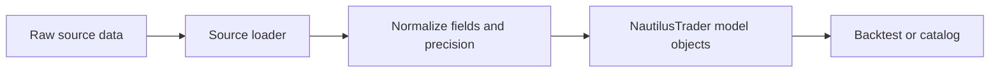

# Data

NautilusTrader supports granular order book data, quotes, trades, bars, reference prices, and
custom data. This overview links to the built-in types and explains the concepts shared across
backtesting, sandbox, and live environments.

## Built-in data types

Each main built-in market data type has a dedicated guide to its fields, behavior, and construction.

| Data type                                     | Category             | Description                                          |
| --------------------------------------------- | -------------------- | ---------------------------------------------------- |
| [`OrderBookDelta`](order_book_delta.md)       | Order book           | Single incremental order book change.                |
| [`OrderBookDeltas`](order_book_deltas.md)     | Order book           | Batch of related order book deltas.                  |
| [`OrderBookDepth`](order_book_depth.md)       | Order book           | Variable-depth bid and ask snapshots.                |
| [`QuoteTick`](quote_tick.md)                  | Top-of-book          | Best bid and ask prices and sizes.                   |
| [`TradeTick`](trade_tick.md)                  | Trades               | Single venue trade or match event.                   |
| [`Bar`](bar.md)                               | Aggregation          | OHLCV bar for a specific `BarType`.                  |
| [`MarkPriceUpdate`](mark_price_update.md)     | Derivative reference | Mark price for a derivatives instrument.             |
| [`IndexPriceUpdate`](index_price_update.md)   | Derivative reference | Index price used by a derivatives market.            |
| [`FundingRateUpdate`](funding_rate_update.md) | Derivative reference | Funding rate and next funding metadata.              |
| [`OptionGreeks`](option_greeks.md)            | Options              | Venue-provided Greeks and implied volatility.        |
| [`InstrumentStatus`](instrument_status.md)    | Instrument event     | Trading, quoting, and halt status changes.           |
| [`InstrumentClose`](instrument_close.md)      | Instrument event     | Close, settlement, or other venue close price event. |

When data flows over the message bus, topic-addressable data stays under the `data`
root. Live streams use `data.<kind>...`; the data pipeline path uses
`data.pipeline.<kind>...`. See [Message Bus](../message_bus.md#topic-hierarchy) for
the topic hierarchy.

## Order books

A Rust `OrderBook` maintains state for one instrument in backtesting and live trading. NautilusTrader
supports these book types:

- `L3_MBO`: Level 3 market-by-order (MBO) data, keyed by order ID at every price level.
- `L2_MBP`: Level 2 market-by-price (MBP) data, aggregated by price level.
- `L1_MBP`: Level 1 market-by-price (MBP) top-of-book data, also known as best bid and offer (BBO).

Quote, trade, and bar data (`QuoteTick`, `TradeTick`, and `Bar`) can also drive `L1_MBP` books in
backtests.

### Delta flags and event boundaries

Each `OrderBookDelta` carries a `flags` field using `RecordFlag` bitmask values
to signal event boundaries to the `DataEngine`:

- `F_LAST`: Marks the final delta in a logical event group. When `buffer_deltas`
  is enabled, the `DataEngine` accumulates deltas and only publishes to
  subscribers when it encounters `F_LAST`. Every event group **must** end with
  a delta that has `F_LAST` set.
- `F_SNAPSHOT`: Marks deltas that belong to a snapshot (as opposed to an
  incremental update). Snapshot sequences begin with a `Clear` action followed
  by `Add` deltas reconstructing the full book state. The last delta in a
  snapshot has both `F_SNAPSHOT | F_LAST` set.

:::warning[Missing F_LAST stalls buffered consumers]
A missing `F_LAST` on the final delta in an event group causes buffered consumers
to accumulate deltas indefinitely without publishing. This applies to incremental
updates and snapshots alike, including empty book snapshots where only a `Clear`
delta is emitted.
:::

## Instruments

All market data belongs to an instrument. The instrument definition supplies the
identity, precision, price and size increments, limits, currencies, and contract
semantics that make the data meaningful.

See [Instruments](../instruments/) for the instrument taxonomy and per-type guides.

## Bars and aggregation

### Introduction to bars

A **bar**, also known as a candle, candlestick, or kline, summarizes price and volume over an interval:

- Opening price
- Highest price
- Lowest price
- Closing price
- Traded volume (or ticks as a volume proxy)

An **aggregation method** defines how NautilusTrader groups input data into bars.

### Purpose of data aggregation

Aggregation converts granular market data into bars that:

- Supply inputs for technical indicators and strategies.
- Match the time resolution a strategy needs.
- Reduce storage and processing compared with high-frequency order book data.

### Aggregation methods

NautilusTrader supports these aggregation methods:

| Name               | Description                                               | Category    |
| :----------------- | :-------------------------------------------------------- | :---------- |
| `TICK`             | Number of ticks.                                          | Threshold   |
| `TICK_IMBALANCE`   | Buy/sell imbalance of ticks.                              | Threshold   |
| `TICK_RUNS`        | Sequential buy/sell runs of ticks.                        | Information |
| `VOLUME`           | Traded volume.                                            | Threshold   |
| `VOLUME_IMBALANCE` | Buy/sell imbalance of traded volume.                      | Threshold   |
| `VOLUME_RUNS`      | Sequential buy/sell runs of traded volume.                | Information |
| `VALUE`            | Notional trade value, also known as dollar bars.          | Threshold   |
| `VALUE_IMBALANCE`  | Buy/sell imbalance of notional trade value.               | Threshold   |
| `VALUE_RUNS`       | Sequential buy/sell runs of notional trade value.         | Information |
| `RENKO`            | Fixed price movements, with brick size measured in ticks. | Price       |
| `MILLISECOND`      | Time intervals with millisecond granularity.              | Time        |
| `SECOND`           | Time intervals with second granularity.                   | Time        |
| `MINUTE`           | Time intervals with minute granularity.                   | Time        |
| `HOUR`             | Time intervals with hour granularity.                     | Time        |
| `DAY`              | Time intervals with day granularity.                      | Time        |
| `WEEK`             | Time intervals with week granularity.                     | Time        |
| `MONTH`            | Time intervals with month granularity.                    | Time        |
| `YEAR`             | Time intervals with year granularity.                     | Time        |

The threshold, information, and time categories follow the `BarSpecification` predicates. `RENKO`
is price-driven and has no matching predicate. The broader information-driven concept below
includes both imbalance and runs bars.

### Information-driven bars

Information-driven bars adapt their sampling frequency to market activity rather than using fixed
intervals. They are based on the concept of **aggressor side** (whether the trade initiator was a
buyer or seller) and come in two families: **imbalance** and **runs**.

**Imbalance bars** close when the *net* buy/sell activity reaches a threshold. Each trade contributes
a signed value: positive for buyer-initiated trades and negative for seller-initiated trades. The bar closes
when the absolute imbalance reaches the configured step. This means that opposing trades cancel each
other out, so imbalance bars form more slowly in balanced markets and faster during directional moves.

**Runs bars** close when *consecutive* activity from the same aggressor side reaches a threshold.
Unlike imbalance bars, runs bars reset their counter when the aggressor side changes.
This makes them sensitive to sustained one-sided pressure rather than net imbalance.

Both families have three variants based on what is measured:

| Variant | Imbalance          | Runs          | What is measured              |
| :------ | :----------------- | :------------ | :---------------------------- |
| Tick    | `TICK_IMBALANCE`   | `TICK_RUNS`   | Number of trades.             |
| Volume  | `VOLUME_IMBALANCE` | `VOLUME_RUNS` | Traded quantity.              |
| Value   | `VALUE_IMBALANCE`  | `VALUE_RUNS`  | Price multiplied by quantity. |

Information-driven bars require `TradeTick` data because they need the `aggressor_side` field to
classify each trade. They cannot be aggregated from `QuoteTick` data alone.

### Types of aggregation

NautilusTrader supports three aggregation inputs:

| Input         | Result                                    | Price type             | Syntax requirement  |
| ------------- | ----------------------------------------- | ---------------------- | ------------------- |
| `TradeTick`   | Trade-to-bar aggregation.                 | `LAST`                 | No `@` source.      |
| `QuoteTick`   | Quote-to-bar aggregation.                 | `BID`, `ASK`, or `MID` | No `@` source.      |
| Smaller `Bar` | Bar-to-bar aggregation into a larger bar. | Target bar price type. | Source follows `@`. |

### Bar types

`BarType` identifies a bar by:

- **Instrument ID** (`InstrumentId`): The instrument for the bar.
- **Bar specification** (`BarSpecification`):
  - `step`: The interval or frequency.
  - `aggregation`: The aggregation method.
  - `price_type`: The price basis, such as bid, ask, mid, or last.
- **Aggregation source** (`AggregationSource`): Whether NautilusTrader or an external venue or data
  provider aggregated the bar.

The Rust/PyO3 `BarSpecification` validates fixed-subunit time aggregations so bars align cleanly
with their parent clock or calendar unit:

- `MILLISECOND` steps must divide 1000 and be less than 1000.
- `SECOND` and `MINUTE` steps must divide 60 and be less than 60.
- `HOUR` steps must divide 24 and be less than 24.
- `MONTH` steps must divide 12 and may equal 12.

Except for `12-MONTH`, use the next larger aggregation when the step equals a parent unit, such as
`1-HOUR` instead of `60-MINUTE`. In this model, `DAY`, `WEEK`, `YEAR`, threshold,
information-driven, and `RENKO` bars are not restricted by this fixed-subunit rule. Time
aggregations must also convert to a duration and nanosecond interval, so an oversized `DAY`,
`WEEK`, or `YEAR` step is rejected.

Bar types can also be classified as either *standard* or *composite*:

- **Standard**: Generated from granular market data, such as quote ticks or trade ticks.
- **Composite**: Derived from a finer-grained bar type, such as 5-minute bars aggregated from
  1-minute bars.

### Aggregation sources

Bar data aggregation can be either *internal* or *external*:

- `INTERNAL`: NautilusTrader aggregates the bar.
- `EXTERNAL`: A venue or data provider aggregates the bar.

For bar-to-bar aggregation, the target is always `INTERNAL`. The source can be `INTERNAL` or
`EXTERNAL`.

### Defining bar types with string syntax

#### Standard bars

Define a standard bar type with:

`{instrument_id}-{step}-{aggregation}-{price_type}-{INTERNAL | EXTERNAL}`

This example defines 5-minute AAPL trade bars that NautilusTrader aggregates locally:

```python
bar_type = BarType.from_str("AAPL.XNAS-5-MINUTE-LAST-INTERNAL")
```

#### Composite bars

Define a composite bar type with:

`{instrument_id}-{step}-{aggregation}-{price_type}-INTERNAL@{step}-{aggregation}-{INTERNAL | EXTERNAL}`

- The derived bar type must use an `INTERNAL` aggregation source (since this is how the bar is aggregated).
- The sampled bar type must be finer-grained than the derived bar type.
- The sampled instrument ID is inferred to match that of the derived bar type.
- Composite bars can be aggregated *from* `INTERNAL` or `EXTERNAL` aggregation sources.

This example defines internal 5-minute AAPL trade bars aggregated from external 1-minute bars:

```python
bar_type = BarType.from_str("AAPL.XNAS-5-MINUTE-LAST-INTERNAL@1-MINUTE-EXTERNAL")
```

### Aggregation syntax examples

The `BarType` string format encodes both the target bar type and, optionally, the source data type:

```text
{instrument_id}-{step}-{aggregation}-{price_type}-{source}@{step}-{aggregation}-{source}
```

The part after `@` applies only to bar-to-bar aggregation:

- **Without `@`**: Aggregate from `TradeTick` objects for `LAST`, or `QuoteTick` objects for
  `BID`, `ASK`, or `MID`.
- **With `@`**: Aggregate from existing `Bar` objects of the specified source type.

#### Trade-to-bar example

```python
def on_start(self) -> None:
    # LAST selects TradeTick data as the source
    bar_type = BarType.from_str("6EH4.XCME-50-VOLUME-LAST-INTERNAL")
    start = self.clock.utc_now() - timedelta(days=30)

    # Deliver historical bars to on_historical_bars
    self.request_bars(bar_type, start=start)

    # Deliver live bars to on_bar
    self.subscribe_bars(bar_type)
```

#### Quote-to-bar example

```python
def on_start(self) -> None:
    # Create 1-minute bars from QuoteTick ask prices
    bar_type_ask = BarType.from_str("6EH4.XCME-1-MINUTE-ASK-INTERNAL")

    # Create 1-minute bars from QuoteTick bid prices
    bar_type_bid = BarType.from_str("6EH4.XCME-1-MINUTE-BID-INTERNAL")

    # Create 1-minute bars from QuoteTick mid prices
    bar_type_mid = BarType.from_str("6EH4.XCME-1-MINUTE-MID-INTERNAL")
    start = self.clock.utc_now() - timedelta(days=30)

    self.request_bars(bar_type_ask, start=start)
    self.subscribe_bars(bar_type_ask)
```

#### Bar-to-bar example

```python
def on_start(self) -> None:
    # Create 5-minute bars from 1-minute Bar objects
    # Format: target_bar_type@source_bar_type
    # The price type appears only on the target side
    bar_type = BarType.from_str("6EH4.XCME-5-MINUTE-LAST-INTERNAL@1-MINUTE-EXTERNAL")
    start = self.clock.utc_now() - timedelta(days=30)

    self.request_bars(bar_type, start=start)

    # Deliver live updates to on_bar
    self.subscribe_bars(bar_type)
```

#### Advanced bar-to-bar example

Build longer aggregation chains from bars that NautilusTrader has already aggregated:

```python
# Create 1-minute bars from TradeTick objects
primary_bar_type = BarType.from_str("6EH4.XCME-1-MINUTE-LAST-INTERNAL")

# Create 5-minute bars from the 1-minute bars
intermediate_bar_type = BarType.from_str("6EH4.XCME-5-MINUTE-LAST-INTERNAL@1-MINUTE-INTERNAL")

# Create hourly bars from the 5-minute bars
hourly_bar_type = BarType.from_str("6EH4.XCME-1-HOUR-LAST-INTERNAL@5-MINUTE-INTERNAL")
```

### Working with bars: request vs. subscribe

NautilusTrader provides two operations for working with bars:

| Method             | Purpose                 | Delivery handler       |
| ------------------ | ----------------------- | ---------------------- |
| `request_bars()`   | Fetch historical bars.  | `on_historical_bars()` |
| `subscribe_bars()` | Subscribe to live bars. | `on_bar()`             |

`subscribe_bars()` expects the instrument for the `BarType` in the cache. The same precondition
applies to other live market data subscriptions.

These methods work together in a typical workflow:

1. `request_bars()` loads historical data to initialize indicators or strategy state.
1. `subscribe_bars()` continues the stream with live bars.

The request returns a correlation ID. Historical data arrives through `on_historical_bars()` as a
`Sequence[Bar]`; live data arrives through `on_bar()` one bar at a time.

```python
from collections.abc import Sequence


def on_start(self) -> None:
    bar_type = BarType.from_str("6EH4.XCME-5-MINUTE-LAST-INTERNAL")
    start = self.clock.utc_now() - timedelta(days=30)

    # Register indicators before requesting history
    self.register_indicator_for_bars(bar_type, self.my_indicator)

    self.request_bars(bar_type, start=start)
    self.subscribe_bars(bar_type)


def on_historical_bars(self, bars: Sequence[Bar]) -> None:
    for bar in bars:
        self.log.info(f"Historical bar: {bar}")


def on_bar(self, bar):
    # Process individual bars from subscribe_bars()
    pass
```

### Register indicators before requesting data

Register indicators before requesting historical data so they receive those updates.

```python
start = self.clock.utc_now() - timedelta(days=30)

# Correct order
self.register_indicator_for_bars(bar_type, self.ema)
self.request_bars(bar_type, start=start)

# Incorrect order: the indicator misses historical updates
self.request_bars(bar_type, start=start)
self.register_indicator_for_bars(bar_type, self.ema)
```

### Performance considerations

Bar aggregators track OHLC prices with the fixed-point `Price` type. The aggregation method
determines the additional work for each update:

- **Time bars** accumulate OHLCV state per update and use a timer to emit bars.
- **Threshold bars** (tick, volume, value) add a counter or accumulator check per update.
  Volume and value bars may split a single large trade across multiple bars when it exceeds the
  remaining threshold.
- **Information-driven bars** (imbalance, runs) track aggressor side and signed accumulation.
- **Renko bars** are price-driven and can emit several bars from one large price move.
- **Composite bars** process an aggregated source bar instead of each underlying tick.

### Time bar configuration

Time bar behavior is controlled through `DataEngineConfig`. The following options
apply to all time-based aggregation from milliseconds through years:

| Option                              | Type                        | Default     | Description                                                                                                                                                  |
| :---------------------------------- | :-------------------------- | :---------- | :----------------------------------------------------------------------------------------------------------------------------------------------------------- |
| `time_bars_interval_type`           | `BarIntervalType` or `str`  | `LEFT_OPEN` | `LEFT_OPEN`: start excluded, end included. `RIGHT_OPEN`: start included, end excluded. The Python constructor also accepts `"left-open"` and `"right-open"`. |
| `time_bars_timestamp_on_close`      | `bool`                      | `True`      | When `True`, `ts_event` is the bar close time. When `False`, `ts_event` is the bar open time.                                                                |
| `time_bars_skip_first_non_full_bar` | `bool`                      | `False`     | Skip emitting a bar when aggregation starts mid-interval, avoiding partial bars on startup.                                                                  |
| `time_bars_build_with_no_updates`   | `bool`                      | `True`      | When `True`, bars are emitted even if no market updates arrived during the interval.                                                                         |
| `time_bars_origin_offset`           | `dict[BarAggregation, int]` | `{}`        | Maps aggregation types to nanosecond offsets that shift bar alignment.                                                                                       |
| `time_bars_build_delay`             | `int`                       | `0`         | Delay in microseconds before building a bar. Useful in backtests to ensure data at bar boundary timestamps is processed before the timer fires.              |

For example, an offset of `34_200_000_000_000` nanoseconds for `BarAggregation.DAY` aligns daily
bar boundaries to 09:30 UTC.

```python
from nautilus_trader.config import DataEngineConfig

config = DataEngineConfig(
    time_bars_timestamp_on_close=True,
    time_bars_build_with_no_updates=False,
    time_bars_skip_first_non_full_bar=True,
)
```

## Timestamps

Many market data, order, and event objects carry two timestamps:

- `ts_event`: UNIX timestamp in nanoseconds when the event occurred.
- `ts_init`: UNIX timestamp in nanoseconds when NautilusTrader initialized the object.

### Typical meanings

| Event type        | `ts_event`                             | `ts_init`                                        |
| ----------------- | -------------------------------------- | ------------------------------------------------ |
| `TradeTick`       | Trade time at the venue.               | Local object initialization time.                |
| `QuoteTick`       | Quote time at the venue.               | Local object initialization time.                |
| `OrderBookDelta`  | Book update time at the venue.         | Local object initialization time.                |
| `Bar`             | Configured bar open or close boundary. | Local aggregation or object initialization time. |
| `DefiData`        | Block or pool event time.              | Object initialization time from the chain data.  |
| `OrderFilled`     | Fill time at the venue.                | Local fill event initialization time.            |
| `OrderCanceled`   | Cancellation time at the venue.        | Local cancellation event initialization time.    |
| Custom news event | Publication time.                      | Local object initialization time.                |
| Custom event      | Time defined by the custom event.      | Local object initialization time.                |

:::note
`ts_init` means initialization time, not always receipt time. Commands and internally generated
events also use it even though NautilusTrader does not receive them from an external source.
:::

### Latency analysis

The difference `ts_init - ts_event` measures observed delay only when the clocks that produced both
timestamps are synchronized. Otherwise, the result also includes clock offset and cannot represent
system latency by itself.

### Environment-specific behavior

#### Backtesting environment

- Data is ordered by `ts_init` using a stable sort.
- DeFi data (`DefiData`) breaks `ts_init` ties by on-chain position (block number, transaction
  index, log index) so events from the same block replay in canonical chain order.
- This ordering gives backtests deterministic replay.

#### Live trading environment

Live trading processes data as it arrives. For venue-sourced data, `ts_event` records the external
event time, while `ts_init` usually records local object initialization after receipt.

### Other notes and considerations

- For data from external sources, `ts_init` is usually the local receipt or normalization time,
  but clock skew means it is not guaranteed to be greater than or equal to `ts_event`.
- For data created within NautilusTrader, `ts_init` and `ts_event` can match.
- Some types with `ts_init` do not have `ts_event` because:
  - The initialization of an object happens at the same time as the event itself.
  - The concept of an external event time does not apply.

#### Persisted data

The `ts_init` field preserves the original initialization timestamp. For venue data this is
typically receipt time; for internally created data it is the creation time of that object.

## Data flow

From the `DataEngine` onward, data follows the same pathway regardless of
[environment context](../architecture.md#environment-contexts) (backtest, sandbox,
live). In live and sandbox modes a venue adapter creates a normalized data
object and sends it through a channel; in backtests the engine feeds data
directly. Either way the `DataEngine` stores it in the `Cache` (for cached
types) and publishes it on the `MessageBus` to subscribed handlers.
For a step-by-step trace with a sequence diagram, see
[Data flow: life of a quote tick](../architecture.md#data-flow-life-of-a-quote-tick).

See [Custom data](#custom-data) to define and publish another data type.

## Loading data

Convert external records into NautilusTrader model objects before adding them to a backtest or
writing them to a catalog. The conversion path depends on the source:

- Use an adapter loader when the repository provides one for that source format.
- Construct the target model type directly when working from normalized rows or a DataFrame.
- Use the PyO3 data wranglers for Arrow IPC streams that already follow the NautilusTrader schema.

### Data loaders

Data loaders are specific to a source format. For example, Binance order book CSV data differs from
[Databento Binary Encoding (DBN)](https://databento.com/docs/knowledge-base/new-users/dbn-encoding/getting-started-with-dbn).

For example, `load_binance_order_book_deltas(...)` reads Binance depth CSV files into a normalized
DataFrame. Convert those rows into `OrderBookDelta` objects with the instrument's price and size
precision. See the [tutorials](../../tutorials/) for complete catalog and backtest workflows.

### Arrow IPC wranglers

The PyO3 persistence module provides these wranglers for schema-compatible Arrow IPC streams:

| Wrangler                     | Constructor identity               | Return type            |
| ---------------------------- | ---------------------------------- | ---------------------- |
| `OrderBookDeltaDataWrangler` | Instrument ID and both precisions. | `list[OrderBookDelta]` |
| `OrderBookDepthDataWrangler` | Instrument ID and both precisions. | `list[OrderBookDepth]` |
| `QuoteTickDataWrangler`      | Instrument ID and both precisions. | `list[QuoteTick]`      |
| `TradeTickDataWrangler`      | Instrument ID and both precisions. | `list[TradeTick]`      |
| `BarDataWrangler`            | Bar type and both precisions.      | `list[Bar]`            |

Each constructor takes the identity as a string, followed by `price_precision` and
`size_precision`. Pass the complete Arrow IPC stream as `bytes` to
`process_record_batch_bytes(...)`.

### Fixed-point precision and raw values

NautilusTrader uses fixed-point arithmetic for `Price` and `Quantity`. Raw values must match the
scale for their declared precision.

#### Raw value requirements

When constructing `Price` or `Quantity` with `from_raw()`, use a raw value from:

- The `.raw` field of an existing value, such as `price.raw`.
- NautilusTrader fixed-point conversion functions.
- Decimal values from current Arrow columns through `Price.from_decimal` or `Quantity.from_decimal`,
  rather than through `from_raw`.

:::warning[Unvalidated raw values]
For a precision below `FIXED_PRECISION`, the raw value must be divisible by
`10^(FIXED_PRECISION - precision)`. Construction does not reject an invalid multiple, which can
produce an incorrect value.
:::

Current catalog price and size columns for fixed-point market data use `Decimal128(38, 16)`. Their
decoded values are decimals; their physical mantissas use the storage scale, which can differ from
the model's raw integer scale. Use `from_raw()` only for integers already encoded at the active model
scale.

#### Legacy raw value correction

Older catalog writers could introduce floating-point errors by calculating raw values with
`int(value * FIXED_SCALAR)`. Explicit migration corrects affected price and quantity values to the
nearest valid scale multiple for their precision while leaving sentinel values unchanged. These
catalogs require explicit migration before runtime queries. The correction adds a small amount of
work during Arrow decoding.

### Transformation pipeline

1. A source-specific loader reads raw data.
1. The conversion normalizes field names, timestamps, enums, and precision.
1. Model constructors validate and create NautilusTrader data objects.
1. The application passes those objects to a backtest or catalog writer.



The conversion must preserve exact price and quantity values. Build `Price` and `Quantity` from
decimal or string input rather than routing discrete values through binary floating point.

## Data catalog

The data catalog stores NautilusTrader data in [Parquet](https://parquet.apache.org) files for
backtesting, live trading, and research. See the [data catalog guide](catalog.md) for
initialization, storage options, writing, querying, and file operations.

## Data migrations

The `nautilus_model` crate defines the internal data format. NautilusTrader serializes these models
as Arrow record batches and stores them in Parquet files.

Use the migration utilities when changing
[precision modes](../../getting_started/installation.md#precision-mode) or schemas.

### Migration tools

The `nautilus_persistence` crate provides two utilities:

#### `to-json`

`to-json` converts Parquet files to JSON and preserves their metadata:

- Creates two files:

  - `<input>.json`: Deserialized data.
  - `<input>.metadata.json`: Schema metadata and row group configuration.

- Automatically detects data type from filename:

  - `OrderBookDelta`: File name contains `deltas` or `order_book_delta`.
  - `QuoteTick`: File name contains `quotes` or `quote_tick`.
  - `TradeTick`: File name contains `trades` or `trade_tick`.
  - `Bar`: File name contains `bars`.

#### `to-parquet`

`to-parquet` converts JSON back to Parquet:

- Reads both the data JSON and metadata JSON files.
- Preserves row group sizes from original metadata.
- Uses ZSTD compression.
- Creates `<input>.parquet`.

### Migration process

These examples use trade data. Run each command from `crates/persistence`.

#### Migrating from standard-precision (64-bit) to high-precision (128-bit)

Convert a standard-precision schema to a high-precision schema:

:::note
For catalogs that used the `Int64` and `UInt64` Arrow data types for prices and sizes, build the
initial `to-json` conversion from
[commit `e284162`](https://github.com/nautechsystems/nautilus_trader/commit/e284162cf27a3222115aeb5d10d599c8cf09cf50).
:::

1. Convert standard-precision Parquet to JSON:

   ```bash
   cargo run --features python --bin to-json -- trades.parquet
   ```

   This creates `trades.json` and `trades.metadata.json`.

1. Convert the JSON to high-precision Parquet:

   ```bash
   cargo run --features "python high-precision" --bin to-parquet -- trades.json
   ```

   This creates `trades.parquet` with the high-precision schema.

#### Migrating schema changes

Convert data from one schema version to another:

1. Convert the old-schema Parquet file to JSON:

   For a high-precision source, replace `--features python` with
   `--features "python high-precision"`.

   ```bash
   cargo run --features python --bin to-json -- trades.parquet
   ```

   This creates `trades.json` and `trades.metadata.json`.

1. Switch to the new schema version:

   ```bash
   git checkout <new-version>
   ```

1. Convert the JSON to Parquet with the new schema:

   ```bash
   cargo run --features "python high-precision" --bin to-parquet -- trades.json
   ```

   This creates `trades.parquet` with the new schema.

### Best practices

- Test migrations with a small dataset first.
- Back up the original files.
- Verify data integrity after migration.
- Perform migrations in a staging environment before applying them to production data.

## Custom data

Custom payloads use `DataType` for identity and routing and `CustomData` as the common wrapper.
Pure Python payloads can use the fallback wrapper without registration for in-process routing.
Register a type before reconstructing it from JSON or using Arrow, Parquet, or Feather persistence.
Same-binary Rust types can register native handlers; live-only Rust types may omit Arrow support.
Every Python payload wrapped in `CustomData`, including an unregistered in-process payload, must
expose `ts_event` and `ts_init` as UNIX nanosecond timestamps.

See [Custom data](../custom_data.md) for the registry, wrapper, and persistence architecture.

### Pure Python catalog example

A Python class used with the catalog supplies timestamps, JSON callbacks, an Arrow schema, and
Arrow batch callbacks. The `@customdataclass` decorator generates the serialization methods and
schema from the class annotations. It also supplies `ts_event` and `ts_init`; pass them to the
constructor without declaring them as dataclass fields. Register the class once during startup:

```python
from nautilus_trader.model import CustomData
from nautilus_trader.model import DataType
from nautilus_trader.model import register_custom_data_class
from nautilus_trader.model.custom import customdataclass
from nautilus_trader.persistence import ParquetDataCatalog


@customdataclass()
class MarketTickPython:
    symbol: str = ""
    price: float = 0.0
    volume: int = 0


register_custom_data_class(MarketTickPython)

catalog = ParquetDataCatalog("/path/to/catalog")
data_type = DataType("MarketTickPython", metadata={"exchange": "NASDAQ"})
wrapped = [
    CustomData(
        data_type,
        MarketTickPython(ts_event=1, ts_init=1, symbol="AAPL", price=150.5, volume=1000),
    ),
]

catalog.write_custom_data(wrapped)
result = catalog.query_custom_data("MarketTickPython")
ticks = [item.data for item in result]
```

A hand-written class can supply the same surface itself: `ts_event` and `ts_init`,
`type_name_static()`, `to_json()`, `from_json()`, `encode_record_batch_py()`, and
`decode_record_batch_py()`. Registration reads the Arrow schema from a `_schema` class attribute,
falling back to an `arrow_schema_py()` class method, and `encode_record_batch_py` must produce
batches matching it. The schema must contain `ts_init`, which the catalog uses for time filtering.
Any `ts_event` or `ts_init` fields must use `timestamp("ns", tz="UTC")`. When either condition fails,
`write_custom_data` raises rather than writing a file that cannot be queried. Convert files written
earlier with integer timestamps using `nautilus catalog migrate-parquet`. Custom writes must be in
ascending `ts_init` order.

`BacktestDataConfig` accepts built-in catalog data types, not arbitrary custom types. To replay the
queried `CustomData` wrappers, add them to a configured `BacktestEngine` directly:

```python
engine.add_data(result)
```

`BacktestEngine.add_data` sorts by `ts_init` by default. Pass `sort=False` only when the input is
already in the required replay order.

### Publishing and subscribing

Actors and strategies publish and receive the `CustomData` wrapper:

```python
from nautilus_trader.model import CustomData
from nautilus_trader.model import DataType


data_type = DataType("MarketTickPython", metadata={"exchange": "NASDAQ"})
custom = CustomData(data_type, MarketTickPython(ts_event=1, ts_init=1))
self.subscribe_data(data_type)
self.publish_data(data_type, custom)


def on_data(self, data: CustomData) -> None:
    if data.data_type == data_type:
        tick = data.data
```

`publish_data` derives the message-bus topic from its `data_type` argument, including that
argument's metadata. This argument can override the `CustomData` wrapper's own `data_type`; use the
same value for both unless the override is intentional.

`on_data` receives all subscribed custom data, so inspect `data_type` before using `.data`. With no
`client_id`, `subscribe_data` installs only the local message-bus subscription. Supplying a
`client_id` also sends the subscription request to that data client.

### Cache storage

The general `Cache` stores serialized bytes under application-defined keys. After registering the
payload type, an actor or strategy can round-trip the complete `CustomData` wrapper:

```python
cache_key = "market_tick:AAPL"
self.cache.add(cache_key, custom.to_json_bytes())

cached = self.cache.get(cache_key)
if cached is not None:
    restored = CustomData.from_json_bytes(cached)
```

### Publishing and receiving signal data

A **signal** is a named custom-data message whose Python value is converted to a string. Publish and
subscribe from an actor or strategy:

```python
self.subscribe_signal("signal_name")
self.publish_signal("signal_name", value, ts_event)


def on_signal(self, signal):
    print("Signal", signal)
```

If `ts_event` is zero, `publish_signal` uses the current clock time. Signal messages use the custom
data pipeline internally, while `subscribe_signal` dispatches them to `on_signal`.

## Related guides

- [Custom data](../custom_data.md): Runtime registration, wrappers, routing, and persistence.
- [Instruments](../instruments/): Financial instruments referenced by data.
- [Options](../options.md): Option instruments, chain subscriptions, and strike filtering.
- [Greeks](../greeks.md): Venue-provided and locally computed option Greeks.
- [Cache](../cache.md): Data storage and retrieval.
- [Adapters](../adapters.md): Data sources and connectivity.
