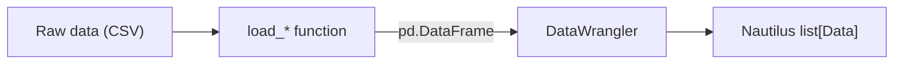

# Data

NautilusTrader supports granular order book data, quotes, trades, bars, reference prices, and
custom data. This overview links to the built‑in types and explains the concepts shared across
backtesting, sandbox, and live environments.

## Built-in data types

Each main built‑in market data type has a dedicated guide to its fields, behavior, and construction.

| Data type                                     | Category             | Description                                          |
| --------------------------------------------- | -------------------- | ---------------------------------------------------- |
| [`OrderBookDelta`](order_book_delta.md)       | Order book           | Single incremental order book change.                |
| [`OrderBookDeltas`](order_book_deltas.md)     | Order book           | Batch of related order book deltas.                  |
| [`OrderBookDepth10`](order_book_depth10.md)   | Order book           | Fixed top 10 bid and ask levels.                     |
| [`QuoteTick`](quote_tick.md)                  | Top‑of‑book          | Best bid and ask prices and sizes.                   |
| [`TradeTick`](trade_tick.md)                  | Trades               | Single venue trade or match event.                   |
| [`Bar`](bar.md)                               | Aggregation          | OHLCV bar for a specific `BarType`.                  |
| [`MarkPriceUpdate`](mark_price_update.md)     | Derivative reference | Mark price for a derivatives instrument.             |
| [`IndexPriceUpdate`](index_price_update.md)   | Derivative reference | Index price used by a derivatives market.            |
| [`FundingRateUpdate`](funding_rate_update.md) | Derivative reference | Funding rate and next funding metadata.              |
| [`OptionGreeks`](option_greeks.md)            | Options              | Venue‑provided Greeks and implied volatility.        |
| [`InstrumentStatus`](instrument_status.md)    | Instrument event     | Trading, quoting, and halt status changes.           |
| [`InstrumentClose`](instrument_close.md)      | Instrument event     | Close, settlement, or other venue close price event. |

When data flows over the message bus, topic‑addressable data stays under the `data`
root. Live streams use `data.<kind>...`; the data pipeline path uses
`data.pipeline.<kind>...`. See [Message Bus](../message_bus.md#topic-hierarchy) for
the topic hierarchy.

## Order books

A Rust `OrderBook` maintains state for one instrument in backtesting and live trading. NautilusTrader
supports these book types:

- `L3_MBO`: Level 3 market‑by‑order (MBO) data, keyed by order ID at every price level.
- `L2_MBP`: Level 2 market‑by‑price (MBP) data, aggregated by price level.
- `L1_MBP`: Level 1 market‑by‑price (MBP) top‑of‑book data, also known as best bid and offer (BBO).

:::note
Quote, trade, and bar data (`QuoteTick`, `TradeTick`, and `Bar`) can also drive
`L1_MBP` books in backtests.
:::

### Delta flags and event boundaries

Each `OrderBookDelta` carries a `flags` field using `RecordFlag` bitmask values
to signal event boundaries to the `DataEngine`:

- `F_LAST`: Marks the final delta in a logical event group. When `buffer_deltas`
  is enabled, the `DataEngine` accumulates deltas and only publishes to
  subscribers when it encounters `F_LAST`. Every event group **must** end with
  a delta that has `F_LAST` set.
- `F_SNAPSHOT`: Marks deltas that belong to a snapshot (as opposed to an
  incremental update). Snapshot sequences begin with a `Clear` action followed
  by `Add` deltas reconstructing the full book state. The last delta in a
  snapshot has both `F_SNAPSHOT | F_LAST` set.

:::warning
A missing `F_LAST` on the final delta in an event group causes buffered consumers
to accumulate deltas indefinitely without publishing. This applies to incremental
updates and snapshots alike, including empty book snapshots where only a `Clear`
delta is emitted.
:::

## Instruments

All market data belongs to an instrument. The instrument definition supplies the
identity, precision, price and size increments, limits, currencies, and contract
semantics that make the data meaningful.

See [Instruments](../instruments/) for the instrument taxonomy and per‑type guides.

## Bars and aggregation

### Introduction to bars

A *bar*, also known as a candle, candlestick, or kline, summarizes price and volume over an interval:

- Opening price
- Highest price
- Lowest price
- Closing price
- Traded volume (or ticks as a volume proxy)

An *aggregation method* defines how NautilusTrader groups input data into bars.

### Purpose of data aggregation

Aggregation converts granular market data into bars that:

- Supply inputs for technical indicators and strategies.
- Match the time resolution a strategy needs.
- Reduce storage and processing compared with high‑frequency order book data.

### Aggregation methods

NautilusTrader supports these aggregation methods:

| Name               | Description                                               | Category    |
| :----------------- | :-------------------------------------------------------- | :---------- |
| `TICK`             | Number of ticks.                                          | Threshold   |
| `TICK_IMBALANCE`   | Buy/sell imbalance of ticks.                              | Threshold   |
| `TICK_RUNS`        | Sequential buy/sell runs of ticks.                        | Information |
| `VOLUME`           | Traded volume.                                            | Threshold   |
| `VOLUME_IMBALANCE` | Buy/sell imbalance of traded volume.                      | Threshold   |
| `VOLUME_RUNS`      | Sequential buy/sell runs of traded volume.                | Information |
| `VALUE`            | Notional trade value, also known as dollar bars.          | Threshold   |
| `VALUE_IMBALANCE`  | Buy/sell imbalance of notional trade value.               | Threshold   |
| `VALUE_RUNS`       | Sequential buy/sell runs of notional trade value.         | Information |
| `RENKO`            | Fixed price movements, with brick size measured in ticks. | Price       |
| `MILLISECOND`      | Time intervals with millisecond granularity.              | Time        |
| `SECOND`           | Time intervals with second granularity.                   | Time        |
| `MINUTE`           | Time intervals with minute granularity.                   | Time        |
| `HOUR`             | Time intervals with hour granularity.                     | Time        |
| `DAY`              | Time intervals with day granularity.                      | Time        |
| `WEEK`             | Time intervals with week granularity.                     | Time        |
| `MONTH`            | Time intervals with month granularity.                    | Time        |
| `YEAR`             | Time intervals with year granularity.                     | Time        |

The threshold, information, and time categories follow the `BarSpecification` predicates. `RENKO`
is price‑driven and has no matching predicate. The broader information‑driven concept below
includes both imbalance and runs bars.

### Information-driven bars

Information‑driven bars adapt their sampling frequency to market activity rather than using fixed
intervals. They are based on the concept of *aggressor side* (whether the trade initiator was a
buyer or seller) and come in two families: **imbalance** and **runs**.

**Imbalance bars** close when the *net* buy/sell activity reaches a threshold. Each trade contributes
a signed value: positive for buyer‑initiated trades and negative for seller‑initiated trades. The bar closes
when the absolute imbalance reaches the configured step. This means that opposing trades cancel each
other out, so imbalance bars form more slowly in balanced markets and faster during directional moves.

**Runs bars** close when *consecutive* activity from the same aggressor side reaches a threshold.
Unlike imbalance bars, runs bars reset their counter when the aggressor side changes.
This makes them sensitive to sustained one‑sided pressure rather than net imbalance.

Both families have three variants based on what is measured:

| Variant | Imbalance          | Runs          | What is measured              |
| :------ | :----------------- | :------------ | :---------------------------- |
| Tick    | `TICK_IMBALANCE`   | `TICK_RUNS`   | Number of trades.             |
| Volume  | `VOLUME_IMBALANCE` | `VOLUME_RUNS` | Traded quantity.              |
| Value   | `VALUE_IMBALANCE`  | `VALUE_RUNS`  | Price multiplied by quantity. |

:::note
Information‑driven bars require `TradeTick` data because they need the `aggressor_side` field
to classify each trade. They cannot be aggregated from `QuoteTick` data alone.
:::

### Types of aggregation

NautilusTrader supports three aggregation inputs:

| Input         | Result                                    | Price type             | Syntax requirement  |
| ------------- | ----------------------------------------- | ---------------------- | ------------------- |
| `TradeTick`   | Trade‑to‑bar aggregation.                 | `LAST`                 | No `@` source.      |
| `QuoteTick`   | Quote‑to‑bar aggregation.                 | `BID`, `ASK`, or `MID` | No `@` source.      |
| Smaller `Bar` | Bar‑to‑bar aggregation into a larger bar. | Target bar price type. | Source follows `@`. |

### Bar types

`BarType` identifies a bar by:

- **Instrument ID** (`InstrumentId`): The instrument for the bar.
- **Bar specification** (`BarSpecification`):
  - `step`: The interval or frequency.
  - `aggregation`: The aggregation method.
  - `price_type`: The price basis, such as bid, ask, mid, or last.
- **Aggregation source** (`AggregationSource`): Whether NautilusTrader or an external venue or data
  provider aggregated the bar.

:::note
The Rust/PyO3 `BarSpecification` validates fixed‑subunit time aggregations so bars align cleanly
with their parent clock or calendar unit. `MILLISECOND` steps must divide 1000 and be less than
1000; `SECOND` and `MINUTE` steps must divide 60 and be less than 60; `HOUR` steps must divide 24
and be less than 24; and `MONTH` steps must divide 12 and may equal 12. Except for `12-MONTH`, use
the next larger aggregation when the step equals a parent unit, such as `1-HOUR` instead of
`60-MINUTE`. In this model, `DAY`, `WEEK`, `YEAR`, threshold, information‑driven, and `RENKO` bars
are not restricted by this fixed‑subunit rule. The legacy Cython constructor rejects `12-MONTH`.
:::

Bar types can also be classified as either *standard* or *composite*:

- **Standard**: Generated from granular market data, such as quote ticks or trade ticks.
- **Composite**: Derived from a finer‑grained bar type, such as 5‑minute bars aggregated from
  1‑minute bars.

### Aggregation sources

Bar data aggregation can be either *internal* or *external*:

- `INTERNAL`: NautilusTrader aggregates the bar.
- `EXTERNAL`: A venue or data provider aggregates the bar.

For bar‑to‑bar aggregation, the target is always `INTERNAL`. The source can be `INTERNAL` or
`EXTERNAL`.

### Defining bar types with string syntax

#### Standard bars

Define a standard bar type with:

`{instrument_id}-{step}-{aggregation}-{price_type}-{INTERNAL | EXTERNAL}`

This example defines 5‑minute AAPL trade bars that NautilusTrader aggregates locally:

```python
bar_type = BarType.from_str("AAPL.XNAS-5-MINUTE-LAST-INTERNAL")
```

#### Composite bars

Define a composite bar type with:

`{instrument_id}-{step}-{aggregation}-{price_type}-INTERNAL@{step}-{aggregation}-{INTERNAL | EXTERNAL}`

- The derived bar type must use an `INTERNAL` aggregation source (since this is how the bar is aggregated).
- The sampled bar type must be finer‑grained than the derived bar type.
- The sampled instrument ID is inferred to match that of the derived bar type.
- Composite bars can be aggregated *from* `INTERNAL` or `EXTERNAL` aggregation sources.

This example defines internal 5‑minute AAPL trade bars aggregated from external 1‑minute bars:

```python
bar_type = BarType.from_str("AAPL.XNAS-5-MINUTE-LAST-INTERNAL@1-MINUTE-EXTERNAL")
```

### Aggregation syntax examples

The `BarType` string format encodes both the target bar type and, optionally, the source data type:

```text
{instrument_id}-{step}-{aggregation}-{price_type}-{source}@{step}-{aggregation}-{source}
```

The part after `@` applies only to bar‑to‑bar aggregation:

- **Without `@`**: Aggregate from `TradeTick` objects for `LAST`, or `QuoteTick` objects for
  `BID`, `ASK`, or `MID`.
- **With `@`**: Aggregate from existing `Bar` objects of the specified source type.

#### Trade-to-bar example

```python
def on_start(self) -> None:
    # LAST selects TradeTick data as the source
    bar_type = BarType.from_str("6EH4.XCME-50-VOLUME-LAST-INTERNAL")
    start = self.clock.utc_now() - timedelta(days=30)

    # Deliver historical bars to on_historical_bars
    self.request_bars(bar_type, start=start)

    # Deliver live bars to on_bar
    self.subscribe_bars(bar_type)
```

#### Quote-to-bar example

```python
def on_start(self) -> None:
    # Create 1-minute bars from QuoteTick ask prices
    bar_type_ask = BarType.from_str("6EH4.XCME-1-MINUTE-ASK-INTERNAL")

    # Create 1-minute bars from QuoteTick bid prices
    bar_type_bid = BarType.from_str("6EH4.XCME-1-MINUTE-BID-INTERNAL")

    # Create 1-minute bars from QuoteTick mid prices
    bar_type_mid = BarType.from_str("6EH4.XCME-1-MINUTE-MID-INTERNAL")
    start = self.clock.utc_now() - timedelta(days=30)

    self.request_bars(bar_type_ask, start=start)
    self.subscribe_bars(bar_type_ask)
```

#### Bar-to-bar example

```python
def on_start(self) -> None:
    # Create 5-minute bars from 1-minute Bar objects
    # Format: target_bar_type@source_bar_type
    # The price type appears only on the target side
    bar_type = BarType.from_str("6EH4.XCME-5-MINUTE-LAST-INTERNAL@1-MINUTE-EXTERNAL")
    start = self.clock.utc_now() - timedelta(days=30)

    self.request_bars(bar_type, start=start)

    # Deliver live updates to on_bar
    self.subscribe_bars(bar_type)
```

#### Advanced bar-to-bar example

Build longer aggregation chains from bars that NautilusTrader has already aggregated:

```python
# Create 1-minute bars from TradeTick objects
primary_bar_type = BarType.from_str("6EH4.XCME-1-MINUTE-LAST-INTERNAL")

# Create 5-minute bars from the 1-minute bars
intermediate_bar_type = BarType.from_str("6EH4.XCME-5-MINUTE-LAST-INTERNAL@1-MINUTE-INTERNAL")

# Create hourly bars from the 5-minute bars
hourly_bar_type = BarType.from_str("6EH4.XCME-1-HOUR-LAST-INTERNAL@5-MINUTE-INTERNAL")
```

### Working with bars: request vs. subscribe

NautilusTrader provides two operations for working with bars:

| Method             | Purpose                 | Delivery handler       |
| ------------------ | ----------------------- | ---------------------- |
| `request_bars()`   | Fetch historical bars.  | `on_historical_bars()` |
| `subscribe_bars()` | Subscribe to live bars. | `on_bar()`             |

`subscribe_bars()` expects the instrument for the `BarType` in the cache. The same precondition
applies to other live market data subscriptions.

These methods work together in a typical workflow:

1. `request_bars()` loads historical data to initialize indicators or strategy state.
1. `subscribe_bars()` continues the stream with live bars.

The request returns a correlation ID. Historical data arrives through `on_historical_bars()` as a
`Sequence[Bar]`; live data arrives through `on_bar()` one bar at a time.

```python
from collections.abc import Sequence


def on_start(self) -> None:
    bar_type = BarType.from_str("6EH4.XCME-5-MINUTE-LAST-INTERNAL")
    start = self.clock.utc_now() - timedelta(days=30)

    # Register indicators before requesting history
    self.register_indicator_for_bars(bar_type, self.my_indicator)

    self.request_bars(bar_type, start=start)
    self.subscribe_bars(bar_type)


def on_historical_bars(self, bars: Sequence[Bar]) -> None:
    for bar in bars:
        self.log.info(f"Historical bar: {bar}")


def on_bar(self, bar):
    # Process individual bars from subscribe_bars()
    pass
```

### Register indicators before requesting data

Register indicators before requesting historical data so they receive those updates.

```python
start = self.clock.utc_now() - timedelta(days=30)

# Correct order
self.register_indicator_for_bars(bar_type, self.ema)
self.request_bars(bar_type, start=start)

# Incorrect order: the indicator misses historical updates
self.request_bars(bar_type, start=start)
self.register_indicator_for_bars(bar_type, self.ema)
```

### Performance considerations

Bar aggregators track OHLC prices with the fixed‑point `Price` type. The aggregation method
determines the additional work for each update:

- **Time bars** accumulate OHLCV state per update and use a timer to emit bars.
- **Threshold bars** (tick, volume, value) add a counter or accumulator check per update.
  Volume and value bars may split a single large trade across multiple bars when it exceeds the
  remaining threshold.
- **Information‑driven bars** (imbalance, runs) track aggressor side and signed accumulation.
- **Renko bars** are price‑driven and can emit several bars from one large price move.
- **Composite bars** process an aggregated source bar instead of each underlying tick.

### Time bar configuration

Time bar behavior is controlled through `DataEngineConfig`. The following options
apply to all time‑based aggregation from milliseconds through years:

| Option                              | Type   | Default       | Description                                                                                                                                     |
| :---------------------------------- | :----- | :------------ | :---------------------------------------------------------------------------------------------------------------------------------------------- |
| `time_bars_interval_type`           | `str`  | `"left-open"` | `"left-open"`: start excluded, end included. `"right-open"`: start included, end excluded.                                                      |
| `time_bars_timestamp_on_close`      | `bool` | `True`        | When `True`, `ts_event` is the bar close time. When `False`, `ts_event` is the bar open time.                                                   |
| `time_bars_skip_first_non_full_bar` | `bool` | `False`       | Skip emitting a bar when aggregation starts mid‑interval, avoiding partial bars on startup.                                                     |
| `time_bars_build_with_no_updates`   | `bool` | `True`        | When `True`, bars are emitted even if no market updates arrived during the interval.                                                            |
| `time_bars_origin_offset`           | `dict` | `None`        | Maps `BarAggregation` types to `pd.Timedelta` or `pd.DateOffset` values for shifting bar alignment (e.g., align to 09:30 market open).          |
| `time_bars_build_delay`             | `int`  | `0`           | Delay in microseconds before building a bar. Useful in backtests to ensure data at bar boundary timestamps is processed before the timer fires. |

```python
from nautilus_trader.config import DataEngineConfig

config = DataEngineConfig(
    time_bars_timestamp_on_close=True,
    time_bars_build_with_no_updates=False,
    time_bars_skip_first_non_full_bar=True,
)
```

## Timestamps

Many market data, order, and event objects carry two timestamps:

- `ts_event`: UNIX timestamp in nanoseconds when the event occurred.
- `ts_init`: UNIX timestamp in nanoseconds when NautilusTrader initialized the object.

### Typical meanings

| Event type       | `ts_event`                             | `ts_init`                                        |
| ---------------- | -------------------------------------- | ------------------------------------------------ |
| `TradeTick`      | Trade time at the venue.               | Local object initialization time.                |
| `QuoteTick`      | Quote time at the venue.               | Local object initialization time.                |
| `OrderBookDelta` | Book update time at the venue.         | Local object initialization time.                |
| `Bar`            | Configured bar open or close boundary. | Local aggregation or object initialization time. |
| `DefiData`       | Block or pool event time.              | Object initialization time from the chain data.  |
| `OrderFilled`    | Fill time at the venue.                | Local fill event initialization time.            |
| `OrderCanceled`  | Cancellation time at the venue.        | Local cancellation event initialization time.    |
| `NewsEvent`      | Publication time.                      | Local object initialization time.                |
| Custom event     | Time defined by the custom event.      | Local object initialization time.                |

:::note
`ts_init` means initialization time, not always receipt time. Commands and internally generated
events also use it even though NautilusTrader does not receive them from an external source.
:::

### Latency analysis

The difference `ts_init - ts_event` measures observed delay only when the clocks that produced both
timestamps are synchronized. Otherwise, the result also includes clock offset and cannot represent
system latency by itself.

### Environment-specific behavior

#### Backtesting environment

- Data is ordered by `ts_init` using a stable sort.
- DeFi data (`DefiData`) breaks `ts_init` ties by on‑chain position (block number, transaction
  index, log index) so events from the same block replay in canonical chain order.
- This ordering gives backtests deterministic replay.

#### Live trading environment

Live trading processes data as it arrives. For venue‑sourced data, `ts_event` records the external
event time, while `ts_init` usually records local object initialization after receipt.

### Other notes and considerations

- For data from external sources, `ts_init` is usually the local receipt or normalization time,
  but clock skew means it is not guaranteed to be greater than or equal to `ts_event`.
- For data created within NautilusTrader, `ts_init` and `ts_event` can match.
- Some types with `ts_init` do not have `ts_event` because:
  - The initialization of an object happens at the same time as the event itself.
  - The concept of an external event time does not apply.

#### Persisted data

The `ts_init` field preserves the original initialization timestamp. For venue data this is
typically receipt time; for internally created data it is the creation time of that object.

## Data flow

From the `DataEngine` onward, data follows the same pathway regardless of
[environment context](../architecture.md#environment-contexts) (backtest, sandbox,
live). In live and sandbox modes a venue adapter creates a normalized data
object and sends it through a channel; in backtests the engine feeds data
directly. Either way the `DataEngine` stores it in the `Cache` (for cached
types) and publishes it on the `MessageBus` to subscribed handlers.
For a step‑by‑step trace with a sequence diagram, see
[Data flow: life of a quote tick](../architecture.md#data-flow-life-of-a-quote-tick).

See [Custom data](#custom-data) to define and publish another data type.

## Loading data

Load and convert data to:

- Run backtests with `BacktestEngine`.
- Persist NautilusTrader Parquet data with `ParquetDataCatalog.write_data(...)` for a
  `BacktestNode`.
- Use the same data in research and backtesting.

Each use case converts an external format into NautilusTrader data objects.

The conversion uses:

- A data loader for the source format, which returns a `pd.DataFrame` with the expected schema.
- A data wrangler for the target type, which converts the frame into a `list[Data]`.

### Data loaders

Data loaders are specific to a source format. For example, Binance order book CSV data differs from
[Databento Binary Encoding (DBN)](https://databento.com/docs/knowledge-base/new-users/dbn-encoding/getting-started-with-dbn).

### Data wranglers

The `nautilus_trader.persistence` module provides Rust-backed wranglers for each NautilusTrader
data type:

- `OrderBookDeltaDataWrangler`
- `OrderBookDepth10DataWrangler`
- `QuoteTickDataWrangler`
- `TradeTickDataWrangler`
- `BarDataWrangler`

These wranglers accept fixed‑width Arrow record batch bytes and return Python model objects.

### Fixed-point precision and raw values

NautilusTrader uses fixed‑point arithmetic for `Price` and `Quantity`. Raw values must match the
scale for their declared precision.

#### Raw value requirements

When constructing `Price` or `Quantity` with `from_raw()`, use a raw value from:

- The `.raw` field of an existing value, such as `price.raw`.
- NautilusTrader fixed‑point conversion functions.
- Values from Nautilus‑produced Arrow data.

:::warning
For a precision below `FIXED_PRECISION`, the raw value must be divisible by
`10^(FIXED_PRECISION - precision)`. Construction does not currently reject an invalid multiple,
which can produce an incorrect value.
:::

#### Automatic raw value correction

Legacy catalog data written by earlier wranglers can contain raw values with floating‑point
errors. Those wranglers used `int(value * FIXED_SCALAR)` instead of precision‑aware conversion:

```python
int(value * FIXED_SCALAR)  # Introduces floating-point errors
round(value * 10**precision) * scale  # Correct precision-aware conversion
```

The Arrow decode path automatically corrects these values by rounding to
the nearest valid multiple, so affected catalogs work without data migration.

:::note
This correction adds a small amount of overhead during data decoding.
:::

### Transformation pipeline

1. A data‑loading function reads raw data, such as CSV, into a `pd.DataFrame`.
1. A data wrangler converts the frame into NautilusTrader objects.
1. The pipeline returns a `list[Data]`.



The loader normalizes the source format before the wrangler constructs domain objects.

For Binance order book deltas:

- `load_binance_order_book_deltas(...)` reads CSV files and returns a `pd.DataFrame`.
- `OrderBookDeltaDataWrangler.process(...)` converts the frame into `list[OrderBookDelta]`.

The following Python example applies both steps:

```python
from pathlib import Path

from nautilus_trader.adapters.binance import load_binance_order_book_deltas
from nautilus_trader.persistence.wranglers import OrderBookDeltaDataWrangler
from nautilus_trader.test_kit.providers import TestInstrumentProvider


# Load raw data
data_path = Path("test_data/binance/btcusdt-depth-snap.csv")
df = load_binance_order_book_deltas(data_path)

# Set up a wrangler
instrument = TestInstrumentProvider.btcusdt_binance()
wrangler = OrderBookDeltaDataWrangler(instrument)

# Convert the frame into OrderBookDelta objects
deltas = wrangler.process(df)
```

## Data catalog

The data catalog stores NautilusTrader data in [Parquet](https://parquet.apache.org) files for
backtesting, live trading, and research.

### Overview and architecture

The data catalog uses two query backends:

**Core components:**

- **`ParquetDataCatalog`**: The main Python interface for data operations.
- **Rust backend**: Query engine for core data types (`OrderBookDelta`,
  `OrderBookDeltas`, `OrderBookDepth10`, `QuoteTick`, `TradeTick`, `Bar`,
  `MarkPriceUpdate`, `OptionGreeks`) and registered same‑binary Rust custom data.
- **PyArrow backend**: Fallback for Python custom data types and PyArrow filters.
- **fsspec integration**: Local and cloud storage access without an external database service.

Parquet provides compressed columnar storage and cross‑language access. The Rust `model` and
`persistence` crates define Arrow schemas for core market data, while
`serialization/arrow/schema.py` defines schemas for additional Python types.

### Initializing

Initialize a catalog from a path‑like object, a URI, or the `NAUTILUS_PATH` environment variable.

:::note[NAUTILUS_PATH environment variable]
Set `NAUTILUS_PATH` to the parent of the catalog directory. For example,
`NAUTILUS_PATH=/home/user/trading_data` makes `ParquetDataCatalog.from_env()` use
`/home/user/trading_data/catalog`.
:::

Initialize a catalog for data already stored at a local path:

```python
from pathlib import Path
from nautilus_trader.persistence import ParquetDataCatalog


CATALOG_PATH = Path.cwd() / "catalog"

# Initialize from an explicit path
catalog = ParquetDataCatalog(CATALOG_PATH)

# Initialize from NAUTILUS_PATH
catalog = ParquetDataCatalog.from_env()
```

### Filesystem protocols and storage options

The catalog uses fsspec protocols for local and cloud storage.

#### Supported filesystem protocols

**Local filesystem (`file`):**

```python
catalog = ParquetDataCatalog(
    path="/path/to/catalog",
    fs_protocol="file",  # Default protocol
)
```

**Amazon S3 (`s3`):**

```python
catalog = ParquetDataCatalog(
    path="s3://my-bucket/nautilus-data/",
    fs_protocol="s3",
    fs_storage_options={
        "key": "your-access-key-id",
        "secret": "your-secret-access-key",
        "endpoint_url": "https://s3.amazonaws.com",  # Optional custom endpoint
    },
)
```

**Google Cloud Storage (`gcs`):**

```python
catalog = ParquetDataCatalog(
    path="gcs://my-bucket/nautilus-data/",
    fs_protocol="gcs",
    fs_storage_options={
        "project": "my-project-id",
        "token": "/path/to/service-account.json",  # Or "cloud" for default credentials
    },
)
```

**Azure Blob Storage:**

`abfs` protocol

```python
catalog = ParquetDataCatalog(
    path="abfs://container@account.dfs.core.windows.net/nautilus-data/",
    fs_protocol="abfs",
    fs_storage_options={
        "account_name": "your-storage-account",
        "account_key": "your-account-key",
        # Or use SAS token: "sas_token": "your-sas-token"
    },
)
```

`az` protocol

```python
catalog = ParquetDataCatalog(
    path="az://container/nautilus-data/",
    fs_protocol="az",
    fs_storage_options={
        "account_name": "your-storage-account",
        "account_key": "your-account-key",
        # Or use SAS token: "sas_token": "your-sas-token"
    },
)
```

#### URI-based initialization

Use `from_uri()` to select the protocol from a URI:

```python
# Local filesystem
catalog = ParquetDataCatalog.from_uri("/path/to/catalog")

# S3 bucket
catalog = ParquetDataCatalog.from_uri("s3://my-bucket/nautilus-data/")

# With storage options
catalog = ParquetDataCatalog.from_uri(
    "s3://my-bucket/nautilus-data/",
    fs_storage_options={"access_key_id": "your-key", "secret_access_key": "your-secret"},
)
```

### Writing data

Use `write_data()` to store built‑in `Data` objects and registered custom `Data` subclasses.

```python
# Write a list of data objects
catalog.write_data(quote_ticks)

# Write with custom timestamp range
catalog.write_data(
    trade_ticks,
    start=1704067200000000000,  # Optional start timestamp override (UNIX nanoseconds)
    end=1704153600000000000,  # Optional end timestamp override (UNIX nanoseconds)
)

# Skip disjoint check for overlapping data
catalog.write_data(bars, skip_disjoint_check=True)
```

### File naming and data organization

The catalog names files from their timestamp range with the pattern
`{start_timestamp}_{end_timestamp}.parquet`. It converts each ISO 8601 timestamp to a filename‑safe
form by replacing `:` and `.` with `-`.

Data is organized in directories by data type and identifier
(instrument ID, bar type, or custom identifier). The catalog makes identifiers URI‑safe by
removing `/`:

```text
catalog/
├── data/
│   ├── quote_ticks/
│   │   └── EURUSD.SIM/
│   │       └── 2024-01-01T00-00-00-000000000Z_2024-01-01T23-59-59-999999999Z.parquet
│   └── trade_ticks/
│       └── BTCUSD.BINANCE/
│           └── 2024-01-01T00-00-00-000000000Z_2024-01-01T23-59-59-999999999Z.parquet
```

:::warning
By default, overlapping writes raise a `ValueError` to maintain data integrity.
Set `skip_disjoint_check=True` only when the overlap is intentional.
:::

### Reading data

Use `query()` to read data from the catalog:

```python
from nautilus_trader.model import QuoteTick
from nautilus_trader.model import TradeTick

# Query quote ticks for a specific instrument and time range
quotes = catalog.query(
    data_cls=QuoteTick,
    identifiers=["EUR/USD.SIM"],
    start="2024-01-01T00:00:00Z",
    end="2024-01-02T00:00:00Z",
)

# Query trade ticks for a specific instrument and time range
trades = catalog.query(
    data_cls=TradeTick,
    identifiers=["BTC/USD.BINANCE"],
    start="2024-01-01",
    end="2024-01-02",
)
```

### `BacktestDataConfig`: backtest data

`BacktestDataConfig` defines the catalog data that a `BacktestNode` loads for one run.

#### Core parameters

**Required parameters:**

- `catalog_path`: Path to the data catalog directory.
- `data_cls`: Data type class, such as `QuoteTick`, `TradeTick`, `OrderBookDelta`, or `Bar`.

**Optional parameters:**

- `catalog_fs_protocol`: Filesystem protocol, such as `file`, `s3`, or `gcs`.
- `catalog_fs_storage_options`: Storage‑specific options, such as credentials or region.
- `catalog_fs_rust_storage_options`: Storage‑specific options for the Rust backend.
- `instrument_id`: Specific instrument to load data for.
- `instrument_ids`: List of instruments instead of one `instrument_id`.
- `start_time`: Start time for data filtering (ISO string or UNIX nanoseconds).
- `end_time`: End time for data filtering (ISO string or UNIX nanoseconds).
- `filter_expr`: Additional PyArrow filter expressions.
- `client_id`: Client ID for custom data types.
- `metadata`: Additional metadata for data queries.
- `bar_spec`: Bar specification for bar data, such as `"1-MINUTE-LAST"`. When combined
  with `instrument_id` or `instrument_ids`, this builds `...-EXTERNAL` bar identifiers.
- `bar_types`: Explicit list of full bar types. Use this for `INTERNAL` bars or composite bars.
- `optimize_file_loading`: Load directories instead of individual files when supported.

#### Basic usage examples

**Loading quote ticks:**

```python
from nautilus_trader.config import BacktestDataConfig
from nautilus_trader.model import InstrumentId
from nautilus_trader.model import QuoteTick

data_config = BacktestDataConfig(
    catalog_path="/path/to/catalog",
    data_cls=QuoteTick,
    instrument_id=InstrumentId.from_str("EUR/USD.SIM"),
    start_time="2024-01-01T00:00:00Z",
    end_time="2024-01-02T00:00:00Z",
)
```

**Loading multiple instruments:**

```python
data_config = BacktestDataConfig(
    catalog_path="/path/to/catalog",
    data_cls=TradeTick,
    instrument_ids=["BTC/USD.BINANCE", "ETH/USD.BINANCE"],
    start_time="2024-01-01T00:00:00Z",
    end_time="2024-01-02T00:00:00Z",
)
```

**Loading bar data:**

```python
data_config = BacktestDataConfig(
    catalog_path="/path/to/catalog",
    data_cls=Bar,
    instrument_id=InstrumentId.from_str("AAPL.NASDAQ"),
    bar_spec="5-MINUTE-LAST",  # Loads AAPL.NASDAQ-5-MINUTE-LAST-EXTERNAL
    start_time="2024-01-01",
    end_time="2024-01-31",
)
```

#### Advanced configuration examples

**Cloud storage with custom filtering:**

```python
data_config = BacktestDataConfig(
    catalog_path="s3://my-bucket/nautilus-data/",
    catalog_fs_protocol="s3",
    catalog_fs_storage_options={
        "key": "your-access-key",
        "secret": "your-secret-key",
        "region": "us-east-1",
    },
    data_cls=OrderBookDelta,
    instrument_id=InstrumentId.from_str("BTC/USD.COINBASE"),
    start_time="2024-01-01T09:30:00Z",
    end_time="2024-01-01T16:00:00Z",
)
```

**Custom data with a client ID:**

```python
data_config = BacktestDataConfig(
    catalog_path="/path/to/catalog",
    data_cls="my_package.data.NewsEventData",
    client_id="NewsClient",
    metadata={"source": "reuters", "category": "earnings"},
    start_time="2024-01-01",
    end_time="2024-01-31",
)
```

#### Integration with BacktestRunConfig

Pass the data configurations to `BacktestRunConfig`:

```python
from nautilus_trader.config import BacktestRunConfig
from nautilus_trader.config import BacktestVenueConfig

data_configs = [
    BacktestDataConfig(
        catalog_path="/path/to/catalog",
        data_cls=QuoteTick,
        instrument_id="EUR/USD.SIM",
        start_time="2024-01-01",
        end_time="2024-01-02",
    ),
    BacktestDataConfig(
        catalog_path="/path/to/catalog",
        data_cls=TradeTick,
        instrument_id="EUR/USD.SIM",
        start_time="2024-01-01",
        end_time="2024-01-02",
    ),
]

run_config = BacktestRunConfig(
    venues=[BacktestVenueConfig(name="SIM", oms_type="HEDGING")],
    data=data_configs,
    start="2024-01-01T00:00:00Z",
    end="2024-01-02T00:00:00Z",
)
```

#### Data loading process

When a backtest runs, the `BacktestNode` processes each `BacktestDataConfig`:

1. Create a `ParquetDataCatalog` from the configuration.
1. Build the query from the configuration fields.
1. Query the selected backend.
1. Load required instrument definitions.
1. Sort the data and add it to the backtest engine.

### Direct catalog access

Use `ParquetDataCatalog` to query or write a catalog directly. Use `BacktestDataConfig` when a
`BacktestNode` should load catalog data for a run. `LiveNodeConfig` does not accept catalog
configuration; request historical data through a configured data client or query the catalog
directly.

### Query system and dual backend architecture

The catalog selects a query backend from the data type and query parameters.

#### Backend selection logic

| Backend | Data types                                                                                | Selected when                           |
| ------- | ----------------------------------------------------------------------------------------- | --------------------------------------- |
| Rust    | Core types and registered same‑binary Rust custom data.                                   | `files` is unset.                       |
| PyArrow | Other custom data, plus any type supported by the Python serialization and schema system. | The type requires it or `files` is set. |

Core Rust query types include `OrderBookDelta`, `OrderBookDeltas`, `OrderBookDepth10`, `QuoteTick`,
`TradeTick`, `Bar`, `MarkPriceUpdate`, and `OptionGreeks`.

#### Query methods and parameters

```python
catalog.query(
    data_cls=QuoteTick,
    identifiers=["EUR/USD.SIM"],
    start="2024-01-01T00:00:00Z",
    end="2024-01-02T00:00:00Z",
    files=None,
)
```

- `where=` passes a DataFusion SQL predicate to Rust‑backed queries.
- `filter_expr=` passes a parsed PyArrow dataset expression to PyArrow‑backed queries.

**Time format support:**

- ISO 8601 strings: `"2024-01-01T00:00:00Z"`.
- UNIX nanoseconds: `1704067200000000000`.
- pandas timestamps: `pd.Timestamp("2024-01-01", tz="UTC")`.
- Timezone‑aware Python `datetime` objects.

**Filtering notes:**

- Use `where=` for Rust‑backed built‑in market data queries.
- Use `filter_expr=` for PyArrow‑backed queries, including custom data and queries
  forced onto the PyArrow path with `files=`.

### Catalog operations

Catalog operations rename, consolidate, or delete data files.

#### Reset file names

Reset Parquet file names to match their content timestamps so filename‑based filtering remains
accurate.

**Reset all files in catalog:**

```python
# Reset all parquet files in the catalog
catalog.reset_all_file_names()
```

**Reset specific data type:**

```python
# Reset filenames for all quote tick files
catalog.reset_data_file_names(QuoteTick)

# Reset filenames for specific instrument's trade files
catalog.reset_data_file_names(TradeTick, "BTC/USD.BINANCE")
```

#### Consolidate catalog

Combine small Parquet files to reduce file count and query overhead.

**Consolidate entire catalog:**

```python
# Consolidate all files in the catalog
catalog.consolidate_catalog()

# Consolidate files within a specific time range
catalog.consolidate_catalog(
    start="2024-01-01T00:00:00Z", end="2024-01-02T00:00:00Z", ensure_contiguous_files=True
)
```

**Consolidate specific data type:**

```python
# Consolidate all quote tick files
catalog.consolidate_data(QuoteTick)

# Consolidate specific instrument's files
catalog.consolidate_data(
    TradeTick, identifier="BTC/USD.BINANCE", start="2024-01-01", end="2024-01-31"
)
```

#### Consolidate catalog by period

Split data files into fixed periods.

**Consolidate entire catalog by period:**

```python
import pandas as pd

# Consolidate all files by 1-day periods
catalog.consolidate_catalog_by_period(period=pd.Timedelta(days=1))

# Consolidate by 1-hour periods within time range
catalog.consolidate_catalog_by_period(
    period=pd.Timedelta(hours=1), start="2024-01-01T00:00:00Z", end="2024-01-02T00:00:00Z"
)
```

**Consolidate specific data by period:**

```python
# Consolidate quote data by 4-hour periods
catalog.consolidate_data_by_period(data_cls=QuoteTick, period=pd.Timedelta(hours=4))

# Consolidate specific instrument by 30-minute periods
catalog.consolidate_data_by_period(
    data_cls=TradeTick,
    identifier="EUR/USD.SIM",
    period=pd.Timedelta(minutes=30),
    start="2024-01-01",
    end="2024-01-31",
)
```

#### Delete data range

Delete data within a time range, optionally limited to one data type and instrument.

**Delete entire catalog range:**

```python
# Delete all data within a time range across the entire catalog
catalog.delete_catalog_range(start="2024-01-01T00:00:00Z", end="2024-01-02T00:00:00Z")

# Delete all data from the beginning up to a specific time
catalog.delete_catalog_range(end="2024-01-01T00:00:00Z")
```

**Delete specific data type:**

```python
# Delete all quote tick data for a specific instrument
catalog.delete_data_range(data_cls=QuoteTick, identifier="BTC/USD.BINANCE")

# Delete trade data within a specific time range
catalog.delete_data_range(
    data_cls=TradeTick,
    identifier="EUR/USD.SIM",
    start="2024-01-01T00:00:00Z",
    end="2024-01-31T23:59:59Z",
)
```

:::warning
Delete operations cannot be undone. The catalog splits partially overlapping files to preserve data
outside the range.
:::

### Feather streaming and conversion

The Python API exposes `StreamingFeatherWriter` for direct streaming. It does not expose a
`StreamingConfig` for `BacktestNode`. `ParquetDataCatalog.convert_stream_to_data()` converts a
completed Feather stream to Parquet when the application manages the writer lifecycle.

## Data migrations

The `nautilus_model` crate defines the internal data format. NautilusTrader serializes these models
as Arrow record batches and stores them in Parquet files.

Use the migration utilities when changing
[precision modes](../../getting_started/installation.md#precision-mode) or schemas.

### Migration tools

The `nautilus_persistence` crate provides two utilities:

#### `to_json`

`to_json` converts Parquet files to JSON and preserves their metadata:

- Creates two files:

  - `<input>.json`: Deserialized data.
  - `<input>.metadata.json`: Schema metadata and row group configuration.

- Automatically detects data type from filename:

  - `OrderBookDelta`: File name contains `deltas` or `order_book_delta`.
  - `QuoteTick`: File name contains `quotes` or `quote_tick`.
  - `TradeTick`: File name contains `trades` or `trade_tick`.
  - `Bar`: File name contains `bars`.

#### `to_parquet`

`to_parquet` converts JSON back to Parquet:

- Reads both the data JSON and metadata JSON files.
- Preserves row group sizes from original metadata.
- Uses ZSTD compression.
- Creates `<input>.parquet`.

### Migration process

These examples use trade data. Run each command from `crates/persistence`.

#### Migrating from standard-precision (64-bit) to high-precision (128-bit)

Convert a standard‑precision schema to a high‑precision schema:

:::note
For catalogs that used the `Int64` and `UInt64` Arrow data types for prices and sizes, build the
initial `to_json` conversion from
[commit `e284162`](https://github.com/nautechsystems/nautilus_trader/commit/e284162cf27a3222115aeb5d10d599c8cf09cf50).
:::

1. Convert standard‑precision Parquet to JSON:

   ```bash
   cargo run --features python --bin to_json -- trades.parquet
   ```

   This creates `trades.json` and `trades.metadata.json`.

1. Convert the JSON to high‑precision Parquet:

   ```bash
   cargo run --features "python high-precision" --bin to_parquet -- trades.json
   ```

   This creates `trades.parquet` with the high‑precision schema.

#### Migrating schema changes

Convert data from one schema version to another:

1. Convert the old‑schema Parquet file to JSON:

   For a high‑precision source, replace `--features python` with
   `--features "python high-precision"`.

   ```bash
   cargo run --features python --bin to_json -- trades.parquet
   ```

   This creates `trades.json` and `trades.metadata.json`.

1. Switch to the new schema version:

   ```bash
   git checkout <new-version>
   ```

1. Convert the JSON to Parquet with the new schema:

   ```bash
   cargo run --features "python high-precision" --bin to_parquet -- trades.json
   ```

   This creates `trades.parquet` with the new schema.

### Best practices

- Test migrations with a small dataset first.
- Back up the original files.
- Verify data integrity after migration.
- Perform migrations in a staging environment before applying them to production data.

## Custom data

Define a custom data type by subclassing `Data`. Custom types can flow through backtesting and live
systems, use the message bus, and persist in the cache or catalog.

:::info
`Data` holds no state, so a subclass does not need to call `super().__init__()`.
:::

```python
from nautilus_trader.core import Data


class MyDataPoint(Data):
    """Example custom data with arbitrary user fields."""

    def __init__(
        self,
        label: str,
        x: int,
        y: int,
        z: int,
        ts_event: int,
        ts_init: int,
    ) -> None:
        self.label = label
        self.x = x
        self.y = y
        self.z = z
        self._ts_event = ts_event
        self._ts_init = ts_init

    @property
    def ts_event(self) -> int:
        """
        UNIX timestamp (nanoseconds) when the data event occurred.

        Returns
        -------
        int

        """
        return self._ts_event

    @property
    def ts_init(self) -> int:
        """
        UNIX timestamp (nanoseconds) when the object was initialized.

        Returns
        -------
        int

        """
        return self._ts_init
```

The `Data` abstract base class requires `ts_event` and `ts_init` properties. Store both timestamps
in backing fields and expose them through properties, as shown above.

:::info
Backtests order the data stream by `ts_init`.
:::

An adapter can construct this type and send it to the `DataEngine` for subscribers. An actor or
strategy can publish it directly:

```python
self.publish_data(
    DataType(MyDataPoint, metadata={"some_optional_category": 1}),
    MyDataPoint(...),
)
```

The optional `metadata` dictionary adds fields to the message bus topic.

Pass the same metadata to `BacktestDataConfig` for backtest data:

```python
from nautilus_trader.config import BacktestDataConfig

data_config = BacktestDataConfig(
    catalog_path=str(catalog.path),
    data_cls=MyDataPoint,
    metadata={"some_optional_category": 1},
)
```

Subscribe to the custom type from an actor or strategy:

```python
self.subscribe_data(
    data_type=DataType(MyDataPoint, metadata={"some_optional_category": 1}),
    client_id=ClientId("MY_ADAPTER"),
)
```

`client_id` routes the subscription to a specific client.

NautilusTrader passes each received object to `on_data()`. Check its type because the handler
receives all custom data:

```python
def on_data(self, data: Data) -> None:
    if isinstance(data, MyDataPoint):
        ...
```

### Publishing and receiving signal data

A signal is a generated custom data type with a name and one `str`, `float`, `int`, `bool`, or
`bytes` value. Publish and subscribe to a signal from an actor or strategy:

```python
self.publish_signal("signal_name", value, ts_event)
self.subscribe_signal("signal_name")


def on_signal(self, signal):
    print("Signal", signal)
```

### Option Greeks example

The following custom type carries option delta data and supports message bus, cache, and catalog
storage:

```python
from __future__ import annotations

import msgspec
import pyarrow as pa

from nautilus_trader.core import Data
from nautilus_trader.core.datetime import unix_nanos_to_iso8601
from nautilus_trader.model import DataType
from nautilus_trader.model import InstrumentId
from nautilus_trader.serialization.arrow.serializer import register_arrow
from nautilus_trader.serialization.base import register_serializable_type


class GreeksData(Data):
    def __init__(
        self,
        instrument_id: InstrumentId = InstrumentId.from_str("ES.GLBX"),
        ts_event: int = 0,
        ts_init: int = 0,
        delta: float = 0.0,
    ) -> None:
        self.instrument_id = instrument_id
        self._ts_event = ts_event
        self._ts_init = ts_init
        self.delta = delta

    def __repr__(self) -> str:
        return (
            f"GreeksData(ts_init={unix_nanos_to_iso8601(self._ts_init)}, "
            f"instrument_id={self.instrument_id}, delta={self.delta:.2f})"
        )

    @property
    def ts_event(self) -> int:
        return self._ts_event

    @property
    def ts_init(self) -> int:
        return self._ts_init

    def to_dict(self) -> dict:
        return {
            "instrument_id": self.instrument_id.value,
            "ts_event": self._ts_event,
            "ts_init": self._ts_init,
            "delta": self.delta,
        }

    @classmethod
    def from_dict(cls, data: dict) -> GreeksData:
        return cls(
            InstrumentId.from_str(data["instrument_id"]),
            data["ts_event"],
            data["ts_init"],
            data["delta"],
        )

    def to_bytes(self) -> bytes:
        return msgspec.msgpack.encode(self.to_dict())

    @classmethod
    def from_bytes(cls, data: bytes) -> GreeksData:
        return cls.from_dict(msgspec.msgpack.decode(data))

    def to_catalog(self) -> pa.RecordBatch:
        return pa.RecordBatch.from_pylist([self.to_dict()], schema=GreeksData.schema())

    @classmethod
    def from_catalog(cls, table: pa.Table) -> list[GreeksData]:
        return [cls.from_dict(data) for data in table.to_pylist()]

    @classmethod
    def schema(cls) -> pa.Schema:
        return pa.schema(
            {
                "instrument_id": pa.string(),
                "ts_event": pa.int64(),
                "ts_init": pa.int64(),
                "delta": pa.float64(),
            }
        )
```

#### Publishing and receiving data

Register the type, then publish and subscribe from an actor or strategy:

```python
register_serializable_type(GreeksData, GreeksData.to_dict, GreeksData.from_dict)


def publish_greeks(self, greeks_data: GreeksData):
    self.publish_data(DataType(GreeksData), greeks_data)


def subscribe_to_greeks(self):
    self.subscribe_data(DataType(GreeksData))


def on_data(self, data):
    if isinstance(data, GreeksData):
        print("Data", data)
```

#### Cache storage

Write and read serialized custom data through the `Cache`:

```python
def greeks_key(instrument_id: InstrumentId):
    return f"{instrument_id}_GREEKS"


def cache_greeks(self, greeks_data: GreeksData):
    self.cache.add(greeks_key(greeks_data.instrument_id), greeks_data.to_bytes())


def greeks_from_cache(self, instrument_id: InstrumentId):
    return GreeksData.from_bytes(self.cache.get(greeks_key(instrument_id)))
```

#### Catalog storage

Register the Arrow schema before streaming custom data to Feather or writing it to Parquet:

```python
register_arrow(GreeksData, GreeksData.schema(), GreeksData.to_catalog, GreeksData.from_catalog)

from nautilus_trader.persistence import ParquetDataCatalog

catalog = ParquetDataCatalog(".")

catalog.write_data([GreeksData()])
```

### Creating a custom data class automatically

The `@customdataclass` decorator generates the timestamp, serialization, and Arrow methods shown
above. Override a generated method only when the defaults do not fit the type:

```python
from nautilus_trader.core import Data
from nautilus_trader.model import InstrumentId
from nautilus_trader.model.custom import customdataclass


@customdataclass
class GreeksTestData(Data):
    instrument_id: InstrumentId = InstrumentId.from_str("ES.GLBX")
    delta: float = 0.0


GreeksTestData(
    instrument_id=InstrumentId.from_str("CL.GLBX"),
    delta=1000.0,
    ts_event=1,
    ts_init=2,
)
```

#### Python-only custom data with the PyO3 catalog

For custom data with the Rust-backed `ParquetDataCatalog`, use
`@customdataclass_pyo3()` instead of `@customdataclass`. It adds JSON and Arrow IPC methods. Register
the class once after defining it:

```python
from nautilus_trader.persistence import ParquetDataCatalog
from nautilus_trader.core.nautilus_pyo3.model import CustomData
from nautilus_trader.core.nautilus_pyo3.model import DataType
from nautilus_trader.core.nautilus_pyo3.model import register_custom_data_class
from nautilus_trader.model.custom import customdataclass_pyo3


@customdataclass_pyo3()
class MarketTickPython:
    symbol: str = ""
    price: float = 0.0
    volume: int = 0


# Register once at startup
register_custom_data_class(MarketTickPython)

catalog = ParquetDataCatalog("/path/to/catalog")
data_type = DataType("MarketTickPython", metadata={"exchange": "NASDAQ"})
wrapped = [
    CustomData(
        data_type,
        MarketTickPython(ts_event=1, ts_init=1, symbol="AAPL", price=150.5, volume=1000),
    ),
]
catalog.write_custom_data(wrapped)
result = catalog.query("MarketTickPython")
ticks = [item.data for item in result]
```

See `nautilus_trader.model.custom.customdataclass_pyo3` for details.

#### Custom data type stub

For a runtime‑generated constructor, add a `.pyi` file so IDEs can resolve the signature and
attributes. A custom type in `greeks.py` can use this `greeks.pyi` stub:

```python
from nautilus_trader.core import Data
from nautilus_trader.model import InstrumentId


class GreeksData(Data):
    instrument_id: InstrumentId
    delta: float

    def __init__(
        self,
        ts_event: int = 0,
        ts_init: int = 0,
        instrument_id: InstrumentId = InstrumentId.from_str("ES.GLBX"),
        delta: float = 0.0,
    ) -> None: ...
```

## Related guides

- [Instruments](../instruments/): Financial instruments referenced by data.
- [Options](../options.md): Option instruments, chain subscriptions, and strike filtering.
- [Greeks](../greeks.md): Venue‑provided and locally computed option Greeks.
- [Cache](../cache.md): Data storage and retrieval.
- [Adapters](../adapters.md): Data sources and connectivity.
