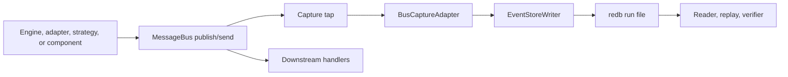
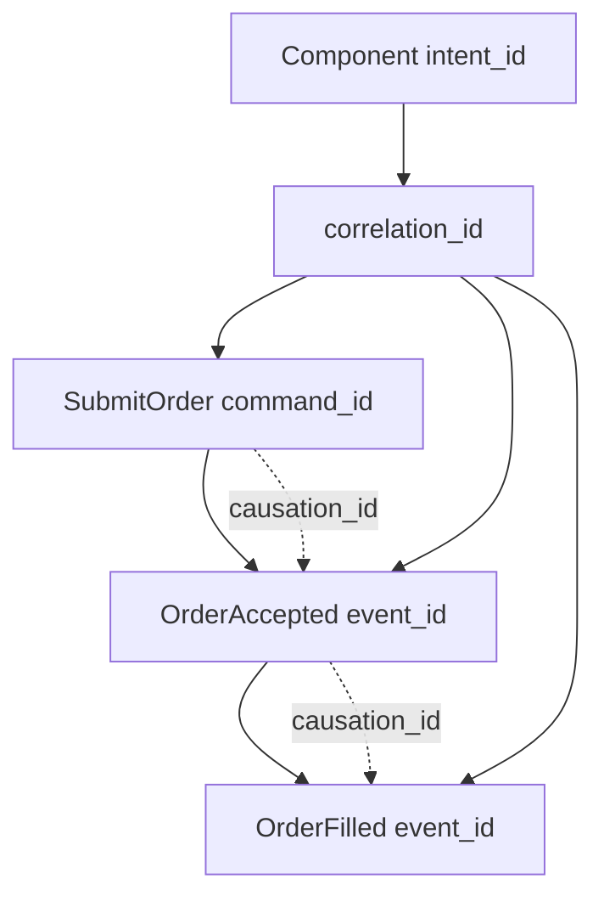
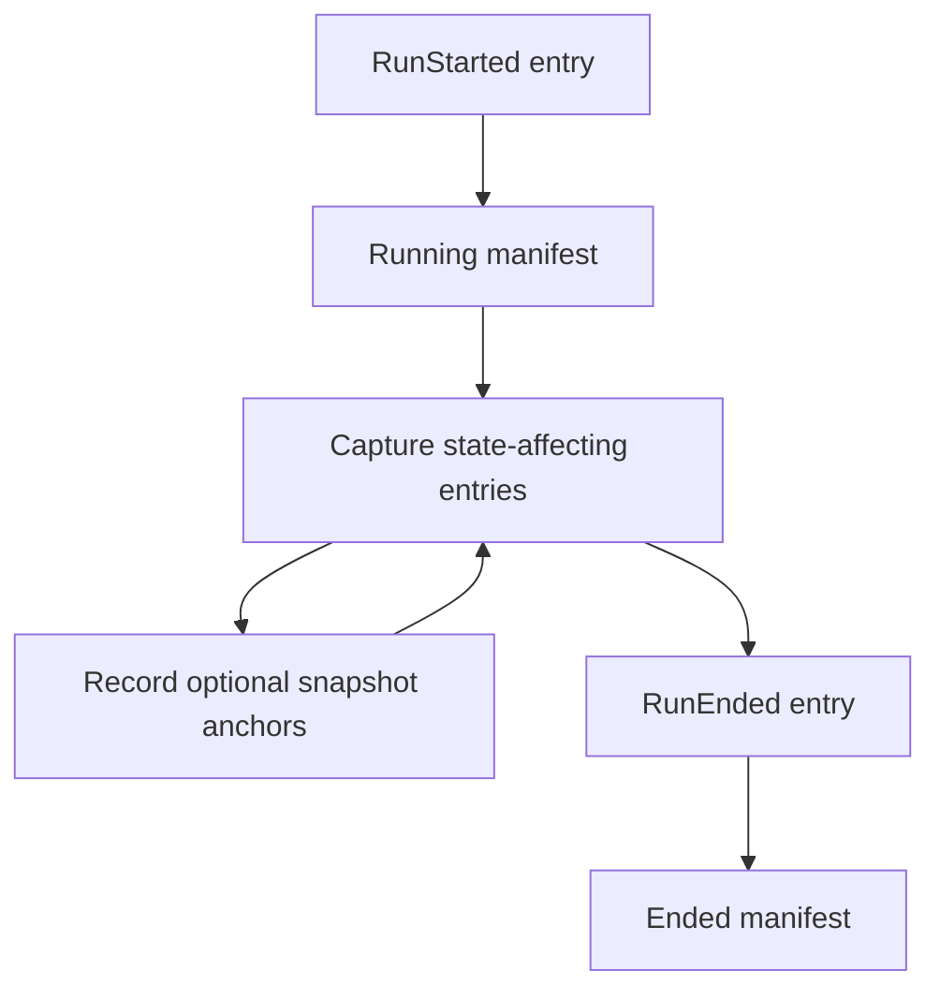
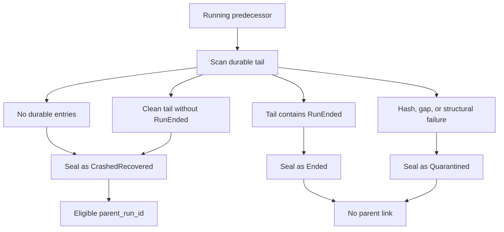
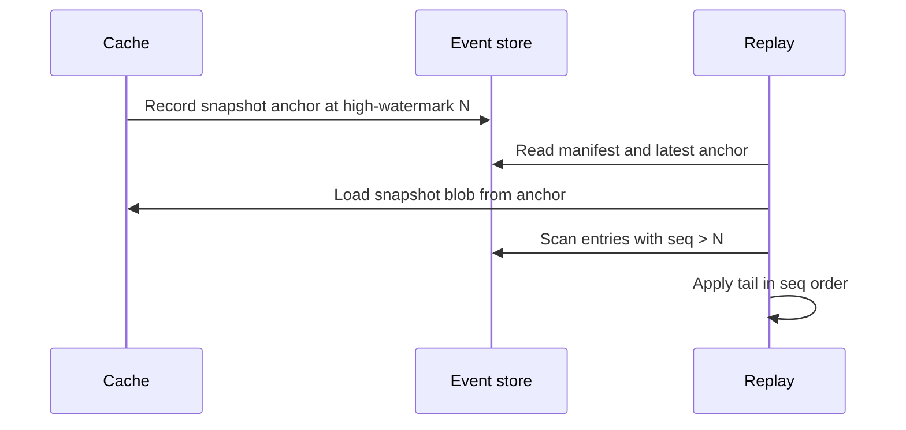

# Event Sourcing

Event sourcing gives NautilusTrader a durable, ordered record of the messages that change engine
state. The event store records those messages at the system boundary, then readers, replay tools,
and verifiers use the same log to reconstruct what happened and to rebuild state.

**The core philosophy**:

- The event store is the durable authority for state-affecting history.
- The cache is a write-through projection, not the source of truth.
- Cache replay rebuilds state by applying captured history to cache-owned state.
- Market data stays in the data catalog; the event store records the messages that affect state.
- External I/O becomes replayable only when Nautilus captures it as commands, raw reports, or
  other state-affecting inputs.

:::note
Event-store capture, replay, verification, recovery, and retention planning have targeted test
coverage, but the API surface is still evolving. Treat the concepts here as the design contract for
current development, and use the crate README for current API details.
:::

## Why event sourcing

The cache answers "what is true now." The event store answers "how did Nautilus get here." It gives
readers, replay tools, and verifiers a run-scoped history that does not require strategy logic,
venue queries, or the live cache to explain past state.

The event store provides Nautilus with a durable basis to:

- Prove whether a sealed run is clean before replay or archive.
- Inspect the exact command, report, and event sequence behind an order or component intent.
- Rebuild cache state from captured history, including a snapshot anchor plus the run tail.
- Trace an intent through the engine-side messages that followed from it.
- Seal stale run files before the next run starts after a process exit or writer halt.

## Terms

- Run: one kernel session for one instance, binary, and config.
- Entry: one captured message plus replay metadata.
- `seq`: the per-run sequence assigned by the writer and used as replay order.
- High-watermark: the largest `seq` durably acknowledged by the backend.
- Snapshot anchor: the high-watermark recorded with a cache snapshot.
- Headers: correlation and causation metadata propagated with captured messages.

## What the store records

The event store records state-affecting message bus traffic for one trading instance and one run.
A run starts when the kernel starts and ends when the process stops cleanly or crashes.

**Captured entries include**:

- Execution commands such as submit, modify, and cancel.
- Data subscription commands that define the actor or strategy observation window.
- Fired time events and generated order, position, and account events.
- Raw venue execution reports before reconciliation synthesizes derived events.
- Reconciliation outputs produced from those raw reports.
- Request and response messages, or their audit-relevant metadata, that cross the bus and affect
  state.
- Run lifecycle entries such as `RunStarted` and `RunEnded`.

The store does not replace the data catalog. Market-data observations remain in the Feather
streaming catalog. The event store records the command stream, raw reports, generated events, and
metadata needed to replay how the engine reacted to that world.

## Boundaries

The event store is intentionally narrow:

- It does not replace the data catalog.
- It does not provide analytics or OLAP queries.
- It does not aggregate multiple trader instances into a consensus log.
- It does not yet define redaction, encryption-at-rest, or tamper evidence.

## Capture flow

Capture happens at the message bus dispatch boundary, before downstream handlers observe the
message. That placement matters because any handler that can mutate state must see only messages
that the event store has already accepted.



**The operational steps are**:

- The producer publishes or sends a state-affecting message.
- The bus capture tap builds an event-store entry before downstream handlers run.
- The writer assigns the next `seq`, writes a batch, and advances the high-watermark after the
  backend acknowledges durability.
- Handlers run after the captured entry has reached the writer boundary.
- Readers scan sealed or running backends without exposing append operations.

The writer uses a bounded channel. If the writer stalls past its configured threshold, Nautilus
halts instead of dropping entries or allowing unaudited state changes.

Some messages legitimately cross more than one tap-visible boundary: the execution engine sends an
order event to the portfolio endpoint and publishes the same event on its strategy topic, and
trading commands hop from strategy to risk to execution. The capture adapter dedups on the
registered message identity (event id, command id), so each logical message becomes exactly one
entry and replay never applies the same event twice.

## Lifecycle options

`EventStoreConfig` remains the serializable run policy. Process-local construction policy lives in
`EventStoreLifecycleOptions`, which advanced callers pass through
`EventStoreLifecycle::boot_with_options(...)`.

By default, the lifecycle opens `RedbBackend` and installs the default encoder registry. Callers can
use lifecycle options to:

- Supply a custom encoder registry before the bus tap starts capture.
- Supply a backend opener that returns any `EventStore` implementation for the new run.

The backend opener is the simulation-safe path for memory capture. A DST harness or focused test can
open `MemoryBackend` through the normal lifecycle, keep the same bus tap and writer semantics, and
read the captured entries in-process after seal. Under `cfg(madsim)`, the writer commits each submit
synchronously, so the captured `seq` order is deterministic. With a `MemoryBackend` opener, capture
needs no `redb` run file.

## Entry model

Each event-store entry is one captured message plus metadata:

- `seq`: the per-run replay-order authority.
- `ts_init`: the domain timestamp on the captured message.
- `ts_publish`: the bus-accepted time when that ordering detail matters.
- `topic`: the bus topic or logical endpoint.
- `payload_type`: the encoded message type.
- `payload`: the encoded message bytes.
- `headers`: correlation and causation metadata.
- `entry_hash`: the canonical hash over the entry content.

`seq` orders replay. Timestamps help explain the run, but they do not override `seq`.

The current secondary indices support lookup by `client_order_id` and `venue_order_id`. A
`correlation_id` index can be added when a concrete inspection caller needs that lookup pattern;
until then, correlation scans can walk the captured stream.

## Correlation model

Nautilus records three identity levels so readers can answer scope, lineage, and message identity
questions.

- `correlation_id`: the logical workflow or chain. A component `intent_id` is recorded in this field
  at the dispatch boundary.
- `causation_id`: the direct parent message that caused this message.
- `command_id`, `event_id`, or `report_id`: the identity of this specific message.



This lets operators ask two common questions:

- "Show everything in this workflow": filter or scan by `correlation_id`.
- "Show why this event happened": walk `causation_id` back to the direct parent.

## Run files and manifests

The default backend is `redb`. It stores one file per run under:

```text
<base>/<instance_id>/<run_id>.redb
```

Each run file contains:

- Entries keyed by `seq`.
- Secondary indices for order identifiers.
- A manifest written at run start and sealed at run end.
- An optional snapshot anchor for cache restore.

The manifest records the run identity and reproducibility inputs:

- Run identity:
  - `run_id`
  - `parent_run_id`
  - `instance_id`

- Build identity:
  - `binary_hash`
  - `crate_versions`
  - `feature_flags`
  - Adapter versions

- Configuration identity:
  - `config_hash`
  - Registered components
  - Optional seed

- Lifecycle state:
  - `start_ts_init`
  - `end_ts_init`
  - `high_watermark`
  - Status

Run status is one of `Running`, `Ended`, `CrashedRecovered`, or `Quarantined`.

## Run lifecycle



Operationally:

- `RunStarted` is the first entry of a fresh run. A repeated `open()` in the same process seals
  the current session before it starts a new run.
- While the manifest is `Running`, the bus tap records state-affecting entries and cache snapshots
  can record anchors against the durable high-watermark.
- A clean shutdown, kernel drop, or reset/rerun seal appends `RunEnded` and seals the manifest as
  `Ended`.
- A fail-stopped (halted) session skips the in-process seal; the recovery sweep on the next boot
  owns it. The halt signal is scoped to the run that fired it: a later `open()` re-arms a fresh
  signal, so one halt does not poison subsequent runs in the same process.

## Recovery sealing

A predecessor is an older run file for the same instance whose manifest still says `Running`. This
means the previous process did not finish the normal lifecycle, or the writer halted before the
manifest seal completed.



Boot recovery scans each `Running` predecessor and chooses a final manifest status from the durable
tail. A clean tail without `RunEnded` seals as `CrashedRecovered`, a tail ending in `RunEnded`
seals as `Ended`, and a hash mismatch, gap, or structural corruption seals as `Quarantined`.

The sweep never leaves the trader unbootable because one run file is damaged. A hard-killed
process (SIGKILL, OOM kill, power loss) leaves a file that redb refuses to open read-only; the
listing falls back to a writable open, which performs redb's repair pass before recovery proceeds.
A file that still cannot be opened, or that lacks a manifest, is skipped with a logged error and
retried on the next boot, so recovery and retention continue over the healthy runs.

Only `CrashedRecovered` predecessors become `parent_run_id`. A configured `replay_from_run_id`
overrides a recovered parent after validation. The read-only verifier is separate: it can inspect a
sealed run without mutating it and reports `quarantine=not-performed`.

## Replay modes

Replay follows one ordering rule: apply event-store entries in `seq` order. `ts_init` and
`ts_publish` explain when messages happened, but `seq` is the durable replay order.

The Rust replay-input API keeps planning separate from execution:

- Event-store-only replay inputs return entries only.
- Catalog-joined replay inputs add caller-selected catalog slices for context analysis.

Catalog planners take explicit `CatalogSliceSelector` values and a read-only `ReplayCatalog`.
Planning resolves catalog time bounds from the event-store scan unless the selector supplies
explicit bounds, reports missing catalog slices, and preserves `seq` as the entry ordering
authority. Loading returns `ReplayInputs`: event-store entries in `seq` order plus catalog records
grouped under their selected slice.

Rust callers can enable the off-by-default `persistence` feature and wrap a `ParquetDataCatalog`
with `nautilus_event_store::ParquetReplayCatalog` to plan selected catalog files and
filename-derived intervals. The bridge can load `quotes`, `trades`, and `bars` into
typed `CatalogReplayRecord` values.

:::note
The persistence bridge is read-only: it uses catalog discovery and query APIs but **does not write
to the catalog**. Unsupported catalog classes fail loading until replay adds a typed payload
contract for that class.
:::

## Data marker sidecar

:::note
The marker sidecar shipped in `crates/event_store/src/markers/`. It is opt-in via
`EventStoreConfig.data_markers` (`crates/system/src/event_store.rs`) and stays off by default.
:::

Exact data delivery order is not inferred from catalog timestamps. The marker sidecar records
data observed at the message-bus dispatch boundary, beside the event-store run, without writing
full market-data payloads into `EventStoreEntry` rows.

The sidecar supports one audit claim: when marker capture is enabled, Nautilus observed data
delivery in `marker_seq` order at the bus boundary for that run, and each marker carries enough
identity to join back to candidate catalog rows. It cannot prove that catalog timestamps alone
define bus order, reconstruct a data point when the catalog row is absent or changed, prove venue
send order before Nautilus observed the message, or say anything about runs where marker capture
was disabled.

Markers do not consume event-store `seq` values and do not create gaps in the entry table. Each
marker has its own monotonically increasing `marker_seq` plus `event_seq_before`, the largest
event-store `seq` assigned before the marker was observed. A sealed-run analyzer can derive the
next event-store entry after a marker from `event_seq_before + 1`; markers that share the same
`event_seq_before` are ordered by `marker_seq`. Event-store `seq` remains the replay-order
authority for state-affecting entries.

The sidecar has two marker kinds:

- **Cursor snapshots** (`DataCursorSnapshot`): the default capture mode. Each snapshot records
  `marker_seq`, `event_seq_before`, `ts_init`, and the `StreamCursor` entries that advanced since
  the previous snapshot. A `StreamCursor` carries the stream `slot`, the highest `ts_init` seen
  in that slot (`ts_init_hi`), and the record `count`. A `StreamDictEntry` maps each `slot` to its
  `data_cls` (`BookDeltas`, `BookDepth10`, `Quote`, `Trade`, `Bar`) and instrument `identifier`.
- **High-fidelity markers** (`HiFiMarker`): opt-in per instrument via
  `DataMarkerConfig.high_fidelity`. Each records `marker_seq`, `event_seq_before`, `slot`,
  `ts_event`, `ts_init`, `same_ts_ordinal`, and a 32-byte `record_fingerprint` over the canonical
  typed row fields.

`same_ts_ordinal` and `record_fingerprint` disambiguate duplicate same-timestamp data without
storing prices, quantities, sizes, or MessagePack payloads. If two catalog rows are byte-identical
for the same key and timestamp, the sidecar can prove that Nautilus observed two deliveries in a
specific marker order; it cannot name a unique physical catalog row after catalog compaction
rewrites row order.

The stable contract is the marker schema, opt-in capture and reader primitives, gap-free marker
verification, and catalog join rules. Analysis tools can build on that contract to select windows,
interpret venue-specific data, rank or cluster markers, present reports, and package run bundles.

With marker capture disabled, no data marker writer is installed. Cache replay and live restart do
not read this sidecar: snapshot-tail replay still applies event-store entries in `seq` order, and
live restart still boots from cache-owned state plus the event-store parent link.

These APIs **do not**:

- Open live venue clients
- Run strategies or actors
- Re-run reconciliation
- Delete files
- Replay the clock registration/cancel lifecycle

Kernel-managed replay uses `EventStoreConfig::replay_from_run_id`. When set, the kernel restores
cache state from the sealed run, records that run as the parent of the fresh child run, and skips
live engines, clients, startup, and venue reconciliation.

The cache replay loader is state-only. It restores the cache-owned snapshot, scans the event-store
tail in `seq` order, decodes supported cache-affecting payloads, and applies them directly to
`Cache`. Supported payloads include:

- Synthesized account, order, and position events
- Captured order lists
- Complete data responses for instruments, quotes, trades, funding rates, and bars

It **does not**:

- Publish replayed entries to the live message bus
- Run strategy or actor code
- Query venues
- Run reconciliation
- Derive identifiers again
- Re-arm clocks

Fired `TimeEvent`s and raw venue reports are inspection records on this path; replay applies the
synthesized order, position, and account events captured later in the run.

## Snapshot-anchored recovery

Cache snapshots are owned by the cache. The event store stores only the snapshot anchor: the
high-watermark at snapshot time plus a content-addressed reference to the snapshot blob.



Recovery cases are ordered by how far the message progressed:

- Before enqueue: the message never reached the writer, so producer retry policy applies.
- After enqueue, before commit: the in-flight batch is not durable, so the high-watermark does
  not advance.
- After commit, before snapshot anchor: recovery loads the prior snapshot and replays the tail.
- After snapshot anchor: recovery loads the latest snapshot and replays entries after the anchor.

:::info
Live restart still uses snapshot-plus-reconcile. Event-store recovery becomes the live restart path
only after capture coverage and replay rules cover every state-affecting path.
:::

Replay correctness depends on four checks:

- Entries are addressed by immutable `seq` values.
- Writes reject out-of-order commits.
- Readers detect gaps inside the high-watermark.
- Snapshot replay plans reject anchors that point past the durable high-watermark.

## Retention planning

Retention uses whole run files as the reclaim unit. The event store exposes a non-destructive
planner that lists sealed run manifests, inspects their latest snapshot-anchor status, and returns
candidate run files for a later supervisor or operator process to reclaim.

The planner supports three modes:

- `Full`: keep every sealed run and return no reclaim candidates.
- `Bounded { keep_last }`: keep the newest sealed runs and also keep at least one known-good
  restore point.
- `SnapshotAnchored`: reclaim only sealed runs older than the newest known-good restore point.

A known-good restore point is a sealed, non-`Quarantined` run with a valid snapshot anchor whose
high-watermark does not exceed the run's durable high-watermark (the last entry actually on disk,
not the manifest's recorded value, so a tail-trimmed run cannot pose as a restore point).
`Running` runs are never listed as sealed runs or selected as reclaim candidates. Missing, corrupt, or invalid snapshot
anchors do not count as restore points, so the planner returns no candidates when it cannot prove
that at least one usable restore point remains.

## Verification coverage

The event-store test suite pins the load-bearing correctness guarantees for the current alpha
surface:

- The default encoder registry covers the audited state-affecting capture surface.
- Fired `TimeEvent`s hit the installed event-store tap through `TimeEventHandler::run`.
- The writer halts under bounded backpressure instead of dropping accepted entries.
- Entry hash verification detects byte-level payload corruption.
- Process-isolated verification reports truncated or zero-tailed run files as corrupt.
- Cache replay reconstructs the same observed account, order, and position state as a live cache
  for generated captured event streams.
- The same order event dispatched across multiple bus boundaries is captured once.
- Snapshot anchors that fail to decode or point past the durable high-watermark surface as
  verifier findings instead of verifying clean.
- Catalog-joined replay input planning covers selected slices, missing slices, time bounds, and
  event-store `seq` ordering.
- Crash recovery seals `Running` predecessors as `Ended`, `CrashedRecovered`, or `Quarantined`
  based on the durable tail, and only `CrashedRecovered` runs become parents.
- Boot recovery repairs hard-crashed run files and skips unreadable ones instead of failing the
  sweep.

## Integrity and verification

Every entry carries a canonical hash over its full content. Readers and verifiers recompute the
hash and report mismatches. The verifier also checks manifest/high-watermark status, validates
secondary indices against the entry table, and reports snapshot anchors that fail to decode or
point past the durable high-watermark, so a run whose restore path is broken cannot verify clean.

Run verification is process-isolated. This matters because some corrupted `redb` files can panic
on open or first read, and release builds use `panic = "abort"`. The verifier runs the scan in a
worker subprocess so a bad file aborts the worker, not the caller.

Verify a sealed run file:

```fish
cargo run -p nautilus-event-store --bin verify -- /path/to/run.redb
```

Clean output looks like:

```text
clean run_id=1700000000-cafe0001 status=Ended high_watermark=3 entries_scanned=3
```

Corrupt output includes `quarantine=not-performed`:

```text
corrupt run_id=1700000000-cafe0001 status=Ended high_watermark=3 entries_scanned=3 findings=1 quarantine=not-performed
- hash mismatch at seq 2
```

Exit codes:

- `0`: the run is clean.
- `1`: the run has corrupt findings, or the worker aborted or timed out.
- `2`: the verifier could not open or run against the requested file.

:::note
The verifier reports corruption but does not mutate run files. Quarantine is an operator or supervisor policy.
:::

## Operational use today

Current alpha use is focused on local inspection and verification of run files.

Verify a run after copying or restoring it:

```fish
cargo run -p nautilus-event-store --bin verify -- ./event_store/trader-001/1700000000-cafe0001.redb
```

Increase the verifier timeout for a large sealed run:

```fish
env NAUTILUS_EVENT_STORE_VERIFY_TIMEOUT_SECS=120 \
    cargo run -p nautilus-event-store --bin verify -- ./event_store/trader-001/1700000000-cafe0001.redb
```

Read a sealed run from Rust:

```rust
use nautilus_event_store::{EventStoreReader, RedbBackend, ScanDirection};

fn inspect_run() -> Result<(), Box<dyn std::error::Error>> {
    let backend =
        RedbBackend::open_sealed_file("./event_store/trader-001/1700000000-cafe0001.redb")?;
    let reader = EventStoreReader::new(backend);
    let high_watermark = reader.high_watermark()?;

    for entry in reader.scan_range(1, high_watermark, ScanDirection::Forward) {
        let entry = entry?;
        println!("{} {}", entry.seq, entry.topic);
    }

    Ok(())
}
```

The verifier is read-only inspection. It reports corruption without changing the run file, so
quarantine decisions remain outside this command path.

## Relationship to DST

The event store and deterministic simulation testing (DST) solve different parts of replay.

- The event store supplies the captured input history.
- DST controls scheduling, time, seeded randomness, and other in-scope nondeterminism.
- Together they let a run reproduce engine behavior inside the deterministic simulation scope when
  identified by:
  - `seed`
  - `binary_hash`
  - `config_hash`
  - `schema_version`
  - `log`

Under `cfg(madsim)`, the writer commits synchronously instead of spawning its writer thread. When a
simulation harness supplies a `MemoryBackend` opener through lifecycle options, capture stays
in-process and does not require `redb` files. Redb remains the default durable backend outside that
advanced options path.

Adapter network I/O remains outside bit-identical replay unless Nautilus captures the relevant
raw inputs and routes them through deterministic interfaces.
