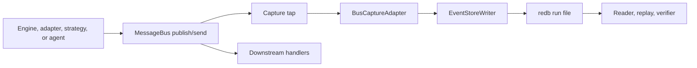
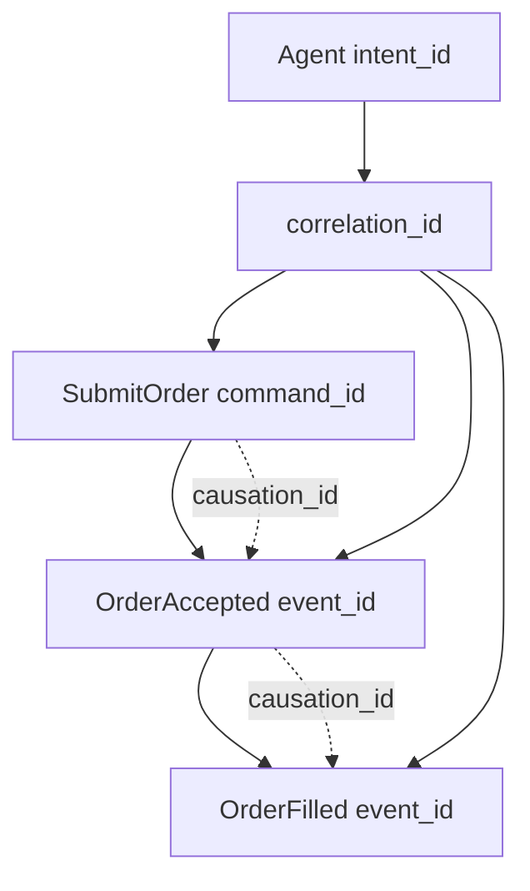
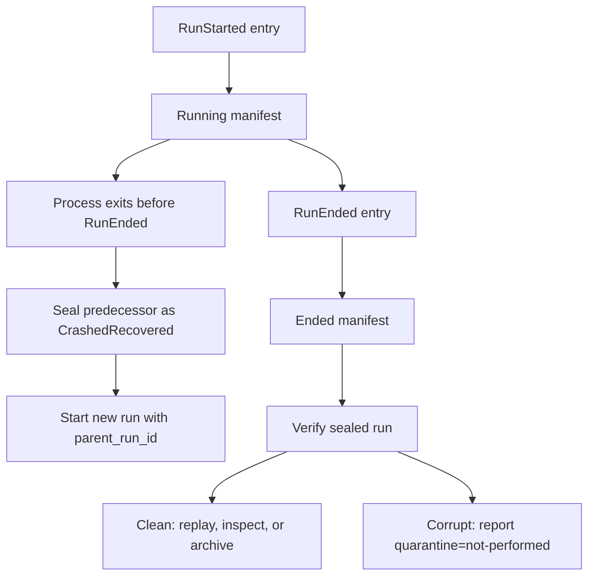
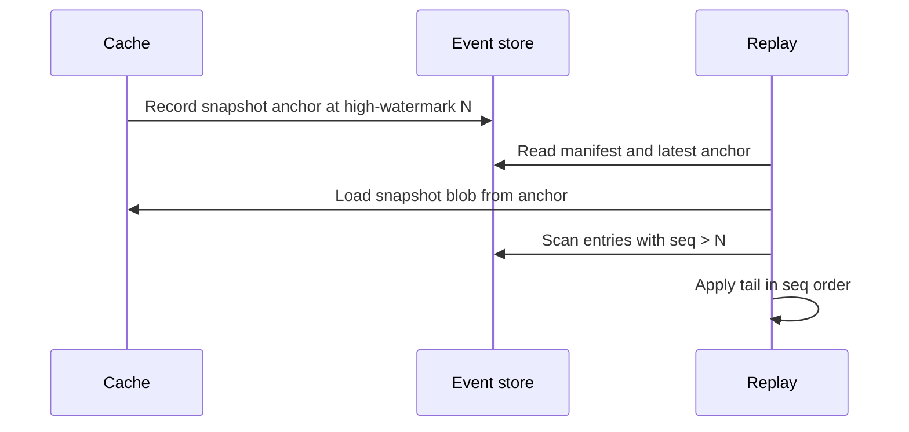

# Event Sourcing

Event sourcing gives NautilusTrader a durable, ordered record of the messages that change engine
state. The event store records those messages at the system boundary, then readers, replay tools,
and verifiers use the same log to reconstruct what happened and to rebuild state.

**The core philosophy**:

- The event store is the durable authority for state-affecting history.
- The cache is a write-through projection, not the source of truth.
- Replay uses captured history and named deterministic replay rules.
- Market data stays in the data catalog; the event store records the messages that affect state.
- External I/O becomes replayable only when Nautilus captures it as commands, raw reports, or
  other state-affecting inputs.

:::warning
Event-store capture, replay, and verification are early alpha surfaces. Treat the concepts here as
the design contract for current development, and use the crate README for current API details.
:::

## Terms

- Run: one kernel session for one instance, binary, and config.
- Entry: one captured message plus replay metadata.
- `seq`: the per-run sequence assigned by the writer and used as replay order.
- High-watermark: the largest `seq` durably acknowledged by the backend.
- Snapshot anchor: the high-watermark recorded with a cache snapshot.
- Headers: correlation and causation metadata propagated with captured messages.

## What the store records

The event store records state-affecting message bus traffic for one trading instance and one run.
A run starts when the kernel starts and ends when the process stops cleanly or crashes.

**Captured entries include**:

- Execution commands such as submit, modify, and cancel.
- Data subscription commands that define the actor, strategy, or agent observation window.
- Generated time, order, position, and account events.
- Raw venue execution reports before reconciliation synthesizes derived events.
- Reconciliation outputs produced from those raw reports.
- Request and response messages that cross the bus and affect state.
- Run lifecycle entries such as `RunStarted` and `RunEnded`.

The store does not replace the data catalog. Market-data observations remain in the Feather
streaming catalog. The event store records the command stream, raw reports, generated events, and
metadata needed to replay how the engine reacted to that world.

## Boundaries

The event store is intentionally narrow:

- It does not replace the data catalog.
- It does not provide analytics or OLAP queries.
- It does not aggregate multiple trader instances into a consensus log.
- It does not yet define redaction, encryption-at-rest, or tamper evidence.

## Capture flow

Capture happens at the message bus dispatch boundary, before downstream handlers observe the
message. That placement matters because any handler that can mutate state must see only messages
that the event store has already accepted.



**The operational steps are**:

- The producer publishes or sends a state-affecting message.
- The bus capture tap builds an event-store entry before handler fanout.
- The writer assigns the next `seq`, writes a batch, and advances the high-watermark after the
  backend acknowledges durability.
- Handlers run after the captured entry has reached the writer boundary.
- Readers scan sealed or running backends without exposing append operations.

The writer uses a bounded channel. If the writer stalls past its configured threshold, Nautilus
halts instead of dropping entries or allowing unaudited state changes.

## Entry model

Each event-store entry is one captured message plus metadata:

- `seq`: the per-run replay-order authority.
- `ts_init`: the domain timestamp on the captured message.
- `ts_publish`: the bus-accepted time when that ordering detail matters.
- `topic`: the bus topic or logical endpoint.
- `payload_type`: the encoded message type.
- `payload`: the encoded message bytes.
- `headers`: correlation and causation metadata.
- `hash`: the canonical hash over the entry content.

`seq` orders replay. Timestamps help explain the run, but they do not override `seq`.

The current secondary indices support lookup by `client_order_id` and `venue_order_id`. A
`correlation_id` index can be added when a concrete forensics caller needs that lookup pattern;
until then, correlation scans can walk the captured stream.

## Correlation model

Nautilus records three identity levels so forensics can answer scope, lineage, and message identity
questions.

- `correlation_id`: the logical workflow or chain. An agent `intent_id` lowers into this field at the dispatch boundary.
- `causation_id`: the direct parent message that caused this message.
- `command_id`, `event_id`, or `report_id`: the identity of this specific message.



This lets operators ask two common questions:

- "Show everything in this workflow": filter or scan by `correlation_id`.
- "Show why this event happened": walk `causation_id` back to the direct parent.

## Run files and manifests

The default backend is `redb`. It stores one file per run under:

```text
<base>/<instance_id>/<run_id>.redb
```

Each run file contains:

- Entries keyed by `seq`.
- Secondary indices for order identifiers.
- A manifest written at run start and sealed at run end.
- An optional snapshot anchor for cache restore.

The manifest records the run identity and reproducibility inputs:

- `run_id`, `parent_run_id`, and `instance_id`.
- `binary_hash`, `crate_versions`, `feature_flags`, and adapter versions.
- `config_hash`, registered components, and optional seed.
- `start_ts_init`, `end_ts_init`, `high_watermark`, and status.

Run status is one of `Running`, `Ended`, `CrashedRecovered`, or `Quarantined`.

## Run lifecycle



Operationally:

- A clean shutdown appends `RunEnded` and seals the manifest as `Ended`.
- A restart can mark a predecessor without `RunEnded` as `CrashedRecovered`.
- A verifier can inspect a sealed run without mutating it.
- Quarantine is a policy decision owned outside the verifier binary.

## Replay modes

The event store supports three replay scopes:

- Forensics replay: scan the event store by `seq` or order identifier.
- Decision replay: join event-store entries with selected data catalog topics.
- Full incident replay: replay the event-store stream with all relevant data catalog slices.

Replay follows one ordering rule: apply entries in `seq` order. `ts_init` and `ts_publish` explain
when messages happened, but `seq` is the durable replay order.

Kernel-managed replay uses `EventStoreConfig::replay_from_run_id`. When set, the kernel restores
cache state from the sealed run, records that run as the parent of the fresh child run, and skips
live engines, clients, startup, and venue reconciliation.

## Snapshot-anchored recovery

Cache snapshots are owned by the cache. The event store stores only the snapshot anchor: the
high-watermark at snapshot time plus a content-addressed reference to the snapshot blob.



Recovery uses four cases:

- Before enqueue: the message never reached the writer, so producer retry policy applies.
- After enqueue, before commit: the in-flight batch is not durable, so the high-watermark does
  not advance.
- After commit, before snapshot anchor: recovery loads the prior snapshot and replays the tail.
- After snapshot anchor: recovery loads the latest snapshot and replays entries after the anchor.

:::info
Live restart still uses snapshot-plus-reconcile. Event-store recovery becomes the live restart path
only after capture coverage and replay rules cover every state-affecting path.
:::

Replay correctness depends on four checks:

- Entries are addressed by immutable `seq` values.
- Writes reject out-of-order commits.
- Readers detect gaps inside the high-watermark.
- Live catch-up deduplicates by captured entry and venue identifiers.

## Integrity and verification

Every entry carries a canonical hash over its full content. Readers and verifiers recompute the
hash and report mismatches. The verifier also checks manifest/high-watermark status and validates
secondary indices against the entry table.

Run verification is process-isolated. This matters because some corrupted `redb` files can panic
on open or first read, and release builds use `panic = "abort"`. The verifier runs the scan in a
worker subprocess so a bad file aborts the worker, not the caller.

Verify a sealed run file:

```fish
cargo run -p nautilus-event-store --bin verify -- /path/to/run.redb
```

Clean output looks like:

```text
clean run_id=1700000000-cafe0001 status=Ended high_watermark=3 entries_scanned=3
```

Corrupt output includes `quarantine=not-performed`:

```text
corrupt run_id=1700000000-cafe0001 status=Ended high_watermark=3 entries_scanned=3 findings=1 quarantine=not-performed
- hash mismatch at seq 2
```

Exit codes:

- `0`: the run is clean.
- `1`: the run has corrupt findings, or the worker aborted or timed out.
- `2`: the verifier could not open or run against the requested file.

:::note
The verifier reports corruption but does not mutate run files. Quarantine is an operator or supervisor policy.
:::

## Operational use today

Current alpha use is focused on local inspection and verification of run files.

Verify a run after copying or restoring it:

```fish
cargo run -p nautilus-event-store --bin verify -- ./event_store/trader-001/1700000000-cafe0001.redb
```

Increase the verifier timeout for a large sealed run:

```fish
env NAUTILUS_EVENT_STORE_VERIFY_TIMEOUT_SECS=120 \
    cargo run -p nautilus-event-store --bin verify -- ./event_store/trader-001/1700000000-cafe0001.redb
```

Read a sealed run from Rust:

```rust
use nautilus_event_store::{EventStoreReader, RedbBackend, ScanDirection};

fn inspect_run() -> Result<(), Box<dyn std::error::Error>> {
    let backend =
        RedbBackend::open_sealed_file("./event_store/trader-001/1700000000-cafe0001.redb")?;
    let reader = EventStoreReader::new(backend);
    let high_watermark = reader.high_watermark()?;

    for entry in reader.scan_range(1, high_watermark, ScanDirection::Forward) {
        let entry = entry?;
        println!("{} {}", entry.seq, entry.topic);
    }

    Ok(())
}
```

Use the log operationally to:

- Prove whether a sealed run is clean before replay or archive.
- Inspect the exact command and event sequence for an order.
- Rebuild cache state from a snapshot anchor plus the run tail.
- Compare an agent decision envelope with the engine-side messages that followed from it.
- Keep corrupt-run handling outside the trading process.

## Relationship to DST

The event store and deterministic simulation testing (DST) solve different parts of replay.

- The event store supplies the captured input history.
- DST controls scheduling, time, seeded randomness, and other in-scope nondeterminism.
- Together they let a run identified by `(seed, binary_hash, config_hash, schema_version, log)`
  reproduce engine behavior inside the deterministic simulation scope.

Under `cfg(madsim)`, tests use a synchronous in-memory event store instead of the writer thread, so
they can assert against an authoritative log without disk I/O or thread scheduling.

Adapter network I/O remains outside bit-identical replay unless Nautilus captures the relevant
raw inputs and routes them through deterministic seams.
