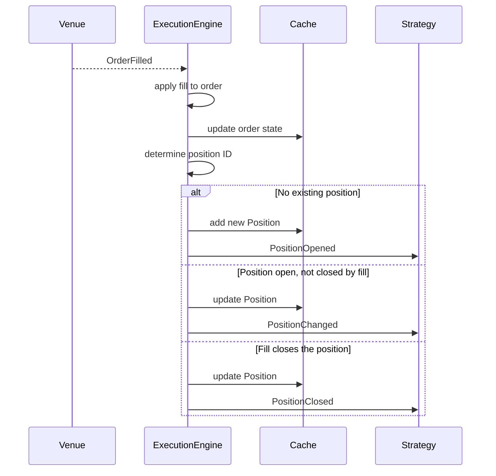

# Events

Nautilus is event-driven: every state change in the system is represented
by an event object that flows through the `MessageBus` to strategy and actor
handlers. This guide covers the event types, how they are dispatched, and how
order fills produce position events.

## Event categories

| Category | Examples                                        | Origin                          |
|----------|-------------------------------------------------|---------------------------------|
| Order    | `OrderAccepted`, `OrderFilled`, `OrderCanceled` | `ExecutionEngine` (from venue)  |
| Position | `PositionOpened`, `PositionChanged`             | `ExecutionEngine` (from fills)  |
| Account  | `AccountState`                                  | `ExecutionClient` / `Portfolio` |
| Time     | `TimeEvent`                                     | `Clock` (timers and alerts)     |

## Handler dispatch

When an event reaches a strategy, the system calls handlers in a fixed
priority order. The first matching handler runs, then the next level, so you
can handle events at whatever granularity you need.

### Order events

1. Specific handler (e.g. `on_order_filled`)
2. `on_order_event` (receives all order events)
3. `on_event` (receives everything)

### Position events

1. Specific handler (e.g. `on_position_opened`)
2. `on_position_event` (receives all position events)
3. `on_event` (receives everything)

### Time events

Timers and alerts produce `TimeEvent` objects. Pass a `callback` when calling
`set_timer` or `set_time_alert` to direct events to your own method. If you
omit the callback, the event is delivered to `on_event` instead.

## Order events

Each order event corresponds to a state transition in the
[order state machine](orders.md#order-state-flow). The `ExecutionEngine`
applies the event to the order, updates the `Cache`, and publishes it on the
`MessageBus`. The table below shows the primary transitions; partially filled
and triggered orders support additional transitions documented in the full
[order state flow](orders.md#order-state-flow).

| Event                  | Primary transition                  | Handler                    |
|------------------------|-------------------------------------|----------------------------|
| `OrderInitialized`     | (created locally)                   | `on_order_initialized`     |
| `OrderDenied`          | Initialized -> Denied               | `on_order_denied`          |
| `OrderEmulated`        | Initialized -> Emulated             | `on_order_emulated`        |
| `OrderReleased`        | Emulated -> Released                | `on_order_released`        |
| `OrderSubmitted`       | Initialized/Released -> Submitted   | `on_order_submitted`       |
| `OrderAccepted`        | Submitted -> Accepted               | `on_order_accepted`        |
| `OrderRejected`        | Submitted -> Rejected               | `on_order_rejected`        |
| `OrderTriggered`       | Accepted -> Triggered               | `on_order_triggered`       |
| `OrderPendingUpdate`   | Accepted -> PendingUpdate           | `on_order_pending_update`  |
| `OrderPendingCancel`   | Accepted -> PendingCancel           | `on_order_pending_cancel`  |
| `OrderUpdated`         | PendingUpdate -> Accepted           | `on_order_updated`         |
| `OrderModifyRejected`  | PendingUpdate -> Accepted           | `on_order_modify_rejected` |
| `OrderCancelRejected`  | PendingCancel -> Accepted           | `on_order_cancel_rejected` |
| `OrderCanceled`        | PendingCancel/Accepted -> Canceled  | `on_order_canceled`        |
| `OrderExpired`         | Accepted -> Expired                 | `on_order_expired`         |
| `OrderFilled`          | Accepted -> Filled/PartiallyFilled  | `on_order_filled`          |

### Common order event fields

All order events share these fields:

| Field              | Description                              |
|--------------------|------------------------------------------|
| `trader_id`        | Trader instance identifier.              |
| `strategy_id`      | Strategy that submitted the order.       |
| `instrument_id`    | Instrument for the order.                |
| `client_order_id`  | Client‑assigned order identifier.        |
| `venue_order_id`   | Venue‑assigned order identifier.         |
| `account_id`       | Account the order belongs to.            |
| `reconciliation`   | Whether generated during reconciliation. |
| `event_id`         | Unique event identifier.                 |
| `ts_event`         | Timestamp when the event occurred.       |
| `ts_init`          | Timestamp when the event was created.    |

Individual events add type-specific fields (e.g. `OrderFilled` adds
`last_qty`, `last_px`, `trade_id`, `commission`). See the API reference
for the full field list per event type.

:::tip
Override `on_order_event` to handle all order events in one place. The specific
handlers fire first, so you can mix both approaches.
:::

## Position events

Position events are a direct consequence of fill events. The `ExecutionEngine`
processes each `OrderFilled`, updates or creates a position, and emits the
corresponding position event.

| Event               | When it fires                             | Handler               |
|---------------------|-------------------------------------------|-----------------------|
| `PositionOpened`    | First fill creates a new position.        | `on_position_opened`  |
| `PositionChanged`   | Subsequent fill changes quantity or side. | `on_position_changed` |
| `PositionClosed`    | Fill reduces quantity to zero.            | `on_position_closed`  |

### From fill to position: the causal chain

The following diagram shows how a single `OrderFilled` event produces a
position event. This is the key link between order management and position
tracking.



**Step by step:**

1. **Fill arrives.** The `ExecutionEngine` receives an `OrderFilled` event
   from the venue adapter.
2. **Order state updates.** The engine applies the fill to the order object
   and writes the updated order to the `Cache`.
3. **Position ID resolved.** The engine determines which position this fill
   belongs to, based on OMS type and strategy configuration.
4. **Position created or updated.** Three outcomes:
   - **No position exists** for this ID: the engine creates a `Position` from
     the fill, adds it to the `Cache`, and emits `PositionOpened`.
   - **Position exists and remains open** after the fill: the engine applies
     the fill to the position, updates the `Cache`, and emits
     `PositionChanged`.
   - **Position exists and closes** (quantity reaches zero): the engine
     applies the fill, updates the `Cache`, and emits `PositionClosed`.
5. **Flip case.** When a fill reverses the position (e.g. long 10 filled
   sell 15), the engine splits the fill into two parts: one that closes the
   original position (`PositionClosed`) and one that opens the new position
   (`PositionOpened`).

### Position event fields

| Field                | Opened | Changed | Closed | Description                       |
|----------------------|--------|---------|--------|-----------------------------------|
| `trader_id`          | ✓      | ✓       | ✓      | Trader instance identifier.       |
| `strategy_id`        | ✓      | ✓       | ✓      | Strategy that owns the position.  |
| `instrument_id`      | ✓      | ✓       | ✓      | Instrument for the position.      |
| `position_id`        | ✓      | ✓       | ✓      | Unique position identifier.       |
| `account_id`         | ✓      | ✓       | ✓      | Account the position belongs to.  |
| `opening_order_id`   | ✓      | ✓       | ✓      | Order that opened the position.   |
| `closing_order_id`   | -      | -       | ✓      | Order that closed the position.   |
| `entry`              | ✓      | ✓       | ✓      | Side of the opening fill.         |
| `side`               | ✓      | ✓       | ✓      | Current position side.            |
| `signed_qty`         | ✓      | ✓       | ✓      | Signed quantity (negative=short). |
| `quantity`           | ✓      | ✓       | ✓      | Unsigned position quantity.       |
| `peak_qty`           | -      | ✓       | ✓      | Largest quantity held.            |
| `last_qty`           | ✓      | ✓       | ✓      | Quantity of the last fill.        |
| `last_px`            | ✓      | ✓       | ✓      | Price of the last fill.           |
| `currency`           | ✓      | ✓       | ✓      | Settlement currency.              |
| `avg_px_open`        | ✓      | ✓       | ✓      | Average entry price.              |
| `avg_px_close`       | -      | ✓       | ✓      | Average exit price.               |
| `realized_return`    | -      | ✓       | ✓      | Realized return as a ratio.       |
| `realized_pnl`       | -      | ✓       | ✓      | Realized profit and loss.         |
| `unrealized_pnl`     | -      | ✓       | ✓      | Unrealized profit and loss.       |
| `duration_ns`        | -      | -       | ✓      | Time held in nanoseconds.         |
| `ts_opened`          | -      | ✓       | ✓      | Timestamp when position opened.   |
| `ts_closed`          | -      | -       | ✓      | Timestamp when position closed.   |
| `event_id`           | ✓      | ✓       | ✓      | Unique event identifier.          |
| `ts_event`           | ✓      | ✓       | ✓      | Timestamp of the triggering fill. |
| `ts_init`            | ✓      | ✓       | ✓      | Timestamp when event was created. |

### Tracing orders to positions

The `Cache` provides methods to navigate between orders and positions:

```python
# From a position, find all orders that contributed fills
orders = self.cache.orders_for_position(position.id)

# From an order, find the position it belongs to
position = self.cache.position_for_order(order.client_order_id)

# The opening order is stored directly on the position
opening_order_id = position.opening_order_id
```

## Account events

`AccountState` events represent balance and margin snapshots. They fire when:

- The venue reports an account update (via the execution client).
- The `Portfolio` recalculates account state after a position update
  (for margin accounts with `calculate_account_state` enabled).

Account state contains balances, margins, account type, and base currency.
The `Portfolio` subscribes to these events internally to maintain exposure
and balance tracking.

## Event subscriptions

Beyond strategy handlers, actors can subscribe to specific event streams for
instruments they do not trade. These subscriptions use the `MessageBus`
directly and do not involve the `DataEngine`.

| Method                       | Handler               | Receives                       |
|------------------------------|-----------------------|--------------------------------|
| `subscribe_order_fills()`    | `on_order_filled()`   | All fills for an instrument.   |
| `subscribe_order_cancels()`  | `on_order_canceled()` | All cancels for an instrument. |

These are useful for monitoring actors that track execution quality or fill
rates across strategies without participating in order management.

For details and examples, see
[Order fill subscriptions](actors.md#order-fill-subscriptions) and
[Order cancel subscriptions](actors.md#order-cancel-subscriptions).

## Related guides

- [Orders](orders.md) - Order types and state machine.
- [Positions](positions.md) - Position lifecycle and PnL.
- [Execution](execution.md) - Execution flow and risk checks.
- [Strategies](strategies.md) - Handler implementations in strategies.
- [Architecture](architecture.md) - Data and execution flow patterns.
