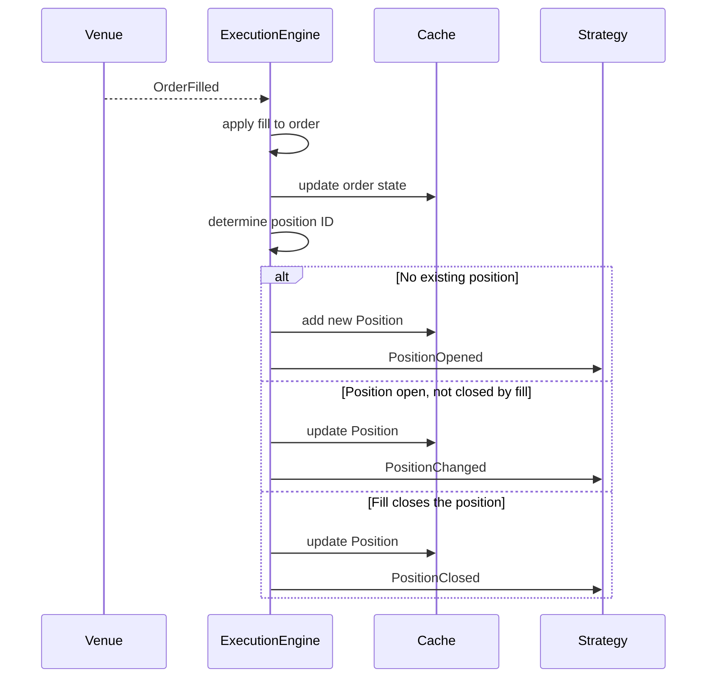

# Events

NautilusTrader models execution, position, account, and time changes as events. The `MessageBus`
routes these events to interested components and, where supported, to strategy handlers. This guide
covers the event types, their dispatch, and how order fills and corrections produce position events.

## Event categories

| Category | Examples                                        | Origin                          |
| -------- | ----------------------------------------------- | ------------------------------- |
| Order    | `OrderAccepted`, `OrderFilled`, `OrderCanceled` | Execution pipeline              |
| Position | `PositionOpened`, `PositionAdjusted`            | Fills and accounting changes    |
| Account  | `AccountState`                                  | `ExecutionClient` / `Portfolio` |
| Time     | `TimeEvent`                                     | `Clock` (timers and alerts)     |

## Handler dispatch

When an event reaches a strategy, the system calls handlers in a fixed order. The specific handler
runs before the aggregate handler, so you can handle events at either granularity or use both.

### Order events

1. Specific handler (for example, `on_order_filled`).
1. `on_order_event` (receives all order events).

### Position events

For the position lifecycle events dispatched to strategies:

1. Specific handler (for example, `on_position_opened`).
1. `on_position_event` (receives all dispatched position lifecycle events).

### Time events

Timers and alerts produce `TimeEvent` objects. Pass a `callback` when calling
`set_timer` or `set_time_alert` to direct events to your own method. If you
omit the callback, a callback previously registered under the same name is
used when present; otherwise the event is delivered to `on_time_event`.

## Order events

Order events initialize an order, change its state, or correct its fill history. The execution
pipeline applies them to the order and cache, then publishes them on the `MessageBus`. The table
below shows the primary transitions; partially filled, external, and triggered orders support
additional transitions documented in the full
[order state flow](../orders/index.md#order-state-flow).

| Event                                             | Primary transition                           | Handler                    |
| ------------------------------------------------- | -------------------------------------------- | -------------------------- |
| [`OrderInitialized`](order_initialized.md)        | Create or materialize order                  | `on_order_initialized`     |
| [`OrderDenied`](order_denied.md)                  | Initialized -> Denied                        | `on_order_denied`          |
| [`OrderEmulated`](order_emulated.md)              | Initialized -> Emulated                      | `on_order_emulated`        |
| [`OrderReleased`](order_released.md)              | Emulated -> Released                         | `on_order_released`        |
| [`OrderSubmitted`](order_submitted.md)            | Initialized/Released -> Submitted            | `on_order_submitted`       |
| [`OrderAccepted`](order_accepted.md)              | Submitted -> Accepted                        | `on_order_accepted`        |
| [`OrderRejected`](order_rejected.md)              | Submitted -> Rejected                        | `on_order_rejected`        |
| [`OrderTriggered`](order_triggered.md)            | Accepted -> Triggered                        | `on_order_triggered`       |
| [`OrderPendingUpdate`](order_pending_update.md)   | Accepted -> PendingUpdate                    | `on_order_pending_update`  |
| [`OrderPendingCancel`](order_pending_cancel.md)   | Accepted -> PendingCancel                    | `on_order_pending_cancel`  |
| [`OrderUpdated`](order_updated.md)                | PendingUpdate -> previous status             | `on_order_updated`         |
| [`OrderModifyRejected`](order_modify_rejected.md) | PendingUpdate -> previous status             | `on_order_modify_rejected` |
| [`OrderCancelRejected`](order_cancel_rejected.md) | PendingCancel -> previous status             | `on_order_cancel_rejected` |
| [`OrderCanceled`](order_canceled.md)              | PendingCancel/Accepted -> Canceled           | `on_order_canceled`        |
| [`OrderExpired`](order_expired.md)                | Accepted -> Expired                          | `on_order_expired`         |
| [`OrderFilled`](order_filled.md)                  | Accepted -> Filled/PartiallyFilled           | `on_order_filled`          |
| [`OrderFillVoided`](order_fill_voided.md)         | Revise known fill; otherwise assert terminal | `on_order_fill_voided`     |

### Common Python order event fields

Every concrete Python order event exposes these fields:

| Field             | Description                                                  |
| ----------------- | ------------------------------------------------------------ |
| `trader_id`       | Trader instance identifier.                                  |
| `strategy_id`     | Strategy associated with the order.                          |
| `instrument_id`   | Instrument for the order.                                    |
| `client_order_id` | Client-assigned order identifier.                            |
| `event_id`        | Unique event identifier.                                     |
| `ts_event`        | UNIX timestamp (nanoseconds) when the event occurred.        |
| `ts_init`         | UNIX timestamp (nanoseconds) when the event was initialized. |
| `causation_id`    | Source event or report which caused this event, if known.    |

Each order event page lists its type-specific fields. These include `venue_order_id`, `account_id`,
and `reconciliation` only on the Python event classes that expose them. For example,
[`OrderFilled`](order_filled.md) adds `last_qty`, `last_px`, `trade_id`, and `commission`.
[`OrderFillVoided`](order_fill_voided.md) identifies the corrected trade and carries its cumulative
voided quantity.

:::tip
Override `on_order_event` to handle all order events in one place. The specific
handlers fire first, so you can combine both approaches.
:::

## Position events

Position lifecycle events describe cached position changes caused by fills and fill corrections.
The `ExecutionEngine` processes each `OrderFilled`, updates or creates a position, and emits the
corresponding lifecycle event.

When an `OrderFillVoided` corrects a locally applied fill, it rebuilds each affected cached position
from its effective fill history. It does not emit an opposite fill. After publishing the correction,
the engine emits `PositionChanged` for a corrected position that remains open or `PositionClosed`
for one that is closed. An order-only correction does not produce a position event.

| Event                                    | When it fires                                  | Handler               |
| ---------------------------------------- | ---------------------------------------------- | --------------------- |
| [`PositionOpened`](position_opened.md)   | A fill creates a new position.                 | `on_position_opened`  |
| [`PositionChanged`](position_changed.md) | A fill or correction changes an open position. | `on_position_changed` |
| [`PositionClosed`](position_closed.md)   | A fill or correction leaves quantity at zero.  | `on_position_closed`  |

[`PositionAdjusted`](../positions.md#position-adjustments) records quantity or realized PnL changes
outside normal fills, such as base-currency commissions and funding. Strategies do not receive it
through the position event handlers; inspect `position.adjustments()` for the recorded history.

### From fill to position: the causal chain

The following diagram shows how a single `OrderFilled` event produces a
position event. This is the key link between order management and position
tracking.



**Step by step:**

1. **Fill arrives.** The `ExecutionEngine` receives an `OrderFilled` event through the execution
   pipeline.
2. **Order state updates.** The engine applies the fill to the order object
   and writes the updated order to the `Cache`.
3. **Position ID resolved.** The engine determines which position this fill
   belongs to, based on OMS type and strategy configuration.
4. **Position created or updated.** Three outcomes:
   - **No position exists** for this ID: the engine creates a `Position` from
     the fill, adds it to the `Cache`, and emits `PositionOpened`.
   - **Position exists and remains open** after the fill: the engine applies
     the fill to the position, updates the `Cache`, and emits
     `PositionChanged`.
   - **Position exists and closes** (quantity reaches zero): the engine
     applies the fill, updates the `Cache`, and emits `PositionClosed`.
5. **Flip case.** When a fill reverses the position (e.g. long 10 filled
   sell 15), the engine splits the fill into two parts: one that closes the
   original position (`PositionClosed`) and one that opens the new position
   (`PositionOpened`).

### Position event fields

The three position lifecycle event classes share a core field set and expose additional fields as
the position develops. A check mark means the Python class exposes the field; a dash means the field
is absent from that class.

| Field              | Opened | Changed | Closed | Description                                  |
| ------------------ | ------ | ------- | ------ | -------------------------------------------- |
| `trader_id`        | ✓      | ✓       | ✓      | Trader instance identifier.                  |
| `strategy_id`      | ✓      | ✓       | ✓      | Strategy that owns the position.             |
| `instrument_id`    | ✓      | ✓       | ✓      | Instrument for the position.                 |
| `position_id`      | ✓      | ✓       | ✓      | Unique position identifier.                  |
| `account_id`       | ✓      | ✓       | ✓      | Account the position belongs to.             |
| `opening_order_id` | ✓      | ✓       | ✓      | Order that opened the position.              |
| `closing_order_id` | -      | -       | ✓      | Order that closed the position.              |
| `entry`            | ✓      | ✓       | ✓      | Side of the opening fill.                    |
| `side`             | ✓      | ✓       | ✓      | Current position side.                       |
| `signed_qty`       | ✓      | ✓       | ✓      | Signed quantity (negative=short).            |
| `quantity`         | ✓      | ✓       | ✓      | Unsigned position quantity.                  |
| `peak_quantity`    | -      | ✓       | ✓      | Largest quantity held.                       |
| `peak_qty`         | -      | ✓       | ✓      | Compatibility alias for `peak_quantity`.     |
| `last_qty`         | ✓      | ✓       | ✓      | Quantity of the fill or correction.          |
| `last_px`          | ✓      | ✓       | ✓      | Price of the fill or correction.             |
| `currency`         | ✓      | ✓       | ✓      | Position quote currency.                     |
| `avg_px_open`      | ✓      | ✓       | ✓      | Average entry price.                         |
| `avg_px_close`     | -      | ✓       | ✓      | Average exit price, if available.            |
| `realized_return`  | -      | ✓       | ✓      | Realized return as a ratio.                  |
| `realized_pnl`     | ✓      | ✓       | ✓      | Current-cycle realized PnL in cost currency. |
| `unrealized_pnl`   | -      | ✓       | ✓      | Set to zero by the engine.                   |
| `duration`         | -      | -       | ✓      | Time held in nanoseconds.                    |
| `ts_opened`        | -      | ✓       | ✓      | Timestamp when position opened.              |
| `ts_closed`        | -      | -       | ✓      | Timestamp when position closed.              |
| `event_id`         | ✓      | ✓       | ✓      | Unique event identifier.                     |
| `ts_event`         | ✓      | ✓       | ✓      | Timestamp of the triggering event.           |
| `ts_init`          | ✓      | ✓       | ✓      | Timestamp when event was created.            |

### Tracing orders to positions

The `Cache` provides methods to navigate between orders and positions:

```python
# From a position, find all orders that contributed fills
orders = self.cache.orders_for_position(position.id)

# From an order, find the position it belongs to
position = self.cache.position_for_order(order.client_order_id)

# The opening order is stored directly on the position
opening_order_id = position.opening_order_id
```

## Account events

`AccountState` events represent balance and margin snapshots. They fire when:

- The venue reports an account update (via the execution client).
- The `Portfolio` recalculates account state after a position update
  (for margin accounts with `calculate_account_state` enabled).

Account state contains balances, margins, account type, and base currency.
The `Portfolio` subscribes to these events internally to maintain exposure
and balance tracking. See [`AccountState`](account_state.md) for the full
field list.

## Event handling

Strategies receive order events through specific callbacks such as `on_order_filled()` or the
aggregate `on_order_event()` callback. Python data actors do not expose order event callbacks or
the raw message bus. Use signals to send derived values from a strategy to a data actor. See
[Actors: order event handling](../actors.md#order-event-handling).

## Related guides

- [Orders](../orders/) - Order types and state machine.
- [Positions](../positions.md) - Position lifecycle and PnL.
- [Execution](../execution.md) - Execution flow and risk checks.
- [Strategies](../strategies.md) - Handler implementations in strategies.
- [Architecture](../architecture.md) - Data and execution flow patterns.
