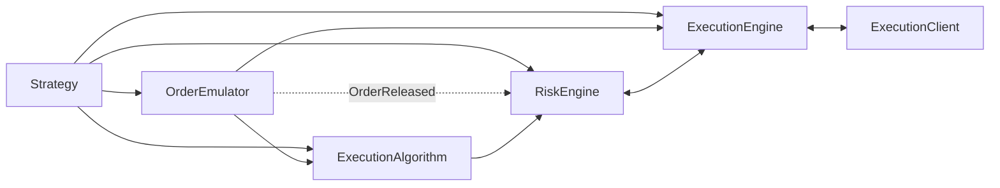

# Execution

NautilusTrader coordinates order submission, risk checks, venue execution, reconciliation, and
position updates across multiple strategies and venues. This page explains the components and
message flows that support execution.

The main execution-related components include:

- `Strategy`
- `ExecutionAlgorithm`
- `OrderEmulator`
- `RiskEngine`
- `ExecutionEngine`
- `ExecutionClient`

## Execution flow

A `Strategy` builds on data actor capabilities and adds methods for managing orders and execution:

- `submit_order(...)`
- `submit_order_list(...)`
- `modify_order(...)`
- `cancel_order(...)`
- `cancel_orders(...)`
- `cancel_all_orders(...)`
- `close_position(...)`
- `close_all_positions(...)`
- `query_account(...)`
- `query_order(...)`

These methods send point-to-point execution commands over the message bus. Order creation also
publishes events such as `OrderInitialized`.

Commands follow different routes:

- `submit_order(...)` routes to `OrderEmulator` for emulated orders, to an `ExecutionAlgorithm` when
  `exec_algorithm_id` is set, and to the `RiskEngine` otherwise.
- `submit_order_list(...)` follows the same branching behavior based on emulation and
  `exec_algorithm_id`.
- `modify_order(...)` routes to the `OrderEmulator` for emulated orders and to the `RiskEngine`
  otherwise.
- Cancel and query commands can route directly to the `OrderEmulator`, `ExecutionAlgorithm`, or
  `ExecutionEngine`, depending on the command and order state.

New orders typically enter one of these paths:

`Strategy` -> `OrderEmulator` or `ExecutionAlgorithm` or `RiskEngine`

The downstream flow is:

`OrderEmulator` -> `ExecutionAlgorithm` or `ExecutionEngine`

`ExecutionAlgorithm` -> `RiskEngine` -> `ExecutionEngine` -> `ExecutionClient`



Execution paths branch by emulation and algorithm routing before reaching the execution engine and
client.

## Fill corrections

Some venues can later reduce or invalidate a fill. Nautilus records this as an
[`OrderFillVoided`](events/order_fill_voided.md) event, never as an opposite-side fill. The event
identifies the original trade and carries the cumulative voided quantity and fee correction.

The execution engine rebuilds the affected order and positions and refreshes portfolio position and
PnL caches before publishing the correction to strategies and execution algorithms. Adapters that
support fill corrections request an authoritative account refresh after a void.

Adapters must publish the referenced fill before a reopened correction or a partial correction that
leaves the order executable. Without a local fill, a non-reopened correction makes the whole order
terminal, even when `voided_qty` is less than the order quantity. A later working status report does
not reopen `VOIDED`. See the complete
[`OrderFillVoided` contract](events/order_fill_voided.md#contract).

## Order denied reasons

A local denial (`OrderDenied`) carries a standardized `CATEGORY_CONDITION` reason code followed by
`key=value` context, for example `QUANTITY_EXCEEDS_MAXIMUM: effective_quantity=15, max_quantity=10`.
The table covers local denials emitted by execution algorithms, execution clients, the risk engine,
and the execution engine. These codes are the source of truth for locally denied orders; venue
rejections (`OrderRejected`) pass through the venue's own text unchanged.

<!-- Generated from the `OrderDeniedReason` enum (crates/model). Regenerate with: cargo test -p nautilus-model regenerate_order_denied_reasons_doc -- --ignored -->
<!-- BEGIN GENERATED: order-denied-reasons -->

| Code                                  | Description                                                                     |
| ------------------------------------- | ------------------------------------------------------------------------------- |
| `CLIENT_VENUE_MISMATCH`               | The execution client does not handle the order venue.                           |
| `CUM_MARGIN_EXCEEDS_FREE_BALANCE`     | The cumulative initial margin exceeds the account free balance.                 |
| `CUM_NOTIONAL_EXCEEDS_FREE_BALANCE`   | The cumulative order notional exceeds the account free balance.                 |
| `EXPIRE_TIME_IN_PAST`                 | The order's expire time is in the past.                                         |
| `INSTRUMENT_NOT_FOUND`                | The instrument was not found in the cache.                                      |
| `INVALID_CLIENT_ORDER_ID`             | The client order ID is invalid for the venue.                                   |
| `INVALID_MAX_NOTIONAL_PER_ORDER`      | The configured maximum notional per order is invalid.                           |
| `INVALID_ORDER_SIDE`                  | The order side is invalid for this operation.                                   |
| `INVALID_POSITION_ID`                 | The supplied position ID is invalid for the order submission.                   |
| `MARGIN_EXCEEDS_FREE_BALANCE`         | The order initial margin exceeds the account free balance.                      |
| `MISSING_EXPIRE_TIME`                 | A GTD order is missing its expire time.                                         |
| `MISSING_TRAILING_OFFSET`             | The order is missing a required trailing offset.                                |
| `MISSING_TRAILING_OFFSET_TYPE`        | The order is missing a required trailing offset type.                           |
| `MISSING_TRIGGER_TYPE`                | The order is missing a required trigger type.                                   |
| `NOTIONAL_BELOW_MINIMUM`              | The order notional is below the instrument minimum.                             |
| `NOTIONAL_EXCEEDS_FREE_BALANCE`       | The order notional exceeds the account free balance.                            |
| `NOTIONAL_EXCEEDS_MAXIMUM`            | The order notional exceeds the instrument maximum.                              |
| `NOTIONAL_EXCEEDS_MAX_PER_ORDER`      | The order notional exceeds the configured maximum per order.                    |
| `NO_EXECUTION_CLIENT`                 | No execution client was found for the routed command.                           |
| `ORDER_LIST_DENIED`                   | The order was denied because its order list failed risk checks.                 |
| `ORDER_LIST_INCOMPLETE`               | The order list is missing orders in the cache.                                  |
| `POSITION_NOT_FOUND`                  | The position for a reduce‑only order was not found.                             |
| `QUANTITY_BELOW_MINIMUM`              | The effective order quantity is below the instrument minimum.                   |
| `QUANTITY_CONVERSION_FAILED`          | The order quantity could not be converted for risk checks.                      |
| `QUANTITY_EXCEEDS_MAXIMUM`            | The effective order quantity exceeds the instrument maximum.                    |
| `RATE_LIMIT_EXCEEDED`                 | The order submission rate limit was exceeded.                                   |
| `REDUCE_ONLY_WOULD_INCREASE_POSITION` | A reduce‑only order would increase the position.                                |
| `STREAM_RECONCILING`                  | A post‑reconnect stream reconciliation is in progress; retry once it completes. |
| `SUBMIT_FAILED`                       | Submitting the order to the execution client failed.                            |
| `TRADING_HALTED`                      | Trading is halted; new orders are denied.                                       |
| `TRADING_STATE_REDUCING`              | Trading is reducing; the order would increase exposure.                         |
| `TRAILING_STOP_CALC_FAILED`           | The trailing stop trigger price could not be calculated.                        |
| `UNSUPPORTED_ORDER_LIST`              | The venue does not support the requested order list.                            |
| `UNSUPPORTED_ORDER_TYPE`              | The order type is not supported.                                                |
| `UNSUPPORTED_TIME_IN_FORCE`           | The order's time in force is not supported.                                     |
| `UNSUPPORTED_TP_SL`                   | The venue does not support the requested take‑profit/stop‑loss parameters.      |
| `UNSUPPORTED_TRAILING_OFFSET_TYPE`    | The order's trailing offset type is not supported.                              |
| `VALIDATION_FAILED`                   | The order failed validation before submission.                                  |

<!-- END GENERATED: order-denied-reasons -->

## Order management system (OMS)

An order management system (OMS) type determines how orders map to positions for an instrument.
Strategies and venues, whether simulated or live, each use an OMS type defined by the `OmsType`
enum.

The `OmsType` enum has three variants:

- `UNSPECIFIED`: The strategy uses the venue's OMS type.
- `NETTING`: Positions combine into one position per instrument and strategy.
- `HEDGING`: Multiple positions per instrument and strategy can remain open.

When the strategy and venue OMS types differ, the `ExecutionEngine` assigns or overrides
`position_id` values on `OrderFilled` events. A virtual position exists in NautilusTrader but not
as a separate venue position.

| Strategy OMS | Venue OMS | Result                                                              |
| ------------ | --------- | ------------------------------------------------------------------- |
| `NETTING`    | `NETTING` | One position per instrument and strategy.                           |
| `HEDGING`    | `HEDGING` | Multiple positions per instrument and strategy.                     |
| `NETTING`    | `HEDGING` | One virtual position across the venue positions.                    |
| `HEDGING`    | `NETTING` | Multiple virtual positions against the venue's single net position. |

### OMS configuration

When a strategy omits `oms_type` or uses `UNSPECIFIED`, the `ExecutionEngine` follows the venue's
OMS type without overriding venue `position_id` values. Configure a backtest venue with the OMS
type used by the venue being modeled.

Venue position modes may require adapter-specific configuration. For example, see
[Binance Futures hedge mode](../integrations/binance.md#futures-hedge-mode).

### Custom position IDs and NETTING

Custom position IDs are only valid under `HEDGING` OMS. `NETTING` has one position per instrument
and strategy, with a deterministic ID of the form `{instrument_id}-{strategy_id}`.

The `ExecutionEngine` enforces this at submit time. If the effective OMS resolves to
`NETTING` and `submit_order` (or `submit_order_list`) is called with a `position_id` that
does not match `{instrument_id}-{strategy_id}`, the order is denied with an
`OrderDenied` event explaining the mismatch.

This rule still permits the common closing idiom: `Strategy.close_position(position)`
forwards `position.id`, which under `NETTING` is exactly the deterministic ID, so it is
accepted. To label or partition positions with arbitrary IDs, configure the strategy
with `oms_type=HEDGING`.

For `submit_order_list`, the engine additionally denies any mixed-instrument list when a
`position_id` is supplied, regardless of OMS. A position belongs to a single instrument,
so the combination is rejected with an explicit `OrderDenied` reason. See
[Order lists](orders/advanced.md#order-lists) for the broader set of mixed-instrument caveats.

### Position replay across NETTING cycles

Under `NETTING` the engine reuses one position ID across close and reopen cycles, so a position's
replay log can accumulate every fill ever applied to that ID. The
`ExecutionEngineConfig.carry_replay_events_on_reopen` option controls whether that log survives a
reopen:

| `carry_replay_events_on_reopen` | Behavior                                                       |
| ------------------------------- | -------------------------------------------------------------- |
| `False` (default)               | Keeps only current‑cycle state, bounding the per‑fill cost.    |
| `True`                          | Keeps earlier fills correctable while position state can grow. |

Live trading pins the option `True`: `LiveExecEngineConfig` always carries the replay log, so a venue
[`OrderFillVoided`](events/order_fill_voided.md) referencing an earlier cycle still resolves. The
simulated venue never emits fill voids, so backtests take the bounded default. Enable it explicitly
for a custom or external execution client that can correct a fill from a prior cycle; without the
carried log the engine finds no matching position fragment and rejects the correction.

Realized-PnL snapshots follow the correction. A fill void that reaches an earlier cycle rebuilds the
position across the cycle boundary, moving the boundaries its archived snapshots describe, so the
engine settles those snapshots into the corrected history's own closed cycles and realized PnL counts
each cycle once. A void confined to the current cycle leaves the archive intact. See
[Position snapshotting](positions.md#position-snapshotting).

## Risk engine

The `RiskEngine` is a component of every Nautilus system, including backtest, sandbox, and live
environments. It sits on the submit and modify path, and it also receives order events such as
`OrderReleased` from the `OrderEmulator`. Cancel and query commands route directly to other
execution components and do not pass through the `RiskEngine`.

Unless bypassed in `RiskEngineConfig`, the engine validates:

- Price and trigger-price precision for the instrument.
- Positive prices, unless the instrument allows negative prices (options, futures spreads,
  option spreads, and spot commodities).
- Quantity precision and base-quantity minimum and maximum bounds.
- GTD orders have not already expired.
- `reduce_only` orders do not increase the referenced position.
- Engine-level `max_notional_per_order` limits and instrument `max_notional` limits.
- Cash-account balance impact for non-margin accounts.
- Submit and modify rate limits.
- Trading-state restrictions (`ACTIVE`, `HALTED`, `REDUCING`).

If a submit-time risk check fails, the system generates an `OrderDenied` event with a
standardized [reason code](#order-denied-reasons). If a modify-time risk check fails, it
generates an `OrderModifyRejected` event.

### Trading state

The `TradingState` enum has three variants:

- `ACTIVE`: Submit and modify commands operate normally.
- `HALTED`: New submit and modify commands are denied. Cancels still pass through.
- `REDUCING`: Cancels are allowed, and only submit or modify commands that do not increase
  exposure are accepted.

See the
[`RiskEngineConfig` API reference](/docs/python-api-latest/config.html#nautilus_trader.risk.config.RiskEngineConfig)
for configuration details.

## Execution algorithms

An `ExecutionAlgorithm` receives primary orders selected by `exec_algorithm_id` and can split them
into smaller spawned orders. NautilusTrader supports custom algorithms and includes a native Rust
TWAP implementation.

### TWAP (Time-Weighted Average Price)

TWAP spreads a primary order across regular intervals to reduce the market impact of submitting
the full quantity at once. To register the native algorithm with an initialized `BacktestEngine`:

```python
from nautilus_trader.model import ExecAlgorithmId
from nautilus_trader.trading import ExecutionAlgorithmConfig

engine.add_native_exec_algorithm(
    "TwapAlgorithm",
    ExecutionAlgorithmConfig(exec_algorithm_id=ExecAlgorithmId("TWAP")),
)
```

Orders routed to TWAP require these string-valued `exec_algorithm_params`:

| Key             | Meaning                                                 |
| --------------- | ------------------------------------------------------- |
| `horizon_secs`  | Horizon used with the interval to determine the slices. |
| `interval_secs` | Time between slices.                                    |

Both values must parse as positive numbers, and `horizon_secs` must be at least
`interval_secs`. The algorithm submits the first slice immediately and the remaining slices at
the configured interval. TWAP denies the primary order before submission when the order type,
instrument, or schedule is unsupported or invalid.

### Writing execution algorithms

To define a Python execution algorithm, subclass `ExecutionAlgorithm` and implement
`on_order(...)`:

```python
from nautilus_trader.model import ExecAlgorithmId
from nautilus_trader.trading import ExecutionAlgorithm
from nautilus_trader.trading import ExecutionAlgorithmConfig


class MyExecutionAlgorithm(ExecutionAlgorithm):
    def __init__(self) -> None:
        super().__init__(
            ExecutionAlgorithmConfig(exec_algorithm_id=ExecAlgorithmId("MY-ALGO")),
        )

    def on_order(self, order) -> None: ...
```

Python execution algorithms provide cache and portfolio access, a clock for timers, signals, and
methods for spawning orders.

After registration, the message bus routes an order to the algorithm whose `ExecAlgorithmId`
matches the order's `exec_algorithm_id`. The optional `exec_algorithm_params` field is a
`Mapping[str, str]`. Override `on_order_list(...)` to handle a list as a unit; its default
implementation passes each order to `on_order(...)`.

:::warning
Validate required `exec_algorithm_params` keys and parse their string values before executing an
order. Call `deny_order(...)` with a standardized [reason code](#order-denied-reasons), such as
`VALIDATION_FAILED: horizon_secs not found in exec_algorithm_params`, when the order cannot be executed.
:::

An order received by an execution algorithm is the primary order. Use these methods to create
spawned orders:

- `spawn_market(...)`: Creates a `MARKET` order.
- `spawn_market_to_limit(...)`: Creates a `MARKET_TO_LIMIT` order.
- `spawn_limit(...)`: Creates a `LIMIT` order.

Each method takes the primary order as its first argument. By default, the method reduces the
primary order quantity by the spawned `quantity`. Pass `reduce_primary=False` to keep the primary
quantity unchanged.

:::warning
When `reduce_primary=True`, the spawned quantity must not exceed the primary order's `leaves_qty`
(remaining unfilled quantity).
:::

If a spawned order is denied or rejected before acceptance, the deducted quantity is automatically
restored to the primary order. Once accepted by the venue, the reduction is considered committed.

An execution algorithm can keep spawning orders, submit the remaining primary order, or do both.
The built-in TWAP algorithm submits the remaining primary order on the final interval.

### Spawned orders

Every spawned order sets `exec_spawn_id` to the primary order's `client_order_id`. Its own
`client_order_id` follows this pattern:

```text
{exec_spawn_id}-E{spawn_sequence}
```

For example, the first order spawned from `O-20230404-001-000` has the ID
`O-20230404-001-000-E1`.

:::note
The primary and spawned terminology distinguishes execution slicing from parent and child
contingent-order relationships.
:::

### Managing execution algorithm orders

The `Cache` provides two primary queries:

- `orders_for_exec_algorithm(...)`: Returns orders for an algorithm, with optional venue,
  instrument, strategy, account, and side filters.
- `orders_for_exec_spawn(...)`: Returns the primary order and its spawned orders for a primary
  `ClientOrderId`.

## Own order books

When `manage_own_order_books` is enabled, the `ExecutionEngine` maintains a market-by-order
(MBO/L3) view of your working orders for each instrument. Strategies can subtract these orders from
the public book to estimate net available liquidity. See [Own order book](order_book.md#own-order-book)
for lifecycle, queries, filtering, and auditing.

### Safe cancellation queries

When querying an own order book for cancellation candidates, exclude `PENDING_CANCEL` from the
`status` filter.

:::warning
Including `PENDING_CANCEL` can issue duplicate cancel requests and repeatedly select orders that
already await confirmation.
:::

## Overfills

An overfill occurs when an order's cumulative filled quantity exceeds its original quantity. For
example, fills totaling 110 units overfill a 100-unit order by 10 units.

### How overfills occur

The engine observes an overfill when reported quantities exceed the order quantity. This can
represent a genuine venue result, duplicate delivery under different trade IDs, or inconsistent
venue reporting. Quantity alone does not identify the cause.

Live fills can arrive through two channels:

- Real-time fill events arriving via WebSocket.
- Periodic reconciliation polling the venue for fill history and position status.

Stable `trade_id` values let the engine deduplicate the same fill across both channels. If the
logical fill arrives with different IDs, the engine treats the reports as distinct. See
[Continuous reconciliation](../how_to/configure_live_trading.md#continuous-reconciliation) for
configuration details.

### System behavior

The `ExecutionEngine` checks for potential overfills before applying each fill event by comparing
the order's current `filled_qty` plus the incoming `last_qty` against the original `quantity`.

The `allow_overfills` configuration option (default: `False`) controls how overfills are handled:

| `allow_overfills` | Behavior                                                                   |
| ----------------- | -------------------------------------------------------------------------- |
| `False`           | Logs and rejects the fill, preserving the order's current state.           |
| `True`            | Logs a warning, applies the fill, and tracks the excess in `overfill_qty`. |

When overfills are allowed, the order's `overfill_qty` field tracks the excess quantity.
The order transitions to `FILLED` status and `leaves_qty` is clamped to zero.

### Duplicate fill detection

The `Order` model enforces one applied fill per `trade_id`. `Order.apply()` returns an error when
the same ID already exists on the order.

#### Core engine path

Before applying a fill, the `ExecutionEngine` calls `Order.is_duplicate_fill()`, which compares:

- `trade_id`
- `order_side`
- `last_px`
- `last_qty`

An exact match is skipped with a warning. If the `trade_id` matches but another field differs, the
four-field check does not classify the fill as an exact duplicate. `Order.apply()` then rejects the
reused ID, and the engine logs and drops the fill.

#### Reconciliation path

The reconciliation path checks `trade_id` before generating an `OrderFilled` event. It drops a
report when that ID already exists on the order, regardless of its price or quantity.

Synthetic and inferred reconciliation fills use deterministic IDs. Replaying the same inputs after
a restart therefore produces the same `trade_id` and is deduplicated.

### Configuration

For live trading, enable overfill tolerance in the `LiveExecEngineConfig`:

```python
from nautilus_trader.live import LiveExecEngineConfig

config = LiveExecEngineConfig(
    allow_overfills=True,
)
```

:::warning
Choose this setting from the venue's execution contract. The default `False` protects local state
but can leave a discrepancy after a legitimate venue overfill. `True` applies the excess quantity
and is not a substitute for duplicate-fill detection. Use
[execution reconciliation](live.md#execution-reconciliation) to detect discrepancies.
:::

## Reconciliation reports

The execution engine consumes four reconciliation report variants from live adapters. Each variant
has a different role when its matching order is absent from the cache.

| Variant                | Purpose                  | Missing‑order action                                 |
| ---------------------- | ------------------------ | ---------------------------------------------------- |
| `OrderStatusReport`    | Order state update.      | Creates an order and infers any reported fill.       |
| `FillReport`           | Standalone fill.         | Creates a market order, then applies fill metadata.  |
| `OrderWithFills`       | Order state plus fills.  | Creates an order, applies fills, and infers residue. |
| `PositionStatusReport` | Venue position snapshot. | Logs the report; positions remain fill‑derived.      |

### When to use each variant

Adapters choose the variant that matches the venue event:

- Use `OrderStatusReport` for order lifecycle updates when fill details arrive on a separate
  stream.
- Use `FillReport` for a venue-initiated closure that has a fill but no user-level order.
  Hyperliquid liquidations follow this pattern.
- Use `OrderWithFills` when one venue event contains both an order status and its fills. Binance
  Futures uses this for exchange-generated ADL, liquidation, and settlement orders.

### External order creation

When a report references an order that is absent from the cache, the engine creates an *external
order*. This covers venue-initiated ADL, liquidation, or settlement, orders placed by another
process, and orders not yet observed locally. The engine assigns ownership to:

- The strategy that claimed the instrument through `register_external_order_claims`.
- The `EXTERNAL` strategy as a default fallback.

The external order uses the report's `client_order_id` when present and otherwise derives one from
the `venue_order_id`. The engine adds the order to the cache, registers its venue order ID, and
emits the applicable `OrderAccepted`, `OrderFilled`, `OrderCanceled`, or `OrderExpired` events.
Positions then update through the normal event pipeline.

## Related guides

- [Events](events/): Order and position event types and dispatch.
- [Order book](order_book.md): Public and own order book behavior.
- [Orders](orders/): Order types and management.
- [Positions](positions.md): Position tracking from executions.
- [Strategies](strategies.md): Order submission from strategies.
