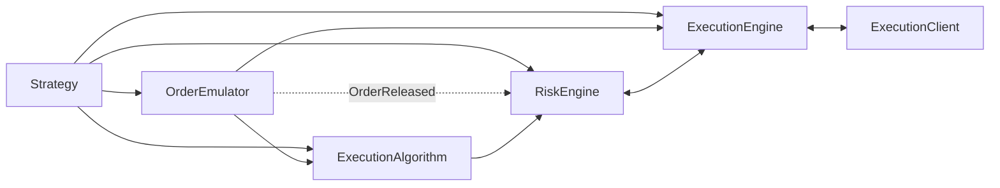

# Execution

NautilusTrader coordinates order submission, risk checks, venue execution, reconciliation, and
position updates across multiple strategies and venues. This page explains the components and
message flows that support execution.

The main execution-related components include:

- `Strategy`
- `ExecutionAlgorithm`
- `OrderEmulator`
- `RiskEngine`
- `ExecutionEngine`
- `ExecutionClient`

## Execution flow

A `Strategy` builds on data actor capabilities and adds methods for managing orders and execution:

- `submit_order(...)`
- `submit_order_list(...)`
- `modify_order(...)`
- `cancel_order(...)`
- `cancel_orders(...)`
- `cancel_all_orders(...)`
- `close_position(...)`
- `close_all_positions(...)`
- `query_account(...)`
- `query_order(...)`

These methods send point-to-point execution commands over the message bus. Order creation also
publishes events such as `OrderInitialized`.

Commands follow different routes:

- `submit_order(...)` routes to `OrderEmulator` for emulated orders, to an `ExecutionAlgorithm` when
  `exec_algorithm_id` is set, and to the `RiskEngine` otherwise.
- `submit_order_list(...)` follows the same branching behavior based on emulation and
  `exec_algorithm_id`.
- `modify_order(...)` routes to the `OrderEmulator` for emulated orders, to an `ExecutionAlgorithm`
  when the order has an `exec_algorithm_id` and is still active within the local system, and to the
  `RiskEngine` otherwise.
- Cancel and query commands can route directly to the `OrderEmulator`, `ExecutionAlgorithm`, or
  `ExecutionEngine`, depending on the command and order state.

New orders typically enter one of these paths:

`Strategy` -> `OrderEmulator` or `ExecutionAlgorithm` or `RiskEngine`

The downstream flow is:

`OrderEmulator` -> `ExecutionAlgorithm` or `ExecutionEngine`

`ExecutionAlgorithm` -> `RiskEngine` -> `ExecutionEngine` -> `ExecutionClient`



Execution paths branch by emulation and algorithm routing before reaching the execution engine and
client.

## Order management system (OMS)

An order management system (OMS) type determines how orders map to positions for an instrument.
Strategies and venues, whether simulated or live, each use an OMS type defined by the `OmsType`
enum.

The `OmsType` enum has three variants:

- `UNSPECIFIED`: The strategy uses the venue's OMS type.
- `NETTING`: Positions combine into one position per instrument and strategy.
- `HEDGING`: Multiple positions per instrument and strategy can remain open.

When the strategy and venue OMS types differ, the `ExecutionEngine` assigns or overrides
`position_id` values on `OrderFilled` events. A virtual position exists in NautilusTrader but not
as a separate venue position.

| Strategy OMS | Venue OMS | Result                                                              |
| ------------ | --------- | ------------------------------------------------------------------- |
| `NETTING`    | `NETTING` | One position per instrument and strategy.                           |
| `HEDGING`    | `HEDGING` | Multiple positions per instrument and strategy.                     |
| `NETTING`    | `HEDGING` | One virtual position across the venue positions.                    |
| `HEDGING`    | `NETTING` | Multiple virtual positions against the venue's single net position. |

If a fill resolves to a cached position for a different instrument, the `ExecutionEngine` logs an
error and drops the fill. The order remains non-terminal so a subsequent valid fill can be applied.

### OMS configuration

When a strategy omits `oms_type` or uses `UNSPECIFIED`, the `ExecutionEngine` follows the venue's
OMS type without overriding venue `position_id` values. Configure a backtest venue with the OMS
type used by the venue being modeled.

Venue position modes may require adapter-specific configuration. For example, see
[Binance Futures hedge mode](../integrations/binance.md#futures-hedge-mode).

### Custom position IDs and NETTING

Custom position IDs are only valid under `HEDGING` OMS. `NETTING` has one position per instrument
and strategy, with a deterministic ID of the form `{instrument_id}-{strategy_id}`.

The `ExecutionEngine` enforces this at submit time. If the effective OMS resolves to
`NETTING` and `submit_order` (or `submit_order_list`) is called with a `position_id` that
does not match `{instrument_id}-{strategy_id}`, the order is denied with an
`OrderDenied` event explaining the mismatch.

This rule still permits the common closing idiom: `Strategy.close_position(position)`
forwards `position.id`, which under `NETTING` is exactly the deterministic ID, so it is
accepted. To label or partition positions with arbitrary IDs, configure the strategy
with `oms_type=HEDGING`.

For `submit_order_list`, the engine additionally denies any mixed-instrument list when a
`position_id` is supplied, regardless of OMS. A position belongs to a single instrument,
so the combination is rejected with an explicit `OrderDenied` reason. See
[Order lists](orders/advanced.md#order-lists) for the broader set of mixed-instrument caveats.

### Position replay across NETTING cycles

Under `NETTING` the engine reuses one position ID across close and reopen cycles, so a position's
replay log can accumulate every fill ever applied to that ID. The
`ExecutionEngineConfig.carry_replay_events_on_reopen` option controls whether that log survives a
reopen:

| `carry_replay_events_on_reopen` | Behavior                                                       |
| ------------------------------- | -------------------------------------------------------------- |
| `False` (default)               | Keeps only current-cycle state, bounding the per-fill cost.    |
| `True`                          | Keeps earlier fills correctable while position state can grow. |

Live trading pins the option `True`: `LiveExecutionEngineConfig` always carries the replay log, so a venue
[`OrderFillVoided`](events/order_fill_voided.md) referencing an earlier cycle still resolves. The
simulated venue never emits fill voids, so backtests take the bounded default. Enable it explicitly
for a custom or external execution client that can correct a fill from a prior cycle; without the
carried log the engine finds no matching position fragment and rejects the correction.

Realized-PnL snapshots follow the correction. A fill void that reaches an earlier cycle rebuilds the
position across the cycle boundary, moving the boundaries its archived snapshots describe, so the
engine settles those snapshots into the corrected history's own closed cycles and realized PnL counts
each cycle once. A void confined to the current cycle leaves the archive intact. See
[Position snapshotting](positions.md#position-snapshotting).

## Risk engine

The `RiskEngine` is a component of every Nautilus system, including backtest, sandbox, and live
environments. It sits on the submit and modify path, and it also receives order events such as
`OrderReleased` from the `OrderEmulator`. Cancel and query commands route directly to other
execution components and do not pass through the `RiskEngine`.

Unless bypassed in `RiskEngineConfig`, the engine validates:

- Price and trigger-price precision for the instrument.
- Positive prices, unless the instrument allows negative prices (options, futures spreads,
  option spreads, and spot commodities).
- Quantity precision and base-quantity minimum and maximum bounds.
- GTD orders have not already expired.
- `reduce_only` orders do not increase the referenced position.
- Engine-level `max_notional_per_order` limits and instrument `max_notional` limits.
- Cash-account balance impact for non-margin accounts.
- Submit and modify rate limits.
- Trading-state restrictions (`ACTIVE`, `HALTED`, `REDUCING`).

If a submit-time risk check fails, the system generates an `OrderDenied` event with a
standardized [reason code](#order-denied-reasons). If a modify-time risk check fails, it
generates an `OrderModifyRejected` event.

### Whole-position conditional exits

Some execution clients support conditional exits whose venue determines the closing quantity from
the open position when the trigger fires. Nautilus orders still carry a placeholder quantity for
local validation. The `full_position_exit_venues` setting on `RiskEngineConfig` and
`LiveRiskEngineConfig` identifies venues whose execution clients enforce these semantics. It
defaults to empty.

An order qualifies for the placeholder exemption only when all of these conditions hold:

- The order is submitted individually, not in an order list.
- Its venue is listed in `full_position_exit_venues`.
- It uses a supported futures or perpetual instrument.
- It is a `StopMarket` or `MarketIfTouched` order with a trigger price and
  `close_position=true`.
- It has a positive placeholder quantity and sets `reduce_only=true`.
- The command, order, and linked cached position use the same instrument and position ID.
- The linked position is open, the order side closes it, and the placeholder quantity does not
  exceed the position quantity.

For a qualifying exit, the risk engine treats checks as follows:

| Risk check                                                            | Treatment                                   |
| --------------------------------------------------------------------- | ------------------------------------------- |
| Quantity precision and positivity                                     | Enforced.                                   |
| Price and trigger-price precision and positivity                      | Enforced.                                   |
| GTD expiration, trading-state restrictions, and submission rate limit | Enforced.                                   |
| Position exposure, margin, and balance                                | Treated as position-reducing.               |
| Instrument minimum and maximum quantity                               | Skipped for the placeholder quantity.       |
| Instrument minimum and maximum notional                               | Skipped for the placeholder notional.       |
| Configured `max_notional_per_order`                                   | Skipped for the placeholder notional.       |
| Non-qualifying orders                                                 | All ordinary risk checks continue to apply. |

Only allowlist a venue when its downstream execution client enforces whole-position closing. See
[Binance Futures close-position orders](../integrations/binance.md#close-position) for a supported
configuration.

:::warning
The simulated exchange does not interpret `close_position` or replace the placeholder with the
open position quantity. Leave simulated backtest venues out of `full_position_exit_venues`; model
a backtest exit with an explicit quantity and `reduce_only` instead.
:::

### Trading state

The states become progressively more restrictive:

| State      | Numeric value | Permitted commands                                                           |
| ---------- | ------------: | ---------------------------------------------------------------------------- |
| `ACTIVE`   |             1 | Submit, modify, cancel, and query commands operate normally.                 |
| `REDUCING` |             2 | Eligible individual reduce-only submissions, cancels, and queries.           |
| `HALTED`   |             3 | Cancels and queries only. New submissions and modifications are not allowed. |

In `REDUCING`, an individual `SubmitOrder` is eligible only when the order sets
`reduce_only=true`, the command and order identify the same instrument, and the supplied position
ID matches the order's cached open position. The order side must oppose the position, and the
submitted quantity must not exceed the cached position quantity. Order lists and modifications are
denied.

The risk engine applies these rules before forwarding commands to execution. When
`RiskEngineConfig.bypass` is enabled, trading state is not enforced. Execution clients still follow
the [reduce-only send-or-reject contract](adapters.md#reduce-only-execution-contract).

This enum reordering is a breaking change for numeric consumers: `REDUCING` changes from `3` to
`2`, and `HALTED` changes from `2` to `3`. Name-based serialization remains unchanged. Update any
stored integers, FFI integrations, or logic that casts `TradingState` to an integer.

This change also removes the caller-facing `emergency_exit` command parameter, the
`ExecutionClient::enforces_reduce_only` method, and the `REDUCE_ONLY_NOT_ENFORCED` and
`REDUCE_ONLY_ENFORCEMENT_NOT_ESTABLISHED` denial codes. Submit eligible orders with
`reduce_only=true` while the state is `REDUCING`; execution clients must follow the documented
send-or-reject contract.

See the
[`RiskEngineConfig` API reference](/docs/python-api-latest/config.html#nautilus_trader.risk.RiskEngineConfig)
for configuration details.

## Execution algorithms

An `ExecutionAlgorithm` receives primary orders selected by `exec_algorithm_id` and can split them
into smaller spawned orders. NautilusTrader supports custom algorithms and includes a native Rust
TWAP implementation.

### TWAP (Time-Weighted Average Price)

TWAP spreads a primary order across regular intervals to reduce the market impact of submitting
the full quantity at once. To register the native algorithm with an initialized `BacktestEngine`:

```python
from nautilus_trader.model import ExecAlgorithmId
from nautilus_trader.config import ExecutionAlgorithmConfig

engine.add_native_exec_algorithm(
    "TwapAlgorithm",
    ExecutionAlgorithmConfig(exec_algorithm_id=ExecAlgorithmId("TWAP")),
)
```

Orders routed to TWAP require these string-valued `exec_algorithm_params`:

| Key             | Meaning                                                 |
| --------------- | ------------------------------------------------------- |
| `horizon_secs`  | Horizon used with the interval to determine the slices. |
| `interval_secs` | Time between slices.                                    |

Both values must parse as positive numbers, and `horizon_secs` must be at least
`interval_secs`. The algorithm submits the first slice immediately and the remaining slices at
the configured interval. TWAP denies the primary order before submission when the order type,
instrument, or schedule is unsupported or invalid.

### Writing execution algorithms

To define a Python execution algorithm, subclass `ExecutionAlgorithm` and implement
`on_order(...)`:

```python
from nautilus_trader.model import ExecAlgorithmId
from nautilus_trader.trading import ExecutionAlgorithm
from nautilus_trader.config import ExecutionAlgorithmConfig


class MyExecutionAlgorithm(ExecutionAlgorithm):
    def __init__(self) -> None:
        super().__init__(
            ExecutionAlgorithmConfig(exec_algorithm_id=ExecAlgorithmId("MY-ALGO")),
        )

    def on_order(self, order) -> None: ...
```

Python execution algorithms provide cache and portfolio access, a clock for timers, signals, and
methods for spawning orders.

After registration, the message bus routes an order to the algorithm whose `ExecAlgorithmId`
matches the order's `exec_algorithm_id`. The optional `exec_algorithm_params` field is a
`Mapping[str, str]`. Override `on_order_list(...)` to handle a list as a unit; its default
implementation passes each order to `on_order(...)`.

:::warning
Validate required `exec_algorithm_params` keys and parse their string values before executing an
order. Call `deny_order(...)` with a standardized [reason code](#order-denied-reasons), such as
`VALIDATION_FAILED: horizon_secs not found in exec_algorithm_params`, when the order cannot be executed.
:::

An order received by an execution algorithm is the primary order. Use these methods to create
spawned orders:

- `spawn_market(...)`: Creates a `MARKET` order.
- `spawn_market_to_limit(...)`: Creates a `MARKET_TO_LIMIT` order.
- `spawn_limit(...)`: Creates a `LIMIT` order.

Each method takes the primary order as its first argument. By default, the method reduces the
primary order quantity by the spawned `quantity`. Pass `reduce_primary=False` to keep the primary
quantity unchanged.

:::warning
When `reduce_primary=True`, the spawned quantity must not exceed the primary order's `leaves_qty`
(remaining unfilled quantity).
:::

If a spawned order is denied or rejected before acceptance, the deducted quantity is automatically
restored to the primary order. Once accepted by the venue, the reduction is considered committed.

An execution algorithm can keep spawning orders, submit the remaining primary order, or do both.
The built-in TWAP algorithm submits the remaining primary order on the final interval.

### Spawned orders

Every spawned order sets `exec_spawn_id` to the primary order's `client_order_id`. Its own
`client_order_id` follows this pattern:

```text
{exec_spawn_id}-E{spawn_sequence}
```

For example, the first order spawned from `O-20230404-001-000` has the ID
`O-20230404-001-000-E1`.

:::note
The primary and spawned terminology distinguishes execution slicing from parent and child
contingent-order relationships.
:::

### Managing execution algorithm orders

The `Cache` provides two primary queries:

- `orders_for_exec_algorithm(...)`: Returns orders for an algorithm, with optional venue,
  instrument, strategy, account, and side filters.
- `orders_for_exec_spawn(...)`: Returns the primary order and its spawned orders for a primary
  `ClientOrderId`.

## Cancel-all routing

`Strategy.cancel_all_orders(...)` supports strategy-scoped and broad cancellation:

| `strategy_only` | Strategy output                                         | Scope                                                          | Downstream routing                                  |
| --------------- | ------------------------------------------------------- | -------------------------------------------------------------- | --------------------------------------------------- |
| `True`          | One `CancelOrder` per matching order.                   | Matching orders associated with the calling strategy.          | Each order follows its normal cancel route.         |
| `False`         | One root `CancelAllOrders`, even without local matches. | Matching orders for one resolved execution client and account. | The execution engine creates the required children. |

Broad mode delegates before the strategy inspects its cache. The command therefore reaches the
resolved execution client even when NautilusTrader has no matching local order. This allows a venue
bulk-cancel endpoint to remove an order that exists at the venue but is missing from the local cache.
When the adapter provides such an endpoint, the single command can also reduce cancel request volume.

For a local execution client, the `ExecutionEngine` resolves the root command to exactly one client
in this order:

1. The explicit `client_id`, when it identifies a registered local client.
1. The client registered for the instrument's venue.
1. The default execution client.

The engine then creates fresh child commands for the selected client and its account:

- One `CancelAllOrders` for the execution client, covering matching venue orders.
- One `CancelAllOrders` for the `OrderEmulator`, covering matching emulated orders.
- One `CancelOrder` per eligible active-local execution-algorithm order.

```mermaid
flowchart LR
    call[Strategy.cancel_all_orders]
    scope{strategy_only?}
    exact[Exact CancelOrder per matching strategy order]
    root[One root CancelAllOrders]
    external{External client?}
    pass[Pass through unchanged]
    resolve[Resolve one explicit, venue, or default client and account]
    venue[One venue CancelAllOrders]
    emulator[One emulator CancelAllOrders]
    algo[Exact CancelOrder per eligible algorithm order]

    call --> scope
    scope -->|True| exact
    scope -->|False| root
    root --> external
    external -->|Yes| pass
    external -->|No| resolve
    resolve --> venue
    resolve --> emulator
    resolve --> algo
```

Broad mode selects one client before fan-out; it never broadcasts across all execution clients.
Call `cancel_all_orders(...)` once per client to cancel across several clients.

Every child has a new command ID, copies the root parameters, correlates to the root operation, and
records the root command as its cause. Instrument and optional side filters apply to every local
route. The selected execution account also bounds matching-engine cancellation, including orders in
`SUBMITTED` and other cancelable in-flight states.

Client ownership applies to local emulated and execution-algorithm orders:

- Orders already assigned to another client remain untouched.
- When the root omits `client_id`, matching unassigned orders are claimed by the client selected by
  the engine before local cancellation.
- When the root supplies `client_id`, unassigned orders remain untouched because the engine cannot
  infer that they belong to the explicit client.
- An emulated order matches its traded instrument, even when another instrument supplies its trigger.

An explicitly configured external execution client receives the original root command unchanged.
The external client owns any fan-out needed behind that boundary.

## Command outcomes

Execution commands resolve according to the evidence available:

| Evidence                 | Meaning                                                         | Result                                                                                          |
| ------------------------ | --------------------------------------------------------------- | ----------------------------------------------------------------------------------------------- |
| Definitive local failure | Validation proves that the command was not sent.                | Denies a submit or rejects a modify or cancel when the failure is attributable to that command. |
| Definitive result        | The matching engine or venue explicitly confirms the outcome.   | Applies the corresponding accepted, updated, canceled, or rejected event.                       |
| Unknown live outcome     | The command may have reached the venue, but no result is known. | Keeps the command in flight without inventing a rejection.                                      |

The failure event depends on the command and when the failure becomes definitive:

| Command                             | Event                 | Meaning                                                                |
| ----------------------------------- | --------------------- | ---------------------------------------------------------------------- |
| Submit or submit order list         | `OrderDenied`         | Local checks prevent submission; no `OrderSubmitted` event is emitted. |
| Submit or submit order list         | `OrderRejected`       | The submit entered execution and was later proven unsuccessful.        |
| Modify                              | `OrderModifyRejected` | The requested modification was proven unsuccessful.                    |
| Cancel, cancel-all, or batch cancel | `OrderCancelRejected` | The requested cancellation was proven unsuccessful.                    |

For modify or cancel preparation, Nautilus emits the matching rejection only when the failure is
attributable to that command and proves it was not sent. Otherwise, it logs the failure without
inventing an outcome.

A successful batch response can still contain definitive per-order failures. A whole-request
failure without per-order evidence does not prove that every child command failed.

:::note[Unknown live outcomes]
Transport errors, timeouts, disconnects, task cancellation, exhausted adapter request retries,
missing acknowledgements, and parse failures after transmission usually leave the venue outcome
unknown. HTTP status codes and rate limits are definitive only when venue-specific semantics prove
that the command was not accepted.

The live engine initially keeps an unknown outcome in flight while stream updates, polling, queries,
or reconciliation determine the venue state. A later in-flight check can apply a terminal
reconciliation event after the configured retry limit.
:::

An **in-flight order** is awaiting resolution:

- `SUBMITTED`: initial submission awaiting acceptance or rejection.
- `PENDING_UPDATE`: modification awaiting confirmation.
- `PENDING_CANCEL`: cancellation awaiting confirmation.

See [Runtime checks](reconciliation.md#runtime-checks) for how live reconciliation monitors and
resolves these states.

## Order denied reasons

A local denial (`OrderDenied`) carries a standardized `CATEGORY_CONDITION` reason code and may
include a diagnostic suffix. Only the leading code is canonical. Messages use these forms:

- `CODE` when the denial needs no diagnostic suffix.
- `CODE: value` for one typed value or a free-text diagnostic.
- `CODE: key=value, key=value` when multiple typed values need disambiguation.
- `CODE: value; free text` when one typed value precedes a free-text diagnostic.

The table covers local denials emitted by execution algorithms and clients as well as the risk and
execution engines. These codes are the source of truth for locally denied orders; venue rejections
(`OrderRejected`) instead carry the venue-provided meaning. Adapters remove protocol wrappers and
bound untrusted venue text before emission without replacing it with a standardized local denial
code.

Price and quantity checks can also emit these code-led reasons on `OrderModifyRejected`:

- `PRICE_PRECISION_EXCEEDS_MAXIMUM`
- `PRICE_NOT_POSITIVE`
- `QUANTITY_PRECISION_EXCEEDS_MAXIMUM`
- `QUANTITY_EXCEEDS_MAXIMUM`
- `QUANTITY_BELOW_MINIMUM`

For price reasons, `field` is `PRICE` or `TRIGGER_PRICE` and names the rejected command field.
Other modification rejection reasons remain free-form; `OrderDeniedCode` does not classify them.

`OrderRejected.due_post_only` is `true` only when venue evidence proves that a post-only order would
cross or immediately match. Other venue rejections leave it `false`.

<!-- Generated from the `OrderDeniedReason` enum (crates/model). Regenerate with: cargo test -p nautilus-model regenerate_order_denied_reasons_doc -- --ignored -->
<!-- BEGIN GENERATED: order-denied-reasons -->

| Code                                             | Description                                                                           |
| ------------------------------------------------ | ------------------------------------------------------------------------------------- |
| `PRICE_PRECISION_EXCEEDS_MAXIMUM`                | The price precision exceeds the instrument maximum.                                   |
| `PRICE_NOT_POSITIVE`                             | The price is not positive.                                                            |
| `QUANTITY_PRECISION_EXCEEDS_MAXIMUM`             | The quantity precision exceeds the instrument maximum.                                |
| `QUANTITY_CONVERSION_FAILED`                     | The order quantity could not be converted for risk checks.                            |
| `QUANTITY_EXCEEDS_MAXIMUM`                       | The effective order quantity exceeds the instrument maximum.                          |
| `QUANTITY_BELOW_MINIMUM`                         | The effective order quantity is below the instrument minimum.                         |
| `INVALID_MAX_NOTIONAL_PER_ORDER`                 | The configured maximum notional per order is invalid.                                 |
| `MISSING_EXPIRE_TIME`                            | A GTD order is missing its expire time.                                               |
| `EXPIRE_TIME_IN_PAST`                            | The order's expire time is in the past.                                               |
| `MISSING_TRAILING_OFFSET_TYPE`                   | The order is missing a required trailing offset type.                                 |
| `UNSUPPORTED_TRAILING_OFFSET_TYPE`               | The order's trailing offset type is not supported.                                    |
| `MISSING_TRIGGER_TYPE`                           | The order is missing a required trigger type.                                         |
| `MISSING_TRAILING_OFFSET`                        | The order is missing a required trailing offset.                                      |
| `INSTRUMENT_NOT_FOUND`                           | The instrument was not found in the cache.                                            |
| `POSITION_NOT_FOUND`                             | The position for a reduce-only order was not found.                                   |
| `MARKET_PRICE_UNAVAILABLE`                       | No market price is available for the order risk check.                                |
| `TRAILING_STOP_CALCULATION_FAILED`               | The trailing stop trigger price could not be calculated.                              |
| `NOTIONAL_CALCULATION_FAILED`                    | The order notional value could not be calculated.                                     |
| `NOTIONAL_BELOW_MINIMUM`                         | The order notional is below the instrument minimum.                                   |
| `NOTIONAL_EXCEEDS_MAXIMUM`                       | The order notional exceeds the instrument maximum.                                    |
| `NOTIONAL_EXCEEDS_MAX_PER_ORDER`                 | The order notional exceeds the configured maximum per order.                          |
| `NOTIONAL_EXCEEDS_FREE_BALANCE`                  | The order notional exceeds the account free balance.                                  |
| `INITIAL_MARGIN_CALCULATION_FAILED`              | The order initial margin could not be calculated.                                     |
| `INITIAL_MARGIN_EXCEEDS_FREE_BALANCE`            | The order initial margin exceeds the account free balance.                            |
| `BETTING_BALANCE_LOCKED_CALCULATION_FAILED`      | The balance to lock for the betting order could not be calculated.                    |
| `CUMULATIVE_NOTIONAL_EXCEEDS_FREE_BALANCE`       | The cumulative order notional exceeds the account free balance.                       |
| `CUMULATIVE_INITIAL_MARGIN_CALCULATION_FAILED`   | The cumulative initial margin could not be calculated.                                |
| `CUMULATIVE_INITIAL_MARGIN_EXCEEDS_FREE_BALANCE` | The cumulative initial margin exceeds the account free balance.                       |
| `REDUCE_ONLY_WOULD_INCREASE_POSITION`            | A reduce-only order would increase the position.                                      |
| `ORDER_LIST_INCOMPLETE`                          | The order list is missing orders in the cache.                                        |
| `ORDER_LIST_DENIED`                              | The order was denied because its order list failed risk checks.                       |
| `TRADING_HALTED`                                 | Trading is halted; new submissions and modifications are denied.                      |
| `TRADING_STATE_REDUCING`                         | Trading is reducing; only eligible reduce-only submissions are permitted.             |
| `RATE_LIMIT_EXCEEDED`                            | The order submission rate limit was exceeded.                                         |
| `STREAM_RECONCILING`                             | The execution stream is unavailable or recovering; retry after recovery.              |
| `NO_EXECUTION_CLIENT`                            | No execution client was found for the routed command.                                 |
| `CLIENT_VENUE_MISMATCH`                          | The execution client does not handle the order venue.                                 |
| `SUBMIT_FAILED`                                  | Submitting the order to the execution client failed.                                  |
| `INVALID_CLIENT_ORDER_ID`                        | The client order ID is invalid for the venue.                                         |
| `INVALID_POSITION_ID`                            | The supplied position ID is invalid for the order submission.                         |
| `UNSUPPORTED_ORDER_LIST`                         | The venue does not support the requested order list.                                  |
| `UNSUPPORTED_ORDER_TYPE`                         | The order type is not supported.                                                      |
| `UNSUPPORTED_REDUCE_ONLY`                        | The execution client or venue does not support the requested reduce-only instruction. |
| `UNSUPPORTED_TIME_IN_FORCE`                      | The order's time in force is not supported.                                           |
| `UNSUPPORTED_TP_SL`                              | The venue does not support the requested take-profit/stop-loss parameters.            |
| `VALIDATION_FAILED`                              | The order failed validation before submission.                                        |

<!-- END GENERATED: order-denied-reasons -->

## Own order books

When `manage_own_order_books` is enabled, the `ExecutionEngine` maintains a market-by-order
(MBO/L3) view of your working orders for each instrument. Strategies can subtract these orders from
the public book to estimate net available liquidity. See [Own order book](order_book.md#own-order-book)
for lifecycle, queries, filtering, and auditing.

### Safe cancellation queries

When querying an own order book for cancellation candidates, exclude `PENDING_CANCEL` from the
`status` filter.

:::warning
Including `PENDING_CANCEL` can issue duplicate cancel requests and repeatedly select orders that
already await confirmation.
:::

## Overfills

An overfill occurs when an order's cumulative filled quantity exceeds its original quantity. For
example, fills totaling 110 units overfill a 100-unit order by 10 units.

### How overfills occur

The engine observes an overfill when reported quantities exceed the order quantity. This can
represent a genuine venue result, duplicate delivery under different trade IDs, or inconsistent
venue reporting. Quantity alone does not identify the cause.

Live fills can arrive through two channels:

- Real-time fill events arriving via WebSocket.
- Periodic reconciliation polling the venue for fill history and position status.

Stable `trade_id` values let the engine deduplicate the same fill across both channels. If the
logical fill arrives with different IDs, the engine treats the reports as distinct. See
[Continuous reconciliation](../how_to/configure_live_trading.md#continuous-reconciliation) for
configuration details.

### System behavior

The `ExecutionEngine` checks for potential overfills before applying each fill event by comparing
the order's current `filled_qty` plus the incoming `last_qty` against the original `quantity`.

The `allow_overfills` configuration option (default: `False`) controls how overfills are handled:

| `allow_overfills` | Behavior                                                                   |
| ----------------- | -------------------------------------------------------------------------- |
| `False`           | Logs and rejects the fill, preserving the order's current state.           |
| `True`            | Logs a warning, applies the fill, and tracks the excess in `overfill_qty`. |

When overfills are allowed, the order's `overfill_qty` field tracks the excess quantity.
The order transitions to `FILLED` status and `leaves_qty` is clamped to zero.

### Duplicate fill detection

The `Order` model enforces one applied fill per `trade_id`. `Order.apply()` returns an error when
the same ID already exists on the order.

#### Core engine path

Before applying a fill, the `ExecutionEngine` calls `Order.is_duplicate_fill()`, which compares:

- `trade_id`
- `order_side`
- `last_px`
- `last_qty`

An exact match is skipped with a warning. If the `trade_id` matches but another field differs, the
four-field check does not classify the fill as an exact duplicate. `Order.apply()` then rejects the
reused ID, and the engine logs and drops the fill.

#### Reconciliation path

The reconciliation path checks `trade_id` before generating an `OrderFilled` event. It drops a
report when that ID already exists on the order, regardless of its price or quantity.

Synthetic and inferred reconciliation fills use deterministic IDs. Replaying the same inputs after
a restart therefore produces the same `trade_id` and is deduplicated.

### Configuration

For live trading, enable overfill tolerance in the `LiveExecutionEngineConfig`:

```python
from nautilus_trader.config import LiveExecutionEngineConfig

config = LiveExecutionEngineConfig(
    allow_overfills=True,
)
```

:::warning
Choose this setting from the venue's execution contract. The default `False` protects local state
but can leave a discrepancy after a legitimate venue overfill. `True` applies the excess quantity
and is not a substitute for duplicate-fill detection. Use
[execution reconciliation](reconciliation.md) to detect discrepancies.
:::

## Fill corrections

Some venues can later reduce or invalidate a fill. Nautilus records this as an
[`OrderFillVoided`](events/order_fill_voided.md) event, never as an opposite-side fill. The event
identifies the original trade and carries the cumulative voided quantity and fee correction.

The execution engine rebuilds the affected order and positions and refreshes portfolio position and
PnL caches before publishing the correction to strategies and execution algorithms. Adapters that
support fill corrections request an authoritative account refresh after a void.

Adapters must publish the referenced fill before a reopened correction or a partial correction that
leaves the order executable. Without a local fill, a non-reopened correction makes the whole order
terminal, even when `voided_qty` is less than the order quantity. A later working status report does
not reopen `VOIDED`. See the complete
[`OrderFillVoided` contract](events/order_fill_voided.md#contract).

### How voided fills occur

A void is a venue action on a trade it already reported. The causes recur across asset classes:

- Erroneous execution review: the venue nullifies a print that is substantially inconsistent with
  the market at the time of execution, or one caused by an exchange system fault.
- Settlement failure: a matched trade fails to settle, so the fill never takes economic effect.
- Event invalidation: the underlying event is abandoned or a competitor is withdrawn, so matched
  positions carry no exposure.
- Post-trade restatement: the venue restates the quantity or fees of a trade during clearing.

The event does not restate the fill price, so a venue price adjustment is not expressible as a
single correction.

A break reaches the client differently by venue. FIX venues signal one through
[`ExecType <150>`](https://www.onixs.biz/fix-dictionary/5.0.sp2/tagnum_150.html) values `H` (trade
cancel) and `G` (trade correct). Venues that notify out of band leave the break to surface through
[execution reconciliation](reconciliation.md).

### Venue references

Each venue publishes the conditions under which it acts:

| Venue            | Mechanism                                                | Reference                                                                                                                                        |
| ---------------- | -------------------------------------------------------- | ------------------------------------------------------------------------------------------------------------------------------------------------ |
| Nasdaq           | Clearly erroneous transactions (Rule 11890).             | [Clearly erroneous transactions policy](https://www.nasdaqtrader.com/Trader.aspx?id=ClearlyErroneous).                                           |
| NYSE             | Clearly erroneous executions (Rule 7.10).                | [Clearly erroneous execution review](https://www.nyse.com/trade/cee).                                                                            |
| Cboe US equities | Clearly erroneous executions (BZX Rule 11.17).           | [Clearly erroneous execution form](https://www.cboe.com/us/equities/trading/cee_form/).                                                          |
| CME Group        | Trade cancellations and price adjustments (Rule 588).    | [CME rulebook chapter 5](https://www.cmegroup.com/rulebook/CME/I/5/5.pdf).                                                                       |
| Betfair          | Voided bets, reported as cumulative size voided (`sv`).  | [Void bets on the Stream API](https://support.developer.betfair.com/hc/en-us/articles/360000391492-How-are-void-bets-treated-by-the-Stream-API). |
| Polymarket       | `FAILED` trade status after an on-chain revert or reorg. | [User channel](https://docs.polymarket.com/developers/CLOB/websocket/user-channel).                                                              |

Nautilus adapters emit `OrderFillVoided` where the venue publishes the void on a stream the adapter
consumes: [Betfair](../integrations/betfair.md#voided-fills) from the order change message `sv`
field, and
[Polymarket](../integrations/polymarket.md#trades) from the user channel trade status.

## Reconciliation reports

The execution engine consumes four reconciliation report variants from live adapters. Each variant
has a different normal role when its matching order is absent from the cache. Explicitly bounded
history can instead use [order-only fill projection](#order-only-fill-projection).

| Variant                | Purpose                  | Missing-order action                                 |
| ---------------------- | ------------------------ | ---------------------------------------------------- |
| `OrderStatusReport`    | Order state update.      | Creates an order and infers any reported fill.       |
| `FillReport`           | Standalone fill.         | Creates a market order, then applies fill metadata.  |
| `OrderWithFills`       | Order state plus fills.  | Creates an order, applies fills, and infers residue. |
| `PositionStatusReport` | Venue position snapshot. | Logs the report; positions remain fill-derived.      |

### When to use each variant

Adapters choose the variant that matches the venue event:

- Use `OrderStatusReport` for order lifecycle updates when fill details arrive on a separate
  stream.
- Use `FillReport` for a venue-initiated closure that has a fill but no user-level order.
  Hyperliquid liquidations follow this pattern.
- Use `OrderWithFills` when one venue event contains both an order status and its fills. Binance
  Futures uses this for exchange-generated ADL, liquidation, and settlement orders.

### Order-only fill projection

During startup reconciliation, a bounded historical report can prove an order's status and filled
quantity without proving that its fill belongs in the current position lifecycle. The engine then
projects the `OrderFilled` event onto the order only. The order reaches the exact reported state,
while the fill does not create or change a position and does not update portfolio economics.

This projection applies only to reconciliation recovery. Raw reports remain available, and an
authoritative position report can reconcile the current venue position separately. See
[Bounded history safety](reconciliation.md#bounded-history-safety) for the required evidence.

### External order creation

When a report references an order that is absent from the cache, the engine creates an *external
order*. This covers venue-initiated ADL, liquidation, or settlement, orders placed by another
process, and orders not yet observed locally.

The naming distinguishes configuration intent from live ownership state:

- `external_order_instrument_ids` is the serializable strategy configuration intent. It names the
  instruments whose external orders should be assigned to the strategy when it is registered.
- An external order claim is an active cache entry that maps one `InstrumentId` to one `StrategyId`.
  The code uses `external_order_claims` for the collection of these live entries.

Live strategy registration materializes the configured instrument IDs with
`register_external_order_claims`. This operation is additive and strict: it rejects a repeated
instrument or any instrument that already has a claim, including a claim for the same strategy.

The strategy method `set_external_order_instrument_ids(...)` delegates to the cache operation
`set_external_order_claims`. This operation treats its input as the strategy's complete desired
active set. It can retain or release that strategy's existing claims and acquire unclaimed
instruments, but it cannot take a claim from another strategy. Validation covers the complete input
before changing the cache, so a conflict leaves every existing claim unchanged.

The `ExecutionManager` and `ExecutionEngine` read the same canonical claim map from the cache when
they process external reports. They assign an external order to:

- The strategy identified by the active claim for the report's instrument.
- The `EXTERNAL` strategy as a default fallback.

An active-claim update is therefore visible to both components without a coordination message. The
claim present when an external order is created determines the assignment. Existing cached orders
keep their assigned `StrategyId`; changing a claim does not reassign them.

Transferring an instrument between strategies requires the current owner to release it before the
new owner claims it. There is no atomic handoff across strategies. A report processed between the
release and acquisition has no active claim and is assigned to `EXTERNAL`. Cache resets preserve
active claims so registered routing remains configured, while retiring a strategy clears its claims.

The external order uses the report's `client_order_id` when present and otherwise derives one from
the `venue_order_id`. The engine adds the order to the cache, registers its venue order ID, and
emits the applicable `OrderAccepted`, `OrderFilled`, `OrderCanceled`, or `OrderExpired` events.
Positions then update through the normal event pipeline.

See [Claiming external orders](strategies.md#claiming-external-orders) for strategy configuration
and runtime updates.

## Related guides

- [Events](events/): Order and position event types and dispatch.
- [Execution reconciliation](reconciliation.md): Live state recovery and runtime consistency checks.
- [Order book](order_book.md): Public and own order book behavior.
- [Orders](orders/): Order types and management.
- [Positions](positions.md): Position tracking from executions.
- [Strategies](strategies.md): Order submission from strategies.
