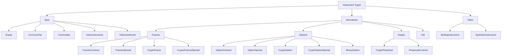

# Instruments

An instrument represents the specification for a tradable asset, contract, or local
synthetic market. Market data, orders, positions, accounting, portfolio calculations,
and adapter symbology all refer back to an `InstrumentId` and its instrument definition.

NautilusTrader exposes the same instrument model to Rust and Python users. Rust
examples use `nautilus_model`; Python examples use `nautilus_trader.model.instruments`.

## Instrument types

| Instrument type                                          | Class              | Description                                          | Typical adapters                |
|----------------------------------------------------------|--------------------|------------------------------------------------------|---------------------------------|
| [`Equity`](equity.md)                                    | Spot               | Listed share or ETF traded on a cash market.         | Databento, Interactive Brokers. |
| [`CurrencyPair`](currency_pair.md)                       | Spot               | Fiat FX or crypto spot pair in base/quote form.      | Binance, Kraken, OKX, Tardis.   |
| [`Commodity`](commodity.md)                              | Spot               | Spot commodity such as gold or oil.                  | Interactive Brokers.            |
| [`Cfd`](cfd.md)                                          | Contract for diff. | Contract for difference tracking an underlying.      | Interactive Brokers.            |
| [`IndexInstrument`](index_instrument.md)                 | Spot reference     | Reference index, not directly tradable.              | Interactive Brokers.            |
| [`TokenizedAsset`](tokenized_asset.md)                   | Tokenized spot     | Tokenized asset on a crypto venue.                   | Kraken.                         |
| [`FuturesContract`](futures_contract.md)                 | Future             | Deliverable futures contract.                        | Databento, Interactive Brokers. |
| [`FuturesSpread`](futures_spread.md)                     | Futures spread     | Exchange defined futures strategy with several legs. | Databento, Interactive Brokers. |
| [`CryptoFuture`](crypto_future.md)                       | Crypto future      | Dated crypto futures contract.                       | BitMEX, Bybit, Deribit, OKX.    |
| [`CryptoFuturesSpread`](crypto_futures_spread.md)        | Crypto spread      | Exchange defined crypto futures spread.              | Deribit, OKX.                   |
| [`CryptoPerpetual`](crypto_perpetual.md)                 | Swap               | Crypto perpetual futures contract.                   | Binance, BitMEX, Bybit, dYdX.   |
| [`PerpetualContract`](perpetual_contract.md)             | Generic swap       | Perpetual futures contract across asset classes.     | Architect AX.                   |
| [`OptionContract`](option_contract.md)                   | Option             | Exchange traded put or call option.                  | Databento, Interactive Brokers. |
| [`OptionSpread`](option_spread.md)                       | Option spread      | Exchange defined options strategy with several legs. | Databento, Interactive Brokers. |
| [`CryptoOption`](crypto_option.md)                       | Crypto option      | Option on a crypto underlying.                       | Bybit, Deribit, OKX, Tardis.    |
| [`CryptoOptionSpread`](crypto_option_spread.md)          | Crypto spread      | Exchange defined crypto option spread.               | Deribit, OKX.                   |
| [`BinaryOption`](binary_option.md)                       | Binary outcome     | Binary instrument that settles to 0 or 1.            | Hyperliquid, OKX, Polymarket.   |
| [`BettingInstrument`](betting_instrument.md)             | Betting market     | Sports or gaming market selection.                   | Betfair.                        |
| [`SyntheticInstrument`](synthetic_instrument.md)         | Local synthetic    | Formula derived local instrument.                    | Local only.                     |

## Taxonomy

NautilusTrader groups instruments by the market structure they represent:



## Common fields

Most concrete instruments share the same core shape. Individual type pages list the
complete constructor and struct fields for that type.

| Field               | Meaning                                                                 |
|---------------------|-------------------------------------------------------------------------|
| `id`                | Nautilus `InstrumentId`, formed from a symbol and venue.                |
| `raw_symbol`        | Native venue symbol before Nautilus normalization.                      |
| `price_precision`   | Number of decimal places allowed for prices.                            |
| `size_precision`    | Number of decimal places allowed for quantities.                        |
| `price_increment`   | Smallest valid price step.                                              |
| `size_increment`    | Smallest valid quantity step.                                           |
| `multiplier`        | Contract multiplier used in notional and PnL calculations.              |
| `lot_size`          | Rounded lot or board size when the venue publishes one.                 |
| `margin_init`       | Initial margin rate as a decimal fraction of notional value.            |
| `margin_maint`      | Maintenance margin rate as a decimal fraction of notional value.        |
| `maker_fee`         | Maker fee rate. Negative values represent rebates.                      |
| `taker_fee`         | Taker fee rate. Negative values represent rebates.                      |
| `max_quantity`      | Maximum order quantity when known.                                      |
| `min_quantity`      | Minimum order quantity when known.                                      |
| `max_notional`      | Maximum order notional value when known.                                |
| `min_notional`      | Minimum order notional value when known.                                |
| `max_price`         | Maximum valid quote or order price when known.                          |
| `min_price`         | Minimum valid quote or order price when known.                          |
| `info`              | Adapter metadata preserved from the venue or data source.               |
| `ts_event`          | UNIX nanosecond timestamp for when the definition event occurred.       |
| `ts_init`           | UNIX nanosecond timestamp for when Nautilus initialized the object.     |
| `tick_scheme_name`  | Registered variable tick scheme name where the type supports one.       |

## Symbology

Every instrument has a unique `InstrumentId` made from the native symbol and venue,
separated by a period. For example, Binance Futures represents the Ethereum perpetual
contract as:

```text
ETHUSDT-PERP.BINANCE
```

Native symbols should be unique for a venue, but this is not guaranteed by every
exchange. The `{symbol}.{venue}` pair must be unique inside a Nautilus system.

:::warning
The instrument definition must match the market data and venue order semantics. An
incorrect instrument can truncate prices or quantities, calculate notional values with
the wrong currency, or make a backtest accept prices a live venue would reject.
:::

## Rust and Python surfaces

Rust users work with the `nautilus_model` instrument structs and `InstrumentAny`:

```rust
use nautilus_model::instruments::{CurrencyPair, InstrumentAny};
```

Python users normally work with instrument classes from `nautilus_trader.model.instruments`:

```python
from nautilus_trader.model.instruments import CurrencyPair
```

Both surfaces represent the same instrument contract: identity, precision, increments,
currencies, limits, margins, fees, metadata, and timestamps.

## Loading instruments

Generic test instruments can be instantiated through the `TestInstrumentProvider`:

```python
from nautilus_trader.test_kit.providers import TestInstrumentProvider

audusd = TestInstrumentProvider.default_fx_ccy("AUD/USD")
```

Live integration adapters expose `InstrumentProvider` objects that cache instrument
definitions. Use `InstrumentProviderConfig(load_all=True)` where the integration
supports it, or `load_ids` to load a known set of instruments.
Subscriptions and order methods expect matching instruments to already exist in the cache.

## Finding instruments

Strategies and actors retrieve instruments from the central cache:

```rust tab="Rust"
use nautilus_model::identifiers::InstrumentId;

let instrument_id = InstrumentId::from("ETHUSDT-PERP.BINANCE");
let instrument = cache.instrument(&instrument_id);
```

```python tab="Python"
from nautilus_trader.model import InstrumentId

instrument_id = InstrumentId.from_str("ETHUSDT-PERP.BINANCE")
instrument = self.cache.instrument(instrument_id)
```

It is also possible to subscribe to one instrument or all instruments for a venue:

```python
self.subscribe_instrument(instrument_id)
self.subscribe_instruments(venue)
```

When the `DataEngine` receives an instrument update, it passes the object to the
`on_instrument()` handler.

## Precision

Precision defines the number of decimal places allowed for prices and quantities on an
instrument. NautilusTrader enforces this strictly because exchanges validate the same
constraints, and backtests should not fill orders at prices or sizes that cannot exist
in production.

| Field             | Constrains                           | Example          |
|-------------------|--------------------------------------|------------------|
| `price_precision` | Order prices, trigger prices, fills. | `2` -> `50000.01` |
| `size_precision`  | Order quantities and fill sizes.     | `5` -> `1.00001`  |

The increment precision must match the declared precision. For example,
`price_precision=2` pairs with `price_increment=Price(0.01, 2)`.

Use the instrument factory methods when producing order prices and sizes:

```python
instrument = self.cache.instrument(instrument_id)

price = instrument.make_price(0.90500)
quantity = instrument.make_qty(150)
```

:::warning
The `RiskEngine` does not round values automatically. If you create a `Price` with
5 decimal places for an instrument that supports 2, the order is denied. Use
`instrument.make_price()` and `instrument.make_qty()` to round explicitly.
:::

## Limits, margins, and fees

Venue and adapter definitions can include optional limits:

- `max_quantity` and `min_quantity`.
- `max_notional` and `min_notional`.
- `max_price` and `min_price`.

The `MarginAccount` uses `margin_init`, `margin_maint`, and the taker fee when it
calculates initial and maintenance margin. Nautilus uses one fee-rate convention across
adapters and backtesting:

- Positive fee rates represent commissions.
- Negative fee rates represent rebates.

For deeper accounting behavior, see [Accounting](../accounting.md).

## Metadata

The `info` field preserves raw or adapter-specific metadata as a JSON-serializable
dictionary. Use it when the venue publishes useful details that do not belong in the
unified Nautilus instrument API.

## Related guides

- [Data](../data.md) covers market data types that reference instruments.
- [Orders](../orders/) covers order fields that reference instruments.
- [Synthetics](../synthetics.md) covers local formula-derived instruments.
- [Python API Reference](/docs/python-api-latest/model/instruments.html) lists Python
  constructors and members.
