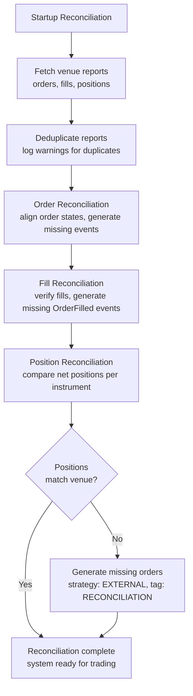

# Live Trading

NautilusTrader deploys backtested strategies to live markets with no code changes.
The same actors, strategies, and execution algorithms run against both the backtest
engine and a live trading node.

**Live trading involves real financial risk. Before deploying to production, understand
system configuration, node operations, execution reconciliation, and the differences
between backtesting and live trading.**

## Configuration

For how config structs handle defaults, `T` vs `Option<T>` semantics, and
builder patterns, see the [Configuration](configuration.md) concept guide.
For step-by-step setup of `TradingNodeConfig`, execution engine options, strategy
configuration, and multi-venue wiring, see the
[Configure a live trading node](../how_to/configure_live_trading.md) how-to guide.

## Execution reconciliation

Execution reconciliation aligns the venue's actual order and position state with the
system's internal state built from events. Only the `LiveExecutionEngine` performs
reconciliation, since backtesting controls both sides.

:::note[Terminology]
An **in-flight order** is one awaiting venue acknowledgement:

- `SUBMITTED` - initial submission, awaiting accept/reject.
- `PENDING_UPDATE` - modification requested, awaiting confirmation.
- `PENDING_CANCEL` - cancellation requested, awaiting confirmation.

These orders are monitored by the continuous reconciliation loop to detect stale or lost messages.
:::

Two scenarios:

- **Cached state exists**: report data generates missing events to align the state.
- **No cached state**: all orders and positions at the venue are generated from scratch.

:::tip
Persist all execution events to the cache database. This reduces reliance on venue history
and allows full recovery even with short lookback windows.
:::

### Reconciliation configuration

Unless `reconciliation` is set to false, the execution engine reconciles state for each
venue at startup. The `reconciliation_lookback_mins` parameter controls how far back the
engine requests history.

:::tip
Leave `reconciliation_lookback_mins` unset. This lets the engine request the maximum
execution history the venue provides.
:::

:::warning
Executions before the lookback window still generate alignment events, but with some
information loss that a longer window would avoid. Some venues also filter or drop
older execution data. Persisting all events to the cache database prevents both issues.
:::

Each strategy can claim external orders for an instrument ID generated during reconciliation
via the `external_order_claims` config parameter. This lets a strategy resume managing open
orders when no cached state exists.

Orders generated with strategy ID `EXTERNAL` and tag `RECONCILIATION` during position
reconciliation are internal to the engine. They cannot be claimed via `external_order_claims`
and should not be managed by user strategies.

:::tip
To detect external orders in your strategy, check `order.strategy_id.value == "EXTERNAL"`. These orders participate in portfolio calculations and position tracking like any other order.
:::

For all live trading options, see the `LiveExecEngineConfig` [API Reference](/docs/python-api-latest/config.html#nautilus_trader.live.config.LiveExecEngineConfig).

### Reconciliation procedure

All adapter execution clients follow the same reconciliation procedure, calling three methods
to produce an execution mass status:

- `generate_order_status_reports`
- `generate_fill_reports`
- `generate_position_status_reports`

The system reconciles its state against these reports, which represent external reality:

- **Duplicate check**:
  - Deduplicates order reports within the batch and logs warnings.
  - Logs duplicate trade IDs as warnings for investigation.
- **Order reconciliation**:
  - Generates and applies events to move orders from cached state to current state.
  - Infers `OrderFilled` events for missing trade reports.
  - Generates external order events for unrecognized client order IDs or reports missing a client order ID.
  - Verifies fill report data consistency with tolerance-based price and commission comparisons.
- **Position reconciliation**:
  - Matches the net position per instrument against venue position reports using instrument precision.
  - Generates external order events when order reconciliation leaves a position that differs from the venue.
  - When `generate_missing_orders` is enabled (default: True), generates orders with strategy ID `EXTERNAL` and tag `RECONCILIATION` to align discrepancies.
  - Falls through a price hierarchy when generating reconciliation orders:
    1. **Calculated reconciliation price** (preferred): targets the correct average position.
    2. **Market mid-price**: uses the current bid-ask midpoint.
    3. **Current position average**: uses the existing position's average price.
    4. **MARKET order** (last resort): used only when no price data exists (no positions, no market data).
  - Uses LIMIT orders when a price can be determined (cases 1-3) to preserve PnL accuracy.
  - Skips zero quantity differences after precision rounding.
- **Partial window adjustment**:
  - When `reconciliation_lookback_mins` is set, the window may miss opening fills.
  - The system adjusts fills using lifecycle analysis to reconstruct positions accurately:
    - Detects zero-crossings (position qty crosses through FLAT) to identify separate lifecycles.
    - Adds synthetic opening fills when the earliest lifecycle is incomplete.
    - Filters out closed lifecycles when the current lifecycle matches the venue position.
    - Replaces a mismatched current lifecycle with a synthetic fill reflecting the venue position.
  - Synthetic fills use calculated reconciliation prices to target correct average positions.
  - See [Partial window adjustment scenarios](#partial-window-adjustment-scenarios) for details.
- **Exception handling**:
  - Individual adapter failures do not abort the entire reconciliation process.
  - Fill reports arriving before order status reports are deferred until order state is available.

If reconciliation fails, the system logs an error and does not start.

### Common reconciliation scenarios

The tables below cover startup reconciliation (mass status) and runtime checks (in-flight order checks, open-order polls, own-books audits).

#### Startup reconciliation

| Scenario                               | Description                                                                              | System behavior                                                                 |
|----------------------------------------|------------------------------------------------------------------------------------------|---------------------------------------------------------------------------------|
| **Order state discrepancy**            | Local state differs from venue (e.g., local `SUBMITTED`, venue `REJECTED`).              | Updates local order to match venue state, emits missing events.                 |
| **Missed fills**                       | Venue filled an order but the engine missed the event.                                   | Generates missing `OrderFilled` events.                                         |
| **Multiple fills**                     | Order has partial fills, some missed by the engine.                                      | Reconstructs complete fill history from venue reports.                          |
| **External orders**                    | Orders exist on venue but not in local cache.                                            | Creates orders with strategy ID `EXTERNAL` and tag `VENUE`.                     |
| **Partially filled then canceled**     | Order partially filled then canceled by venue.                                           | Updates state to `CANCELED`, preserves fill history.                            |
| **Different fill data**                | Venue reports different fill price/commission than cached.                               | Preserves cached data, logs discrepancies.                                      |
| **Filtered orders**                    | Orders marked for filtering via config.                                                  | Skips based on `filtered_client_order_ids` or instrument filters.               |
| **Duplicate order reports**            | Multiple orders share the same identifier.                                               | Deduplicates with warning logged.                                               |
| **Position quantity mismatch (long)**  | Internal long position differs from venue (e.g., 100 vs 150).                            | Generates BUY LIMIT with calculated price when `generate_missing_orders=True`.  |
| **Position quantity mismatch (short)** | Internal short position differs from venue (e.g., -100 vs -150).                         | Generates SELL LIMIT with calculated price when `generate_missing_orders=True`. |
| **Position reduction**                 | Venue position smaller than internal (e.g., internal 150 long, venue 100 long).          | Generates opposite‑side LIMIT order with calculated price.                      |
| **Position side flip**                 | Internal position opposite of venue (e.g., internal 100 long, venue 50 short).           | Generates LIMIT order to close internal and open external position.             |
| **Internal reconciliation orders**     | Orders with strategy ID `EXTERNAL` and tag `RECONCILIATION`.                             | Never filtered, regardless of `filter_unclaimed_external_orders`.               |

#### Runtime checks

| Scenario                          | Description                                             | System behavior                                                        |
|-----------------------------------|---------------------------------------------------------|------------------------------------------------------------------------|
| **In‑flight order timeout**       | Order remains unconfirmed beyond threshold.             | After `inflight_check_retries`, resolves to `REJECTED`.                |
| **Open orders check discrepancy** | Periodic poll detects a venue state change.             | Confirms status at `open_check_interval_secs` and applies transitions. |
| **Own books audit mismatch**      | Own order books diverge from venue public books.        | Audits at `own_books_audit_interval_secs`, logs inconsistencies.       |

### Common reconciliation issues

- **Missing trade reports**: Some venues filter out older trades. Increase `reconciliation_lookback_mins` or cache all events locally.
- **Position mismatches**: External orders that predate the lookback window cause position drift. Flatten the account before restarting to reset state.
- **Duplicate order IDs**: Deduplicated with warnings logged. Frequent duplicates may indicate venue data integrity issues.
- **Precision differences**: Small decimal differences are handled using instrument precision. Large discrepancies may indicate missing orders.
- **Out-of-order reports**: Fill reports arriving before order status reports are deferred until order state is available.

:::tip
For persistent issues, drop cached state or flatten accounts before restarting.
:::

### Reconciliation invariants

The reconciliation system maintains four invariants:

1. **Position quantity**: the final quantity matches the venue within instrument precision.
2. **Average entry price**: the position's average entry price matches the venue's reported price within tolerance (default 0.01%).
3. **PnL integrity**: all generated fills, including synthetic fills, use calculated prices that preserve correct unrealized PnL.
4. **ID determinism**: synthetic `trade_id` and `venue_order_id` values emitted during reconciliation are deterministic functions of the logical event. The same logical fill or position-adjustment order produces the same ID across restarts, so replayed reconciliation events dedupe against earlier runs instead of being treated as new.

These hold even when:

- The reconciliation window misses complete fill history.
- Fills are missing from venue reports.
- Position lifecycles span beyond the lookback window.
- Multiple zero-crossings have occurred.

### Partial window adjustment scenarios

When `reconciliation_lookback_mins` limits the window, the system analyzes position lifecycles
from fills and adjusts to reconstruct positions accurately.

| Scenario                                   | Description                                                                  | System behavior                                                             |
|--------------------------------------------|------------------------------------------------------------------------------|-----------------------------------------------------------------------------|
| **Complete lifecycle**                     | All fills from opening to current state are captured.                        | No adjustment.                                                              |
| **Incomplete single lifecycle**            | Window misses opening fills, no zero‑crossings.                              | Adds synthetic opening fill with calculated price.                          |
| **Multiple lifecycles, current matches**   | Zero‑crossings detected, current lifecycle matches venue.                    | Filters out old lifecycles, returns current only.                           |
| **Multiple lifecycles, current mismatch**  | Zero‑crossings detected, current lifecycle differs from venue.               | Replaces current lifecycle with a single synthetic fill.                    |
| **Flat position**                          | Venue reports FLAT regardless of fill history.                               | No adjustment.                                                              |
| **No fills**                               | Window contains no fill reports.                                             | No adjustment, empty result.                                                |

**Key concepts:**

- **Zero-crossing**: position quantity crosses through zero (FLAT), marking a lifecycle boundary.
- **Lifecycle**: a sequence of fills between zero-crossings representing one open-close cycle.
- **Synthetic fill**: a calculated fill report representing missing activity, priced to achieve the correct average position.
- **Tolerance**: position matching uses configurable price tolerance (default 0.0001 = 0.01%) to absorb minor calculation differences.

## Related guides

- [Configure a live trading node](../how_to/configure_live_trading.md) - Node and engine configuration.
- [Adapters](adapters.md) - Venue connectivity.
- [Execution](execution.md) - Order execution in live environments.
- [Backtesting](backtesting.md) - Testing strategies before deployment.
