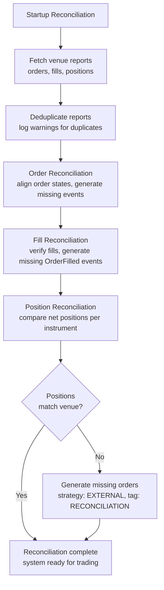

# Live Trading

NautilusTrader deploys backtested strategies to live markets with no code changes.

**Live trading involves real financial risk. Before deploying to production, understand
system configuration, node operations, execution reconciliation, and the differences
between backtesting and live trading.**

:::danger[Jupyter notebooks not recommended for live trading]
Do not run live trading nodes in Jupyter notebooks. Event loop conflicts and
operational risks make them unsuitable:

- Jupyter runs its own asyncio event loop, which conflicts with `TradingNode`'s event loop.
- Workarounds like `nest_asyncio` are not production-grade.
- Cells can run out of order, kernels can crash, and state can disappear.
- Notebooks lack the logging, monitoring, and graceful shutdown needed for production trading.

Use Jupyter for backtesting, analysis, and experimentation. For live trading, run nodes
as standalone Python scripts or services.
:::

:::warning[One TradingNode per process]
Running multiple `TradingNode` instances concurrently in the same process is not supported due to global singleton state.
Add multiple strategies to a single node, or run additional nodes in separate processes for parallel execution.

See [Processes and threads](architecture.md#processes-and-threads) for details.
:::

:::warning[Do not block the event loop]
User code on the event loop thread (strategy callbacks, actor handlers, `on_event` methods)
must return quickly. This applies to both Python and Rust. Blocking operations like model
inference, heavy calculations, or synchronous I/O cause missed fills, stale data, and
delayed order submissions. Offload long-running work to an executor or a separate thread/process.
:::

:::info[Platform differences]
Windows signal handling differs from Unix-like systems. If you are running on Windows, please read
the note on [Windows signal handling](#windows-signal-handling) for guidance on graceful shutdown
behavior and Ctrl+C (SIGINT) support.
:::

## Configuration

### `TradingNodeConfig`

`TradingNodeConfig` inherits from `NautilusKernelConfig` and adds live-specific options:

```python
from nautilus_trader.config import TradingNodeConfig

config = TradingNodeConfig(
    trader_id="MyTrader-001",

    # Component configurations
    cache=CacheConfig(),
    message_bus=MessageBusConfig(),
    data_engine=LiveDataEngineConfig(),
    risk_engine=LiveRiskEngineConfig(),
    exec_engine=LiveExecEngineConfig(),
    portfolio=PortfolioConfig(),

    # Client configurations
    data_clients={
        "BINANCE": BinanceDataClientConfig(),
    },
    exec_clients={
        "BINANCE": BinanceExecClientConfig(),
    },
)
```

#### Core configuration parameters

| Setting                  | Default      | Description                                 |
|--------------------------|--------------|---------------------------------------------|
| `trader_id`              | "TRADER-001" | Unique trader identifier (name-tag format). |
| `instance_id`            | `None`       | Optional unique instance identifier.        |
| `timeout_connection`     | 30.0         | Connection timeout in seconds.              |
| `timeout_reconciliation` | 10.0         | Reconciliation timeout in seconds.          |
| `timeout_portfolio`      | 10.0         | Portfolio initialization timeout.           |
| `timeout_disconnection`  | 10.0         | Disconnection timeout.                      |
| `timeout_post_stop`      | 5.0          | Post-stop cleanup timeout.                  |

#### Cache database configuration

```python
from nautilus_trader.config import CacheConfig
from nautilus_trader.config import DatabaseConfig

cache_config = CacheConfig(
    database=DatabaseConfig(
        host="localhost",
        port=6379,
        username="nautilus",
        password="pass",
        timeout=2.0,
    ),
    encoding="msgpack",  # or "json"
    timestamps_as_iso8601=True,
    buffer_interval_ms=100,
    flush_on_start=False,
)
```

#### MessageBus configuration

```python
from nautilus_trader.config import MessageBusConfig
from nautilus_trader.config import DatabaseConfig

message_bus_config = MessageBusConfig(
    database=DatabaseConfig(timeout=2),
    timestamps_as_iso8601=True,
    use_instance_id=False,
    types_filter=[QuoteTick, TradeTick],  # Filter specific message types
    stream_per_topic=False,
    autotrim_mins=30,  # Automatic message trimming
    heartbeat_interval_secs=1,
)
```

### Multi-venue configuration

A node can connect to multiple venues. This example configures both
spot and futures markets for Binance:

```python
config = TradingNodeConfig(
    trader_id="MultiVenue-001",

    # Multiple data clients for different market types
    data_clients={
        "BINANCE_SPOT": BinanceDataClientConfig(
            account_type=BinanceAccountType.SPOT,
            testnet=False,
        ),
        "BINANCE_FUTURES": BinanceDataClientConfig(
            account_type=BinanceAccountType.USDT_FUTURES,
            testnet=False,
        ),
    },

    # Corresponding execution clients
    exec_clients={
        "BINANCE_SPOT": BinanceExecClientConfig(
            account_type=BinanceAccountType.SPOT,
            testnet=False,
        ),
        "BINANCE_FUTURES": BinanceExecClientConfig(
            account_type=BinanceAccountType.USDT_FUTURES,
            testnet=False,
        ),
    },
)
```

### ExecutionEngine configuration

`LiveExecEngineConfig` controls order processing, execution events, and
venue reconciliation. For full details see the
[API Reference](/docs/python-api-latest/config.html#nautilus_trader.live.config.LiveExecEngineConfig).

#### Reconciliation

Recovers missed order and position events to keep system state consistent with the venue.

| Setting                         | Default | Description                                                                     |
|---------------------------------|---------|---------------------------------------------------------------------------------|
| `reconciliation`                | True    | Activate reconciliation at startup to align internal state with the venue.      |
| `reconciliation_lookback_mins`  | None    | How far back (minutes) to request past events for reconciling uncached state.   |
| `reconciliation_instrument_ids` | None    | Include list of instrument IDs to reconcile.                                    |
| `filtered_client_order_ids`     | None    | Client order IDs to skip during reconciliation (for venue-side duplicates).     |

See [Execution reconciliation](#execution-reconciliation) for details.

#### Order filtering

Controls which order events and reports the system processes, preventing conflicts
across trading nodes.

| Setting                            | Default | Description                                                                   |
|------------------------------------|---------|-------------------------------------------------------------------------------|
| `filter_unclaimed_external_orders` | False   | Drop unclaimed external orders so they do not affect the strategy.            |
| `filter_position_reports`          | False   | Drop position status reports. Useful when multiple nodes trade one account.   |

:::note[Order tagging behavior]
Reconciliation tags orders by origin:

- **`VENUE` tag**: external orders discovered at the venue (placed outside this system).
- **`RECONCILIATION` tag**: synthetic orders generated to align position discrepancies.

When `filter_unclaimed_external_orders` is enabled, only `VENUE`-tagged orders are filtered.
`RECONCILIATION`-tagged orders are never filtered, so position alignment always succeeds.
:::

#### Continuous reconciliation

A background loop starts after startup reconciliation completes. It:

- Monitors in-flight orders for delays exceeding a configured threshold.
- Reconciles open orders with the venue at configurable intervals.
- Audits internal *own* order books against the venue's public books.

The loop waits for startup reconciliation to finish before starting periodic checks.
The `reconciliation_startup_delay_secs` parameter adds a further delay *after* startup
reconciliation completes, giving the system time to stabilize.

When retries are exhausted, the engine resolves the order as follows:

**In-flight order timeout resolution** (venue does not respond after max retries):

| Current status   | Resolved to | Rationale                                  |
|------------------|-------------|--------------------------------------------|
| `SUBMITTED`      | `REJECTED`  | No confirmation received from venue.       |
| `PENDING_UPDATE` | `CANCELED`  | Modification remains unacknowledged.       |
| `PENDING_CANCEL` | `CANCELED`  | Venue never confirmed the cancellation.    |

**Order consistency checks** (when cache state differs from venue state):

| Cache status       | Venue status | Resolution  | Rationale                                                           |
|--------------------|--------------|-------------|---------------------------------------------------------------------|
| `SUBMITTED`        | Not found    | `REJECTED`  | Order never confirmed by venue (e.g., lost during network error).   |
| `ACCEPTED`         | Not found    | `REJECTED`  | Order doesn't exist at venue, likely was never successfully placed. |
| `ACCEPTED`         | `CANCELED`   | `CANCELED`  | Venue canceled the order (user action or venue-initiated).          |
| `ACCEPTED`         | `EXPIRED`    | `EXPIRED`   | Order reached GTD expiration at venue.                              |
| `ACCEPTED`         | `REJECTED`   | `REJECTED`  | Venue rejected after initial acceptance (rare but possible).        |
| `PARTIALLY_FILLED` | `CANCELED`   | `CANCELED`  | Order canceled at venue with fills preserved.                       |
| `PARTIALLY_FILLED` | Not found    | `CANCELED`  | Order doesn't exist but had fills (reconciles fill history).        |

:::note
**Reconciliation caveats:**

- **"Not found" resolutions** only apply in full-history mode (`open_check_open_only=False`).
  Open-only mode (the default) skips these checks because venue "open orders" endpoints
  exclude closed orders by design, making it impossible to distinguish missing orders from
  recently closed ones.
- **Recent order protection**: the engine skips reconciliation for orders whose last event
  falls within the `open_check_threshold_ms` window (default 5s). This prevents false
  positives from race conditions where the venue is still processing.
- **Targeted query safeguard**: before marking an order `REJECTED` or `CANCELED` when
  "not found", the engine issues a single-order query to the venue.
  This catches false negatives from bulk query limitations or timing delays.
- **`FILLED` orders** that are "not found" at the venue are silently ignored. Venues
  commonly drop completed orders from their query results.

:::

#### Retry coordination and lookback behavior

The inflight loop and open-order loop share a single retry counter
(`_recon_check_retries`), bounded by `inflight_check_retries` and
`open_check_missing_retries` respectively. The stricter limit wins,
and avoids duplicate venue queries for the same order state.

When the open-order loop exhausts retries, the engine issues one targeted
`GenerateOrderStatusReport` probe before applying a terminal state. If the
venue returns the order, reconciliation proceeds and the retry counter resets.

**Single-order query protection**: the engine caps single-order queries per
cycle via `max_single_order_queries_per_cycle` (default: 10). Remaining
orders are deferred to the next cycle. A configurable delay
(`single_order_query_delay_ms`, default: 100ms) spaces out consecutive
queries to avoid rate limits. This handles bulk query failures across hundreds of orders
without overwhelming the venue API.

Orders older than `open_check_lookback_mins` rely on this targeted probe.
Keep the lookback generous for venues with short history windows. Increase
`open_check_threshold_ms` if venue timestamps lag the local clock, so
recently updated orders are not marked missing prematurely.

| Setting                              | Default        | Description                                                                                      |
|--------------------------------------|----------------|--------------------------------------------------------------------------------------------------|
| `inflight_check_interval_ms`         | 2,000&nbsp;ms  | How often to check in-flight order status. Set to 0 to disable.                                  |
| `inflight_check_threshold_ms`        | 5,000&nbsp;ms  | Time before an in-flight order triggers a venue status check. Lower if colocated.                |
| `inflight_check_retries`             | 5&nbsp;retries | Retry attempts to verify an in-flight order with the venue.                                      |
| `open_check_interval_secs`           | None           | How often (seconds) to check open orders at the venue. None or 0.0 disables. Recommended: 5-10s.|
| `open_check_open_only`               | True           | When true, query only open orders; when false, fetch full history (resource-intensive).          |
| `open_check_lookback_mins`           | 60&nbsp;min    | Lookback window (minutes) for order status polling. Only orders modified within this window.     |
| `open_check_threshold_ms`            | 5,000&nbsp;ms  | Minimum time since last cached event before acting on venue discrepancies.                       |
| `open_check_missing_retries`         | 5&nbsp;retries | Max retries before resolving an order open in cache but not found at venue.                      |
| `max_single_order_queries_per_cycle` | 10             | Cap on single-order queries per cycle. Prevents rate-limit exhaustion.                           |
| `single_order_query_delay_ms`        | 100&nbsp;ms    | Delay (ms) between single-order queries to avoid rate limits.                                    |
| `reconciliation_startup_delay_secs`  | 10.0&nbsp;s    | Delay (seconds) *after* startup reconciliation before continuous checks begin.                   |
| `own_books_audit_interval_secs`      | None           | Interval (seconds) between auditing own order books against public books.                        |
| `position_check_interval_secs`       | None           | Interval (seconds) between position consistency checks. On discrepancy, queries for missing fills. None disables. Recommended: 30-60s. |
| `position_check_lookback_mins`       | 60&nbsp;min    | Lookback window (minutes) for querying fill reports on position discrepancy.                     |
| `position_check_threshold_ms`        | 5,000&nbsp;ms  | Minimum time since last local activity before acting on position discrepancies.                  |
| `position_check_retries`             | 3&nbsp;retries | Max attempts per instrument before the engine stops retrying that discrepancy. Once exceeded, an error is logged and the discrepancy is no longer actively reconciled until it clears. |

:::warning

- **`open_check_lookback_mins`**: do not reduce below 60 minutes. A short window
  triggers false "missing order" resolutions because orders fall outside the query range.
- **`reconciliation_startup_delay_secs`**: do not reduce below 10 seconds in production.
  The delay lets the system stabilize after startup reconciliation before continuous
  checks begin.

:::

#### Additional options

| Setting                            | Default | Description                                                                                     |
|------------------------------------|---------|-------------------------------------------------------------------------------------------------|
| `allow_overfills`                  | False   | Allow fills exceeding order quantity (logs warning). Useful when reconciliation races fills.     |
| `generate_missing_orders`          | True    | Generate LIMIT orders during reconciliation to align position discrepancies (strategy `EXTERNAL`, tag `RECONCILIATION`). |
| `snapshot_orders`                  | False   | Take order snapshots on order events.                                                           |
| `snapshot_positions`               | False   | Take position snapshots on position events.                                                     |
| `snapshot_positions_interval_secs` | None    | Interval (seconds) between position snapshots.                                                  |
| `debug`                            | False   | Enable debug logging for execution.                                                             |

#### Memory management

Periodically purges closed orders, closed positions, and account events from the
in-memory cache, keeping memory bounded during long-running or HFT sessions.

| Setting                                | Default | Description                                                                        |
|----------------------------------------|---------|------------------------------------------------------------------------------------|
| `purge_closed_orders_interval_mins`    | None    | How often (minutes) to purge closed orders from memory. Recommended: 10-15 min.    |
| `purge_closed_orders_buffer_mins`      | None    | How long (minutes) an order must be closed before purging. Recommended: 60 min.    |
| `purge_closed_positions_interval_mins` | None    | How often (minutes) to purge closed positions from memory. Recommended: 10-15 min. |
| `purge_closed_positions_buffer_mins`   | None    | How long (minutes) a position must be closed before purging. Recommended: 60 min.  |
| `purge_account_events_interval_mins`   | None    | How often (minutes) to purge account events from memory. Recommended: 10-15 min.   |
| `purge_account_events_lookback_mins`   | None    | How old (minutes) an account event must be before purging. Recommended: 60 min.    |
| `purge_from_database`                  | False   | Also delete from the backing database (Redis/PostgreSQL). **Use with caution**.    |

Setting an interval enables the purge loop; leaving it unset disables scheduling and
deletion. Database records are unaffected unless `purge_from_database` is true. Each
loop delegates to the cache APIs described in
[Purging cached state](cache.md#purging-cached-state).

#### Queue management

| Setting                          | Default | Description                                                                     |
|----------------------------------|---------|---------------------------------------------------------------------------------|
| `qsize`                          | 100,000 | Size of internal queue buffers.                                                 |
| `graceful_shutdown_on_exception` | False   | Gracefully shut down on unexpected queue processing exceptions (not user code). |

### Strategy configuration

For a complete parameter list see the `StrategyConfig`
[API Reference](/docs/python-api-latest/config.html#nautilus_trader.trading.config.StrategyConfig).

#### Identification

| Setting        | Default | Description                                                   |
|----------------|---------|---------------------------------------------------------------|
| `strategy_id`  | None    | Unique strategy identifier.                                   |
| `order_id_tag` | None    | Unique tag appended to this strategy's order IDs.             |

#### Order management

| Setting                     | Default | Description                                                                                |
|-----------------------------|---------|--------------------------------------------------------------------------------------------|
| `oms_type`                  | None    | [OMS type](../concepts/execution#oms-configuration) for position ID and order processing.  |
| `use_uuid_client_order_ids` | False   | Use UUID4 values for client order IDs.                                                     |
| `external_order_claims`     | None    | Instrument IDs whose external orders this strategy claims.                                 |
| `manage_contingent_orders`  | False   | Automatically manage OTO, OCO, and OUO contingent orders.                                  |
| `manage_gtd_expiry`         | False   | Manage GTD expirations for orders.                                                         |

### Windows signal handling

:::warning
Windows: asyncio event loops do not implement `loop.add_signal_handler`. As a result, the legacy
`TradingNode` does not receive OS signals via asyncio on Windows. Use Ctrl+C (SIGINT) handling or
programmatic shutdown; SIGTERM parity is not expected on Windows.
:::

On Windows, asyncio event loops do not implement `loop.add_signal_handler`, so Unix-style
signal integration is unavailable. `TradingNode` does not receive OS signals via asyncio
on Windows and will not stop gracefully unless you intervene.

Recommended approaches:

- Wrap `run` with `try/except KeyboardInterrupt` and call `node.stop()` then `node.dispose()`.
  Ctrl+C raises `KeyboardInterrupt` in the main thread, giving you a clean teardown path.
- Publish a `ShutdownSystem` command programmatically (or call `shutdown_system(...)` from
  an actor/component) to trigger the same shutdown path.

The “inflight check loop task still pending” message appears because the normal graceful
shutdown path is not triggered. This is tracked as
[#2785](https://github.com/nautechsystems/nautilus_trader/issues/2785).

The v2 `LiveNode` already handles Ctrl+C via `tokio::signal::ctrl_c()` and a Python SIGINT
bridge, so runner and tasks shut down cleanly.

Example pattern for Windows:

```python
try:
    node.run()
except KeyboardInterrupt:
    pass
finally:
    try:
        node.stop()
    finally:
        node.dispose()
```

## Execution reconciliation

Execution reconciliation aligns the venue's actual order and position state with the
system's internal state built from events. Only the `LiveExecutionEngine` performs
reconciliation, since backtesting controls both sides.

:::note[Terminology]
An **in-flight order** is one awaiting venue acknowledgement:

- `SUBMITTED` - initial submission, awaiting accept/reject.
- `PENDING_UPDATE` - modification requested, awaiting confirmation.
- `PENDING_CANCEL` - cancellation requested, awaiting confirmation.

These orders are monitored by the continuous reconciliation loop to detect stale or lost messages.
:::

Two scenarios:

- **Cached state exists**: report data generates missing events to align the state.
- **No cached state**: all orders and positions at the venue are generated from scratch.

:::tip
Persist all execution events to the cache database. This reduces reliance on venue history
and allows full recovery even with short lookback windows.
:::

### Reconciliation configuration

Unless `reconciliation` is set to false, the execution engine reconciles state for each
venue at startup. The `reconciliation_lookback_mins` parameter controls how far back the
engine requests history.

:::tip
Leave `reconciliation_lookback_mins` unset. This lets the engine request the maximum
execution history the venue provides.
:::

:::warning
Executions before the lookback window still generate alignment events, but with some
information loss that a longer window would avoid. Some venues also filter or drop
older execution data. Persisting all events to the cache database prevents both issues.
:::

Each strategy can claim external orders for an instrument ID generated during reconciliation
via the `external_order_claims` config parameter. This lets a strategy resume managing open
orders when no cached state exists.

Orders generated with strategy ID `EXTERNAL` and tag `RECONCILIATION` during position
reconciliation are internal to the engine. They cannot be claimed via `external_order_claims`
and should not be managed by user strategies.

:::tip
To detect external orders in your strategy, check `order.strategy_id.value == "EXTERNAL"`. These orders participate in portfolio calculations and position tracking like any other order.
:::

For all live trading options, see the `LiveExecEngineConfig` [API Reference](/docs/python-api-latest/config.html#nautilus_trader.live.config.LiveExecEngineConfig).

### Reconciliation procedure

All adapter execution clients follow the same reconciliation procedure, calling three methods
to produce an execution mass status:

- `generate_order_status_reports`
- `generate_fill_reports`
- `generate_position_status_reports`



The system reconciles its state against these reports, which represent external reality:

- **Duplicate check**:
  - Deduplicates order reports within the batch and logs warnings.
  - Logs duplicate trade IDs as warnings for investigation.
- **Order reconciliation**:
  - Generates and applies events to move orders from cached state to current state.
  - Infers `OrderFilled` events for missing trade reports.
  - Generates external order events for unrecognized client order IDs or reports missing a client order ID.
  - Verifies fill report data consistency with tolerance-based price and commission comparisons.
- **Position reconciliation**:
  - Matches the net position per instrument against venue position reports using instrument precision.
  - Generates external order events when order reconciliation leaves a position that differs from the venue.
  - When `generate_missing_orders` is enabled (default: True), generates orders with strategy ID `EXTERNAL` and tag `RECONCILIATION` to align discrepancies.
  - Falls through a price hierarchy when generating reconciliation orders:
    1. **Calculated reconciliation price** (preferred): targets the correct average position.
    2. **Market mid-price**: uses the current bid-ask midpoint.
    3. **Current position average**: uses the existing position's average price.
    4. **MARKET order** (last resort): used only when no price data exists (no positions, no market data).
  - Uses LIMIT orders when a price can be determined (cases 1-3) to preserve PnL accuracy.
  - Skips zero quantity differences after precision rounding.
- **Partial window adjustment**:
  - When `reconciliation_lookback_mins` is set, the window may miss opening fills.
  - The system adjusts fills using lifecycle analysis to reconstruct positions accurately:
    - Detects zero-crossings (position qty crosses through FLAT) to identify separate lifecycles.
    - Adds synthetic opening fills when the earliest lifecycle is incomplete.
    - Filters out closed lifecycles when the current lifecycle matches the venue position.
    - Replaces a mismatched current lifecycle with a synthetic fill reflecting the venue position.
  - Synthetic fills use calculated reconciliation prices to target correct average positions.
  - See [Partial window adjustment scenarios](#partial-window-adjustment-scenarios) for details.
- **Exception handling**:
  - Individual adapter failures do not abort the entire reconciliation process.
  - Fill reports arriving before order status reports are deferred until order state is available.

If reconciliation fails, the system logs an error and does not start.

### Common reconciliation scenarios

The tables below cover startup reconciliation (mass status) and runtime checks (in-flight order checks, open-order polls, own-books audits).

#### Startup reconciliation

| Scenario                               | Description                                                                              | System behavior                                                                 |
|----------------------------------------|------------------------------------------------------------------------------------------|---------------------------------------------------------------------------------|
| **Order state discrepancy**            | Local state differs from venue (e.g., local `SUBMITTED`, venue `REJECTED`).              | Updates local order to match venue state, emits missing events.                 |
| **Missed fills**                       | Venue filled an order but the engine missed the event.                                   | Generates missing `OrderFilled` events.                                         |
| **Multiple fills**                     | Order has partial fills, some missed by the engine.                                      | Reconstructs complete fill history from venue reports.                          |
| **External orders**                    | Orders exist on venue but not in local cache.                                            | Creates orders with strategy ID `EXTERNAL` and tag `VENUE`.                     |
| **Partially filled then canceled**     | Order partially filled then canceled by venue.                                           | Updates state to `CANCELED`, preserves fill history.                            |
| **Different fill data**                | Venue reports different fill price/commission than cached.                               | Preserves cached data, logs discrepancies.                                      |
| **Filtered orders**                    | Orders marked for filtering via config.                                                  | Skips based on `filtered_client_order_ids` or instrument filters.               |
| **Duplicate order reports**            | Multiple orders share the same identifier.                                               | Deduplicates with warning logged.                                               |
| **Position quantity mismatch (long)**  | Internal long position differs from venue (e.g., 100 vs 150).                            | Generates BUY LIMIT with calculated price when `generate_missing_orders=True`.  |
| **Position quantity mismatch (short)** | Internal short position differs from venue (e.g., -100 vs -150).                         | Generates SELL LIMIT with calculated price when `generate_missing_orders=True`. |
| **Position reduction**                 | Venue position smaller than internal (e.g., internal 150 long, venue 100 long).          | Generates opposite-side LIMIT order with calculated price.                      |
| **Position side flip**                 | Internal position opposite of venue (e.g., internal 100 long, venue 50 short).           | Generates LIMIT order to close internal and open external position.             |
| **Internal reconciliation orders**     | Orders with strategy ID `EXTERNAL` and tag `RECONCILIATION`.                             | Never filtered, regardless of `filter_unclaimed_external_orders`.               |

#### Runtime checks

| Scenario                          | Description                                             | System behavior                                                        |
|-----------------------------------|---------------------------------------------------------|------------------------------------------------------------------------|
| **In-flight order timeout**       | Order remains unconfirmed beyond threshold.             | After `inflight_check_retries`, resolves to `REJECTED`.                |
| **Open orders check discrepancy** | Periodic poll detects a venue state change.             | Confirms status at `open_check_interval_secs` and applies transitions. |
| **Own books audit mismatch**      | Own order books diverge from venue public books.        | Audits at `own_books_audit_interval_secs`, logs inconsistencies.       |

### Common reconciliation issues

- **Missing trade reports**: Some venues filter out older trades. Increase `reconciliation_lookback_mins` or cache all events locally.
- **Position mismatches**: External orders that predate the lookback window cause position drift. Flatten the account before restarting to reset state.
- **Duplicate order IDs**: Deduplicated with warnings logged. Frequent duplicates may indicate venue data integrity issues.
- **Precision differences**: Small decimal differences are handled using instrument precision. Large discrepancies may indicate missing orders.
- **Out-of-order reports**: Fill reports arriving before order status reports are deferred until order state is available.

:::tip
For persistent issues, drop cached state or flatten accounts before restarting.
:::

### Reconciliation invariants

The reconciliation system maintains three invariants:

1. **Position quantity**: the final quantity matches the venue within instrument precision.
2. **Average entry price**: the position's average entry price matches the venue's reported price within tolerance (default 0.01%).
3. **PnL integrity**: all generated fills, including synthetic fills, use calculated prices that preserve correct unrealized PnL.

These hold even when:

- The reconciliation window misses complete fill history.
- Fills are missing from venue reports.
- Position lifecycles span beyond the lookback window.
- Multiple zero-crossings have occurred.

### Partial window adjustment scenarios

When `reconciliation_lookback_mins` limits the window, the system analyzes position lifecycles
from fills and adjusts to reconstruct positions accurately.

| Scenario                                   | Description                                                                  | System behavior                                                             |
|--------------------------------------------|------------------------------------------------------------------------------|-----------------------------------------------------------------------------|
| **Complete lifecycle**                     | All fills from opening to current state are captured.                        | No adjustment.                                                              |
| **Incomplete single lifecycle**            | Window misses opening fills, no zero-crossings.                              | Adds synthetic opening fill with calculated price.                          |
| **Multiple lifecycles, current matches**   | Zero-crossings detected, current lifecycle matches venue.                    | Filters out old lifecycles, returns current only.                           |
| **Multiple lifecycles, current mismatch**  | Zero-crossings detected, current lifecycle differs from venue.               | Replaces current lifecycle with a single synthetic fill.                    |
| **Flat position**                          | Venue reports FLAT regardless of fill history.                               | No adjustment.                                                              |
| **No fills**                               | Window contains no fill reports.                                             | No adjustment, empty result.                                                |

**Key concepts:**

- **Zero-crossing**: position quantity crosses through zero (FLAT), marking a lifecycle boundary.
- **Lifecycle**: a sequence of fills between zero-crossings representing one open-close cycle.
- **Synthetic fill**: a calculated fill report representing missing activity, priced to achieve the correct average position.
- **Tolerance**: position matching uses configurable price tolerance (default 0.0001 = 0.01%) to absorb minor calculation differences.

## Related guides

- [Adapters](adapters.md) - Venue connectivity.
- [Execution](execution.md) - Order execution in live environments.
- [Backtesting](backtesting.md) - Testing strategies before deployment.
