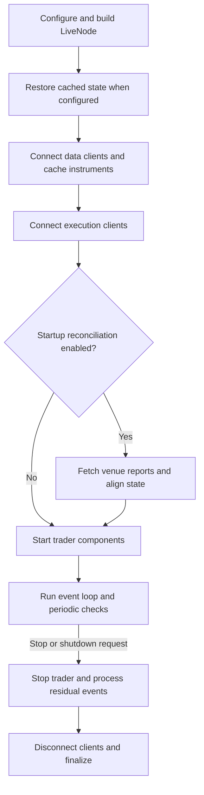

# Live Trading

NautilusTrader deploys backtested strategies to live markets with no code changes.
The same actors, strategies, and execution algorithms run against both the backtest
engine and a live trading node.

:::warning
**Live trading involves real financial risk. Before deploying to production, understand
system configuration, node operations, execution reconciliation, and the differences
between backtesting and live trading.**
:::

## Live node lifecycle

Rust `LiveNode::run()` prepares cached and venue state before starting trader components, then owns
the event loop and coordinated shutdown.


```mermaid
flowchart TD
    Build[Configure and build LiveNode] --> Cache[Restore cached state when configured]
    Cache --> Data[Connect data clients and cache instruments]
    Data --> Exec[Connect execution clients]
    Exec --> Recon{Startup reconciliation enabled?}
    Recon -->|Yes| Align[Fetch venue reports and align state]
    Recon -->|No| Trader[Start trader components]
    Align --> Trader
    Trader --> Run[Run event loop and periodic checks]
    Run -->|Stop or shutdown request| Stop[Stop trader and process residual events]
    Stop --> Final[Disconnect clients and finalize]
```

Live node lifecycle: instruments and execution state are prepared before strategies start trading.

Cache restoration runs when a backing database is attached and cache loading is enabled. Connection,
reconciliation, or trader startup failures abort startup and follow the coordinated cleanup path.

## Configuration

For how config structs handle defaults, `T` vs `Option<T>` semantics, and
builder patterns, see the [Configuration](configuration.md) concept guide.

For node and execution engine settings, strategy configuration, cache backing, and multi-venue
wiring, see the
[Configure a live trading node](../how_to/configure_live_trading.md) how-to guide.

## Execution reconciliation

For how submit, modify, and cancel commands resolve, see
[Command outcomes](execution.md#command-outcomes).

At startup, reconciliation aligns cached order and position state with venue reports before trader
components start. Continuous checks can then monitor in‑flight orders, open orders, positions, and
own order books while the node runs.

See [Execution reconciliation](reconciliation.md) for configuration, recovery procedures,
runtime checks, scenarios, and invariants.

## Rust live runner metrics

Rust `LiveNode` exposes primitive runner metrics through `LiveNodeHandle::metrics_snapshot()`.
Get the handle from the node before calling `run()`, then poll snapshots from another task and
derive rates or utilization from deltas.

```rust
use std::time::Duration;

use nautilus_common::enums::Environment;
use nautilus_live::node::{LiveNode, RunnerMetricsDelta};

let mut node = LiveNode::builder(trader_id, Environment::Live)?
    // Add clients, actors, and strategies here.
    .build()?;

let metrics_handle = node.handle();

tokio::spawn(async move {
    let mut prev = metrics_handle.metrics_snapshot();
    let mut interval = tokio::time::interval(Duration::from_secs(1));

    loop {
        interval.tick().await;

        let next = metrics_handle.metrics_snapshot();
        let delta = RunnerMetricsDelta::from_snapshots(prev, next);
        if delta.elapsed_ns == 0 {
            prev = next;
            continue;
        }

        let elapsed_s = delta.elapsed_ns as f64 / 1_000_000_000.0;
        let data_event_rate = delta.data_events as f64 / elapsed_s;
        let data_event_staleness_ns = if next.data_events.last_dispatch_at_ns == 0 {
            0
        } else {
            next.elapsed_ns
                .saturating_sub(next.data_events.last_dispatch_at_ns)
        };

        log::info!(
            "Runner metrics: data_event_rate={data_event_rate:.0} \
             data_event_staleness_ns={data_event_staleness_ns} \
             dispatch_utilization={:.6} loop_utilization={:.6} \
             mean_dispatch_ns={} data_queue_depth={}",
            delta.dispatch_utilization(),
            delta.loop_utilization(),
            delta.mean_dispatch_ns(),
            next.data_events.queue_depth,
        );

        prev = next;
    }
});

node.run().await?;
```

The snapshot covers `LiveNode::run` channel dispatch after startup, including residual dispatch
during the shutdown grace period. `dispatch_busy_ns` covers the five dispatch branches;
`maintenance_busy_ns` and `external_msgbus_busy_ns` cover non-dispatch loop work. The snapshot does
not include startup buffering, startup flushes, or the final post-loop drain. Queue depths are point
samples from the maintenance tick while the node is running, and can be stale during shutdown grace.
Snapshots are lock-free and may not be a consistent cross-field view; derive rates from successive
snapshots with saturating deltas. Counters reset when `LiveNode::run` enters steady state.

## Shutdown on error

Set `LiveNodeConfig.shutdown_on_error=True` so that a Rust error log requests a live node
shutdown. The Rust logger records the first `log::error!` emitted after the kernel
starts, including error logs from other threads, and the kernel publishes a `ShutdownSystem`
command when the live event loop next checks for shutdown.

The shutdown request follows the normal live node stop path. The node stops the trader,
awaits the post-stop delay, disconnects clients, and stops the engines. It does not abort
the process.

```python
from nautilus_trader.live import LiveNodeConfig

config = LiveNodeConfig(shutdown_on_error=True)
```

Error logs suppressed by component filters or logging bypass mode still request shutdown.
The trigger is cleared and re-armed when a new kernel run starts, so a process can restart
a node without reinitializing the logging system. The per-engine
`graceful_shutdown_on_error` option has been removed; configure shutdown-on-error at the
node/kernel level instead. Shutdown-on-error observes Rust `log` records, not Python
`logging.error(...)` calls.

## Related guides

- [Execution reconciliation](reconciliation.md) - State recovery and runtime consistency checks.
- [Configure a live trading node](../how_to/configure_live_trading.md) - Node and engine configuration.
- [Run live trading with Rust](../how_to/run_rust_live_trading.md) - Rust node setup and venue connection.
- [Adapters](adapters.md) - Venue connectivity.
- [Execution](execution.md) - Command outcomes and order execution.
- [Backtesting](backtesting/) - Testing strategies before deployment.
