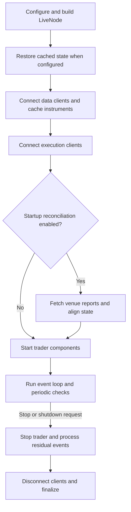

# Live Trading

NautilusTrader deploys backtested strategies to live markets with no code changes.
The same actors, strategies, and execution algorithms run against both the backtest
engine and a live trading node.

:::warning
**Live trading involves real financial risk. Before deploying to production, understand
system configuration, node operations, execution reconciliation, and the differences
between backtesting and live trading.**
:::

## Live node lifecycle

Rust `LiveNode::run()` prepares cached and venue state before starting trader components, then owns
the event loop and coordinated shutdown.


```mermaid
flowchart TD
    Build[Configure and build LiveNode] --> Cache[Restore cached state when configured]
    Cache --> Data[Connect data clients and cache instruments]
    Data --> Exec[Connect execution clients]
    Exec --> Recon{Startup reconciliation enabled?}
    Recon -->|Yes| Align[Fetch venue reports and align state]
    Recon -->|No| Trader[Start trader components]
    Align --> Trader
    Trader --> Run[Run event loop and periodic checks]
    Run -->|Stop or shutdown request| Stop[Stop trader and process residual events]
    Stop --> Final[Disconnect clients and finalize]
```

Live node lifecycle: instruments and execution state are prepared before strategies start trading.

Cache restoration runs when a backing database is attached and cache loading is enabled. Connection,
reconciliation, or trader startup failures abort startup and follow the coordinated cleanup path.

## Configuration

For how config structs handle defaults, `T` vs `Option<T>` semantics, and
builder patterns, see the [Configuration](configuration.md) concept guide.

For node and execution engine settings, strategy configuration, cache backing, and multi-venue
wiring, see the
[Configure a live trading node](../how_to/configure_live_trading.md) how-to guide.

## Execution reconciliation

For how submit, modify, and cancel commands resolve, see
[Command outcomes](execution.md#command-outcomes).

At startup, reconciliation aligns cached order and position state with venue reports before trader
components start. Continuous checks can then monitor in‑flight orders, open orders, positions, and
own order books while the node runs.

When an adapter declares bounded historical reports, startup reconciliation applies their fill
economics only when the report set and retained state prove a coherent position transition.
Incomplete or ambiguous history can still recover exact order state without changing positions or
portfolio economics.

See [Execution reconciliation](reconciliation.md) for configuration, recovery procedures,
runtime checks, scenarios, and invariants.

## Rust live runner metrics

Rust `LiveNode` exposes primitive runner metrics through `LiveNodeHandle::metrics_snapshot()`.
Get the handle from the node before calling `run()`, then poll snapshots from another task and
derive rates or utilization from deltas.

```rust
use std::time::Duration;

use nautilus_common::enums::Environment;
use nautilus_live::node::{LiveNode, RunnerMetricsDelta};

let mut node = LiveNode::builder(trader_id, Environment::Live)?
    // Add clients, actors, and strategies here.
    .build()?;

let metrics_handle = node.handle();

tokio::spawn(async move {
    let mut prev = metrics_handle.metrics_snapshot();
    let mut interval = tokio::time::interval(Duration::from_secs(1));

    loop {
        interval.tick().await;

        let next = metrics_handle.metrics_snapshot();
        let delta = RunnerMetricsDelta::from_snapshots(prev, next);
        if delta.elapsed_ns == 0 {
            prev = next;
            continue;
        }

        let elapsed_s = delta.elapsed_ns as f64 / 1_000_000_000.0;
        let data_event_rate = delta.data_events as f64 / elapsed_s;
        let data_event_staleness_ns = if next.data_events.last_dispatch_at_ns == 0 {
            0
        } else {
            next.elapsed_ns
                .saturating_sub(next.data_events.last_dispatch_at_ns)
        };

        log::info!(
            "Runner metrics: data_event_rate={data_event_rate:.0} \
             data_event_staleness_ns={data_event_staleness_ns} \
             dispatch_utilization={:.6} loop_utilization={:.6} \
             mean_dispatch_ns={} data_queue_depth={}",
            delta.dispatch_utilization(),
            delta.loop_utilization(),
            delta.mean_dispatch_ns(),
            next.data_events.queue_depth,
        );

        prev = next;
    }
});

node.run().await?;
```

The snapshot covers `LiveNode::run` channel dispatch after startup, including residual dispatch
during the shutdown grace period. `dispatch_busy_ns` covers the five dispatch branches;
`maintenance_busy_ns` and `external_msgbus_busy_ns` cover non-dispatch loop work. The snapshot does
not include startup buffering, startup flushes, or the final post-loop drain. Queue depths are point
samples from the maintenance tick while the node is running, and can be stale during shutdown grace.
Snapshots are lock-free and may not be a consistent cross-field view; derive rates from successive
snapshots with saturating deltas. Counters reset when `LiveNode::run` enters steady state.

## Queue pressure monitoring

`LiveNode` converts runner queue samples into typed state transitions when
`LiveNodeConfig.queue_monitor` is set. The monitor is disabled by default and publishes no
queue‑state events while the field is unset.

### Configure thresholds

The following example sets the thresholds applied to every monitored runner channel:

```rust tab="Rust"
use nautilus_live::config::{LiveNodeConfig, QueueMonitorConfig};

let config = LiveNodeConfig {
    queue_monitor: Some(
        QueueMonitorConfig::builder()
            .queue_depth_trigger(1_000)
            .queue_depth_clear(500)
            .mean_dispatch_ns_trigger(250_000)
            .mean_dispatch_ns_clear(150_000)
            .build(),
    ),
    ..Default::default()
};
```

```python tab="Python"
from nautilus_trader.live import LiveNodeConfig
from nautilus_trader.live import QueueMonitorConfig

config = LiveNodeConfig(
    queue_monitor=QueueMonitorConfig(
        queue_depth_trigger=1_000,
        queue_depth_clear=500,
        mean_dispatch_ns_trigger=250_000,
        mean_dispatch_ns_clear=150_000,
    ),
)
```

The four values apply to each monitored runner channel:

- `time_events`
- `exec_events`
- `exec_commands`
- `data_events`
- `data_commands`

Each clear threshold must be lower than its trigger threshold. Configuration validation rejects
equal or inverted thresholds.

### State transitions

The live runner evaluates the monitor on its 100 ms maintenance tick, after sampling current queue
depths. Queue depth is a point‑in‑time value. Mean dispatch time uses the messages and dispatch busy
time accumulated since the previous metrics snapshot.

| Condition    | Measure                                               | `Triggered`                                    | `Cleared`                                    |
| ------------ | ----------------------------------------------------- | ---------------------------------------------- | -------------------------------------------- |
| `Backlogged` | Point‑in‑time queue depth.                            | `queue_depth >= queue_depth_trigger`           | `queue_depth <= queue_depth_clear`           |
| `Slow`       | Per‑channel mean dispatch time for the sample window. | `mean_dispatch_ns >= mean_dispatch_ns_trigger` | `mean_dispatch_ns <= mean_dispatch_ns_clear` |

Each channel tracks `Backlogged` and `Slow` independently. A value between the clear and trigger
thresholds retains the prior state, so it does not publish another event. If both conditions cross
on one tick, the node publishes two events, and each condition clears independently. A sample window
with no dispatches does not evaluate `Slow`; the condition retains its prior state until a window
contains a dispatch.

### Typed delivery

Each transition publishes a fresh `QueueStateChanged` value on
`events.system.QueueStateChanged`. The event identifies the configured trader, runner channel,
condition, and transition state. It also records the queue depth and mean dispatch time at the
crossing, a fresh event ID, and event timestamps.

Actors subscribe with `subscribe_queue_state(...)` and receive events through
`on_queue_state(...)`. The Python API exposes `SystemChannel`, `QueueCondition`, `QueueState`, and
`QueueStateChanged` from `nautilus_trader.common`. Publication stays on the in‑process typed message
bus, and the event has no wire representation for external message‑bus streaming. See
[Queue pressure state](actors.md#queue-pressure-state) for actor examples.

## Socket transport state

### Publication and routing

Actors can observe transport availability for adapters that opt into socket state reporting.
Binance Futures and Polymarket provide reference implementations. `LiveNode` publishes
`SocketStateChanged` on `events.system.SocketStateChanged` with the trader ID, client ID, optional
venue, stable endpoint label, state, fresh event ID, and event timestamps. It sets both timestamps
from the kernel clock when it handles the transport's neutral state notification. Adapters send the
notification through the runner's system‑event channel, separately from market data. The internal
channel is not part of queue‑pressure monitoring.

### State semantics

`Connected` means the TCP or WebSocket transport is available. It does not mean that authentication,
subscription replay, or adapter recovery has completed. `Disconnected` means an active transport was
lost. Failed connection and retry attempts do not publish events, and deliberate shutdown does not
publish a disconnect event. Reconnect exhaustion also adds no event after the transport loss was
reported.

Socket state is operational evidence, not an execution‑command outcome. A disconnect by itself does
not reject, cancel, or resolve an in‑flight command; stream updates, queries, or reconciliation
provide that evidence under the [command outcome policy](execution.md#command-outcomes).

### Endpoint labels

Endpoint labels identify one logical adapter transport without exposing its URL. The Binance
Futures data client uses `binance-futures-market-streams` and
`binance-futures-public-streams`. Polymarket uses `polymarket-market-streams` for the primary pooled
CLOB market connection and numbered labels such as `polymarket-market-streams-1` for additional
pool shards. It uses `polymarket-rtds-streams` for RTDS data and `polymarket-user-streams` for
execution events. Each Polymarket WebSocket has its own state sink and reconnect handle under the
same label.

Lighter uses `lighter-data-streams` for the data client and `lighter-user-streams` for the execution
client. Both report transport state, and neither registers a reconnect handle, so
`reconnect_socket` does not target a Lighter endpoint.

### Adapter and actor integration

Adapter integrations construct a `SocketStateSink` and pass it through `connect_with_state_sink` or
`connect_stream_with_state_sink`. Publication requires the `LiveNode` runner; the standalone
`AsyncRunner` does not publish these events.

Actors subscribe with `subscribe_socket_state(...)` and receive events through
`on_socket_state(...)`. The Python API exposes `SocketState` and `SocketStateChanged` from
`nautilus_trader.common`. Delivery stays on the typed in‑process bus; external message‑bus streaming
and wire formats do not expose these events.

### Endpoint reconnect commands

An actor or strategy can call `reconnect_socket(client_id, endpoint)` with an endpoint label from a
state event. The runner routes the typed command through the kernel and the engine that owns the
registered endpoint. The engine invokes only that transport's reconnect handle. It does not call
the containing `DataClient` or `ExecutionClient` disconnect and connect lifecycle.

The API is fire‑and‑observe. A successful return means the command passed local validation and was
queued. It does not acknowledge kernel acceptance or completed recovery. An accepted request emits
`SocketStateChanged` with `SocketState.DISCONNECTED` for the selected endpoint as it enters reconnect
mode. A later `SocketState.CONNECTED` event reports transport recovery. The normal WebSocket
controller preserves its authentication, subscription replay, and adapter recovery behavior.

The kernel logs unknown clients, unsupported clients, unknown or ambiguous endpoints, duplicate
requests, disconnecting transports, and closed transports. These rejections emit no socket state
change and do not affect another endpoint. Endpoint labels use identifier characters only and never
contain raw URLs.

## Shutdown on error

Set `LiveNodeConfig.shutdown_on_error=True` so that a Rust error log requests a live node
shutdown. The Rust logger records the first `log::error!` emitted after the kernel
starts, including error logs from other threads, and the kernel publishes a `ShutdownSystem`
command when the live event loop next checks for shutdown.

The shutdown request follows the normal live node stop path. The node stops the trader,
awaits the post-stop delay, disconnects clients, and stops the engines. It does not abort
the process.

```python
from nautilus_trader.config import LiveNodeConfig

config = LiveNodeConfig(shutdown_on_error=True)
```

Error logs suppressed by component filters or logging bypass mode still request shutdown.
The trigger is cleared and re-armed when a new kernel run starts, so a process can restart
a node without reinitializing the logging system. The per-engine
`graceful_shutdown_on_error` option has been removed; configure shutdown-on-error at the
node/kernel level instead. Shutdown-on-error observes Rust `log` records, not Python
`logging.error(...)` calls.

## Related guides

- [Execution reconciliation](reconciliation.md) - State recovery and runtime consistency checks.
- [Configure a live trading node](../how_to/configure_live_trading.md) - Node and engine configuration.
- [Run live trading with Rust](../how_to/run_rust_live_trading.md) - Rust node setup and venue connection.
- [Adapters](adapters.md) - Venue connectivity.
- [Execution](execution.md) - Command outcomes and order execution.
- [Message bus](message_bus.md) - Typed in‑process publish and subscribe behavior.
- [Backtesting](backtesting/) - Testing strategies before deployment.
