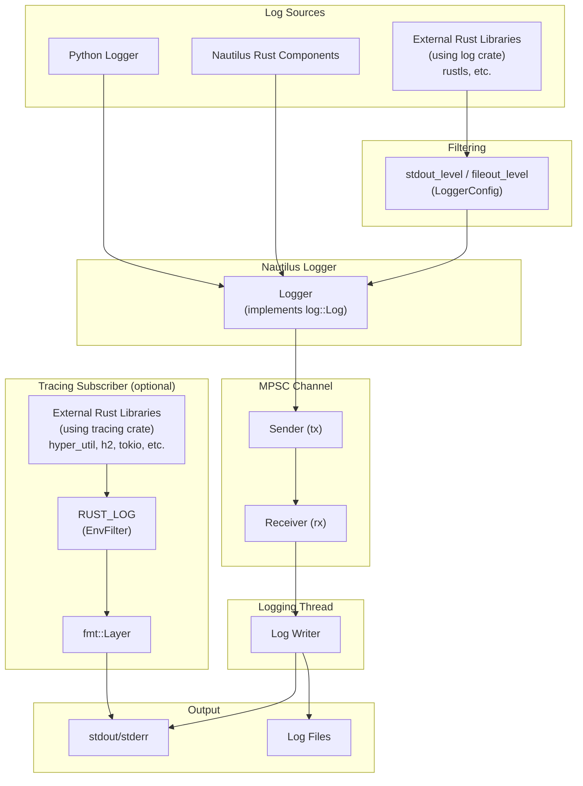

# Logging

The platform provides logging for both backtesting and live trading using a high-performance logging subsystem implemented in Rust
with a standardized facade from the `log` crate.

The core logger operates in a separate thread and uses a multi-producer single-consumer (MPSC) channel to receive log messages.
This design ensures that the main thread remains performant, avoiding potential bottlenecks caused by log string formatting or file I/O operations.

Logging output is configurable and supports:

- **stdout/stderr writer** for console output
- **file writer** for persistent storage of logs

:::info
Infrastructure such as [Vector](https://github.com/vectordotdev/vector) can be integrated to collect and aggregate events within your system.
:::

## Architecture

The logging subsystem captures events from multiple sources and routes them through an MPSC channel to a dedicated logging thread:



- **Python and Nautilus components**: Log directly through the Nautilus Logger.
- **External `log` crate users**: Filtered by `stdout_level`/`fileout_level` in `LoggerConfig`.
- **External `tracing` crate users**: When enabled, output goes directly to stdout (separate from Nautilus logging), filtered by the `RUST_LOG` environment variable.
- **Logging thread**: All Nautilus log events are sent through an MPSC channel to a dedicated thread, ensuring the main thread isn't blocked by I/O operations.

## Configuration

Logging can be configured by importing the `LoggerConfig` object.
By default, log events with an `INFO` `LogLevel` and higher are written to stdout/stderr.

The following log levels are supported:

- `OFF` - Disable logging.
- `TRACE` - Most verbose level.
- `DEBUG` - Detailed diagnostic information.
- `INFO` - General operational messages.
- `WARNING` - Potential issues that don't prevent operation.
- `ERROR` - Errors that may affect functionality.

See the `LoggerConfig` [API Reference](/docs/python-api-latest/common.html#nautilus_trader.common.LoggerConfig) for further details.

Logging can be configured in the following ways:

- Minimum `LogLevel` for stdout/stderr.
- Minimum `LogLevel` for log files.
- Maximum size before rotating a log file.
- Maximum number of backup log files to maintain when rotating.
- Automatic log file naming with date or timestamp components, or custom log file name.
- Directory for writing log files.
- Plain text or JSON log file formatting.
- Filtering of individual components by log level.
- ANSI colors in log lines.
- Bypass logging entirely.
- Print Rust config to stdout at initialization.
- Truncate an existing log file on startup (`clear_log_file`).

### Standard output logging

Log messages are written to the console via stdout/stderr writers. Set the minimum level with
`stdout_level`.

### File logging

Log files are written to the current working directory by default. The naming convention and rotation behavior are configurable and follow specific patterns based on your settings.

Set the log directory and custom file basename with `FileWriterConfig.directory` and
`FileWriterConfig.file_name`.

**Log file formats:**

- `None` (default) - Plain text format with `.log` extension.
- `"json"` - JSON format with `.jsonl` extension, useful for log aggregation tools.

For detailed information about log file naming conventions and rotation behavior, see the [Log file rotation](#log-file-rotation) and [Log file naming convention](#log-file-naming-convention) sections below.

#### Log file rotation

Rotation behavior depends on both the presence of a size limit and whether a custom file name is provided:

- **Size‑based rotation**:
  - Set `FileWriterConfig.file_rotate` to a `(max_file_size, max_backup_count)` tuple, such as
    `(100_000_000, 5)` for 100 MB and five backup files.
  - When writing a log entry would make the current file exceed this size, the file is closed and a new one is created.
  - Rotation file names have millisecond resolution. If a rotation resolves to the active path,
    logging continues to that file, which may briefly exceed the configured maximum size.
- **Date-based rotation (default naming only)**:
  - Applies when `file_rotate` and `file_name` are both unset.
  - On the first write after each UTC date change (midnight), the current log file is closed and a new one is started, creating one file per UTC day.
- **No rotation**:
  - When `file_name` is set without `file_rotate`, logs continue to append to the same file.
  - Note: Size-based rotation takes precedence: if both a custom name and size limit are provided, rotation still occurs.
- **Backup file management**:
  - The second value in `file_rotate` limits the total number of rotated files kept.
  - When this limit is exceeded, the oldest backup files are automatically removed.

#### Log file naming convention

The default naming convention ensures log files are uniquely identifiable and timestamped.
The format depends on whether file rotation is enabled:

**With file rotation enabled**:

- **Format**: `{trader_id}_{%Y-%m-%d_%H%M%S-%3f}_{instance_id}.{log|jsonl}`
- **Example**: `TESTER-001_2025-04-09_210721-521_d7dc12c8-7008-4042-8ac4-017c3db0fc38.log`
- **Components**:
  - `{trader_id}`: The trader identifier (e.g., `TESTER-001`).
  - `{%Y-%m-%d_%H%M%S-%3f}`: UTC datetime with millisecond resolution.
  - `{instance_id}`: A unique instance identifier.
  - `{log|jsonl}`: File suffix based on format setting.

**Without size-based rotation (default naming)**:

- **Format**: `{trader_id}_{%Y-%m-%d}_{instance_id}.{log|jsonl}`
- **Example**: `TESTER-001_2025-04-09_d7dc12c8-7008-4042-8ac4-017c3db0fc38.log`
- **Components**:
  - `{trader_id}`: The trader identifier.
  - `{%Y-%m-%d}`: Date only (YYYY-MM-DD).
  - `{instance_id}`: A unique instance identifier.
  - `{log|jsonl}`: File suffix based on format setting.
- **Note**: With default naming and no size limit, logs rotate daily at UTC midnight.

**Custom naming**:

If `file_name` is set (e.g., `my_custom_log`):

- With rotation disabled: The file will be named exactly as provided (e.g., `my_custom_log.log`).
- With rotation enabled: The file will include the custom name and timestamp (e.g., `my_custom_log_2025-04-09_210721-521.log`).

### Component log filtering

The `component_levels` parameter sets log levels for individual components.
The input value should be a dictionary of component ID strings to log level strings: `dict[str, str]`.

Below is an example of a trading node logging configuration that includes some of the options mentioned above:

```python
from nautilus_trader.common import LogLevel
from nautilus_trader.config import FileWriterConfig
from nautilus_trader.config import LoggerConfig
from nautilus_trader.config import LiveNodeConfig
from nautilus_trader.model import TraderId

config_node = LiveNodeConfig(
    trader_id=TraderId.from_str("TESTER-001"),
    logging=LoggerConfig(
        stdout_level=LogLevel.INFO,
        fileout_level=LogLevel.DEBUG,
        component_levels={"Portfolio": "INFO"},
        file_config=FileWriterConfig(file_format="json"),
    ),
)
```

For backtesting, the `BacktestEngineConfig` class can be used instead of `LiveNodeConfig`, as the same options are available.

### Environment variable configuration

The `NAUTILUS_LOG` environment variable provides an alternative way to configure logging using a semicolon-separated spec string. This is useful for Rust-only binaries or when you want to override logging settings without modifying code.

```bash
export NAUTILUS_LOG="stdout=Info;fileout=Debug;RiskEngine=Error;is_colored"
```

**Supported keys:**

| Key                   | Type      | Description                                      |
| --------------------- | --------- | ------------------------------------------------ |
| `stdout`              | Log level | Maximum level for stdout output.                 |
| `fileout`             | Log level | Maximum level for file output.                   |
| `is_colored`          | Flag      | Enable ANSI colors (default: true).              |
| `print_config`        | Flag      | Print config to stdout at startup.               |
| `log_components_only` | Flag      | Only log components with explicit filters.       |
| `<Component>`         | Log level | Component‑specific level (exact match).          |
| `<module::path>`      | Log level | Module‑specific level (prefix match, Rust only). |

Flags are enabled by their presence in the spec string (no value needed). Log levels are case-insensitive: `Off`, `Trace`, `Debug`, `Info`, `Warn`, `Error`.

:::note
For Rust-only binaries, the logging subsystem initializes lazily on first use. Setting
`NAUTILUS_LOG` configures it without requiring explicit `init_logging()` calls.
:::

### Components-only logging

When focusing on a subset of noisy systems, enable `log_components_only` to log messages only from
components listed in `component_levels`. All other components are suppressed regardless of the
global stdout or file level.

Example (Python configuration):

```python
logging = LoggerConfig(
    stdout_level=LogLevel.INFO,
    component_levels={
        "RiskEngine": "DEBUG",
        "Portfolio": "INFO",
    },
    log_components_only=True,
)
```

If configuring via the environment using the Rust spec string, include `log_components_only` alongside component filters, for example:

```bash
export NAUTILUS_LOG="stdout=Info;log_components_only;RiskEngine=Debug;Portfolio=Info"
```

### Module path filtering (Rust only)

When using the `NAUTILUS_LOG` environment variable, you can filter by Rust module paths in addition to component names. Keys containing `::` are treated as module path filters with prefix matching, while keys without `::` are component filters with exact matching.

```bash
# Filter all OKX adapter modules to Warn, but allow Debug for the websocket modules
export NAUTILUS_LOG="stdout=Info;nautilus_okx::=Warn;nautilus_okx::websocket=Debug"
```

The longest matching prefix takes precedence. In the example above, `nautilus_okx::websocket::handler` would use the `Debug` level (longer prefix), while `nautilus_okx::data` would use `Warn`.

:::tip
Rust log macros automatically capture the module path when no explicit component is provided. This enables module-level filtering to work with standard logging calls.
:::

:::note
Module path filtering is only available via the `NAUTILUS_LOG` environment variable. The Python
`component_levels` configuration uses component name matching only.
:::

:::warning
If `log_components_only=True` (or `log_components_only` is present in the spec string) and
`component_levels` is empty, no log messages will be emitted to stdout/stderr or files. Add at
least one component filter or disable components‑only logging.
:::

### Log colors

ANSI color codes improve log readability in terminals.
In environments that do not support ANSI color rendering (such as some cloud environments or text editors),
these color codes may not be appropriate as they can appear as raw text.

Set `LoggerConfig.is_colored=False` for these environments.

## Using a logger directly

It's possible to use `Logger` objects directly, and these can be initialized anywhere (very similar to the Python built-in `logging` API).

If you ***aren't*** using an object which already initializes a `NautilusKernel` (and logging) such as `BacktestEngine` or `LiveNode`,
then you can activate logging in the following way:

```python
from nautilus_trader.common import init_logging
from nautilus_trader.common import Logger
from nautilus_trader.common import LogLevel
from nautilus_trader.core import UUID4
from nautilus_trader.model import TraderId

log_guard = init_logging(
    trader_id=TraderId.from_str("TESTER-001"),
    instance_id=UUID4(),
    level_stdout=LogLevel.INFO,
)
logger = Logger("MyLogger")
```

See the [`init_logging` API Reference](/docs/python-api-latest/common.html) for further details.

Keep the returned `LogGuard` alive for as long as direct logging is needed. The logging subsystem
supports up to 255 concurrent guards.

## LogGuard: managing log lifecycle

`init_logging` returns a `LogGuard` that tracks one user of the process‑global logging subsystem.
`BacktestEngine` and `LiveNode` own their guards internally, so application code does not need to
acquire a guard from an engine or node.

### Reference counting implementation

The logging system uses reference counting to track active `LogGuard` instances:

- **Counter increments**: When a new `LogGuard` is created, an atomic counter is incremented.
- **Counter decrements**: When a `LogGuard` is dropped, the counter is decremented.
- **Last guard**: When the counter reaches zero, pending file logs are flushed and synced. The
  process‑global logging thread stays available for later guards.
- **Maximum guards**: The system supports up to 255 concurrent `LogGuard` instances. Attempting to create more raises a `ValueError` from `init_logging`, or a `RuntimeError` from engine or node creation.

Abrupt termination can still lose buffered logs. Dispose engines and nodes normally, and retain the
guard returned by direct `init_logging` calls until the application no longer needs logging.

## Tracing subscriber for external Rust libraries

External Rust crates that use the `tracing` crate can have their log output displayed by enabling
the tracing subscriber. This is useful for debugging external dependencies or when integrating
custom Rust components (such as feature extractors or adapters) compiled as separate PyO3 extensions.

### Enabling the subscriber

Initialize the tracing subscriber directly:

```python
from nautilus_trader.common import init_tracing

init_tracing()
```

### Filtering with RUST_LOG

The `RUST_LOG` environment variable controls which tracing events are displayed:

```bash
# Show debug logs from your crate, warn and above from hyper
RUST_LOG=my_feature_extractor=debug,hyper=warn python my_script.py
```

If `RUST_LOG` is not set, the default filter level is `warn`.

### How it works

The tracing subscriber uses a `tracing-subscriber` fmt layer with a custom formatter to output
directly to stdout. This is separate from the Nautilus logging infrastructure - tracing output
uses a Nautilus-aligned format with nanosecond timestamps.

Example tracing output:

```
2026-01-24T05:51:42.809619000Z [DEBUG] hyper_util::client::legacy::connect::http: connecting to 104.18.5.240:443
2026-01-24T05:51:42.810543000Z [DEBUG] hyper_util::client::legacy::pool: pooling idle connection for ("https", api.example.com)
```

**Differences from Nautilus logging:**

- Tracing output goes directly to stdout, not through the Nautilus logging thread.
- Tracing events are not written to Nautilus log files.
- Filtering is controlled exclusively by `RUST_LOG`, independent of `LoggerConfig`.

For external libraries that use the `log` crate (such as `rustls`), their events go through
the Nautilus logger and are filtered by `stdout_level`/`fileout_level` in `LoggerConfig`.

:::tip
`RUST_LOG` only affects crates using `tracing`. For crates using `log`, configure verbosity through
`LoggerConfig` or the `NAUTILUS_LOG` environment variable (e.g., `NAUTILUS_LOG=stdout=Debug`).
:::

:::note
The tracing subscriber can only be initialized once per process. A second `init_tracing()` call
raises an error.
:::

## Platform-specific considerations

### Windows shutdown behavior

On Windows, non-deterministic garbage collection during interpreter shutdown can occasionally
delay the final `LogGuard` drop until after interpreter teardown has begun. Dropping the last
guard is what flushes and syncs pending file logs, so a delayed drop can result in truncated
logs.

## Related guides

- [Architecture](architecture.md) - System architecture including logging infrastructure.
