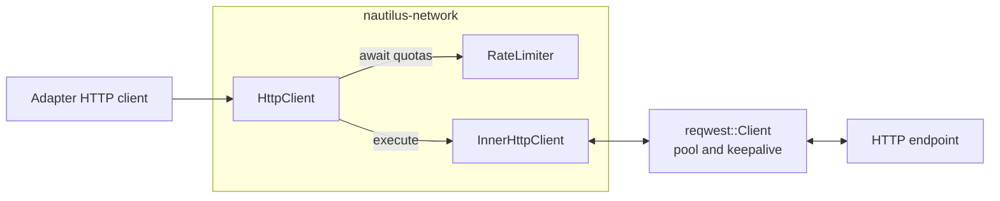
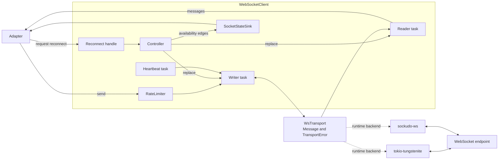
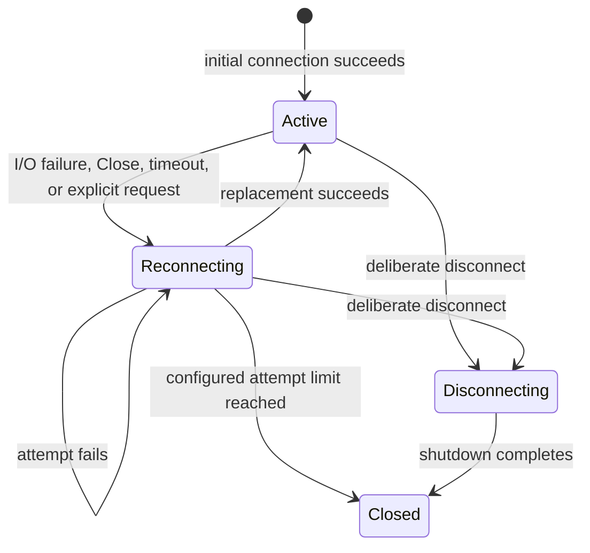
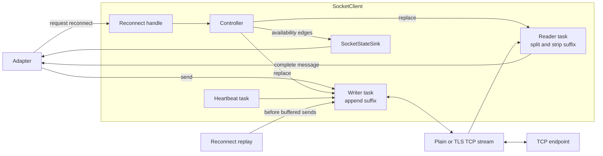
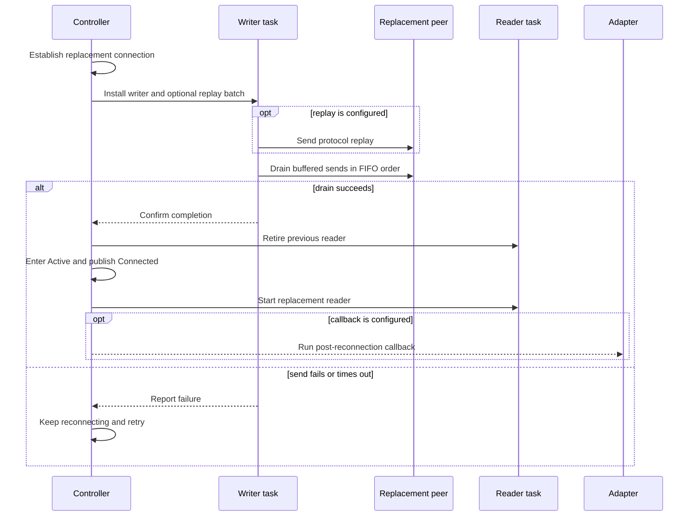

# Networking

NautilusTrader adapters use the shared `nautilus-network` clients for HTTP request/response APIs,
WebSocket streams, and suffix-framed TCP protocols. These clients add trading-system policy around
the underlying Rust transports: rate limits, connection reuse, liveness checks, reconnect control,
replay coordination, and bounded reads.

| Client         | Underlying transport                | Use when                           | Added policy                                                                                    |
| -------------- | ----------------------------------- | ---------------------------------- | ----------------------------------------------------------------------------------------------- |
| HTTP           | `reqwest`                           | Finite request/response operations | Layered quotas, pooled connections, keepalive, timeouts, proxy routing, and bounded bodies      |
| WebSocket      | `tokio-tungstenite` or `sockudo-ws` | Long-lived framed streams          | Runtime backend selection, quotas, heartbeats, liveness checks, reconnects, and session fencing |
| Raw TCP socket | Tokio and `rustls`                  | Suffix-framed byte streams         | Framing, initial retries, heartbeats, liveness checks, reconnects, and ordered replay           |

The [Adapters](adapters.md) guide explains how venue clients translate these transports into
Nautilus domain messages. This page covers the shared transport behavior beneath that boundary.

## HTTP client

[`HttpClient`](../../crates/network/src/http/client.rs) wraps one reusable `reqwest::Client` and one
or more shared rate limiters. A request waits for every applicable quota before the inner client
builds and executes it.



The outer client applies quota policy; the reusable inner client owns connection and response
policy.

### Rate limiting and requests

The rate limiter uses the generic cell rate algorithm (GCRA) with a default quota and optional
per-key overrides. A request can carry several keys, such as an endpoint and an order scope, and
waits for them together. Multiple limiters let one request consume independent budgets, such as
per-IP and per-account limits. Sharing their `Arc` values across HTTP clients keeps those budgets
process-wide instead of creating one allowance per connection.

The client accepts default and per-request headers, query parameters with repeated values, raw
request bodies, and `GET`, `POST`, `PUT`, `PATCH`, and `DELETE` methods. A client-level timeout applies to
all requests unless a request supplies its own timeout. An optional proxy applies to both HTTP and
HTTPS traffic.

HTTP status errors remain normal `HttpResponse` values so each adapter can interpret the venue's
body and retry rules. The client reports transport and timeout failures but does not retry requests
automatically. Adapters can wrap retryable operations with the separate
[`RetryManager`](../../crates/network/src/retry.rs), but the adapter must decide which venue errors
and operations are safe to retry.

### Connection reuse and response bounds

Each client enables `TCP_NODELAY`, keeps up to 32 idle connections per host, and retains an idle
connection for up to 60 seconds. HTTP/2 connections send keepalive probes every 30 seconds even
while idle and use adaptive flow-control windows. Reusing a client preserves the pool and avoids a
new TCP and TLS handshake for each request.

Responses contain the status, only the header names selected when the client was built, and the raw
body bytes. The client rejects a declared body larger than 100 MiB before reading it. For chunked
or unbounded responses, it stops as soon as accumulated bytes would cross the same limit. Endpoints
whose path or query can contain credentials can use the redacted request path, which removes the URL
from transport errors and logs.

## WebSocket client

[`WebSocketClient`](../../crates/network/src/websocket/client.rs) separates connection lifecycle
from frame transport. A controller owns reconnect and shutdown transitions, one writer serializes
all sink access, and handler mode assigns each connection to one reader task. An optional heartbeat
task sends liveness traffic through the same writer.



The lifecycle tasks use one neutral transport interface, so adapters do not depend on a concrete
WebSocket library.

### Connection modes

| Mode    | Reader ownership       | Automatic reconnect            | Liveness behavior                              |
| ------- | ---------------------- | ------------------------------ | ---------------------------------------------- |
| Handler | Internal callback task | Exponential backoff and jitter | Heartbeat and application-data idle timeouts   |
| Stream  | Caller-owned reader    | Disabled                       | Caller reports failure and replaces the client |

Handler mode is the usual choice for long-lived adapter connections. Stream mode suits adapters
that need direct stream backpressure or own a protocol-specific reconnect sequence.

### Transport backends

The `WsTransport` abstraction normalizes text, binary, Ping, Pong, and Close frames together with
transport errors. `WebSocketConfig.backend` selects either backend at runtime:

| Backend                                                              | Availability                                 | Upgrade headers                           | Proxy behavior                   |
| -------------------------------------------------------------------- | -------------------------------------------- | ----------------------------------------- | -------------------------------- |
| [`tokio-tungstenite`](https://github.com/snapview/tokio-tungstenite) | Always compiled                              | Passed through the WebSocket handshake    | HTTP and HTTPS `CONNECT` tunnels |
| [`sockudo-ws`](https://github.com/sockudo/sockudo-ws)                | Default with the `transport-sockudo` feature | Passed through a local HTTP/1.1 handshake | HTTP and HTTPS `CONNECT` tunnels |

Disabling default Cargo features removes `sockudo-ws` and makes Tungstenite the default. A recognized
SOCKS proxy URL logs a warning and connects directly because WebSocket SOCKS tunneling is not
implemented. Malformed proxy URLs and other unsupported schemes return an error. Both backends use
`rustls` for `wss://` connections and set `TCP_NODELAY` on paths where Nautilus creates the TCP stream.

### Liveness and recovery

The configured heartbeat sends either an RFC 6455 Ping or a venue-specific text message at a fixed
interval. Configuring one also arms a response deadline: sending a heartbeat establishes that the
peer answers it, so an unset `heartbeat_timeout_secs` defaults to three intervals. Set the field to
choose a different window. A transport with no heartbeat gets no default, because nothing would
guarantee the inbound frames needed to keep the window open.

The heartbeat timeout resets on every inbound frame, including Ping and Pong, so it detects a peer
that has stopped sending anything. The separate idle timeout resets only on text or binary
application data, so control traffic cannot hide a silent market-data stream. A venue that answers
the keepalive with a text payload refreshes the idle timeout exactly like real data does, so that
window means something only when it sits below the heartbeat interval.

An unset timeout leaves that detection off, except that an unset `heartbeat_timeout_secs` still
derives three intervals when a heartbeat is configured. A zero timeout is rejected. Adapters that
expose a non-optional integer map zero to unset rather than passing it through.

A read failure, write failure, Close frame, heartbeat timeout, idle timeout, or explicit reconnect
request moves a handler-mode client into reconnecting state. Reconnect uses exponential backoff with
bounded jitter and allows unlimited attempts by default. A replacement connection that remains
active for at least 10 seconds resets the attempt count and backoff. A configured maximum closes
the client after that many consecutive failed or short-lived attempts.



Handler mode publishes `Disconnected` on entry to `Reconnecting` and `Connected` on recovery;
individual attempts and deliberate disconnects add no state-sink edges.

The writer installs the replacement sink before the controller starts its reader and publishes the
reconnect notification. A connection epoch advances with each sink replacement. Reader fences drop
frames from retired sessions, while epoch-aware handlers and sends let an adapter bind work to the
transport that produced it. Mutable reconnect headers apply to later handshakes without interrupting
the active connection.

Adapters can register an `AuthTracker` so a disconnect invalidates authentication. They can also
gate the reconnect buffer on that tracker, making messages wait for the new session to authenticate
and discarding the remaining buffer if authentication fails. `SubscriptionState` separately records
confirmed, pending subscribe, and pending unsubscribe intent for adapter-driven resubscription; it
never sends protocol messages itself.

### Reconnect throttling

Once three reconnect attempts occur inside a rolling two-minute window, each further attempt waits
at least one second, regardless of the configured backoff. The window is purely time-based: a
replacement connection that survives the stability threshold still resets the backoff and attempt
count, but has no effect on the floor. Throttling lifts by itself once fewer than three attempts
remain inside the window.

Venues rate-limit new connections per IP (Binance permits 300 connections per five minutes, OKX
three per second), so an unthrottled reconnect loop can otherwise escalate a transient drop into an
IP-level throttle or ban affecting every client behind that address. The first attempts in any
window are never delayed, so a single drop still recovers immediately.

### State reporting and explicit reconnect

Clients configured with a `SocketStateSink` publish ordered `Connected` and `Disconnected`
availability edges. A successful initial connection publishes `Connected`; transport loss or an
accepted explicit reconnect publishes `Disconnected`; and a successful replacement publishes
`Connected`. Initial connection failure, individual retry attempts, retry exhaustion, deliberate
disconnect, and client drop do not add events. The sink therefore describes transport availability,
not every internal `ConnectionMode` transition. Its callback runs synchronously and serializes
edges, so it must return promptly and must not request another transition through the same sink.

`request_reconnect()` atomically asks a handler-mode controller to replace its active transport. A
cloneable `WebSocketReconnectHandle` gives adapter tasks the same capability without ownership of
the client and distinguishes accepted, already reconnecting, disconnecting, closed, and unsupported
requests.
An accepted request invalidates registered authentication state and publishes `Disconnected` before
the replacement can become active. Stream mode reports `Unsupported` because its reader is
caller-owned.

### Send semantics

Application text and binary sends wait for their rate-limit keys and for an active connection. The
ordinary send methods return after enqueueing the frame, so success does not prove delivery. The
writer keeps FIFO order for application messages buffered during reconnect or after a failed write
and replays them on a replacement connection. A control frame belongs to the connection it was
issued on, so a failed Ping, Pong, or Close is dropped rather than replayed. This in-memory buffer
provides reconnect continuity, not durable or exactly-once delivery.

Ownership-bound text sends take an expected connection epoch and wait for the writer result. They
fail if ownership changes and never replay on another connection. If a bound write times out after
it starts, delivery is undetermined and the caller must not retry blindly. Connection-bound Pong
sends use the same epoch check so a response cannot leak onto the connection after the one that
received its Ping.

### Backend benchmarks

The [latest checked-in network benchmark](../../crates/network/benches/BENCHMARKS.md) was measured on
2026-07-29. The following 512 B results are the median of three back-to-back runs on the same AMD
Ryzen Threadripper 9980X host:

| Metric                            | `tokio-tungstenite 0.30.0` | `sockudo-ws 2.0.1`       |
| --------------------------------- | -------------------------: | -----------------------: |
| Round-trip text latency, p99      | 3.305 us                   | 0.651 us                 |
| One-way binary burst latency, p99 | 17.647 us                  | 15.053 us                |
| Text receive throughput           | 7.187 million messages/s   | 8.504 million messages/s |
| Text send throughput              | 6.400 million messages/s   | 7.207 million messages/s |
| Text round-trip throughput        | 0.530 million messages/s   | 1.852 million messages/s |

Across the measured 64 B, 512 B, and 4,096 B payloads, `sockudo-ws 2.0.1` reduced round-trip p99
latency by 73% to 82%. At 512 B it processed 18% more receives, 13% more sends, and 250% more round
trips.

These are backend frame-transport microbenchmarks over established, uncompressed 1 MiB in-memory
Tokio duplex streams. They exclude DNS, TCP connect, TLS, HTTP upgrade, kernel network I/O,
external latency, keepalive traffic, and the reconnecting client lifecycle. The report does not
publish HTTP or raw TCP client results, and its absolute values should only be compared on the same
machine.

## Raw TCP socket client

[`SocketClient`](../../crates/network/src/socket/client.rs) supports plain and TLS byte streams for
protocols that delimit messages with a fixed suffix. A controller coordinates the connection, one
reader splits inbound frames, and one writer appends the suffix while serializing concurrent sends.



The writer owns framing and replay order; the adapter receives complete messages without the
configured suffix.

### Framing and liveness

The suffix must contain at least one byte and applies in both directions. The reader retains a
partial frame across reads and strips the suffix before invoking the callback. While the session
remains active, it emits complete messages in arrival order. If an unterminated frame grows past
10 MiB, the reader stops and the controller reconnects instead of allowing unchecked memory growth.

An optional heartbeat task sends a configured byte payload at a fixed interval; the writer appends
the same suffix as it does for application messages. A raw socket has no Ping frames, so the
payload is required. `heartbeat_timeout_secs` stops the reader when no bytes arrive within the
window. Unset, it defaults to three intervals when a heartbeat is configured and leaves detection
off otherwise. A zero timeout is rejected. The socket enables `TCP_NODELAY` to avoid Nagle delays
for small protocol messages.

### Connection and TLS policy

The client accepts `host:port` or URL input and supports plain or TLS mode. TLS uses the standard
web PKI roots. A certificate directory can add trusted roots and, when it contains a matching
certificate and private key, supply a client identity for mutual TLS.

Initial connection establishment makes up to five attempts by default, with a 10-second bound per
attempt and exponential backoff. Once connected, transport loss uses the configurable reconnect
timeout, exponential backoff, bounded jitter, and unlimited attempts by default. As with the
WebSocket client, 10 seconds of stable uptime resets the reconnect cycle, and the same reconnect
throttling bounds its attempt rate once reconnects flap. An optional state sink reports semantic
connection loss and recovery.

### State reporting and explicit reconnect

The optional `SocketStateSink` has the same availability contract as the WebSocket client. It
publishes `Connected` after successful initial connection, `Disconnected` when an active transport
enters reconnect, and `Connected` after recovery. It omits initial failures, individual attempts,
retry exhaustion, deliberate disconnect, and drop. Its synchronous callback must return promptly
and must not request another transition through the same sink.

`request_reconnect()` atomically asks the controller to replace an active plain or TLS transport.
The cloneable `SocketReconnectHandle` lets adapter tasks make that request without owning the client
and reports whether it was accepted or rejected because the client is already reconnecting,
disconnecting, or closed. An accepted request publishes `Disconnected` before waking the controller;
normal reconnect replay and buffer ordering then apply to the replacement.

### Replay and delivery boundaries

During reconnect, the writer buffers application messages in FIFO order. After installing a
replacement writer, it can first send protocol replay messages supplied by the adapter, such as a
logon or session setup sequence, and then drain the buffered application messages. The replacement
reader starts only after that drain succeeds. A post-reconnection callback runs after the writer,
buffer, and reader are ready.



A raw TCP replacement becomes active only after optional protocol replay and buffered application
messages drain successfully; the reader and post-reconnection callback start afterward.

`send_bytes` returns when the message enters the writer channel, not when the peer receives it. A
concurrent disconnect can still prevent delivery. Reconnect replay and buffering are process memory,
so protocols that require durable or exactly-once delivery must enforce those guarantees above the
socket client.

## TCP socket options

The WebSocket and raw TCP socket clients apply the same options to every outbound connection,
including the hop to an HTTP `CONNECT` proxy. The HTTP client is not covered: `reqwest` owns its own
sockets and its own pooling.

| Option             | Value                           | Detects or prevents                                       |
| ------------------ | ------------------------------- | --------------------------------------------------------- |
| `TCP_NODELAY`      | Enabled                         | Nagle delaying a small frame behind an unacknowledged one |
| Keepalive          | 20 s idle, 10 s apart, 3 probes | An idle peer that has gone away without closing           |
| `TCP_USER_TIMEOUT` | 1 minute, Linux only            | Outbound data that is never acknowledged                  |

These catch a connection that stops delivering without closing, which a NAT or load balancer
produces when it drops state with no `FIN` and no `RST`. Writes keep succeeding into the send buffer
and return `Ok` for messages the peer will never receive. Kernel defaults take roughly 15 minutes to
give up; these bound that at about a minute.

`TCP_USER_TIMEOUT` is sized to exceed the keepalive probe budget. On Linux it also overrides
`TCP_KEEPCNT`, so detection there follows the timeout rather than the probe count, which applies on
macOS and Windows.

Treat them as a backstop. The heartbeat timeout usually fires first, and unlike it these need no
configuration and still bound a connection whose reader task has stopped making progress. A socket
that rejects an option is still usable, so failures are logged and the connection proceeds.

## Testing

The network crate separates algorithm checks from operating-system I/O and simulated failure
topologies. This keeps a failure local: a state-machine invariant should fail without a socket, wire
behavior should fail against a small loopback peer, and reconnect races should fail under a
reproducible network schedule.

### Unit and component tests

Tests beside the implementation cover configuration validation, state transitions, rate limits,
backoff, retry budgets, framing, transport conversion, authentication, subscription state, and
reconnect buffer policy. Pure logic uses fake clocks and direct state models. Async task tests use
paused Tokio time, in-memory duplex streams, injected transports, or an ephemeral loopback server so
they can exercise the real reader, writer, heartbeat, and controller tasks without an external
service.

The client suites then test their own protocol boundary. HTTP tests cover request serialization,
response headers and body limits, timeouts, proxy behavior, and URL redaction. WebSocket and raw TCP
tests cover concurrent sends, liveness timeouts, framing, connection epochs, state sinks, explicit
reconnect, replay order, and shutdown races. The shared TLS tests cover certificate loading and a
complete mutual-TLS handshake. A separate loopback integration suite exercises the WebSocket HTTP
`CONNECT` proxy path for plain `ws://` upstreams.

### Property tests

[`proptest`](https://github.com/proptest-rs/proptest) generates values and operation traces for
invariants that example cases cannot enumerate. The suites compare GCRA decisions with a reference
model, check backoff and retry bounds, round-trip transport messages through both WebSocket
backends, and exercise authentication, subscription, and reconnect-buffer state machines. Selected
suites persist minimized failures in `crates/network/proptest-regressions` so a discovered case
becomes a permanent regression test.

### Deterministic network simulation

[`turmoil`](https://github.com/tokio-rs/turmoil) tests compile the production raw TCP and WebSocket
clients against simulated TCP types through the crate's `net` seam. Fixed seeds make failures
reproducible. Stressed runs vary task order and message latency, while scenarios inject connection
drops, partitions and repairs, stalled peers, handshake failures, and disconnects during backoff or
recovery. Assertions cover eventual state, attempt limits, heartbeat behavior, message ordering,
authentication gating, and clean shutdown. Separate suites exercise the Tungstenite and Sockudo
backends over the same simulated protocol.

Default tests keep real Tokio loopback networking and exclude the simulation-only suites. Enabling
the `turmoil` feature swaps the TCP layer and includes those suites:

```bash
cargo nextest run -p nautilus-network
cargo nextest run -p nautilus-network --features turmoil
```
