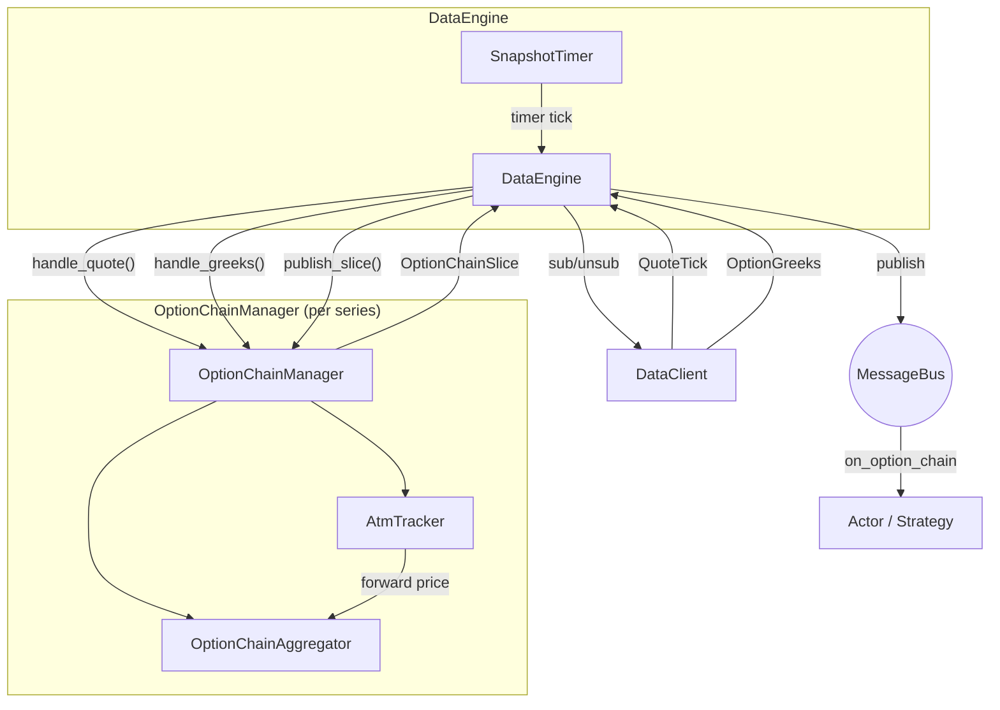

# Options

Nautilus provides first-class support for options trading across traditional
and crypto markets. This includes option-specific instrument types, venue-provided
Greeks streaming, option chain aggregation, and a local Black-Scholes Greeks calculator
for risk management.

## Option instrument types

The platform defines several option instrument types:

| Instrument           | Description                                                                  |
|----------------------|------------------------------------------------------------------------------|
| `OptionContract`     | Exchange‑traded option on an underlying with strike and expiry.              |
| `OptionSpread`       | Exchange‑defined multi‑leg option strategy as one line.                      |
| `CryptoOption`       | Crypto option with crypto quote/settlement; inverse or quanto style.         |
| `CryptoOptionSpread` | Crypto option spread with inverse, settlement currency, and fractional size. |
| `BinaryOption`       | Fixed‑payout option that settles to 0 or 1.                                  |

Greeks-relevant metadata varies by instrument type:

- `OptionContract`, `CryptoOption`: full Greeks inputs including `strike_price`,
  `option_kind` (CALL/PUT), `expiration_utc`, `underlying`, `multiplier`.
- `OptionSpread`, `CryptoOptionSpread`: a combination of up to 4 option legs,
  each weighted by a ratio. Has `underlying`, `expiration_utc`, and
  `strategy_type` (vertical, calendar, straddle, etc.). Per-leg `strike_price`
  and `option_kind` live on each leg's `OptionContract`/`CryptoOption`, not on
  the spread itself. Greeks are computed per leg and aggregated. Spreads are
  commonly used for orders (the exchange executes as a single order), while
  the individual legs appear as positions. `CryptoOptionSpread` additionally
  carries `is_inverse` and `settlement_currency` for venues like Deribit.
- `BinaryOption`: has `expiration_utc` and `outcome`/`description`, but no
  `strike_price`, `option_kind`, or `underlying`.

## Subscribing to Greeks

Venues like Deribit, Bybit, and OKX publish real-time Greeks alongside their options markets.
Nautilus provides two subscription levels:

- **Per-instrument Greeks**: subscribe to individual option contracts.
- **Option chain slices**: subscribe to an aggregated view of an entire option series.

### Per-instrument Greeks

Subscribe to venue-provided Greeks for a single option contract from an actor or strategy:

```python
from nautilus_trader.model.identifiers import ClientId

client_id = ClientId("DERIBIT")
self.subscribe_option_greeks(instrument_id, client_id=client_id)
```

Handle incoming updates by implementing the `on_option_greeks` handler:

```python
def on_option_greeks(self, greeks) -> None:
    self.log.info(
        f"{greeks.instrument_id}: "
        f"delta={greeks.delta:.4f} gamma={greeks.gamma:.6f} "
        f"vega={greeks.vega:.4f} theta={greeks.theta:.4f} "
        f"mark_iv={greeks.mark_iv} underlying={greeks.underlying_price}"
    )
```

To stop receiving updates:

```python
self.unsubscribe_option_greeks(instrument_id, client_id=client_id)
```

### Option chain subscriptions

An option chain subscription aggregates quotes and Greeks across all strikes in an
option series into `OptionChainSlice` snapshots. The `DataEngine` creates one Rust
`OptionChainManager` per series and owns the lifecycle: creating the manager, routing
incoming data, running snapshot timers, and draining wire subscription changes.

```python
from nautilus_trader.core import nautilus_pyo3

series_id = nautilus_pyo3.OptionSeriesId(...)  # identifies the series (venue, underlying, expiry)

# Subscribe to 5 strikes above and below ATM, snapshot every 1000ms
strike_range = nautilus_pyo3.StrikeRange.atm_relative(strikes_above=5, strikes_below=5)
self.subscribe_option_chain(
    series_id,
    strike_range=strike_range,
    snapshot_interval_ms=1000,
)
```

Handle snapshots by implementing the `on_option_chain` handler:

```python
def on_option_chain(self, chain) -> None:
    for strike in chain.strikes():
        call = chain.get_call(strike)
        put = chain.get_put(strike)
        if call and call.greeks:
            self.log.info(f"Call {strike}: delta={call.greeks.delta:.4f}")
```

### Strike range filtering

`StrikeRange` controls which strikes are active in a chain subscription:

| Variant       | Description                                         | Example                                        |
|---------------|-----------------------------------------------------|------------------------------------------------|
| `Fixed`       | Subscribe to an explicit set of strikes.            | `nautilus_pyo3.StrikeRange.fixed([...])`       |
| `AtmRelative` | N strikes above and N below the current ATM strike. | `nautilus_pyo3.StrikeRange.atm_relative(5, 5)` |
| `AtmPercent`  | All strikes within a percentage band around ATM.    | `nautilus_pyo3.StrikeRange.atm_percent(0.10)`  |
| `Delta`       | Strikes whose call or put delta is near a target.   | `nautilus_pyo3.StrikeRange.delta(0.25, 0.05)`  |

For ATM-based variants, subscriptions are deferred until the ATM price is determined.
ATM is derived from the forward price embedded in venue-provided `OptionGreeks` updates
(the `underlying_price` field). It can also be seeded from an initial forward price
fetched via HTTP, allowing instant bootstrap before live WebSocket ticks arrive. As ATM
shifts, the active strike set rebalances automatically.

`Delta` resolves from venue-provided Greeks: a strike is active when its call or put delta
magnitude (calls positive, puts negative, compared by absolute value) falls within
`tolerance` of `target`. A typical out-of-the-money target such as `0.25` selects a strike on
each side of ATM. Before the ATM/forward price is known, `Delta` is deferred like other
ATM-based ranges. After ATM is known, when no active strike's Greeks match the band
(including before any Greeks arrive), `Delta` falls back to an ATM-relative window of five
strikes either side of ATM. Before switching from the fallback window to selected delta
strikes, the aggregator waits until every fallback leg has Greeks so partial early updates do
not drop neighbouring strikes.

### Snapshot vs. raw mode

The `snapshot_interval_ms` parameter controls publishing behavior:

- **Snapshot mode** (`snapshot_interval_ms=1000`): Quotes and Greeks accumulate in a
  buffer and publish as an `OptionChainSlice` on a timer. Suitable for periodic
  portfolio rebalancing or UI display.
- **Raw mode** (`snapshot_interval_ms=None`): Each quote or Greeks update publishes
  a slice immediately. Suitable for latency-sensitive strategies that react to
  individual updates.

## Backtesting option chains

Option-chain backtests use the same `OptionChainManager` and `OptionChainAggregator`
path as live subscriptions. The prerequisite is a Nautilus Parquet catalog that
already contains the option instruments and the per-instrument data needed for the
chain:

- `QuoteTick` records for each option contract, carrying the replayed best bid and offer.
- `OptionGreeks` records for each option contract, carrying delta, implied volatility,
  convention, and the `underlying_price` used to seed ATM.
- `CryptoOption` or `OptionContract` instruments for the same instrument IDs.

Tardis replays satisfy this contract when option book snapshots or quotes are written
as `QuoteTick` and `option_summary` messages are written as `OptionGreeks`. The
backtest does not download or request missing catalog data during the run.

Configure a `BacktestNode` run with both data streams for the option instruments in
the series:

```python
data = [
    BacktestDataConfig(
        data_type="QuoteTick",
        catalog_path="/path/to/catalog",
        instrument_ids=option_instrument_ids,
    ),
    BacktestDataConfig(
        data_type="OptionGreeks",
        catalog_path="/path/to/catalog",
        instrument_ids=option_instrument_ids,
    ),
]
```

Then subscribe from the strategy:

```python
strike_range = StrikeRange.delta(0.25, 0.05)
self.subscribe_option_chain(
    series_id,
    strike_range=strike_range,
    snapshot_interval_ms=1000,
)
```

Use `snapshot_interval_ms=None` for raw mode. Raw mode publishes a slice after each
quote or Greeks update that changes the active chain. Use an integer interval for
thinned snapshots. Thinned mode accumulates the latest BBO and Greeks per instrument
and publishes the chain on the timer cadence, reducing event volume for large chains.

Each `OptionChainSlice` joins the latest BBO and Greeks by instrument, then groups
the result by strike and option kind. A quote can arrive before Greeks, and Greeks
can arrive before a quote; the aggregator keeps latest state and attaches both when
available. The `underlying_price` in `OptionGreeks` drives ATM detection.

Selection can happen either in the subscription range or inside the strategy:

- Moneyness: use `StrikeRange.atm_relative(...)` or `StrikeRange.atm_percent(...)`.
- Delta: use `StrikeRange.delta(target, tolerance)`, or inspect `entry.greeks.delta`
  in `on_option_chain`.
- Strike: use `StrikeRange.fixed([...])`, or read `chain.get_call(strike)` and
  `chain.get_put(strike)`.

Matching is quote-driven for options. Market orders and marketable limits fill as
takers against the opposing replayed BBO. Passive limit orders rest on the simulated
book and can fill as makers when later BBO updates trade through the limit price.
The model does not simulate L2 queue position for options.

Structural option fee models are configured on the simulated venue, not inferred
from the venue name:

```python
from decimal import Decimal

from nautilus_trader.execution import CappedOptionFeeModel
from nautilus_trader.execution import TieredNotionalOptionFeeModel

deribit_like = CappedOptionFeeModel(
    maker_rate=Decimal("0.0003"),
    taker_rate=Decimal("0.0003"),
)
okx_like = TieredNotionalOptionFeeModel(
    maker_rate=Decimal("0.0002"),
    taker_rate=Decimal("0.0005"),
)
```

Pass one of these objects as `fee_model` on `BacktestVenueConfig`. The Rust surface
uses `FeeModelAny::CappedOption(CappedOptionFeeModel::new(...))` and
`FeeModelAny::TieredNotionalOption(TieredNotionalOptionFeeModel::new(...))`.

See `examples/backtest/tardis_option_chain.py` and the Rust `tardis-option-chain`
example in `crates/backtest/examples/`.

## Option chain architecture

The option chain system is event-driven and built around per-series isolation. The
`DataEngine` creates one Rust `OptionChainManager` per subscribed option series. The
manager wraps `OptionChainAggregator` and `AtmTracker`, registers message bus handlers,
publishes snapshots, and queues wire subscription changes for the engine to drain. A
separate PyO3 `OptionChainManager` exposes the same aggregation core to Python.



### Component responsibilities

#### DataEngine

Holds one `OptionChainManager` per active `OptionSeriesId`. On
`SubscribeOptionChain`, it resolves instruments from the cache, requests forward
prices for ATM-based ranges, creates the manager, subscribes active instruments to
the data client, and sets up the snapshot timer. On each timer tick, the manager
checks for rebalances, publishes a snapshot, and queues any wire subscription
changes for the engine to drain. On `UnsubscribeOptionChain` or when all instruments
expire, it tears down the manager, cancels the timer, and unsubscribes wire-level feeds.

#### OptionChainManager

A per-series Rust manager around `OptionChainAggregator` and `AtmTracker`. The
`DataEngine` feeds it market data through `handle_quote()` and `handle_greeks()`.
In snapshot mode, timer callbacks call `publish_slice()`. In raw mode, each active
quote or Greeks update calls `publish_slice()` immediately. The Python-facing manager
has `handle_*` methods that return whether the first ATM price bootstrapped the active
instrument set; the Rust manager performs that bootstrap internally.

#### OptionChainAggregator

Accumulates quotes and Greeks into call/put buffers using keep-latest semantics.
Instruments that did not update since the last snapshot are still included. Greeks
that arrive before any quote for an instrument are held in a `pending_greeks`
buffer and attached when the first quote arrives. On each `snapshot()` call, the
aggregator produces an immutable `OptionChainSlice`.

#### AtmTracker

Derives the ATM price reactively from the `underlying_price` field in incoming
`OptionGreeks` events (the venue-provided forward price for that expiry). It can
be pre-seeded from an HTTP forward price response for instant bootstrap without
waiting for WebSocket ticks.

### Bootstrap and rebalancing

For ATM-based strike ranges (`AtmRelative`, `AtmPercent`), the active instrument
set cannot be determined until the ATM price is known. There are two bootstrap
paths:

**Instant bootstrap (forward price available):**

1. `DataEngine` receives `SubscribeOptionChain`, resolves all instruments for the
   series from the cache, and requests forward prices from the data client.
2. When the forward price response arrives, the engine creates the manager with
   the ATM price pre-seeded. The manager computes the active strike set during
   construction.
3. The engine subscribes the active instruments immediately.

**Deferred bootstrap (no forward price):**

1. Same as above, but no matching forward price is found in the response.
2. The engine creates the manager with no initial ATM price. The active set is
   empty and no wire subscriptions are made for the chain.
3. Bootstrap depends on relevant Greeks data already flowing from other
   subscriptions (e.g., per-instrument `subscribe_option_greeks` calls). When
   the engine feeds an `OptionGreeks` event with `underlying_price` through
   `handle_greeks()`, the manager bootstraps the active instrument set, registers
   message bus handlers, and queues the new wire subscriptions for the engine to
   drain.

Once bootstrapped, the aggregator monitors ATM drift. On each snapshot timer tick,
the engine calls `check_rebalance()` which returns any instruments to add or
remove. A hysteresis threshold and cooldown period prevent thrashing near strike
boundaries.

## OptionGreeks data type

`OptionGreeks` carries venue-provided sensitivities and implied volatility for a
single option contract:

| Field              | Type               | Description                                         |
|--------------------|--------------------|-----------------------------------------------------|
| `instrument_id`    | `InstrumentId`     | The option contract these Greeks apply to.          |
| `convention`       | `GreeksConvention` | Numeraire convention for the Greeks.                |
| `delta`            | `float`            | Rate of change of option price per unit underlying. |
| `gamma`            | `float`            | Rate of change of delta per unit underlying.        |
| `vega`             | `float`            | Sensitivity to a 1% change in implied volatility.   |
| `theta`            | `float`            | Daily time decay (dV/dt / 365.25).                  |
| `rho`              | `float`            | Sensitivity to a change in interest rate.           |
| `mark_iv`          | `float` or None    | Mark implied volatility.                            |
| `bid_iv`           | `float` or None    | Bid implied volatility.                             |
| `ask_iv`           | `float` or None    | Ask implied volatility.                             |
| `underlying_price` | `float` or None    | Underlying price at time of calculation.            |
| `open_interest`    | `float` or None    | Open interest for the contract.                     |
| `ts_event`         | `int`              | UNIX timestamp (nanoseconds) of the event.          |
| `ts_init`          | `int`              | UNIX timestamp (nanoseconds) when initialized.      |

## OptionChainSlice data type

`OptionChainSlice` is a point-in-time snapshot of an entire option series.

Properties:

| Property     | Type                 | Description                         |
|--------------|----------------------|-------------------------------------|
| `series_id`  | `OptionSeriesId`     | The option series identifier.       |
| `atm_strike` | `Price` or None      | Current ATM strike (if determined). |
| `ts_event`   | `int`                | UNIX timestamp (nanoseconds).       |
| `ts_init`    | `int`                | UNIX timestamp (nanoseconds).       |

Call and put data are accessed through methods, not as direct properties.
Each `OptionStrikeData` returned by these methods contains a `quote` (`QuoteTick`)
and an optional `greeks` (`OptionGreeks`) for that strike.

Methods:

- `strikes()`: all unique strike prices in the chain.
- `strike_count()`, `call_count()`, `put_count()`: counts.
- `get_call(strike)`, `get_put(strike)`: full `OptionStrikeData`.
- `get_call_greeks(strike)`, `get_put_greeks(strike)`: Greeks only.
- `get_call_quote(strike)`, `get_put_quote(strike)`: quote only.
- `is_empty()`: true if the chain has no data.

## Adapter support

The following adapters currently support option Greeks subscriptions:

| Adapter | Per‑instrument Greeks | Option chains |
|---------|:---------------------:|:-------------:|
| Deribit | ✓                     | ✓             |
| Bybit   | ✓                     | ✓             |
| OKX     | ✓                     | -             |

## See also

- [Greeks](greeks.md) - Local Greeks calculation and portfolio risk management.
- [Data](data.md) - Built-in data types and the subscription model.
- [Actors](actors.md) - Subscription and handler reference table.
