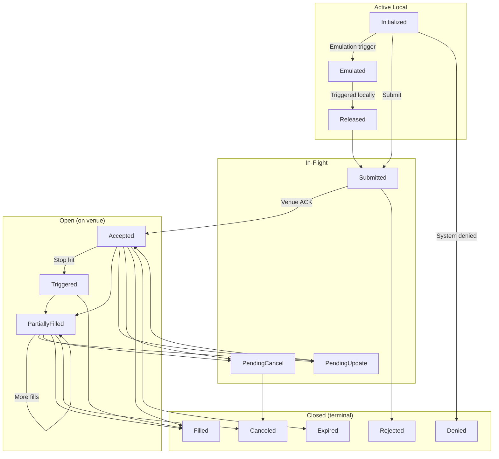

# Orders

NautilusTrader supports a broad set of order types and execution instructions, exposing as much
of a trading venue's functionality as possible. Traders can define instructions and contingencies
for order execution and management across any trading strategy.

## Overview

All order types are derived from two fundamentals: *Market* and *Limit* orders. In terms of liquidity, they are opposites.
*Market* orders consume liquidity by executing immediately at the best available price, whereas *Limit*
orders provide liquidity by resting in the order book at a specified price until matched.

NautilusTrader supports nine order types (the `OrderType` enum values), summarized under
[Order types](#order-types) with a dedicated guide for each.

:::info
NautilusTrader provides a unified API for many order types and execution instructions, but not all venues support every option.
If an order includes an instruction or option the target venue does not support, the system does not submit it.
Instead, it logs a clear, explanatory error.
:::

### Terminology

- An order is **aggressive** if its type is `MARKET` or if it executes as a *marketable* order (i.e., takes liquidity).
- An order is **passive** if it is not marketable (i.e., provides liquidity).
- An order is **active local** if it remains within the local system boundary in one of the following three non-terminal statuses:
  - `INITIALIZED`
  - `EMULATED`
  - `RELEASED`
- An order is **in-flight** when at one of the following statuses:
  - `SUBMITTED`
  - `PENDING_UPDATE`
  - `PENDING_CANCEL`
- An order is **open** when at one of the following (non-terminal) statuses:
  - `ACCEPTED`
  - `TRIGGERED`
  - `PENDING_UPDATE`
  - `PENDING_CANCEL`
  - `PARTIALLY_FILLED`
- An order is **closed** when at one of the following (terminal) statuses:
  - `DENIED`
  - `REJECTED`
  - `CANCELED`
  - `EXPIRED`
  - `FILLED`

### Order state flow

The following diagram illustrates the order lifecycle and primary state transitions:

### Order status definitions

| Status             | Description                                                                               |
|--------------------|-------------------------------------------------------------------------------------------|
| `INITIALIZED`      | Order is instantiated within the Nautilus system.                                         |
| `DENIED`           | Order was denied by Nautilus for being invalid, unprocessable, or exceeding a risk limit. |
| `EMULATED`         | Order is being emulated by the `OrderEmulator` component.                                 |
| `RELEASED`         | Order was released from the `OrderEmulator` component.                                    |
| `SUBMITTED`        | Order was submitted to the venue (awaiting acknowledgement).                              |
| `ACCEPTED`         | Order was acknowledged by the venue as received and valid (may now be working).           |
| `REJECTED`         | Order was rejected by the trading venue.                                                  |
| `CANCELED`         | Order was canceled (terminal).                                                            |
| `EXPIRED`          | Order reached its GTD expiration (terminal).                                              |
| `TRIGGERED`        | Order's STOP price was triggered on the venue.                                            |
| `PENDING_UPDATE`   | Order is pending a modification request on the venue.                                     |
| `PENDING_CANCEL`   | Order is pending a cancellation request on the venue.                                     |
| `PARTIALLY_FILLED` | Order has been partially filled on the venue.                                             |
| `FILLED`           | Order has been completely filled (terminal).                                              |

## Execution instructions

Certain venues allow a trader to specify conditions and restrictions on
how an order will be processed and executed. The following is a brief
summary of the different execution instructions available.

### Time in force

The order's time in force specifies how long the order will remain open or active before any
remaining quantity is canceled.

- `GTC` **(Good Till Cancel)**: The order remains active until canceled by the trader or the venue.
- `IOC` **(Immediate or Cancel / Fill and Kill)**: The order executes immediately, with any unfilled portion canceled.
- `FOK` **(Fill or Kill)**: The order executes immediately in full or not at all.
- `GTD` **(Good Till Date)**: The order remains active until a specified expiration date and time.
- `DAY` **(Good for session/day)**: The order remains active until the end of the current trading session.
- `AT_THE_OPEN` **(OPG)**: The order is only active at the open of the trading session.
- `AT_THE_CLOSE`: The order is only active at the close of the trading session.

### Expire time

This instruction is to be used in conjunction with the `GTD` time in force to specify the time
at which the order will expire and be removed from the venue's order book (or order management system).

### Post-only

An order which is marked as `post_only` will only ever participate in providing liquidity to the
limit order book, and never initiating a trade which takes liquidity as an aggressor. This option is
important for market makers, or traders seeking to restrict the order to a liquidity *maker* fee tier.

### Reduce-only

An order which is set as `reduce_only` will only ever reduce an existing position on an instrument and
never open a new position (if already flat). The exact behavior of this instruction can vary between venues.

However, the behavior in the Nautilus `SimulatedExchange` is typical of a real venue.

- Order will be canceled if the associated position is closed (becomes flat).
- Order quantity will be reduced as the associated position's size decreases.

### Display quantity

The `display_qty` specifies the portion of a *Limit* order which is displayed on the limit order book.
These are also known as iceberg orders as there is a visible portion to be displayed, with more quantity which is hidden.
Specifying a display quantity of zero is also equivalent to setting an order as `hidden`.

### Trigger type

Also known as [trigger method](https://www.interactivebrokers.com/en/software/tws/usersguidebook/configuretws/Modify%20the%20Stop%20Trigger%20Method.htm)
which is applicable to conditional trigger orders, specifying the method of triggering the stop price.

- `DEFAULT`: The default trigger type for the venue (typically `LAST_PRICE` or `BID_ASK`).
- `LAST_PRICE`: The trigger price will be based on the last traded price.
- `BID_ASK`: The trigger price will be based on the bid for buy orders and ask for sell orders.
- `DOUBLE_LAST`: The trigger price will be based on the last two consecutive last prices.
- `DOUBLE_BID_ASK`: The trigger price will be based on the last two consecutive bid or ask prices as applicable.
- `LAST_OR_BID_ASK`: The trigger price will be based on either the last price or bid/ask.
- `MID_POINT`: The trigger price will be based on the mid-point between the bid and ask.
- `MARK_PRICE`: The trigger price will be based on the venue's mark price for the instrument.
- `INDEX_PRICE`: The trigger price will be based on the venue's index price for the instrument.

### Trigger offset type

Applicable to conditional trailing-stop trigger orders, specifies the method of triggering modification
of the stop price based on the offset from the *market* (bid, ask or last price as applicable).

- `DEFAULT`: The default offset type for the venue (typically `PRICE`).
- `PRICE`: The offset is based on a price difference.
- `BASIS_POINTS`: The offset is based on a price percentage difference expressed in basis points (100bp = 1%).
- `TICKS`: The offset is based on a number of ticks.
- `PRICE_TIER`: The offset is based on a venue-specific price tier.

### Contingent orders

More advanced relationships can be specified between orders.
For example, child orders can be assigned to trigger only when the parent is activated or filled, or orders can be
linked so that one cancels or reduces the quantity of another. See the [Advanced orders](advanced.md) guide for more details.

## Order factory

The easiest way to create new orders is by using the built-in `OrderFactory`, which is
automatically attached to every `Strategy` class. This factory will take care
of lower level details - such as ensuring the correct trader ID and strategy ID are assigned, generation
of a necessary initialization ID and timestamp, and abstracts away parameters which don't necessarily
apply to the order type being created, or are only needed to specify more advanced execution instructions.

This leaves the factory with simpler order creation methods to work with, all the
examples use an `OrderFactory` from within a `Strategy` context.

See the [`OrderFactory` API Reference](/docs/python-api-latest/common.html#nautilus_trader.common.factories.OrderFactory) for further details.

## Order types

NautilusTrader supports the following order types. Each links to a dedicated guide with a code
example; optional parameters are marked with a comment showing the default value.

| Order type                                         | Category             | Description                                                              |
|----------------------------------------------------|----------------------|--------------------------------------------------------------------------|
| [`MARKET`](market.md)                              | Aggressive           | Trades the quantity immediately at the best available price.             |
| [`LIMIT`](limit.md)                                | Passive              | Rests in the book and trades only at the limit price or better.          |
| [`STOP_MARKET`](stop_market.md)                    | Conditional          | Once the trigger price is hit, places a *Market* order.                  |
| [`STOP_LIMIT`](stop_limit.md)                      | Conditional          | Once the trigger price is hit, places a *Limit* order at the set price.  |
| [`MARKET_TO_LIMIT`](market_to_limit.md)            | Hybrid               | Submits as *Market*; any remainder rests as a *Limit* at the fill price. |
| [`MARKET_IF_TOUCHED`](market_if_touched.md)        | Conditional          | Once the trigger price is touched, places a *Market* order.              |
| [`LIMIT_IF_TOUCHED`](limit_if_touched.md)          | Conditional          | Once the trigger price is touched, places a *Limit* order at the set price. |
| [`TRAILING_STOP_MARKET`](trailing_stop_market.md)  | Conditional trailing | Trails the trigger by an offset, then places a *Market* order.           |
| [`TRAILING_STOP_LIMIT`](trailing_stop_limit.md)    | Conditional trailing | Trails the trigger by an offset, then places a *Limit* order.            |

### FIX OrdType mapping

Each type maps to the nearest FIX 5.0 SP2 [`OrdType <40>`](https://www.onixs.biz/fix-dictionary/5.0.sp2/tagnum_40.html)
value, where the protocol defines one:

| Order type           | FIX `OrdType <40>`                   |
|----------------------|--------------------------------------|
| Market               | `1` (Market)                         |
| Limit                | `2` (Limit)                          |
| Stop‑Market          | `3` (Stop)                           |
| Stop‑Limit           | `4` (Stop Limit)                     |
| Market‑To‑Limit      | `K` (Market With Left Over as Limit) |
| Market‑If‑Touched    | `J` (Market If Touched)              |
| Limit‑If‑Touched     | no dedicated value †                 |
| Trailing‑Stop‑Market | `3` (Stop) + trailing peg            |
| Trailing‑Stop‑Limit  | `4` (Stop Limit) + trailing peg      |

† FIX defines no dedicated `OrdType` for *Limit-If-Touched*; it is commonly sent as `4` (Stop Limit)
with a favorable trigger. Trailing stops likewise have no dedicated value and are modeled as `3`/`4`
plus trailing peg fields.

## Advanced orders

Orders can be grouped into lists and linked with contingency relationships (OTO, OCO, OUO), and
bracket orders attach take-profit and stop-loss children to an entry. See the
[Advanced orders](advanced.md) guide for order lists, contingency types, validation rules, and brackets.

## Emulated orders

NautilusTrader can locally emulate order types that a venue does not natively support, using only
`MARKET` and `LIMIT` orders for actual execution. See the [Emulated orders](emulated.md) guide for
the emulation lifecycle, supported types, querying, and best practices.

## Related guides

- [Events](../events.md) - Order events, position events, and handler dispatch.
- [Execution](../execution.md) - Order execution and fill handling.
- [Positions](../positions.md) - Positions created from order fills.
- [Strategies](../strategies.md) - Order management from strategies.
