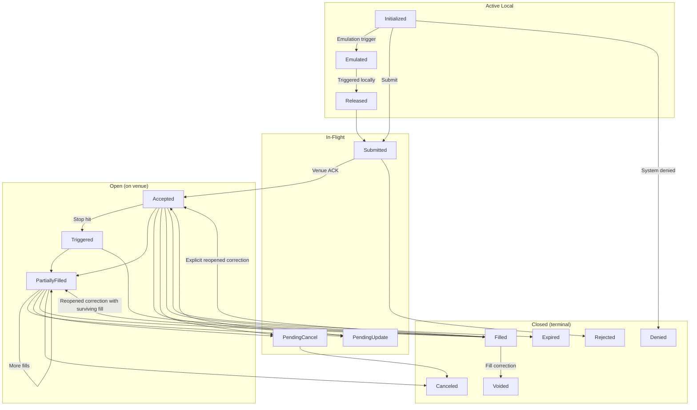

# Orders

NautilusTrader provides a common model for order types, execution instructions, and contingency
relationships across trading venues.

## Overview

All order types derive from two fundamentals: *Market* and *Limit* orders. *Market* orders seek
immediate execution at the best available price. Non-marketable *Limit* orders rest in the order
book at a specified price until matched, while marketable *Limit* orders can take liquidity.

NautilusTrader supports nine order types (the `OrderType` enum values), summarized under
[Order types](#order-types) with a dedicated guide for each.

:::info
NautilusTrader provides a unified API, but order and instruction support varies by venue and adapter.
An adapter may deny an unsupported request before submission, or the venue may reject it. Check the
target integration's capabilities before relying on an option.
:::

### Terminology

- An order is **aggressive** if its type is `MARKET` or it executes as a marketable order and takes
  liquidity.
- An order is **passive** if it rests without taking liquidity.
- An order is **active local** if it remains within the local system boundary in one of these
  non-terminal statuses:
  - `INITIALIZED`
  - `EMULATED`
  - `RELEASED`
- An order is **in-flight** when at one of the following statuses:
  - `SUBMITTED`
  - `PENDING_UPDATE`
  - `PENDING_CANCEL`
- An order is **open** when at one of the following (non-terminal) statuses:
  - `ACCEPTED`
  - `TRIGGERED`
  - `PENDING_UPDATE`
  - `PENDING_CANCEL`
  - `PARTIALLY_FILLED`
- An order is **closed** when at one of the following (terminal) statuses:
  - `DENIED`
  - `REJECTED`
  - `CANCELED`
  - `EXPIRED`
  - `FILLED`
  - `VOIDED`

These groups overlap, so open and closed are not opposites. `PENDING_UPDATE` and `PENDING_CANCEL`
are both open and in-flight: the order is working at the venue while a modify or cancel request is
outstanding. Four statuses are neither open nor closed: `INITIALIZED`, `EMULATED`, and `RELEASED`
are active local, and `SUBMITTED` is in-flight until the venue acknowledges the order.

:::warning[Open and closed are not complements]
Test for a finished order with `is_closed`, never by negating `is_open`. An order at one of the four
statuses above is not open, but it is not finished either. Every order is `SUBMITTED` immediately
after submission, so code which treats "not open" as done abandons orders the venue is still
processing. Use `is_inflight` for the awaiting-venue case.
:::

### Order state flow

The following diagram illustrates the order lifecycle and primary state transitions. Each status
appears once, so `PENDING_UPDATE` and `PENDING_CANCEL` are drawn under In-Flight although they are
also open:

```mermaid
flowchart TB
    subgraph local ["Active Local"]
        Initialized
        Emulated
        Released
    end

    subgraph flight ["In-Flight"]
        Submitted
        PendingUpdate
        PendingCancel
    end

    subgraph open ["Open (on venue)"]
        Accepted
        Triggered
        PartiallyFilled
    end

    subgraph closed ["Closed (terminal)"]
        Denied
        Rejected
        Canceled
        Expired
        Filled
        Voided
    end

    Initialized -->|"Emulation trigger"| Emulated
    Initialized -->|"Submit"| Submitted
    Initialized -->|"System denied"| Denied
    Emulated -->|"Triggered locally"| Released
    Released --> Submitted

    Submitted -->|"Venue ACK"| Accepted
    Submitted --> Rejected

    Accepted -->|"Stop hit"| Triggered
    Accepted --> PartiallyFilled
    Triggered --> PartiallyFilled
    PartiallyFilled -->|"More fills"| PartiallyFilled

    Accepted --> PendingUpdate
    Accepted --> PendingCancel
    PartiallyFilled --> PendingUpdate
    PartiallyFilled --> PendingCancel
    PendingUpdate --> Accepted
    PendingCancel --> Canceled

    Accepted --> Filled
    Triggered --> Filled
    PartiallyFilled --> Filled
    Filled -->|"Fill correction"| Voided
    Filled -->|"Explicit reopened correction"| Accepted
    Filled -->|"Reopened correction with surviving fill"| PartiallyFilled
    PartiallyFilled --> Canceled
    Accepted --> Expired
```

The diagram shows the primary transitions, while the order model validates the complete transition
set for recovery and venue edge cases. An order status describes local state, not the evidence that
produced it. See [Execution policies](../execution/policies.md) for command outcome classes,
event provenance, delivery limits, and reconciliation policy.

### Order status definitions

| Status             | Description                                                                                    |
| ------------------ | ---------------------------------------------------------------------------------------------- |
| `INITIALIZED`      | Order is instantiated within the Nautilus system.                                              |
| `DENIED`           | Order was denied by Nautilus for being invalid, unprocessable, or exceeding a risk limit.      |
| `EMULATED`         | Order is being emulated by the `OrderEmulator` component.                                      |
| `RELEASED`         | Order was released from the `OrderEmulator` component.                                         |
| `SUBMITTED`        | Order was submitted to the venue (awaiting acknowledgement).                                   |
| `ACCEPTED`         | Order was acknowledged by the venue as received and valid (may now be working).                |
| `REJECTED`         | Order is terminal as rejected; `reconciliation` and `reason` provide the available provenance. |
| `CANCELED`         | Order is terminal as canceled; status alone does not identify venue, local, or policy cause.   |
| `EXPIRED`          | Order reached its GTD expiration (terminal).                                                   |
| `TRIGGERED`        | A stop-limit, trailing-stop-limit, or limit-if-touched order triggered on the venue.           |
| `PENDING_UPDATE`   | Order is pending a modification request on the venue.                                          |
| `PENDING_CANCEL`   | Order is pending a cancellation request on the venue.                                          |
| `PARTIALLY_FILLED` | Order has been partially filled on the venue.                                                  |
| `FILLED`           | Order has been completely filled (terminal).                                                   |
| `VOIDED`           | Order is terminal after an authoritative fill correction.                                      |

## Execution instructions

Execution instructions specify conditions and restrictions on how a venue processes an order.
Support varies by venue and adapter.

### Time in force

Time in force specifies how long an order remains active before any unfilled quantity is canceled.

- `GTC` **(Good Till Cancel)**: The order remains active until canceled by the trader or the venue.
- `IOC` **(Immediate or Cancel / Fill and Kill)**: The order executes immediately, with any
  unfilled portion canceled.
- `FOK` **(Fill or Kill)**: The order executes immediately in full or not at all.
- `GTD` **(Good Till Date)**: The order remains active until a specified expiration date and time.
- `DAY` **(Good for session/day)**: The order remains active until the end of the current trading session.
- `AT_THE_OPEN` **(OPG)**: The order is only active at the open of the trading session.
- `AT_THE_CLOSE`: The order is only active at the close of the trading session.

### Expire time

Use `expire_time` with `GTD` to specify when the order expires and leaves the venue's order book or
order management system.

### Post-only

An order marked `post_only` may provide liquidity but must not take it. A venue normally rejects or
cancels the order if it would execute immediately. Market makers can use this instruction to target
maker fees.

### Reduce-only

An order marked `reduce_only` may reduce an existing position but must not increase exposure or open
a position while flat. Exact behavior varies by venue.

The Nautilus `SimulatedExchange` applies these rules:

- It cancels the order when the associated position becomes flat.
- It reduces the order quantity as the associated position shrinks.

### Display quantity

The `display_qty` specifies how much of an order is visible on the limit order book. An order with a
smaller displayed quantity than its total quantity is commonly called an iceberg order. A display
quantity of zero makes the order hidden when the venue supports that behavior.

### Trigger type

The trigger type, also known as a
[trigger method](https://www.interactivebrokers.com/en/software/tws/usersguidebook/configuretws/Modify%20the%20Stop%20Trigger%20Method.htm),
specifies the market price used to trigger a conditional order.

An absent trigger type is represented by `None` and is invalid for an order that requires one.

- `DEFAULT`: Uses the venue's default trigger type.
- `LAST_PRICE`: Uses the last traded price.
- `BID_ASK`: Uses the ask for BUY orders and the bid for SELL orders.
- `DOUBLE_LAST`: Requires two consecutive matching last prices.
- `DOUBLE_BID_ASK`: Requires two consecutive matching bid or ask prices, based on the order side.
- `LAST_OR_BID_ASK`: Uses either the last price or the side-appropriate bid or ask.
- `MID_POINT`: Uses the midpoint between the bid and ask.
- `MARK_PRICE`: Uses the venue's mark price for the instrument.
- `INDEX_PRICE`: Uses the venue's index price for the instrument.

### Trailing offset type

The trailing offset type specifies how a trailing order calculates its trigger offset from the
applicable market price.

An absent trailing offset type is represented by `None` and is invalid for a trailing order.

- `PRICE`: Uses a price difference.
- `BASIS_POINTS`: Uses a percentage difference in basis points, where 100 basis points equals 1%.
- `TICKS`: Uses a number of ticks.
- `PRICE_TIER`: Uses a venue-specific price tier.

### Contingent orders

Contingency relationships can hold child orders until a parent activates or fills, cancel linked
orders, or reduce their quantities. See [Advanced orders](advanced.md) for the available models and
their constraints.

## Order factory

Use the built-in `OrderFactory` to create orders. Each Python `Strategy` exposes one as
`self.order_factory`; the Rust strategy API exposes it through `self.order()`. The factory assigns
the trader and strategy IDs, generates client order and initialization IDs when needed, records the
initial timestamp, and applies defaults for the selected order type.

The examples in these guides create orders from a `Strategy` context.

See the
[`OrderFactory` API reference](/docs/python-api-latest/common.html#nautilus_trader.common.OrderFactory)
for further details.

## Order types

NautilusTrader supports the following order types. Each links to a dedicated guide with a code
example; optional parameters are marked with a comment showing the default value.

| Order type                                        | Category             | Description                                                                 |
| ------------------------------------------------- | -------------------- | --------------------------------------------------------------------------- |
| [`MARKET`](market.md)                             | Aggressive           | Trades the quantity immediately at the best available price.                |
| [`LIMIT`](limit.md)                               | Passive              | Rests in the book and trades only at the limit price or better.             |
| [`STOP_MARKET`](stop_market.md)                   | Conditional          | Once the trigger price is hit, places a *Market* order.                     |
| [`STOP_LIMIT`](stop_limit.md)                     | Conditional          | Once the trigger price is hit, places a *Limit* order at the set price.     |
| [`MARKET_TO_LIMIT`](market_to_limit.md)           | Hybrid               | Submits as *Market*; any remainder rests as a *Limit* at the fill price.    |
| [`MARKET_IF_TOUCHED`](market_if_touched.md)       | Conditional          | Once the trigger price is touched, places a *Market* order.                 |
| [`LIMIT_IF_TOUCHED`](limit_if_touched.md)         | Conditional          | Once the trigger price is touched, places a *Limit* order at the set price. |
| [`TRAILING_STOP_MARKET`](trailing_stop_market.md) | Conditional trailing | Trails the trigger by an offset, then places a *Market* order.              |
| [`TRAILING_STOP_LIMIT`](trailing_stop_limit.md)   | Conditional trailing | Trails the trigger by an offset, then places a *Limit* order.               |

### FIX OrdType mapping

Each type maps to the nearest FIX 5.0 SP2
[`OrdType <40>`](https://www.onixs.biz/fix-dictionary/5.0.sp2/tagnum_40.html) value, where the protocol
defines one:

| Order type           | FIX `OrdType <40>`                   |
| -------------------- | ------------------------------------ |
| Market               | `1` (Market)                         |
| Limit                | `2` (Limit)                          |
| Stop-Market          | `3` (Stop)                           |
| Stop-Limit           | `4` (Stop Limit)                     |
| Market-To-Limit      | `K` (Market With Left Over as Limit) |
| Market-If-Touched    | `J` (Market If Touched)              |
| Limit-If-Touched     | no dedicated value †                 |
| Trailing-Stop-Market | `3` (Stop) + trailing peg            |
| Trailing-Stop-Limit  | `4` (Stop Limit) + trailing peg      |

† FIX defines no dedicated `OrdType` for *Limit-If-Touched*; it is commonly sent as `4` (Stop Limit)
with a favorable trigger. Trailing stops likewise have no dedicated value and are modeled as `3`/`4`
plus trailing peg fields.

## Advanced orders

Orders can be grouped into lists and linked with contingency relationships (OTO, OCO, OUO), and
bracket orders attach take-profit and stop-loss children to an entry. See the
[Advanced orders](advanced.md) guide for order lists, contingency types, validation rules, and
brackets.

## Emulated orders

NautilusTrader can locally emulate order types that a venue does not natively support, using only
`MARKET` and `LIMIT` orders for actual execution. See the [Emulated orders](emulated.md) guide for
the emulation lifecycle, supported types, querying, and best practices.

## Related guides

- [Events](../events/) - Order events, position events, and handler dispatch.
- [Execution](../execution/) - Order execution and fill handling.
- [Positions](../positions.md) - Positions created from order fills.
- [Strategies](../strategies.md) - Order management from strategies.
