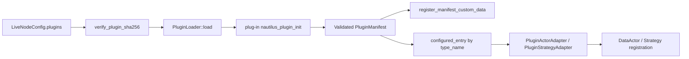
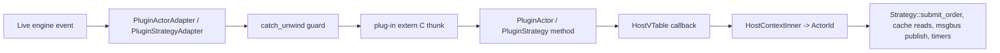
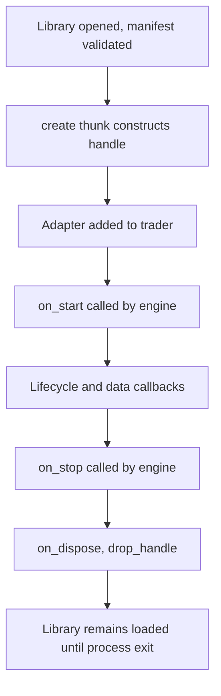

# Plugins

The plug-in system extends a Nautilus live node with independently compiled Rust cdylibs. The host
loads each cdylib at process startup and runs its actors, strategies, and custom-data types
alongside compiled-in components. The host owns the C-ABI boundary; plug-in authors write standard
Rust traits, and a macro emits the boundary glue.

:::note
The plug-in system is supported on Linux only.
:::

**The core philosophy**:

- The boundary is C ABI, because Rust's `#[repr(Rust)]` layout is unstable across compilations.
- Authors write normal Rust traits; macros generate the `extern "C"` thunks and `#[repr(C)]` vtables.
- Plug-ins load at process startup, register through a validated manifest, and live for the process lifetime.
- The host adapts each plug-in instance into a `DataActor` or `Strategy` so the live engine sees no FFI.
- Callbacks from a plug-in back into the host route through a single static `HostVTable` of function pointers.
- Every plug-in callback runs under `catch_unwind`. A panic in a fallible plug-in thunk surfaces as
  a `PluginError`; a panic in an infallible plug-in thunk (`create`, `drop_handle`, custom-data
  `ts_event`/`ts_init`/`clone_handle`/`drop_handle`/`eq_handles`) aborts the process. Neither path
  unwinds across the FFI boundary.

:::warning
The plug-in ABI and `LiveNodeConfig` wiring are early alpha. `NAUTILUS_PLUGIN_ABI_VERSION` tracks
the current boundary layout and does not promise compatibility between Nautilus versions. Pin
plug-in builds to the matching host version, and treat the concepts here as the design contract
for current development.
:::

## Terms

- Plug-in: a Rust cdylib that exports a single `nautilus_plugin_init` symbol.
- Plug point: one trait surface a plug-in can contribute to (custom data, actor, strategy).
- Manifest: a `'static PluginManifest` returned from `nautilus_plugin_init` enumerating contributions.
- VTable: a `#[repr(C)]` struct of function pointers the host calls for one plug point on one type.
- `HostVTable`: the function-pointer table the host hands every plug-in for re-entrant callbacks.
- `HostContext`: an opaque per-instance pointer that lets host thunks attribute callbacks to the calling adapter.
- Adapter: the host-side `PluginActorAdapter` or `PluginStrategyAdapter` that wraps a plug-in handle.

## What a plug-in contributes

A plug-in cdylib can publish three families of contributions through its manifest:

- Custom-data types via `PluginCustomData` (`surfaces::custom_data`).
- Plug-in actors via `PluginActor` (`surfaces::actor`).
- Plug-in strategies via `PluginStrategy` (`surfaces::strategy`).

Each family has its own `#[repr(C)]` vtable struct, an author-facing trait, and a registration entry
the manifest lists in a `Slice<'static, Registration>`. Adding a future plug point means adding one
module and one slice field, then bumping the ABI version.

Each plug-point family carries a fixed callback set. The actor surface today covers the lifecycle
hooks plus the data callbacks whose payload types are `#[repr(C)]`-clean end-to-end: quotes, trades,
bars, mark/index/funding prices, instrument status and close, order filled and canceled events,
signals, time events, and custom data values registered through `PluginCustomData`. The strategy
surface adds the order lifecycle and position event callbacks on top of the actor surface.

## Boundaries

The plug-in system is intentionally narrow. Out of scope today:

- Async client adapters for data and execution.
- Catalog, cache, and event-store backends as plug-ins.
- Pre-trade risk gating as a plug-in.
- Hot reload (plug-ins load at process startup and stay loaded).
- `OrderBook` state and native or Python `CustomData` on the actor or strategy callback surface
  (those payloads have no plug-in vtable and handle to downcast through).

## ABI boundary

Only `#[repr(C)]` types may cross between an independently compiled plug-in and the host. Two
patterns cover the current surface:

- Events flow into the plug-in as borrowed `*const T` pointers into the host's already-`#[repr(C)]`
  model types. No serialisation, no per-event allocation.
- Order commands flow out of the plug-in as boundary-owned `*const XHandle` pointers
  (`SubmitOrderHandle`, `CancelOrderHandle`, `ModifyOrderHandle`, `SubmitOrderListHandle`,
  `CancelOrdersHandle`, `CancelAllOrdersHandle`, `ClosePositionHandle`,
  `CloseAllPositionsHandle`, `QueryAccountHandle`, `QueryOrderHandle`) into command structs the
  plug-in owns for the duration of the call. The host derefs the handle and dispatches into the
  matching `Strategy` command, leaving the in-engine `TradingCommand` shape untouched. No JSON
  crosses the boundary on any per-call command path.
- Plug-in custom data flows into actor and strategy `on_data` callbacks as a borrowed
  `PluginCustomDataRef`. The host only dispatches custom data values that came from a
  `PluginCustomData` registration in a loaded manifest, because that wrapper carries the plug-in
  vtable and opaque handle needed for a local downcast inside the cdylib.

The boundary primitives (`BorrowedStr`, `Slice`, `OwnedBytes`, `PluginError`, `PluginResult`) are
documented in `nautilus_plugin::boundary`.

### Identifier interning

Nautilus identifiers such as `ClientOrderId`, `InstrumentId`, `ClientId`, `AccountId`,
`PositionId`, `StrategyId`, and `TraderId` wrap `Ustr`. A Rust cdylib has its own `ustr`
global string cache, so equal text can have different `Ustr` pointers on the host and
plug-in sides. The boundary treats `Ustr` values as receiver-local:

- Host command dispatch re-interns every identifier in boundary-owned command handles before
  calling the matching `Strategy::*` method.
- Plug-in event thunks re-intern identifiers in inbound event payloads before calling
  `PluginActor` or `PluginStrategy` trait methods.
- Plug-in authors can compare and store identifiers received through trait callbacks normally.
  Code that bypasses the macro-generated thunks must re-intern copied identifiers with
  `Ustr::from(value.as_str())`.

The policy also covers nested identifiers such as `Symbol`, `Venue`, `OrderListId`,
`ExecAlgorithmId`, `VenueOrderId`, `OptionSeriesId`, raw `Ustr` tags and names, and
currency codes carried inside command or event payloads. This does not change any vtable
or handle layout, so it does not require an ABI version bump.

## Manifest

The manifest is process-lifetime static data the plug-in returns from `nautilus_plugin_init`. It
identifies the build and enumerates every plug-point contribution:

- `abi_version`: must equal `NAUTILUS_PLUGIN_ABI_VERSION` or the host refuses to load.
- `plugin_name`, `plugin_vendor`, `plugin_version`: identifier strings.
- `build_id`: a versioned `PluginBuildId` carrying `nautilus-plugin` crate version, `rustc` version,
  target triple, and build profile.
- `custom_data`, `actors`, `strategies`: registration slices, one per plug point.

The loader runs `ValidatedPluginManifest::new` on the manifest before exposing it to the live node.
Validation checks identifier strings, the build-id schema version, every registration vtable
pointer, every required vtable slot, and uniqueness of type names across all plug points. The build
identifier itself stays diagnostic: empty `rustc_version`, `target_triple`, or `build_profile`
strings do not make a manifest invalid.

## Load flow



The operational steps are:

- The node clones the configured plug-in entries and refuses to load while it is not `Idle`.
- For each path, the node verifies the optional SHA-256 digest in
  `LiveNode::load_configured_plugins`, then asks the loader to `dlopen` the cdylib and resolve
  `nautilus_plugin_init`. `PluginLoader` itself does not hash the file.
- The plug-in's init thunk receives the host's `HostVTable` pointer and returns its static manifest.
- The loader runs structural validation. Failure produces a `LoadError` whose diagnostics include
  the plug-in name, version, and full `PluginBuildId`.
- The node walks every loaded manifest once to register custom-data deserializers with
  `nautilus_model::data::registry`.
- The node walks the configured entries again, resolves each `type_name` to either an actor or
  strategy registration, and instantiates an adapter through the plug-in's `create` thunk.
- The adapter is added to the trader, after which the live engine drives it like any
  compiled-in component.

The loader stops on the first error and leaks every successfully opened `Library` for the process
lifetime, because manifest, vtable, and `drop_fn` pointers the host has copied into its registries
must outlive the loader.

## Adapter routing

Once an adapter is registered, callbacks flow in both directions through stable function pointers:



- Forward calls (engine to plug-in) go through the adapter's validated vtable, with two layers
  of `catch_unwind` guarding the FFI call so a plug-in panic surfaces as a `PluginError` rather
  than unwinding across the boundary.
- Reverse calls (plug-in to host) go through `HostVTable`. The host attributes each call to the
  caller via the per-instance `HostContext` pointer it handed the plug-in at create time and
  routes through the engine's cache, msgbus, clock, timer, and order pipelines.
- Order-command slots reject calls from actor contexts; actors cannot submit orders.
- The default `HostVTable` returns `NotImplemented` for stateful callbacks. Engines install a
  populated vtable via `plugin_loader()` so plug-ins reach the real execution paths.

## Lifecycle

A plug-in instance follows the same lifecycle as a compiled-in actor or strategy:



Key points:

- `create` runs once per configured instance. The adapter passes the plug-in its `HostVTable`
  pointer, its `HostContextInner` pointer, and the verbatim JSON config payload.
- Adapter drop runs the plug-in's `drop_handle` thunk and releases the heap-allocated
  `HostContextInner` allocation.
- `dlclose` is intentionally never called. The `LoadedPlugin` wraps its `libloading::Library` in
  `ManuallyDrop` so manifest and vtable pointers copied into the host's registries never dangle.

## Configuration

Plug-in instances are declared on `LiveNodeConfig.plugins` as a list of `PluginConfig` entries:

```toml
[[plugins]]
path = "./target/debug/examples/libcustom_data_plugin.so"
type_name = "ExampleStrategy"
sha256 = "<optional 64-char hex digest>"

[plugins.config]
strategy_id = "STRAT-001"
order_id_tag = "001"
threshold = 10
```

Each entry binds one plug-in instance:

- `path`: absolute or working-directory-relative path to the cdylib. Repeated paths are loaded
  once and shared across entries.
- `type_name`: the canonical type name from the plug-in manifest. The host rejects the entry if
  the manifest exposes the name as both an actor and a strategy.
- `sha256`: optional lowercase hex SHA-256 digest of the cdylib. If set, the node hashes the file
  before loading and aborts on mismatch.
- `config`: a free-form JSON object serialised verbatim into the `config_json` argument the
  plug-in's `create` thunk receives.

The node interprets a few well-known keys inside `config` when instantiating an entry:

- `actor_id`: identifier assigned to the adapter's `ActorId`. Defaults to the manifest `type_name`.
- `strategy_id`: identifier assigned to the adapter's `StrategyId`. Defaults to `<type_name>-001`.
- `order_id_tag`: optional order ID tag forwarded into the strategy's `StrategyConfig`.
- `strategy_config`: optional fully-formed `StrategyConfig` JSON value, used for strategy plug-ins
  that need more than the three keys above.

Plug-in support is gated behind the `plugin` Cargo feature on the live crate, which is on by
default. A build compiled with `--no-default-features` (or any feature set that omits `plugin`)
rejects a non-empty `plugins` list with a clear error so plug-in users cannot accidentally run
without host-side support compiled in.

## Author API

Plug-in authors implement one trait per plug-point family and call the `nautilus_plugin!` macro:

```rust
use nautilus_model::data::QuoteTick;
use nautilus_plugin::prelude::*;

#[derive(Default)]
pub struct ExampleActor {
    quotes_seen: u64,
}

impl PluginActor for ExampleActor {
    const TYPE_NAME: &'static str = "ExampleActor";

    fn new(_host: *const HostVTable, _ctx: *const HostContext, _config_json: &str) -> Self {
        Self::default()
    }

    fn on_quote(&mut self, _quote: &QuoteTick) -> anyhow::Result<()> {
        self.quotes_seen += 1;
        Ok(())
    }
}

nautilus_plugin::nautilus_plugin! {
    name: "example-actor-plugin",
    vendor: "Nautech",
    version: env!("CARGO_PKG_VERSION"),
    actors: [ExampleActor],
}
```

The macro emits `nautilus_plugin_init`, the `'static PluginManifest`, and the per-plug-point
vtables. Fallible thunks forward through `panic::guard`; the heavier infallible thunks
(`create`, `drop_handle`, and custom-data `ts_event`/`ts_init`/`clone_handle`/`eq_handles`)
forward through `guard_infallible`; trivial slots that cannot panic (the `type_name` thunks, which
just return a `BorrowedStr` over a `&'static str` constant) carry no guard at all.

Authors never write `extern "C"` or `#[repr(C)]`. `unsafe` requirements depend on what the plug-in
holds. The example actor in `crates/plugin/examples/custom_data_plugin.rs` discards the
`*const HostVTable` and `*const HostContext` pointers that `PluginActor::new` receives, so it
needs no `unsafe`. Plug-ins that store those pointers (whether actor or strategy) need an
`unsafe impl Send` on the struct, and any direct call into a `HostVTable` slot is
`unsafe extern "C"` and therefore `unsafe` to invoke.

`Cargo.toml` for the cdylib needs `crate-type = ["cdylib"]` and a dependency on the matching
`nautilus-plugin` version. The artifact lands at
`target/<profile>/<libname>.<so|dylib|dll>` depending on the host platform.

Build a cdylib example shipped with the crate:

```fish
cargo build -p nautilus-plugin --example custom_data_plugin
```

## Operating notes

- Pin every plug-in build to the host's Nautilus version. The loader checks `abi_version` and the
  build-id schema only; crate version, `rustc`, target triple, and build profile travel as
  diagnostics in load-error output.
- Use the optional `sha256` field on a `PluginConfig` entry as a deployment-time integrity check.
- The node refuses to load plug-ins once it has left the `Idle` state, so any `LoadError` surfaces
  during startup, before client connections.
- A plug-in panic in a fallible callback surfaces as `PluginError::Panic`. A panic in an
  infallible callback (e.g. `create`, `drop_handle`) aborts the process; see
  `nautilus_plugin::panic` for the rationale.
- Loader activity logs under the `nautilus_plugin` target.

## Relationship to compiled-in components

Plug-in actors and strategies behave like any other `DataActor` / `Strategy` once the adapter is
registered:

- Same trader registration APIs.
- Same risk, OMS, and event-store paths for order commands routed through the adapter.
- Cache reads, msgbus publishes, and timer callbacks bypass the `Strategy` layer by design and go
  through the engine services directly.

The only difference is structural: plug-ins ship as separate cdylibs with their own manifest, in
exchange for being deployable out-of-tree without recompiling the host.
