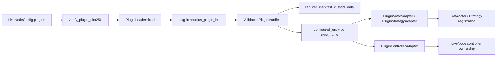
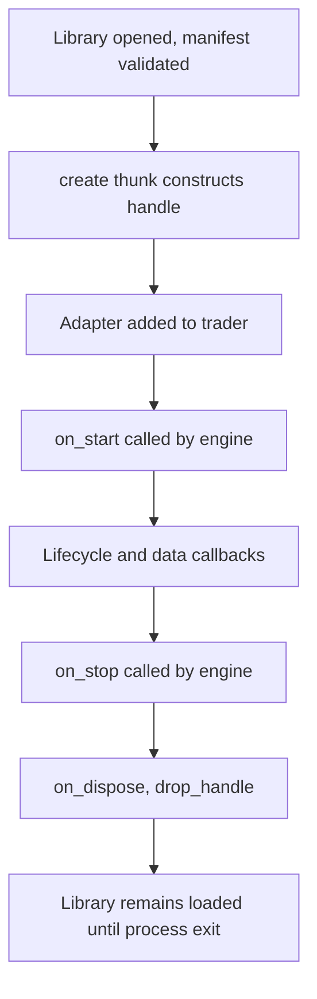
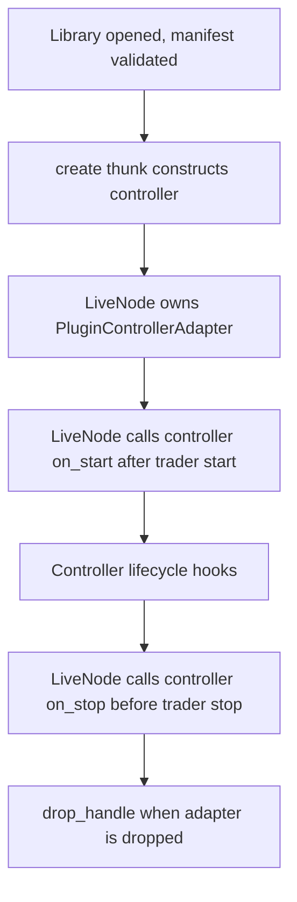

# Plugins

The plug-in system extends a Nautilus live node with independently compiled Rust cdylibs. The host
loads each cdylib while the live node is `Idle` and runs its actors, strategies, controllers, and
custom-data types alongside compiled-in components. The host owns the C-ABI boundary; plug-in
authors write standard Rust traits, and a macro emits the boundary glue.

:::note
The plug-in system is supported on Linux only.
:::

**The core philosophy**:

- The boundary is C ABI, because Rust's `#[repr(Rust)]` layout is unstable across compilations.
- Authors write normal Rust traits; macros generate the `extern "C"` thunks and `#[repr(C)]` vtables.
- Plug-ins load while the live node is `Idle`, register through a validated manifest, and live for
  the process lifetime.
- The host adapts actor and strategy instances into a `DataActor` or `Strategy` so the live engine
  sees no FFI.
- The live node owns controller instances directly and drives their lifecycle outside trader
  registration.
- Callbacks from an actor or strategy back into the host route through a single static `HostVTable`
  of function pointers.
- Controller callbacks use a controller-specific `ControllerHostVTable`.
- Every plug-in callback runs under `catch_unwind`, and no path unwinds across the FFI boundary:
  - A panic in a fallible plug-in thunk surfaces as a `PluginError`.
  - A panic in `create` or custom-data `clone_handle` returns a null handle, which the host
    reports as a recoverable construction or clone failure.
  - A panic in a `drop_handle` thunk is swallowed and leaks the value.
  - A panic in custom-data `ts_event`, `ts_init`, or `eq_handles` aborts the process, because no
    sound sentinel value exists for those signatures.

:::warning
The plug-in ABI and `LiveNodeConfig` wiring are early alpha. `NAUTILUS_PLUGIN_ABI_VERSION` and
`PLUGIN_BUILD_ID_VERSION` remain `1` during this phase, even when the boundary changes. Pin
plug-in builds to the matching host version, and treat the concepts here as the design contract
for current development rather than a stable compatibility promise.
:::

## Terms

- Plug-in: a Rust cdylib that exports a single `nautilus_plugin_init` symbol.
- Plug point: one trait surface a plug-in can contribute to (custom data, actor, strategy, controller).
- Manifest: a `'static PluginManifest` returned from `nautilus_plugin_init` enumerating contributions.
- VTable: a `#[repr(C)]` struct of function pointers the host calls for one plug point on one type.
- `HostVTable`: the function-pointer table the host hands every actor or strategy for re-entrant
  callbacks.
- `ControllerHostVTable`: the function-pointer table the host hands every controller for
  controller-specific host services.
- `HostContext`: an opaque boundary pointer that lets host thunks attribute callbacks to the
  calling adapter. On the host side it points to a `HostContextInner` allocation carrying the
  adapter's actor ID and whether the caller is a strategy.
- `ControllerHostContext`: an opaque boundary pointer carrying the controller's plug-in and type
  names for host-service attribution.
- Adapter: the host-side `PluginActorAdapter`, `PluginStrategyAdapter`, or
  `PluginControllerAdapter` that wraps a plug-in handle.

## What a plug-in contributes

A plug-in cdylib can publish four families of contributions through its manifest:

- Custom-data types via `PluginCustomData` (`surfaces::custom_data`).
- Plug-in actors via `PluginActor` (`surfaces::actor`).
- Plug-in strategies via `PluginStrategy` (`surfaces::strategy`).
- Plug-in controllers via `PluginController` (`surfaces::controller`).

Each family has its own `#[repr(C)]` vtable struct, an author-facing trait, and a registration entry
the manifest lists in a `Slice<'static, Registration>`. Adding a future plug point means adding one
module and one slice field, then rebuilding plug-ins to match the host.

Each plug point family carries a fixed callback set. The actor surface today covers:

- Lifecycle hooks.
- Market-data callbacks for:
  - instruments
  - order books and book deltas
  - quotes, trades, and bars
  - mark, index, and funding prices
  - option greeks and option chain snapshots
  - instrument status and instrument close
- Order filled and canceled events.
- Signals and time events.
- Custom data values registered through `PluginCustomData`.

The strategy surface adds the order lifecycle and position event callbacks on top of the actor
surface.

The controller surface exposes a static `prepare` hook plus runtime lifecycle callbacks. Controllers
use JSON request and response envelopes for host services because they orchestrate runtime
components rather than process market-data events.

## Boundaries

The plug-in system is intentionally narrow. Out of scope today:

- Async client adapters for data and execution.
- Catalog, cache, and event-store backends as plug-ins.
- Pre-trade risk gating as a plug-in.
- Hot reload (plug-ins load while the live node is `Idle` and stay loaded).
- Mutable host `OrderBook` state and native or Python `CustomData` on the actor or strategy
  callback surface. Order book callbacks receive cloned snapshots, and non-plug-in custom data has
  no plug-in vtable and handle to downcast through.

## ABI boundary

Only `#[repr(C)]` types may cross between an independently compiled plug-in and the host. The
following patterns cover the current surface:

- Events flow into the plug-in as borrowed `*const T` pointers into the host's already-`#[repr(C)]`
  model types. No serialisation, no per-event allocation.
- Non-`#[repr(C)]` inbound payloads flow into the plug-in as borrowed handles:
  - `InstrumentAnyHandle`
  - `OrderBookHandle`
  - `OrderBookDeltasHandle`
  - `OptionChainSliceHandle`
  The host owns each handle for the callback duration. `OrderBookHandle` wraps a cloned book
  snapshot, so the plug-in never receives mutable host book state.
- Order commands flow out of the plug-in as boundary-owned `*const XHandle` pointers:
  - `SubmitOrderHandle`
  - `SubmitOrderListHandle`
  - `CancelOrderHandle`
  - `CancelOrdersHandle`
  - `CancelAllOrdersHandle`
  - `ModifyOrderHandle`
  - `ClosePositionHandle`
  - `CloseAllPositionsHandle`
  - `QueryAccountHandle`
  - `QueryOrderHandle`

  The plug-in owns the command structs for the duration of the call. The host derefs the handle and
  dispatches into the matching `Strategy` command, leaving the in-engine `TradingCommand` shape
  untouched. No JSON crosses the boundary on any per-call command path.
- Plug-in custom data flows into actor and strategy `on_data` callbacks as a borrowed
  `PluginCustomDataRef`. The host only dispatches custom data values that came from a
  `PluginCustomData` registration in a loaded manifest, because that wrapper carries the plug-in
  vtable and opaque handle needed for a local downcast inside the cdylib.
- Historical plug-in custom-data responses use the same boundary only when the value came from a
  `PluginCustomData` registration. The host inspects `&dyn Any` only inside the adapter, extracts
  registered plug-in `CustomData`, and calls the existing `on_data` slot with `PluginCustomDataRef`.
  No `&dyn Any` value crosses the cdylib boundary.

The boundary primitives are documented in `nautilus_plugin::boundary`:

- `BorrowedStr`
- `Slice`
- `OwnedBytes`
- `PluginError`
- `PluginResult`

### Identifier interning

Nautilus identifiers wrap `Ustr`, including:

- `ClientOrderId`
- `InstrumentId`
- `ClientId`
- `AccountId`
- `PositionId`
- `StrategyId`
- `TraderId`

A Rust cdylib has its own `ustr` global string cache, so equal text can have different `Ustr`
pointers on the host and plug-in sides. The boundary treats `Ustr` values as receiver-local:

- Host command dispatch re-interns every identifier in boundary-owned command handles before
  calling the matching `Strategy::*` method.
- Plug-in event thunks re-intern identifiers in inbound event payloads before calling
  `PluginActor` or `PluginStrategy` trait methods.
- Plug-in authors can compare and store identifiers received through trait callbacks normally.
  Code that bypasses the macro-generated thunks must re-intern copied identifiers with
  `Ustr::from(value.as_str())`.

The policy also covers nested identifiers carried inside command or event payloads:

- `Symbol`
- `Venue`
- `OrderListId`
- `ExecAlgorithmId`
- `VenueOrderId`
- `OptionSeriesId`
- raw `Ustr` tags and names
- currency codes

This does not change any vtable or handle layout, so it does not require a plug-in rebuild.

## Manifest

The manifest is process-lifetime static data the plug-in returns from `nautilus_plugin_init`. It
identifies the build and enumerates every plug point contribution:

- `abi_version`: must equal `NAUTILUS_PLUGIN_ABI_VERSION` or the host refuses to load.
- `plugin_name`, `plugin_vendor`, `plugin_version`: identifier strings.
- `build_id`: a versioned `PluginBuildId` carrying:
  - `nautilus-plugin` crate version
  - `rustc` version
  - target triple
  - build profile
  - precision mode
  - fixed precision
- `custom_data`, `actors`, `strategies`, `controllers`: registration slices, one per plug point.

The loader runs `ValidatedPluginManifest::new` on the manifest before exposing it to the live node.
Validation checks identifier strings, the build-id schema version, every registration vtable
pointer, every required vtable slot, and uniqueness of type names across all plug points. It also
checks the plug-in precision mode and fixed precision against the host, because standard-precision
and high-precision builds use different model layouts at the boundary.

After validation the loader pins the build: a `rustc` or `nautilus-plugin` crate version that
differs from the host fails the load with `LoadError::BuildMismatch`, because boundary payloads
include `repr(Rust)` interiors whose layout is only guaranteed under a shared toolchain.
`PluginLoader::set_allow_build_mismatch` downgrades the rejection to a warning. A build-id field
that is empty on either side cannot be compared and logs a warning. Target triple and build
profile stay diagnostic.

## Load flow



The operational steps are:

- The node clones the configured plug-in entries and refuses to load while it is not `Idle`.
- For each path, the node verifies the optional SHA-256 digest in
  `LiveNode::load_configured_plugins`, then asks the loader to `dlopen` the cdylib and resolve
  `nautilus_plugin_init`. `PluginLoader` itself does not hash the file.
- The plug-in's init thunk receives the host's `HostVTable` pointer and returns its static manifest.
- The loader runs structural validation, then build pinning. Failure produces a `LoadError` whose
  diagnostics include the plug-in name, version, and full `PluginBuildId`.
- The node walks every loaded manifest once to register custom-data deserializers with
  `nautilus_model::data::registry`.
- The node walks the configured entries again, resolves each `type_name` to an actor, strategy, or
  controller registration, and instantiates an adapter through the plug-in's `create` thunk.
- Actor and strategy adapters are added to the trader, after which the live engine drives them like
  compiled-in components.
- Controller adapters stay owned by the live node. The node starts them after trader startup and
  stops them before trader shutdown.

The loader stops on the first error and leaks every opened `Library` for the process lifetime,
including rejected ones. Accepted manifests, vtables, and `drop_fn` pointers copied into host
registries must outlive the loader, and a rejected plug-in has already run its static initializers
and `nautilus_plugin_init`, so `dlclose` could unload code with live side effects.

## Actor and strategy adapter routing

Once an actor or strategy adapter is registered, callbacks flow in both directions through stable
function pointers:

```mermaid
flowchart LR
    Engine["Live engine event"] --> Adapter["PluginActorAdapter / PluginStrategyAdapter"]
    Adapter --> HostGuard["host catch_unwind guard"]
    HostGuard --> Thunk["plug-in extern C thunk"]
    Thunk --> PluginGuard["plug-in catch_unwind guard"]
    PluginGuard --> Trait["PluginActor / PluginStrategy method"]
    Trait -. "optional reverse call" .-> Host["HostVTable callback"]
    Host --> Resolve["HostContextInner -> ActorId"]
    Resolve --> Live["Strategy::submit_order, cache reads, msgbus publish, timers"]
```



- Forward calls (engine to plug-in) go through the adapter's validated vtable, with two layers
  of `catch_unwind` guarding the FFI call so a plug-in panic surfaces as a `PluginError` rather
  than unwinding across the boundary.
- Reverse calls (plug-in to host) go through `HostVTable`. The host attributes each call to the
  caller via the per-instance `HostContext` pointer it handed the plug-in at create time and
  routes through the engine's cache, msgbus, clock, timer, and order pipelines.
- Reverse-call dispatch runs under a host-side `catch_unwind`: an engine panic reached from a
  plug-in call surfaces to the plug-in as a `PluginError` with code `Panic` instead of aborting
  the node.
- The host validates UTF-8 on plug-in-supplied strings at every reverse-call entry point with an
  error channel, returning `InvalidArgument` on violation; log slots without an error channel
  decode lossily.
- Order-command slots reject calls from actor contexts; actors cannot submit orders.
- The default `HostVTable` returns `NotImplemented` for stateful callbacks. Engines install a
  populated vtable via `plugin_loader()` so plug-ins reach the real execution paths.

Controller adapters use `ControllerHostVTable` instead. Their lifecycle callbacks go from the live
node to the plug-in through `PluginControllerAdapter`; controller-host calls return JSON envelopes
through the controller-specific host service table.

## Lifecycle

Actor and strategy plug-in instances follow the same lifecycle as compiled-in actors and
strategies:



Controller instances use the same cdylib load and `create`/`drop_handle` ownership model, but the
live node drives their hooks directly:



Key points:

- `create` runs once per configured instance. Actor and strategy adapters pass the plug-in their
  `HostVTable` pointer, `HostContextInner` pointer, and the verbatim JSON config payload.
- Controller adapters pass the plug-in their `ControllerHostVTable` pointer,
  `ControllerHostContext` pointer, and the same verbatim JSON config payload.
- Adapter drop runs the plug-in's `drop_handle` thunk and releases the heap-allocated
  host context allocation.
- `dlclose` is intentionally never called. The `LoadedPlugin` wraps its `libloading::Library` in
  `ManuallyDrop` so manifest and vtable pointers copied into the host's registries never dangle.

## Loading

Plug-in instances use the same `PluginConfig` shape whether they are declared on
`LiveNodeConfig.plugins` or added imperatively with `LiveNode::add_plugin` in Rust or
`LiveNode.add_plugin` in Python.

### Config-driven loading

Declare plug-in instances on `LiveNodeConfig.plugins` as a list of `PluginConfig` entries:

```toml
[[plugins]]
path = "./target/debug/examples/libcustom_data_plugin.so"
type_name = "ExampleStrategy"
sha256 = "<optional 64-char hex digest>"

[plugins.config]
strategy_id = "STRAT-001"
order_id_tag = "001"
threshold = 10
```

Each entry binds one plug-in instance:

- `path`: absolute or working-directory-relative path to the cdylib. Repeated paths are loaded
  once and shared across entries.
- `type_name`: the canonical type name from the plug-in manifest. The host rejects the entry if
  the manifest exposes the name as more than one actor, strategy, or controller kind.
- `sha256`: optional lowercase hex SHA-256 digest of the cdylib. If set, the node hashes the file
  before loading and aborts on mismatch.
- `config`: a free-form JSON object serialised verbatim into the `config_json` argument the
  plug-in's `create` thunk receives.

The node interprets a few well-known keys inside `config` when instantiating actor and strategy
entries:

- `actor_id`: identifier assigned to the adapter's `ActorId`. Defaults to the manifest `type_name`.
- `strategy_id`: identifier assigned to the adapter's `StrategyId`. Defaults to `<type_name>-001`.
- `order_id_tag`: optional order ID tag forwarded into the strategy's `StrategyConfig`.
- `strategy_config`: optional fully-formed `StrategyConfig` JSON value, used for strategy plug-ins
  that need more than the three keys above.

Controller entries do not use those keys in the host. Their `config` object is still passed
verbatim into `PluginController::new`.

### Imperative loading

Use `LiveNode::add_plugin` before starting the node when code needs to build the plug-in list at
runtime:

```rust
use std::collections::HashMap;

use nautilus_live::{config::PluginConfig, node::LiveNode};

let mut node = LiveNode::build("PLUGIN-NODE".to_string(), None)?;

node.add_plugin(PluginConfig {
    path: "./target/debug/examples/libcustom_data_plugin.so".to_string(),
    type_name: "ExampleActor".to_string(),
    config: HashMap::from([(
        "actor_id".to_string(),
        serde_json::json!("PLUGIN-ACTOR-001"),
    )]),
    sha256: None,
})?;
```

Python exposes the same path without constructing a `PluginConfig` explicitly:

```python
node = LiveNode.build("PLUGIN-NODE")
node.add_plugin(
    path="./target/debug/examples/libcustom_data_plugin.so",
    type_name="ExampleActor",
    config={"actor_id": "PLUGIN-ACTOR-001"},
)
```

Both entry points validate the path, type name, optional SHA-256 digest, ABI version, build ID, and
manifest contents (including precision mode) before registering the component. The host rejects
imperative registration after the node leaves `Idle`.

Plug-in support is gated behind the `plugin` Cargo feature on the live crate, which is on by
default. A build compiled with `--no-default-features` (or any feature set that omits `plugin`)
rejects a non-empty `plugins` list with a clear error so plug-in users cannot accidentally run
without host-side support compiled in. `LiveNode::add_plugin` returns the same kind of feature-gate
error when the live crate is built without plug-in support.

## Author API

Plug-in authors implement one trait per plug point family and call the `nautilus_plugin!` macro:

```rust
use nautilus_model::data::QuoteTick;
use nautilus_plugin::prelude::*;

#[derive(Default)]
pub struct ExampleActor {
    quotes_seen: u64,
}

impl PluginActor for ExampleActor {
    const TYPE_NAME: &'static str = "ExampleActor";

    fn new(_host: *const HostVTable, _ctx: *const HostContext, _config_json: &str) -> Self {
        Self::default()
    }

    fn on_quote(&mut self, _quote: &QuoteTick) -> anyhow::Result<()> {
        self.quotes_seen += 1;
        Ok(())
    }
}

nautilus_plugin::nautilus_plugin! {
    name: "example-actor-plugin",
    vendor: "Nautech",
    version: env!("CARGO_PKG_VERSION"),
    actors: [ExampleActor],
}
```

The macro emits `nautilus_plugin_init`, the `'static PluginManifest`, and the vtables for each plug
point. Each generated thunk carries the panic guard that matches its signature:

- Fallible thunks forward through `panic::guard`, mapping a panic to `PluginError::Panic`.
- `create` and custom-data `clone_handle` forward through `guard_or_null`, mapping a panic to a
  null handle the host reports as a recoverable failure.
- `drop_handle` thunks forward through `guard_drop`, which swallows a panic and leaks the value.
- Custom-data `ts_event`, `ts_init`, and `eq_handles` forward through `guard_infallible`, which
  aborts on panic because no sound sentinel value exists.

Trivial slots that cannot panic (the `type_name` thunks, which just return a `BorrowedStr` over a
`&'static str` constant) carry no guard at all.

The same macro accepts `custom_data`, `actors`, `strategies`, and `controllers` lists. Authors never
write `extern "C"` or `#[repr(C)]`. `unsafe` requirements depend on what the plug-in holds. The
example actor in `crates/plugin/examples/custom_data_plugin.rs` discards the `*const HostVTable` and
`*const HostContext` pointers that `PluginActor::new` receives, so it needs no `unsafe`. Plug-ins
that store those pointers (whether actor or strategy) need an `unsafe impl Send` on the struct, and
any direct call into a `HostVTable` slot is `unsafe extern "C"` and therefore `unsafe` to invoke.
Controller plug-ins follow the same rule for `ControllerHostVTable` and `ControllerHostContext`.

`Cargo.toml` for the cdylib needs `crate-type = ["cdylib"]` and a dependency on the matching
`nautilus-plugin` version. The artifact lands at
`target/<profile>/<libname>.<so|dylib|dll>` depending on the host platform.

Build a cdylib example shipped with the crate:

```fish
cargo build -p nautilus-plugin --example custom_data_plugin
```

## Operating notes

- Pin every plug-in build to the host's Nautilus version. The loader checks `abi_version` and the
  build-id schema, rejects plug-ins built with a different precision mode or fixed precision, and
  rejects a mismatched `rustc` or `nautilus-plugin` crate version unless
  `PluginLoader::set_allow_build_mismatch` is configured. Target triple and build profile travel
  as diagnostics in load-error output.
- Use the optional `sha256` field on a `PluginConfig` entry as a deployment-time integrity check.
- The node refuses to load plug-ins once it has left the `Idle` state. Config-driven load errors
  surface during node construction, and imperative `add_plugin` errors surface at the call site.
- A plug-in panic in a fallible callback surfaces as `PluginError::Panic`. A panic in `create`
  fails the instance construction, a panic in `drop_handle` leaks the value, and a panic in
  custom-data `ts_event`, `ts_init`, or `eq_handles` aborts the process; see
  `nautilus_plugin::panic` for the rationale.
- Loader activity logs under the `nautilus_plugin` target.

## Relationship to compiled-in components

Plug-in actors and strategies behave like any other `DataActor` / `Strategy` once the adapter is
registered:

- Same trader registration APIs.
- Same risk, OMS, and event-store paths for order commands routed through the adapter.
- Cache reads, msgbus publishes, and timer callbacks bypass the `Strategy` layer by design and go
  through the engine services directly.

Controller plug-ins are different: the live node owns them, starts them after the trader starts, and
stops them before the trader stops. They can orchestrate runtime work through the
`ControllerHostVTable` surface, but they are not trader actors or strategies unless they ask the
host to create those components.

The shared difference is structural: plug-ins ship as separate cdylibs with their own manifest, in
exchange for being deployable out-of-tree without recompiling the host.
