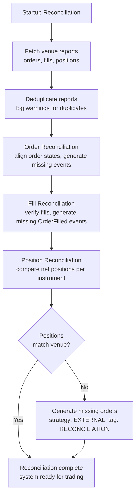

# Execution Reconciliation

Execution reconciliation aligns the venue's actual order and position state with the system's
internal event‑sourced state. Use this guide to understand startup state recovery and the
continuous checks that detect runtime discrepancies.

Unresolved live command outcomes are one source of state divergence. For how Nautilus classifies
local failures, definitive results, and unknown outcomes, see
[Command outcomes](execution.md#command-outcomes).

For the complete node lifecycle, see [Live trading](live.md). For the available settings and
recommended values, see
[Configure a live trading node](../how_to/configure_live_trading.md#executionengine-configuration).

## Reconciliation model

Only the `LiveExecutionEngine` performs reconciliation, since backtesting controls both sides.

Two scenarios:

- **Cached state exists**: report data generates missing events to align the state.
- **No cached state**: all orders and positions at the venue are generated from scratch.

:::tip
Persist all execution events to the cache database. This reduces reliance on venue history
and allows full recovery even with short lookback windows.
:::

## Reconciliation configuration

Unless `reconciliation` is set to false, the execution engine reconciles state for each
venue at startup. The `reconciliation_lookback_mins` parameter controls how far back the
engine requests history.

:::tip
Leave `reconciliation_lookback_mins` unset. This lets the engine request the maximum
execution history the venue provides.
:::

:::warning
Executions before the lookback window still generate alignment events, but with some
information loss that a longer window would avoid. Some venues also filter or drop
older execution data. Persisting all events to the cache database prevents both issues.
:::

Each strategy can claim venue-sourced external orders and materialized reconciliation activity
for an instrument ID via the `external_order_claims` config parameter. This lets a strategy
resume managing open orders and positions when no cached state exists.

Unclaimed external orders use strategy ID `EXTERNAL` with tag `VENUE`. Unclaimed orders
generated during position reconciliation use strategy ID `EXTERNAL` with tag `RECONCILIATION`.
Claimed orders and fills use the claiming strategy ID and have no external/reconciliation tag,
so the strategy can continue managing the recovered state.

:::tip
To detect unclaimed external orders in your strategy, check `order.strategy_id.value == "EXTERNAL"`.
These orders participate in portfolio calculations and position tracking like any other order.
:::

For all live trading options, see the `LiveExecEngineConfig`
[API reference](/docs/python-api-latest/config.html#nautilus_trader.live.LiveExecEngineConfig).

## Reconciliation procedure

All adapter execution clients follow the same reconciliation procedure, calling three methods
to produce an execution mass status:

- `generate_order_status_reports`
- `generate_fill_reports`
- `generate_position_status_reports`

These reports represent external reality. The procedure processes them in the order shown so each
position check builds on reconciled order and fill state.

### Report deduplication

- Deduplicates order reports within the batch and logs warnings.
- Logs duplicate trade IDs as warnings for investigation.

### Order reconciliation

- Generates and applies events to move orders from cached state to current state.
- Generates external order events for unrecognized client order IDs or reports missing a client
  order ID.

### Fill reconciliation

- Infers `OrderFilled` events for missing trade reports.
- Verifies fill report data consistency with tolerance‑based price and commission comparisons.

### Position reconciliation

- Matches the net position per account and instrument against venue position reports using
  instrument precision.
- Generates external order events when order reconciliation leaves a position that differs from
  the venue.
- When `generate_missing_orders` is enabled (default: True), generates orders with strategy ID
  `EXTERNAL` and tag `RECONCILIATION` to align discrepancies.
- Logs a warning when NETTING ownership is split across multiple strategies for the same account
  and instrument, since venue position reports are account‑level net positions.

When generating reconciliation orders, the engine uses this price hierarchy:

1. **Calculated reconciliation price** (preferred): targets the correct average position.
1. **Market mid‑price**: uses the current bid‑ask midpoint.
1. **Current position average**: uses the existing position's average price.
1. **MARKET order** (last resort): used only when no price data exists (no positions, no market data).

The engine uses LIMIT orders when a price can be determined (cases 1-3) to preserve PnL accuracy
and skips zero quantity differences after precision rounding.

### Partial-window adjustment

When `reconciliation_lookback_mins` is set, the window may miss opening fills. The system uses
lifecycle analysis to reconstruct positions accurately:

- Detects zero‑crossings (position qty crosses through FLAT) to identify separate lifecycles.
- Adds synthetic opening fills when the earliest lifecycle is incomplete.
- Filters out closed lifecycles when the current lifecycle matches the venue position.
- Replaces a mismatched current lifecycle with a synthetic fill reflecting the venue position.

Synthetic fills use calculated reconciliation prices to target correct average positions. See
[Partial window adjustment scenarios](#partial-window-adjustment-scenarios) for details.

### Failure handling

- Individual adapter failures do not abort the entire reconciliation process.
- Fill reports arriving before order status reports are deferred until order state is available.

If reconciliation fails, the system logs an error and does not start.

## Common reconciliation scenarios

The tables below cover startup reconciliation (mass status) and runtime checks
(in‑flight order checks, open‑order polls, own‑books audits).

### Startup reconciliation

| Scenario                               | Description                                                                     | System behavior                                                                 |
| -------------------------------------- | ------------------------------------------------------------------------------- | ------------------------------------------------------------------------------- |
| **Order state discrepancy**            | Local state differs from venue (e.g., local `SUBMITTED`, venue `REJECTED`).     | Updates local order to match venue state, emits missing events.                 |
| **Missed fills**                       | Venue filled an order but the engine missed the event.                          | Generates missing `OrderFilled` events.                                         |
| **Multiple fills**                     | Order has partial fills, some missed by the engine.                             | Reconstructs complete fill history from venue reports.                          |
| **External orders**                    | Orders exist on venue but not in local cache.                                   | Creates unclaimed orders with strategy ID `EXTERNAL` and tag `VENUE`.           |
| **Partially filled then canceled**     | Order partially filled then canceled by venue.                                  | Updates state to `CANCELED`, preserves fill history.                            |
| **Different fill data**                | Venue reports different fill price/commission than cached.                      | Preserves cached data, logs discrepancies.                                      |
| **Filtered orders**                    | Orders marked for filtering via config.                                         | Skips based on `filtered_client_order_ids` or instrument filters.               |
| **Duplicate order reports**            | Multiple orders share the same identifier.                                      | Deduplicates with warning logged.                                               |
| **Position quantity mismatch (long)**  | Internal long position differs from venue (e.g., 100 vs 150).                   | Generates BUY LIMIT with calculated price when `generate_missing_orders=True`.  |
| **Position quantity mismatch (short)** | Internal short position differs from venue (e.g., -100 vs -150).                | Generates SELL LIMIT with calculated price when `generate_missing_orders=True`. |
| **Position reduction**                 | Venue position smaller than internal (e.g., internal 150 long, venue 100 long). | Generates opposite‑side LIMIT order with calculated price.                      |
| **Position side flip**                 | Internal position opposite of venue (e.g., internal 100 long, venue 50 short).  | Generates LIMIT order to close internal and open external position.             |
| **Internal reconciliation orders**     | Orders generated to align position discrepancies.                               | Uses a claim when configured; otherwise `EXTERNAL` + `RECONCILIATION`.          |

### Runtime checks

Continuous reconciliation starts after startup reconciliation completes. It:

- Monitors in‑flight orders for delays exceeding a configured threshold.
- Reconciles open orders with the venue at configured intervals.
- Checks position status with the venue at configured intervals.
- Audits internal *own* order books against the venue's public books.

The loop waits for startup reconciliation to finish before starting periodic checks.
The `reconciliation_startup_delay_secs` parameter adds a further delay *after* startup
reconciliation completes, giving the system time to stabilize.

| Scenario                            | Description                                               | System behavior                                 |
| ----------------------------------- | --------------------------------------------------------- | ----------------------------------------------- |
| **In‑flight submit timeout**        | `SUBMITTED` remains unconfirmed beyond retry exhaustion.  | Resolves to `REJECTED` with `INFLIGHT_TIMEOUT`. |
| **In‑flight cancel/update timeout** | `PENDING_CANCEL` or `PENDING_UPDATE` exceeds the retries. | Resolves to `CANCELED` through reconciliation.  |
| **Open orders check discrepancy**   | Periodic poll detects a venue state change.               | Confirms status and applies transitions.        |
| **Position check discrepancy**      | Periodic poll detects a position mismatch.                | Generates reconciliation events when eligible.  |
| **Own books audit mismatch**        | Own order books diverge from venue public books.          | Audits and logs inconsistencies.                |

**In‑flight order timeout resolution** (venue does not respond after max retries):

| Current status   | Resolved to | Rationale                                                      |
| ---------------- | ----------- | -------------------------------------------------------------- |
| `SUBMITTED`      | `REJECTED`  | No acceptance was received before the retry limit.             |
| `PENDING_UPDATE` | `CANCELED`  | The in‑flight checker applies a terminal reconciliation event. |
| `PENDING_CANCEL` | `CANCELED`  | The in‑flight checker applies a terminal reconciliation event. |

These terminal results come from the in‑flight timeout checker. A missing open‑order report does
not by itself prove a pending modify or cancel outcome, so the consistency checks below leave those
states unresolved until another check can determine the venue state.

**Order consistency checks** (when cache state differs from venue state):

The *Not found* rows apply only in full‑history mode (`open_check_open_only=False`);
open‑only mode is the default.

| Cache status       | Venue status | Resolution   | Rationale                                                           |
| ------------------ | ------------ | ------------ | ------------------------------------------------------------------- |
| `SUBMITTED`        | *Not found*  | `REJECTED`   | Order never confirmed by venue (e.g., lost during network error).   |
| `ACCEPTED`         | *Not found*  | `REJECTED`   | Order doesn't exist at venue, likely was never successfully placed. |
| `ACCEPTED`         | `CANCELED`   | `CANCELED`   | Venue canceled the order (user action or venue‑initiated).          |
| `ACCEPTED`         | `EXPIRED`    | `EXPIRED`    | Order reached GTD expiration at venue.                              |
| `ACCEPTED`         | `REJECTED`   | `REJECTED`   | Venue rejected after initial acceptance (rare but possible).        |
| `PENDING_UPDATE`   | *Not found*  | *Unresolved* | Modification outcome remains unknown.                               |
| `PENDING_CANCEL`   | *Not found*  | *Unresolved* | Cancellation outcome remains unknown.                               |
| `PARTIALLY_FILLED` | `CANCELED`   | `CANCELED`   | Order canceled at venue with fills preserved.                       |
| `PARTIALLY_FILLED` | *Not found*  | `CANCELED`   | Order doesn't exist but had fills (reconciles fill history).        |

:::note
**Runtime reconciliation caveats:**

- **Open‑only mode**: venue "open orders" endpoints exclude closed orders by design, making
  it impossible to distinguish missing orders from recently closed ones. Pending
  cancel/update orders remain unresolved when a missing‑order check cannot prove the final
  venue state.
- **Recent order protection**: the engine skips reconciliation for orders whose last event
  falls within the `open_check_threshold_ms` window. This prevents false positives from race
  conditions where the venue is still processing.
- **Targeted query safeguard**: before applying a terminal "not found" resolution, the
  engine issues a single‑order query to the venue. This catches false negatives from bulk
  query limitations or timing delays.
- **Position report failures**: if a venue position query fails, the engine skips cached
  positions for that venue during the cycle instead of treating missing reports as flat.
- **`FILLED` orders** that are "not found" at the venue are silently ignored. Venues commonly
  drop completed orders from their query results.

:::

**Retry coordination.** The in‑flight loop increments its own per‑order retry count against
`inflight_check_retries` and mirrors that value into missing‑order tracking. The open‑order loop
increments the missing‑order count against `open_check_missing_retries`. Each loop applies its own
limit; neither setting automatically overrides the other.

When the open‑order loop exhausts retries, the engine issues one targeted
`GenerateOrderStatusReport` probe before applying a terminal state or leaving an ambiguous
pending cancel/update unresolved. If the venue returns the order, reconciliation proceeds and
missing‑order tracking clears. If a pending state remains unresolved, the engine also resets the
in‑flight count before checking again after the configured threshold.

Position checks use separate retry counters per instrument and account. A successful position
match clears the counter, while repeated unresolved discrepancies stop active reconciliation for
that pair until the discrepancy clears.

**Single‑order query throttling.** The engine caps single‑order queries per cycle via
`max_single_order_queries_per_cycle`. Remaining orders are deferred to the next cycle.
`single_order_query_delay_ms` spaces out consecutive queries to avoid rate limits. This
handles bulk query failures across hundreds of orders without overwhelming the venue API.

## Common reconciliation issues

- **Missing trade reports**: Some venues filter out older trades. Increase
  `reconciliation_lookback_mins` or cache all events locally.
- **Position mismatches**: External orders that predate the lookback window cause position drift.
  Flatten the account before restarting to reset state.
- **Split NETTING ownership**: Multiple strategies can hold cached positions for the same account
  and instrument, but venues report a single account-level net position. Prefer one claiming
  strategy per NETTING account/instrument pair when resuming external state.
- **Duplicate order IDs**: Deduplicated with warnings logged. Frequent duplicates may indicate
  venue data integrity issues.
- **Precision differences**: Small decimal differences are handled using instrument precision.
  Large discrepancies may indicate missing orders.
- **Out-of-order reports**: Fill reports arriving before order status reports are deferred until
  order state is available.

:::tip
For persistent issues, drop cached state or flatten accounts before restarting.
:::

## Reconciliation invariants

The reconciliation system maintains four invariants:

1. **Position quantity**: the final quantity matches the venue within instrument precision.
1. **Average entry price**: the position's average entry price matches the venue's reported price within tolerance (default 0.01%).
1. **PnL integrity**: all generated fills, including synthetic fills, use calculated prices that preserve correct unrealized PnL.
1. **ID determinism**: synthetic `trade_id` and `venue_order_id` values emitted during reconciliation are deterministic functions of the logical event. The same logical fill or position-adjustment order produces the same ID across restarts, so replayed reconciliation events dedupe against earlier runs instead of being treated as new.

These hold even when:

- The reconciliation window misses complete fill history.
- Fills are missing from venue reports.
- Position lifecycles span beyond the lookback window.
- Multiple zero-crossings have occurred.

## Partial window adjustment scenarios

When `reconciliation_lookback_mins` limits the window, the system analyzes position lifecycles
from fills and adjusts to reconstruct positions accurately.

| Scenario                                  | Description                                                    | System behavior                                          |
| ----------------------------------------- | -------------------------------------------------------------- | -------------------------------------------------------- |
| **Complete lifecycle**                    | All fills from opening to current state are captured.          | No adjustment.                                           |
| **Incomplete single lifecycle**           | Window misses opening fills, no zero‑crossings.                | Adds synthetic opening fill with calculated price.       |
| **Multiple lifecycles, current matches**  | Zero‑crossings detected, current lifecycle matches venue.      | Filters out old lifecycles, returns current only.        |
| **Multiple lifecycles, current mismatch** | Zero‑crossings detected, current lifecycle differs from venue. | Replaces current lifecycle with a single synthetic fill. |
| **Flat position**                         | Venue reports FLAT regardless of fill history.                 | No adjustment.                                           |
| **No fills**                              | Window contains no fill reports.                               | No adjustment, empty result.                             |

**Concepts:**

- **Zero-crossing**: position quantity crosses through zero (FLAT), marking a lifecycle boundary.
- **Lifecycle**: a sequence of fills between zero-crossings representing one open-close cycle.
- **Synthetic fill**: a calculated fill report representing missing activity, priced to achieve the correct average position.
- **Tolerance**: position matching uses configurable price tolerance (default 0.0001 = 0.01%) to absorb minor calculation differences.

## Related guides

- [Live trading](live.md) - Node lifecycle, configuration, metrics, and shutdown.
- [Configure a live trading node](../how_to/configure_live_trading.md) - Node and engine configuration.
- [Adapters](adapters.md) - Venue connectivity.
- [Execution](execution.md) - Command outcomes and execution flow.
