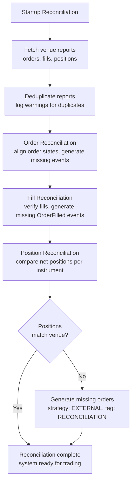

# Execution Reconciliation

Execution reconciliation aligns the venue's actual order and position state with the system's
internal event‑sourced state. Use this guide to understand startup state recovery and the
continuous checks that detect runtime discrepancies.

Unresolved live command outcomes are one source of state divergence. For how Nautilus classifies
local failures, definitive results, and unknown outcomes, see
[Command outcomes](execution.md#command-outcomes).

For the complete node lifecycle, see [Live trading](live.md). For the available settings and
recommended values, see
[Configure a live trading node](../how_to/configure_live_trading.md#executionengine-configuration).

## Reconciliation model

Only the `LiveExecutionEngine` performs reconciliation, since backtesting controls both sides.

Two scenarios:

- **Cached state exists**: report data generates missing events to align the state.
- **No cached state**: all orders and positions at the venue are generated from scratch.

:::tip
Persist all execution events to the cache database. This reduces reliance on venue history
and gives reconciliation the retained order and position state needed to interpret short history
windows.
:::

### Execution-client origins

An **execution‑client origin** is a write‑once binding between an order and the client responsible
for its execution.

**An origin is recorded:**

- From an explicit client on submission, or from the final client selected after routing and venue
  validation and before transport.
- When non‑synthetic external orders are materialized during startup reconciliation, from the
  reporting mass‑status client.
- When external orders are materialized from runtime venue reports and the report's account
  matches exactly one registered client that handles the instrument venue.

**An origin may be absent for:**

- Cache data written before resolved origins were persisted.
- External orders whose runtime report does not identify exactly one registered client by account
  and instrument venue.
- Synthetic reconciliation orders.

The built‑in cache backends enqueue a resolved origin for persistence before transport. Their
writes remain asynchronous, so enqueue order does not guarantee that the origin is durable before
the order reaches the client.

At startup, each client's mass status is checked against the cached origins: an order the client
reports is expected to be bound to that same client. A missing origin logs an aggregated warning
and remains compatible with existing cache data. A conflicting origin logs an aggregated
deprecation warning and reconciles for compatibility. A future release rejects the conflict as a
startup error. See the origin rows in
[Startup reconciliation](#startup-reconciliation).

This is separate from `external_order_claims` (see
[Reconciliation configuration](#reconciliation-configuration)), which attributes venue‑sourced
orders to a *strategy*. The execution‑client origin records which *client* an order belongs to.

## Reconciliation configuration

Unless `reconciliation` is set to false, the execution engine reconciles state for each
venue at startup. The `reconciliation_lookback_mins` parameter controls how far back the
engine requests history.

:::tip
Leave `reconciliation_lookback_mins` unset. This lets the engine request the maximum
execution history the venue provides.
:::

:::warning
A bounded history window can begin after the fill that opened a position. When an adapter declares
the lower bound in its mass status, the engine applies historical fill economics only when the
bounded report set and retained state prove a coherent position transition. Adapters that do not
declare the bound use the compatibility fill‑adjustment path, which can generate synthetic events
with information loss. Some venues also filter or drop older execution data.
:::

Each strategy can claim venue-sourced external orders and materialized reconciliation activity
for an instrument ID via the `external_order_claims` config parameter. This lets a strategy
resume managing open orders and positions when no cached state exists.

Unclaimed external orders use strategy ID `EXTERNAL` with tag `VENUE`. Unclaimed orders
generated during position reconciliation use strategy ID `EXTERNAL` with tag `RECONCILIATION`.
Claimed orders and fills use the claiming strategy ID and have no external/reconciliation tag,
so the strategy can continue managing the recovered state.

:::tip
To detect unclaimed external orders in your strategy, check `order.strategy_id.value == "EXTERNAL"`.
Ownership does not exclude these orders from position tracking or portfolio calculations. Historical
fills still follow the [bounded history safety](#bounded-history-safety) rules when applicable.
:::

For all live trading options, see the `LiveExecEngineConfig`
[API reference](/docs/python-api-latest/config.html#nautilus_trader.live.LiveExecEngineConfig).

### Instrument availability

Adapters parse reconciliation reports using the instrument, so every instrument a report references
must already be loaded. Adapters do not fetch missing instruments from the venue during
reconciliation.

Instrument scope comes from the adapter's provider config rather than the engine.
`InstrumentProviderConfig.load_ids` decides which instruments the adapter holds, while
`reconciliation_instrument_ids` filters reports only after the adapter has produced them.

Reports for instruments outside an explicit `load_ids` scope are expected: they are dropped at debug
level, so a node scoped to one instrument stays quiet about the rest of the venue. An in‑scope
instrument that does not resolve means something is wrong, whether it was named in `load_ids` or
covered by `load_all=True`, and the outcome depends on what the report describes:

- An open order or position report fails reconciliation, so the system does not start. A live
  position that cannot be priced is never silently dropped.
- A closed or historical record logs a warning instead of aborting startup. When the adapter
  declares a bounded history, the record also marks the report set incomplete, applying the
  [bounded history safety](#bounded-history-safety) rules. Expiries routinely retire instruments
  that older fills still reference.

## Reconciliation procedure

All adapter execution clients follow the same reconciliation procedure, calling three methods
to produce an execution mass status:

- `generate_order_status_reports`
- `generate_fill_reports`
- `generate_position_status_reports`

These reports represent external reality. The procedure processes them in the order shown so each
position check builds on reconciled order and fill state.

### Mass-status history contract

An `ExecutionMassStatus` can declare the provenance of its historical reports:

- `lookback_start=None` means that the adapter has not declared an explicit lower time bound.
- `lookback_start=Some(timestamp)` means that historical order and fill reports exclude venue
  activity before that timestamp.
- `reports_complete=true` means that every order, fill, and position source needed to interpret
  the bounded history completed and all required records were mapped successfully.

An adapter can still return authoritative active orders when a historical source fails. It marks
the mass status incomplete so the engine can recover those orders without treating the partial
history as proof of position or portfolio economics.

### Report deduplication

- Deduplicates order reports within the batch and logs warnings.
- Logs duplicate trade IDs as warnings for investigation.

### Order reconciliation

- Generates and applies events to move orders from cached state to current state.
- Generates external order events for unrecognized client order IDs or reports missing a client
  order ID.

### Fill reconciliation

- Infers `OrderFilled` events for missing trade reports.
- Verifies fill report data consistency with tolerance‑based price and commission comparisons.

### Position reconciliation

- Matches the net position per account and instrument against venue position reports using
  instrument precision.
- Generates external order events when order reconciliation leaves a position that differs from
  the venue.
- When `generate_missing_orders` is enabled (default: True), generates orders with strategy ID
  `EXTERNAL` and tag `RECONCILIATION` to align discrepancies.
- Logs a warning when NETTING ownership is split across multiple strategies for the same account
  and instrument, since venue position reports are account‑level net positions.

When generating reconciliation orders, the engine uses this price hierarchy:

1. **Calculated reconciliation price** (preferred): targets the correct average position.
1. **Market mid‑price**: uses the current bid‑ask midpoint.
1. **Current position average**: uses the existing position's average price.
1. **MARKET order** (last resort): used only when no price data exists (no positions, no market data).

The engine uses LIMIT orders when a price can be determined (cases 1-3) to preserve PnL accuracy
and skips zero quantity differences after precision rounding.

### Fill adjustment without an explicit report bound

For compatibility, a mass status without an explicit `lookback_start` follows the existing fill
adjustment path. The engine can analyze zero‑crossings, remove closed lifecycles, and generate a
synthetic fill when the reported fills do not explain the current venue position.

Adapters that apply a history cutoff should declare it through the
[mass‑status history contract](#mass-status-history-contract) instead of relying on this inference.

### Bounded history safety

For explicitly bounded NETTING history without a venue position ID, the engine applies historical
fills to positions and the portfolio only when all of the following evidence agrees:

- The report set is complete, and each fill has coherent account, instrument, order, side, and
  strategy ownership.
- Retained fills are excluded, and any cached predecessor is an unambiguous NETTING position for
  the same account, instrument, and strategy.
- A reduce‑only fill has a sufficient opposite‑side predecessor.
- Fill intervals are ordered without overlapping or equal timestamp boundaries that make their
  sequence ambiguous.
- Replaying the fills from retained state matches one unambiguous authoritative position report,
  including an explicit flat report.

If any condition fails, the engine projects the affected historical fill onto its order only. This
preserves the reported order status and filled quantity without opening, closing, or changing a
position and without publishing fill economics to the portfolio. Raw reconciliation reports remain
available, and position reconciliation can align an authoritative current position separately.

Reports with an explicit `venue_position_id` follow the position‑specific reconciliation path and
do not require NETTING lifecycle inference.

### Failure handling

- An adapter can preserve successful report legs after an individual source failure. Explicitly
  bounded mass statuses must mark the result incomplete, which makes unsupported historical fills
  order‑only.
- Fill reports arriving before order status reports are deferred until order state is available.

#### Commission failures

An adapter fill commission that cannot be calculated or represented fails the report request under
the [adapter contract](../developer_guide/adapters.md#commission-failure-handling). The adapter does
not drop that fill or replace its commission with zero or a generic formula. Startup stops before
applying that client's mass status.

When the engine asks the responsible execution client to calculate an inferred‑fill commission, a
failure defers the inferred quantity and dependent terminal transition until a later reconciliation
cycle succeeds. Valid explicit fills from the same report set can still apply. For an external order,
the engine resolves the commission before adding the order to the cache or publishing its initial
event, so a failure defers the entire external order. An unavailable responsible execution client
has the same fail‑closed result.

An inferred‑fill commission failure while applying an otherwise successful mass status does not
stop startup. The unresolved work remains pending for a later reconciliation cycle.

If startup reconciliation fails for any other reason, the system logs an error and does not start.

## Common reconciliation scenarios

The tables below cover startup reconciliation (mass status) and runtime checks
(in‑flight order checks, open‑order polls, own‑books audits).

### Startup reconciliation

| Scenario                               | Description                                                                     | System behavior                                                                                          |
| -------------------------------------- | ------------------------------------------------------------------------------- | -------------------------------------------------------------------------------------------------------- |
| **Order state discrepancy**            | Local state differs from venue (e.g., local `SUBMITTED`, venue `REJECTED`).     | Updates local order to match venue state, emits missing events.                                          |
| **Missed fills**                       | Complete venue history contains a fill the engine missed.                       | Generates the missing `OrderFilled` event and applies its economics.                                     |
| **Multiple fills**                     | A complete, coherent report set contains several fills for an order.            | Reconstructs the reported fill history in event order.                                                   |
| **Incomplete bounded history**         | A required order, fill, or position source failed or could not be mapped.       | Recovers order state but projects historical fills without position or portfolio effects.                |
| **Ambiguous bounded lifecycle**        | The bounded reports do not prove one coherent NETTING position transition.      | Preserves order state and leaves current position alignment to position reconciliation.                  |
| **External orders**                    | Orders exist on venue but not in local cache.                                   | Creates unclaimed orders with strategy ID `EXTERNAL` and tag `VENUE`.                                    |
| **Missing client origin**              | A cached order in the mass status has no recorded execution‑client origin.      | Logs one aggregated warning with a count and sample IDs; reconciles against the reporting client.        |
| **Conflicting client origin**          | A cached order's origin differs from the client that supplied the report.       | Logs one aggregated deprecation warning; reconciliation proceeds during the compatibility period.        |
| **Partially filled then canceled**     | Order partially filled then canceled by venue.                                  | Updates state to `CANCELED`, preserves fill history.                                                     |
| **Different fill data**                | Venue reports different fill price/commission than cached.                      | Preserves cached data, logs discrepancies.                                                               |
| **Filtered orders**                    | Orders marked for filtering via config.                                         | Skips based on `filtered_client_order_ids` or instrument filters.                                        |
| **Unresolved instrument**              | A report references an in‑scope instrument the adapter has not loaded.          | Fails startup for open order and position reports; warns and marks bounded history incomplete otherwise. |
| **Fill commission failure**            | An adapter cannot represent a required fill commission while building reports.  | Fails mass‑status generation and stops startup before applying that client's reports.                    |
| **Inferred‑fill commission failure**   | The responsible execution client cannot calculate a required commission.        | Defers inferred work; an external order remains absent, while valid explicit fills can still apply.      |
| **Duplicate order reports**            | Multiple orders share the same identifier.                                      | Deduplicates with warning logged.                                                                        |
| **Position quantity mismatch (long)**  | Internal long position differs from venue (e.g., 100 vs 150).                   | Generates BUY LIMIT with calculated price when `generate_missing_orders=True`.                           |
| **Position quantity mismatch (short)** | Internal short position differs from venue (e.g., -100 vs -150).                | Generates SELL LIMIT with calculated price when `generate_missing_orders=True`.                          |
| **Position reduction**                 | Venue position smaller than internal (e.g., internal 150 long, venue 100 long). | Generates opposite‑side LIMIT order with calculated price.                                               |
| **Position side flip**                 | Internal position opposite of venue (e.g., internal 100 long, venue 50 short).  | Generates LIMIT order to close internal and open external position.                                      |
| **Internal reconciliation orders**     | Orders generated to align position discrepancies.                               | Uses a claim when configured; otherwise `EXTERNAL` + `RECONCILIATION`.                                   |

### Runtime checks

Continuous reconciliation starts after startup reconciliation completes. It:

- Monitors in‑flight orders for delays exceeding a configured threshold.
- Reconciles open orders with the venue at configured intervals.
- Checks position status with the venue at configured intervals.
- Audits internal *own* order books against the venue's public books.

The loop waits for startup reconciliation to finish before starting periodic checks.
The `reconciliation_startup_delay_secs` parameter adds a further delay *after* startup
reconciliation completes, giving the system time to stabilize.

| Scenario                            | Description                                               | System behavior                                 |
| ----------------------------------- | --------------------------------------------------------- | ----------------------------------------------- |
| **In‑flight submit timeout**        | `SUBMITTED` remains unconfirmed beyond retry exhaustion.  | Resolves to `REJECTED` with `INFLIGHT_TIMEOUT`. |
| **In‑flight cancel/update timeout** | `PENDING_CANCEL` or `PENDING_UPDATE` exceeds the retries. | Resolves to `CANCELED` through reconciliation.  |
| **Open orders check discrepancy**   | Periodic poll detects a venue state change.               | Confirms status and applies transitions.        |
| **Position check discrepancy**      | Periodic poll detects a position mismatch.                | Generates reconciliation events when eligible.  |
| **Commission construction failure** | A required fill commission cannot be represented.         | Defers the affected work to a later cycle.      |
| **Own books audit mismatch**        | Own order books diverge from venue public books.          | Audits and logs inconsistencies.                |

**In‑flight order timeout resolution** (venue does not respond after max retries):

| Current status   | Resolved to | Rationale                                                      |
| ---------------- | ----------- | -------------------------------------------------------------- |
| `SUBMITTED`      | `REJECTED`  | No acceptance was received before the retry limit.             |
| `PENDING_UPDATE` | `CANCELED`  | The in‑flight checker applies a terminal reconciliation event. |
| `PENDING_CANCEL` | `CANCELED`  | The in‑flight checker applies a terminal reconciliation event. |

These terminal results come from the in‑flight timeout checker. A missing open‑order report does
not by itself prove a pending modify or cancel outcome, so the consistency checks below leave those
states unresolved until another check can determine the venue state.

**Order consistency checks** (when cache state differs from venue state):

The *Not found* rows apply only in full‑history mode (`open_check_open_only=False`);
open‑only mode is the default.

| Cache status       | Venue status | Resolution   | Rationale                                                           |
| ------------------ | ------------ | ------------ | ------------------------------------------------------------------- |
| `SUBMITTED`        | *Not found*  | `REJECTED`   | Order never confirmed by venue (e.g., lost during network error).   |
| `ACCEPTED`         | *Not found*  | `REJECTED`   | Order doesn't exist at venue, likely was never successfully placed. |
| `ACCEPTED`         | `CANCELED`   | `CANCELED`   | Venue canceled the order (user action or venue‑initiated).          |
| `ACCEPTED`         | `EXPIRED`    | `EXPIRED`    | Order reached GTD expiration at venue.                              |
| `ACCEPTED`         | `REJECTED`   | `REJECTED`   | Venue rejected after initial acceptance (rare but possible).        |
| `PENDING_UPDATE`   | *Not found*  | *Unresolved* | Modification outcome remains unknown.                               |
| `PENDING_CANCEL`   | *Not found*  | *Unresolved* | Cancellation outcome remains unknown.                               |
| `PARTIALLY_FILLED` | `CANCELED`   | `CANCELED`   | Order canceled at venue with fills preserved.                       |
| `PARTIALLY_FILLED` | *Not found*  | `CANCELED`   | Order doesn't exist but had fills (reconciles fill history).        |

:::note
**Runtime reconciliation caveats:**

- **Open‑only mode**: venue "open orders" endpoints exclude closed orders by design, making
  it impossible to distinguish missing orders from recently closed ones. Pending
  cancel/update orders remain unresolved when a missing‑order check cannot prove the final
  venue state.
- **Recent order protection**: the engine skips reconciliation for orders whose last event
  falls within the `open_check_threshold_ms` window. This prevents false positives from race
  conditions where the venue is still processing.
- **Targeted query safeguard**: before applying a terminal "not found" resolution, the
  engine issues a single‑order query to the venue. This catches false negatives from bulk
  query limitations or timing delays.
- **Position report failures**: if a venue position query fails, the engine skips cached
  positions for that venue during the cycle instead of treating missing reports as flat.
- **`FILLED` orders** that are "not found" at the venue are silently ignored. Venues commonly
  drop completed orders from their query results.

:::

**Retry coordination.** The in‑flight loop increments its own per‑order retry count against
`inflight_check_retries` and mirrors that value into missing‑order tracking. The open‑order loop
increments the missing‑order count against `open_check_missing_retries`. Each loop applies its own
limit; neither setting automatically overrides the other.

When the open‑order loop exhausts retries, the engine issues one targeted
`GenerateOrderStatusReport` probe before applying a terminal state or leaving an ambiguous
pending cancel/update unresolved. If the venue returns the order, reconciliation proceeds and
missing‑order tracking clears. If a pending state remains unresolved, the engine also resets the
in‑flight count before checking again after the configured threshold.

Position checks use separate retry counters per instrument and account. A successful position
match clears the counter, while repeated unresolved discrepancies stop active reconciliation for
that pair until the discrepancy clears.

**Single‑order query throttling.** The engine caps single‑order queries per cycle via
`max_single_order_queries_per_cycle`. Remaining orders are deferred to the next cycle.
`single_order_query_delay_ms` spaces out consecutive queries to avoid rate limits. This
handles bulk query failures across hundreds of orders without overwhelming the venue API.

## Common reconciliation issues

- **Missing trade reports**: Some venues filter out older trades. Increase
  `reconciliation_lookback_mins` or persist all events locally. Explicitly bounded adapters mark
  incomplete history so unsupported fills do not change positions or portfolio economics.
- **Position mismatches**: External orders that predate the lookback window cause position drift.
  Increase the window, restore retained state, or let an authoritative position report reconcile
  the current quantity. Flatten the account only as a deliberate operational recovery step.
- **Split NETTING ownership**: Multiple strategies can hold cached positions for the same account
  and instrument, but venues report a single account-level net position. Prefer one claiming
  strategy per NETTING account/instrument pair when resuming external state.
- **Duplicate order IDs**: Deduplicated with warnings logged. Frequent duplicates may indicate
  venue data integrity issues.
- **Unresolved instruments**: A report references an instrument the adapter never loaded. Add it to
  `load_ids` or set `load_all=True`. Reports outside an explicit `load_ids` scope are dropped by
  design and need no action.
- **Precision differences**: Small decimal differences are handled using instrument precision.
  Large discrepancies may indicate missing orders.
- **Out-of-order reports**: Fill reports arriving before order status reports are deferred until
  order state is available.

:::tip
For persistent issues, inspect the venue reports and cached ownership before dropping state or
flattening an account.
:::

## Reconciliation invariants

The reconciliation path preserves these guarantees for the reports and positions it processes:

1. **Order state**: authoritative reports recover the exact order status and filled quantity even
   when bounded history cannot support economic replay.
1. **Evidence‑gated economics**: an explicitly bounded historical fill changes a NETTING position
   and portfolio only when complete, coherent evidence proves the transition.
1. **Position quantity**: reconciled positions match authoritative venue reports within instrument
   precision.
1. **Price and PnL integrity**: applied or generated economic fills use reported or calculated
   prices that preserve the reconciled average entry price and unrealized PnL.
1. **ID determinism**: synthetic `trade_id` and `venue_order_id` values are deterministic functions
   of the logical event, so replay deduplicates them across restarts.

Incomplete or ambiguous bounded history therefore does not claim to reconstruct historical average
entry price or realized PnL. It recovers the order record and leaves unsupported historical
economics unapplied.

## Fill adjustment scenarios without an explicit bound

These scenarios apply when the mass status does not declare a `lookback_start`:

| Scenario                                  | Description                                             | System behavior                                         |
| ----------------------------------------- | ------------------------------------------------------- | ------------------------------------------------------- |
| **Complete lifecycle**                    | All fills from opening to current state are captured.   | No adjustment.                                          |
| **Incomplete single lifecycle**           | Reports miss opening fills, with no zero‑crossings.     | Adds a synthetic opening fill with calculated price.    |
| **Multiple lifecycles, current matches**  | Zero‑crossings separate earlier and current lifecycles. | Filters out old lifecycles and retains the current one. |
| **Multiple lifecycles, current mismatch** | The current lifecycle differs from the venue position.  | Replaces it with one synthetic fill.                    |
| **Flat position**                         | The venue reports flat regardless of fill history.      | Makes no adjustment.                                    |
| **No fills**                              | The report set contains no fills.                       | Returns the empty fill set.                             |

**Concepts:**

- **Zero-crossing**: position quantity crosses through zero (FLAT), marking a lifecycle boundary.
- **Lifecycle**: a sequence of fills between zero-crossings representing one open-close cycle.
- **Synthetic fill**: a calculated fill report representing missing activity, priced to achieve the correct average position.
- **Tolerance**: position matching uses configurable price tolerance (default 0.0001 = 0.01%) to absorb minor calculation differences.

## Bounded history scenarios

| Scenario                                 | Evidence                                                          | Economic fill behavior                                           |
| ---------------------------------------- | ----------------------------------------------------------------- | ---------------------------------------------------------------- |
| **Complete coherent sequence**           | Ordered fills replay to the one authoritative position report.    | Applies the fills normally.                                      |
| **Isolated reduce‑only close**           | No sufficient correlated predecessor exists.                      | Updates the order only.                                          |
| **Correlated cached predecessor**        | Same account, instrument, and strategy with sufficient quantity.  | Applies the fill normally.                                       |
| **Unrelated or undersized position**     | Cached state cannot fully support the transition.                 | Leaves the cached position unchanged and updates the order only. |
| **Incomplete report source**             | A required order, fill, or position leg failed or did not map.    | Updates affected historical orders only.                         |
| **Ambiguous fill ordering**              | Fill intervals overlap or share a boundary timestamp.             | Updates affected historical orders only.                         |
| **Missing or ambiguous position report** | No single authoritative NETTING report proves the final quantity. | Updates affected historical orders only.                         |
| **Explicit venue position identity**     | Reports carry a `venue_position_id`.                              | Uses the position‑specific reconciliation path.                  |

## Related guides

- [Live trading](live.md) - Node lifecycle, configuration, metrics, and shutdown.
- [Configure a live trading node](../how_to/configure_live_trading.md) - Node and engine configuration.
- [Adapters](adapters.md) - Venue connectivity.
- [Execution](execution.md) - Command outcomes and execution flow.
