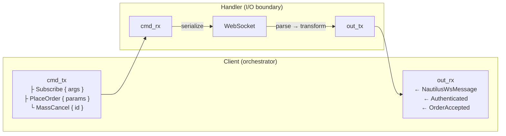

# Adapters

## Introduction

This developer guide provides specifications and instructions on how to develop an integration adapter for the NautilusTrader platform.
Adapters provide connectivity to trading venues and data providers, translating raw venue APIs into Nautilus’s unified interface and normalized domain model.

## Structure of an adapter

NautilusTrader adapters follow a layered architecture pattern with:

- **Rust core** for networking clients and performance-critical operations.
- **Python layer** for integrating Rust clients into the platform's data and execution engines.

### Rust core (`crates/adapters/your_adapter/`)

The Rust layer handles:

- **HTTP client**: Raw API communication, request signing, rate limiting.
- **WebSocket client**: Low-latency streaming connections, message parsing.
- **Parsing**: Fast conversion of venue data to Nautilus domain models.
- **Python bindings**: PyO3 exports to make Rust functionality available to Python.

Typical Rust structure:

```
crates/adapters/your_adapter/
├── src/
│   ├── common/              # Shared types and utilities
│   │   ├── consts.rs        # Venue constants / broker IDs
│   │   ├── credential.rs    # API key storage and signing helpers
│   │   ├── enums.rs         # Venue enums mirrored in REST/WS payloads
│   │   ├── error.rs         # Adapter-level error aggregation (when applicable)
│   │   ├── models.rs        # Shared model types
│   │   ├── parse.rs         # Shared parsing helpers
│   │   ├── retry.rs         # Retry classification (when applicable)
│   │   ├── urls.rs          # Environment & product aware base-url resolvers
│   │   └── testing.rs       # Fixtures reused across unit tests
│   ├── http/                # HTTP client implementation
│   │   ├── client.rs        # HTTP client with authentication
│   │   ├── error.rs         # HTTP-specific error types
│   │   ├── models.rs        # Structs for REST payloads
│   │   ├── parse.rs         # Response parsing functions
│   │   └── query.rs         # Request and query builders
│   ├── websocket/           # WebSocket implementation
│   │   ├── client.rs        # WebSocket client
│   │   ├── enums.rs         # WebSocket-specific enums
│   │   ├── error.rs         # WebSocket-specific error types
│   │   ├── handler.rs       # Message handler / feed handler
│   │   ├── messages.rs      # Structs for stream payloads
│   │   └── parse.rs         # Message parsing functions
│   ├── python/              # PyO3 Python bindings
│   │   ├── enums.rs         # Python-exposed enums
│   │   ├── http.rs          # Python HTTP client bindings
│   │   ├── urls.rs          # Python URL helpers
│   │   ├── websocket.rs     # Python WebSocket client bindings
│   │   └── mod.rs           # Module exports
│   ├── config.rs            # Configuration structures
│   ├── data.rs              # Data client implementation
│   ├── execution.rs         # Execution client implementation
│   ├── factories.rs         # Factory functions
│   └── lib.rs               # Library entry point
├── tests/                   # Integration tests with mock servers
│   ├── data_client.rs       # Data client integration tests
│   ├── exec_client.rs       # Execution client integration tests
│   ├── http.rs              # HTTP client integration tests
│   └── websocket.rs         # WebSocket client integration tests
└── test_data/               # Canonical venue payloads
```

### Python layer (`nautilus_trader/adapters/your_adapter`)

The Python layer provides the integration interface through these components:

1. **Instrument Provider**: Supplies instrument definitions via `InstrumentProvider`.
2. **Data Client**: Handles market data feeds and historical data requests via `LiveDataClient` and `LiveMarketDataClient`.
3. **Execution Client**: Manages order execution via `LiveExecutionClient`.
4. **Factories**: Converts venue-specific data to Nautilus domain models.
5. **Configuration**: User-facing configuration classes for client settings.

Typical Python structure:

```
nautilus_trader/adapters/your_adapter/
├── config.py     # Configuration classes
├── constants.py  # Adapter constants
├── data.py       # LiveDataClient/LiveMarketDataClient
├── execution.py  # LiveExecutionClient
├── factories.py  # Instrument factories
├── providers.py  # InstrumentProvider
└── __init__.py   # Package initialization
```

## Adapter implementation sequence

This section outlines the recommended order for implementing an adapter. The sequence follows a dependency-driven approach where each phase builds upon the previous ones.
Adapters use a Rust-first architecture: implement the Rust core before any Python layer.

### Phase 1: Rust core infrastructure

Build the low-level networking and parsing foundation.

| Step | Component                  | Description                                                                                  |
|------|----------------------------|----------------------------------------------------------------------------------------------|
| 1.1  | HTTP error types           | Define HTTP-specific error enum with retryable/non-retryable variants (`http/error.rs`).     |
| 1.2  | HTTP client                | Implement credentials, request signing, rate limiting, and retry logic.                      |
| 1.3  | HTTP API models            | Define request/response structs for REST endpoints (`http/models.rs`, `http/query.rs`).      |
| 1.4  | HTTP parsing               | Convert venue responses to Nautilus domain models (`http/parse.rs`, `common/parse.rs`).      |
| 1.5  | WebSocket error types      | Define WebSocket-specific error enum (`websocket/error.rs`).                                 |
| 1.6  | WebSocket client           | Implement connection lifecycle, authentication, heartbeat, and reconnection.                 |
| 1.7  | WebSocket messages         | Define streaming payload types (`websocket/messages.rs`).                                    |
| 1.8  | WebSocket parsing          | Convert stream messages to Nautilus domain models (`websocket/parse.rs`).                    |
| 1.9  | Python bindings            | Expose Rust functionality via PyO3 (`python/mod.rs`).                                        |

**Milestone**: Rust crate compiles, unit tests pass, HTTP/WebSocket clients can authenticate and stream/request raw data.

### Phase 2: Instrument definitions

Instruments are the foundation: both data and execution clients depend on them.

| Step | Component                  | Description                                                                                  |
|------|----------------------------|----------------------------------------------------------------------------------------------|
| 2.1  | Instrument parsing         | Parse venue instrument definitions into Nautilus types (spot, perpetual, future, option).    |
| 2.2  | Instrument provider        | Implement `InstrumentProvider` to load, filter, and cache instruments.                       |
| 2.3  | Symbol mapping             | Handle venue-specific symbol formats and Nautilus `InstrumentId` conversion.                 |

**Milestone**: `InstrumentProvider.load_all_async()` returns valid Nautilus instruments.

### Phase 3: Market data

Build data subscriptions and historical data requests.

| Step | Component                  | Description                                                                                  |
|------|----------------------------|----------------------------------------------------------------------------------------------|
| 3.1  | Public WebSocket streams   | Subscribe to order books, trades, tickers, and other public channels.                        |
| 3.2  | Historical data requests   | Fetch historical bars, trades, and order book snapshots via HTTP.                            |
| 3.3  | Data client (Python)       | Implement `LiveDataClient` or `LiveMarketDataClient` wiring Rust clients to the data engine. |

**Milestone**: Data client connects, subscribes to instruments, and emits market data to the platform.

### Phase 4: Order execution

Build order management and account state.

| Step | Component                  | Description                                                                                  |
|------|----------------------------|----------------------------------------------------------------------------------------------|
| 4.1  | Private WebSocket streams  | Subscribe to order updates, fills, positions, and account balance changes.                   |
| 4.2  | Basic order submission     | Implement market and limit orders via HTTP or WebSocket.                                     |
| 4.3  | Order modification/cancel  | Implement order amendment and cancellation.                                                  |
| 4.4  | Execution client (Python)  | Implement `LiveExecutionClient` wiring Rust clients to the execution engine.                 |
| 4.5  | Execution reconciliation   | Generate order, fill, and position status reports for startup reconciliation.                |

**Milestone**: Execution client submits orders, receives fills, and reconciles state on connect.

### Phase 5: Advanced features

Extend coverage based on venue capabilities.

| Step | Component                  | Description                                                                                  |
|------|----------------------------|----------------------------------------------------------------------------------------------|
| 5.1  | Advanced order types       | Conditional orders, stop-loss, take-profit, trailing stops, iceberg, etc.                    |
| 5.2  | Batch operations           | Batch order submission, batch cancellation, mass cancel.                                     |
| 5.3  | Venue-specific features    | Options chains, funding rates, liquidations, or other venue-specific data.                   |

### Phase 6: Configuration and factories

Wire everything together for production usage.

| Step | Component                  | Description                                                                                  |
|------|----------------------------|----------------------------------------------------------------------------------------------|
| 6.1  | Configuration classes      | Create `LiveDataClientConfig` and `LiveExecClientConfig` subclasses.                         |
| 6.2  | Factory functions          | Implement factory functions to instantiate clients from configuration.                       |
| 6.3  | Environment variables      | Support credential resolution from environment variables.                                    |

### Phase 7: Testing and documentation

Validate the integration and document usage.

| Step | Component                  | Description                                                                                  |
|------|----------------------------|----------------------------------------------------------------------------------------------|
| 7.1  | Rust unit tests            | Test parsers, signing helpers, and business logic in `#[cfg(test)]` blocks.                  |
| 7.2  | Rust integration tests     | Test HTTP/WebSocket clients against mock Axum servers in `tests/`.                           |
| 7.3  | Python integration tests   | Test data/execution clients in `tests/integration_tests/adapters/<adapter>/`.                |
| 7.4  | Example scripts            | Provide runnable examples demonstrating data subscription and order execution.               |

See the [Testing](#testing) section for detailed test organization guidelines.

---

## Rust adapter patterns

### Common code (`common/`)

Group venue constants, credential helpers, enums, and reusable parsers under `src/common`.
Adapters such as OKX keep submodules like `consts`, `credential`, `enums`, and `urls` alongside a `testing` module
for fixtures, providing a single place for cross-cutting pieces.
When an adapter has multiple environments or product categories, add a dedicated `common::urls` helper so
REST/WebSocket base URLs stay in sync with the Python layer.

### URL resolution

Define URL constants and resolution functions in `common/urls.rs`:

```rust
const VENUE_WS_URL: &str = "wss://stream.venue.com/ws";
const VENUE_TESTNET_WS_URL: &str = "wss://testnet-stream.venue.com/ws";

pub const fn get_ws_base_url(testnet: bool) -> &'static str {
    if testnet { VENUE_TESTNET_WS_URL } else { VENUE_WS_URL }
}
```

Config structs should provide override fields (`base_url_http`, `base_url_ws`, etc.) that fall back
to these defaults when unset.

### Configurations (`config.rs`)

Expose typed config structs in `src/config.rs` so Python callers toggle venue-specific behaviour
(see how OKX wires demo URLs, retries, and channel flags).
Keep defaults minimal and delegate URL selection to helpers in `common::urls`.

All config structs (data and execution) must implement `Default`. This enables the
`..Default::default()` pattern in examples and tests, keeping only the fields that differ
from defaults visible:

```rust
let exec_config = VenueExecClientConfig {
    trader_id,
    account_id,
    environment: VenueEnvironment::Testnet,
    ..Default::default()
};
```

Default values should use sensible production defaults: credentials as `None` (resolved
from environment at runtime), mainnet URLs, standard timeouts. For `trader_id` and
`account_id`, use placeholder values like `TraderId::from("TRADER-001")` and
`AccountId::from("VENUE-001")`.

### Error taxonomy (`common/error.rs`)

For adapters with multiple client types, define an adapter-level error enum in `common/error.rs` that
aggregates component errors:

```rust
#[derive(Debug, thiserror::Error)]
pub enum VenueError {
    #[error("HTTP error: {0}")]
    Http(#[from] VenueHttpError),

    #[error("WebSocket error: {0}")]
    WebSocket(#[from] VenueWsError),

    #[error("Build error: {0}")]
    Build(#[from] VenueBuildError),
}
```

This enables unified error handling at the adapter boundary while preserving component-specific
error details for debugging.

### Retry classification (`common/retry.rs`)

When an adapter needs sophisticated retry logic, define a retry classification module in `common/retry.rs`
that distinguishes between retryable, non-retryable, and fatal errors:

```rust
#[derive(Debug, thiserror::Error)]
pub enum VenueError {
    #[error("Retryable error: {source}")]
    Retryable {
        #[source]
        source: VenueRetryableError,
        retry_after: Option<Duration>,
    },

    #[error("Non-retryable error: {source}")]
    NonRetryable {
        #[source]
        source: VenueNonRetryableError,
    },

    #[error("Fatal error: {source}")]
    Fatal {
        #[source]
        source: VenueFatalError,
    },
}
```

Include helper methods like `from_http_status()`, `from_rate_limit_headers()`, `is_retryable()`,
`is_fatal()`, and `retry_after()` to enable consistent error classification across the adapter.
See BitMEX and Bybit adapters for reference implementations.

### Python exports (`python/mod.rs`)

Mirror the Rust surface area through PyO3 modules by re-exporting clients, enums, and helper functions.
When new functionality lands in Rust, add it to `python/mod.rs` so the Python layer stays in sync
(the OKX adapter is a good reference).

### Python bindings (`python/`)

Expose Rust functionality to Python through PyO3.
Mark venue-specific structs that need Python access with `#[pyclass]` and implement `#[pymethods]` blocks with
`#[getter]` attributes for field access.

For async methods in the HTTP client, use `pyo3_async_runtimes::tokio::future_into_py` to convert Rust futures
into Python awaitables.
When returning lists of custom types, map each item with `Py::new(py, item)` before constructing the Python list.
Register all exported classes and enums in `python/mod.rs` using `m.add_class::<YourType>()` so they're available
to Python code.

Follow the pattern established in other adapters: prefixing Python-facing methods with `py_*` in Rust while using
`#[pyo3(name = "method_name")]` to expose them without the prefix.

When delivering instruments from WebSocket to Python, use `instrument_any_to_pyobject()` which returns PyO3 types
for caching.
For the reverse direction (Python→Rust), use `pyobject_to_instrument_any()` in `cache_instrument()` methods.
Never call `.into_py_any()` directly on `InstrumentAny` as it doesn't implement the required trait.

### Type qualification

Adapter-specific types (enums, structs) and Nautilus domain types should not be fully qualified.
Import them at the module level and use short names (e.g., `OKXContractType` instead of
`crate::common::enums::OKXContractType`, `InstrumentId` instead of `nautilus_model::identifiers::InstrumentId`).
This keeps code concise and readable.
Only fully qualify types from `anyhow` and `tokio` to avoid ambiguity with similarly-named types from other crates.

### String interning

Use `ustr::Ustr` for any non-unique strings the platform stores repeatedly (venues, symbols, instrument IDs) to
minimise allocations and comparisons.

### Instrument cache standardization

All clients that cache instruments must implement three methods with standardized names: `cache_instruments()`
(plural, bulk replace), `cache_instrument()` (singular, upsert), and `get_instrument()` (retrieve by symbol).
WebSocket clients should use the dual-tier cache architecture (outer `DashMap`, inner `AHashMap`, command channel
sync) documented under WebSocket patterns.

### Testing helpers (`common/testing.rs`)

Store shared fixtures and payload loaders in `src/common/testing.rs` for use across HTTP and WebSocket unit tests.
This keeps `#[cfg(test)]` helpers out of production modules and encourages reuse.

### Factory module (`factories.rs`)

Complex adapters may define a `factories.rs` module for converting venue data to Nautilus types.
This centralizes transformation logic that would otherwise be scattered across HTTP and WebSocket
parsers:

```rust
// factories.rs
pub fn create_instrument(
    venue_instrument: &VenueInstrument,
    ts_init: UnixNanos,
) -> anyhow::Result<InstrumentAny> {
    match venue_instrument.instrument_type {
        InstrumentType::Perpetual => parse_perpetual(venue_instrument, ts_init),
        InstrumentType::Future => parse_future(venue_instrument, ts_init),
        InstrumentType::Option => parse_option(venue_instrument, ts_init),
    }
}
```

Use this pattern when the same venue data structures are parsed in multiple places (HTTP responses,
WebSocket updates, historical data).

### Connection lifecycle (`connect`)

Both data and execution clients follow a strict initialization order during `connect()` to prevent
race conditions with reconciliation and strategy startup. The platform waits for all clients to
signal connected before running reconciliation or starting strategies, so all initialization must
complete within `connect()`.

#### Data client

1. **Fetch instruments via REST** - call `bootstrap_instruments()` or equivalent.
2. **Cache locally** - populate the client's internal instrument map and HTTP client cache.
3. **Emit to data engine** - send each instrument as `DataEvent::Instrument` via `data_sender`.
   These events are queued during startup and processed before reconciliation runs.
4. **Cache to WebSocket** - call `ws.cache_instruments()` so the handler can parse messages.
5. **Connect WebSocket** - establish the streaming connection.

```rust
async fn connect(&mut self) -> anyhow::Result<()> {
    let instruments = self.bootstrap_instruments().await?;
    ws.cache_instruments(instruments);
    ws.connect().await?;
    ws.wait_until_active(10.0).await?;
    // ...
}
```

#### Execution client

1. **Initialize instruments** - fetch via REST if not already cached. Cache to HTTP, WebSocket,
   and broadcaster clients.
2. **Connect WebSocket** - establish the private streaming connection.
3. **Subscribe to channels** - orders, executions, positions, wallet/margin.
4. **Start WebSocket stream handler** - begin processing incoming messages.
5. **Fetch account state** - request account state via REST and emit via `emitter.send_account_state()`.
6. **Await account registered** - poll the cache until the account is registered (30s timeout).
   This ensures the portfolio can process orders during reconciliation.
7. **Signal connected** - call `self.core.set_connected()`.

```rust
async fn connect(&mut self) -> anyhow::Result<()> {
    self.ensure_instruments_initialized_async().await?;

    self.ws_client.connect().await?;
    self.ws_client.wait_until_active(10.0).await?;
    // ... subscribe channels, start stream ...

    self.refresh_account_state().await?;
    self.await_account_registered(30.0).await?;

    self.core.set_connected();
    Ok(())
}
```

The `await_account_registered` method polls `self.core.cache().account(&account_id)` at 10ms
intervals until the account appears or the timeout expires.

## HTTP client patterns

Adapters use a standardized two-layer HTTP client architecture to separate low-level API operations from high-level domain logic while enabling efficient cloning for Python bindings.

### Client structure

The architecture consists of two complementary clients:

1. **Raw client** (`MyRawHttpClient`) - Low-level API methods matching venue endpoints.
2. **Domain client** (`MyHttpClient`) - High-level methods using Nautilus domain types.

```rust
use std::sync::Arc;
use nautilus_network::http::HttpClient;

// Raw HTTP client - low-level API methods matching venue endpoints
pub struct MyRawHttpClient {
    base_url: String,
    client: HttpClient,  // Use nautilus_network::http::HttpClient, not reqwest directly
    credential: Option<Credential>,
    retry_manager: RetryManager<MyHttpError>,
    cancellation_token: CancellationToken,
}

// Domain HTTP client - wraps raw client with Arc, provides high-level API
pub struct MyHttpClient {
    pub(crate) inner: Arc<MyRawHttpClient>,
    // Additional domain-specific state (e.g., instrument cache)
    instruments: DashMap<InstrumentId, InstrumentAny>,
}
```

**Key points**:

- **Raw client** (`MyRawHttpClient`) contains low-level HTTP methods named to match venue endpoints as closely as possible (e.g., `get_instruments`, `get_balance`, `place_order`). These methods take venue-specific query objects and return venue-specific response types.
- **Domain client** (`MyHttpClient`) wraps the raw client in an `Arc` for efficient cloning (required for Python bindings). It provides high-level methods that accept Nautilus domain types (e.g., `InstrumentId`, `ClientOrderId`) and return domain objects. It may cache instruments or other venue metadata.
- Use `nautilus_network::http::HttpClient` instead of `reqwest::Client` directly - this provides rate limiting, retry logic, and consistent error handling.
- Both clients are exposed to Python, but the domain client is the primary interface for most use cases.

### Parser functions

Parser functions convert venue-specific data structures into Nautilus domain objects. These belong in `common/parse.rs` for cross-cutting conversions (instruments, trades, bars) or `http/parse.rs` for REST-specific transformations. Each parser takes venue data plus context (account IDs, timestamps, instrument references) and returns a Nautilus domain type wrapped in `Result`.

**Standard patterns:**

- Handle string-to-numeric conversions with proper error context using `.parse::<f64>()` and `anyhow::Context`.
- Check for empty strings before parsing optional fields - venues often return `""` instead of omitting fields.
- Map venue enums to Nautilus enums explicitly with `match` statements rather than implementing automatic conversions that could hide mapping errors.
- Accept instrument references when precision or other metadata is required for constructing Nautilus types (quantities, prices).
- Use descriptive function names: `parse_position_status_report`, `parse_order_status_report`, `parse_trade_tick`.

Place parsing helpers (`parse_price_with_precision`, `parse_timestamp`) in the same module as private functions when they're reused across multiple parsers.

### Method naming and organization

The raw client contains low-level API methods that closely match venue endpoints, taking venue-specific query parameter types and returning venue response types. The domain client wraps the raw client and provides high-level methods that accept Nautilus domain types.

**Naming conventions:**

- **Raw client methods**: Named to match venue endpoints as closely as possible (e.g., `get_instruments`, `get_balance`, `place_order`). These methods are internal to the raw client and take venue-specific types (builders, JSON values).
- **Domain client methods**: Named based on operation semantics (e.g., `request_instruments`, `submit_order`, `cancel_order`). These are the methods exposed to Python and take Nautilus domain objects (InstrumentId, ClientOrderId, OrderSide, etc.).

**Domain method flow:**

Domain methods follow a three-step pattern: build venue-specific parameters from Nautilus types, call the corresponding raw client method, then parse the response. For endpoints returning domain objects (positions, orders, trades), call parser functions from `common/parse`. For endpoints returning raw venue data (fee rates, balances), extract the result directly from the response envelope. Methods prefixed with `request_*` indicate they return domain data, while methods like `submit_*`, `cancel_*`, or `modify_*` perform actions and return acknowledgments.

The domain client wraps the raw client in an `Arc` for efficient cloning required by Python bindings.

### Query parameter builders

Use the `derive_builder` crate with proper defaults and ergonomic Option handling:

```rust
use derive_builder::Builder;

#[derive(Clone, Debug, Deserialize, Serialize, Builder)]
#[serde(rename_all = "camelCase")]
#[builder(setter(into, strip_option), default)]
pub struct InstrumentsInfoParams {
    pub category: ProductType,
    #[serde(skip_serializing_if = "Option::is_none")]
    pub symbol: Option<String>,
    #[serde(skip_serializing_if = "Option::is_none")]
    pub limit: Option<u32>,
}

impl Default for InstrumentsInfoParams {
    fn default() -> Self {
        Self {
            category: ProductType::Linear,
            symbol: None,
            limit: None,
        }
    }
}
```

**Key attributes:**

- `#[builder(setter(into, strip_option), default)]` - enables clean API: `.symbol("BTCUSDT")` instead of `.symbol(Some("BTCUSDT".to_string()))`.
- `#[serde(skip_serializing_if = "Option::is_none")]` - omits optional fields from query strings.
- Always implement `Default` for builder parameters.

### Request signing and authentication

Keep signing logic in a `Credential` struct under `common/credential.rs`:

- Store API keys using `Ustr` for efficient comparison, secrets in `Box<[u8]>` with `#[zeroize]`.
- Implement `sign()` and `sign_bytes()` methods that compute HMAC-SHA256 signatures.
- Pass the credential to the raw HTTP client; the domain client delegates signing through the inner client.

For WebSocket authentication, the handler constructs login messages using the same `Credential::sign()` method with a WebSocket-specific timestamp format.

### Credential module structure

Each adapter's `common/credential.rs` must provide two things:

1. **`credential_env_vars()` free function**: returns environment variable names as a tuple.
2. **`Credential::resolve()` method**: resolves credentials from config values or environment
   variables using `resolve_env_var_pair` from `nautilus_core::env`.

Config structs are DTOs and must not contain credential resolution logic. All resolution
belongs in `credential.rs`.

**Standard layout:**

```rust
use nautilus_core::env::resolve_env_var_pair;

/// Returns the environment variable names for API credentials.
pub fn credential_env_vars(is_testnet: bool) -> (&'static str, &'static str) {
    if is_testnet {
        ("{VENUE}_TESTNET_API_KEY", "{VENUE}_TESTNET_API_SECRET")
    } else {
        ("{VENUE}_API_KEY", "{VENUE}_API_SECRET")
    }
}

impl Credential {
    /// Resolves credentials from provided values or environment variables.
    pub fn resolve(
        api_key: Option<String>,
        api_secret: Option<String>,
        is_testnet: bool,
    ) -> Option<Self> {
        let (key_var, secret_var) = credential_env_vars(is_testnet);
        let (k, s) = resolve_env_var_pair(api_key, api_secret, key_var, secret_var)?;
        Some(Self::new(k, s))
    }
}
```

### Environment variable conventions

Adapters support loading API credentials from environment variables when not provided directly. This enables secure credential management without hardcoding secrets.

**Naming conventions:**

| Environment  | API Key Variable          | API Secret Variable |
|--------------|---------------------------|---------------------|
| Mainnet/Live | `{VENUE}_API_KEY`         | `{VENUE}_API_SECRET` |
| Testnet      | `{VENUE}_TESTNET_API_KEY` | `{VENUE}_TESTNET_API_SECRET` |
| Demo         | `{VENUE}_DEMO_API_KEY`    | `{VENUE}_DEMO_API_SECRET` |

Some venues require additional credentials:

- OKX: `OKX_API_PASSPHRASE`

**Key principles:**

- Environment variable names must be centralized in `credential_env_vars()`, never
  duplicated as string literals across files.
- Environment variable resolution should happen in core Rust code, not Python bindings.
- Use `get_or_env_var_opt` for optional credentials (returns `None` if missing).
- Use `get_or_env_var` when credentials are required (returns error if missing).
- Invalid credentials (e.g. malformed keys) must fail fast with an error, never silently
  degrade to unauthenticated mode.

### Error handling and retry logic

Use the `RetryManager` from `nautilus_network` for consistent retry behavior.

### Rate limiting

Configure rate limiting through `HttpClient` using `LazyLock<Quota>` static variables.

**Naming conventions:**

- REST quotas: `{VENUE}_REST_QUOTA` (e.g., `OKX_REST_QUOTA`, `BYBIT_REST_QUOTA`)
- WebSocket quotas: `{VENUE}_WS_{OPERATION}_QUOTA` (e.g., `OKX_WS_CONNECTION_QUOTA`, `OKX_WS_ORDER_QUOTA`)
- Rate limit keys: `{VENUE}_RATE_LIMIT_KEY_{OPERATION}` (e.g., `OKX_RATE_LIMIT_KEY_SUBSCRIPTION`, `OKX_RATE_LIMIT_KEY_ORDER`)

**Standard rate limit keys for WebSocket:**

| Key                             | Operations                       |
|---------------------------------|----------------------------------|
| `*_RATE_LIMIT_KEY_SUBSCRIPTION` | Subscribe, unsubscribe, login.   |
| `*_RATE_LIMIT_KEY_ORDER`        | Place orders (regular and algo). |
| `*_RATE_LIMIT_KEY_CANCEL`       | Cancel orders, mass cancel.      |
| `*_RATE_LIMIT_KEY_AMEND`        | Amend/modify orders.             |

**Example:**

```rust
pub static OKX_REST_QUOTA: LazyLock<Quota> =
    LazyLock::new(|| Quota::per_second(NonZeroU32::new(250).unwrap()));

pub static OKX_WS_SUBSCRIPTION_QUOTA: LazyLock<Quota> =
    LazyLock::new(|| Quota::per_hour(NonZeroU32::new(480).unwrap()));

pub const OKX_RATE_LIMIT_KEY_ORDER: &str = "order";
```

Pass rate limit keys when sending WebSocket messages to enforce per-operation quotas:

```rust
self.send_with_retry(payload, Some(vec![OKX_RATE_LIMIT_KEY_ORDER.to_string()])).await
```

## WebSocket client patterns

WebSocket clients handle real-time streaming data and require careful management of connection state, authentication, subscriptions, and reconnection logic.

### Client structure

WebSocket adapters use a **two-layer architecture** to separate Python-accessible state from high-performance async I/O:

#### Connection state tracking

Track connection state using `Arc<ArcSwap<AtomicU8>>` to provide lock-free, race-free visibility across all clones:

```rust
use arc_swap::ArcSwap;

pub struct MyWebSocketClient {
    connection_mode: Arc<ArcSwap<AtomicU8>>,  // Shared connection mode (lock-free)
    signal: Arc<AtomicBool>,                   // Cancellation signal for graceful shutdown
    // ...
}
```

**Pattern breakdown:**

- **Outer `Arc`**: Shared across all clones (Python bindings clone clients before async operations).
- **`ArcSwap`**: Enables atomic pointer replacement via `.store()` without replacing the outer Arc.
- **Inner `Arc<AtomicU8>`**: The actual connection state from `WebSocketClient::connection_mode_atomic()`.

Initialize with a placeholder atomic (`ConnectionMode::Closed`), then in `connect()` call `.store(client.connection_mode_atomic())` to atomically swap to the underlying client's state. All clones see updates instantly through lock-free `.load()` calls in `is_active()`.

The underlying `WebSocketClient` sends a `RECONNECTED` sentinel message when reconnection completes, triggering resubscription logic in the handler.

**Outer client** (`{Venue}WebSocketClient`):

- Orchestrates connection lifecycle, authentication, subscriptions.
- Maintains state for Python access using `Arc<DashMap<K, V>>`.
- Tracks subscription state for reconnection logic.
- Stores instruments cache for replay on reconnect.
- Sends commands to handler via `cmd_tx` channel.
- Receives domain events via `out_rx` channel.

**Inner handler** (`{Venue}WsFeedHandler`):

- Runs in dedicated Tokio task as stateless I/O boundary.
- Owns `WebSocketClient` exclusively (no `RwLock` needed).
- Processes commands from `cmd_rx` → serializes to JSON → sends via WebSocket.
- Receives raw WebSocket messages → deserializes → transforms to `NautilusWsMessage` → emits via `out_tx`.
- Owns pending request state using `AHashMap<K, V>` (single-threaded, no locking).
- Owns working instruments cache for transformations.

**Communication pattern:**



**Key principles:**

- **No shared locks on hot path**: Handler owns `WebSocketClient`, client sends commands via lock-free mpsc channel.
- **Command pattern for all sends**: Subscriptions, orders, cancellations all route through `HandlerCommand` enum.
- **Event pattern for state**: Handler emits `NautilusWsMessage` events (including `Authenticated`), client maintains state from events.
- **Pending state ownership**: Handler owns `AHashMap` for matching responses (no `Arc<DashMap>` between layers).
- **Python constraint**: Client uses `Arc<DashMap>` only for state Python might query; handler uses `AHashMap` for internal matching.

### Authentication

Authentication state is managed through events:

- Handler processes `Login` response → **returns** `NautilusWsMessage::Authenticated` immediately.
- Client receives event → updates local auth state → proceeds with subscriptions.
- `AuthTracker` may be shared via `Arc` for state queries, but handler returns events directly (no blocking).

**Note**: The `Authenticated` message is consumed in the client's spawn loop for reconnection flow coordination and is not forwarded to downstream consumers (data/execution clients). Downstream consumers can query authentication state via `AuthTracker` if needed. The execution client's `Authenticated` handler only logs at debug level with no critical logic depending on this event.

### Subscription management

#### Shared `SubscriptionState` pattern

The `SubscriptionState` struct from `nautilus_network::websocket` is shared between client and handler using `Arc<DashMap<>>` internally for thread-safe access:

- **`SubscriptionState` is shared via `Arc`**: Both client and handler receive `.clone()` of the same instance (shallow clone of Arc pointers).
- **Responsibility split**: Client tracks user intent (`mark_subscribe`, `mark_unsubscribe`), handler tracks server confirmations (`confirm_subscribe`, `confirm_unsubscribe`, `mark_failure`).
- **Why both need it**: Single source of truth with lock-free concurrent access, no synchronization overhead.

#### Subscription lifecycle

A **subscription** represents any topic in one of two states:

| State         | Description |
|---------------|-------------|
| **Pending**   | Subscription request sent to venue, awaiting acknowledgment. |
| **Confirmed** | Venue acknowledged subscription and is actively streaming data. |

State transitions follow this lifecycle:

| Trigger           | Method Called        | From State | To State  | Notes |
|-------------------|----------------------|------------|-----------|-------|
| User subscribes   | `mark_subscribe()`   | —          | Pending   | Topic added to pending set. |
| Venue confirms    | `confirm()`          | Pending    | Confirmed | Moved from pending to confirmed. |
| Venue rejects     | `mark_failure()`     | Pending    | Pending   | Stays pending for retry on reconnect. |
| User unsubscribes | `mark_unsubscribe()` | Confirmed  | Pending   | Temporarily pending until ack. |
| Unsubscribe ack   | `clear_pending()`    | Pending    | Removed   | Topic fully removed. |

**Key principles**:

- `subscription_count()` reports **only confirmed subscriptions**, not pending ones.
- Failed subscriptions remain pending and are automatically retried on reconnect.
- Both confirmed and pending subscriptions are restored after reconnection.
- Unsubscribe operations must check the `op` field in acknowledgments to avoid re-confirming topics.

#### Topic format patterns

Adapters use venue-specific delimiters to structure subscription topics:

| Adapter    | Delimiter | Example                | Pattern                      |
|------------|-----------|------------------------|------------------------------|
| **BitMEX** | `:`       | `trade:XBTUSD`         | `{channel}:{symbol}`         |
| **OKX**    | `:`       | `trades:BTC-USDT-SWAP` | `{channel}:{symbol}`         |
| **Bybit**  | `.`       | `orderbook.50.BTCUSDT` | `{channel}.{depth}.{symbol}` |

Parse topics using `split_once()` with the appropriate delimiter to extract channel and symbol components.

### Reconnection logic

On reconnection, restore authentication and subscriptions:

1. **Track subscriptions**: Preserve original subscription arguments in collections (e.g., `Arc<DashMap>`) to avoid parsing topics back to arguments.

2. **Reconnection flow**:
   - Receive `NautilusWsMessage::Reconnected` from handler.
   - If authenticated: Re-authenticate and wait for confirmation.
   - Restore all tracked subscriptions via handler commands.

**Preserving subscription arguments:**

Store original subscription arguments in a separate collection to enable deterministic reconnection
replay without parsing topics back into arguments:

```rust
pub struct MyWebSocketClient {
    subscription_state: Arc<SubscriptionState>,
    subscription_args: Arc<DashMap<String, SubscriptionArgs>>,  // topic → original args
    // ...
}

impl MyWebSocketClient {
    async fn subscribe(&self, args: SubscriptionArgs) -> Result<(), Error> {
        let topic = args.to_topic();
        self.subscription_state.mark_subscribe(&topic);
        self.subscription_args.insert(topic.clone(), args.clone());
        self.send_cmd(HandlerCommand::Subscribe(args)).await
    }

    async fn unsubscribe(&self, topic: &str) -> Result<(), Error> {
        self.subscription_state.mark_unsubscribe(topic);
        self.subscription_args.remove(topic);
        self.send_cmd(HandlerCommand::Unsubscribe(topic.to_string())).await
    }

    async fn restore_subscriptions(&self) {
        for entry in self.subscription_args.iter() {
            let _ = self.send_cmd(HandlerCommand::Subscribe(entry.value().clone())).await;
        }
    }
}
```

This avoids complex topic parsing and ensures subscriptions are replayed exactly as originally
requested.

### Ping/Pong handling

Support both WebSocket control frame pings and application-level text pings:

- **Control frame pings**: Handled automatically by `WebSocketClient` via the `PingHandler` callback.
- **Text pings**: Some venues (e.g., OKX) use `"ping"`/`"pong"` text messages. Configure `heartbeat_msg: Some(TEXT_PING.to_string())` in `WebSocketConfig` and respond to incoming `TEXT_PING` with `TEXT_PONG` in the handler.

The handler should check for ping messages early in the message processing loop and respond immediately to maintain connection health.

### Instrument cache architecture

WebSocket clients that cache instruments use a **dual-tier pattern** for performance:

- **Outer client**: `Arc<DashMap<Ustr, InstrumentAny>>` provides thread-safe cache for concurrent Python access.
- **Inner handler**: `AHashMap<Ustr, InstrumentAny>` provides local cache for single-threaded hot path during message parsing.
- **Command channel**: `tokio::sync::mpsc::unbounded_channel` synchronizes updates from outer to inner.

**Command enum pattern:**

- `HandlerCommand::InitializeInstruments(Vec<InstrumentAny>)` replays cache on connect.
- `HandlerCommand::UpdateInstrument(InstrumentAny)` syncs individual updates post-connection.

**Critical implementation detail:** When `cache_instrument()` is called after connection, it must send an `UpdateInstrument` command to the inner handler. Otherwise, instruments added dynamically (e.g., from WebSocket updates) won't be available for parsing market data.

### Handler configuration constants

Define handler-specific tuning constants for consistent behavior:

| Constant                   | Purpose                                          | Typical value |
|----------------------------|--------------------------------------------------|---------------|
| `DEFAULT_HEARTBEAT_SECS`   | Interval for sending keep-alive messages.        | 15-30         |
| `WEBSOCKET_AUTH_WINDOW_MS` | Maximum age for authentication timestamps.       | 5000-30000    |
| `BATCH_PROCESSING_LIMIT`   | Maximum messages processed per event loop cycle. | 100-1000      |

Place these in `websocket/handler.rs` or `common/consts.rs` depending on scope.

### Message routing

Define two message enums for the transformation pipeline:

1. **`{Venue}WsMessage`**: Venue-specific message variants parsed directly from WebSocket JSON (login responses, subscriptions, channel data). Use `#[serde(untagged)]` or explicit tags based on venue format.

2. **`NautilusWsMessage`**: Normalized domain messages emitted to the client (data, deltas, order events, errors, `Reconnected`, `Authenticated`). Include a `Raw(serde_json::Value)` variant for unhandled channels during development.

The handler parses incoming JSON into `{Venue}WsMessage`, transforms to `NautilusWsMessage`, and sends via `out_tx`. The client receives from `out_rx` and routes to data/execution callbacks.

#### Message type naming convention

Types prefixed with `Nautilus` contain only Nautilus domain types (normalized data ready for the trading system). Types prefixed with the venue name (e.g., `Binance`, `Deribit`) contain raw exchange-specific types that require further processing.

**Top-level output enum:**

```rust
pub enum NautilusWsMessage {
    Data(NautilusDataWsMessage),          // Normalized market data
    Exec(NautilusExecWsMessage),          // Normalized execution events
    Error(BinanceWsErrorMsg),
    Reconnected,
}
```

**Pattern for multi-stage processing:**

When execution messages require additional context lookup (e.g., correlating order updates with pending order maps), use a `Raw` variant:

1. The data handler emits `NautilusWsMessage::ExecRaw(raw_msg)` for raw execution messages.
2. The execution handler receives `ExecRaw`, performs context lookup, and produces `NautilusExecWsMessage`.
3. The outer client routes normalized `NautilusExecWsMessage` events to callbacks.

This separation ensures:

- `NautilusExecWsMessage` only contains fully-resolved Nautilus domain types.
- Raw venue messages flow through internal channels without polluting the normalized output.
- Each handler has a single responsibility (parsing vs context resolution).

### Error handling

#### Client-side error propagation

Channel send failures (client → handler) should propagate loudly as `Result<(), Error>`:

```rust
impl MyWebSocketClient {
    async fn send_cmd(&self, cmd: HandlerCommand) -> Result<(), Error> {
        self.cmd_tx.read().await.send(cmd)
            .map_err(|e| Error::ClientError(format!("Handler not available: {e}")))
    }

    pub async fn submit_order(...) -> Result<(), Error> {
        let cmd = HandlerCommand::PlaceOrder { ... };
        self.send_cmd(cmd).await  // Propagates channel failures
    }
}
```

#### Handler-side retry logic

WebSocket send failures (handler → network) should be retried by the handler using `RetryManager`:

```rust
pub struct FeedHandler {
    inner: Option<WebSocketClient>,
    retry_manager: RetryManager<MyWsError>,
    // ...
}

impl FeedHandler {
    async fn send_with_retry(&self, payload: String, rate_limit_keys: Option<Vec<String>>) -> Result<(), MyWsError> {
        if let Some(client) = &self.inner {
            self.retry_manager.execute_with_retry(
                "websocket_send",
                || async {
                    client.send_text(payload.clone(), rate_limit_keys.clone())
                        .await
                        .map_err(|e| MyWsError::ClientError(format!("Send failed: {e}")))
                },
                should_retry_error,
                create_timeout_error,
            ).await
        } else {
            Err(MyWsError::ClientError("No active WebSocket client".to_string()))
        }
    }

    async fn handle_place_order(...) -> anyhow::Result<()> {
        let payload = serde_json::to_string(&request)?;

        match self.send_with_retry(payload, Some(vec![RATE_LIMIT_KEY])).await {
            Ok(()) => Ok(()),
            Err(e) => {
                // Emit OrderRejected event after retries exhausted
                let rejected = OrderRejected::new(...);
                let _ = self.out_tx.send(NautilusWsMessage::OrderRejected(rejected));
                Err(anyhow::anyhow!("Failed to send order: {e}"))
            }
        }
    }
}

fn should_retry_error(error: &MyWsError) -> bool {
    match error {
        MyWsError::NetworkError(_) | MyWsError::Timeout(_) => true,
        MyWsError::AuthenticationError(_) | MyWsError::ParseError(_) => false,
    }
}
```

**Key principles:**

- Client propagates channel failures immediately (handler unavailable).
- Handler retries transient WebSocket failures (network issues, timeouts).
- Emit error events (`OrderRejected`, `OrderCancelRejected`) when retries exhausted.
- Use `RetryManager` from `nautilus_network::retry` for consistent backoff.

### Naming conventions

Adapters follow standardized naming conventions for consistency across all venue integrations.

#### Channel naming: `raw` → `msg` → `out`

WebSocket message channels follow a three-stage transformation pipeline:

| Stage | Type | Description | Example |
|-------|------|-------------|---------|
| `raw` | Raw WebSocket frames | Bytes/text from the network layer. | `raw_rx: UnboundedReceiver<Message>` |
| `msg` | Venue-specific messages | Parsed venue message types. | `msg_rx: UnboundedReceiver<BybitWsMessage>` |
| `out` | Nautilus domain messages | Normalized platform messages. | `out_tx: UnboundedSender<NautilusWsMessage>` |

**Example flow:**

```rust
// Client creates venue message and output channels
let (msg_tx, msg_rx) = tokio::sync::mpsc::unbounded_channel();  // Venue messages (BybitWsMessage)
let (out_tx, out_rx) = tokio::sync::mpsc::unbounded_channel();  // Nautilus messages (NautilusWsMessage)

// Handler receives venue messages, outputs Nautilus messages
let handler = FeedHandler::new(
    cmd_rx,
    msg_rx,  // Input: BybitWsMessage
    out_tx,  // Output: NautilusWsMessage
    // ...
);
```

Channel names reflect the data transformation stage, not the destination. Use `raw_*` only for raw WebSocket frames (`Message`), `msg_*` for venue-specific message types, and `out_*` for Nautilus domain messages.

### Backpressure strategy

WebSocket channels on latency-critical paths are intentionally **unbounded**. The platform is latency-first and prefers an explicit crash (OOM) over delaying or dropping data under pressure.

:::note
Do not add bounded channels, buffering limits, or backpressure unless the latency requirement changes.
:::

#### Field naming: `inner` and command channels

Structs holding references to lower-level components follow these conventions:

| Field         | Type                                                | Description |
|---------------|-----------------------------------------------------|-------------|
| `inner`       | `Option<WebSocketClient>`                           | Network-level WebSocket client (handler only, exclusively owned). |
| `cmd_tx`      | `Arc<tokio::sync::RwLock<UnboundedSender<...>>>`   | Command channel to handler (client side). |
| `cmd_rx`      | `UnboundedReceiver<HandlerCommand>`                 | Command channel from client (handler side). |
| `out_tx`      | `UnboundedSender<NautilusWsMessage>`                | Output channel to client (handler side). |
| `out_rx`      | `Option<Arc<UnboundedReceiver<NautilusWsMessage>>>` | Output channel from handler (client side). |
| `task_handle` | `Option<Arc<JoinHandle<()>>>`                       | Handler task handle. |

**Example:**

```rust
// Client struct
pub struct OKXWebSocketClient {
    cmd_tx: Arc<tokio::sync::RwLock<UnboundedSender<HandlerCommand>>>,
    out_rx: Option<Arc<UnboundedReceiver<NautilusWsMessage>>>,
    task_handle: Option<Arc<JoinHandle<()>>>,
    connection_mode: Arc<ArcSwap<AtomicU8>>,  // Lock-free connection state
    // ...
}

impl OKXWebSocketClient {
    async fn send_cmd(&self, cmd: HandlerCommand) -> Result<(), Error> {
        self.cmd_tx.read().await.send(cmd)
            .map_err(|e| Error::ClientError(format!("Handler not available: {e}")))
    }
}

// Handler struct
pub struct FeedHandler {
    inner: Option<WebSocketClient>,  // Exclusively owned - no RwLock
    cmd_rx: UnboundedReceiver<HandlerCommand>,
    raw_rx: UnboundedReceiver<Message>,
    out_tx: UnboundedSender<NautilusWsMessage>,
    pending_requests: AHashMap<String, RequestData>,  // Single-threaded - no locks
    // ...
}
```

The handler exclusively owns `WebSocketClient` without locks. The client sends commands via `cmd_tx` (wrapped in `RwLock` to allow reconnection channel replacement) and receives events via `out_rx`. Use a `send_cmd()` helper to standardize command sending.

#### Type naming: `{Venue}Ws{TypeSuffix}`

All WebSocket-related types follow a standardized naming pattern: `{Venue}Ws{TypeSuffix}`

- `{Venue}`: Capitalized venue name (e.g., `OKX`, `Bybit`, `Bitmex`, `Hyperliquid`).
- `Ws`: Abbreviated "WebSocket" (not fully spelled out).
- `{TypeSuffix}`: Full type descriptor (e.g., `Message`, `Error`, `Request`, `Response`).

**Examples:**

```rust
// Correct - abbreviated Ws, full type suffix
pub enum OKXWsMessage { ... }
pub enum BybitWsError { ... }
pub struct HyperliquidWsRequest { ... }
```

**Standard type suffixes:**

- `Message`: WebSocket message enums.
- `Error`: WebSocket error types.
- `Request`: Request message types.
- `Response`: Response message types.

**Tokio channel qualification:**

Always fully qualify tokio channel types as `tokio::sync::mpsc::` to avoid ambiguity with similarly-named types from other crates. Never import `mpsc` directly at module level.

```rust
// Correct
let (tx, rx) = tokio::sync::mpsc::unbounded_channel::<MyMessage>();
```

## Modeling venue payloads

Use the following conventions when mirroring upstream schemas in Rust.

### REST models (`http::models` and `http::query`)

- Put request and response representations in `src/http/models.rs` and derive `serde::Deserialize` (add `serde::Serialize` when the adapter sends data back).
- Mirror upstream payload names with blanket casing attributes such as `#[serde(rename_all = "camelCase")]` or `#[serde(rename_all = "snake_case")]`; only add per-field renames when the upstream key would be an invalid Rust identifier or collide with a keyword (for example `#[serde(rename = "type")] pub order_type: String`).
- Keep helper structs for query parameters in `src/http/query.rs`, deriving `serde::Serialize` to remain type-safe and reusing constants from `common::consts` instead of duplicating literals.

### WebSocket messages (`websocket::messages`)

- Define streaming payload types in `src/websocket/messages.rs`, giving each venue topic a struct or enum that mirrors the upstream JSON.
- Apply the same naming guidance as REST models: rely on blanket casing renames and keep field names aligned with the venue unless syntax forces a change; consider serde helpers such as `#[serde(tag = "op")]` or `#[serde(flatten)]` and document the choice.
- Note any intentional deviations from the upstream schema in code comments and module docs so other contributors can follow the mapping quickly.

---

## Testing

Adapters should ship two layers of coverage: the Rust crate that talks to the venue and the Python glue that exposes it to the wider platform.
Keep the suites deterministic and colocated with the production code they protect.

**Key principle:** The `tests/` directory is reserved for integration tests that require external infrastructure (mock Axum servers, simulated network conditions).
Unit tests for parsing, serialization, and business logic belong in `#[cfg(test)]` blocks within source modules.

### Rust testing

#### Layout

```
crates/adapters/your_adapter/
├── src/
│   ├── http/
│   │   ├── client.rs                  # HTTP client + unit tests
│   │   └── parse.rs                   # REST payload parsers + unit tests
│   └── websocket/
│       ├── client.rs                  # WebSocket client + unit tests
│       └── parse.rs                   # Streaming parsers + unit tests
├── tests/                             # Integration tests (mock servers)
│   ├── data_client.rs                 # Data client integration tests
│   ├── exec_client.rs                 # Execution client integration tests
│   ├── http.rs                        # HTTP client integration tests
│   └── websocket.rs                   # WebSocket client integration tests
└── test_data/                         # Canonical venue payloads used by the suites
    ├── http_{method}_{endpoint}.json  # Full venue responses with retCode/result/time
    └── ws_{message_type}.json         # WebSocket message samples
```

#### Test file organization

| File                 | Purpose                                                                                                                   |
|----------------------|---------------------------------------------------------------------------------------------------------------------------|
| `tests/data_client.rs` | Integration tests for the data client. Validates data subscriptions, historical data requests, and market data parsing.    |
| `tests/exec_client.rs` | Integration tests for the execution client. Validates order submission, modification, cancellation, and execution reports. |
| `tests/http.rs`      | Low-level HTTP client tests. Validates request signing, error handling, and response parsing against mock Axum servers.    |
| `tests/websocket.rs` | WebSocket client tests. Validates connection lifecycle, authentication, subscriptions, and message routing.                |

**Guidelines:**

- Place unit tests next to the module they exercise (`#[cfg(test)]` blocks). Use `src/common/testing.rs` (or an equivalent helper module) for shared fixtures so production files stay tidy.
- Keep Axum-based integration suites under `crates/adapters/<adapter>/tests/`, mirroring the public APIs (HTTP client, WebSocket client, data client, execution client).
- Data and execution client tests (`data_client.rs`, `exec_client.rs`) should focus on higher-level behavior: subscription workflows, order lifecycle, and domain model transformations. HTTP and WebSocket tests (`http.rs`, `websocket.rs`) focus on transport-level concerns.
- Store upstream payload samples (snapshots, REST replies) under `test_data/` and reference them from both unit and integration tests. Name test data files consistently: `http_get_{endpoint_name}.json` for REST responses, `ws_{message_type}.json` for WebSocket messages. Include complete venue response envelopes (status codes, timestamps, result wrappers) rather than just the data payload. Provide multiple realistic examples in each file - for instance, position data should include long, short, and flat positions to exercise all parser branches.
- **Test data sourcing**: Test data must be obtained from either official API documentation examples or directly from the live API via network calls. Never fabricate or generate test data manually, as this risks missing edge cases (e.g., negative precision values, scientific notation, unexpected field types) that only appear in real venue responses.

#### Unit tests

Unit tests belong in `#[cfg(test)]` blocks within source modules, not in the `tests/` directory.

**What to test (in source modules):**

- Deserialization of venue JSON payloads into Rust structs.
- Parsing functions that convert venue types to Nautilus domain models.
- Request signing and authentication helpers.
- Enum conversions and mapping logic.
- Price, quantity, and precision calculations.

**What NOT to test:**

- Standard library behavior (Vec operations, HashMap lookups, string parsing).
- Third-party crate functionality (chrono date arithmetic, serde attributes).
- Test helper code itself (fixture loaders, mock builders).

Tests should exercise production code paths. If a test only verifies that `Vec::extend()` works or that chrono can parse a date string, it provides no value.

#### Integration tests

Integration tests belong in the `tests/` directory and exercise the public API against mock infrastructure.

**What to test (in tests/ directory):**

- HTTP client requests against mock Axum servers.
- WebSocket connection lifecycle, authentication, and message routing.
- Data client subscription workflows and historical data requests.
- Execution client order submission, modification, and cancellation flows.
- Error handling and retry behavior with simulated failures.

At a minimum, review existing adapter test suites for reference patterns and ensure every adapter proves the same core behaviours.

##### HTTP client integration coverage

- **Happy paths** – fetch a representative public resource (e.g., instruments or mark price) and ensure the
  response is converted into Nautilus domain models.
- **Credential guard** – call a private endpoint without credentials and assert a structured error; repeat with
  credentials to prove success.
- **Rate limiting / retry mapping** – surface venue-specific rate-limit responses and assert the adapter produces
  the correct `OkxError`/`BitmexHttpError` variant so the retry policy can react.
- **Query builders** – exercise builders for paginated/time-bounded endpoints (historical trades, candles) and
  assert the emitted query string matches the venue specification (`after`, `before`, `limit`, etc.).
- **Error translation** – verify non-2xx upstream responses map to adapter error enums with the original code/message attached.

##### WebSocket client integration coverage

- **Login handshake** – confirm a successful login flips the internal auth state and test failure cases where the
  server returns a non-zero code; the client should surface an error and avoid marking itself as authenticated.
- **Ping/Pong** – prove both text-based and control-frame pings trigger immediate pong responses.
- **Subscription lifecycle** – assert subscription requests/acks are emitted for public and private channels, and that
  unsubscribe calls remove entries from the cached subscription sets.
- **Reconnect behaviour** – simulate a disconnect and ensure the client re-authenticates, restores public channels,
  and skips private channels that were explicitly unsubscribed pre-disconnect.
- **Message routing** – feed representative data/ack/error payloads through the socket and assert they arrive on the
  public stream as the correct `NautilusWsMessage` variant.
- **Quota tagging** – (optional but recommended) validate that order/cancel/amend operations are tagged with the
  appropriate quota label so rate limiting can be enforced independently of subscription traffic.

**CI robustness:**

- Never use bare `tokio::time::sleep()` with arbitrary durations. Tests become flaky under CI load and slower than necessary.
- Use the `wait_until_async` test helper to poll for conditions with timeout. This makes tests both faster (returns immediately when condition is met) and more robust (explicit timeout instead of hoping a sleep duration is long enough).
- Prefer event-driven assertions with shared state (for example, collect `subscription_events`, track pending/confirmed topics, wait for `connection_count` transitions).
- Use adapter-specific helpers to gate on explicit signals such as "auth confirmed" or "reconnection finished" so suites remain deterministic under load.

##### Data and execution client integration testing

Data (`tests/data_client.rs`) and execution (`tests/exec_client.rs`) client integration tests verify the full message flow from WebSocket through parsing to event emission.

**Test infrastructure:**

| Component                    | Purpose                                                                            |
|------------------------------|------------------------------------------------------------------------------------|
| Mock Axum server             | Serves HTTP endpoints (instruments, fee rates, positions) and WebSocket channels.  |
| `TestServerState`            | Tracks connections, subscriptions, and authentication state for assertions.        |
| Thread-local event channels  | `set_data_event_sender()` / `set_exec_event_sender()` for capturing emitted events.|
| `wait_until_async`           | Polls conditions with timeout for deterministic async assertions.                  |

**Data client coverage:**

| Test scenario                | Validates                                                      |
|------------------------------|----------------------------------------------------------------|
| Connect/disconnect           | Connection lifecycle, WebSocket establishment, clean shutdown. |
| Subscribe trades             | Trade tick events emitted to data channel.                     |
| Subscribe quotes             | Quote events from ticker (LINEAR) or orderbook (SPOT).         |
| Subscribe book deltas        | OrderBookDeltas events from orderbook snapshots/updates.       |
| Subscribe mark/index prices  | Filtered by subscription state (only emit when subscribed).    |
| Reset state                  | Subscription tracking cleared, connection terminated.          |
| Instruments on connect       | Instrument events emitted during connection setup.             |

**Execution client coverage:**

| Test scenario                | Validates                                                      |
|------------------------------|----------------------------------------------------------------|
| Connect/disconnect           | Auth handshake, private + trade WS connections, subscriptions. |
| Demo mode                    | Only private WS connects (trade WS skipped for HTTP fallback). |
| Order submission             | Order accepted/rejected events, venue ID correlation.          |
| Order modification/cancel    | Update and cancel acknowledgment events.                       |
| Position/wallet updates      | PositionStatusReport and AccountState events.                  |

**Key patterns:**

- Each `#[tokio::test]` runs on a fresh thread, ensuring thread-local channel isolation.
- Use `wait_until_async` for subscription/connection state instead of arbitrary sleeps.
- Drain instrument events before subscription tests to isolate assertions.
- Verify subscription state in `TestServerState` before asserting on emitted events.

### Python testing

#### Layout

```
tests/integration_tests/adapters/your_adapter/
├── conftest.py           # Shared fixtures (mock clients, test instruments)
├── test_data.py          # Data client integration tests
├── test_execution.py     # Execution client integration tests
├── test_providers.py     # Instrument provider tests
├── test_factories.py     # Factory and configuration tests
└── __init__.py           # Package initialization
```

#### Test file organization

| File                | Purpose                                                                                                            |
|---------------------|--------------------------------------------------------------------------------------------------------------------|
| `test_data.py`      | Tests for `LiveDataClient` and `LiveMarketDataClient`. Validates subscriptions, data parsing, and message handling. |
| `test_execution.py` | Tests for `LiveExecutionClient`. Validates order submission, modification, cancellation, and execution reports.     |
| `test_providers.py` | Tests for `InstrumentProvider`. Validates instrument loading, filtering, and caching behavior.                      |
| `test_factories.py` | Tests for factory functions. Validates client instantiation and configuration wiring.                               |

**Guidelines:**

- Exercise the adapter's Python surface (instrument providers, data/execution clients, factories) inside `tests/integration_tests/adapters/<adapter>/`.
- Mock the PyO3 boundary (`nautilus_pyo3` shims, stubbed Rust clients) so tests stay fast while verifying that configuration, factory wiring, and error handling match the exported Rust API.
- Mirror the Rust integration coverage: when the Rust suite adds a new behaviour (e.g., reconnection replay, error propagation), assert the Python layer performs the same sequence (connect/disconnect, submit/amend/cancel translations, venue ID hand-off, failure handling). BitMEX's Python tests provide the target level of detail.

---

## Documentation

All adapter documentation (module-level docs, doc comments, and inline comments) should follow the [Documentation Style Guide](docs.md).
Consistent documentation helps maintainers and users understand adapter behavior without reading implementation details.

### Rust documentation requirements

Every Rust module, struct, and public method must have documentation comments.
Use third-person declarative voice (e.g., "Returns the account ID" not "Return the account ID").

- **Modules**: Use `//!` doc comments at the top of each file (after the license header) to describe the module's purpose.
- **Structs**: Use `///` doc comments above struct definitions. Keep descriptions concise; one sentence is often sufficient.
- **Public methods**: Every `pub fn` and `pub async fn` must have a `///` doc comment describing what the method does.
  Do not document individual parameters in a separate `# Arguments` section. The type signatures and names should be self-explanatory.
  Parameters may be mentioned in the description when behavior is complex or non-obvious.

**What NOT to document**:

- Private methods and fields (unless complex logic warrants it).
- Individual parameters/arguments (use descriptive names instead).
- Implementation details that are obvious from the code.
- Files in the `python/` module (PyO3 bindings). Documentation conventions are TBD (*may* use numpydoc specification).

---

## Python adapter layer

Below is a step-by-step guide to building an adapter for a new data provider using the provided template.

### Method ordering convention

When implementing adapter classes, group methods by category in this order:

1. **Connection handlers**: `_connect`, `_disconnect`
2. **Subscribe handlers**: `_subscribe`, `_subscribe_*`
3. **Unsubscribe handlers**: `_unsubscribe`, `_unsubscribe_*`
4. **Request handlers**: `_request`, `_request_*`

This convention improves readability by keeping related functionality together rather than
interleaving subscribe/unsubscribe pairs.

### InstrumentProvider

The `InstrumentProvider` supplies instrument definitions available on the venue. This
includes loading all available instruments, specific instruments by ID, and applying filters to the
instrument list.

```python
from nautilus_trader.common.providers import InstrumentProvider
from nautilus_trader.model import InstrumentId


class TemplateInstrumentProvider(InstrumentProvider):
    """Example `InstrumentProvider` showing the minimal overrides required for a complete integration."""

    async def load_all_async(self, filters: dict | None = None) -> None:
        raise NotImplementedError("implement `load_all_async` in your adapter subclass")

    async def load_ids_async(self, instrument_ids: list[InstrumentId], filters: dict | None = None) -> None:
        raise NotImplementedError("implement `load_ids_async` in your adapter subclass")

    async def load_async(self, instrument_id: InstrumentId, filters: dict | None = None) -> None:
        raise NotImplementedError("implement `load_async` in your adapter subclass")
```

| Method           | Description                                                    |
|------------------|----------------------------------------------------------------|
| `load_all_async` | Loads all instruments asynchronously, optionally with filters. |
| `load_ids_async` | Loads specific instruments by their IDs.                       |
| `load_async`     | Loads a single instrument by its ID.                           |

### DataClient

The `LiveDataClient` handles the subscription and management of data feeds that are not specifically
related to market data. This might include news feeds, custom data streams, or other data sources
that enhance trading strategies but do not directly represent market activity.

```python
from nautilus_trader.data.messages import RequestData
from nautilus_trader.data.messages import SubscribeData
from nautilus_trader.data.messages import UnsubscribeData
from nautilus_trader.live.data_client import LiveDataClient
from nautilus_trader.model import DataType


class TemplateLiveDataClient(LiveDataClient):
    """Example `LiveDataClient` showing the overridable abstract methods."""

    async def _connect(self) -> None:
        raise NotImplementedError("implement `_connect` in your adapter subclass")

    async def _disconnect(self) -> None:
        raise NotImplementedError("implement `_disconnect` in your adapter subclass")

    async def _subscribe(self, command: SubscribeData) -> None:
        raise NotImplementedError("implement `_subscribe` in your adapter subclass")

    async def _unsubscribe(self, command: UnsubscribeData) -> None:
        raise NotImplementedError("implement `_unsubscribe` in your adapter subclass")

    async def _request(self, request: RequestData) -> None:
        raise NotImplementedError("implement `_request` in your adapter subclass")
```

| Method         | Description                                    |
|----------------|------------------------------------------------|
| `_connect`     | Establishes a connection to the data provider. |
| `_disconnect`  | Closes the connection to the data provider.    |
| `_subscribe`   | Subscribes to a specific data type.            |
| `_unsubscribe` | Unsubscribes from a specific data type.        |
| `_request`     | Requests data from the provider.               |

### MarketDataClient

The `MarketDataClient` handles market-specific data such as order books, top-of-book quotes and trades,
and instrument status updates. It focuses on providing historical and real-time market data that is essential for
trading operations.

```python
from nautilus_trader.data.messages import RequestBars
from nautilus_trader.data.messages import RequestData
from nautilus_trader.data.messages import RequestInstrument
from nautilus_trader.data.messages import RequestInstruments
from nautilus_trader.data.messages import RequestOrderBookDeltas
from nautilus_trader.data.messages import RequestOrderBookDepth
from nautilus_trader.data.messages import RequestOrderBookSnapshot
from nautilus_trader.data.messages import RequestQuoteTicks
from nautilus_trader.data.messages import RequestTradeTicks
from nautilus_trader.data.messages import SubscribeBars
from nautilus_trader.data.messages import SubscribeData
from nautilus_trader.data.messages import SubscribeFundingRates
from nautilus_trader.data.messages import SubscribeIndexPrices
from nautilus_trader.data.messages import SubscribeInstrument
from nautilus_trader.data.messages import SubscribeInstrumentClose
from nautilus_trader.data.messages import SubscribeInstruments
from nautilus_trader.data.messages import SubscribeInstrumentStatus
from nautilus_trader.data.messages import SubscribeMarkPrices
from nautilus_trader.data.messages import SubscribeOrderBook
from nautilus_trader.data.messages import SubscribeQuoteTicks
from nautilus_trader.data.messages import SubscribeTradeTicks
from nautilus_trader.data.messages import UnsubscribeBars
from nautilus_trader.data.messages import UnsubscribeData
from nautilus_trader.data.messages import UnsubscribeFundingRates
from nautilus_trader.data.messages import UnsubscribeIndexPrices
from nautilus_trader.data.messages import UnsubscribeInstrument
from nautilus_trader.data.messages import UnsubscribeInstrumentClose
from nautilus_trader.data.messages import UnsubscribeInstruments
from nautilus_trader.data.messages import UnsubscribeInstrumentStatus
from nautilus_trader.data.messages import UnsubscribeMarkPrices
from nautilus_trader.data.messages import UnsubscribeOrderBook
from nautilus_trader.data.messages import UnsubscribeQuoteTicks
from nautilus_trader.data.messages import UnsubscribeTradeTicks
from nautilus_trader.live.data_client import LiveMarketDataClient


class TemplateLiveMarketDataClient(LiveMarketDataClient):
    """Example `LiveMarketDataClient` showing the overridable abstract methods."""

    async def _connect(self) -> None:
        raise NotImplementedError("implement `_connect` in your adapter subclass")

    async def _disconnect(self) -> None:
        raise NotImplementedError("implement `_disconnect` in your adapter subclass")

    async def _subscribe(self, command: SubscribeData) -> None:
        raise NotImplementedError("implement `_subscribe` in your adapter subclass")

    async def _subscribe_instruments(self, command: SubscribeInstruments) -> None:
        raise NotImplementedError("implement `_subscribe_instruments` in your adapter subclass")

    async def _subscribe_instrument(self, command: SubscribeInstrument) -> None:
        raise NotImplementedError("implement `_subscribe_instrument` in your adapter subclass")

    async def _subscribe_order_book_deltas(self, command: SubscribeOrderBook) -> None:
        raise NotImplementedError("implement `_subscribe_order_book_deltas` in your adapter subclass")

    async def _subscribe_order_book_depth(self, command: SubscribeOrderBook) -> None:
        raise NotImplementedError("implement `_subscribe_order_book_depth` in your adapter subclass")

    async def _subscribe_quote_ticks(self, command: SubscribeQuoteTicks) -> None:
        raise NotImplementedError("implement `_subscribe_quote_ticks` in your adapter subclass")

    async def _subscribe_trade_ticks(self, command: SubscribeTradeTicks) -> None:
        raise NotImplementedError("implement `_subscribe_trade_ticks` in your adapter subclass")

    async def _subscribe_mark_prices(self, command: SubscribeMarkPrices) -> None:
        raise NotImplementedError("implement `_subscribe_mark_prices` in your adapter subclass")

    async def _subscribe_index_prices(self, command: SubscribeIndexPrices) -> None:
        raise NotImplementedError("implement `_subscribe_index_prices` in your adapter subclass")

    async def _subscribe_bars(self, command: SubscribeBars) -> None:
        raise NotImplementedError("implement `_subscribe_bars` in your adapter subclass")

    async def _subscribe_funding_rates(self, command: SubscribeFundingRates) -> None:
        raise NotImplementedError("implement `_subscribe_funding_rates` in your adapter subclass")

    async def _subscribe_instrument_status(self, command: SubscribeInstrumentStatus) -> None:
        raise NotImplementedError("implement `_subscribe_instrument_status` in your adapter subclass")

    async def _subscribe_instrument_close(self, command: SubscribeInstrumentClose) -> None:
        raise NotImplementedError("implement `_subscribe_instrument_close` in your adapter subclass")

    async def _unsubscribe(self, command: UnsubscribeData) -> None:
        raise NotImplementedError("implement `_unsubscribe` in your adapter subclass")

    async def _unsubscribe_instruments(self, command: UnsubscribeInstruments) -> None:
        raise NotImplementedError("implement `_unsubscribe_instruments` in your adapter subclass")

    async def _unsubscribe_instrument(self, command: UnsubscribeInstrument) -> None:
        raise NotImplementedError("implement `_unsubscribe_instrument` in your adapter subclass")

    async def _unsubscribe_order_book_deltas(self, command: UnsubscribeOrderBook) -> None:
        raise NotImplementedError("implement `_unsubscribe_order_book_deltas` in your adapter subclass")

    async def _unsubscribe_order_book_depth(self, command: UnsubscribeOrderBook) -> None:
        raise NotImplementedError("implement `_unsubscribe_order_book_depth` in your adapter subclass")

    async def _unsubscribe_quote_ticks(self, command: UnsubscribeQuoteTicks) -> None:
        raise NotImplementedError("implement `_unsubscribe_quote_ticks` in your adapter subclass")

    async def _unsubscribe_trade_ticks(self, command: UnsubscribeTradeTicks) -> None:
        raise NotImplementedError("implement `_unsubscribe_trade_ticks` in your adapter subclass")

    async def _unsubscribe_mark_prices(self, command: UnsubscribeMarkPrices) -> None:
        raise NotImplementedError("implement `_unsubscribe_mark_prices` in your adapter subclass")

    async def _unsubscribe_index_prices(self, command: UnsubscribeIndexPrices) -> None:
        raise NotImplementedError("implement `_unsubscribe_index_prices` in your adapter subclass")

    async def _unsubscribe_bars(self, command: UnsubscribeBars) -> None:
        raise NotImplementedError("implement `_unsubscribe_bars` in your adapter subclass")

    async def _unsubscribe_funding_rates(self, command: UnsubscribeFundingRates) -> None:
        raise NotImplementedError("implement `_unsubscribe_funding_rates` in your adapter subclass")

    async def _unsubscribe_instrument_status(self, command: UnsubscribeInstrumentStatus) -> None:
        raise NotImplementedError("implement `_unsubscribe_instrument_status` in your adapter subclass")

    async def _unsubscribe_instrument_close(self, command: UnsubscribeInstrumentClose) -> None:
        raise NotImplementedError("implement `_unsubscribe_instrument_close` in your adapter subclass")

    async def _request(self, request: RequestData) -> None:
        raise NotImplementedError("implement `_request` in your adapter subclass")

    async def _request_instrument(self, request: RequestInstrument) -> None:
        raise NotImplementedError("implement `_request_instrument` in your adapter subclass")

    async def _request_instruments(self, request: RequestInstruments) -> None:
        raise NotImplementedError("implement `_request_instruments` in your adapter subclass")

    async def _request_order_book_deltas(self, request: RequestOrderBookDeltas) -> None:
        raise NotImplementedError("implement `_request_order_book_deltas` in your adapter subclass")

    async def _request_order_book_depth(self, request: RequestOrderBookDepth) -> None:
        raise NotImplementedError("implement `_request_order_book_depth` in your adapter subclass")

    async def _request_order_book_snapshot(self, request: RequestOrderBookSnapshot) -> None:
        raise NotImplementedError("implement `_request_order_book_snapshot` in your adapter subclass")

    async def _request_quote_ticks(self, request: RequestQuoteTicks) -> None:
        raise NotImplementedError("implement `_request_quote_ticks` in your adapter subclass")

    async def _request_trade_ticks(self, request: RequestTradeTicks) -> None:
        raise NotImplementedError("implement `_request_trade_ticks` in your adapter subclass")

    async def _request_bars(self, request: RequestBars) -> None:
        raise NotImplementedError("implement `_request_bars` in your adapter subclass")

```

| Method                             | Description                                             |
|------------------------------------|---------------------------------------------------------|
| `_connect`                         | Establishes a connection to the venue APIs.             |
| `_disconnect`                      | Closes the connection to the venue APIs.                |
| `_subscribe`                       | Subscribes to generic data (base for custom types).     |
| `_subscribe_instruments`           | Subscribes to market data for multiple instruments.     |
| `_subscribe_instrument`            | Subscribes to market data for a single instrument.      |
| `_subscribe_order_book_deltas`     | Subscribes to order book delta updates.                 |
| `_subscribe_order_book_depth`      | Subscribes to order book depth updates.                 |
| `_subscribe_quote_ticks`           | Subscribes to top-of-book quote updates.                |
| `_subscribe_trade_ticks`           | Subscribes to trade tick updates.                       |
| `_subscribe_mark_prices`           | Subscribes to mark price updates.                       |
| `_subscribe_index_prices`          | Subscribes to index price updates.                      |
| `_subscribe_bars`                  | Subscribes to bar/candlestick updates.                  |
| `_subscribe_funding_rates`         | Subscribes to funding rate updates.                     |
| `_subscribe_instrument_status`     | Subscribes to instrument status updates.                |
| `_subscribe_instrument_close`      | Subscribes to instrument close price updates.           |
| `_unsubscribe`                     | Unsubscribes from generic data (base for custom types). |
| `_unsubscribe_instruments`         | Unsubscribes from market data for multiple instruments. |
| `_unsubscribe_instrument`          | Unsubscribes from market data for a single instrument.  |
| `_unsubscribe_order_book_deltas`   | Unsubscribes from order book delta updates.             |
| `_unsubscribe_order_book_depth`    | Unsubscribes from order book depth updates.             |
| `_unsubscribe_quote_ticks`         | Unsubscribes from quote tick updates.                   |
| `_unsubscribe_trade_ticks`         | Unsubscribes from trade tick updates.                   |
| `_unsubscribe_mark_prices`         | Unsubscribes from mark price updates.                   |
| `_unsubscribe_index_prices`        | Unsubscribes from index price updates.                  |
| `_unsubscribe_bars`                | Unsubscribes from bar updates.                          |
| `_unsubscribe_funding_rates`       | Unsubscribes from funding rate updates.                 |
| `_unsubscribe_instrument_status`   | Unsubscribes from instrument status updates.            |
| `_unsubscribe_instrument_close`    | Unsubscribes from instrument close price updates.       |
| `_request`                         | Requests generic data (base for custom types).          |
| `_request_instrument`              | Requests historical data for a single instrument.       |
| `_request_instruments`             | Requests historical data for multiple instruments.      |
| `_request_order_book_snapshot`     | Requests an order book snapshot.                        |
| `_request_order_book_depth`        | Requests order book depth.                              |
| `_request_order_book_deltas`       | Requests historical order book deltas.                  |
| `_request_quote_ticks`             | Requests historical quote tick data.                    |
| `_request_trade_ticks`             | Requests historical trade tick data.                    |
| `_request_bars`                    | Requests historical bar data.                           |
| `_request_funding_rates`           | Requests historical funding rate data.                  |

#### Order book delta flag requirements

When implementing `_subscribe_order_book_deltas` or streaming order book
data, adapters **must** set `RecordFlag` flags correctly on each
`OrderBookDelta`. See also [Delta flags and event boundaries](../concepts/data.md#delta-flags-and-event-boundaries).

- **`F_LAST`**: Set on the last delta of every logical event group. The
  `DataEngine` uses this flag as the flush signal when `buffer_deltas` is
  enabled. Without it, deltas accumulate indefinitely and are never
  published to subscribers.

- **`F_SNAPSHOT`**: Set on all deltas that belong to a snapshot sequence
  (a `Clear` action followed by `Add` actions reconstructing the book).

- **Empty book snapshots**: When emitting a snapshot for an empty book,
  the `Clear` delta must have `F_SNAPSHOT | F_LAST`. Otherwise buffered
  consumers never receive it.

- **Incremental updates**: Each venue update message ends with a delta
  that has `F_LAST` set. If the venue batches multiple updates into one
  message, terminate each logical group with `F_LAST`.

```python
from nautilus_trader.model.enums import RecordFlag

# Incremental update (single event)
delta = OrderBookDelta(
    instrument_id=instrument_id,
    action=BookAction.UPDATE,
    order=order,
    flags=RecordFlag.F_LAST,  # Last (and only) delta in this event
    sequence=sequence,
    ts_event=ts_event,
    ts_init=ts_init,
)

# Snapshot sequence
clear_delta = OrderBookDelta(
    instrument_id=instrument_id,
    action=BookAction.CLEAR,
    order=NULL_ORDER,
    flags=RecordFlag.F_SNAPSHOT,  # Not the last delta
    ...
)

last_add_delta = OrderBookDelta(
    instrument_id=instrument_id,
    action=BookAction.ADD,
    order=last_order,
    flags=RecordFlag.F_SNAPSHOT | RecordFlag.F_LAST,  # End of snapshot
    ...
)
```

:::warning
A missing `F_LAST` is a silent bug: no error is raised, but subscribers
never receive the data when buffering is enabled.
:::

### ExecutionClient

The `ExecutionClient` is responsible for order management, including submission, modification, and
cancellation of orders. It is a crucial component of the adapter that interacts with the venue
trading system to manage and execute trades.

```python
from nautilus_trader.execution.messages import BatchCancelOrders
from nautilus_trader.execution.messages import CancelAllOrders
from nautilus_trader.execution.messages import CancelOrder
from nautilus_trader.execution.messages import GenerateFillReports
from nautilus_trader.execution.messages import GenerateOrderStatusReport
from nautilus_trader.execution.messages import GenerateOrderStatusReports
from nautilus_trader.execution.messages import GeneratePositionStatusReports
from nautilus_trader.execution.messages import ModifyOrder
from nautilus_trader.execution.messages import SubmitOrder
from nautilus_trader.execution.messages import SubmitOrderList
from nautilus_trader.execution.reports import ExecutionMassStatus
from nautilus_trader.execution.reports import FillReport
from nautilus_trader.execution.reports import OrderStatusReport
from nautilus_trader.execution.reports import PositionStatusReport
from nautilus_trader.live.execution_client import LiveExecutionClient


class TemplateLiveExecutionClient(LiveExecutionClient):
    """Example `LiveExecutionClient` outlining the required overrides."""

    async def _connect(self) -> None:
        raise NotImplementedError("implement `_connect` in your adapter subclass")

    async def _disconnect(self) -> None:
        raise NotImplementedError("implement `_disconnect` in your adapter subclass")

    async def _submit_order(self, command: SubmitOrder) -> None:
        raise NotImplementedError("implement `_submit_order` in your adapter subclass")

    async def _submit_order_list(self, command: SubmitOrderList) -> None:
        raise NotImplementedError("implement `_submit_order_list` in your adapter subclass")

    async def _modify_order(self, command: ModifyOrder) -> None:
        raise NotImplementedError("implement `_modify_order` in your adapter subclass")

    async def _cancel_order(self, command: CancelOrder) -> None:
        raise NotImplementedError("implement `_cancel_order` in your adapter subclass")

    async def _cancel_all_orders(self, command: CancelAllOrders) -> None:
        raise NotImplementedError("implement `_cancel_all_orders` in your adapter subclass")

    async def _batch_cancel_orders(self, command: BatchCancelOrders) -> None:
        raise NotImplementedError("implement `_batch_cancel_orders` in your adapter subclass")

    async def generate_order_status_report(
        self,
        command: GenerateOrderStatusReport,
    ) -> OrderStatusReport | None:
        raise NotImplementedError("method `generate_order_status_report` must be implemented in the subclass")

    async def generate_order_status_reports(
        self,
        command: GenerateOrderStatusReports,
    ) -> list[OrderStatusReport]:
        raise NotImplementedError("method `generate_order_status_reports` must be implemented in the subclass")

    async def generate_fill_reports(
        self,
        command: GenerateFillReports,
    ) -> list[FillReport]:
        raise NotImplementedError("method `generate_fill_reports` must be implemented in the subclass")

    async def generate_position_status_reports(
        self,
        command: GeneratePositionStatusReports,
    ) -> list[PositionStatusReport]:
        raise NotImplementedError("method `generate_position_status_reports` must be implemented in the subclass")

    async def generate_mass_status(
        self,
        lookback_mins: int | None = None,
    ) -> ExecutionMassStatus | None:
        raise NotImplementedError("method `generate_mass_status` must be implemented in the subclass")
```

| Method                             | Description                                               |
|------------------------------------|-----------------------------------------------------------|
| `_connect`                         | Establishes a connection to the venue APIs.               |
| `_disconnect`                      | Closes the connection to the venue APIs.                  |
| `_submit_order`                    | Submits a new order to the venue.                         |
| `_submit_order_list`               | Submits a list of orders to the venue.                    |
| `_modify_order`                    | Modifies an existing order on the venue.                  |
| `_cancel_order`                    | Cancels a specific order on the venue.                    |
| `_cancel_all_orders`               | Cancels all orders for an instrument on the venue.        |
| `_batch_cancel_orders`             | Cancels a batch of orders for an instrument on the venue. |
| `generate_order_status_report`     | Generates a report for a specific order on the venue.     |
| `generate_order_status_reports`    | Generates reports for all orders on the venue.            |
| `generate_fill_reports`            | Generates reports for filled orders on the venue.         |
| `generate_position_status_reports` | Generates reports for position status on the venue.       |
| `generate_mass_status`             | Generates execution mass status reports.                  |

### Configuration

The configuration file defines settings specific to the adapter, such as API keys and connection
details. These settings are essential for initializing and managing the adapter’s connection to the
data provider.

```python
from nautilus_trader.config import LiveDataClientConfig
from nautilus_trader.config import LiveExecClientConfig


class TemplateDataClientConfig(LiveDataClientConfig):
    """Configuration for `TemplateDataClient` instances."""

    api_key: str
    api_secret: str
    base_url: str


class TemplateExecClientConfig(LiveExecClientConfig):
    """Configuration for `TemplateExecClient` instances."""

    api_key: str
    api_secret: str
    base_url: str
```

**Key attributes**:

- `api_key`: The API key for authenticating with the data provider.
- `api_secret`: The API secret for authenticating with the data provider.
- `base_url`: The base URL for connecting to the data provider's API.

## Common test scenarios

Exercise adapters across every venue behaviour they claim to support. Incorporate these scenarios into the Rust and Python suites.

### Product coverage

Ensure each supported product family is tested.

- Spot instruments
- Derivatives (perpetuals, futures, swaps)
- Options and structured products

### Order flow

- Cover each supported order type (limit, market, stop, conditional, etc.) under every venue time-in-force option, expiries, and rejection handling.
- Submit buy and sell market orders and assert balance, position, and average-price updates align with venue responses.
- Submit representative buy and sell limit orders, verifying acknowledgements, execution reports, full and partial fills, and cancel flows.

### State management

- Start sessions with existing open orders to ensure the adapter reconciles state on connect before issuing new commands.
- Seed preloaded positions and confirm position snapshots, valuation, and PnL agree with the venue prior to trading.

---

## Data Testing Spec

This section defines a rigorous test matrix for validating adapter data
functionality using the `DataTester` actor. Both Python
(`nautilus_trader.test_kit.strategies.tester_data`) and Rust
(`nautilus_testkit::testers`) provide the `DataTester`. Each test case is
identified by a prefixed ID (e.g. TC-D01) and grouped by functionality.

Each adapter must pass the subset of tests matching its supported data types.
Test groups are ordered from least derived to most derived data: instruments
and raw book data first, then quotes, trades, bars, and derivatives data.
An adapter that passes groups 1–4 is considered baseline data compliant.

Document adapter-specific data behavior (custom channels, throttling,
snapshot semantics, etc.) in the adapter's own guide, not here.

### Prerequisites

Before running data tests:

- Sandbox/testnet account with valid API credentials.
- Target instrument available and loadable via the instrument provider.
- Environment variables set: `{VENUE}_API_KEY`, `{VENUE}_API_SECRET` (or sandbox variants).

**Python node setup** (reference: `examples/live/{adapter}/{adapter}_data_tester.py`):

```python
from nautilus_trader.live.node import TradingNode
from nautilus_trader.test_kit.strategies.tester_data import DataTester, DataTesterConfig

node = TradingNode(config=config_node)
tester = DataTester(config=config_tester)
node.trader.add_actor(tester)
# Register adapter factories, build, and run
```

**Rust node setup** (reference: `crates/adapters/{adapter}/examples/node_data_tester.rs`):

```rust
use nautilus_testkit::testers::{DataTester, DataTesterConfig};

let tester_config = DataTesterConfig::new(client_id, vec![instrument_id])
    .with_subscribe_quotes(true);
let tester = DataTester::new(tester_config);
node.add_actor(tester)?;
node.run().await?;
```

### Test groups

Each group begins with a summary table, followed by detailed test cards.
Test IDs use spaced numbering to allow insertion without renumbering.

---

### Group 1: Instruments

Verify instrument loading and subscription before testing market data streams.

| TC      | Name                        | Description                                          | Skip when            |
|---------|-----------------------------|------------------------------------------------------|----------------------|
| TC-D01  | Request instruments         | Load all instruments for a venue.                    | Never.               |
| TC-D02  | Subscribe instrument        | Subscribe to instrument updates.                     | No instrument sub.   |
| TC-D03  | Load specific instrument    | Load a single instrument by ID.                      | Never.               |

#### TC-D01: Request instruments

| Field              | Value                                                                  |
|--------------------|------------------------------------------------------------------------|
| **Prerequisite**   | Adapter connected.                                                     |
| **Action**         | DataTester requests all instruments for the venue on start.            |
| **Event sequence** | `on_instruments` callback receives instrument list.                    |
| **Pass criteria**  | At least one instrument received; each has valid symbol, price precision, and size increment. |
| **Skip when**      | Never.                                                                 |

**Python config:**

```python
DataTesterConfig(
    instrument_ids=[instrument_id],
    request_instruments=True,
)
```

**Rust config:**

```rust
DataTesterConfig::new(client_id, vec![instrument_id])
    .with_request_instruments(true)
```

#### TC-D02: Subscribe instrument

| Field              | Value                                                                  |
|--------------------|------------------------------------------------------------------------|
| **Prerequisite**   | Adapter connected, instrument loaded.                                  |
| **Action**         | DataTester subscribes to instrument updates.                           |
| **Event sequence** | `on_instrument` callback receives instrument.                          |
| **Pass criteria**  | Instrument received with correct `instrument_id`, valid fields.        |
| **Skip when**      | Adapter does not support instrument subscriptions.                     |

**Python config:**

```python
DataTesterConfig(
    instrument_ids=[instrument_id],
    subscribe_instrument=True,
)
```

**Rust config:**

```rust
DataTesterConfig::new(client_id, vec![instrument_id])
    .with_subscribe_instrument(true)
```

#### TC-D03: Load specific instrument

| Field              | Value                                                                  |
|--------------------|------------------------------------------------------------------------|
| **Prerequisite**   | Adapter connected.                                                     |
| **Action**         | Load a specific instrument by `InstrumentId` via the instrument provider. |
| **Event sequence** | Instrument available in cache after load.                              |
| **Pass criteria**  | Instrument loaded with correct ID, price precision, size increment, and trading rules. |
| **Skip when**      | Never.                                                                 |

**Considerations:**

- This tests the instrument provider's `load` / `load_async` method directly.
- Verify the instrument is cached and available via `self.cache.instrument(instrument_id)`.

---

### Group 2: Order book

Test order book subscription modes and snapshot requests.

| TC      | Name                           | Description                                        | Skip when              |
|---------|--------------------------------|----------------------------------------------------|------------------------|
| TC-D10  | Subscribe book deltas          | Stream `OrderBookDeltas` updates.                  | No book support.       |
| TC-D11  | Subscribe book at interval     | Periodic `OrderBook` snapshots.                    | No book support.       |
| TC-D12  | Subscribe book depth           | `OrderBookDepth10` snapshots.                      | No book depth.         |
| TC-D13  | Request book snapshot          | One-time book snapshot request.                    | No book snapshot.      |
| TC-D14  | Managed book from deltas       | Build local book from delta stream.                | No book support.       |
| TC-D15  | Request historical book deltas | Historical book deltas request.                    | No historical deltas.  |

#### TC-D10: Subscribe book deltas

| Field              | Value                                                                  |
|--------------------|------------------------------------------------------------------------|
| **Prerequisite**   | Adapter connected, instrument loaded.                                  |
| **Action**         | DataTester subscribes to order book deltas.                            |
| **Event sequence** | `OrderBookDeltas` events received in `on_order_book_deltas`.           |
| **Pass criteria**  | Deltas received with valid instrument ID; at least one delta contains bid/ask updates. |
| **Skip when**      | Adapter does not support order book data.                              |

**Python config:**

```python
DataTesterConfig(
    instrument_ids=[instrument_id],
    subscribe_book_deltas=True,
    book_type=BookType.L2_MBP,
)
```

**Rust config:**

```rust
DataTesterConfig::new(client_id, vec![instrument_id])
    .with_subscribe_book_deltas(true)
    .with_book_type(BookType::L2_MBP)
```

#### TC-D11: Subscribe book at interval

| Field              | Value                                                                  |
|--------------------|------------------------------------------------------------------------|
| **Prerequisite**   | Adapter connected, instrument loaded.                                  |
| **Action**         | DataTester subscribes to periodic order book snapshots.                |
| **Event sequence** | `OrderBook` events received in `on_order_book` at configured interval. |
| **Pass criteria**  | Book snapshots received with bid/ask levels; updates arrive at approximately the configured interval. |
| **Skip when**      | Adapter does not support order book data.                              |

**Python config:**

```python
DataTesterConfig(
    instrument_ids=[instrument_id],
    subscribe_book_at_interval=True,
    book_type=BookType.L2_MBP,
    book_depth=10,
    book_interval_ms=1000,
)
```

**Rust config:**

```rust
DataTesterConfig::new(client_id, vec![instrument_id])
    .with_subscribe_book_at_interval(true)
    .with_book_type(BookType::L2_MBP)
    .with_book_depth(Some(NonZeroUsize::new(10).unwrap()))
    .with_book_interval_ms(NonZeroUsize::new(1000).unwrap())
```

#### TC-D12: Subscribe book depth

| Field              | Value                                                                  |
|--------------------|------------------------------------------------------------------------|
| **Prerequisite**   | Adapter connected, instrument loaded.                                  |
| **Action**         | DataTester subscribes to `OrderBookDepth10` snapshots.                 |
| **Event sequence** | `OrderBookDepth10` events received in `on_order_book_depth`.           |
| **Pass criteria**  | Depth snapshots received with up to 10 bid/ask levels; prices are correctly ordered. |
| **Skip when**      | Adapter does not support book depth subscriptions.                     |

**Python config:**

```python
DataTesterConfig(
    instrument_ids=[instrument_id],
    subscribe_book_depth=True,
    book_type=BookType.L2_MBP,
    book_depth=10,
)
```

**Rust config:** Not yet supported. Book depth subscription is TODO in the Rust `DataTester`.

#### TC-D13: Request book snapshot

| Field              | Value                                                                  |
|--------------------|------------------------------------------------------------------------|
| **Prerequisite**   | Adapter connected, instrument loaded.                                  |
| **Action**         | DataTester requests a one-time order book snapshot.                    |
| **Event sequence** | Book snapshot received via historical data callback.                   |
| **Pass criteria**  | Snapshot contains bid/ask levels with valid prices and sizes.          |
| **Skip when**      | Adapter does not support book snapshot requests.                       |

**Python config:**

```python
DataTesterConfig(
    instrument_ids=[instrument_id],
    request_book_snapshot=True,
    book_depth=10,
)
```

**Rust config:**

```rust
DataTesterConfig::new(client_id, vec![instrument_id])
    .with_request_book_snapshot(true)
    .with_book_depth(Some(NonZeroUsize::new(10).unwrap()))
```

#### TC-D14: Managed book from deltas

| Field              | Value                                                                  |
|--------------------|------------------------------------------------------------------------|
| **Prerequisite**   | Adapter connected, instrument loaded, book deltas streaming.           |
| **Action**         | DataTester subscribes to deltas with `manage_book=True`; builds local order book from the delta stream. |
| **Event sequence** | `OrderBookDeltas` applied to local `OrderBook`; book logged with configured depth. |
| **Pass criteria**  | Local book builds correctly from deltas; bid levels descend, ask levels ascend; book is not empty after initial snapshot. |
| **Skip when**      | Adapter does not support order book data.                              |

**Considerations:**

- The managed book applies each delta to an `OrderBook` instance maintained by the actor.
- Use `book_levels_to_print` to control logging verbosity.

**Python config:**

```python
DataTesterConfig(
    instrument_ids=[instrument_id],
    subscribe_book_deltas=True,
    manage_book=True,
    book_type=BookType.L2_MBP,
    book_levels_to_print=10,
)
```

**Rust config:**

```rust
DataTesterConfig::new(client_id, vec![instrument_id])
    .with_subscribe_book_deltas(true)
    .with_manage_book(true)
    .with_book_type(BookType::L2_MBP)
```

#### TC-D15: Request historical book deltas

| Field              | Value                                                                  |
|--------------------|------------------------------------------------------------------------|
| **Prerequisite**   | Adapter connected, instrument loaded.                                  |
| **Action**         | DataTester requests historical order book deltas.                      |
| **Event sequence** | Historical deltas received via callback.                               |
| **Pass criteria**  | Deltas received with valid timestamps and book actions.                |
| **Skip when**      | Adapter does not support historical book delta requests.               |

**Python config:**

```python
DataTesterConfig(
    instrument_ids=[instrument_id],
    request_book_deltas=True,
)
```

**Rust config:** Not yet supported. Historical book delta requests are TODO in the Rust `DataTester`.

---

### Group 3: Quotes

Test quote tick subscriptions and historical requests.

| TC      | Name                      | Description                                     | Skip when              |
|---------|---------------------------|-------------------------------------------------|------------------------|
| TC-D20  | Subscribe quotes          | Verify `QuoteTick` events flow after start.     | Never.                 |
| TC-D21  | Request historical quotes | Request historical quote ticks.                 | No historical quotes.  |

#### TC-D20: Subscribe quotes

| Field              | Value                                                                  |
|--------------------|------------------------------------------------------------------------|
| **Prerequisite**   | Adapter connected, instrument loaded.                                  |
| **Action**         | DataTester subscribes to quotes on start.                              |
| **Event sequence** | `QuoteTick` events received in `on_quote_tick`.                        |
| **Pass criteria**  | At least one `QuoteTick` received with valid bid/ask prices and sizes; bid < ask. |
| **Skip when**      | Never.                                                                 |

**Python config:**

```python
DataTesterConfig(
    instrument_ids=[instrument_id],
    subscribe_quotes=True,
)
```

**Rust config:**

```rust
DataTesterConfig::new(client_id, vec![instrument_id])
    .with_subscribe_quotes(true)
```

#### TC-D21: Request historical quotes

| Field              | Value                                                                  |
|--------------------|------------------------------------------------------------------------|
| **Prerequisite**   | Adapter connected, instrument loaded.                                  |
| **Action**         | DataTester requests historical quote ticks.                            |
| **Event sequence** | Historical quotes received via `on_historical_data` callback.          |
| **Pass criteria**  | Quotes received with valid timestamps, bid/ask prices and sizes.       |
| **Skip when**      | Adapter does not support historical quote requests.                    |

**Python config:**

```python
DataTesterConfig(
    instrument_ids=[instrument_id],
    request_quotes=True,
    requests_start_delta=pd.Timedelta(hours=1),
)
```

---

### Group 4: Trades

Test trade tick subscriptions and historical requests.

| TC     | Name                      | Description                                     | Skip when              |
|--------|---------------------------|-------------------------------------------------|------------------------|
| TC-D30 | Subscribe trades          | Verify `TradeTick` events flow after start.     | Never.                 |
| TC-D31 | Request historical trades | Request historical trade ticks.                 | No historical trades.  |

#### TC-D30: Subscribe trades

| Field              | Value                                                                  |
|--------------------|------------------------------------------------------------------------|
| **Prerequisite**   | Adapter connected, instrument loaded.                                  |
| **Action**         | DataTester subscribes to trades on start.                              |
| **Event sequence** | `TradeTick` events received in `on_trade_tick`.                        |
| **Pass criteria**  | At least one `TradeTick` received with valid price, size, and aggressor side. |
| **Skip when**      | Never.                                                                 |

**Python config:**

```python
DataTesterConfig(
    instrument_ids=[instrument_id],
    subscribe_trades=True,
)
```

**Rust config:**

```rust
DataTesterConfig::new(client_id, vec![instrument_id])
    .with_subscribe_trades(true)
```

#### TC-D31: Request historical trades

| Field              | Value                                                                  |
|--------------------|------------------------------------------------------------------------|
| **Prerequisite**   | Adapter connected, instrument loaded.                                  |
| **Action**         | DataTester requests historical trade ticks.                            |
| **Event sequence** | Historical trades received via `on_historical_data` callback.          |
| **Pass criteria**  | Trades received with valid timestamps, prices, sizes, and trade IDs.   |
| **Skip when**      | Adapter does not support historical trade requests.                    |

**Python config:**

```python
DataTesterConfig(
    instrument_ids=[instrument_id],
    request_trades=True,
    requests_start_delta=pd.Timedelta(hours=1),
)
```

**Rust config:**

```rust
DataTesterConfig::new(client_id, vec![instrument_id])
    .with_request_trades(true)
```

---

### Group 5: Bars

Test bar subscriptions and historical requests.

| TC      | Name                    | Description                                       | Skip when           |
|---------|-------------------------|---------------------------------------------------|---------------------|
| TC-D40  | Subscribe bars          | Verify `Bar` events flow after start.             | No bar support.     |
| TC-D41  | Request historical bars | Request historical OHLCV bars.                    | No historical bars. |

#### TC-D40: Subscribe bars

| Field              | Value                                                                  |
|--------------------|------------------------------------------------------------------------|
| **Prerequisite**   | Adapter connected, instrument loaded, bar type configured.             |
| **Action**         | DataTester subscribes to bars for a configured `BarType`.              |
| **Event sequence** | `Bar` events received in `on_bar`.                                     |
| **Pass criteria**  | At least one `Bar` received with valid OHLCV values; high >= low, high >= open, high >= close. |
| **Skip when**      | Adapter does not support bar subscriptions.                            |

**Python config:**

```python
DataTesterConfig(
    instrument_ids=[instrument_id],
    bar_types=[BarType.from_str("BTCUSDT-PERP.VENUE-1-MINUTE-LAST-EXTERNAL")],
    subscribe_bars=True,
)
```

**Rust config:**

```rust
DataTesterConfig::new(client_id, vec![instrument_id])
    .with_bar_types(vec![bar_type])
    .with_subscribe_bars(true)
```

#### TC-D41: Request historical bars

| Field              | Value                                                                  |
|--------------------|------------------------------------------------------------------------|
| **Prerequisite**   | Adapter connected, instrument loaded, bar type configured.             |
| **Action**         | DataTester requests historical bars for a configured `BarType`.        |
| **Event sequence** | Historical bars received via callback.                                 |
| **Pass criteria**  | Bars received with valid OHLCV values and ascending timestamps.        |
| **Skip when**      | Adapter does not support historical bar requests.                      |

**Python config:**

```python
DataTesterConfig(
    instrument_ids=[instrument_id],
    bar_types=[BarType.from_str("BTCUSDT-PERP.VENUE-1-MINUTE-LAST-EXTERNAL")],
    request_bars=True,
    requests_start_delta=pd.Timedelta(hours=1),
)
```

**Rust config:**

```rust
DataTesterConfig::new(client_id, vec![instrument_id])
    .with_bar_types(vec![bar_type])
    .with_request_bars(true)
```

---

### Group 6: Derivatives data

Test derivatives-specific data streams: mark prices, index prices, and funding rates.

| TC     | Name                             | Description                                 | Skip when             |
|--------|----------------------------------|---------------------------------------------|-----------------------|
| TC-D50 | Subscribe mark prices            | `MarkPriceUpdate` events.                   | Not a derivative.     |
| TC-D51 | Subscribe index prices           | `IndexPriceUpdate` events.                  | Not a derivative.     |
| TC-D52 | Subscribe funding rates          | `FundingRateUpdate` events.                 | Not a perpetual.      |
| TC-D53 | Request historical funding rates | Historical funding rate data.               | Not a perpetual.      |

#### TC-D50: Subscribe mark prices

| Field              | Value                                                                  |
|--------------------|------------------------------------------------------------------------|
| **Prerequisite**   | Adapter connected, derivative instrument loaded.                       |
| **Action**         | DataTester subscribes to mark price updates.                           |
| **Event sequence** | `MarkPriceUpdate` events received in `on_mark_price`.                  |
| **Pass criteria**  | At least one `MarkPriceUpdate` received with valid instrument ID and mark price. |
| **Skip when**      | Instrument is not a derivative, or adapter does not provide mark prices. |

**Python config:**

```python
DataTesterConfig(
    instrument_ids=[instrument_id],
    subscribe_mark_prices=True,
)
```

**Rust config:**

```rust
DataTesterConfig::new(client_id, vec![instrument_id])
    .with_subscribe_mark_prices(true)
```

#### TC-D51: Subscribe index prices

| Field              | Value                                                                  |
|--------------------|------------------------------------------------------------------------|
| **Prerequisite**   | Adapter connected, derivative instrument loaded.                       |
| **Action**         | DataTester subscribes to index price updates.                          |
| **Event sequence** | `IndexPriceUpdate` events received in `on_index_price`.                |
| **Pass criteria**  | At least one `IndexPriceUpdate` received with valid instrument ID and index price. |
| **Skip when**      | Instrument is not a derivative, or adapter does not provide index prices. |

**Python config:**

```python
DataTesterConfig(
    instrument_ids=[instrument_id],
    subscribe_index_prices=True,
)
```

**Rust config:**

```rust
DataTesterConfig::new(client_id, vec![instrument_id])
    .with_subscribe_index_prices(true)
```

#### TC-D52: Subscribe funding rates

| Field              | Value                                                                  |
|--------------------|------------------------------------------------------------------------|
| **Prerequisite**   | Adapter connected, perpetual instrument loaded.                        |
| **Action**         | DataTester subscribes to funding rate updates.                         |
| **Event sequence** | `FundingRateUpdate` events received in `on_funding_rate`.              |
| **Pass criteria**  | At least one `FundingRateUpdate` received with valid instrument ID and rate. |
| **Skip when**      | Instrument is not a perpetual, or adapter does not provide funding rates. |

**Python config:**

```python
DataTesterConfig(
    instrument_ids=[instrument_id],
    subscribe_funding_rates=True,
)
```

**Rust config:**

```rust
DataTesterConfig::new(client_id, vec![instrument_id])
    .with_subscribe_funding_rates(true)
```

#### TC-D53: Request historical funding rates

| Field              | Value                                                                  |
|--------------------|------------------------------------------------------------------------|
| **Prerequisite**   | Adapter connected, perpetual instrument loaded.                        |
| **Action**         | DataTester requests historical funding rates (default 7-day lookback). |
| **Event sequence** | Historical funding rates received via callback.                        |
| **Pass criteria**  | Funding rates received with valid timestamps and rate values.          |
| **Skip when**      | Instrument is not a perpetual, or adapter does not support historical funding rate requests. |

**Python config:**

```python
DataTesterConfig(
    instrument_ids=[instrument_id],
    request_funding_rates=True,
)
```

**Rust config:**

```rust
DataTesterConfig::new(client_id, vec![instrument_id])
    .with_request_funding_rates(true)
```

---

### Group 7: Instrument status

Test instrument status and close event subscriptions.

| TC     | Name                        | Description                                    | Skip when             |
|--------|-----------------------------|------------------------------------------------|-----------------------|
| TC-D60 | Subscribe instrument status | `InstrumentStatus` events.                     | No status support.    |
| TC-D61 | Subscribe instrument close  | `InstrumentClose` events.                      | No close support.     |

#### TC-D60: Subscribe instrument status

| Field              | Value                                                                  |
|--------------------|------------------------------------------------------------------------|
| **Prerequisite**   | Adapter connected, instrument loaded.                                  |
| **Action**         | DataTester subscribes to instrument status updates.                    |
| **Event sequence** | `InstrumentStatus` events received in `on_instrument_status`.          |
| **Pass criteria**  | Status events received with valid `MarketStatusAction` (e.g. `Trading`). |
| **Skip when**      | Adapter does not support instrument status subscriptions.              |

**Considerations:**

- Status events may only fire on state changes (e.g. trading halt → resume).
- During normal trading hours, a `Trading` status may be received on subscribe.

**Python config:**

```python
DataTesterConfig(
    instrument_ids=[instrument_id],
    subscribe_instrument_status=True,
)
```

**Rust config:**

```rust
DataTesterConfig::new(client_id, vec![instrument_id])
    .with_subscribe_instrument_status(true)
```

#### TC-D61: Subscribe instrument close

| Field              | Value                                                                  |
|--------------------|------------------------------------------------------------------------|
| **Prerequisite**   | Adapter connected, instrument loaded.                                  |
| **Action**         | DataTester subscribes to instrument close events.                      |
| **Event sequence** | `InstrumentClose` events received in `on_instrument_close`.            |
| **Pass criteria**  | Close event received with valid close price and close type.            |
| **Skip when**      | Adapter does not support instrument close subscriptions.               |

**Considerations:**

- Close events typically fire at end-of-session for traditional markets.
- May not fire for 24/7 crypto venues unless the adapter synthesizes a daily close.

**Python config:**

```python
DataTesterConfig(
    instrument_ids=[instrument_id],
    subscribe_instrument_close=True,
)
```

**Rust config:**

```rust
DataTesterConfig::new(client_id, vec![instrument_id])
    .with_subscribe_instrument_close(true)
```

---

### Group 8: Lifecycle

Test actor lifecycle behavior: unsubscribe handling and custom parameters.

| TC     | Name                    | Description                                        | Skip when            |
|--------|-------------------------|----------------------------------------------------|----------------------|
| TC-D70 | Unsubscribe on stop     | Unsubscribe from data feeds on actor stop.         | No unsub support.    |
| TC-D71 | Custom subscribe params | Adapter-specific subscription parameters.          | N/A.                 |
| TC-D72 | Custom request params   | Adapter-specific request parameters.               | N/A.                 |

#### TC-D70: Unsubscribe on stop

| Field              | Value                                                                  |
|--------------------|------------------------------------------------------------------------|
| **Prerequisite**   | Active data subscriptions (quotes, trades, book).                      |
| **Action**         | Stop the actor with `can_unsubscribe=True` (default).                  |
| **Event sequence** | Data subscriptions removed; no further data events received.           |
| **Pass criteria**  | Clean unsubscribe; no errors in logs; no data events after stop.       |
| **Skip when**      | Adapter does not support unsubscribe.                                  |

**Python config:**

```python
DataTesterConfig(
    instrument_ids=[instrument_id],
    subscribe_quotes=True,
    subscribe_trades=True,
    can_unsubscribe=True,
)
```

**Rust config:**

```rust
DataTesterConfig::new(client_id, vec![instrument_id])
    .with_subscribe_quotes(true)
    .with_subscribe_trades(true)
    .with_can_unsubscribe(true)
```

#### TC-D71: Custom subscribe params

| Field              | Value                                                                  |
|--------------------|------------------------------------------------------------------------|
| **Prerequisite**   | Adapter connected, adapter accepts additional subscription parameters. |
| **Action**         | Subscribe with `subscribe_params` dict containing adapter-specific parameters. |
| **Event sequence** | Subscription established with custom parameters applied.               |
| **Pass criteria**  | Data flows with adapter-specific parameters in effect.                 |
| **Skip when**      | N/A (adapter-specific).                                                |

**Considerations:**

- The `subscribe_params` dict is opaque to the DataTester and passed through to the adapter.
- Consult the adapter's guide for supported parameters.

#### TC-D72: Custom request params

| Field              | Value                                                                  |
|--------------------|------------------------------------------------------------------------|
| **Prerequisite**   | Adapter connected, adapter accepts additional request parameters.      |
| **Action**         | Request data with `request_params` dict containing adapter-specific parameters. |
| **Event sequence** | Request fulfilled with custom parameters applied.                      |
| **Pass criteria**  | Historical data received with adapter-specific parameters in effect.   |
| **Skip when**      | N/A (adapter-specific).                                                |

**Considerations:**

- The `request_params` dict is opaque to the DataTester and passed through to the adapter.
- Consult the adapter's guide for supported parameters.

---

### DataTester configuration reference

Quick reference for all `DataTesterConfig` parameters. Defaults shown are for the Python config. Note: Rust `DataTesterConfig::new` sets `manage_book=true`, while Python defaults it to `False`.

| Parameter                    | Type              | Default         | Affects groups |
|------------------------------|-------------------|-----------------|----------------|
| `instrument_ids`             | list[InstrumentId]| *required*      | All            |
| `client_id`                  | ClientId?         | None            | All            |
| `bar_types`                  | list[BarType]?    | None            | 5              |
| `subscribe_book_deltas`      | bool              | False           | 2              |
| `subscribe_book_depth`       | bool              | False           | 2              |
| `subscribe_book_at_interval` | bool              | False           | 2              |
| `subscribe_quotes`           | bool              | False           | 3              |
| `subscribe_trades`           | bool              | False           | 4              |
| `subscribe_mark_prices`      | bool              | False           | 6              |
| `subscribe_index_prices`     | bool              | False           | 6              |
| `subscribe_funding_rates`    | bool              | False           | 6              |
| `subscribe_bars`             | bool              | False           | 5              |
| `subscribe_instrument`       | bool              | False           | 1              |
| `subscribe_instrument_status`| bool              | False           | 7              |
| `subscribe_instrument_close` | bool              | False           | 7              |
| `subscribe_params`           | dict?             | None            | 8              |
| `can_unsubscribe`            | bool              | True            | 8              |
| `request_instruments`        | bool              | False           | 1              |
| `request_book_snapshot`      | bool              | False           | 2              |
| `request_book_deltas`        | bool              | False           | 2              |
| `request_quotes`             | bool              | False           | 3              |
| `request_trades`             | bool              | False           | 4              |
| `request_bars`               | bool              | False           | 5              |
| `request_funding_rates`      | bool              | False           | 6              |
| `request_params`             | dict?             | None            | 8              |
| `requests_start_delta`       | Timedelta?        | 1 hour          | 3, 4, 5        |
| `book_type`                  | BookType          | L2_MBP          | 2              |
| `book_depth`                 | PositiveInt?      | None            | 2              |
| `book_interval_ms`           | PositiveInt       | 1000            | 2              |
| `book_levels_to_print`       | PositiveInt       | 10              | 2              |
| `manage_book`                | bool              | False           | 2              |
| `use_pyo3_book`              | bool              | False           | 2              |
| `log_data`                   | bool              | True            | All            |

---

## Execution Testing Spec

This section defines a rigorous test matrix for validating adapter execution
functionality using the `ExecTester` strategy. Both Python
(`nautilus_trader.test_kit.strategies.tester_exec`) and Rust
(`nautilus_testkit::testers`) provide the `ExecTester`. Each test case is
identified by a prefixed ID (e.g. TC-E01) and grouped by functionality.

Each adapter must pass the subset of tests matching its supported capabilities.
Tests progress from simple (single market order) to complex (brackets,
modification chains, rejection handling). An adapter that passes groups 1–5 is
considered baseline compliant. Data connectivity should be verified first using
the data testing spec above.

Document adapter-specific behavior (how a venue simulates market orders,
handles TIF options, etc.) in the adapter's own guide, not here. Each adapter
guide should include a capability matrix showing which order types, time-in-force
options, actions, and flags it supports.

### Prerequisites

Before running execution tests:

- Sandbox/testnet account with valid API credentials.
- Account funded with sufficient margin for the test instrument and quantities.
- Target instrument available and loadable via the instrument provider.
- Environment variables set: `{VENUE}_API_KEY`, `{VENUE}_API_SECRET` (or sandbox variants).
- Risk engine bypassed (`LiveRiskEngineConfig(bypass=True)`) to avoid interference.
- Reconciliation enabled to verify state consistency.

**Python node setup** (reference: `examples/live/{adapter}/{adapter}_exec_tester.py`):

```python
from nautilus_trader.live.node import TradingNode
from nautilus_trader.test_kit.strategies.tester_exec import ExecTester, ExecTesterConfig

node = TradingNode(config=config_node)
strategy = ExecTester(config=config_tester)
node.trader.add_strategy(strategy)
# Register adapter factories, build, and run
```

**Rust node setup** (reference: `crates/adapters/{adapter}/examples/node_exec_tester.rs`):

```rust
use nautilus_testkit::testers::{ExecTester, ExecTesterConfig};

let tester_config = ExecTesterConfig::new(strategy_id, instrument_id, client_id, order_qty);
let tester = ExecTester::new(tester_config);
node.add_strategy(tester)?;
node.run().await?;
```

### Test groups

Each group begins with a summary table, followed by detailed test cards.
Test IDs use spaced numbering to allow insertion without renumbering.

---

### Group 1: Market orders

Test market order submission and fills. Market orders should execute immediately.

| TC     | Name                          | Description                                         | Skip when           |
|--------|-------------------------------|-----------------------------------------------------|---------------------|
| TC-E01 | Market BUY - submit and fill  | Open long position via market buy.                  | No market orders.   |
| TC-E02 | Market SELL - submit and fill | Open short position via market sell.                | No market orders.   |
| TC-E03 | Market order with IOC TIF     | Market order explicitly using IOC time in force.    | No IOC.             |
| TC-E04 | Market order with FOK TIF     | Market order explicitly using FOK time in force.    | No FOK.             |
| TC-E05 | Market order with quote qty   | Market order using quote currency quantity.         | No quote quantity.  |
| TC-E06 | Close position via market     | Close an open position with a market order on stop. | No market orders.   |

#### TC-E01: Market BUY - submit and fill

| Field              | Value                                                                  |
|--------------------|------------------------------------------------------------------------|
| **Prerequisite**   | Adapter connected, instrument loaded, market data flowing, no open position. |
| **Action**         | ExecTester opens a long position via `open_position_on_start_qty`.     |
| **Event sequence** | `OrderInitialized` → `OrderSubmitted` → `OrderAccepted` → `OrderFilled`. |
| **Pass criteria**  | Position opened with side=LONG, quantity matches config, fill price within market range, `AccountState` updated. |
| **Skip when**      | Adapter does not support market orders.                                |

**Considerations:**

- Some adapters simulate market orders as aggressive limit IOC orders (check adapter guide).
- The event sequence from the strategy's perspective should be identical regardless of the venue mechanism.
- Fill price should be within the recent bid/ask spread.
- Partial fills are valid; verify the cumulative filled quantity matches the order quantity.

**Python config:**

```python
ExecTesterConfig(
    instrument_id=instrument_id,
    order_qty=Decimal("0.01"),
    open_position_on_start_qty=Decimal("0.01"),
    enable_limit_buys=False,
    enable_limit_sells=False,
)
```

**Rust config:**

```rust
ExecTesterConfig::new(strategy_id, instrument_id, client_id, Quantity::from("0.01"))
    .with_open_position_on_start(Some(Decimal::new(1, 2)))
    .with_enable_limit_buys(false)
    .with_enable_limit_sells(false)
```

#### TC-E02: Market SELL - submit and fill

| Field              | Value                                                                  |
|--------------------|------------------------------------------------------------------------|
| **Prerequisite**   | Adapter connected, instrument loaded, market data flowing, no open position. |
| **Action**         | ExecTester opens a short position via negative `open_position_on_start_qty`. |
| **Event sequence** | `OrderInitialized` → `OrderSubmitted` → `OrderAccepted` → `OrderFilled`. |
| **Pass criteria**  | Position opened with side=SHORT, quantity matches config, fill price within market range. |
| **Skip when**      | Adapter does not support market orders or short selling.               |

**Python config:**

```python
ExecTesterConfig(
    instrument_id=instrument_id,
    order_qty=Decimal("0.01"),
    open_position_on_start_qty=Decimal("-0.01"),
    enable_limit_buys=False,
    enable_limit_sells=False,
)
```

**Rust config:**

```rust
ExecTesterConfig::new(strategy_id, instrument_id, client_id, Quantity::from("0.01"))
    .with_open_position_on_start(Some(Decimal::new(-1, 2)))
    .with_enable_limit_buys(false)
    .with_enable_limit_sells(false)
```

#### TC-E03: Market order with IOC TIF

| Field              | Value                                                                  |
|--------------------|------------------------------------------------------------------------|
| **Prerequisite**   | Adapter connected, instrument loaded, market data flowing.             |
| **Action**         | Open position with `open_position_time_in_force=IOC`.                  |
| **Event sequence** | `OrderInitialized` → `OrderSubmitted` → `OrderAccepted` → `OrderFilled`. |
| **Pass criteria**  | Same as TC-E01; the IOC TIF is explicitly set on the order.            |
| **Skip when**      | No IOC support.                                                        |

**Python config:**

```python
ExecTesterConfig(
    instrument_id=instrument_id,
    order_qty=Decimal("0.01"),
    open_position_on_start_qty=Decimal("0.01"),
    open_position_time_in_force=TimeInForce.IOC,
    enable_limit_buys=False,
    enable_limit_sells=False,
)
```

**Rust config:**

```rust
let mut config = ExecTesterConfig::new(strategy_id, instrument_id, client_id, Quantity::from("0.01"))
    .with_open_position_on_start(Some(Decimal::new(1, 2)))
    .with_enable_limit_buys(false)
    .with_enable_limit_sells(false);
config.open_position_time_in_force = TimeInForce::Ioc;
```

#### TC-E04: Market order with FOK TIF

| Field              | Value                                                                  |
|--------------------|------------------------------------------------------------------------|
| **Prerequisite**   | Adapter connected, instrument loaded, market data flowing.             |
| **Action**         | Open position with `open_position_time_in_force=FOK`.                  |
| **Event sequence** | `OrderInitialized` → `OrderSubmitted` → `OrderAccepted` → `OrderFilled`. |
| **Pass criteria**  | Same as TC-E01; the FOK TIF is explicitly set on the order.            |
| **Skip when**      | No FOK support.                                                        |

**Considerations:**

- FOK requires the entire quantity to be fillable immediately or the order is canceled.
- Use small test quantities to ensure sufficient book depth for a complete fill.

**Python config:**

```python
ExecTesterConfig(
    instrument_id=instrument_id,
    order_qty=Decimal("0.01"),
    open_position_on_start_qty=Decimal("0.01"),
    open_position_time_in_force=TimeInForce.FOK,
    enable_limit_buys=False,
    enable_limit_sells=False,
)
```

**Rust config:**

```rust
let mut config = ExecTesterConfig::new(strategy_id, instrument_id, client_id, Quantity::from("0.01"))
    .with_open_position_on_start(Some(Decimal::new(1, 2)))
    .with_enable_limit_buys(false)
    .with_enable_limit_sells(false);
config.open_position_time_in_force = TimeInForce::Fok;
```

#### TC-E05: Market order with quote quantity

| Field              | Value                                                                  |
|--------------------|------------------------------------------------------------------------|
| **Prerequisite**   | Adapter connected, instrument loaded, adapter supports quote quantity. |
| **Action**         | Open position with `use_quote_quantity=True`, quantity in quote currency. |
| **Event sequence** | `OrderInitialized` → `OrderSubmitted` → `OrderAccepted` → `OrderFilled`. |
| **Pass criteria**  | Order submitted with quote currency quantity; fill quantity is in base currency. |
| **Skip when**      | Adapter does not support quote quantity orders.                        |

**Python config:**

```python
ExecTesterConfig(
    instrument_id=instrument_id,
    order_qty=Decimal("100.0"),  # Quote currency amount
    open_position_on_start_qty=Decimal("100.0"),
    use_quote_quantity=True,
    enable_limit_buys=False,
    enable_limit_sells=False,
)
```

**Rust config:**

```rust
ExecTesterConfig::new(strategy_id, instrument_id, client_id, Quantity::from("100"))
    .with_open_position_on_start(Some(Decimal::from(100)))
    .with_use_quote_quantity(true)
    .with_enable_limit_buys(false)
    .with_enable_limit_sells(false)
```

#### TC-E06: Close position via market order on stop

| Field              | Value                                                                  |
|--------------------|------------------------------------------------------------------------|
| **Prerequisite**   | Open position from TC-E01 or TC-E02.                                   |
| **Action**         | Stop the strategy; ExecTester closes position via market order.        |
| **Event sequence** | `OrderInitialized` → `OrderSubmitted` → `OrderAccepted` → `OrderFilled` (closing order). |
| **Pass criteria**  | Position closed (net quantity = 0), no open orders remaining.          |
| **Skip when**      | Adapter does not support market orders.                                |

**Considerations:**

- This test naturally follows TC-E01 or TC-E02 as part of the same session.
- `close_positions_on_stop=True` is the default.
- The closing order should be on the opposite side of the position.

**Python config:**

```python
ExecTesterConfig(
    instrument_id=instrument_id,
    order_qty=Decimal("0.01"),
    open_position_on_start_qty=Decimal("0.01"),
    close_positions_on_stop=True,
    enable_limit_buys=False,
    enable_limit_sells=False,
)
```

**Rust config:**

```rust
ExecTesterConfig::new(strategy_id, instrument_id, client_id, Quantity::from("0.01"))
    .with_open_position_on_start(Some(Decimal::new(1, 2)))
    .with_close_positions_on_stop(true)
    .with_enable_limit_buys(false)
    .with_enable_limit_sells(false)
```

---

### Group 2: Limit orders

Test limit order submission, acceptance, and behavior across time-in-force options.

| TC     | Name                       | Description                                      | Skip when          |
|--------|----------------------------|--------------------------------------------------|--------------------|
| TC-E10 | Limit BUY GTC              | Place GTC limit buy below TOB, verify accepted.  | Never.             |
| TC-E11 | Limit SELL GTC             | Place GTC limit sell above TOB, verify accepted. | Never.             |
| TC-E12 | Limit BUY and SELL pair    | Both sides simultaneously, verify both accepted. | Never.             |
| TC-E13 | Limit IOC aggressive fill  | Limit IOC at aggressive price, expect fill.      | No IOC.            |
| TC-E14 | Limit IOC passive no fill  | Limit IOC away from market, expect cancel.       | No IOC.            |
| TC-E15 | Limit FOK fill             | Limit FOK at aggressive price, expect fill.      | No FOK.            |
| TC-E16 | Limit FOK no fill          | Limit FOK away from market, expect cancel.       | No FOK.            |
| TC-E17 | Limit GTD                  | Limit with expiry time, verify accepted.         | No GTD.            |
| TC-E18 | Limit GTD expiry           | Wait for GTD expiry, verify `OrderExpired`.      | No GTD.            |
| TC-E19 | Limit DAY                  | Limit with DAY TIF, verify accepted.             | No DAY.            |

#### TC-E10: Limit BUY GTC - submit and accept

| Field              | Value                                                                  |
|--------------------|------------------------------------------------------------------------|
| **Prerequisite**   | Adapter connected, instrument loaded, quotes flowing.                  |
| **Action**         | ExecTester places a limit buy at `best_bid - tob_offset_ticks`.        |
| **Event sequence** | `OrderInitialized` → `OrderSubmitted` → `OrderAccepted`.               |
| **Pass criteria**  | Order is open on the venue with correct price, quantity, side=BUY, TIF=GTC. |
| **Skip when**      | Never.                                                                 |

**Considerations:**

- The `tob_offset_ticks` (default 500) places the order well away from the market to avoid accidental fills.
- Verify the order appears in the cache with `OrderStatus.ACCEPTED`.
- The order should remain open until explicitly canceled.

**Python config:**

```python
ExecTesterConfig(
    instrument_id=instrument_id,
    order_qty=Decimal("0.01"),
    enable_limit_buys=True,
    enable_limit_sells=False,
)
```

**Rust config:**

```rust
ExecTesterConfig::new(strategy_id, instrument_id, client_id, Quantity::from("0.01"))
    .with_enable_limit_buys(true)
    .with_enable_limit_sells(false)
```

#### TC-E11: Limit SELL GTC - submit and accept

| Field              | Value                                                                  |
|--------------------|------------------------------------------------------------------------|
| **Prerequisite**   | Adapter connected, instrument loaded, quotes flowing.                  |
| **Action**         | ExecTester places a limit sell at `best_ask + tob_offset_ticks`.       |
| **Event sequence** | `OrderInitialized` → `OrderSubmitted` → `OrderAccepted`.               |
| **Pass criteria**  | Order is open on the venue with correct price, quantity, side=SELL, TIF=GTC. |
| **Skip when**      | Never.                                                                 |

**Python config:**

```python
ExecTesterConfig(
    instrument_id=instrument_id,
    order_qty=Decimal("0.01"),
    enable_limit_buys=False,
    enable_limit_sells=True,
)
```

**Rust config:**

```rust
ExecTesterConfig::new(strategy_id, instrument_id, client_id, Quantity::from("0.01"))
    .with_enable_limit_buys(false)
    .with_enable_limit_sells(true)
```

#### TC-E12: Limit BUY and SELL pair

| Field              | Value                                                                  |
|--------------------|------------------------------------------------------------------------|
| **Prerequisite**   | Adapter connected, instrument loaded, quotes flowing.                  |
| **Action**         | ExecTester places both a limit buy and limit sell.                     |
| **Event sequence** | Two independent sequences: each `OrderInitialized` → `OrderSubmitted` → `OrderAccepted`. |
| **Pass criteria**  | Both orders open on venue, buy below bid, sell above ask.              |
| **Skip when**      | Never.                                                                 |

**Python config:**

```python
ExecTesterConfig(
    instrument_id=instrument_id,
    order_qty=Decimal("0.01"),
    enable_limit_buys=True,
    enable_limit_sells=True,
)
```

**Rust config:**

```rust
ExecTesterConfig::new(strategy_id, instrument_id, client_id, Quantity::from("0.01"))
    .with_enable_limit_buys(true)
    .with_enable_limit_sells(true)
```

#### TC-E13: Limit IOC aggressive fill

| Field              | Value                                                                  |
|--------------------|------------------------------------------------------------------------|
| **Prerequisite**   | Adapter connected, instrument loaded, quotes flowing.                  |
| **Action**         | Submit a limit buy IOC at or above the best ask (aggressive price).    |
| **Event sequence** | `OrderInitialized` → `OrderSubmitted` → `OrderAccepted` → `OrderFilled`. |
| **Pass criteria**  | Order fills immediately; position opened.                              |
| **Skip when**      | Adapter does not support IOC TIF.                                      |

**Considerations:**

- This test requires manual order creation or adapter-specific configuration, as ExecTester's default limit order placement uses GTC TIF.
- IOC orders that don't fill immediately are canceled by the venue.

#### TC-E14: Limit IOC passive - no fill

| Field              | Value                                                                  |
|--------------------|------------------------------------------------------------------------|
| **Prerequisite**   | Adapter connected, instrument loaded, quotes flowing.                  |
| **Action**         | Submit a limit buy IOC well below the market (passive price).          |
| **Event sequence** | `OrderInitialized` → `OrderSubmitted` → `OrderAccepted` → `OrderCanceled`. |
| **Pass criteria**  | Order is immediately canceled by venue with no fill.                   |
| **Skip when**      | Adapter does not support IOC TIF.                                      |

**Considerations:**

- The venue should cancel the unfilled IOC order; verify `OrderCanceled` event (not `OrderExpired`).

#### TC-E15: Limit FOK fill

| Field              | Value                                                                  |
|--------------------|------------------------------------------------------------------------|
| **Prerequisite**   | Adapter connected, instrument loaded, quotes flowing, sufficient book depth. |
| **Action**         | Submit a limit buy FOK at aggressive price with quantity within top-of-book depth. |
| **Event sequence** | `OrderInitialized` → `OrderSubmitted` → `OrderAccepted` → `OrderFilled`. |
| **Pass criteria**  | Order fills completely in a single fill event.                         |
| **Skip when**      | Adapter does not support FOK TIF.                                      |

**Considerations:**

- FOK requires the entire quantity to be fillable; test with small quantities to ensure book depth is sufficient.

#### TC-E16: Limit FOK no fill

| Field              | Value                                                                  |
|--------------------|------------------------------------------------------------------------|
| **Prerequisite**   | Adapter connected, instrument loaded, quotes flowing.                  |
| **Action**         | Submit a limit buy FOK at passive price (well below market).           |
| **Event sequence** | `OrderInitialized` → `OrderSubmitted` → `OrderAccepted` → `OrderCanceled`. |
| **Pass criteria**  | Order is immediately canceled by venue with no fill.                   |
| **Skip when**      | Adapter does not support FOK TIF.                                      |

#### TC-E17: Limit GTD - submit and accept

| Field              | Value                                                                  |
|--------------------|------------------------------------------------------------------------|
| **Prerequisite**   | Adapter connected, instrument loaded, quotes flowing.                  |
| **Action**         | Place limit buy with `order_expire_time_delta_mins` set (e.g., 60 minutes). |
| **Event sequence** | `OrderInitialized` → `OrderSubmitted` → `OrderAccepted`.               |
| **Pass criteria**  | Order accepted with GTD TIF and correct expiry timestamp.              |
| **Skip when**      | Adapter does not support GTD TIF.                                      |

**Python config:**

```python
ExecTesterConfig(
    instrument_id=instrument_id,
    order_qty=Decimal("0.01"),
    order_expire_time_delta_mins=60,
    enable_limit_buys=True,
    enable_limit_sells=False,
)
```

**Rust config:**

```rust
let mut config = ExecTesterConfig::new(strategy_id, instrument_id, client_id, Quantity::from("0.01"))
    .with_enable_limit_buys(true)
    .with_enable_limit_sells(false);
config.order_expire_time_delta_mins = Some(60);
```

#### TC-E18: Limit GTD expiry

| Field              | Value                                                                  |
|--------------------|------------------------------------------------------------------------|
| **Prerequisite**   | Open GTD limit order from TC-E17 (or use a very short expiry).         |
| **Action**         | Wait for the GTD expiry time to elapse.                                |
| **Event sequence** | `OrderExpired`.                                                        |
| **Pass criteria**  | Order transitions to expired status; `OrderExpired` event received.    |
| **Skip when**      | Adapter does not support GTD TIF.                                      |

**Considerations:**

- Use a short `order_expire_time_delta_mins` (e.g., 1–2 minutes) to avoid long waits.
- Some venues may report expiry as a cancel; verify the adapter maps this to `OrderExpired`.

#### TC-E19: Limit DAY - submit and accept

| Field              | Value                                                                  |
|--------------------|------------------------------------------------------------------------|
| **Prerequisite**   | Adapter connected, instrument loaded, market is in trading hours.      |
| **Action**         | Submit limit buy with DAY TIF.                                         |
| **Event sequence** | `OrderInitialized` → `OrderSubmitted` → `OrderAccepted`.               |
| **Pass criteria**  | Order accepted with DAY TIF; will be automatically canceled at end of trading day. |
| **Skip when**      | Adapter does not support DAY TIF.                                      |

**Considerations:**

- DAY orders may behave differently on 24/7 crypto venues vs traditional markets.
- Verify behavior when submitted outside trading hours (if applicable).

---

### Group 3: Stop and conditional orders

Test stop and conditional order types. These orders rest on the venue until a trigger condition is met.

| TC     | Name                   | Description                                           | Skip when           |
|--------|------------------------|-------------------------------------------------------|---------------------|
| TC-E20 | StopMarket BUY         | Stop buy above ask, verify accepted.                  | No `STOP_MARKET`.   |
| TC-E21 | StopMarket SELL        | Stop sell below bid, verify accepted.                 | No `STOP_MARKET`.   |
| TC-E22 | StopLimit BUY          | Stop-limit buy with trigger + limit price.            | No `STOP_LIMIT`.    |
| TC-E23 | StopLimit SELL         | Stop-limit sell with trigger + limit price.           | No `STOP_LIMIT`.    |
| TC-E24 | MarketIfTouched BUY    | MIT buy below bid.                                    | No `MIT`.           |
| TC-E25 | MarketIfTouched SELL   | MIT sell above ask.                                   | No `MIT`.           |
| TC-E26 | LimitIfTouched BUY     | LIT buy with trigger + limit price.                   | No `LIT`.           |
| TC-E27 | LimitIfTouched SELL    | LIT sell with trigger + limit price.                  | No `LIT`.           |

#### TC-E20: StopMarket BUY

| Field              | Value                                                                  |
|--------------------|------------------------------------------------------------------------|
| **Prerequisite**   | Adapter connected, instrument loaded, quotes flowing.                  |
| **Action**         | ExecTester places a stop-market buy above the current ask.             |
| **Event sequence** | `OrderInitialized` → `OrderSubmitted` → `OrderAccepted`.               |
| **Pass criteria**  | Stop order accepted on venue with correct trigger price and side=BUY.  |
| **Skip when**      | Adapter does not support `StopMarket` orders.                          |

**Considerations:**

- The trigger price should be above the current ask by `stop_offset_ticks`.
- The order should NOT trigger immediately (trigger price is above market).
- Verifying trigger and fill requires the market to move, which may not happen during the test.

**Python config:**

```python
ExecTesterConfig(
    instrument_id=instrument_id,
    order_qty=Decimal("0.01"),
    enable_limit_buys=False,
    enable_limit_sells=False,
    enable_stop_buys=True,
    enable_stop_sells=False,
    stop_order_type=OrderType.STOP_MARKET,
)
```

**Rust config:**

```rust
ExecTesterConfig::new(strategy_id, instrument_id, client_id, Quantity::from("0.01"))
    .with_enable_limit_buys(false)
    .with_enable_limit_sells(false)
    .with_enable_stop_buys(true)
    .with_enable_stop_sells(false)
    .with_stop_order_type(OrderType::StopMarket)
```

#### TC-E21: StopMarket SELL

| Field              | Value                                                                  |
|--------------------|------------------------------------------------------------------------|
| **Prerequisite**   | Adapter connected, instrument loaded, quotes flowing.                  |
| **Action**         | ExecTester places a stop-market sell below the current bid.            |
| **Event sequence** | `OrderInitialized` → `OrderSubmitted` → `OrderAccepted`.               |
| **Pass criteria**  | Stop order accepted on venue with correct trigger price and side=SELL. |
| **Skip when**      | Adapter does not support `StopMarket` orders.                          |

**Python config:**

```python
ExecTesterConfig(
    instrument_id=instrument_id,
    order_qty=Decimal("0.01"),
    enable_limit_buys=False,
    enable_limit_sells=False,
    enable_stop_buys=False,
    enable_stop_sells=True,
    stop_order_type=OrderType.STOP_MARKET,
)
```

**Rust config:**

```rust
ExecTesterConfig::new(strategy_id, instrument_id, client_id, Quantity::from("0.01"))
    .with_enable_limit_buys(false)
    .with_enable_limit_sells(false)
    .with_enable_stop_buys(false)
    .with_enable_stop_sells(true)
    .with_stop_order_type(OrderType::StopMarket)
```

#### TC-E22: StopLimit BUY

| Field              | Value                                                                  |
|--------------------|------------------------------------------------------------------------|
| **Prerequisite**   | Adapter connected, instrument loaded, quotes flowing.                  |
| **Action**         | ExecTester places a stop-limit buy with trigger price above ask and limit offset. |
| **Event sequence** | `OrderInitialized` → `OrderSubmitted` → `OrderAccepted`.               |
| **Pass criteria**  | Stop-limit order accepted with correct trigger price, limit price, and side=BUY. |
| **Skip when**      | Adapter does not support `StopLimit` orders.                           |

**Considerations:**

- Requires `stop_limit_offset_ticks` to be set for the limit price offset from the trigger price.

**Python config:**

```python
ExecTesterConfig(
    instrument_id=instrument_id,
    order_qty=Decimal("0.01"),
    enable_limit_buys=False,
    enable_limit_sells=False,
    enable_stop_buys=True,
    enable_stop_sells=False,
    stop_order_type=OrderType.STOP_LIMIT,
    stop_limit_offset_ticks=50,
)
```

**Rust config:**

```rust
let mut config = ExecTesterConfig::new(strategy_id, instrument_id, client_id, Quantity::from("0.01"))
    .with_enable_limit_buys(false)
    .with_enable_limit_sells(false)
    .with_enable_stop_buys(true)
    .with_enable_stop_sells(false)
    .with_stop_order_type(OrderType::StopLimit);
config.stop_limit_offset_ticks = Some(50);
```

#### TC-E23: StopLimit SELL

| Field              | Value                                                                  |
|--------------------|------------------------------------------------------------------------|
| **Prerequisite**   | Adapter connected, instrument loaded, quotes flowing.                  |
| **Action**         | ExecTester places a stop-limit sell with trigger price below bid.      |
| **Event sequence** | `OrderInitialized` → `OrderSubmitted` → `OrderAccepted`.               |
| **Pass criteria**  | Stop-limit order accepted with correct trigger price, limit price, and side=SELL. |
| **Skip when**      | Adapter does not support `StopLimit` orders.                           |

**Python config:**

```python
ExecTesterConfig(
    instrument_id=instrument_id,
    order_qty=Decimal("0.01"),
    enable_limit_buys=False,
    enable_limit_sells=False,
    enable_stop_buys=False,
    enable_stop_sells=True,
    stop_order_type=OrderType.STOP_LIMIT,
    stop_limit_offset_ticks=50,
)
```

**Rust config:**

```rust
let mut config = ExecTesterConfig::new(strategy_id, instrument_id, client_id, Quantity::from("0.01"))
    .with_enable_limit_buys(false)
    .with_enable_limit_sells(false)
    .with_enable_stop_buys(false)
    .with_enable_stop_sells(true)
    .with_stop_order_type(OrderType::StopLimit);
config.stop_limit_offset_ticks = Some(50);
```

#### TC-E24: MarketIfTouched BUY

| Field              | Value                                                                  |
|--------------------|------------------------------------------------------------------------|
| **Prerequisite**   | Adapter connected, instrument loaded, quotes flowing.                  |
| **Action**         | Place MIT buy with trigger below current bid (buy on dip).             |
| **Event sequence** | `OrderInitialized` → `OrderSubmitted` → `OrderAccepted`.               |
| **Pass criteria**  | MIT order accepted on venue with correct trigger price.                |
| **Skip when**      | Adapter does not support `MarketIfTouched` orders.                     |

#### TC-E25: MarketIfTouched SELL

| Field              | Value                                                                  |
|--------------------|------------------------------------------------------------------------|
| **Prerequisite**   | Adapter connected, instrument loaded, quotes flowing.                  |
| **Action**         | Place MIT sell with trigger above current ask (sell on rally).         |
| **Event sequence** | `OrderInitialized` → `OrderSubmitted` → `OrderAccepted`.               |
| **Pass criteria**  | MIT order accepted on venue with correct trigger price.                |
| **Skip when**      | Adapter does not support `MarketIfTouched` orders.                     |

#### TC-E26: LimitIfTouched BUY

| Field              | Value                                                                  |
|--------------------|------------------------------------------------------------------------|
| **Prerequisite**   | Adapter connected, instrument loaded, quotes flowing.                  |
| **Action**         | Place LIT buy with trigger below bid and limit price offset.           |
| **Event sequence** | `OrderInitialized` → `OrderSubmitted` → `OrderAccepted`.               |
| **Pass criteria**  | LIT order accepted with correct trigger price and limit price.         |
| **Skip when**      | Adapter does not support `LimitIfTouched` orders.                      |

#### TC-E27: LimitIfTouched SELL

| Field              | Value                                                                  |
|--------------------|------------------------------------------------------------------------|
| **Prerequisite**   | Adapter connected, instrument loaded, quotes flowing.                  |
| **Action**         | Place LIT sell with trigger above ask and limit price offset.          |
| **Event sequence** | `OrderInitialized` → `OrderSubmitted` → `OrderAccepted`.               |
| **Pass criteria**  | LIT order accepted with correct trigger price and limit price.         |
| **Skip when**      | Adapter does not support `LimitIfTouched` orders.                      |

---

### Group 4: Order modification

Test order modification (amend) and cancel-replace workflows.

| TC    | Name                         | Description                                         | Skip when                   |
|-------|------------------------------|-----------------------------------------------------|-----------------------------|
| TC-E30 | Modify limit BUY price       | Amend open limit buy to new price.                  | No modify support.          |
| TC-E31 | Modify limit SELL price      | Amend open limit sell to new price.                 | No modify support.          |
| TC-E32 | Cancel-replace limit BUY     | Cancel and resubmit limit buy at new price.         | Never.                      |
| TC-E33 | Cancel-replace limit SELL    | Cancel and resubmit limit sell at new price.        | Never.                      |
| TC-E34 | Modify stop trigger price    | Amend stop order trigger price.                     | No modify or no stop.       |
| TC-E35 | Cancel-replace stop order    | Cancel and resubmit stop at new trigger price.      | No stop orders.             |
| TC-E36 | Modify rejected              | Modify on unsupported adapter.                      | Adapter supports modify.    |

#### TC-E30: Modify limit BUY price

| Field              | Value                                                                  |
|--------------------|------------------------------------------------------------------------|
| **Prerequisite**   | Open GTC limit buy from TC-E10.                                        |
| **Action**         | ExecTester modifies limit buy to a new price as market moves (`modify_orders_to_maintain_tob_offset=True`). |
| **Event sequence** | `OrderPendingUpdate` → `OrderUpdated`.                                 |
| **Pass criteria**  | Order price updated on venue; `OrderUpdated` event contains new price. |
| **Skip when**      | Adapter does not support order modification.                           |

**Considerations:**

- Requires market movement to trigger the ExecTester's order maintenance logic.
- The modify is triggered when the order price drifts from the target TOB offset.

**Python config:**

```python
ExecTesterConfig(
    instrument_id=instrument_id,
    order_qty=Decimal("0.01"),
    enable_limit_buys=True,
    enable_limit_sells=False,
    modify_orders_to_maintain_tob_offset=True,
)
```

**Rust config:**

```rust
let mut config = ExecTesterConfig::new(strategy_id, instrument_id, client_id, Quantity::from("0.01"))
    .with_enable_limit_buys(true)
    .with_enable_limit_sells(false);
config.modify_orders_to_maintain_tob_offset = true;
```

#### TC-E31: Modify limit SELL price

| Field              | Value                                                                  |
|--------------------|------------------------------------------------------------------------|
| **Prerequisite**   | Open GTC limit sell from TC-E11.                                       |
| **Action**         | ExecTester modifies limit sell to new price as market moves.           |
| **Event sequence** | `OrderPendingUpdate` → `OrderUpdated`.                                 |
| **Pass criteria**  | Order price updated on venue; `OrderUpdated` event contains new price. |
| **Skip when**      | Adapter does not support order modification.                           |

**Python config:**

```python
ExecTesterConfig(
    instrument_id=instrument_id,
    order_qty=Decimal("0.01"),
    enable_limit_buys=False,
    enable_limit_sells=True,
    modify_orders_to_maintain_tob_offset=True,
)
```

**Rust config:**

```rust
let mut config = ExecTesterConfig::new(strategy_id, instrument_id, client_id, Quantity::from("0.01"))
    .with_enable_limit_buys(false)
    .with_enable_limit_sells(true);
config.modify_orders_to_maintain_tob_offset = true;
```

#### TC-E32: Cancel-replace limit BUY

| Field              | Value                                                                  |
|--------------------|------------------------------------------------------------------------|
| **Prerequisite**   | Open GTC limit buy.                                                    |
| **Action**         | ExecTester cancels and resubmits limit buy at new price as market moves. |
| **Event sequence** | `OrderPendingCancel` → `OrderCanceled` → `OrderInitialized` → `OrderSubmitted` → `OrderAccepted`. |
| **Pass criteria**  | Original order canceled, new order accepted at updated price.          |
| **Skip when**      | Never (cancel-replace is always available).                            |

**Considerations:**

- This is the universal alternative when the adapter does not support native modify.
- Two distinct orders in the cache: the canceled original and the new replacement.

**Python config:**

```python
ExecTesterConfig(
    instrument_id=instrument_id,
    order_qty=Decimal("0.01"),
    enable_limit_buys=True,
    enable_limit_sells=False,
    cancel_replace_orders_to_maintain_tob_offset=True,
)
```

**Rust config:**

```rust
let mut config = ExecTesterConfig::new(strategy_id, instrument_id, client_id, Quantity::from("0.01"))
    .with_enable_limit_buys(true)
    .with_enable_limit_sells(false);
config.cancel_replace_orders_to_maintain_tob_offset = true;
```

#### TC-E33: Cancel-replace limit SELL

| Field              | Value                                                                  |
|--------------------|------------------------------------------------------------------------|
| **Prerequisite**   | Open GTC limit sell.                                                   |
| **Action**         | ExecTester cancels and resubmits limit sell at new price.              |
| **Event sequence** | `OrderPendingCancel` → `OrderCanceled` → `OrderInitialized` → `OrderSubmitted` → `OrderAccepted`. |
| **Pass criteria**  | Original order canceled, new order accepted at updated price.          |
| **Skip when**      | Never.                                                                 |

**Python config:**

```python
ExecTesterConfig(
    instrument_id=instrument_id,
    order_qty=Decimal("0.01"),
    enable_limit_buys=False,
    enable_limit_sells=True,
    cancel_replace_orders_to_maintain_tob_offset=True,
)
```

**Rust config:**

```rust
let mut config = ExecTesterConfig::new(strategy_id, instrument_id, client_id, Quantity::from("0.01"))
    .with_enable_limit_buys(false)
    .with_enable_limit_sells(true);
config.cancel_replace_orders_to_maintain_tob_offset = true;
```

#### TC-E34: Modify stop trigger price

| Field              | Value                                                                  |
|--------------------|------------------------------------------------------------------------|
| **Prerequisite**   | Open stop order from TC-E20 or TC-E22.                                 |
| **Action**         | ExecTester modifies stop trigger price as market moves (`modify_stop_orders_to_maintain_offset=True`). |
| **Event sequence** | `OrderPendingUpdate` → `OrderUpdated`.                                 |
| **Pass criteria**  | Stop order trigger price updated on venue.                             |
| **Skip when**      | Adapter does not support modify, or no stop order support.             |

**Python config:**

```python
ExecTesterConfig(
    instrument_id=instrument_id,
    order_qty=Decimal("0.01"),
    enable_stop_buys=True,
    modify_stop_orders_to_maintain_offset=True,
)
```

**Rust config:**

```rust
let mut config = ExecTesterConfig::new(strategy_id, instrument_id, client_id, Quantity::from("0.01"))
    .with_enable_stop_buys(true);
config.modify_stop_orders_to_maintain_offset = true;
```

#### TC-E35: Cancel-replace stop order

| Field              | Value                                                                  |
|--------------------|------------------------------------------------------------------------|
| **Prerequisite**   | Open stop order.                                                       |
| **Action**         | ExecTester cancels and resubmits stop at new trigger price.            |
| **Event sequence** | `OrderPendingCancel` → `OrderCanceled` → `OrderInitialized` → `OrderSubmitted` → `OrderAccepted`. |
| **Pass criteria**  | Original stop canceled, new stop accepted at updated trigger price.    |
| **Skip when**      | No stop order support.                                                 |

**Python config:**

```python
ExecTesterConfig(
    instrument_id=instrument_id,
    order_qty=Decimal("0.01"),
    enable_stop_buys=True,
    cancel_replace_stop_orders_to_maintain_offset=True,
)
```

**Rust config:**

```rust
let mut config = ExecTesterConfig::new(strategy_id, instrument_id, client_id, Quantity::from("0.01"))
    .with_enable_stop_buys(true);
config.cancel_replace_stop_orders_to_maintain_offset = true;
```

#### TC-E36: Modify rejected

| Field              | Value                                                                  |
|--------------------|------------------------------------------------------------------------|
| **Prerequisite**   | Open limit order, adapter does NOT support modify.                     |
| **Action**         | Attempt to modify the order (programmatically, not via ExecTester auto-maintain). |
| **Event sequence** | `OrderModifyRejected`.                                                 |
| **Pass criteria**  | Modify attempt results in `OrderModifyRejected` event with reason; original order remains unchanged. |
| **Skip when**      | Adapter supports order modification.                                   |

**Considerations:**

- This tests the adapter's rejection path, not the ExecTester's cancel-replace logic.
- The rejection reason should indicate that modification is not supported.

---

### Group 5: Order cancellation

Test order cancellation workflows.

| TC    | Name                       | Description                                          | Skip when            |
|-------|----------------------------|------------------------------------------------------|----------------------|
| TC-E40 | Cancel single limit order  | Cancel an open limit order.                          | Never.               |
| TC-E41 | Cancel all on stop         | Strategy stop cancels all open orders (default).     | Never.               |
| TC-E42 | Individual cancels on stop | Cancel orders one-by-one on stop.                    | Never.               |
| TC-E43 | Batch cancel on stop       | Cancel orders via batch API on stop.                 | No batch cancel.     |
| TC-E44 | Cancel already-canceled    | Cancel a non-open order.                             | Never.               |

#### TC-E40: Cancel single limit order

| Field              | Value                                                                  |
|--------------------|------------------------------------------------------------------------|
| **Prerequisite**   | Open GTC limit order from TC-E10 or TC-E11.                            |
| **Action**         | Stop the strategy; ExecTester cancels the open limit order.            |
| **Event sequence** | `OrderPendingCancel` → `OrderCanceled`.                                |
| **Pass criteria**  | Order status transitions to CANCELED; no open orders remaining.        |
| **Skip when**      | Never.                                                                 |

**Considerations:**

- `cancel_orders_on_stop=True` (default) triggers cancellation when the strategy stops.
- Verify the `OrderCanceled` event contains the correct `venue_order_id`.

**Python config:**

```python
ExecTesterConfig(
    instrument_id=instrument_id,
    order_qty=Decimal("0.01"),
    enable_limit_buys=True,
    enable_limit_sells=False,
    cancel_orders_on_stop=True,
)
```

**Rust config:**

```rust
ExecTesterConfig::new(strategy_id, instrument_id, client_id, Quantity::from("0.01"))
    .with_enable_limit_buys(true)
    .with_enable_limit_sells(false)
    .with_cancel_orders_on_stop(true)
```

#### TC-E41: Cancel all on stop

| Field              | Value                                                                  |
|--------------------|------------------------------------------------------------------------|
| **Prerequisite**   | Multiple open orders (limit buy + limit sell from TC-E12).             |
| **Action**         | Stop the strategy with `cancel_orders_on_stop=True` (default).         |
| **Event sequence** | For each order: `OrderPendingCancel` → `OrderCanceled`.                |
| **Pass criteria**  | All open orders canceled; no open orders remaining.                    |
| **Skip when**      | Never.                                                                 |

**Python config:**

```python
ExecTesterConfig(
    instrument_id=instrument_id,
    order_qty=Decimal("0.01"),
    enable_limit_buys=True,
    enable_limit_sells=True,
    cancel_orders_on_stop=True,
)
```

**Rust config:**

```rust
ExecTesterConfig::new(strategy_id, instrument_id, client_id, Quantity::from("0.01"))
    .with_enable_limit_buys(true)
    .with_enable_limit_sells(true)
    .with_cancel_orders_on_stop(true)
```

#### TC-E42: Individual cancels on stop

| Field              | Value                                                                  |
|--------------------|------------------------------------------------------------------------|
| **Prerequisite**   | Multiple open orders.                                                  |
| **Action**         | Stop with `use_individual_cancels_on_stop=True`.                       |
| **Event sequence** | Individual `OrderPendingCancel` → `OrderCanceled` for each order.      |
| **Pass criteria**  | Each order canceled individually; all orders reach CANCELED status.    |
| **Skip when**      | Never.                                                                 |

**Python config:**

```python
ExecTesterConfig(
    instrument_id=instrument_id,
    order_qty=Decimal("0.01"),
    enable_limit_buys=True,
    enable_limit_sells=True,
    use_individual_cancels_on_stop=True,
)
```

**Rust config:**

```rust
let mut config = ExecTesterConfig::new(strategy_id, instrument_id, client_id, Quantity::from("0.01"))
    .with_enable_limit_buys(true)
    .with_enable_limit_sells(true);
config.use_individual_cancels_on_stop = true;
```

#### TC-E43: Batch cancel on stop

| Field              | Value                                                                  |
|--------------------|------------------------------------------------------------------------|
| **Prerequisite**   | Multiple open orders, adapter supports batch cancel.                   |
| **Action**         | Stop with `use_batch_cancel_on_stop=True`.                             |
| **Event sequence** | Batch `OrderPendingCancel` → `OrderCanceled` for all orders.           |
| **Pass criteria**  | All orders canceled via single batch request; all reach CANCELED status. |
| **Skip when**      | Adapter does not support batch cancel.                                 |

**Python config:**

```python
ExecTesterConfig(
    instrument_id=instrument_id,
    order_qty=Decimal("0.01"),
    enable_limit_buys=True,
    enable_limit_sells=True,
    use_batch_cancel_on_stop=True,
)
```

**Rust config:**

```rust
ExecTesterConfig::new(strategy_id, instrument_id, client_id, Quantity::from("0.01"))
    .with_enable_limit_buys(true)
    .with_enable_limit_sells(true)
    .with_use_batch_cancel_on_stop(true)
```

#### TC-E44: Cancel already-canceled order

| Field              | Value                                                                  |
|--------------------|------------------------------------------------------------------------|
| **Prerequisite**   | A previously canceled order (from TC-E40).                             |
| **Action**         | Attempt to cancel the same order again.                                |
| **Event sequence** | `OrderCancelRejected`.                                                 |
| **Pass criteria**  | Cancel attempt is rejected; `OrderCancelRejected` event received with reason. |
| **Skip when**      | Never.                                                                 |

**Considerations:**

- This tests the adapter's error handling for invalid cancel requests.
- The rejection reason should indicate the order is not in a cancelable state.

---

### Group 6: Bracket orders

Test bracket order submission (entry + take-profit + stop-loss).

| TC    | Name                          | Description                                       | Skip when            |
|-------|-------------------------------|---------------------------------------------------|----------------------|
| TC-E50 | Bracket BUY                   | Entry limit buy + TP limit sell + SL stop sell.   | No bracket support.  |
| TC-E51 | Bracket SELL                  | Entry limit sell + TP limit buy + SL stop buy.    | No bracket support.  |
| TC-E52 | Bracket entry fill activates  | Verify TP/SL become active after entry fill.      | No bracket support.  |
| TC-E53 | Bracket with post-only entry  | Entry order uses post-only flag.                  | No bracket or PO.    |

#### TC-E50: Bracket BUY

| Field              | Value                                                                  |
|--------------------|------------------------------------------------------------------------|
| **Prerequisite**   | Adapter connected, instrument loaded, quotes flowing.                  |
| **Action**         | ExecTester submits a bracket order: limit buy entry + take-profit sell + stop-loss sell. |
| **Event sequence** | Entry: `OrderInitialized` → `OrderSubmitted` → `OrderAccepted`; TP and SL: `OrderInitialized` → `OrderSubmitted` → `OrderAccepted`. |
| **Pass criteria**  | Three orders created and accepted: entry below bid, TP above ask, SL below entry. |
| **Skip when**      | Adapter does not support bracket orders.                               |

**Python config:**

```python
ExecTesterConfig(
    instrument_id=instrument_id,
    order_qty=Decimal("0.01"),
    enable_brackets=True,
    bracket_entry_order_type=OrderType.LIMIT,
    bracket_offset_ticks=500,
    enable_limit_buys=True,
    enable_limit_sells=False,
)
```

**Rust config:**

```rust
ExecTesterConfig::new(strategy_id, instrument_id, client_id, Quantity::from("0.01"))
    .with_enable_brackets(true)
    .with_bracket_entry_order_type(OrderType::Limit)
    .with_bracket_offset_ticks(500)
    .with_enable_limit_buys(true)
    .with_enable_limit_sells(false)
```

#### TC-E51: Bracket SELL

| Field              | Value                                                                  |
|--------------------|------------------------------------------------------------------------|
| **Prerequisite**   | Adapter connected, instrument loaded, quotes flowing.                  |
| **Action**         | ExecTester submits bracket: limit sell entry + TP buy + SL buy.        |
| **Event sequence** | Same pattern as TC-E50 but for sell side.                              |
| **Pass criteria**  | Three orders created and accepted on sell side.                        |
| **Skip when**      | Adapter does not support bracket orders.                               |

#### TC-E52: Bracket entry fill activates TP/SL

| Field              | Value                                                                  |
|--------------------|------------------------------------------------------------------------|
| **Prerequisite**   | Bracket order from TC-E50 where entry order fills.                     |
| **Action**         | Entry order fills; verify contingent TP and SL orders activate.        |
| **Event sequence** | Entry: `OrderFilled`; TP and SL transition from contingent to active.  |
| **Pass criteria**  | After entry fill, TP and SL orders are live on the venue.              |
| **Skip when**      | Adapter does not support bracket orders.                               |

**Considerations:**

- This requires the entry order to actually fill, which may need aggressive pricing.
- The TP/SL activation mechanism varies by venue (some activate immediately, some are OCA groups).

#### TC-E53: Bracket with post-only entry

| Field              | Value                                                                  |
|--------------------|------------------------------------------------------------------------|
| **Prerequisite**   | Adapter supports brackets and post-only.                               |
| **Action**         | Submit bracket with `use_post_only=True` (applied to entry and TP).    |
| **Event sequence** | Same as TC-E50 with post-only flag on entry.                           |
| **Pass criteria**  | Entry and TP orders accepted as post-only (maker); SL is not post-only. |
| **Skip when**      | No bracket support or no post-only support.                            |

---

### Group 7: Order flags

Test order-level flags and special parameters.

| TC    | Name                 | Description                                            | Skip when            |
|-------|----------------------|--------------------------------------------------------|----------------------|
| TC-E60 | PostOnly accepted    | Limit with post-only, placed away from TOB.            | No post-only.        |
| TC-E61 | ReduceOnly on close  | Close position with reduce-only flag.                  | No reduce-only.      |
| TC-E62 | Display quantity     | Iceberg order with visible quantity < total.           | No display quantity.  |
| TC-E63 | Custom order params  | Adapter-specific params via `order_params`.            | N/A.                 |

#### TC-E60: PostOnly accepted

| Field              | Value                                                                  |
|--------------------|------------------------------------------------------------------------|
| **Prerequisite**   | Adapter connected, instrument loaded, quotes flowing.                  |
| **Action**         | ExecTester places limit buy with `use_post_only=True` at passive price. |
| **Event sequence** | `OrderInitialized` → `OrderSubmitted` → `OrderAccepted`.               |
| **Pass criteria**  | Order accepted as a maker order; post-only flag acknowledged by venue. |
| **Skip when**      | Adapter does not support post-only flag.                               |

**Python config:**

```python
ExecTesterConfig(
    instrument_id=instrument_id,
    order_qty=Decimal("0.01"),
    enable_limit_buys=True,
    enable_limit_sells=False,
    use_post_only=True,
)
```

**Rust config:**

```rust
ExecTesterConfig::new(strategy_id, instrument_id, client_id, Quantity::from("0.01"))
    .with_enable_limit_buys(true)
    .with_enable_limit_sells(false)
    .with_use_post_only(true)
```

#### TC-E61: ReduceOnly on close

| Field              | Value                                                                  |
|--------------------|------------------------------------------------------------------------|
| **Prerequisite**   | Open position (from TC-E01).                                           |
| **Action**         | Stop strategy with `reduce_only_on_stop=True`; closing order uses reduce-only flag. |
| **Event sequence** | `OrderInitialized` → `OrderSubmitted` → `OrderAccepted` → `OrderFilled` (with reduce-only). |
| **Pass criteria**  | Closing order has reduce-only flag; position fully closed.             |
| **Skip when**      | Adapter does not support reduce-only flag.                             |

**Python config:**

```python
ExecTesterConfig(
    instrument_id=instrument_id,
    order_qty=Decimal("0.01"),
    open_position_on_start_qty=Decimal("0.01"),
    reduce_only_on_stop=True,
    close_positions_on_stop=True,
    enable_limit_buys=False,
    enable_limit_sells=False,
)
```

**Rust config:**

```rust
ExecTesterConfig::new(strategy_id, instrument_id, client_id, Quantity::from("0.01"))
    .with_open_position_on_start(Some(Decimal::new(1, 2)))
    .with_reduce_only_on_stop(true)
    .with_close_positions_on_stop(true)
    .with_enable_limit_buys(false)
    .with_enable_limit_sells(false)
```

#### TC-E62: Display quantity (iceberg)

| Field              | Value                                                                  |
|--------------------|------------------------------------------------------------------------|
| **Prerequisite**   | Adapter connected, adapter supports display quantity.                  |
| **Action**         | Place limit order with `order_display_qty` < `order_qty`.              |
| **Event sequence** | `OrderInitialized` → `OrderSubmitted` → `OrderAccepted`.               |
| **Pass criteria**  | Order accepted with display quantity set; only display qty visible on the book. |
| **Skip when**      | Adapter does not support display quantity / iceberg orders.            |

**Python config:**

```python
ExecTesterConfig(
    instrument_id=instrument_id,
    order_qty=Decimal("1.0"),
    order_display_qty=Decimal("0.1"),
    enable_limit_buys=True,
    enable_limit_sells=False,
)
```

**Rust config:**

```rust
let mut config = ExecTesterConfig::new(strategy_id, instrument_id, client_id, Quantity::from("1.0"))
    .with_enable_limit_buys(true)
    .with_enable_limit_sells(false);
config.order_display_qty = Some(Quantity::from("0.1"));
```

#### TC-E63: Custom order params

| Field              | Value                                                                  |
|--------------------|------------------------------------------------------------------------|
| **Prerequisite**   | Adapter connected, adapter accepts additional parameters.              |
| **Action**         | Place order with `order_params` dict containing adapter-specific parameters. |
| **Event sequence** | `OrderInitialized` → `OrderSubmitted` → `OrderAccepted`.               |
| **Pass criteria**  | Order accepted; adapter-specific parameters passed through to venue.   |
| **Skip when**      | N/A (adapter-specific).                                                |

**Considerations:**

- The `order_params` dict is opaque to the ExecTester and passed through to the adapter.
- Consult the adapter's guide for supported parameters.

---

### Group 8: Rejection handling

Test that the adapter correctly handles and reports order rejections.

| TC    | Name                    | Description                                          | Skip when               |
|-------|-------------------------|------------------------------------------------------|-------------------------|
| TC-E70 | PostOnly rejection      | Post-only order that would cross the spread.         | No post-only.           |
| TC-E71 | ReduceOnly rejection    | Reduce-only order with no position to reduce.        | No reduce-only.         |
| TC-E72 | Unsupported order type  | Submit order type not supported by adapter.           | Never.                  |
| TC-E73 | Unsupported TIF         | Submit order with unsupported time in force.          | Never.                  |

#### TC-E70: PostOnly rejection

| Field              | Value                                                                  |
|--------------------|------------------------------------------------------------------------|
| **Prerequisite**   | Adapter connected, instrument loaded, quotes flowing.                  |
| **Action**         | ExecTester places post-only order on the wrong side of the book (`test_reject_post_only=True`), causing it to cross the spread. |
| **Event sequence** | `OrderInitialized` → `OrderSubmitted` → `OrderRejected`.               |
| **Pass criteria**  | Order rejected by venue; `OrderRejected` event received with reason indicating post-only violation. |
| **Skip when**      | Adapter does not support post-only flag.                               |

**Considerations:**

- The ExecTester's `test_reject_post_only` mode intentionally prices the order to cross.
- Some venues may partially fill instead of rejecting; behavior is venue-specific.

**Python config:**

```python
ExecTesterConfig(
    instrument_id=instrument_id,
    order_qty=Decimal("0.01"),
    enable_limit_buys=True,
    enable_limit_sells=False,
    use_post_only=True,
    test_reject_post_only=True,
)
```

**Rust config:**

```rust
ExecTesterConfig::new(strategy_id, instrument_id, client_id, Quantity::from("0.01"))
    .with_enable_limit_buys(true)
    .with_enable_limit_sells(false)
    .with_use_post_only(true)
    .with_test_reject_post_only(true)
```

#### TC-E71: ReduceOnly rejection

| Field              | Value                                                                  |
|--------------------|------------------------------------------------------------------------|
| **Prerequisite**   | Adapter connected, no open position for the instrument.                |
| **Action**         | ExecTester opens a market position with `reduce_only=True` via `test_reject_reduce_only=True` and `open_position_on_start_qty`, when no position exists to reduce. |
| **Event sequence** | `OrderInitialized` → `OrderSubmitted` → `OrderRejected`.               |
| **Pass criteria**  | Order rejected; `OrderRejected` event with reason indicating reduce-only violation. |
| **Skip when**      | Adapter does not support reduce-only flag.                             |

**Considerations:**

- The `test_reject_reduce_only` flag only applies to the opening market order submitted via `open_position_on_start_qty`.
- Ensure no prior position exists for the instrument before running this test.

**Python config:**

```python
ExecTesterConfig(
    instrument_id=instrument_id,
    order_qty=Decimal("0.01"),
    open_position_on_start_qty=Decimal("0.01"),
    test_reject_reduce_only=True,
    enable_limit_buys=False,
    enable_limit_sells=False,
)
```

**Rust config:**

```rust
ExecTesterConfig::new(strategy_id, instrument_id, client_id, Quantity::from("0.01"))
    .with_open_position_on_start(Some(Decimal::new(1, 2)))
    .with_test_reject_reduce_only(true)
    .with_enable_limit_buys(false)
    .with_enable_limit_sells(false)
```

#### TC-E72: Unsupported order type

| Field              | Value                                                                  |
|--------------------|------------------------------------------------------------------------|
| **Prerequisite**   | Adapter connected, order type not in adapter's supported set.          |
| **Action**         | Submit an order type the adapter does not support.                     |
| **Event sequence** | `OrderDenied` (pre-submission rejection by adapter).                   |
| **Pass criteria**  | Order denied before reaching venue; `OrderDenied` event with reason.   |
| **Skip when**      | Never (every adapter has unsupported order types to test).             |

**Considerations:**

- `OrderDenied` occurs at the adapter level before the order reaches the venue.
- This differs from `OrderRejected` which comes from the venue.
- Test by configuring a stop order type that the adapter does not support.

#### TC-E73: Unsupported TIF

| Field              | Value                                                                  |
|--------------------|------------------------------------------------------------------------|
| **Prerequisite**   | Adapter connected, TIF not in adapter's supported set.                 |
| **Action**         | Submit an order with a TIF the adapter does not support.               |
| **Event sequence** | `OrderDenied` (pre-submission rejection by adapter).                   |
| **Pass criteria**  | Order denied before reaching venue; `OrderDenied` event with reason.   |
| **Skip when**      | Never (every adapter has unsupported TIF options to test).             |

**Considerations:**

- Similar to TC-E72 but for time-in-force options.
- Test with TIF values from the Nautilus enum that the adapter does not map.

---

### Group 9: Lifecycle (start/stop)

Test strategy lifecycle behavior and state management on start and stop.

| TC    | Name                        | Description                                            | Skip when            |
|-------|-----------------------------|--------------------------------------------------------|----------------------|
| TC-E80 | Open position on start      | Open a position immediately when strategy starts.      | No market orders.    |
| TC-E81 | Cancel orders on stop       | Cancel all open orders when strategy stops.             | Never.               |
| TC-E82 | Close positions on stop     | Close open positions when strategy stops.               | No market orders.    |
| TC-E83 | Unsubscribe on stop         | Unsubscribe from data feeds on strategy stop.           | No unsub support.    |
| TC-E84 | Reconcile open orders       | Reconcile existing open orders from a prior session.    | Never.               |
| TC-E85 | Reconcile filled orders     | Reconcile previously filled orders from a prior session.| Never.               |
| TC-E86 | Reconcile open long         | Reconcile existing open long position.                  | Never.               |
| TC-E87 | Reconcile open short        | Reconcile existing open short position.                 | Never.               |

#### TC-E80: Open position on start

| Field              | Value                                                                  |
|--------------------|------------------------------------------------------------------------|
| **Prerequisite**   | Adapter connected, instrument loaded, no existing position.            |
| **Action**         | Strategy starts with `open_position_on_start_qty` set.                 |
| **Event sequence** | `OrderInitialized` → `OrderSubmitted` → `OrderAccepted` → `OrderFilled`. |
| **Pass criteria**  | Position opened on start; market order submitted and filled before limit order maintenance begins. |
| **Skip when**      | Adapter does not support market orders.                                |

**Python config:**

```python
ExecTesterConfig(
    instrument_id=instrument_id,
    order_qty=Decimal("0.01"),
    open_position_on_start_qty=Decimal("0.01"),
)
```

**Rust config:**

```rust
ExecTesterConfig::new(strategy_id, instrument_id, client_id, Quantity::from("0.01"))
    .with_open_position_on_start(Some(Decimal::new(1, 2)))
```

#### TC-E81: Cancel orders on stop

| Field              | Value                                                                  |
|--------------------|------------------------------------------------------------------------|
| **Prerequisite**   | Open limit orders from the strategy session.                           |
| **Action**         | Stop the strategy with `cancel_orders_on_stop=True` (default).         |
| **Event sequence** | For each open order: `OrderPendingCancel` → `OrderCanceled`.           |
| **Pass criteria**  | All strategy-owned open orders canceled on stop.                       |
| **Skip when**      | Never.                                                                 |

#### TC-E82: Close positions on stop

| Field              | Value                                                                  |
|--------------------|------------------------------------------------------------------------|
| **Prerequisite**   | Open position from the strategy session.                               |
| **Action**         | Stop the strategy with `close_positions_on_stop=True` (default).       |
| **Event sequence** | Closing order: `OrderInitialized` → `OrderSubmitted` → `OrderAccepted` → `OrderFilled`. |
| **Pass criteria**  | All strategy-owned positions closed; net position = 0.                 |
| **Skip when**      | Adapter does not support market orders.                                |

#### TC-E83: Unsubscribe on stop

| Field              | Value                                                                  |
|--------------------|------------------------------------------------------------------------|
| **Prerequisite**   | Active data subscriptions (quotes, trades, book).                      |
| **Action**         | Stop the strategy with `can_unsubscribe=True` (default).               |
| **Event sequence** | Data subscriptions removed.                                            |
| **Pass criteria**  | No further data events received after stop; clean disconnection.       |
| **Skip when**      | Adapter does not support unsubscribe.                                  |

**Python config:**

```python
ExecTesterConfig(
    instrument_id=instrument_id,
    order_qty=Decimal("0.01"),
    can_unsubscribe=True,
)
```

**Rust config:**

```rust
ExecTesterConfig::new(strategy_id, instrument_id, client_id, Quantity::from("0.01"))
    .with_can_unsubscribe(true)
```

#### TC-E84: Reconcile open orders

| Field              | Value                                                                  |
|--------------------|------------------------------------------------------------------------|
| **Prerequisite**   | One or more open limit orders on the venue from a prior session.       |
| **Action**         | Start the node with `reconciliation=True`.                             |
| **Event sequence** | `OrderStatusReport` generated for each open order.                     |
| **Pass criteria**  | Each open order is loaded into the cache with correct `venue_order_id`, status=ACCEPTED, price, quantity, side, and order type. |
| **Skip when**      | Never.                                                                 |

**Considerations:**

- Leave limit orders open from a prior test session (do not cancel on stop).
- Use `external_order_claims` to claim the instrument so the adapter reconciles orders for it.
- Verify that the reconciled order count matches the venue-reported count.

#### TC-E85: Reconcile filled orders

| Field              | Value                                                                  |
|--------------------|------------------------------------------------------------------------|
| **Prerequisite**   | One or more filled orders on the venue from a prior session.           |
| **Action**         | Start the node with `reconciliation=True`.                             |
| **Event sequence** | `FillReport` generated for each historical fill.                       |
| **Pass criteria**  | Each filled order is loaded into the cache with correct `venue_order_id`, status=FILLED, fill price, fill quantity, and commission. |
| **Skip when**      | Never.                                                                 |

**Considerations:**

- Requires orders that filled in a prior session.
- Verify fill price, quantity, and commission match the venue's reported values.
- Some adapters may only report fills within a lookback window.

#### TC-E86: Reconcile open long position

| Field              | Value                                                                  |
|--------------------|------------------------------------------------------------------------|
| **Prerequisite**   | An open long position on the venue from a prior session.               |
| **Action**         | Start the node with `reconciliation=True`.                             |
| **Event sequence** | `PositionStatusReport` generated for the long position.                |
| **Pass criteria**  | Position loaded into cache with correct instrument, side=LONG, quantity, and entry price matching the venue. |
| **Skip when**      | Never.                                                                 |

**Considerations:**

- Open a long position in a prior session and stop the strategy without closing it
  (`close_positions_on_stop=False`).
- Verify the reconciled position quantity and average entry price match the venue.
- After reconciliation, the strategy should be able to manage or close this position.

#### TC-E87: Reconcile open short position

| Field              | Value                                                                  |
|--------------------|------------------------------------------------------------------------|
| **Prerequisite**   | An open short position on the venue from a prior session.              |
| **Action**         | Start the node with `reconciliation=True`.                             |
| **Event sequence** | `PositionStatusReport` generated for the short position.               |
| **Pass criteria**  | Position loaded into cache with correct instrument, side=SHORT, quantity, and entry price matching the venue. |
| **Skip when**      | Never.                                                                 |

**Considerations:**

- Open a short position in a prior session and stop the strategy without closing it
  (`close_positions_on_stop=False`).
- Verify the reconciled position quantity and average entry price match the venue.
- After reconciliation, the strategy should be able to manage or close this position.

---

### ExecTester configuration reference

Quick reference for all `ExecTesterConfig` parameters. Defaults shown are for the Python config; Rust builder uses equivalent defaults.

| Parameter                                       | Type              | Default         | Affects groups |
|-------------------------------------------------|-------------------|-----------------|----------------|
| `instrument_id`                                 | InstrumentId      | *required*      | All            |
| `order_qty`                                     | Decimal           | *required*      | All            |
| `order_display_qty`                             | Decimal?          | None            | 2, 7           |
| `order_expire_time_delta_mins`                  | PositiveInt?      | None            | 2              |
| `order_params`                                  | dict?             | None            | 7              |
| `client_id`                                     | ClientId?         | None            | All            |
| `subscribe_quotes`                              | bool              | True            | —              |
| `subscribe_trades`                              | bool              | True            | —              |
| `subscribe_book`                                | bool              | False           | —              |
| `book_type`                                     | BookType          | L2_MBP          | —              |
| `book_depth`                                    | PositiveInt?      | None            | —              |
| `book_interval_ms`                              | PositiveInt       | 1000            | —              |
| `book_levels_to_print`                          | PositiveInt       | 10              | —              |
| `open_position_on_start_qty`                    | Decimal?          | None            | 1, 9           |
| `open_position_time_in_force`                   | TimeInForce       | GTC             | 1              |
| `enable_limit_buys`                             | bool              | True            | 2, 4, 5, 6     |
| `enable_limit_sells`                            | bool              | True            | 2, 4, 5, 6     |
| `enable_stop_buys`                              | bool              | False           | 3, 4           |
| `enable_stop_sells`                             | bool              | False           | 3, 4           |
| `limit_time_in_force`                           | TimeInForce?      | None            | 2, 6           |
| `tob_offset_ticks`                              | PositiveInt       | 500             | 2, 4           |
| `stop_order_type`                               | OrderType         | STOP_MARKET     | 3              |
| `stop_offset_ticks`                             | PositiveInt       | 100             | 3              |
| `stop_limit_offset_ticks`                       | PositiveInt?      | None            | 3              |
| `stop_time_in_force`                            | TimeInForce?      | None            | 3              |
| `stop_trigger_type`                             | TriggerType?      | None            | 3              |
| `enable_brackets`                               | bool              | False           | 6              |
| `bracket_entry_order_type`                      | OrderType         | LIMIT           | 6              |
| `bracket_offset_ticks`                          | PositiveInt       | 500             | 6              |
| `modify_orders_to_maintain_tob_offset`          | bool              | False           | 4              |
| `modify_stop_orders_to_maintain_offset`         | bool              | False           | 4              |
| `cancel_replace_orders_to_maintain_tob_offset`  | bool              | False           | 4              |
| `cancel_replace_stop_orders_to_maintain_offset` | bool              | False           | 4              |
| `use_post_only`                                 | bool              | False           | 2, 6, 7, 8     |
| `use_quote_quantity`                            | bool              | False           | 1, 7           |
| `emulation_trigger`                             | TriggerType?      | None            | 2, 3           |
| `cancel_orders_on_stop`                         | bool              | True            | 5, 9           |
| `close_positions_on_stop`                       | bool              | True            | 9              |
| `close_positions_time_in_force`                 | TimeInForce?      | None            | 9              |
| `reduce_only_on_stop`                           | bool              | True            | 7, 9           |
| `use_individual_cancels_on_stop`                | bool              | False           | 5              |
| `use_batch_cancel_on_stop`                      | bool              | False           | 5              |
| `dry_run`                                       | bool              | False           | —              |
| `log_data`                                      | bool              | True            | —              |
| `test_reject_post_only`                         | bool              | False           | 8              |
| `test_reject_reduce_only`                       | bool              | False           | 8              |
| `can_unsubscribe`                               | bool              | True            | 9              |
