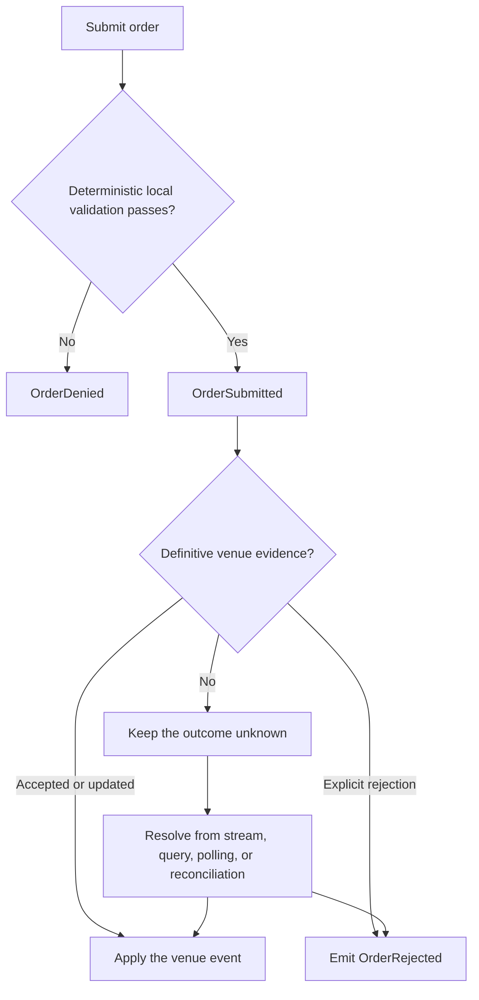
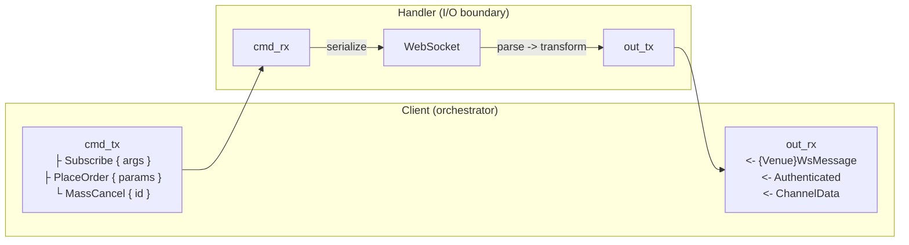

# Adapters

## Introduction

Adapters connect NautilusTrader to venues and data providers. A good adapter does more than move
bytes: it preserves venue semantics, produces valid Nautilus domain events, and makes uncertain
outcomes explicit. The work is exacting, but the repository already provides strong contracts and
useful examples.

Adapters are Rust‑native. They implement the platform data and execution client traits in Rust,
then expose configs, factories, and selected low‑level APIs to Python through PyO3.

Use reference adapters selectively. Their layouts reflect different venue protocols, product
families, and implementation histories.

| Adapter            | Useful reference                                                                                       |
| ------------------ | ------------------------------------------------------------------------------------------------------ |
| [Bybit][bybit]     | Multi‑product HTTP and WebSocket clients, options data, and execution outcome handling.                |
| [OKX][okx]         | Public, private, and business WebSocket endpoints with broad instrument coverage.                      |
| [Binance][binance] | Spot and futures product splits, trading WebSockets, and SBE market data.                              |
| [Kraken][kraken]   | Spot and futures submodules with distinct HTTP, WebSocket, data, and execution paths.                  |
| [Lighter][lighter] | Layer‑2 signing, canonical benchmarks, coverage‑guided fuzzing, and detailed execution state handling. |
| [Derive][derive]   | JSON‑RPC data and execution, EIP‑712 signing, canonical benchmarks, and invariant‑based fuzzing.       |

This guide distinguishes four kinds of guidance:

- **Shared rules** come from common traits, network abstractions, hooks, or CI.
- **Common patterns** appear in several adapters but allow other designs.
- **Examples** show one sound implementation without making it mandatory.
- **Exceptions** are valid when venue semantics or protocol boundaries require them.

## Structure of an adapter

The Rust crate is the source of truth for protocol behavior. An adapter commonly separates these
concerns:

```text
crates/adapters/<adapter>/
├── Cargo.toml
├── src/
│   ├── common/              # Shared credentials, enums, models, parsing, symbols, and URLs
│   ├── http/                # Typed requests, responses, signing hooks, and transport client
│   │   ├── client.rs
│   │   ├── error.rs
│   │   ├── models.rs
│   │   ├── parse.rs
│   │   └── query.rs
│   ├── websocket/           # Streaming transport, protocol messages, parsing, and routing
│   │   ├── client.rs
│   │   ├── handler.rs
│   │   ├── messages.rs
│   │   ├── parse.rs
│   │   ├── subscription.rs  # When subscription identity or replay needs a boundary
│   │   └── dispatch.rs      # When execution routing needs a boundary
│   ├── config.rs
│   ├── data.rs              # Or data/ when product implementations need a split
│   ├── execution.rs         # Or execution/ when product implementations need a split
│   ├── factories.rs
│   ├── python/              # PyO3 projection
│   ├── signing/             # When authentication or transaction signing is a subsystem
│   └── lib.rs
├── tests/                   # Public Rust boundary tests
├── test_data/               # Canonical venue payloads and protocol vectors
├── benches/                 # When confirmed hot paths warrant benchmarks
│   ├── common/              # Shared benchmark fixtures
│   ├── data.rs
│   ├── exec.rs
│   └── micros.rs
├── fuzz/                    # When untrusted codecs warrant coverage-guided fuzzing
│   ├── fuzz_targets/
│   └── README.md
├── examples/                # Rust tester nodes and focused usage examples
├── bin/                     # Optional protocol inspection or capture tools
└── README.md
```

Python and documentation surfaces sit outside the crate:

```text
python/nautilus_trader/adapters/<adapter>/  # Public package and generated stubs
examples/live/<adapter>/                    # Python data and execution testers
python/tests/unit/adapters/<adapter>/       # Public Python package tests
docs/integrations/<adapter>.md              # User-facing integration guide
```

Only `Cargo.toml` and `src/lib.rs` are universal crate boundaries. Add the other modules when the
adapter needs them:

- Put symbols, credentials, URLs, shared enums, and shared parsing under `common/`.
- Put transport models, typed requests, signing, and HTTP clients under `http/`.
- Put frames, messages, subscription state, routing, and WebSocket clients under `websocket/`.
- Implement live data and execution traits in `data.rs` and `execution.rs`, or in product
  submodules when the venue exposes materially different protocols.
- Keep PyO3 projection code under `python/`.
- Organize integration tests by public boundary or product. Do not force all adapters into the
  same filenames.

Product‑specific splits are legitimate when product families have different protocols. A shared
client can also span distinct endpoints when request and state semantics remain common. Match the
venue's real boundaries and keep shared behavior above those splits.

Python package files live under `python/nautilus_trader/adapters/<adapter>/`. In current Rust‑native
adapters, the package usually re‑exports generated bindings. Change Rust binding metadata or other
generator inputs, then run `make py-stubs`; do not edit generated `.pyi` files.

### Repository and Python wiring

A new adapter crate must be discoverable by each build surface that owns it:

| Surface                       | Required change                                                                                                  | Enforcement or proof                                                                                           |
| ----------------------------- | ---------------------------------------------------------------------------------------------------------------- | -------------------------------------------------------------------------------------------------------------- |
| Root Rust workspace           | Add the crate to the members and workspace dependencies in [`Cargo.toml`](../../Cargo.toml).                     | Workspace metadata and targeted Cargo checks discover the crate.                                               |
| Workspace test inventory      | Add the crate to `ADAPTER_CRATES` in the [`Makefile`](../../Makefile).                                           | The [workspace coverage check](../../scripts/ci/check-workspace-test-coverage.sh) requires one test inventory. |
| PyO3 crate                    | Add the optional dependency and feature propagation in [`crates/pyo3/Cargo.toml`](../../crates/pyo3/Cargo.toml). | Building the matching PyO3 feature compiles the adapter projection.                                            |
| PyO3 root module              | Register the adapter module in [`crates/pyo3/src/lib.rs`](../../crates/pyo3/src/lib.rs).                         | The conventions hook treats this module list as the public API allowlist.                                      |
| Adapter PyO3 registry         | Register each applicable factory and config extractor with `get_global_pyo3_registry()`.                         | Factory boundary tests prove Python config objects reach the Rust factories.                                   |
| Python package and user guide | Add package projection, tests, examples, and an integration guide only for capabilities the adapter exposes.     | Import, generated drift, example build, and documentation checks cover these surfaces.                         |

The [Nautilus conventions hook](../../.pre-commit-hooks/check_nautilus_conventions.sh) treats the
PyO3 module list as a public API allowlist. The
[PyO3 conventions hook](../../.pre-commit-hooks/check_pyo3_conventions.sh) also enforces:

- Stub metadata uses `nautilus_trader.adapters.<adapter>`.
- Runtime extension imports use `nautilus_trader._libnautilus.<adapter>`.
- A Rust function renamed with `#[pyo3(name = ...)]` has a `py_` Rust name.
- Python exceptions use the project error conversion functions.

## Adapter implementation sequence

Use these phases to organize the work. They describe dependencies, not release gates. A
market‑data‑only adapter omits execution, and an adapter can complete one product before starting
another. Keep the capability matrix current throughout the work rather than waiting for the final
documentation phase. The step identifiers provide a shared vocabulary for progress and handoffs;
omit steps that do not apply to the adapter.

### Before phase 1: Define scope

| Step | Component           | Work                                                                                                      |
| ---- | ------------------- | --------------------------------------------------------------------------------------------------------- |
| 0.1  | Capability matrix   | List the products, environments, account modes, data types, order types, and reports in scope.            |
| 0.2  | Venue constraints   | Record venue restrictions, unsupported capabilities, and testnet differences.                             |
| 0.3  | Protocol boundaries | Identify separate product APIs, public and private endpoints, and binary or JSON transports.              |
| 0.4  | Initial slice       | Choose the smallest slice that proves an end‑to‑end path.                                                 |
| 0.5  | Repository wiring   | Add the crate to the Rust workspace and test inventory, then add only the projection surfaces it exposes. |

**Exit:** The integration guide contains an initial capability matrix, known gaps, and a test plan.

### Phase 1: Build the protocol core

| Step | Component             | Work                                                                                                                            |
| ---- | --------------------- | ------------------------------------------------------------------------------------------------------------------------------- |
| 1.1  | HTTP error types      | Model transport, HTTP status, venue, parsing, and validation failures; classify retryability when supported.                    |
| 1.2  | HTTP client           | Implement endpoint resolution and typed requests, plus credentials, signing, rate limits, retries, and pagination as needed.    |
| 1.3  | HTTP API models       | Define typed requests and responses, commonly under `http/` or its product‑specific modules.                                    |
| 1.4  | HTTP parsing          | Convert venue responses to domain types at deterministic boundaries in `http/parse.rs` or `common/parse.rs`.                    |
| 1.5  | WebSocket error types | Model connection, protocol, and parsing failures, plus authentication and command failures when applicable.                     |
| 1.6  | WebSocket client      | Implement lifecycle and shutdown, plus authentication, heartbeat, subscription state, and reconnection when applicable.         |
| 1.7  | WebSocket messages    | Define frames and messages under `websocket/` or product‑specific modules; include acknowledgements and venue errors as needed. |
| 1.8  | WebSocket parsing     | Decode each frame once, convert domain events, and route data or execution messages by typed identity.                          |
| 1.9  | Protocol tests        | Prove fixtures, canonical requests, applicable signing vectors, lifecycle, and raw exchanges with mock peers.                   |

**Exit:** The crate compiles, protocol fixtures parse, applicable signing vectors pass, and mock or
controlled requests complete any required authentication and exchange raw venue messages.

### Phase 2: Implement instruments

| Step | Component          | Work                                                                                                     |
| ---- | ------------------ | -------------------------------------------------------------------------------------------------------- |
| 2.1  | Instrument parsing | Parse every supported family with complete identity, precision, currency, and contract fields.           |
| 2.2  | Instrument loading | Load, filter, cache, and emit definitions at each parsing boundary that needs context.                   |
| 2.3  | Symbol mapping     | Define bidirectional venue symbol and `InstrumentId` conversion without collapsing distinct instruments. |
| 2.4  | Instrument updates | Implement fresh instrument requests and any supported definition or status updates.                      |

**Exit:** Distinct fixtures cover every supported instrument family, invalid definitions fail
clearly, and the data client emits or returns complete Nautilus instruments.

### Phase 3: Implement market data

Start with one public stream and one instrument before adding product or endpoint fan‑out.

| Step | Component                | Work                                                                                                        |
| ---- | ------------------------ | ----------------------------------------------------------------------------------------------------------- |
| 3.1  | Public WebSocket streams | Subscribe and unsubscribe each advertised live data type while preserving subscription intent.              |
| 3.2  | Historical data requests | Request supported bars, trades, quotes, or order book snapshots with exact correlation and freshness rules. |
| 3.3  | Data client              | Implement `DataClient` requests, subscriptions, lifecycle, and complete `DataEvent` emission.               |
| 3.4  | Order book handling      | Preserve snapshot, incremental update, sequence, clear, and batch boundaries.                               |
| 3.5  | Stream recovery          | Handle malformed input, gaps, unsubscribe, disconnect, reconnect, and subscription replay.                  |

**Exit:** Unit and mock transport tests prove complete domain events for the supported request and
subscription matrix.

### Phase 4: Implement execution

Establish account state and reconciliation before enabling order flow.

| Step | Component              | Work                                                                                                         |
| ---- | ---------------------- | ------------------------------------------------------------------------------------------------------------ |
| 4.1  | Account bootstrap      | Establish account identity, initial account state, private subscriptions, and connected readiness.           |
| 4.2  | Reconciliation reports | Generate applicable order, fill, position, and mass‑status reports at startup and on demand.                 |
| 4.3  | Basic order submission | Implement supported market and limit order submission with deterministic local validation.                   |
| 4.4  | Order modification     | Implement supported modify and cancel commands, including cancel‑replace venue semantics.                    |
| 4.5  | Execution client       | Implement `ExecutionClient` commands, lifecycle, tracked and external routing, and ordered event emission.   |
| 4.6  | Outcome recovery       | Preserve unknown outcomes, deduplicate fills, and resolve state through streams, queries, or reconciliation. |

**Exit:** Mock transport tests cover every supported command, definitive rejection, uncertain
transmission, duplicate or out‑of‑order updates, and startup reconciliation.

### Phase 5: Add optional venue capabilities

Add these only after the base lifecycle is stable.

| Step | Component                  | Work                                                                                              |
| ---- | -------------------------- | ------------------------------------------------------------------------------------------------- |
| 5.1  | Advanced order types       | Add applicable conditional, stop, take‑profit, trailing‑stop, or other advanced orders.           |
| 5.2  | Batch operations           | Add batch submission, batch cancellation, and mass cancel with per‑order result handling.         |
| 5.3  | Venue‑specific data        | Add funding, greeks, liquidations, or venue extensions as separate capability slices.             |
| 5.4  | Product or endpoint splits | Split ownership only when protocol, authentication, quota, or recovery boundaries require it.     |
| 5.5  | Capability proof           | Add fixtures, functional tests, acceptance cases, and documented limitations for each capability. |

**Exit:** Each optional capability is independently testable and does not weaken the established
base paths.

### Phase 6: Complete factories and projection

| Step | Component             | Work                                                                                             |
| ---- | --------------------- | ------------------------------------------------------------------------------------------------ |
| 6.1  | Configuration structs | Finalize typed data and execution configs, defaults, environment fallback, and secret redaction. |
| 6.2  | Client factories      | Implement Rust factories with the required clock and `CacheView` inputs.                         |
| 6.3  | PyO3 registration     | Register applicable factories and config extractors with the PyO3 registry.                      |
| 6.4  | Python package        | Add the public package and Python boundary tests for the capabilities exposed to Python.         |
| 6.5  | Generated stubs       | Add Rust stub metadata and regenerate the `.pyi` output with `make py-stubs`.                    |

**Exit:** Rust factory tests and PyO3 boundary tests pass, package imports resolve, and generated
output matches its Rust inputs.

### Phase 7: Prove conformance

| Step | Component              | Work                                                                                                   |
| ---- | ---------------------- | ------------------------------------------------------------------------------------------------------ |
| 7.1  | Rust unit tests        | Prove parsers, serializers, symbols, signatures, state transitions, and malformed input.               |
| 7.2  | Rust integration tests | Exercise public HTTP, WebSocket, data, and execution boundaries against deterministic mock transports. |
| 7.3  | Python boundary tests  | Prove imports, config extraction, factories, type conversion, and representative async calls.          |
| 7.4  | Acceptance tests       | Run every applicable `DataTester` and `ExecTester` case on testnet or a controlled account.            |
| 7.5  | Recovery tests         | Exercise connection failure, reconnect, shutdown, rate limits, and state recovery.                     |
| 7.6  | Specification gaps     | Record every skipped specification case with a venue or capability reason.                             |

**Exit:** The applicable data and execution testing specifications pass, and every advertised
capability has deterministic and venue evidence.

### Phase 8: Measure performance and robustness

| Step | Component            | Work                                                                                                      |
| ---- | -------------------- | --------------------------------------------------------------------------------------------------------- |
| 8.1  | Canonical benchmarks | Measure confirmed end‑to‑end data and execution hot paths with representative fixtures.                   |
| 8.2  | Microbenchmarks      | Isolate confirmed signing, hashing, authentication, codec, parsing, or serialization costs.               |
| 8.3  | Fuzz targets         | Fuzz untrusted parsing, decoding, normalization, signing, and encoding boundaries with realistic corpora. |
| 8.4  | Invariants           | Assert domain and protocol properties stronger than panic freedom.                                        |

**Exit:** Canonical benchmark and fuzz suites run with representative fixtures, documented
invariants, and no mandatory categories that the adapter does not use.

### Phase 9: Finish documentation and operations

| Step | Component           | Work                                                                                           |
| ---- | ------------------- | ---------------------------------------------------------------------------------------------- |
| 9.1  | Capability matrix   | Reconcile every support claim and exception with the tested implementation.                    |
| 9.2  | Integration guide   | Document credentials, config, limits, reconciliation, environment differences, and known gaps. |
| 9.3  | Tester entry points | Provide applicable Rust and Python data and execution testers with safe defaults.              |
| 9.4  | Operations          | Document recovery, troubleshooting, and any venue behavior an operator must understand.        |
| 9.5  | Final verification  | Verify links, generated output, examples, and the focused documentation checks.                |

**Exit:** A user can configure, test, operate, and diagnose the adapter without reading its source.

## Rust adapter patterns

Repository‑wide import policy applies to adapter code: import Nautilus types and use their short
names instead of fully qualifying them at call sites. The
[Nautilus conventions hook](../../.pre-commit-hooks/check_nautilus_conventions.sh) enforces this
rule and documents its scoped exception marker.

### Configurations (`config.rs`)

Follow the shared [configuration guide](../concepts/configuration.md). In particular, Rust configs
use typed fields, strict Serde decoding, one source of truth for defaults, and `bon::Builder`.
Adapter configs then add only venue semantics:

- Use an enum for a closed set such as environment, product family, account mode, or endpoint.
- Use `Option<T>` only when absence has a distinct meaning, including runtime credential fallback.
- Keep data and execution config separate when their capabilities or credentials differ.
- Implement a redacted `Debug` for any config that can hold secrets.
- Keep Python config projection thin. It converts types and delegates to the Rust config.

Centralize default HTTP and WebSocket endpoint resolution so one environment selection cannot mix
live and test endpoints. Keep explicit URL overrides only where custom gateways, mock servers, or
venue deployments require them. Test every supported environment and any precedence between an
environment choice and an explicit override.

### Credentials and secret handling

When HTTP and WebSocket clients use the same key material, centralize credential handling in a type,
commonly under `common/credential.rs`. Keep configs as data transfer objects: resolve credentials
when constructing the credential, factory, or client, not in Python wrappers or individual request
methods.

- Define environment variable names once and select them from typed environment and product values.
- Resolve all fields as one credential set. Public clients may remain unauthenticated, but an
  authenticated client rejects an incomplete or invalid set before sending a request.
- Store secret fields in owned memory and zeroize them on drop. Redact secrets and private keys from
  `Debug`. If logs need credential identity, log only a masked API key.
- Share credential storage across transports only when they use the same key material. Keep HTTP,
  WebSocket, and transaction signing methods separate when their canonical payloads differ.
- Test explicit values, environment fallback, missing fields, redacted output, and deterministic
  signature vectors.

Use the repository's established environment variable names for each venue and environment.
Document the exact names in the adapter's integration guide, where users need them.

Never include credentials, signatures, or secret material in errors, INFO logs, or DEBUG logs.
Do not add adapter‑level logs of raw authenticated requests or WebSocket payloads. Shared transport
TRACE logs can contain raw outbound payloads, so treat TRACE output as sensitive and redact it
before sharing.

### Symbols and instrument identity

Separate venue symbols from Nautilus `InstrumentId` values. A symbol module commonly owns:

- Parsing and formatting venue symbols.
- Product or contract suffixes required for a unique Nautilus symbol.
- Validation of venue and product identity.
- Round‑trip tests for supported forms and rejection tests for ambiguous forms.

Choose the mapping from the venue's identity scheme:

| Venue identity                                      | Nautilus representation                         | Example                                             |
| --------------------------------------------------- | ----------------------------------------------- | --------------------------------------------------- |
| Native symbol distinguishes the product             | Preserve the symbol and add the venue.          | `BTC-USDT-SWAP` -> `BTC-USDT-SWAP.OKX`.             |
| Raw symbol is reused across product families        | Add and validate a stable product suffix.       | Bybit linear `BTCUSDT` -> `BTCUSDT-LINEAR.BYBIT`.   |
| Nautilus and the venue use different contract marks | Implement both directions at one boundary.      | Binance USD‑M `BTCUSDT` -> `BTCUSDT-PERP.BINANCE`.  |
| Transport casing differs from canonical identity    | Convert only when building the transport value. | Binance stream `BTCUSDT-PERP.BINANCE` -> `btcusdt`. |

The [`BybitSymbol`](../../crates/adapters/bybit/src/common/symbol.rs) wrapper and
[Binance symbol conversions](../../crates/adapters/binance/src/common/symbol.rs) show the suffix
and bidirectional conversion patterns. Treat them as examples, not a shared suffix scheme.

Do not normalize distinct venue instruments to the same `InstrumentId`. Give test fixtures distinct
symbols, precisions, currencies, and contract fields so swaps and omissions fail visibly.

For every supported product family, test venue symbol -> `InstrumentId` -> venue symbol. Normalize
case once at the identity boundary and preserve venue‑significant case elsewhere. When the mapping
requires a product marker, reject a missing or ambiguous marker before caching the instrument.

Construct instruments from current venue definitions. Validate required identity and precision
before caching or emission. Keep parsing functions deterministic and independent of live client
state where practical.

### Modeling venue payloads

Model the wire format, not an imagined stable subset:

- Use typed request and response structs for known fields.
- Use Serde aliases or custom deserializers only when supported payloads require them.
- Reject unknown values for closed sets whose meaning affects domain behavior.
- Preserve or explicitly classify unknown values for open venue sets that may expand without a
  protocol version change.
- Keep raw models separate from Nautilus domain objects. Convert at one auditable boundary.
- Deserialize prices, quantities, money, fees, and other discrete values as `Decimal`. Construct
  domain values with `Price::from_decimal_dp`, `Quantity::from_decimal_dp`, `Money::from_decimal`,
  or `Money::zero`; never route wire values through `f64`. See
  [domain numeric types](rust.md#domain-numeric-types).
- Pass required parsing context explicitly, including instrument precision, currencies, account
  identity, and `ts_init`. Keep live client state outside parsers.
- Treat missing, null, and empty values according to the venue schema. Do not collapse them into one
  fallback when they carry different meanings.
- Use the venue timestamp for `ts_event` when the payload supplies one. Assign `ts_init` from the
  adapter clock when it receives or constructs the event. Use receipt time as event time only when
  the venue has no authoritative timestamp, and cover that fallback with a test.

Avoid permissive fallbacks that silently turn a new venue value into an existing semantic value.
Stable error handling is part of the parser contract.

### Client traits and factories (`data.rs`, `execution.rs`, `factories.rs`)

The shared [`DataClient`](../../crates/common/src/clients/data.rs),
[`ExecutionClient`](../../crates/common/src/clients/execution.rs), and
[client factory](../../crates/common/src/factories/client.rs) traits define the adapter boundary.
Implement the supported methods and leave unsupported capabilities explicit in the integration
guide.

Factories receive a downcast `ClientConfig` and a read‑only
[`CacheView`](../../crates/common/src/cache/mod.rs). Data factories also receive the shared clock.
Use the view to resolve instruments and existing state. Engine cache writes stay in the engines:
emit domain events and reports instead of mutating the engine cache from an adapter. A private
protocol cache is valid when parsing, subscription replay, or response correlation needs it.

The client traits use `#[async_trait(?Send)]`. Client objects are not intended to move across
threads and may hold non‑`Send` Python state. Move owned, `Send` inputs into explicit runtime tasks
when asynchronous work must outlive a synchronous trait call.

### Adapter-owned state

Choose collections from ownership and update behavior:

- Use a plain `AHashMap` or `AHashSet` for state owned by one task.
- Use `AtomicMap` or `AtomicSet` for read‑heavy immutable snapshots with infrequent writes. Use
  `rcu` when writers can race; a separate load and store can lose another writer's update.
- Use `DashMap` or `DashSet` for independent keys that receive concurrent entry updates.

Adapters use these patterns in different combinations. Keep the collection behind the component
that owns its invariant instead of sharing it merely to avoid passing a message. Use `Ustr` for
repeated protocol strings when interning reduces allocation or comparison cost; keep unique request
IDs and short‑lived payload text in their natural types.

### Connection lifecycle (`connect`)

Treat each lifecycle method as a contract:

| Method       | Responsibility                                                                                               | Successful postcondition                                                           |
| ------------ | ------------------------------------------------------------------------------------------------------------ | ---------------------------------------------------------------------------------- |
| `start`      | Install local event plumbing and start client‑owned background work.                                         | Local event paths exist before any task can publish.                               |
| `connect`    | Establish transports, authenticate, load required definitions or account state, and start stream processing. | Public commands can use the transport, and required bootstrap state is observable. |
| `disconnect` | Stop new network work and close transports.                                                                  | The client no longer sends or receives venue traffic.                              |
| `stop`       | End client‑owned work using an idempotent path.                                                              | Repeated teardown is safe.                                                         |
| `reset`      | Clear reconnectable caches, counters, cancellation state, and stale in‑flight state.                         | A later start or connection does not inherit invalid session state.                |
| `dispose`    | Release background tasks, threads, and external handles.                                                     | No client‑owned resource remains active.                                           |

Do not report connected until public commands can use the transport and required engine‑side state
is observable. In particular, an execution client that emits initial account state asynchronously
waits until the engine cache contains the account before calling `set_connected`; reconciliation
and strategy startup treat connected as a readiness signal. Apply the same rule to required
instrument or stream bootstrap state. When transport connection completes before the socket becomes
active, use a bounded `wait_until_active` step before subscribing or reporting readiness. On partial
connection failure, clean up resources already started and leave state consistent for retry or
disposal.

When an execution client uses
[`ExecutionEventEmitter`](../../crates/live/src/execution/emitter.rs), install its sender during
`start` before any task can emit.

#### Bootstrap ordering

Connection code varies, but its dependencies do not. A data client typically:

1. Resolves the environment and validates any credentials needed during bootstrap.
1. Fetches required instrument definitions and populates parsing context.
1. Publishes definitions that the engine must observe before data arrives.
1. Starts the transport and waits for the command path to become active.
1. Subscribes or replays intent only after handler initialization.
1. Reports connected after the required engine and protocol state is ready.

An execution client typically:

1. Validates credentials, account identity, and required instrument context.
1. Establishes and authenticates the private transport.
1. Starts stream processing and subscriptions in an order that cannot lose acknowledgements or
   account updates.
1. Fetches and emits initial account state, or waits for an authoritative stream snapshot.
1. Waits for required account and instrument state to become observable to the engine.
1. Reports connected only after commands and reconciliation can run.

Treat these as dependency constraints, not required function names. A venue can combine or reorder
steps when tests prove the same postconditions. If any step fails after resources start, tear down
those resources before returning the error.

### Data client

Subscriptions express ongoing intent. Requests ask the provider for current or historical data.
Keep their freshness semantics distinct:

- An explicit instrument request fetches from the provider unless the API contract explicitly
  permits a cache result.
- Private caches can provide parsing context, but must not turn a new request into a stale response.
- Emit a response only for data that satisfies the request identity and filters.
- Preserve the request correlation ID and original parameters in response events.

The shared [`DataEvent`](../../crates/common/src/messages/mod.rs) envelope determines how data
enters the engine:

| Variant                       | Use                                                                 | Contract to preserve                                                                |
| ----------------------------- | ------------------------------------------------------------------- | ----------------------------------------------------------------------------------- |
| `DataEvent::Instrument`       | Instrument definitions from bootstrap, requests, or updates.        | Preserve complete identity, precision, and venue timestamps when available.         |
| `DataEvent::InstrumentStatus` | Trading or availability status changes.                             | Emit meaningful transitions rather than unchanged polling snapshots.                |
| `DataEvent::Data`             | Trades, quotes, order‑book data, bars, and other typed market data. | Complete parsing and event boundary construction before emission.                   |
| `DataEvent::Response`         | Results for current or historical data requests.                    | Preserve request correlation, parameters, filters, and freshness semantics.         |
| `DataEvent::FundingRate`      | Funding rate updates for derivatives.                               | Preserve the venue's effective or event time and instrument identity.               |
| `DataEvent::OptionGreeks`     | Venue‑provided option greeks.                                       | Preserve the source instrument and distinguish venue values from local calculation. |
| `DataEvent::DeFi`             | Feature‑gated decentralized finance data.                           | Emit only when the adapter and build expose the shared `defi` feature.              |

Add a regression test that changes the upstream instrument response between two requests. The
second response must reflect the new venue state rather than a private cache entry.

Publish typed data through the engine's data event path. Parse and validate before emission, and do
not hold mutable adapter state across downstream dispatch. A closed event receiver normally means
the engine is stopping: log the send failure and let lifecycle teardown own recovery rather than
retrying the same event indefinitely.

For order‑book deltas, follow the
[delta flag and event boundary contract](../concepts/data/index.md#delta-flags-and-event-boundaries).
Every logical update ends with `F_LAST`; snapshots use `F_SNAPSHOT` and end with
`F_SNAPSHOT | F_LAST`, including an empty snapshot represented only by `Clear`.

When a venue exposes instrument status only as a polled snapshot, diff it against the prior full
snapshot and emit changes rather than repeating every status. Treat an instrument removed from the
snapshot according to the venue contract. Map removal to `NotAvailableForTrading` only when
disappearance means the instrument is unavailable. Update the full private cache even when
emissions are filtered to active subscriptions.

### Execution client

Execution clients translate commands, preserve order identity, publish account state, and generate
reports for reconciliation. They must support these boundaries consistently:

- Validate deterministic local constraints before submission.
- Emit `OrderSubmitted` only when the command enters the adapter's submission path.
- Correlate venue responses and stream updates to the correct client and venue order IDs.
- Emit balances and margins with the account type and base currency used by the factory.
- Generate order, fill, position, and mass‑status reports from venue state for reconciliation.
- Release shared clock, cache, or account borrows before publishing account state because
  subscribers may access the same state synchronously.

Do not infer support from a venue API alone. Implement and test the Nautilus command and event
semantics, then advertise the capability.

#### Tracked and external execution updates

Route execution updates according to order ownership, independent of the dispatch module layout:

- For an order submitted and tracked by this client, emit typed order events through the normal
  order state machine.
- For an untracked or external order, emit `OrderStatusReport` and `FillReport` values so the
  execution engine can reconcile or create the external order.

Do not invent strategy or client identity for an untracked order. Preserve available venue
identity in the report and let the engine apply
[external order ownership](../concepts/execution.md#external-order-creation). The adapter may use
any state structure that proves this routing decision.

Model tracked ownership with two conceptual layers. Order identity contains the stable fields that
associate an update with the submitted order: client order ID, strategy, instrument, side, and order
type. Order context combines that identity with the submitted order shape needed to construct later
events without accessing the engine cache, such as quantity, price and trigger details, time in
force, and execution flags. Keep venue order bindings, request correlation, cumulative fills, and
replace state in adapter‑owned context around that common surface.

Register the order context before sending or spawning work that can produce an inbound update.
Restore context for active local orders before processing their live updates, and retain it while
the order can still produce owned updates. Do not evict active context merely to bound replay state.

Make every execution update take one explicit route:

| Route      | Evidence                                               | Result                                                         |
| ---------- | ------------------------------------------------------ | -------------------------------------------------------------- |
| Tracked    | Active or pending context owns the order.              | Emit, deduplicate, or safely defer typed order events.         |
| External   | No tracked, pending, or terminal ownership exists.     | Forward reports for reconciliation or external order creation. |
| Suppressed | The update is proven duplicated, stale, or superseded. | Emit neither an event nor a report.                            |

Missing tracked metadata, a parse failure, or an unresolved venue binding does not prove that an
update is external. A tracked status with no corresponding Nautilus lifecycle event is a tracked
no‑op or deferred update unless the adapter documents and tests a report exception.

#### Event ordering and deduplication

A venue can report the same transition through an order response, private stream, query, and
reconciliation result. Deduplicate by stable venue identity, not by the transport that delivered
the update:

- Use the venue trade or match ID for fills. Include account, instrument, or product identity when
  the venue does not guarantee global uniqueness.
- Share fill identity across live dispatch and reconciliation when those paths can overlap.
- Do not consume a deduplication key before parsing and routing succeeds. If the implementation
  reserves first, release the key after a failure so a replay can recover the event.
- Bound long‑lived deduplication state, but retain enough history across reconnects to cover venue
  replay. Reset it only when the protocol proves old identifiers cannot return.
- Reuse the shared [`FifoCache` and `FifoCacheMap`](../../crates/common/src/cache/fifo.rs) when
  first‑in, first‑out eviction matches the replay contract. Keep adapter‑specific locking where
  several state changes must remain atomic.
- Make repeated acknowledgements and order snapshots idempotent. They must not regress state or
  emit a second lifecycle event.

Keep active order context, pending correlation, replay deduplication, and terminal tombstones as
separate lifecycle concepts even when one state object owns them. Bound replay and tombstone state
without letting eviction reclassify an update for an active order as external.

For a tracked order, a definitive fill can arrive before an acknowledgement or open‑order update.
Emit any required preceding lifecycle event only when the adapter has complete order identity and
the venue evidence proves that state. Record the synthesized transition so a later acknowledgement
does not duplicate it. Untracked orders continue through reports rather than synthesized strategy
events.

When a venue implements modify as cancel‑replace, update the venue order ID mapping before routing
the replacement leg. Distinguish a stale cancel for the old leg from cancellation of the active
replacement, and calculate replacement quantity from current cumulative fills. This behavior is
venue‑specific and needs focused race tests; it does not imply a shared dispatch state layout.

Focused tests distinguish tracked and external updates, fills that precede acknowledgement,
duplicates from overlapping sources, submission or venue‑binding races, and stale post‑terminal
updates. Test active‑context retention separately from bounded replay eviction.

#### Order command outcome policy

Separate three evidence classes:

- **Definitive local failure:** deterministic validation proves that a submit command cannot be
  sent. Emit `OrderDenied` before `OrderSubmitted`. For cancel or modify preparation, emit the
  matching rejection only when the failure is attributable to that command and proves it was not
  sent. Otherwise, log the failure without inventing a rejection.
- **Definitive venue result:** a structured venue response or status explicitly accepts, updates,
  or rejects one command. Emit the matching domain event.
- **Unknown outcome:** the request may have reached the venue, but no definitive result is
  available. Keep the command in flight for stream updates, polling, queries, or reconciliation.


```mermaid
flowchart TD
    command[Submit order] --> valid{Deterministic local validation passes?}
    valid -->|No| denied[OrderDenied]
    valid -->|Yes| submitted[OrderSubmitted]
    submitted --> evidence{Definitive venue evidence?}
    evidence -->|Accepted or updated| event[Apply the venue event]
    evidence -->|Explicit rejection| rejected[Emit OrderRejected]
    evidence -->|No| unknown[Keep the outcome unknown]
    unknown --> recovery[Resolve from stream, query, polling, or reconciliation]
    recovery --> event
    recovery --> rejected
```

If submit validation fails after `OrderSubmitted`, leave the order in flight unless definitive
venue evidence resolves it.

Transport errors, timeouts, disconnects, task cancellation, retry exhaustion, HTTP 5xx responses,
rate limits, missing acknowledgements, and parse failures after transmission usually leave an
unknown outcome. Do not convert them into a venue rejection.

For batch commands, apply evidence per order. A whole‑request failure does not prove that every
child command failed. Treat venue messages such as "not found" or "already closed" according to
documented venue semantics; they may describe a race with a fill or cancellation rather than an
unambiguous command rejection.

Keep this policy independent of the HTTP or WebSocket path used to send a command.

#### Naming the evidence classes

Name the three classes consistently. Adapters that invent their own vocabulary for this cannot be
compared, and the same wire condition ends up classified differently across venues. Classify every
state‑changing order command failure as one `CommandFailure` variant:

| Evidence class             | `CommandFailure` variant | Terminal event from this evidence |
| -------------------------- | ------------------------ | --------------------------------- |
| Definitive local failure   | `NotSent`                | Valid                             |
| Definitive venue rejection | `VenueRejected`          | Valid                             |
| Unknown outcome            | `Ambiguous`              | Never                             |

An `Ambiguous` classification never emits a terminal event by itself. Later definitive evidence
from a stream update, query, poll, or reconciliation still resolves the command either way.

A definitive venue acceptance or update is not a failure and carries no variant. Apply the venue
event directly.

Classify once, where the error surfaces, rather than re‑branching on the error enum at each emit
site. Apply this to every state‑changing order command, submit, modify, and cancel alike, including
their batch and list forms. A classifier scoped to one command type leaves the others to drift.
Queries produce no terminal command event and need no classification.

Keep this axis separate from `is_retryable`. Retryability answers whether to send the request
again; ambiguity answers whether the venue may already have acted on the first attempt. An error
can be both, either, or neither, and collapsing them is what makes an unknown outcome look like a
rejection.

Two conditions are easy to misfile:

- An HTTP 5xx without definitive command evidence is ambiguous. It proves only that the command
  was not confirmed, never that it was not applied, and a gateway 5xx does not prove the request
  failed to reach the venue.
- A response parse failure is ambiguous, while a request encoding failure is `NotSent`. Both may
  surface as one serialization error variant, so classify by which side of the write boundary
  the failure occurred on.

## HTTP client patterns

### Client structure

A common design has two layers:

| Layer         | Accepts                            | Returns                                       | Owns                                                               |
| ------------- | ---------------------------------- | --------------------------------------------- | ------------------------------------------------------------------ |
| Raw client    | Venue request and query types.     | Venue response models.                        | Transport, authentication, rate limits, and exact wire encoding.   |
| Domain client | Nautilus identifiers and commands. | Domain objects, reports, or acknowledgements. | Operation semantics, parsing context, caching, and domain mapping. |

Use one layer when the protocol is small and the split would only add forwarding methods. Split by
product when endpoints, signatures, or response models change for different product families.

Name low‑level methods after the venue operation when practical, such as `get_instruments` or
`place_order`. Name domain methods after Nautilus semantics, such as `request_instruments`,
`submit_order`, or `cancel_order`.

#### Request flow

Whether one client or two own these responsibilities, keep their boundaries explicit:

1. At a domain boundary, validate Nautilus inputs and build typed venue parameters.
1. At the transport boundary, select the HTTP method and path, then serialize the exact query or
   body.
1. Allocate any required request identity, timestamp, or nonce. Sign the exact wire representation
   when needed, then send it through the shared `nautilus_network::http::HttpClient` with the
   applicable rate‑limit keys.
1. Decode the response envelope and preserve transport, HTTP status, venue, and parse failures.
1. At a domain boundary, convert successful payloads to domain types with explicit instrument,
   account, and time context.

Keep typed request construction separate from sending. This makes signatures and canonical query
encoding testable without a server. Put response conversion in pure parser functions when it does
not need live state.

Typed request and query builders preserve the difference between an omitted field, an explicit
zero, and an empty value. Keep required venue parameters required, omit absent optional parameters
from the wire representation, and test the exact serialized query or body. Pagination code also
tests cursor direction, inclusive boundaries, duplicate boundary records, and a repeated cursor or
empty page so it cannot loop forever.

### Request signing and authentication

Build the exact canonical bytes required by the venue, then sign those bytes once. Test:

- Field order and delimiters.
- Timestamp and receive‑window units.
- Decimal and enum encoding.
- Body or query hashing.
- Environment and account identifiers.
- Known venue vectors when available.

Keep nonce or sequence ownership explicit. If commands can run concurrently, define how the adapter
serializes, allocates, or rejects conflicting nonces. Never retry a signed state‑changing request
with a new identity unless venue semantics make that safe.

Treat request identity, timestamp, and nonce as separate protocol fields even when the venue packs
them into one signed payload. The component that allocates a nonce also owns its ordering rule.
Build and sign from the same reserved value, then handle pre‑send failure, uncertain transmission,
and venue nonce rejection according to documented venue consumption semantics. On a sequence
mismatch, resynchronize from an authoritative source before issuing further state‑changing
commands. Test deterministic vectors, concurrent allocation, monotonicity or uniqueness, and
recovery after a rejected sequence.

### Error handling and retry logic

Map transport, HTTP status, venue error, parse, and validation failures without erasing their
source. Retry policy follows operation safety:

- Retry reads and other idempotent operations only for classified transient failures.
- Respect venue backoff and rate‑limit signals.
- Stop retries on cancellation.
- Treat an interrupted or exhausted state‑changing request as unknown unless positive evidence
  proves rejection.

Use the shared [`RetryManager`](../../crates/network/src/retry.rs) when its cancellation and backoff
model fits. An adapter‑specific classifier remains responsible for venue codes and operation
semantics.

### Rate limiting

The shared [`HttpClient`](../../crates/network/src/http/client.rs) supports one or more rate
limiters. Scope limiter state to the venue quota, not to a convenient Rust object:

- Share a bucket across clients and operations that consume the same allowance.
- Separate buckets only when the venue publishes independent quotas.
- Acquire all required quota before sending a request.
- Keep pagination and retry loops inside the same policy.

Match the venue's actual meter: window shape, burst behavior, endpoint weights, and shared external
traffic. A token bucket at the headline rate can still exceed a strict rolling window after an idle
burst. Do not assume wire latency creates headroom.

When the venue separately caps concurrent unacknowledged commands, add a closed‑loop in‑flight gate
beside the send‑rate limiter. Release its slot on every terminal acknowledgement, rejection, or
send failure, and reset the gate on reconnect. A rate limiter alone cannot observe acknowledgement
latency.

Do not copy one adapter's bucket names or quotas into another. Document user‑visible limits and
configuration in the integration guide.

## WebSocket client patterns

WebSocket dispatch follows the shared ownership and routing contract while module layout and state
containers remain adapter‑specific. Keep new code aligned with the shared network abstractions,
bounded cache primitives, and nearest protocol peers. Do not treat one adapter's dispatch modules
or a union of venue state as the target architecture.

### Client structure

A common pattern separates an outer client from a handler task:

- The outer client owns lifecycle, authentication coordination, subscription intent, and the
  stream exposed to data or execution clients.
- The handler owns the `WebSocketClient`, serializes commands, decodes frames, and emits typed
  messages.
- Channels transfer owned commands and messages across the boundary.

Some adapters use stream mode and perform reconnection in the adapter. Others use the network
client's handler mode and automatic reconnection. Both are legitimate. Split market data and
trading handlers only when endpoints, authentication, throughput, or protocol semantics justify
the extra lifecycle.

Choose client boundaries from protocol facts:

| Protocol shape                                      | Structure to consider                                      | Obligation                                                                  |
| --------------------------------------------------- | ---------------------------------------------------------- | --------------------------------------------------------------------------- |
| One endpoint and one multiplexed protocol           | One client and handler                                     | Route by typed channel identity without duplicating lifecycle state.        |
| One protocol across separate product endpoints      | One orchestrator with a client collection                  | Connect, close, and replay intent for every active product client.          |
| Separate public, private, or trading endpoints      | Separate transports with shared models where useful        | Authenticate and recover each endpoint according to its own contract.       |
| Different wire formats, signing, or reconnect rules | Separate protocol modules behind shared data or exec logic | Keep shared instrument and order identity above the protocol‑specific code. |

This table is a decision aid, not a target dispatch architecture. Do not split a client only to
match another adapter's filenames, and do not combine endpoints when doing so hides independent
authentication, quotas, or recovery.


```mermaid
flowchart LR
    subgraph client["Client (orchestrator)"]
        cmd_tx["cmd_tx<br/>├ Subscribe { args }<br/>├ PlaceOrder { params }<br/>└ MassCancel { id }"]
        out_rx["out_rx<br/><- {Venue}WsMessage<br/><- Authenticated<br/><- ChannelData"]
    end

    subgraph handler["Handler (I/O boundary)"]
        cmd_rx[cmd_rx]
        out_tx[out_tx]
        ws[WebSocket]
    end

    cmd_tx --> cmd_rx
    cmd_rx -->|"serialize"| ws
    ws -->|"parse -> transform"| out_tx
    out_tx --> out_rx
```

The diagram shows the common ownership boundary, not required type or field names.

#### Handler initialization handshake (`SetClient`)

Several adapters move a connected `WebSocketClient` into an already running handler through a
`SetClient` command. Others construct or publish the handler differently. Preserve this invariant
in either design:

> No public subscribe, order, or control command can overtake handler initialization.

Queue initialization before publishing a command sender or connected state, or use another
mechanism that proves the same ordering. Test a command issued at the connection boundary so a
race cannot silently drop it.

### Authentication

Use [`AuthTracker`](../../crates/network/src/websocket/auth.rs) when authentication state must be
shared across the client, handler, and reconnect path. The adapter still owns protocol details:

- Begin one authentication attempt and correlate the response.
- Mark positive success or failure from a definitive venue frame.
- Invalidate authentication on reconnectable connection loss.
- Fail waiters on terminal shutdown.
- Gate private replay and commands until authentication succeeds.

Refreshable tokens, multiple account sessions, and mixed public/private endpoints need
adapter‑specific state. Keep that state close to the credential and subscription paths and cover
rotation or expiry with focused tests.

### Subscription management

Use [`SubscriptionState`](../../crates/network/src/websocket/subscription.rs) when the venue has
acknowledged subscriptions or reconnect replay. It separates intent from confirmation and includes
reference counts for duplicate subscribers.

| State               | Meaning                                                                      |
| ------------------- | ---------------------------------------------------------------------------- |
| Pending subscribe   | The client intends to subscribe and awaits venue confirmation or first data. |
| Confirmed           | The venue acknowledged the subscription or sent authoritative data for it.   |
| Pending unsubscribe | The client intends to remove the subscription and awaits confirmation.       |

| Trigger                                                | Shared operation                         | Result                                                          |
| ------------------------------------------------------ | ---------------------------------------- | --------------------------------------------------------------- |
| First local subscriber                                 | `try_mark_subscribe` or `mark_subscribe` | Record pending subscribe intent and send when required.         |
| Subscribe acknowledgement or authoritative first frame | `confirm_subscribe`                      | Move pending intent to confirmed.                               |
| Subscribe failure                                      | `mark_failure`                           | Keep subscribe intent pending for recovery.                     |
| Last local subscriber                                  | `mark_unsubscribe`                       | Remove active intent and record pending unsubscribe.            |
| Unsubscribe acknowledgement                            | `confirm_unsubscribe`                    | Remove pending unsubscribe without erasing a later resubscribe. |

Confirm from an explicit venue acknowledgement when the protocol provides one. If acknowledgements
are absent or unreliable, authoritative first data can confirm the topic. Both paths can coexist
because confirmation is idempotent. Never confirm from local send success alone. On a negative
subscribe result, call `mark_failure` so reconnect retains the intent. Correlate unsubscribe
results separately so a late subscribe acknowledgement cannot revive removed intent and a stale
unsubscribe acknowledgement cannot erase a later resubscription.

Derive a stable topic key from the venue subscription arguments, but keep the original arguments
when replay would otherwise require lossy parsing. On reconnect:

1. Invalidate connection and authentication state.
1. Re‑establish the transport.
1. Authenticate when required.
1. Replay active and pending subscribe intent.
1. Confirm subscriptions from explicit acknowledgements or authoritative data.
1. Notify downstream consumers when they must reset protocol state.

Do not replay pending unsubscriptions. Handle late or stale acknowledgements without reviving
removed subscriptions. `SubscriptionState` provides these state transitions; the adapter provides
the wire correlation.

### Message routing

Keep the routing boundary auditable:

- Decode a raw frame once.
- Handle transport control, authentication, and subscription acknowledgements before domain data.
- Validate the channel and product identity before choosing a parser.
- Convert a venue payload to one typed adapter message or a bounded sequence of messages.
- Dispatch domain events outside mutable protocol state where practical.
- Preserve enough identity to correlate execution responses and deduplicate overlapping sources.

The handler owns transport control, authentication, subscription acknowledgements, frame decoding,
and protocol correlation. The consuming data or execution client owns domain routing and emission.
Parsing may remain in the handler when it depends on handler‑owned protocol state, but tracked versus
external execution ownership remains a client decision.

Dispatch module layout, intermediate enum names, context registries, venue bindings, and state
containers remain adapter‑specific. Prefer the smallest design that makes protocol ownership and
state transitions testable; extract another component only when multiple adapters share its
semantics and atomicity.

### Reconnection and shutdown

Reconnection must restore protocol state, not only the socket:

- Recreate or replace command paths before reporting the client active.
- Reauthenticate private sessions.
- Restore subscription intent and required instrument context.
- Reset sequence, snapshot, or gap state when the venue requires a fresh bootstrap.
- Preserve in‑flight execution state needed to correlate late responses or reconciliation.

Support both WebSocket control frames and venue text heartbeats when applicable. Let the shared
client handle protocol control frames; keep application heartbeat messages in the venue handler.

Shutdown signals tasks, asks the transport to close, and then joins or aborts owned work according
to a bounded policy. Make repeated shutdown safe. Do not assume a handler `JoinHandle` has one
owner when client objects can be cloned.

### Backpressure

Current shared WebSocket transport and adapter event paths use unbounded Tokio channels so receive
loops do not wait for queue capacity. Preserve that convention for live event paths. Introducing a
bounded channel, coalescing, dropping, or disconnect‑on‑full policy changes platform semantics and
needs an explicit shared design, not an adapter‑local change.

An unbounded queue trades backpressure for memory growth. Keep receive‑loop work focused, expose
handler failure, and test recovery from a disconnected consumer. Never drop execution events.
Market data can use snapshot and resynchronization only when its protocol contract defines that
recovery.

## Task management

### Spawning async tasks (`spawn_task`)

Synchronous client trait methods must not block an active Tokio runtime. Clone owned inputs, spawn
the asynchronous operation, and return the local validation result. Use
`nautilus_common::live::get_runtime().spawn()` for adapter production tasks so native Rust and
Python bindings use the configured runtime.

The [Tokio usage hook](../../.pre-commit-hooks/check_tokio_usage.sh) rejects `tokio::spawn` in
adapter production code and requires fully qualified Tokio spawn, time, and sync paths.

Keep the synchronous boundary small:

```rust
fn spawn_request<F>(&self, description: &'static str, future: F)
where
    F: Future<Output = anyhow::Result<()>> + Send + 'static,
{
    let handle = get_runtime().spawn(async move {
        if let Err(error) = future.await {
            log::warn!("{description} failed: {error:?}");
        }
    });
    self.tasks.push(handle);
}
```

Validate the command and clone every input before constructing the future. Do not capture a
`RefCell` borrow, cache guard, clock borrow, or reference to the command in work that outlives the
trait call.

Use [`TaskHandles`](../../crates/common/src/live/task.rs) for client‑owned tasks when a collection
is needed. `push` prunes completed handles, `abort_all` drains and aborts them, and `take_all`
transfers them to a client‑specific join policy. Give each task:

- One owner responsible for joining or aborting it.
- A stable description for failure logs.
- A cancellation path.
- Owned inputs that do not retain `RefCell` or engine borrows.

### Never use `block_on` in trait methods

Live runners call synchronous data and execution methods from within Tokio. Calling `block_on`
there can panic because a runtime is already active.

| Boundary                                       | Adapter action                                            | Reason                                                                |
| ---------------------------------------------- | --------------------------------------------------------- | --------------------------------------------------------------------- |
| Synchronous `DataClient` or `ExecutionClient`  | Clone owned inputs, spawn the operation, and return.      | The live runner may already be executing the method inside Tokio.     |
| Async client, handler, or task method          | Await the operation or select it with cancellation.       | The async boundary already participates in the active runtime.        |
| Top‑level binary or dedicated non‑Tokio thread | Block only when that boundary owns the runtime lifecycle. | No ambient runtime exists when the boundary is constructed correctly. |
| Test                                           | Use `#[tokio::test]` or a test‑owned runtime.             | The harness owns runtime setup and avoids nested `block_on` calls.    |

Do not use the top‑level and test exceptions to justify blocking inside a live client trait
method. Redesign an ambiguous boundary as async.

### Graceful shutdown with `CancellationToken`

Use `CancellationToken` when several tasks share a lifecycle. Select cancellation alongside
streams, timers, or response channels. Cancel before joining tasks, and replace the token during
`reset`. Also replace a canceled token before a reconnect or any other path starts new work. A
reused canceled token causes every new task to exit immediately.

## Testing

Tests prove adapter semantics at progressively wider boundaries. Store canonical valid fixtures
under `test_data/` and keep network access out of ordinary unit and integration tests. Source valid
payloads from official venue documentation or captured venue responses; do not hand‑fabricate
them. Synthetic malformed or mutated inputs remain useful for negative, property, and fuzz tests
when the test marks them as such.

| Boundary                    | Typical location                                      | Required proof                                                                                  |
| --------------------------- | ----------------------------------------------------- | ----------------------------------------------------------------------------------------------- |
| Pure protocol logic         | `src/**` test modules                                 | Symbols, enums, timestamps, decimals, signatures, codecs, parsers, and malformed input.         |
| Public Rust client boundary | `tests/`                                              | Typed HTTP and WebSocket behavior through mock servers, event dispatch, lifecycle, and retries. |
| Rust PyO3 boundary          | `tests/python.rs` or another feature‑gated crate test | Module registration, conversion, constructors, and representative async calls.                  |
| Public Python package       | `python/tests/unit/adapters/`                         | Package imports, config, factories, and user‑visible behavior not proved by Rust tests.         |
| Live venue acceptance       | Adapter examples or test nodes                        | Authentication, subscriptions, execution, reports, recovery, and advertised limitations.        |

### Rust testing

Use exact fixture values and assert every stable output field. Distinct inputs should expose field
swaps, omitted values, wrong precision, and accidental defaults.

Parser and serializer tests should cover:

- One realistic fixture for every supported message or instrument family.
- Boundary values for decimal precision, quantities, timestamps, IDs, and enum codes.
- Unknown, missing, null, and malformed fields according to the venue contract.
- Round trips or canonical bytes where the protocol defines them.
- Stable errors for rejected input.

Keep the complete venue envelope when status fields, pagination cursors, timestamps, or nested
result wrappers affect behavior. Record fixture provenance in the fixture, a nearby README, or a
source manifest. Use separate real payloads for structurally distinct states such as long, short,
flat, empty, and partially filled; do not mutate one happy‑path fixture into every valid case.

When HTTP and WebSocket tests share fixture loaders or model builders, place test‑only code in a
`common::testing` module rather than copying it into production modules. This pattern is optional
when no test code is shared.

Client tests should drive public methods through mock HTTP or WebSocket servers. Assert emitted
events, requests, connection state, subscription state, retry count, and shutdown behavior. Wait
on observable state with [`wait_until_async`](../../crates/common/src/testing.rs) when possible. A
short sleep is valid when the time window itself is under test or no protocol signal exists, but
it should not mask a missing synchronization point.

Shared repository test policy uses `#[rstest]` for Rust test functions, permits
`#[tokio::test]` for async tests, and rejects arrange/act/assert comments. The
[testing conventions hook](../../.pre-commit-hooks/check_testing_conventions.sh) enforces these
repository‑wide rules.

### Functional and integration testing

Exercise each public boundary with both successful and adverse protocol evidence:

| Surface          | Successful evidence                                                                       | Failure and recovery evidence                                                                           |
| ---------------- | ----------------------------------------------------------------------------------------- | ------------------------------------------------------------------------------------------------------- |
| HTTP client      | Exact method, path, query or body, authentication, and typed response.                    | Missing credentials, venue errors, malformed bodies, retry classification, and pagination termination.  |
| WebSocket client | Connection, authentication, heartbeat, subscription acknowledgement, and typed routing.   | Authentication failure, malformed frames, stale acknowledgements, disconnect, replay, and shutdown.     |
| Data client      | Requests and subscriptions produce complete domain events with correct identity and time. | Freshness, filtering, malformed input, stream gaps, unsubscribe, and reconnect behavior.                |
| Execution client | Commands produce ordered events, account state, and reconciliation reports.               | Local denial, definitive rejection, unknown outcome, duplicates, partial batches, and startup recovery. |

Mock transports should expose enough state to assert requests, connection count, authentication,
subscriptions, and emitted events. Wait for those observable conditions instead of sleeping.
Assert both sides of the boundary: the exact venue request and the resulting Nautilus event or
report.

Data tests cover each advertised request and subscription, plus:

- Instrument identity, precision, and freshness.
- Snapshot and incremental order‑book boundaries.
- Multiple symbols or product families sharing a connection.
- Acknowledgement, rejection, unsubscribe, reconnect, and resubscribe behavior.
- Malformed or unknown messages without loss of subsequent valid data.

Execution tests cover each advertised command and report, plus:

- Local denial before submission.
- Definitive venue rejection.
- Unknown transport outcomes that remain reconcilable.
- Partial and per‑order batch results.
- Duplicate or out‑of‑order stream updates.
- Account state, open orders, fills, positions, and startup reconciliation.
- Idempotent stop, reset, and disposal.

Keep adapter tests focused on adapter behavior. The
[data testing specification](spec_data_testing.md) and
[execution testing specification](spec_exec_testing.md) define the shared scenario catalogs and
skip rules; link to them instead of copying partial lists into an adapter README.

### Acceptance testing

Run acceptance tests only after deterministic tests pass. Use testnet or a controlled account and
record:

- Venue environment and product.
- Supported and skipped specification cases.
- Order types and flags exercised.
- Reconnect or recovery cases exercised.
- Venue restrictions, rate limits, and known gaps.

Acceptance tests must verify events and venue state, not only the absence of errors. Clean up open
orders and positions according to the test plan, and never infer production support from one happy
path.

Provide the applicable tester entry points:

- Rust: `crates/adapters/<adapter>/examples/node_data_tester.rs` and
  `node_exec_tester.rs`, with product subdirectories when protocols split by product.
- Python: `examples/live/<adapter>/data_tester.py` and `exec_tester.py`, using `LiveNode` and
  the Rust config and factory classes.

Python tester scripts build without connecting by default and require `--run` to connect.
Execution testers require the separate `--live-orders` opt‑in before order submission. Preserve
that safety boundary. Rust tester controls currently vary; inspect them before running, and make
any new or revised execution tester default to `ExecTester` dry‑run behavior.

### Python boundary testing

For Python‑exposed adapters, test the Rust module before testing broad Python workflows. Verify:

- The module imports at the runtime path.
- Stub metadata points to the public adapter package.
- Config conversion preserves optional values and rejects unknown fields.
- Factories downcast config and construct the correct Rust client.
- Representative async client methods convert success and error results.

Use `instrument_any_to_pyobject` and `pyobject_to_instrument_any` at Python instrument boundaries
to preserve the concrete instrument variant in both directions.

Regenerate stubs with `make py-stubs` after changing exported Rust types or signatures. The
[generated drift check](../../scripts/ci/check-generated-drift.bash) verifies that generator
inputs and committed `.pyi` output agree.

## Performance and robustness

Add these suites late, after functional, integration, and acceptance work establishes correct
behavior. They deepen assurance for confirmed hot paths and untrusted venue input; they do not
replace conformance tests.

### Canonical benchmarks

Use Criterion for a deep performance pass on production boundaries that measurements identify as
important. The Lighter and Derive suites provide the reference structure:

| Suite               | Canonical boundary                                                                                                   | Reference                                                                                                                            |
| ------------------- | -------------------------------------------------------------------------------------------------------------------- | ------------------------------------------------------------------------------------------------------------------------------------ |
| `benches/data.rs`   | Raw venue frame or payload through decoding, parsing, cache lookup where required, and Nautilus domain construction. | [Lighter data](../../crates/adapters/lighter/benches/data.rs), [Derive data](../../crates/adapters/derive/benches/data.rs)           |
| `benches/exec.rs`   | Order command through serialization and signing; where applicable, inbound execution payload through event dispatch. | [Lighter execution](../../crates/adapters/lighter/benches/exec.rs), [Derive execution](../../crates/adapters/derive/benches/exec.rs) |
| `benches/micros.rs` | Decode‑only, parse‑only, and focused component costs that localize a regression found at a pipeline boundary.        | [Lighter micros](../../crates/adapters/lighter/benches/micros.rs), [Derive micros](../../crates/adapters/derive/benches/micros.rs)   |

Put shared realistic instruments, payloads, signer state, and other fixtures in
`benches/common/`. Construct stable setup, allocation, and state outside the timed region when
production does not pay that cost per operation. Include setup when it is part of the real hot
path.

Measure representative end‑to‑end pipelines first. Add diagnostic components to explain a
regression, not to inflate the suite. Set throughput when bytes, messages, orders, or another unit
clarifies operational capacity.

Add venue‑specific suites for confirmed hot paths such as signing, hashing, binary codecs, or
authentication. Lighter has focused cryptographic suites, and Derive has a signing suite. Do not
require a category that the adapter does not use.

Follow the repository [benchmarking guide](../../BENCHMARKING.md) for tool choice, baselines, noise
control, and result reporting. Use the
[Criterion practitioner guide](benchmarking.md#writing-criterion-benchmarks) for benchmark
structure and local commands.

### Fuzz testing

Coverage‑guided fuzzing adds assurance where arbitrary venue bytes or values cross a trust
boundary. Prioritize:

- Raw WebSocket or binary frame decoding.
- Decimal, timestamp, symbol, and enum normalization.
- Signing payload and canonical encoding.
- Hashes and binary codecs.
- Nonce or sequence allocation.
- Other venue‑specific parsers and encoders that accept untrusted input.

Seed parser and decoder corpora with representative payloads from `test_data/` when they improve
coverage. Keep harnesses below live network and runtime layers unless the target specifically
needs one of those boundaries.

Panic freedom is only the baseline. Assert deterministic properties such as:

- Encode/decode round trips.
- Canonical encoding and idempotence.
- Length, precision, range, and allocation bounds.
- Deterministic hashes and signatures.
- Monotonic nonce or sequence models.
- Agreement with an independent implementation.
- Stable rejection for invalid input.

Use differential fuzzing when a sufficiently independent reference exists. Lighter's scalar
multiplication target and Derive's nonce model show how to compare implementations without putting
network state in the harness.

Canonical adapter wiring is:

| Surface                                                    | Required wiring                                                                    | Enforcement or use                                                            |
| ---------------------------------------------------------- | ---------------------------------------------------------------------------------- | ----------------------------------------------------------------------------- |
| Adapter `[features]`                                       | `fuzz = ["nautilus-live/fuzz"]`                                                    | Enables the shared fuzz support without changing normal builds.               |
| Adapter `[package.metadata]`                               | `cargo-fuzz = true`                                                                | Lets `cargo fuzz` treat the adapter manifest as a fuzz package.               |
| Adapter `[[bin]]`                                          | One entry per target with the `fuzz` feature and `test`, `doc`, and `bench` false. | Registers discoverable binaries without adding them to ordinary test runs.    |
| `fuzz/fuzz_targets/`                                       | Focused targets below live network and runtime layers.                             | Keeps arbitrary input at the parser, codec, normalization, or model boundary. |
| [`scripts/fuzz-adapter.sh`](../../scripts/fuzz-adapter.sh) | Adapter target discovery and repeated time‑sliced runs.                            | Uses the registered binaries and preserves corpus and artifact locations.     |

Adapter crates must not depend directly on `libfuzzer-sys`; the
[Cargo conventions hook](../../.pre-commit-hooks/check_cargo_conventions.sh) enforces the shared
feature path. Use the focused [Lighter fuzz README][lighter-fuzz] and
[Derive fuzz README][derive-fuzz] for setup, corpus, artifact, and target commands instead of
copying every invocation here.

## Documentation

Create or update `docs/integrations/<adapter>.md` with:

- Supported products, environments, data types, order types, and reports.
- Authentication and environment variables.
- Config examples and factory registration.
- Venue limits, reconciliation behavior, and known gaps.
- Testnet or sandbox differences.
- Links to venue protocol documentation used by the implementation.

Keep capability claims testable and name legitimate exceptions. Link to shared
[configuration](../concepts/configuration.md), [benchmarking](../../BENCHMARKING.md), and testing
guides instead of copying their policy.

Follow the repository [documentation guide](docs.md) and
[Markdown style guide](markdown_style.md). Change generator inputs and regenerate generated output.

## Testing spec references

Use these shared specifications to plan and report adapter conformance:

- [Data client testing specification](spec_data_testing.md).
- [Execution client testing specification](spec_exec_testing.md).

[binance]: ../../crates/adapters/binance/src/lib.rs
[bybit]: ../../crates/adapters/bybit/src/lib.rs
[derive]: ../../crates/adapters/derive/src/lib.rs
[derive-fuzz]: ../../crates/adapters/derive/fuzz/README.md
[kraken]: ../../crates/adapters/kraken/src/lib.rs
[lighter]: ../../crates/adapters/lighter/src/lib.rs
[lighter-fuzz]: ../../crates/adapters/lighter/fuzz/README.md
[okx]: ../../crates/adapters/okx/src/lib.rs
