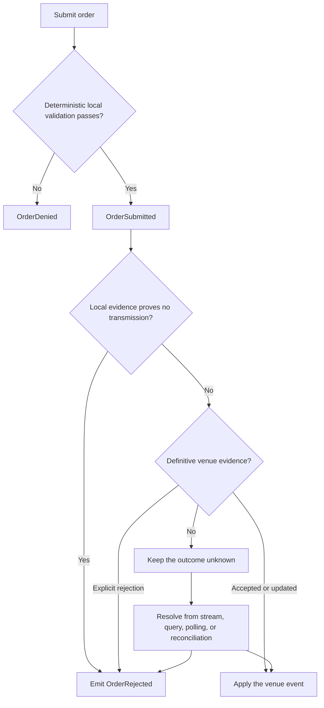
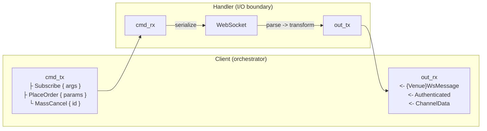

# Adapters

## Introduction

Use this guide to build or extend a Rust-native adapter for NautilusTrader. Adapters connect the
platform to venues and data providers, preserve venue semantics, produce valid Nautilus domain
events, and make uncertain outcomes explicit. They implement the platform data and execution
client traits in Rust, then expose configs, factories, and selected low-level APIs to Python
through PyO3.

:::note
The public Python API does not yet define an interface for implementing an out-of-tree
adapter entirely in Python. An out-of-tree Python adapter surface is planned. This guide
covers in-tree Rust adapters.
:::

Use reference adapters selectively. Their layouts reflect different venue protocols, product
families, and implementation histories.

| Adapter            | Useful reference                                                                                       |
| ------------------ | ------------------------------------------------------------------------------------------------------ |
| [Bybit][bybit]     | Multi-product HTTP and WebSocket clients, options data, and execution outcome handling.                |
| [OKX][okx]         | Public, private, and business WebSocket endpoints with broad instrument coverage.                      |
| [Binance][binance] | Spot and futures product splits, trading WebSockets, and SBE market data.                              |
| [Kraken][kraken]   | Spot and futures submodules with distinct HTTP, WebSocket, data, and execution paths.                  |
| [Lighter][lighter] | Layer-2 signing, canonical benchmarks, coverage-guided fuzzing, and detailed execution state handling. |
| [Derive][derive]   | JSON-RPC data and execution, EIP-712 signing, canonical benchmarks, and invariant-based fuzzing.       |

This guide distinguishes four kinds of guidance:

- **Shared rules** come from common traits, network abstractions, hooks, or CI.
- **Common patterns** appear in several adapters but allow other designs.
- **Examples** show one sound implementation without making it mandatory.
- **Exceptions** are valid when venue semantics or protocol boundaries require them.

## Conformance

An adapter conforms when it satisfies each rule below that applies to it, or documents an exception.
Name the venue behavior that forces the exception, keep it inside the adapter, and cover it with a
test that fails if the venue stops requiring it. [Phase 7](#phase-7-prove-conformance) sequences the
work that proves conformance.

### Adapter foundations

| Rule                                                                                       | Applies to         |
| ------------------------------------------------------------------------------------------ | ------------------ |
| [Repository and Python wiring](#repository-and-python-wiring)                              | New adapter crates |
| [Credentials and secret handling](#credentials-and-secret-handling)                        | Every adapter      |
| [Configurations](#configurations-configrs)                                                 | Every adapter      |
| [Symbols and instrument identity](#symbols-and-instrument-identity)                        | Every adapter      |
| [Venue payload modeling and precision](#modeling-venue-payloads)                           | Every adapter      |
| [Client traits and factories](#client-traits-and-factories-datars-executionrs-factoriesrs) | Every adapter      |

### Runtime and client lifecycle

| Rule                                                  | Applies to                 |
| ----------------------------------------------------- | -------------------------- |
| [Connection lifecycle](#connection-lifecycle-connect) | Data and execution clients |
| [Data events and request freshness](#data-client)     | Data clients               |
| [Backpressure](#backpressure)                         | Every adapter              |
| [Task management](#task-management)                   | Every adapter              |

### Execution and reconciliation

| Rule                                                                                          | Applies to        |
| --------------------------------------------------------------------------------------------- | ----------------- |
| [Execution client boundaries](#execution-client)                                              | Execution clients |
| [Reconciliation reports](#reconciliation-reports)                                             | Execution clients |
| [Commission failure handling](#commission-failure-handling)                                   | Execution clients |
| [Bounded mass-status reports](#bounded-mass-status-reports)                                   | Execution clients |
| [Instrument resolution during reconciliation](#instrument-resolution-during-reconciliation)   | Execution clients |
| [Tracked and external execution updates](#tracked-and-external-execution-updates)             | Execution clients |
| [Event ordering and deduplication](#event-ordering-and-deduplication)                         | Execution clients |
| [Order command outcome policy](#order-command-outcome-policy)                                 | Execution clients |
| [Naming the evidence classes](#naming-the-evidence-classes)                                   | Execution clients |
| [Diagnostics and strategy-facing reasons](#separate-diagnostics-from-strategy-facing-reasons) | Execution clients |

### Transport and streaming

| Rule                                                                            | Applies to                       |
| ------------------------------------------------------------------------------- | -------------------------------- |
| [Request flow](#request-flow)                                                   | HTTP clients                     |
| [Request signing and authentication](#request-signing-and-authentication)       | HTTP and WebSocket request paths |
| [Error handling and retry logic](#error-handling-and-retry-logic)               | HTTP and WebSocket request paths |
| [Rate limiting](#rate-limiting)                                                 | HTTP and WebSocket clients       |
| [Handler initialization handshake](#handler-initialization-handshake-setclient) | WebSocket clients                |
| [Authentication](#authentication)                                               | WebSocket clients                |
| [Subscription management](#subscription-management)                             | WebSocket clients                |
| [Message routing](#message-routing)                                             | WebSocket clients                |
| [Reconnection and shutdown](#reconnection-and-shutdown)                         | WebSocket clients                |

The [data testing specification](spec_data_testing.md) and
[execution testing specification](spec_exec_testing.md) hold the scenarios that prove these
contracts against a venue.

### Shared baseline

Leverage the shared implementation of each piece below, then use any state structure that satisfies
the contract it implements. The shared type carries that contract with it and keeps behavior
comparable across venues, so a local structure has to prove the same contract on its own terms.

Two execution clients implement the same trait without trading through a venue API, so the baseline
does not apply to them: [sandbox](../../crates/adapters/sandbox/src/execution.rs) simulates fills
locally, and [blockchain](../../crates/adapters/blockchain/src/execution/client.rs) executes
on-chain behind the `defi` feature. Deterministic simulation eligibility also sits outside the
baseline, as an optional capability proven per adapter rather than a requirement.

| Target                     | Shared piece                                                                                           | Contract                                                                      |
| -------------------------- | ------------------------------------------------------------------------------------------------------ | ----------------------------------------------------------------------------- |
| Command outcome evidence   | [`CommandFailure`](../../crates/live/src/execution/failure.rs)                                         | [Naming the evidence classes](#naming-the-evidence-classes)                   |
| Order identity and context | [`OrderIdentity` and `OrderContext`](../../crates/live/src/execution/context.rs)                       | [Tracked and external updates](#tracked-and-external-execution-updates)       |
| Replay deduplication       | [`FifoCache` and `FifoCacheMap`](../../crates/common/src/cache/fifo.rs)                                | [Event ordering and deduplication](#event-ordering-and-deduplication)         |
| Order denial reasons       | [`OrderDeniedReason`](../../crates/model/src/events/order/denied_reason.rs)                            | [Diagnostics and reasons](#separate-diagnostics-from-strategy-facing-reasons) |
| Task lifecycle             | [`TaskGroup`](../../crates/live/src/task.rs) and [`TaskHandles`](../../crates/common/src/live/task.rs) | [Task management](#task-management)                                           |
| Ingestion precision        | [Domain numeric types](rust.md#domain-numeric-types)                                                   | [Venue payload modeling](#modeling-venue-payloads)                            |
| HTTP transport             | [`HttpClient`](../../crates/network/src/http/client.rs)                                                | [Request flow](#request-flow)                                                 |
| Authentication state       | [`AuthTracker`](../../crates/network/src/websocket/auth.rs)                                            | [Authentication](#authentication)                                             |
| Subscription identity      | [`SubscriptionState`](../../crates/network/src/websocket/subscription.rs)                              | [Subscription management](#subscription-management)                           |
| Reconnect requests         | [`request_reconnect`](../../crates/network/src/websocket/client.rs)                                    | [Reconnection and shutdown](#reconnection-and-shutdown)                       |
| Retry machinery            | [`RetryManager`](../../crates/network/src/retry.rs)                                                    | [Error handling and retry logic](#error-handling-and-retry-logic)             |
| Inferred fill commission   | [`ExecutionClient`](../../crates/common/src/clients/execution.rs)                                      | [Commission failure handling](#commission-failure-handling)                   |

Where a venue transmits a discrete value as an IEEE-754 field rather than a decimal string or JSON
number, contain that at the parsing boundary as a documented exception instead of letting `f64`
spread inward from it.

Retry classification is the exception to this table: it stays adapter-owned because venue status
codes and rate-limit semantics differ. The shared machinery around it is not. See
[error handling and retry logic](#error-handling-and-retry-logic) for both halves.

## Structure of an adapter

The Rust crate is the source of truth for protocol behavior. An adapter commonly separates these
concerns:

```text
crates/adapters/<adapter>/
├── Cargo.toml
├── src/
│   ├── common/              # Shared credentials, enums, models, parsing, symbols, and URLs
│   ├── http/                # Typed requests, responses, signing hooks, and transport client
│   │   ├── client.rs
│   │   ├── error.rs
│   │   ├── models.rs
│   │   ├── parse.rs
│   │   └── query.rs
│   ├── websocket/           # Streaming transport, protocol messages, parsing, and routing
│   │   ├── client.rs
│   │   ├── handler.rs
│   │   ├── messages.rs
│   │   ├── parse.rs
│   │   ├── subscription.rs  # When subscription identity or replay needs a boundary
│   │   └── dispatch.rs      # When execution routing needs a boundary
│   ├── config.rs
│   ├── data.rs              # Or data/ when product implementations need a split
│   ├── execution.rs         # Or execution/ when product implementations need a split
│   ├── factories.rs
│   ├── python/              # PyO3 projection
│   ├── signing/             # When authentication or transaction signing is a subsystem
│   └── lib.rs
├── tests/                   # Public Rust boundary tests
├── test_data/               # Canonical venue payloads and protocol vectors
├── benches/                 # When confirmed hot paths warrant benchmarks
│   ├── common/              # Shared benchmark fixtures
│   ├── data.rs
│   ├── exec.rs
│   └── micros.rs
├── fuzz/                    # When untrusted codecs warrant coverage-guided fuzzing
│   ├── fuzz_targets/
│   └── README.md
├── examples/                # Rust tester nodes and focused usage examples
├── bin/                     # Optional protocol inspection or capture tools
└── README.md
```

Python and documentation surfaces sit outside the crate:

```text
python/nautilus_trader/adapters/<adapter>/  # Public package and generated stubs
examples/live/<adapter>/                    # Python data and execution testers
python/tests/unit/adapters/<adapter>/       # Public Python package tests
docs/integrations/<adapter>.md              # User-facing integration guide
```

Only `Cargo.toml` and `src/lib.rs` are universal crate boundaries. Add the other modules when the
adapter needs them:

- Put symbols, credentials, URLs, shared enums, and shared parsing under `common/`.
- Put transport models, typed requests, signing, and HTTP clients under `http/`.
- Put frames, messages, subscription state, routing, and WebSocket clients under `websocket/`.
- Implement live data and execution traits in `data.rs` and `execution.rs`, or in product
  submodules when the venue exposes materially different protocols.
- Keep PyO3 projection code under `python/`.
- Organize integration tests by public boundary or product. Do not force all adapters into the
  same filenames.

Product-specific splits are legitimate when product families have different protocols. A shared
client can also span distinct endpoints when request and state semantics remain common. Match the
venue's real boundaries and keep shared behavior above those splits.

An adapter's public Python package lives under `python/nautilus_trader/adapters/<adapter>/` and
usually re-exports generated bindings. Change Rust binding metadata or other generator inputs,
then run `make py-stubs`; do not edit generated `.pyi` files.

### Repository and Python wiring

A new adapter crate must be discoverable by each build surface that owns it:

| Surface                       | Required change                                                                                                  | Enforcement or proof                                                                                           |
| ----------------------------- | ---------------------------------------------------------------------------------------------------------------- | -------------------------------------------------------------------------------------------------------------- |
| Root Rust workspace           | Add the crate to the members and workspace dependencies in [`Cargo.toml`](../../Cargo.toml).                     | Workspace metadata and targeted Cargo checks discover the crate.                                               |
| Workspace test inventory      | Add the crate to `ADAPTER_CRATES` in the [`Makefile`](../../Makefile).                                           | The [workspace coverage check](../../scripts/ci/check-workspace-test-coverage.sh) requires one test inventory. |
| PyO3 crate                    | Add the optional dependency and feature propagation in [`crates/pyo3/Cargo.toml`](../../crates/pyo3/Cargo.toml). | Building the matching PyO3 feature compiles the adapter projection.                                            |
| PyO3 root module              | Register the adapter module in [`crates/pyo3/src/lib.rs`](../../crates/pyo3/src/lib.rs).                         | The conventions hook treats this module list as the public API allowlist.                                      |
| Adapter PyO3 registry         | Register each applicable factory and config extractor with `get_global_pyo3_registry()`.                         | Factory boundary tests prove Python config objects reach the Rust factories.                                   |
| Python package and user guide | Add package projection, tests, examples, and an integration guide only for capabilities the adapter exposes.     | Import, generated drift, example build, and documentation checks cover these surfaces.                         |

The [Nautilus conventions hook](../../.pre-commit-hooks/check_nautilus_conventions.sh) treats the
PyO3 module list as a public API allowlist. The
[PyO3 conventions hook](../../.pre-commit-hooks/check_pyo3_conventions.sh) also enforces:

- Stub metadata uses `nautilus_trader.adapters.<adapter>`.
- Runtime extension imports use `nautilus_trader._libnautilus.<adapter>`.
- A Rust function renamed with `#[pyo3(name = ...)]` has a `py_` Rust name.
- Python exceptions use the project error conversion functions.

## Adapter implementation sequence

Use these phases to organize the work. They describe dependencies, not release gates. A
market-data-only adapter omits execution, and an adapter can complete one product before starting
another. Keep the capability matrix current throughout the work rather than waiting for the final
documentation phase. Omit phases and steps that do not apply to the adapter.

### Phase 0: Define scope

| Step | Component           | Work                                                                                                      |
| ---- | ------------------- | --------------------------------------------------------------------------------------------------------- |
| 0.1  | Capability matrix   | List the products, environments, account modes, data types, order types, and reports in scope.            |
| 0.2  | Venue constraints   | Record venue restrictions, unsupported capabilities, and testnet differences.                             |
| 0.3  | Protocol boundaries | Identify separate product APIs, public and private endpoints, and binary or JSON transports.              |
| 0.4  | Initial slice       | Choose the smallest slice that proves an end-to-end path.                                                 |
| 0.5  | Repository wiring   | Add the crate to the Rust workspace and test inventory, then add only the projection surfaces it exposes. |

**Exit:** The integration guide contains an initial capability matrix, known gaps, and a test plan.

### Phase 1: Build the protocol core

| Step | Component             | Work                                                                                                                            |
| ---- | --------------------- | ------------------------------------------------------------------------------------------------------------------------------- |
| 1.1  | HTTP error types      | Model transport, HTTP status, venue, parsing, and validation failures; classify retryability when supported.                    |
| 1.2  | HTTP client           | Implement endpoint resolution and typed requests, plus credentials, signing, rate limits, retries, and pagination as needed.    |
| 1.3  | HTTP API models       | Define typed requests and responses, commonly under `http/` or its product-specific modules.                                    |
| 1.4  | HTTP parsing          | Convert venue responses to domain types at deterministic boundaries in `http/parse.rs` or `common/parse.rs`.                    |
| 1.5  | WebSocket error types | Model connection, protocol, and parsing failures, plus authentication and command failures when applicable.                     |
| 1.6  | WebSocket client      | Implement lifecycle and shutdown, plus authentication, heartbeat, subscription state, and reconnection when applicable.         |
| 1.7  | WebSocket messages    | Define frames and messages under `websocket/` or product-specific modules; include acknowledgements and venue errors as needed. |
| 1.8  | WebSocket parsing     | Decode each frame once, convert domain events, and route data or execution messages by typed identity.                          |
| 1.9  | Protocol tests        | Prove fixtures, canonical requests, applicable signing vectors, lifecycle, and raw exchanges with mock peers.                   |

**Exit:** The crate compiles, protocol fixtures parse, applicable signing vectors pass, and mock or
controlled requests complete any required authentication and exchange raw venue messages.

### Phase 2: Implement instruments

| Step | Component          | Work                                                                                                     |
| ---- | ------------------ | -------------------------------------------------------------------------------------------------------- |
| 2.1  | Instrument parsing | Parse every supported family with complete identity, precision, currency, and contract fields.           |
| 2.2  | Instrument loading | Load, filter, cache, and emit definitions at each parsing boundary that needs context.                   |
| 2.3  | Symbol mapping     | Define bidirectional venue symbol and `InstrumentId` conversion without collapsing distinct instruments. |
| 2.4  | Instrument updates | Implement fresh instrument requests and any supported definition or status updates.                      |

**Exit:** Distinct fixtures cover every supported instrument family, invalid definitions fail
clearly, and the data client emits or returns complete Nautilus instruments.

### Phase 3: Implement market data

Start with one public stream and one instrument before adding product or endpoint fan-out.

| Step | Component                | Work                                                                                                        |
| ---- | ------------------------ | ----------------------------------------------------------------------------------------------------------- |
| 3.1  | Public WebSocket streams | Subscribe and unsubscribe each advertised live data type while preserving subscription intent.              |
| 3.2  | Historical data requests | Request supported bars, trades, quotes, or order book snapshots with exact correlation and freshness rules. |
| 3.3  | Data client              | Implement `DataClient` requests, subscriptions, lifecycle, and complete `DataEvent` emission.               |
| 3.4  | Order book handling      | Preserve snapshot, incremental update, sequence, clear, and batch boundaries.                               |
| 3.5  | Stream recovery          | Handle malformed input, gaps, unsubscribe, disconnect, reconnect, and subscription replay.                  |

**Exit:** Unit and mock transport tests prove complete domain events for the supported request and
subscription matrix.

### Phase 4: Implement execution

Establish account state and reconciliation before enabling order flow.

| Step | Component              | Work                                                                                                         |
| ---- | ---------------------- | ------------------------------------------------------------------------------------------------------------ |
| 4.1  | Account bootstrap      | Establish account identity, initial account state, private subscriptions, and connected readiness.           |
| 4.2  | Reconciliation reports | Generate applicable order, fill, position, and mass-status reports at startup and on demand.                 |
| 4.3  | Basic order submission | Implement supported market and limit order submission with deterministic local validation.                   |
| 4.4  | Order modification     | Implement supported modify and cancel commands, including cancel-replace venue semantics.                    |
| 4.5  | Execution client       | Implement `ExecutionClient` commands, lifecycle, tracked and external routing, and ordered event emission.   |
| 4.6  | Outcome recovery       | Preserve unknown outcomes, deduplicate fills, and resolve state through streams, queries, or reconciliation. |

**Exit:** Mock transport tests cover every supported command, definitive rejection, uncertain
transmission, duplicate or out-of-order updates, and startup reconciliation.

### Phase 5: Add optional venue capabilities

Add these only after the base lifecycle is stable.

| Step | Component                  | Work                                                                                              |
| ---- | -------------------------- | ------------------------------------------------------------------------------------------------- |
| 5.1  | Advanced order types       | Add applicable conditional, stop, take-profit, trailing-stop, or other advanced orders.           |
| 5.2  | Batch operations           | Add batch submission, batch cancellation, and mass cancel with per-order result handling.         |
| 5.3  | Venue-specific data        | Add funding, greeks, liquidations, or venue extensions as separate capability slices.             |
| 5.4  | Product or endpoint splits | Split ownership only when protocol, authentication, quota, or recovery boundaries require it.     |
| 5.5  | Capability proof           | Add fixtures, functional tests, acceptance cases, and documented limitations for each capability. |

**Exit:** Each optional capability is independently testable and does not weaken the established
base paths.

### Phase 6: Complete factories and projection

| Step | Component             | Work                                                                                             |
| ---- | --------------------- | ------------------------------------------------------------------------------------------------ |
| 6.1  | Configuration structs | Finalize typed data and execution configs, defaults, environment fallback, and secret redaction. |
| 6.2  | Client factories      | Implement Rust factories with `CacheView` inputs and the data client clock.                      |
| 6.3  | PyO3 registration     | Register applicable factories and config extractors with the PyO3 registry.                      |
| 6.4  | Python package        | Add the public package and Python boundary tests for the capabilities exposed to Python.         |
| 6.5  | Generated stubs       | Add Rust stub metadata and regenerate the `.pyi` output with `make py-stubs`.                    |

**Exit:** Rust factory tests and PyO3 boundary tests pass, package imports resolve, and generated
output matches its Rust inputs.

### Phase 7: Prove conformance

| Step | Component              | Work                                                                                                   |
| ---- | ---------------------- | ------------------------------------------------------------------------------------------------------ |
| 7.1  | Rust unit tests        | Prove parsers, serializers, symbols, signatures, state transitions, and malformed input.               |
| 7.2  | Rust integration tests | Exercise public HTTP, WebSocket, data, and execution boundaries against deterministic mock transports. |
| 7.3  | Python boundary tests  | Prove imports, config extraction, factories, type conversion, and representative async calls.          |
| 7.4  | Acceptance tests       | Run every applicable `DataTester` and `ExecTester` case on testnet or a controlled account.            |
| 7.5  | Recovery tests         | Exercise connection failure, reconnect, shutdown, rate limits, and state recovery.                     |
| 7.6  | Specification gaps     | Record every skipped specification case with a venue or capability reason.                             |

**Exit:** The applicable data and execution testing specifications pass, and every advertised
capability has deterministic and venue evidence.

### Phase 8: Measure performance and robustness

| Step | Component            | Work                                                                                                      |
| ---- | -------------------- | --------------------------------------------------------------------------------------------------------- |
| 8.1  | Canonical benchmarks | Measure confirmed end-to-end data and execution hot paths with representative fixtures.                   |
| 8.2  | Microbenchmarks      | Isolate confirmed signing, hashing, authentication, codec, parsing, or serialization costs.               |
| 8.3  | Fuzz targets         | Fuzz untrusted parsing, decoding, normalization, signing, and encoding boundaries with realistic corpora. |
| 8.4  | Invariants           | Assert domain and protocol properties stronger than panic freedom.                                        |

**Exit:** Canonical benchmark and fuzz suites run with representative fixtures, documented
invariants, and no mandatory categories that the adapter does not use.

### Phase 9: Finish documentation and operations

| Step | Component           | Work                                                                                           |
| ---- | ------------------- | ---------------------------------------------------------------------------------------------- |
| 9.1  | Capability matrix   | Reconcile every support claim and exception with the tested implementation.                    |
| 9.2  | Integration guide   | Document credentials, config, limits, reconciliation, environment differences, and known gaps. |
| 9.3  | Tester entry points | Provide applicable Rust and Python data and execution testers with safe defaults.              |
| 9.4  | Operations          | Document recovery, troubleshooting, and any venue behavior an operator must understand.        |
| 9.5  | Final verification  | Verify links, generated output, examples, and the focused documentation checks.                |

**Exit:** A user can configure, test, operate, and diagnose the adapter without reading its source.

## Rust adapter patterns

Repository-wide import policy applies to adapter code: import Nautilus types and use their short
names instead of fully qualifying them at call sites. The
[Nautilus conventions hook](../../.pre-commit-hooks/check_nautilus_conventions.sh) enforces this
rule and documents its scoped exception marker.

### Configurations (`config.rs`)

Follow the shared [configuration guide](../concepts/configuration.md). In particular, Rust configs
use typed fields, strict Serde decoding, one source of truth for defaults, and `bon::Builder`.
Adapter configs then add only venue semantics:

- Use an enum for a closed set such as environment, product family, account mode, or endpoint.
- Use `Option<T>` only when absence has a distinct meaning, including runtime credential fallback.
- Keep data and execution config separate when their capabilities or credentials differ.
- Store fields that must not appear in `Debug` as `SecretString`. Derive `Debug` when every sensitive
  field uses a redacting type; write a custom implementation only when a field cannot use one or the
  type requires more restrictive output.
- Keep Python config projection thin. It converts types and delegates to the Rust config.

Centralize default HTTP and WebSocket endpoint resolution so one environment selection cannot mix
live and test endpoints. Keep explicit URL overrides only where custom gateways, mock servers, or
venue deployments require them. Test every supported environment and any precedence between an
environment choice and an explicit override.

### Credentials and secret handling

When HTTP and WebSocket clients use the same key material, centralize credential handling in a type,
commonly under `common/credential.rs`. Keep configs as data transfer objects: resolve credentials
when constructing the credential, factory, or client, not in Python wrappers or individual request
methods.

#### Classify sensitive values

Classify a value before choosing its type and diagnostic output. Apply the more restrictive rule
when a venue gives one value more than one role.

| Value class                  | Examples                                                                                                      | Diagnostic output                                                                       |
| ---------------------------- | ------------------------------------------------------------------------------------------------------------- | --------------------------------------------------------------------------------------- |
| Secret material              | Passwords, private keys, API secrets, passphrases, bearer and session tokens, refresh tokens, and signatures. | Always show `<redacted>`.                                                               |
| Credential identity          | API keys, client IDs, usernames, and account identifiers used during authentication.                          | Redact by default. Use a masked API key only when operational correlation requires it.  |
| Secret-bearing location      | Proxy URLs, RPC URLs, request paths, and query parameters that can contain credentials.                       | Redact the complete location from logs and errors.                                      |
| Deliberately public identity | Wallet addresses, vault addresses, and public account names that the venue exposes publicly.                  | Show only when the type and adapter contract deliberately classify the value as public. |

Do not infer that an API key, username, or URL is safe to print because it is not sufficient to
authenticate by itself. Configs often cross logging, exception, and Python representation
boundaries where partial credential identity remains sensitive.

#### Use the common secret types

Use `nautilus_core::string::secret` and `zeroize` instead of defining adapter-local redaction or
zeroization conventions.

| Mechanism                     | Use                                                                                                                                   |
| ----------------------------- | ------------------------------------------------------------------------------------------------------------------------------------- |
| `SecretString`                | Own a string that must zeroize on drop and render as `<redacted>` with `Debug`.                                                       |
| `REDACTED`                    | Replace an unconditional secret field in a custom `Debug` or `Display` implementation.                                                |
| `redact_option`               | Preserve `Some` versus `None` while redacting an optional field in a custom `Debug`.                                                  |
| `mask_api_key`                | Correlate an API key only through an explicit masked-identity method. Do not use it for secret material.                              |
| `Zeroizing<T>`                | Bound the lifetime of an owned plaintext `String`, byte buffer, decoded key, canonical payload, or serialized authentication message. |
| `Zeroize` and `ZeroizeOnDrop` | Clear secret-bearing fields in structs that cannot use `SecretString`, including byte arrays and signing types.                       |
| `zeroize_json_value`          | Clear owned strings in a mutable JSON value after serializing secret-bearing fields.                                                  |

#### Use `SecretString` safely

- Treat serialization as plaintext. `SecretString` uses the underlying string for wire-format
  compatibility, so never serialize a config, credential, or authentication model for diagnostics.
- Do not use ordinary `SecretString` equality to verify attacker-controlled secrets; it is not
  constant-time.
- Borrow plaintext through `expose_secret()` only at the signing, encoding, or transport boundary
  that needs it.
- Consume with `into_inner()` only to transfer ownership. If the receiving API requires `String`,
  create that final copy at the call boundary and do not retain it in adapter code.
- Take `&SecretString` when a function only reads the value. Take it by value when the function
  retains or consumes it.
- Put secret-bearing fields in the authenticated wire model instead of creating a second model only
  to change `Debug`. Derive `Serialize` and derive `Debug` when every sensitive field redacts.
- Write a custom `Debug` for credentials backed by byte arrays, signing keys, or other types that
  cannot store their secret fields as `SecretString`.
- Avoid `Display` for secret-bearing types unless a caller requires it. Any implementation must
  redact secret material.

#### Resolve and share credentials

- Define environment variable names once and select them from typed environment and product values.
- Document the established environment variable names in the adapter's integration guide.
- Resolve all fields as one credential set. Public clients may remain unauthenticated, but an
  authenticated client rejects an incomplete or invalid set before sending a request.
- Convert config and environment strings into zeroizing owners at the credential boundary. Do not
  retain a non-zeroizing plaintext copy in adapter state after conversion.
- Share credential storage across transports only when they use the same key material. Keep HTTP,
  WebSocket, and transaction signing methods separate when their canonical payloads differ.

#### Project credentials into Python

- Convert credential strings accepted by a Python constructor to `SecretString` at the Rust
  boundary.
- Apply the Rust `Debug` and `Display` redaction rules to Python `__repr__` and `__str__`.
- Expose only a presence check for secret material and secret-bearing locations.
- Return credential identity, such as a username, only when an existing public API or another
  explicit caller needs it. Document the choice and keep the value out of diagnostics.
- Never expose passwords, private keys, API secrets, passphrases, tokens, or signatures through
  plaintext getters.

#### Bound plaintext lifetime

- Zeroize each owned plaintext allocation after its final use, including normalized and decoded keys,
  secret-bearing signing payloads, serialized authentication messages, encoded form values, and
  mutable request models.
- Prefer borrowed slices and existing zeroizing owners over intermediate `String` and `Vec<u8>`
  copies.
- Limit the guarantee to allocations the adapter owns. Serialization libraries, transports, TLS,
  and the operating system may make copies the adapter cannot reach.
- Keep plaintext lifetimes short; do not promise process-wide or transport-wide erasure.

#### Redact diagnostics and transport errors

- Never include credentials, signatures, secret material, or secret-bearing URLs in errors or logs
  at any level.
- Log request metadata such as the method, field count, and byte lengths instead of credentials or
  authentication payloads. Shared transports log metadata rather than payload contents.
- Treat TRACE as developer-facing diagnostic output. Raw inbound payloads are allowed when their
  schema cannot contain credential material.
- Treat raw private-stream TRACE output as sensitive because it can disclose orders, balances,
  positions, and account identity. Redact it before sharing.
- Prefer metadata or a sanitized, bounded excerpt when either can diagnose the protocol.
- Clear mutable source models after serialization when they own another plaintext copy.
- Never log a raw authentication request or response, or any frame whose schema can contain secret
  material.

| Surface                      | Required handling                                                                                                | Zeroization boundary                                                   |
| ---------------------------- | ---------------------------------------------------------------------------------------------------------------- | ---------------------------------------------------------------------- |
| HTTP secret body             | Use `HttpClient::request_with_secret_body`.                                                                      | The client retains the zeroizing owner; lower layers may copy it.      |
| HTTP path or `HashMap` query | Use `HttpClient::request_with_url_redacted`.                                                                     | The URL is removed from logs and transport errors.                     |
| HTTP typed query             | Use `HttpClient::request_with_params_url_redacted`.                                                              | The URL is removed from logs and transport errors.                     |
| HTTP headers and proxy       | Create credential-bearing strings at the client boundary, avoid clones, and do not retain them in adapter state. | The shared client or transport may retain copies.                      |
| WebSocket authentication     | Keep fields and serialized frames in `SecretString`; create the final `String` immediately before `send_text`.   | The shared client has no secret-owner-preserving send method.          |
| Unsupported combination      | Extend the common client instead of implementing adapter-local URL or error scrubbing.                           | The common API must define the resulting ownership and redaction rule. |

#### Verify credential handling

Test the secret-handling contract as well as successful authentication:

- Cover explicit values, environment fallback, incomplete credentials, and invalid credentials.
- Assert that config, credential, request, response, and client `Debug` output omits the exact input
  secrets. Test `Display` separately for every secret-bearing type that implements it.
- Assert that Python `__repr__` and `__str__` omit credential identity and secret material. Test
  presence checks and every deliberately exposed identity getter.
- Assert that serialization and transport preserve the exact wire value where the venue requires
  plaintext.
- Force transport failures for credential-bearing URLs and assert that both `Display` and `Debug`
  error output omit the URL, path secret, and query secret.
- Use compile-time trait assertions for `Zeroize` or `ZeroizeOnDrop`, and test explicit clearing for
  mutable request and response models.
- Keep deterministic signature vectors so redaction and zeroization changes cannot alter signing
  bytes, field order, or encoding.

### Symbols and instrument identity

Separate venue symbols from Nautilus `InstrumentId` values. A symbol module commonly owns:

- Parsing and formatting venue symbols.
- Product or contract suffixes required for a unique Nautilus symbol.
- Validation of venue and product identity.
- Round-trip tests for supported forms and rejection tests for ambiguous forms.

Choose the mapping from the venue's identity scheme:

| Venue identity                                      | Nautilus representation                         | Example                                             |
| --------------------------------------------------- | ----------------------------------------------- | --------------------------------------------------- |
| Native symbol distinguishes the product             | Preserve the symbol and add the venue.          | `BTC-USDT-SWAP` -> `BTC-USDT-SWAP.OKX`.             |
| Raw symbol is reused across product families        | Add and validate a stable product suffix.       | Bybit linear `BTCUSDT` -> `BTCUSDT-LINEAR.BYBIT`.   |
| Nautilus and the venue use different contract marks | Implement both directions at one boundary.      | Binance USD-M `BTCUSDT` -> `BTCUSDT-PERP.BINANCE`.  |
| Transport casing differs from canonical identity    | Convert only when building the transport value. | Binance stream `BTCUSDT-PERP.BINANCE` -> `btcusdt`. |

The [`BybitSymbol`](../../crates/adapters/bybit/src/common/symbol.rs) wrapper and
[Binance symbol conversions](../../crates/adapters/binance/src/common/symbol.rs) show the suffix
and bidirectional conversion patterns. Treat them as examples, not a shared suffix scheme.

Do not normalize distinct venue instruments to the same `InstrumentId`. Give test fixtures distinct
symbols, precisions, currencies, and contract fields so swaps and omissions fail visibly.

For every supported product family, test venue symbol -> `InstrumentId` -> venue symbol. Normalize
case once at the identity boundary and preserve venue-significant case elsewhere. When the mapping
requires a product marker, reject a missing or ambiguous marker before caching the instrument.

Construct instruments from current venue definitions. Validate required identity and precision
before caching or emission. Keep parsing functions deterministic and independent of live client
state where practical.

### Modeling venue payloads

Model the wire format, not an imagined stable subset:

- Use typed request and response structs for known fields.
- Use Serde aliases or custom deserializers only when supported payloads require them.
- Reject unknown values for closed sets whose meaning affects domain behavior.
- Preserve or explicitly classify unknown values for open venue sets that may expand without a
  protocol version change.
- Keep raw models separate from Nautilus domain objects. Convert at one auditable boundary.
- Deserialize prices, quantities, money, fees, and other discrete values as `Decimal`. Construct
  domain values with `Price::from_decimal`, `Price::from_decimal_dp`, `Quantity::from_decimal`,
  `Quantity::from_decimal_dp`, `Money::from_decimal`, or `Money::zero`; never route wire values
  through `f64`. See [domain numeric types](rust.md#domain-numeric-types).
- Choose domain precision from the field contract, not incidental payload formatting:

| Field contract                                     | `"25.000"` result       | Conversion                                                          |
| -------------------------------------------------- | ----------------------- | ------------------------------------------------------------------- |
| Venue-declared scale is meaningful                 | `25.000` at precision 3 | Use `Price::from_decimal` or `Quantity::from_decimal`.              |
| Documented trailing zeros are non-semantic padding | `25` at precision 0     | Call `Decimal::normalize`, then use the scale-inferred constructor. |
| Instrument or currency precision governs the value | `25.00` at precision 2  | Use `Price::from_decimal_dp` or `Quantity::from_decimal_dp`.        |

Use instrument or currency precision for event and report values when available. A venue may send
the same value as `"25"`, `"25.0"`, or `"25.000"`, so do not infer precision per payload unless
the adapter defines and tests an explicit compatibility fallback. The declared-precision
constructors apply banker's rounding when a value has excess non-zero digits; validate round-trip
equality when the field contract requires exact representation. During reconciliation, follow
[instrument resolution](#instrument-resolution-during-reconciliation) when precision metadata is
missing.

- Pass required parsing context explicitly, including instrument precision, currencies, account
  identity, and `ts_init`. Keep live client state outside parsers.
- Treat missing, null, and empty values according to the venue schema. Do not collapse them into one
  fallback when they carry different meanings.
- Use the venue timestamp for `ts_event` when the payload supplies one. Assign `ts_init` from the
  adapter clock when it receives or constructs the event. Use receipt time as event time only when
  the venue has no authoritative timestamp, and cover that fallback with a test.

Avoid permissive fallbacks that silently turn a new venue value into an existing semantic value.
Stable error handling is part of the parser contract.

#### Venue enum fallbacks

Venues extend wire enums without notice: new order states, order types, and category codes appear
in production before clients update. Give each extensible venue enum a forward-compatible fallback
variant (`Unknown` for venue states, `Other` for open value sets such as types and categories) with
`#[serde(other)]`, so one new value cannot fail deserialization of the message carrying it. Closed
sets the adapter defines stay strict.

The fallback changes where strictness lives, not whether it exists:

- Never panic on an unknown wire variant; the fallback keeps the connection and the sibling records
  in the same payload alive.
- Never map an unknown variant onto an existing domain value. Make the domain mapping fallible
  (`TryFrom`) so the fallback variant is rejected explicitly at the mapping boundary.
- Preserve safety-critical payload data even when a sibling classification is unmapped. A fill
  must still be parsed and emitted when its order state or order type is unknown, because fill
  fields carry their own prices, quantities, and fees.
- Skip only the unmappable classification and log a warning with the venue identifiers (order ID,
  instrument) needed to investigate. When the message carries no data worth preserving, fail the
  record explicitly instead of inventing a status. Reconciliation heals the gap once the order
  reaches a mapped state; an unmapped value fails the same way on the reconciliation path, so
  treat the warning as the signal to add the mapping.

#### Separate authority from projections

Use separate response models when one endpoint returns both evidence that establishes permission or
authorizes state mutation and data needed for a narrower read.

| Boundary                   | Purpose                                                            | Validation                                                                                          | Meaning of success                                                           |
| -------------------------- | ------------------------------------------------------------------ | --------------------------------------------------------------------------------------------------- | ---------------------------------------------------------------------------- |
| **Authoritative response** | Establish permission or authorize state mutation.                  | Requires all authoritative fields; rejects legacy conflicts and semantic duplicates before mapping. | The response can support the authority decision it models.                   |
| **Narrow projection**      | Read a balance, health value, or metadata without using authority. | Decodes returned fields only; its type cannot expose, grant, or infer omitted authority.            | Only the projected value; omitted permission or account evidence is unknown. |

Use the projection when malformed authority fields must not block the narrower read. Keep the
authoritative model strict.

### Client traits and factories (`data.rs`, `execution.rs`, `factories.rs`)

The shared [`DataClient`](../../crates/common/src/clients/data.rs),
[`ExecutionClient`](../../crates/common/src/clients/execution.rs), and
[client factory](../../crates/common/src/factories/client.rs) traits define the adapter boundary.
Implement the supported methods and leave unsupported capabilities explicit in the integration
guide.

Name each client family symmetrically: `<Venue>DataClient`, `<Venue>DataClientConfig`, and
`<Venue>DataClientFactory` for data; `<Venue>ExecutionClient`, `<Venue>ExecutionClientConfig`, and
`<Venue>ExecutionClientFactory` for execution. Each factory consumes its corresponding client
config directly. Do not add a separate factory config wrapper. The live node passes its
`LiveNodeConfig.trader_id` to execution factories, while venue-specific values such as `account_id`
belong on the execution client config.

Within a Python module, order client-family `add_class` registrations alphabetically by exported
type name so the data and execution families remain grouped.

Do not prefix the ordinary client family with `Live`: a connected client is the default, while
names such as `SandboxExecutionClient` and `DatabentoHistoricalClient` state alternate behavior.
Retain `Live` only when it distinguishes explicit runtime or protocol siblings. Runtime types such
as `LiveNode`, `LiveClock`, and the `Live*EngineConfig` family retain the qualifier.

Do not shorten `Execution` in public, project-owned PascalCase type names. Internal implementation
types may retain established `Exec` names. Also keep `Exec` where the
[general naming convention](coding_standards.md#naming-conventions) allows it, including venue
protocol terms such as `ExecType`. Name protocol-specific wire models after the venue concept, such
as `HyperliquidExchangeAction`. Preserve established public names, and apply this convention to new
APIs.

Factories receive a downcast `ClientConfig` and a read-only
[`CacheView`](../../crates/common/src/cache/mod.rs). Data factories also receive the shared clock.
Use the view to resolve instruments and existing state. Engine cache writes stay in the engines:
emit domain events and reports instead of mutating the engine cache from an adapter. A private
protocol cache is valid when parsing, subscription replay, or response correlation needs it.

The client traits use `#[async_trait(?Send)]`. Client objects are not intended to move across
threads and may hold non-`Send` Python state. Move owned, `Send` inputs into explicit runtime tasks
when asynchronous work must outlive a synchronous trait call.

### Adapter-owned state

Choose collections from ownership and update behavior:

- Use a plain `AHashMap` or `AHashSet` for state owned by one task.
- Use `AtomicMap` or `AtomicSet` for read-heavy immutable snapshots with infrequent writes. Use
  `rcu` when writers can race; a separate load and store can lose another writer's update.
- Use `DashMap` or `DashSet` for independent keys that receive concurrent entry updates.

Adapters use these patterns in different combinations. Keep the collection behind the component
that owns its invariant instead of sharing it merely to avoid passing a message. Use `Ustr` for
repeated protocol strings when interning reduces allocation or comparison cost; keep unique request
IDs and short-lived payload text in their natural types.

### Connection lifecycle (`connect`)

Treat each lifecycle method as a contract:

| Method       | Responsibility                                                                                               | Successful postcondition                                                           |
| ------------ | ------------------------------------------------------------------------------------------------------------ | ---------------------------------------------------------------------------------- |
| `start`      | Install local event plumbing and start client-owned background work.                                         | Local event paths exist before any task can publish.                               |
| `connect`    | Establish transports, authenticate, load required definitions or account state, and start stream processing. | Public commands can use the transport, and required bootstrap state is observable. |
| `disconnect` | Stop new network work and close transports.                                                                  | The client no longer sends or receives venue traffic.                              |
| `stop`       | End client-owned work using an idempotent path.                                                              | Repeated teardown is safe.                                                         |
| `reset`      | Clear reconnectable caches, counters, cancellation state, and stale in-flight state.                         | A later start or connection does not inherit invalid session state.                |
| `dispose`    | Release background tasks, threads, and external handles.                                                     | No client-owned resource remains active.                                           |

Do not report connected until public commands can use the transport and required engine-side state
is observable. In particular, an execution client that emits initial account state asynchronously
waits until the engine cache contains the account before calling `set_connected`; reconciliation
and strategy startup treat connected as a readiness signal. Apply the same rule to required
instrument or stream bootstrap state. When transport connection completes before the socket becomes
active, use a bounded `wait_until_active` step before subscribing or reporting readiness. On partial
connection failure, clean up resources already started and leave state consistent for retry or
disposal.

When an execution client uses
[`ExecutionEventEmitter`](../../crates/live/src/execution/emitter.rs), install its sender during
`start` before any task can emit.

#### Bootstrap ordering

Connection code varies, but its dependencies do not. A data client typically:

1. Resolves the environment and validates any credentials needed during bootstrap.
1. Fetches required instrument definitions and populates parsing context.
1. Publishes definitions that the engine must observe before data arrives.
1. Starts the transport and waits for the command path to become active.
1. Subscribes or replays intent only after handler initialization.
1. Reports connected after the required engine and protocol state is ready.

An execution client typically:

1. Validates credentials, account identity, and required instrument context.
1. Establishes and authenticates the private transport.
1. Starts stream processing and subscriptions in an order that cannot lose acknowledgements or
   account updates.
1. Fetches and emits initial account state, or waits for an authoritative stream snapshot.
1. Waits for required account and instrument state to become observable to the engine.
1. Reports connected only after commands and reconciliation can run.

Treat these as dependency constraints, not required function names. A venue can combine or reorder
steps when tests prove the same postconditions. If any step fails after resources start, tear down
those resources before returning the error.

### Data client

Subscriptions express ongoing intent. Requests ask the provider for current or historical data.
Keep their freshness semantics distinct:

- An explicit instrument request fetches from the provider unless the API contract explicitly
  permits a cache result.
- Private caches can provide parsing context, but must not turn a new request into a stale response.
- Emit a response only for data that satisfies the request identity and filters.
- Preserve the request correlation ID and original parameters in response events.

The shared [`DataEvent`](../../crates/common/src/messages/mod.rs) envelope determines how data
enters the engine:

| Variant                       | Use                                                                 | Contract to preserve                                                                |
| ----------------------------- | ------------------------------------------------------------------- | ----------------------------------------------------------------------------------- |
| `DataEvent::Instrument`       | Instrument definitions from bootstrap, requests, or updates.        | Preserve complete identity, precision, and venue timestamps when available.         |
| `DataEvent::InstrumentStatus` | Trading or availability status changes.                             | Emit meaningful transitions rather than unchanged polling snapshots.                |
| `DataEvent::Data`             | Trades, quotes, order-book data, bars, and other typed market data. | Complete parsing and event boundary construction before emission.                   |
| `DataEvent::Response`         | Results for current or historical data requests.                    | Preserve request correlation, parameters, filters, and freshness semantics.         |
| `DataEvent::FundingRate`      | Funding rate updates for derivatives.                               | Preserve the venue's effective or event time and instrument identity.               |
| `DataEvent::OptionGreeks`     | Venue-provided option greeks.                                       | Preserve the source instrument and distinguish venue values from local calculation. |
| `DataEvent::DeFi`             | Feature-gated decentralized finance data.                           | Emit only when the adapter and build expose the shared `defi` feature.              |

Add a regression test that changes the upstream instrument response between two requests. The
second response must reflect the new venue state rather than a private cache entry.

Publish typed data through the engine's data event path. Parse and validate before emission, and do
not hold mutable adapter state across downstream dispatch. A closed event receiver normally means
the engine is stopping: log the send failure and let lifecycle teardown own recovery rather than
retrying the same event indefinitely.

For order-book deltas, follow the
[delta flag and event boundary contract](../concepts/data/index.md#delta-flags-and-event-boundaries).
Every logical update ends with `F_LAST`; snapshots use `F_SNAPSHOT` and end with
`F_SNAPSHOT | F_LAST`, including an empty snapshot represented only by `Clear`.

When a venue exposes instrument status only as a polled snapshot, diff it against the prior full
snapshot and emit changes rather than repeating every status. Treat an instrument removed from the
snapshot according to the venue contract. Map removal to `NotAvailableForTrading` only when
disappearance means the instrument is unavailable. Update the full private cache even when
emissions are filtered to active subscriptions.

### Execution client

Execution clients translate commands, preserve order identity, publish account state, and generate
reports for reconciliation. They must support these boundaries consistently:

- Validate deterministic local constraints before submission.
- Emit `OrderSubmitted` only when the command enters the adapter's submission path.
- Correlate venue responses and stream updates to the correct client and venue order IDs.
- Emit balances and margins with the account type and base currency used by the factory.
- Generate order, fill, position, and mass-status reports from venue state for reconciliation.
- Release shared clock, cache, or account borrows before publishing account state because
  subscribers may access the same state synchronously.

Keep deterministic adapter-specific checks in one `validate_order` function that returns
`OrderDeniedReason`. Call it before emitting `OrderSubmitted` from single-order and order-list
submission paths.

Do not infer support from a venue API alone. Implement and test the Nautilus command and event
semantics, then advertise the capability.

#### Reconciliation reports

Reconciliation reads venue state through five
[`ExecutionClient`](../../crates/common/src/clients/execution.rs) report methods. They return
reports rather than emitting order events, leaving the execution engine to decide what a difference
between cached state and venue state means.

| Method                             | Produces                                                                             | Driven by                                                            |
| ---------------------------------- | ------------------------------------------------------------------------------------ | -------------------------------------------------------------------- |
| `generate_order_status_report`     | One optional [`OrderStatusReport`](../../crates/model/src/reports/order.rs).         | A targeted probe for one order the open-order check left unresolved. |
| `generate_order_status_reports`    | [`OrderStatusReport`](../../crates/model/src/reports/order.rs) values.               | Mass status and the periodic open-order check.                       |
| `generate_fill_reports`            | [`FillReport`](../../crates/model/src/reports/fill.rs) values.                       | Mass status.                                                         |
| `generate_position_status_reports` | [`PositionStatusReport`](../../crates/model/src/reports/position.rs) values.         | Mass status and the periodic position check.                         |
| `generate_mass_status`             | One optional [`ExecutionMassStatus`](../../crates/model/src/reports/mass_status.rs). | Startup reconciliation, once per execution client.                   |

`generate_mass_status` runs once per execution client before trading starts. Its default
implementation composes the three bulk methods concurrently from one `ts_init`, derives each
command's `start` from `lookback_mins`, and requests full order history with `open_only=false`.
Implementing the bulk methods is therefore enough for startup. Override the composition when the
client declares a history bound, as described in
[bounded mass-status reports](#bounded-mass-status-reports), or when it does not use the realtime
clock. Returning `Ok(None)` logs a warning and leaves that client unreconciled, while an error
fails startup.

The bulk methods take a filter command carrying `instrument_id`, `start`, and `end`, plus
`open_only` for order reports and `venue_order_id` for fill reports. Apply every filter the venue
endpoint supports and complete the rest locally. `open_only` separates the currently open orders a
periodic check needs from the history a mass status needs. Retain a report for `open_only` when its
status is open **or** in-flight, not open alone: a venue holding an order it has not yet
acknowledged reports it as `SUBMITTED`, which is in-flight rather than open. Apply `start` and `end`
only to closed reports, since an order working at the venue is authoritative however long it has
rested without an update. Test a report for a terminal status with `is_closed()`, never
`!is_open()`, which classifies `SUBMITTED` as terminal. Log report counts at the command's
`log_receipt_level` so periodic checks stay at debug while mass status logs at info.

When a periodic check request fails, the engine marks that client failed for the cycle and stops
inferring absence for the orders and positions it covers. Returning an error is therefore safer
than returning an empty set.

`generate_order_status_report` resolves a single order. The engine issues it after the open-order
check retries without confirming a cached order, which requires that check to run in full-history
mode (`open_check_open_only=false`). The command carries the queried `instrument_id` and
`client_order_id`, plus `venue_order_id` when the order has one, so support a lookup that has no
venue identifier yet. The engine discards a report whose identity does not match the query.

Distinguish absence from failure in that probe, because the engine acts on the difference:

- `Ok(None)` states that the venue answered and has no such order. The engine treats that as proof
  and resolves an accepted, submitted, or partially filled order to a terminal state, while pending
  cancel and update states stay unresolved.
- An error states that the lookup did not answer, so the engine defers the missing-order resolution
  to a later cycle.

A failed lookup returned as `Ok(None)` can therefore reject or cancel an order that is live at the
venue. The trait default returns `Ok(None)` after logging that the handler is not implemented, so
implement this method before an open-order check runs in full-history mode.

[Execution reconciliation](../concepts/execution/reconciliation.md) documents what the engine does with these
reports, including the startup procedure, the runtime checks that drive the periodic and targeted
requests, and their retry and throttling rules. Cases TC-E84 to TC-E87 and TC-E101 in the
[execution testing specification](spec_exec_testing.md) exercise startup reconciliation against a
venue. Cases TC-E88 and TC-E89 use deterministic fixtures to exercise REST and private-stream
commission failure.

#### Commission failure handling

Commission is part of a fill's economic record. Calculate it with exact decimal arithmetic, then
construct the venue currency's [`Money`](../../crates/model/src/types/money.rs) value. The shared
`ExecutionClient::calculate_commission` hook distinguishes these outcomes:

| Result                 | Meaning                                                                                  |
| ---------------------- | ---------------------------------------------------------------------------------------- |
| `Ok(Some(commission))` | The venue formula applies and produces a representable commission. Use that exact value. |
| `Ok(None)`             | The adapter has no venue override. The caller may use the generic commission formula.    |
| `Err(error)`           | The venue formula applies but cannot produce a representable value. Fail closed.         |

Never replace `Err(error)` with zero commission or the generic formula. That substitution records a
confirmed trade with economics the venue did not report.

##### REST report construction

Commission construction belongs to the REST report request. If it fails for any required fill,
return an error from the direct fill report request, targeted recovery, or complete mass status.
Never drop the fill, return a partial mass status, or mark a bounded report set incomplete for this
failure. Otherwise, an order or position report can cause the engine to infer the same quantity
without its venue commission.

During startup, the error prevents the node from starting and leaves that client's mass status
unapplied. Periodic and targeted reconciliation defer the affected work until a later cycle.

##### Inferred fills

Call the hook for every adapter-backed inferred fill: external and cached orders, continuous
reconciliation, and targeted order recovery. If commission calculation fails, the engine may apply
valid explicit fills, but it leaves the residual inferred quantity and dependent terminal
transition pending.

For an external order, calculate commission before a cache or event transition could prevent a
retry. If the responsible execution client is unavailable, defer the inferred fill instead of
treating the missing client as an `Ok(None)` response.

Pass the same quantity, price, and liquidity side as the inferred-fill event. For a cached order with
prior fills, calculate commission from the back-solved price of the unbooked incremental quantity,
not the venue report's cumulative average price.

A position-only synthetic correction has no underlying trade evidence and may leave commission
unspecified. Do not present an aggregate or generic value as the exact commission for that unknown
fill; this case is distinct from a failed venue calculation.

##### WebSocket trade processing

Process each WebSocket trade atomically. Construct every owned maker and taker fill report before
emitting any report, mutating fill trackers, or consuming the trade's deduplication key. Consume the
key only after all reports route successfully.

On failure, log the error and leave the trade unprocessed. Do not confirm or terminalize the
affected orders or mark them permanently unreconcilable. A duplicate or reconnect replay can retry
the trade. Scheduled REST reconciliation remains the authoritative recovery path; the WebSocket
handler does not start an immediate REST request.

#### Bounded mass-status reports

When an execution client applies a lower time bound to historical reconciliation reports, record
the contract with `ExecutionMassStatus::set_report_window(Some(lookback_start),
reports_complete)`. Capture one cutoff for the mass-status request and use it for every historical
order and fill query. A moving cutoff can omit records at different boundaries and produce a report
set that never existed at the venue.

Set `reports_complete=true` only when every source needed to interpret the bounded history
completed and all required records were parsed, mapped, and linked to their orders. A failed
required source, required row that cannot be parsed or mapped, or historical fill without its
required order report makes the set incomplete. Preserve successful legs and authoritative active
orders, but do not represent a failed historical query as a successful empty result.

Commission construction is an exception to partial bounded history. Follow
[commission failure handling](#commission-failure-handling) and fail the report request instead of
returning a set that omits the affected fill.

When positions come from a cached stream, absence proves flat only when a complete snapshot from
the current connection epoch positively covers that instrument. Invalidate snapshot coverage on
reconnect, and keep a row uncovered when it could not be parsed or mapped. Emit an explicit flat
report for an absent touched instrument only after that coverage is established.

Preserve stable venue order and trade identities across live dispatch and mass status. Include
client order linkage and `venue_position_id` where the venue supplies them so the execution engine
can distinguish a coherent lifecycle from ambiguous history. See
[Bounded history safety](../concepts/execution/reconciliation.md#bounded-history-safety) for the engine's
economic application rules.

#### Instrument resolution during reconciliation

Report generation resolves each record's instrument to parse venue payloads at the correct price and
size precision. Resolve it from the instruments the adapter loaded during connect, and classify a
miss by whether the record was in scope.

Do not request an instrument from the venue while generating reports:

- Per-record requests multiply the bulk queries that startup reconciliation already issues against
  the venue's rate limits.
- Hidden requests make reconciliation timing and results irreproducible.
- A failed request cannot be distinguished from an instrument the venue does not have.

Load what the adapter needs during connect instead.

An in-scope record whose instrument is missing is never dropped silently. A discarded open order
report is indistinguishable from an order the venue never had, which leads the engine to resolve a
live order as missing at the venue. Scope decides whether a miss is expected, so evaluate it before
classifying the record:

| Record                                         | Outcome                                 | Report set                         |
| ---------------------------------------------- | --------------------------------------- | ---------------------------------- |
| Out of scope for `load_ids`                    | Log at debug and drop                   | Unaffected                         |
| In scope, open order or position status report | Return an error from the report request | Not returned                       |
| In scope, closed or historical record          | Log a warning naming the instrument     | Incomplete when history is bounded |

`InstrumentProviderConfig.load_ids` defines that scope. When it names an explicit set, records for
instruments outside it are expected absences rather than errors, so a node scoped to one instrument
neither fails nor warns because the venue returned records for the rest.

Historical queries reach past the loaded instrument set routinely, because expiries retire
instruments that earlier fills still reference. Failing a bounded-history query for one expired
instrument would withhold every other record it returned, so record the incompleteness through
`set_report_window` and let the engine apply its bounded-history rules. The engine acts on that
incompleteness only for a mass status that declares `lookback_start`; an adapter that declares no
bound follows the compatibility fill-adjustment path instead.

`reconciliation_instrument_ids` filters reports after the execution engine receives them, so it
cannot prevent a resolution failure inside an adapter. Keep the adapter's scope in its instrument
provider configuration.

#### Tracked and external execution updates

Route execution updates according to order ownership, independent of the dispatch module layout:

- For an order submitted and tracked by this client, emit typed order events through the normal
  order state machine.
- For an untracked or external order, emit `OrderStatusReport` and `FillReport` values so the
  execution engine can reconcile or create the external order.

Do not invent strategy or client identity for an untracked order. Preserve available venue
identity in the report and let the engine apply
[external order ownership](../concepts/execution/reconciliation.md#external-order-creation). The adapter may use
any state structure that proves this routing decision.

Model tracked ownership with two conceptual layers. Order identity contains the stable fields that
associate an update with the submitted order: client order ID, strategy, instrument, side, and order
type. Order context combines that identity with the submitted order shape needed to construct later
events without accessing the engine cache, such as quantity, price and trigger details, time in
force, and execution flags. Keep venue order bindings, request correlation, cumulative fills, and
replace state in adapter-owned context around that common surface.

[`OrderIdentity` and `OrderContext`](../../crates/live/src/execution/context.rs) provide that
surface. Start from them, and keep an adapter-local structure only where it proves the same routing
decision.

Register the order context before sending or spawning work that can produce an inbound update.
Restore context for active local orders before processing their live updates, and retain it while
the order can still produce owned updates. Do not evict active context merely to bound replay state.

Make every execution update take one explicit route:

| Route      | Evidence                                               | Result                                                         |
| ---------- | ------------------------------------------------------ | -------------------------------------------------------------- |
| Tracked    | Active or pending context owns the order.              | Emit, deduplicate, or safely defer typed order events.         |
| External   | No tracked, pending, or terminal ownership exists.     | Forward reports for reconciliation or external order creation. |
| Suppressed | The update is proven duplicated, stale, or superseded. | Emit neither an event nor a report.                            |

Missing tracked metadata, a parse failure, or an unresolved venue binding does not prove that an
update is external. A tracked status with no corresponding Nautilus lifecycle event is a tracked
no-op or deferred update unless the adapter documents and tests a report exception.

##### Triggered parent and child orders

Some venues replace a tracked parent venue order with a child after a trigger. Treat both venue IDs
as one order context:

- Keep the client identity stable.
- Bind the child atomically with the trigger transition. The child ID becomes authoritative for
  later events and commands.
- If the child arrives during the binding race, use venue linkage to complete the tracked transition
  or defer the update. Do not route it as external.
- Once the child is authoritative, suppress stale parent acceptance and any superseded parent update
  that would regress child authority.

##### Incomplete and late updates

Keep these cases distinct from normal tracked events:

- An aggregate parent status without the trade identity or other fields required for a typed event
  remains a tracked no-op or deferred update. The authoritative child produces the live event, while
  report-based recovery remains in the reconciliation path.
- A fill with a new trade identity that arrives after the tracked lifecycle reached a terminal state
  remains a `FillReport`. The active order context is no longer available for a typed event, so
  reconciliation applies the late venue evidence.

Suppress terminal status replays and fills whose trade identity was already processed.

#### Event ordering and deduplication

A venue can report the same transition through an order response, private stream, query, and
reconciliation result. Deduplicate by stable venue identity, not by the transport that delivered
the update:

- Use the venue trade or match ID for fills. Include account, instrument, or product identity when
  the venue does not guarantee global uniqueness.
- Share fill identity across live dispatch and reconciliation when those paths can overlap.
- Do not consume a deduplication key before parsing and routing succeeds. If the implementation
  reserves first, release the key after a failure so a replay can recover the event.
- Bound long-lived deduplication state, but retain enough history across reconnects to cover venue
  replay. Reset it only when the protocol proves old identifiers cannot return.
- Reuse the shared [`FifoCache` and `FifoCacheMap`](../../crates/common/src/cache/fifo.rs) when
  first-in, first-out eviction matches the replay contract. Keep adapter-specific locking where
  several state changes must remain atomic.
- Make repeated acknowledgements and order snapshots idempotent. They must not regress state or
  emit a second lifecycle event.

Keep active order context, pending correlation, replay deduplication, and terminal tombstones as
separate lifecycle concepts even when one state object owns them. Bound replay and tombstone state
without letting eviction reclassify an update for an active order as external.

For a tracked order, a definitive fill can arrive before an acknowledgement or open-order update.
Emit any required preceding lifecycle event only when the adapter has complete order identity and
the venue evidence proves that state. Record the synthesized transition so a later acknowledgement
does not duplicate it. Untracked orders continue through reports rather than synthesized strategy
events.

When parent and child updates can arrive on different streams:

- Serialize the venue order ID binding with the lifecycle events that publish it.
- Emit any required `OrderAccepted`, `OrderUpdated`, and `OrderTriggered` events before routing a
  child fill or cancellation.
- Route commands from the same authoritative binding. Do not infer it from an engine cache that may
  still be processing those events.

When a venue implements modify as cancel-replace, update the venue order ID mapping before routing
the replacement leg. Distinguish a stale cancel for the old leg from cancellation of the active
replacement, and calculate replacement quantity from current cumulative fills. This behavior is
venue-specific and needs focused race tests; it does not imply a shared dispatch state layout.

Focused tests distinguish tracked and external updates, fills that precede acknowledgement,
duplicates from overlapping sources, submission or venue-binding races, and stale post-terminal
updates. Test active-context retention separately from bounded replay eviction.

#### Order command outcome policy

Use [Execution policies](../concepts/execution/policies.md) as the cross-adapter contract for
command delivery, event application, persistence, and recovery.

Separate three evidence classes:

- **Definitive local failure:** local evidence proves that the command was never transmitted.
  Deterministic validation before a submit is one example. Emit `OrderDenied` before
  `OrderSubmitted`. For cancel or modify preparation, emit the matching rejection only when the
  failure is attributable to that command and proves it was not sent. Otherwise, log the failure
  without inventing a rejection.
- **Definitive venue result:** a structured venue response or status explicitly accepts, updates,
  or rejects one command. Emit the matching domain event.
- **Unknown outcome:** the request may have reached the venue, but no definitive result is
  available. Keep the command in flight for stream updates, polling, queries, or reconciliation.


```mermaid
flowchart TD
    command[Submit order] --> valid{Deterministic local validation passes?}
    valid -->|No| denied[OrderDenied]
    valid -->|Yes| submitted[OrderSubmitted]
    submitted --> unsent{Local evidence proves no transmission?}
    unsent -->|Yes| rejected[Emit OrderRejected]
    unsent -->|No| evidence{Definitive venue evidence?}
    evidence -->|Accepted or updated| event[Apply the venue event]
    evidence -->|Explicit rejection| rejected
    evidence -->|No| unknown[Keep the outcome unknown]
    unknown --> recovery[Resolve from stream, query, polling, or reconciliation]
    recovery --> event
    recovery --> rejected
```

If a submit failure occurs after `OrderSubmitted`, emit `OrderRejected` when local evidence proves
that the command was never transmitted. Otherwise, leave the order in flight unless definitive
venue evidence resolves it.

Transport errors, timeouts, disconnects, task cancellation, retry exhaustion, HTTP 5xx responses,
rate limits, missing acknowledgements, and parse failures after transmission usually leave an
unknown outcome. Do not convert them into a venue rejection.

For batch commands, apply evidence per order. A whole-request failure does not prove that every
child command failed. Treat venue messages such as "not found" or "already closed" according to
documented venue semantics; they may describe a race with a fill or cancellation rather than an
unambiguous command rejection.

Keep this policy independent of the HTTP or WebSocket path used to send a command.

#### Naming the evidence classes

Name the three classes consistently. Adapters that invent their own vocabulary for this cannot be
compared, and the same wire condition ends up classified differently across venues. Classify every
state-changing order command failure as one
[`CommandFailure`](../../crates/live/src/execution/failure.rs) variant:

| Evidence class             | `CommandFailure` variant | Terminal event from this evidence |
| -------------------------- | ------------------------ | --------------------------------- |
| Definitive local failure   | `NotSent`                | Valid                             |
| Definitive venue rejection | `VenueRejected`          | Valid                             |
| Unknown outcome            | `Ambiguous`              | Never                             |

An `Ambiguous` classification never emits a terminal event by itself. Later definitive evidence
from a stream update, query, poll, or reconciliation still resolves the command either way.

A definitive venue acceptance or update is not a failure and carries no variant. Apply the venue
event directly.

Classify once at the execution boundary, using the evidence preserved by lower layers, rather than
re-branching on the error enum at each emit site. Apply this to every state-changing order command,
submit, modify, and cancel alike, including their batch and list forms. A classifier scoped to one
command type leaves the others to drift. Queries produce no terminal command event and need no
classification.

Keep this axis separate from `is_retryable`. Retryability answers whether to send the request
again; ambiguity answers whether the venue may already have acted on the first attempt. An error
can be both, either, or neither, and collapsing them is what makes an unknown outcome look like a
rejection.

Two conditions are easy to misfile:

- An HTTP 5xx without definitive command evidence is ambiguous. It proves only that the command
  was not confirmed, never that it was not applied, and a gateway 5xx does not prove the request
  failed to reach the venue.
- A response parse failure is ambiguous, while a request encoding failure is `NotSent`. Both may
  surface as one serialization error variant, so classify by which side of the write boundary
  the failure occurred on.

#### Separate diagnostics from strategy-facing reasons

Preserve a structured diagnostic error through classification and logging. Derive a
strategy-facing reason only at the execution event boundary, after the outcome and retry decisions.

| Representation         | Consumers                                          | Required content                                                                                         |
| ---------------------- | -------------------------------------------------- | -------------------------------------------------------------------------------------------------------- |
| Diagnostic error       | Classification, retry control, logs, and operators | Typed source plus available status, venue code, endpoint, backoff, transport, and decode context.        |
| Strategy-facing reason | Rejection events consumed by strategies            | Bounded venue meaning without HTTP prefixes, response envelopes, markup, control characters, or secrets. |

Format standardized local denial messages from
[`OrderDeniedReason`](../../crates/model/src/events/order/denied_reason.rs) with the minimum suffix
needed to identify the diagnostic context:

- Emit `CODE` when the denial needs no diagnostic suffix.
- Use `CODE: value` for one typed value or a free-text diagnostic. The code already identifies a
  single value, so do not repeat its name.
- Use `CODE: key=value, key=value` only when multiple typed values need disambiguation.
- Use `CODE: value; free text` when one typed value precedes a free-text diagnostic.

Only the leading code is canonical. Do not parse the diagnostic suffix to recover classification,
retryability, or command outcome.

Apply these rules at the boundary:

- Classify from typed or structured evidence. Never recover status, retryability, or command
  outcome from formatted display text.
- Extracting a clean reason must not erase the diagnostic error or the evidence used to classify
  it.
- Prefer documented venue error fields and codes. Sanitize and bound raw fallback text before
  logging, interning, or emitting it, and use a stable fallback when no useful text remains.
- Map equivalent venue evidence through the same adapter-owned classification and reason functions
  whether it arrives through HTTP, WebSocket, polling, or reconciliation.

Set `OrderRejected.due_post_only` from a structured venue code or flag when the protocol provides
one. Otherwise, use one narrow adapter-owned, source-backed message classifier across every venue
path. Test exact positive cases and close non-matching messages. Do not introduce a cross-adapter
venue classifier.

## HTTP client patterns

### Client structure

A common design separates three responsibilities:

| Layer            | Accepts                                 | Produces                                      | Owns                                                                           |
| ---------------- | --------------------------------------- | --------------------------------------------- | ------------------------------------------------------------------------------ |
| Raw client       | Venue request and query types.          | Venue response models and transport errors.   | Transport, authentication, rate limits, and exact wire encoding.               |
| Domain client    | Nautilus identifiers and domain values. | Domain objects, reports, or acknowledgements. | Operation semantics, parsing context, caching, and domain mapping.             |
| Execution client | Nautilus execution commands.            | Lifecycle events and execution reports.       | Command lifecycle, failure evidence classification, and terminal event policy. |

The execution client is the shared command outcome boundary. Raw and domain clients preserve
enough adapter-specific evidence to distinguish a failure before transmission from one after the
venue may have received the request. They keep their natural venue and domain return types; do not
make them return `CommandFailure` only to standardize command handling.

Share the `CommandFailure` evidence classes and terminal event policy across adapters. Keep venue
error codes, response statuses, protocol semantics, and their mapping to evidence classes inside
the adapter. Do not introduce a cross-adapter venue classifier or shared classification trait.

Use one HTTP client layer when the protocol is small and a raw/domain split would only add
forwarding methods. Split by product when endpoints, signatures, or response models change for
different product families. The execution boundary remains the same in either structure.

Name low-level methods after the venue operation when practical, such as `get_instruments` or
`place_order`. Name domain methods after Nautilus semantics, such as `request_instruments`,
`submit_order`, or `cancel_order`.

#### Request flow

Whether one client or two own these responsibilities, keep their boundaries explicit:

1. At a domain boundary, validate Nautilus inputs and build typed venue parameters.
1. At the transport boundary, select the HTTP method and path, then serialize the exact query or
   body.
1. Allocate any required request identity, timestamp, or nonce. Sign the exact wire representation
   when needed, then send it through the shared `nautilus_network::http::HttpClient` with the
   applicable rate-limit keys.
1. Decode the response envelope and preserve transport, HTTP status, venue, and parse failures.
1. At a domain boundary, convert successful payloads to domain types with explicit instrument,
   account, and time context.

Keep typed request construction separate from sending. This makes signatures and canonical query
encoding testable without a server. Put response conversion in pure parser functions when it does
not need live state.

Typed request and query builders preserve the difference between an omitted field, an explicit
zero, and an empty value. Keep required venue parameters required, omit absent optional parameters
from the wire representation, and test the exact serialized query or body. Pagination code also
tests cursor direction, inclusive boundaries, duplicate boundary records, and a repeated cursor or
empty page so it cannot loop forever.

### Request signing and authentication

For each attempt, build the exact canonical bytes required by the venue, then sign that
representation once. Test:

- Field order and delimiters.
- Timestamp and receive-window units.
- Decimal and enum encoding.
- Body or query hashing.
- Environment and account identifiers.
- Known venue vectors when available.

Keep nonce or sequence ownership explicit. If commands can run concurrently, define how the adapter
serializes, allocates, or rejects conflicting nonces. Never retry a signed state-changing request
with a new identity unless venue semantics make that safe.

Treat request identity, timestamp, and nonce as separate protocol fields even when the venue packs
them into one signed payload. The component that allocates a nonce also owns its ordering rule.
Build and sign from the same reserved value, then handle pre-send failure, uncertain transmission,
and venue nonce rejection according to documented venue consumption semantics. On a sequence
mismatch, resynchronize from an authoritative source before issuing further state-changing
commands. Test deterministic vectors, concurrent allocation, monotonicity or uniqueness, and
recovery after a rejected sequence.

### Error handling and retry logic

Map transport, HTTP status, venue error, parse, and validation failures without erasing their
source. Retry only when the failure is classified as transient and the operation is safe to repeat.
Compose both decisions at the client boundary; a predicate on the error alone is not a complete
retry policy. This contract applies to HTTP and WebSocket request paths.

#### Classify transient failures

Keep transient failure classification adapter-owned because venue status codes, error codes, and
rate-limit semantics differ. Give each adapter transport one production classifier entry point.
Define rules shared by HTTP and WebSocket once within the adapter, then call them from those entry
points. Remove superseded classifier paths. Do not introduce a cross-adapter venue classifier or
shared trait.

#### Gate retries by operation safety

At each call site, bypass retry for an unsafe operation or pass a `should_retry` predicate that
combines transient failure classification with operation safety. Reads and other idempotent
operations may retry classified transient failures.

Retry a state-changing operation only when repeating the same request cannot apply the command
twice or cause another state change. The protocol may guarantee this through duplicate detection
for a stable request identity or idempotent semantics for the same target. Otherwise, send the
command once and resolve an unknown outcome through stream updates, queries, polling, or
reconciliation.

#### Preserve identity and ambiguity

Allocate the semantic request identity outside the retry closure and keep it stable across
attempts. Regenerate authentication timestamps, signatures, or other transport fields only when
changing them does not alter the venue's request identity or duplicate detection.

Ambiguity is monotonic across attempts for one semantic command. Once any attempt may have reached
the venue, a later failure remains ambiguous. A later venue rejection resolves it only when
documented semantics make the response authoritative for the same request identity and prove that
no attempt was applied.

An acceptance resolves ambiguity only when it correlates to the same semantic command. Validate a
returned venue identifier for syntax and expected scope before constructing a domain identifier or
binding it to a local order; a non-empty string alone is not proof. A malformed or mismatched
identifier leaves the outcome ambiguous unless separate authoritative evidence proves rejection.

Treat a venue duplicate-identity response as evidence that the venue saw an earlier request with
that wire identity, not as a rejection of the original command by default. Use it to resolve the
current command only when the adapter proves the same semantic identity. If the identity may
collide or its scope is uncertain, keep the outcome ambiguous and reconcile it against venue state.

#### Handle backoff and termination

Respect venue backoff and rate-limit signals, and stop retries on cancellation. Use the shared
[`RetryManager`](../../crates/network/src/retry.rs) when its cancellation and backoff model fits.

`RetryManager` passes a typed [`RetryError`](../../crates/network/src/retry.rs) to the caller's error
callback: `Canceled`, `OperationTimeout`, `ElapsedBudgetExceeded`, or `InvalidConfiguration`. Match
a variant when the adapter must distinguish its control reason; never branch on display text. The
error returned for `OperationTimeout` is evaluated by `should_retry`, so map it to the adapter's
transient timeout variant when timeouts should retry. Other synthesized reasons terminate without
reclassification.

`InvalidConfiguration` is created before the operation can run, so it is a definitive local
failure. Preserve that evidence instead of mapping it to a transport or ambiguous outcome.

`RetryManager` control errors do not record whether the operation ran. Track possible transmission
at the adapter boundary for state-changing commands, treating entry into the send operation as
possible transmission unless more precise evidence exists. Classify cancellation, per-attempt
timeout, and retry exhaustion as `CommandFailure::NotSent` only when local evidence proves that no
attempt was transmitted; otherwise, classify them as `CommandFailure::Ambiguous`.

Map every elapsed-budget termination path by transmission evidence rather than the returned error
shape. When an error provides a minimum delay and the effective retry delay cannot fit within the
remaining budget, `RetryManager` returns the original operation error instead of a synthesized
budget error.

#### Test retry behavior

Focused tests distinguish:

- Transient failures from permanent failures.
- HTTP 429 responses with and without a venue backoff hint when the protocol exposes one.
- An idempotent operation that retries and a state-changing operation that must not retry.
- A final failure after a possibly transmitted earlier attempt, including a later venue rejection.
- A duplicate-identity response for the same semantic command and a wire-identity collision with a
  different command.
- Stable semantic request identity across attempts, including retries with refreshed authentication
  fields when the protocol permits them.
- Cancellation, per-attempt timeout, and every elapsed-budget termination path before and after
  possible transmission.

### Rate limiting

The shared [`HttpClient`](../../crates/network/src/http/client.rs) supports one or more rate
limiters. Scope limiter state to the venue quota, not to a convenient Rust object:

- Share a bucket across clients and operations that consume the same allowance.
- Separate buckets only when the venue publishes independent quotas.
- Acquire all required quota before sending a request.
- Keep pagination and retry loops inside the same policy.

Match the venue's actual meter: window shape, burst behavior, endpoint weights, and shared external
traffic. A token bucket at the headline rate can still exceed a strict rolling window after an idle
burst. Do not assume wire latency creates headroom.

When the venue separately caps concurrent unacknowledged commands, add a closed-loop in-flight gate
beside the send-rate limiter. Release its slot on every terminal acknowledgement, rejection, or
send failure, and reset the gate on reconnect. A rate limiter alone cannot observe acknowledgement
latency.

Do not copy one adapter's bucket names or quotas into another. Document user-visible limits and
configuration in the integration guide.

## WebSocket client patterns

WebSocket dispatch follows the shared ownership and routing contract while module layout and state
containers remain adapter-specific. Keep new code aligned with the shared network abstractions,
bounded cache primitives, and nearest protocol peers. Do not treat one adapter's dispatch modules
or a union of venue state as the target architecture.

### Client structure

A common pattern separates an outer client from a handler task:

- The outer client owns lifecycle, authentication coordination, subscription intent, and the
  stream exposed to data or execution clients.
- The handler owns the `WebSocketClient`, serializes commands, decodes frames, and emits typed
  messages.
- Channels transfer owned commands and messages across the boundary.

Some adapters use stream mode and perform reconnection in the adapter. Others use the network
client's handler mode and automatic reconnection. Both are legitimate. Split market data and
trading handlers only when endpoints, authentication, throughput, or protocol semantics justify
the extra lifecycle.

Choose client boundaries from protocol facts:

| Protocol shape                                      | Structure to consider                                      | Obligation                                                                  |
| --------------------------------------------------- | ---------------------------------------------------------- | --------------------------------------------------------------------------- |
| One endpoint and one multiplexed protocol           | One client and handler                                     | Route by typed channel identity without duplicating lifecycle state.        |
| One protocol across separate product endpoints      | One orchestrator with a client collection                  | Connect, close, and replay intent for every active product client.          |
| Separate public, private, or trading endpoints      | Separate transports with shared models where useful        | Authenticate and recover each endpoint according to its own contract.       |
| Different wire formats, signing, or reconnect rules | Separate protocol modules behind shared data or exec logic | Keep shared instrument and order identity above the protocol-specific code. |

This table is a decision aid, not a target dispatch architecture. Do not split a client only to
match another adapter's filenames, and do not combine endpoints when doing so hides independent
authentication, quotas, or recovery.


```mermaid
flowchart LR
    subgraph client["Client (orchestrator)"]
        cmd_tx["cmd_tx<br/>├ Subscribe { args }<br/>├ PlaceOrder { params }<br/>└ MassCancel { id }"]
        out_rx["out_rx<br/><- {Venue}WsMessage<br/><- Authenticated<br/><- ChannelData"]
    end

    subgraph handler["Handler (I/O boundary)"]
        cmd_rx[cmd_rx]
        out_tx[out_tx]
        ws[WebSocket]
    end

    cmd_tx --> cmd_rx
    cmd_rx -->|"serialize"| ws
    ws -->|"parse -> transform"| out_tx
    out_tx --> out_rx
```

The diagram shows the common ownership boundary, not required type or field names.

#### Handler initialization handshake (`SetClient`)

Several adapters move a connected `WebSocketClient` into an already running handler through a
`SetClient` command. Others construct or publish the handler differently. Preserve this invariant
in either design:

> No public subscribe, order, or control command can overtake handler initialization.

Queue initialization before publishing a command sender or connected state, or use another
mechanism that proves the same ordering. Test a command issued at the connection boundary so a
race cannot silently drop it.

### Authentication

Use [`AuthTracker`](../../crates/network/src/websocket/auth.rs) when authentication state must be
shared across the client, handler, and reconnect path. The adapter still owns protocol details:

- Begin one authentication attempt and correlate the response.
- Mark positive success or failure from a definitive venue frame.
- Invalidate authentication on reconnectable connection loss.
- Fail waiters on terminal shutdown.
- Gate private replay and commands until authentication succeeds.

Refreshable tokens, multiple account sessions, and mixed public/private endpoints need
adapter-specific state. Keep that state close to the credential and subscription paths and cover
rotation or expiry with focused tests.

### Subscription management

Use [`SubscriptionState`](../../crates/network/src/websocket/subscription.rs) when the venue has
acknowledged subscriptions or reconnect replay. It separates intent from confirmation and includes
reference counts for duplicate subscribers.

| State               | Meaning                                                                      |
| ------------------- | ---------------------------------------------------------------------------- |
| Pending subscribe   | The client intends to subscribe and awaits venue confirmation or first data. |
| Confirmed           | The venue acknowledged the subscription or sent authoritative data for it.   |
| Pending unsubscribe | The client intends to remove the subscription and awaits confirmation.       |

| Trigger                                                | Shared operation                         | Result                                                          |
| ------------------------------------------------------ | ---------------------------------------- | --------------------------------------------------------------- |
| First local subscriber                                 | `try_mark_subscribe` or `mark_subscribe` | Record pending subscribe intent and send when required.         |
| Subscribe acknowledgement or authoritative first frame | `confirm_subscribe`                      | Move pending intent to confirmed.                               |
| Subscribe failure                                      | `mark_failure`                           | Keep subscribe intent pending for recovery.                     |
| Last local subscriber                                  | `mark_unsubscribe`                       | Remove active intent and record pending unsubscribe.            |
| Unsubscribe acknowledgement                            | `confirm_unsubscribe`                    | Remove pending unsubscribe without erasing a later resubscribe. |

Confirm from an explicit venue acknowledgement when the protocol provides one. If acknowledgements
are absent or unreliable, authoritative first data can confirm the topic. Both paths can coexist
because confirmation is idempotent. Never confirm from local send success alone. On a negative
subscribe result, call `mark_failure` so reconnect retains the intent. Correlate unsubscribe
results separately so a late subscribe acknowledgement cannot revive removed intent and a stale
unsubscribe acknowledgement cannot erase a later resubscription.

Derive a stable topic key from the venue subscription arguments, but keep the original arguments
when replay would otherwise require lossy parsing. On reconnect:

1. Invalidate connection and authentication state.
1. Re-establish the transport.
1. Authenticate when required.
1. Replay active and pending subscribe intent.
1. Confirm subscriptions from explicit acknowledgements or authoritative data.
1. Notify downstream consumers when they must reset protocol state.

Do not replay pending unsubscriptions. Handle late or stale acknowledgements without reviving
removed subscriptions. `SubscriptionState` provides these state transitions; the adapter provides
the wire correlation.

### Message routing

Keep the routing boundary auditable:

- Decode a raw frame once.
- Handle transport control, authentication, and subscription acknowledgements before domain data.
- Validate the channel and product identity before choosing a parser.
- Convert a venue payload to one typed adapter message or a bounded sequence of messages.
- Dispatch domain events outside mutable protocol state where practical.
- Preserve enough identity to correlate execution responses and deduplicate overlapping sources.

The handler owns transport control, authentication, subscription acknowledgements, frame decoding,
and protocol correlation. The consuming data or execution client owns domain routing and emission.
Parsing may remain in the handler when it depends on handler-owned protocol state, but tracked versus
external execution ownership remains a client decision.

When reporting malformed frames, log the parse error separately from a sanitized, bounded payload
excerpt. Never log a raw authentication frame or a frame whose schema can contain secret material.
Log a peer close code and reason at the transport layer that receives it; the adapter should not
duplicate the shared transport log.

Dispatch module layout, intermediate enum names, context registries, venue bindings, and state
containers remain adapter-specific. Prefer the smallest design that makes protocol ownership and
state transitions testable; extract another component only when multiple adapters share its
semantics and atomicity.

### Reconnection and shutdown

Reconnection must restore protocol state, not only the socket:

- Recreate or replace command paths before reporting the client active.
- Reauthenticate private sessions.
- Restore subscription intent and required instrument context.
- Reset sequence, snapshot, or gap state when the venue requires a fresh bootstrap.
- Preserve in-flight execution state needed to correlate late responses or reconciliation.

Support both WebSocket control frames and venue text heartbeats when applicable. Let the shared
client handle protocol control frames; keep application heartbeat messages in the venue handler.

A handler-mode client requests a reconnect through the shared client rather than a private
reconnect loop. Its `request_reconnect` returns `true` only when the call moves an active client
into reconnecting. Take the reconnect handle's `request_reconnect` when the adapter must
distinguish the `ReconnectRequestOutcome` variants, since an already reconnecting, disconnecting,
closed, or unsupported transport each warrant a different response. Stream-mode clients own their
reconnect loop, and their handles report `Unsupported`.

Shutdown signals tasks, asks the transport to close, and then joins or aborts owned work according
to a bounded policy. Make repeated shutdown safe. Do not assume a handler `JoinHandle` has one
owner when client objects can be cloned.

### Backpressure

Shared WebSocket transport and adapter event paths use **unbounded** Tokio channels so receive
loops do not wait for queue capacity. Preserve that convention for live event paths. Introducing a
bounded channel, coalescing, dropping, or disconnect-on-full policy changes platform semantics and
needs an explicit shared design, not an adapter-local change.

An unbounded queue trades backpressure for memory growth. Keep receive-loop work focused, expose
handler failure, and test recovery from a disconnected consumer. Never drop execution events.
Market data can use snapshot and resynchronization only when its protocol contract defines that
recovery.

## Task management

Classify every production task by its owner before choosing its storage and shutdown path.

| Ownership           | Use                                                                                         | Required behavior                                                                                  |
| ------------------- | ------------------------------------------------------------------------------------------- | -------------------------------------------------------------------------------------------------- |
| Session-scoped      | Stream consumers, keepalives, health polls, refresh loops, and reconnect drivers.           | One session group owns the task from successful admission through disconnect or failed startup.    |
| Command-scoped      | Work spawned by synchronous data requests or execution commands.                            | A separate command group owns the task without tying its outcome to the transport session.         |
| Explicitly singular | One task whose handle or typed result must remain in owning state for direct joining.       | Store one named handle and apply the same bounded join, forced abort, and failure reporting rules. |
| Handler-local       | Retry futures, send workers, and child work created and joined inside one handler.          | The handler drains the work before it exits and exposes failure to its owner.                      |
| Protocol exception  | Typed fan-out results, keyed timeouts, or work whose local join preserves protocol meaning. | Keep the exception local, state why a shared group would lose meaning, and test its shutdown path. |

Use separate session and command groups even when both groups have the same timeout policy. A
disconnect ends the session, while an accepted command can still need reconciliation or an
explicit ambiguous outcome. Do not let transport shutdown silently reclassify that command result.

[`TaskHandles`](../../crates/common/src/live/task.rs) stores unit task handles without setting
spawn, cancellation, generation, or join policy. Use it inside a component that defines those
rules. [`TaskGroup`](../../crates/live/src/task.rs) supplies the shared live-client policy for
unit-output session and command tasks. Use `TaskGroup::spawn_named` when client state must observe a
grouped task's logical name, instance identity, or terminal state. Its `TaskRef` is read-only: the
group remains the sole owner of cancellation and joining. Read-only observation does not make the
task explicitly singular.

`TaskRef::is_active` and `TaskRef::is_finished` expose the same one-way lifecycle state. Active means
the task was admitted and has not reached a terminal state. A task may finish before `spawn_named`
returns; neither state proves that the user future received its first poll.

The same task module's `finish_task` function applies the bounded policy to an explicitly singular
handle without erasing a typed result. For another explicit ownership pattern, spawn through
`nautilus_common::live::get_runtime().spawn()` as described in
[Async code](rust.md#async-code), then retain or locally await the returned handle.

### Spawn through a task group

Synchronous client trait methods must not block an active Tokio runtime. Clone owned inputs, spawn
the asynchronous operation, and return the local validation result. Register client-owned work
through its `TaskGroup`. The group stores the handle before opening the task's start gate, so a
concurrent shutdown either owns the task or rejects its admission.

The [Tokio usage hook](../../.pre-commit-hooks/check_tokio_usage.sh) rejects `tokio::spawn` in
adapter production code and requires fully qualified Tokio spawn, time, and sync paths.

Keep the synchronous boundary small:

```rust
fn spawn_request<F>(&self, description: &'static str, future: F)
where
    F: Future<Output = anyhow::Result<()>> + Send + 'static,
{
    let future = async move {
        if let Err(e) = future.await {
            log::warn!("{description} failed: {e:?}");
        }
    };

    if let Err(e) = self.command_tasks.spawn(future) {
        log::warn!("Skipping {description} after shutdown began: {e}");
    }
}
```

Validate the command and clone every input before constructing the future. Do not capture a
`RefCell` borrow, cache guard, clock borrow, or reference to the command in work that outlives the
trait call. When a long-lived task creates children, capture a `TaskSpawner` from the owning group.
Use `TaskSpawner::spawn_named` when those child tasks also need identity in shutdown failures. A
spawner from an older generation cannot register work in the replacement generation.

Give each task:

- One owner responsible for joining or aborting it.
- A stable description for failure logs.
- A cancellation path.
- Owned inputs that do not retain `RefCell` or engine borrows.

Keep typed task results local to the component that awaits them. Do not erase a `JoinHandle<T>` to
fit a unit-output group when `T` carries order, transport, or startup evidence.

### Shut down and reopen task generations

Task shutdown has separate synchronous and asynchronous phases:

1. `stop`, `reset`, and `dispose` call `begin_shutdown`. This closes admission and cancels the
   current generation without blocking the runtime.
   Use `abort` instead only when the existing synchronous contract requires immediate task
   cancellation.
1. `disconnect`, or the next asynchronous `connect`, closes the generation's transports in their
   required protocol order and calls `finish_shutdown` with bounded graceful and forced intervals.
1. `finish_shutdown` repeatedly drains tasks registered by an allowed race, reports unexpected
   cancellations and join failures, aborts unfinished work after the graceful interval, and awaits
   the forced abort within its second bound.
1. `start_generation` reopens the group only after the prior generation drains. A timeout retains
   the remaining handles and keeps admission closed.

When `connect` fails after creating a transport or admitting a task, apply the same sequence before
returning the startup error. Close every transport created by that attempt, drain both session and
command work that cannot survive the failure, and include teardown failures in the returned or
logged evidence.

Make repeated `begin_shutdown` and `finish_shutdown` calls safe. A synchronous lifecycle method may
begin teardown more than once before an asynchronous boundary finishes it.

### Never use `block_on` in trait methods

Live runners call synchronous data and execution methods from within Tokio. Calling `block_on`
there can panic because a runtime is already active.

| Boundary                                       | Adapter action                                            | Reason                                                                |
| ---------------------------------------------- | --------------------------------------------------------- | --------------------------------------------------------------------- |
| Synchronous `DataClient` or `ExecutionClient`  | Clone owned inputs, spawn the operation, and return.      | The live runner may already be executing the method inside Tokio.     |
| Async client, handler, or task method          | Await the operation or select it with cancellation.       | The async boundary already participates in the active runtime.        |
| Top-level binary or dedicated non-Tokio thread | Block only when that boundary owns the runtime lifecycle. | No ambient runtime exists when the boundary is constructed correctly. |
| Test                                           | Use `#[tokio::test]` or a test-owned runtime.             | The harness owns runtime setup and avoids nested `block_on` calls.    |

Do not use the top-level and test exceptions to justify blocking inside a live client trait
method. Redesign an ambiguous boundary as async.

### Graceful shutdown with `CancellationToken`

Use `CancellationToken` when several tasks share a lifecycle. Select cancellation alongside
streams, timers, or response channels. For grouped tasks, obtain child tokens from the generation
group or spawner and let `begin_shutdown` cancel their parent. Obtain the replacement token only
after `finish_shutdown` drains every handle and `start_generation` reopens the group. Reusing a
canceled token makes replacement tasks exit immediately, while replacing it before the drain lets
old work cross the reconnect boundary.

## Testing

Tests prove adapter semantics at progressively wider boundaries. Store canonical valid fixtures
under `test_data/` and keep network access out of ordinary unit and integration tests. Source valid
payloads from official venue documentation or captured venue responses; do not hand-fabricate
them. Synthetic malformed or mutated inputs remain useful for negative, property, and fuzz tests
when the test marks them as such.

| Boundary                    | Typical location                                                  | Required proof                                                                                  |
| --------------------------- | ----------------------------------------------------------------- | ----------------------------------------------------------------------------------------------- |
| Pure protocol logic         | `src/**` test modules                                             | Symbols, enums, timestamps, decimals, signatures, codecs, parsers, and malformed input.         |
| Public Rust client boundary | `tests/`                                                          | Typed HTTP and WebSocket behavior through mock servers, event dispatch, lifecycle, and retries. |
| Rust PyO3 boundary          | `tests/integration/python.rs` or another feature-gated crate test | Module registration, conversion, constructors, and representative async calls.                  |
| Public Python package       | `python/tests/unit/adapters/`                                     | Package imports, config, factories, and user-visible behavior not proved by Rust tests.         |
| Live venue acceptance       | Adapter examples or test nodes                                    | Authentication, subscriptions, execution, reports, recovery, and advertised limitations.        |

### Rust testing

Use exact fixture values and assert every stable output field. Distinct inputs should expose field
swaps, omitted values, wrong precision, and accidental defaults.

Parser and serializer tests should cover:

- One realistic fixture for every supported message or instrument family.
- Boundary values for decimal precision, quantities, timestamps, IDs, and enum codes.
- Unknown, missing, null, and malformed fields according to the venue contract.
- Round trips or canonical bytes where the protocol defines them.
- Stable errors for rejected input.

Keep the complete venue envelope when status fields, pagination cursors, timestamps, or nested
result wrappers affect behavior. Record fixture provenance in the fixture, a nearby README, or a
source manifest. Use separate real payloads for structurally distinct states such as long, short,
flat, empty, and partially filled; do not mutate one happy-path fixture into every valid case.

When HTTP and WebSocket tests share fixture loaders or model builders, place test-only code in a
`common::testing` module rather than copying it into production modules. This pattern is optional
when no test code is shared.

Client tests should drive public methods through mock HTTP or WebSocket servers. Assert emitted
events, requests, connection state, subscription state, retry count, and shutdown behavior. Prefer
a notification owned by the test or mock when the operation exposes one. Subscribe before reading
the authoritative state, then recheck it after every notification so a transition between the read
and the await cannot be missed. When no suitable signal exists, use
[`wait_until_async`](../../crates/common/src/testing.rs). A short sleep is valid when the time window
itself is under test, but it should not mask a missing synchronization point.

Shared repository test policy uses `#[rstest]` for Rust test functions, permits
`#[tokio::test]` for async tests, and rejects arrange/act/assert comments. The
[testing conventions hook](../../.pre-commit-hooks/check_testing_conventions.sh) enforces these
repository-wide rules.

### Functional and integration testing

Exercise each public boundary with both successful and adverse protocol evidence:

| Surface          | Successful evidence                                                                       | Failure and recovery evidence                                                                           |
| ---------------- | ----------------------------------------------------------------------------------------- | ------------------------------------------------------------------------------------------------------- |
| HTTP client      | Exact method, path, query or body, authentication, and typed response.                    | Missing credentials, venue errors, malformed bodies, retry classification, and pagination termination.  |
| WebSocket client | Connection, authentication, heartbeat, subscription acknowledgement, and typed routing.   | Authentication failure, malformed frames, stale acknowledgements, disconnect, replay, and shutdown.     |
| Data client      | Requests and subscriptions produce complete domain events with correct identity and time. | Freshness, filtering, malformed input, stream gaps, unsubscribe, and reconnect behavior.                |
| Execution client | Commands produce ordered events, account state, and reconciliation reports.               | Local denial, definitive rejection, unknown outcome, duplicates, partial batches, and startup recovery. |

Mock transports should expose enough state to assert requests, connection count, authentication,
subscriptions, and emitted events. Wait for those observable conditions instead of sleeping.
Assert both sides of the boundary: the exact venue request and the resulting Nautilus event or
report.

Data tests cover each advertised request and subscription, plus:

- Instrument identity, precision, and freshness.
- Snapshot and incremental order-book boundaries.
- Multiple symbols or product families sharing a connection.
- Acknowledgement, rejection, unsubscribe, reconnect, and resubscribe behavior.
- Malformed or unknown messages without loss of subsequent valid data.

Execution tests cover each advertised command and report, plus:

- Local denial before submission.
- Definitive venue rejection.
- Diagnostic context and the exact clean strategy-facing reason for each changed rejection path.
- Unknown transport outcomes that remain reconcilable.
- An ambiguous attempt followed by a definitive-looking response.
- Missing, malformed, and mismatched returned venue identifiers.
- Structured error fields and bounded raw-body fallbacks: empty, plain text, malformed structured
  data, markup, invalid UTF-8, and oversized input.
- Equivalent HTTP, WebSocket, polling, and reconciliation evidence producing the same reason and
  classification.
- Structured post-only evidence or an exact text classifier, including close non-matching messages.
- Partial and per-order batch results.
- Duplicate or out-of-order stream updates.
- Account state, open orders, fills, positions, and startup reconciliation.
- One fixed cutoff across bounded order and fill queries, including records on the boundary.
- Complete and incomplete mass statuses for each independently failing report source.
- Position snapshot coverage after reconnect, skipped rows, explicit flats, and absent instruments.
- Exact order recovery without position or portfolio effects when bounded history is incomplete or
  ambiguous.
- Idempotent stop, reset, and disposal.

Keep adapter tests focused on adapter behavior. The
[data testing specification](spec_data_testing.md) and
[execution testing specification](spec_exec_testing.md) define the shared scenario catalogs and
skip rules; link to them instead of copying partial lists into an adapter README.

### Acceptance testing

Run acceptance tests only after deterministic tests pass. Use testnet or a controlled account and
record:

- Venue environment and product.
- Supported and skipped specification cases.
- Order types and flags exercised.
- Reconnect or recovery cases exercised.
- Venue restrictions, rate limits, and known gaps.

Acceptance tests must verify events and venue state, not only the absence of errors. Clean up open
orders and positions according to the test plan, and never infer production support from one happy
path.

Provide the applicable tester entry points:

- Rust: `crates/adapters/<adapter>/examples/node_data_tester.rs` and
  `node_exec_tester.rs`, with product subdirectories when protocols split by product.
- Python: `examples/live/<adapter>/data_tester.py` and `exec_tester.py`, using `LiveNode` and
  the Rust config and factory classes.

Python tester scripts run out of the box: settings live in module-level constants at the top of
the file, and running the script connects and starts immediately without CLI flags. Execution
testers place real orders by default, so state this plainly in a warning at the top of the module
and set `dry_run=False` explicitly in the `ExecTesterConfig` to advertise the dry-run option. Rust
tester controls vary; inspect them before running.

### Python boundary testing

For Python-exposed adapters, test the Rust module before testing broad Python workflows. Verify:

- The module imports at the runtime path.
- Stub metadata points to the public adapter package.
- Config conversion preserves optional values and rejects unknown fields.
- Factories downcast config and construct the correct Rust client.
- Representative async client methods convert success and error results.

Use `instrument_any_to_pyobject` and `pyobject_to_instrument_any` at Python instrument boundaries
to preserve the concrete instrument variant in both directions.

Regenerate stubs with `make py-stubs` after changing exported Rust types or signatures. The
[generated drift check](../../scripts/ci/check-generated-drift.bash) verifies that generator
inputs and committed `.pyi` output agree.

## Performance and robustness

Add these suites late, after functional, integration, and acceptance work establishes correct
behavior. They deepen assurance for confirmed hot paths and untrusted venue input; they do not
replace conformance tests.

### Canonical benchmarks

Use Criterion for a deep performance pass on production boundaries that measurements identify as
important. The Lighter and Derive suites provide the reference structure:

| Suite               | Canonical boundary                                                                                                   | Reference                                                                                                                            |
| ------------------- | -------------------------------------------------------------------------------------------------------------------- | ------------------------------------------------------------------------------------------------------------------------------------ |
| `benches/data.rs`   | Raw venue frame or payload through decoding, parsing, cache lookup where required, and Nautilus domain construction. | [Lighter data](../../crates/adapters/lighter/benches/data.rs), [Derive data](../../crates/adapters/derive/benches/data.rs)           |
| `benches/exec.rs`   | Order command through serialization and signing; where applicable, inbound execution payload through event dispatch. | [Lighter execution](../../crates/adapters/lighter/benches/exec.rs), [Derive execution](../../crates/adapters/derive/benches/exec.rs) |
| `benches/micros.rs` | Decode-only, parse-only, and focused component costs that localize a regression found at a pipeline boundary.        | [Lighter micros](../../crates/adapters/lighter/benches/micros.rs), [Derive micros](../../crates/adapters/derive/benches/micros.rs)   |

Put shared realistic instruments, payloads, signer state, and other fixtures in
`benches/common/`. Construct stable setup, allocation, and state outside the timed region when
production does not pay that cost per operation. Include setup when it is part of the real hot
path.

Measure representative end-to-end pipelines first. Add diagnostic components to explain a
regression, not to inflate the suite. Set throughput when bytes, messages, orders, or another unit
clarifies operational capacity.

Add venue-specific suites for confirmed hot paths such as signing, hashing, binary codecs, or
authentication. Lighter has focused cryptographic suites, and Derive has a signing suite. Do not
require a category that the adapter does not use. Recorded Lighter signing numbers and the official
Go comparison live in the
[Lighter adapter benchmarks](../../crates/adapters/lighter/benches/BENCHMARKS.md).

Follow the repository [benchmarking guide](../../BENCHMARKING.md) for tool choice, baselines, noise
control, and result reporting. Use the
[Criterion practitioner guide](benchmarking.md#writing-criterion-benchmarks) for benchmark
structure and local commands.

### Fuzz testing

Coverage-guided fuzzing adds assurance where arbitrary venue bytes or values cross a trust
boundary. Prioritize:

- Raw WebSocket or binary frame decoding.
- Decimal, timestamp, symbol, and enum normalization.
- Signing payload and canonical encoding.
- Hashes and binary codecs.
- Nonce or sequence allocation.
- Other venue-specific parsers and encoders that accept untrusted input.

Seed parser and decoder corpora with representative payloads from `test_data/` when they improve
coverage. Keep harnesses below live network and runtime layers unless the target specifically
needs one of those boundaries.

Panic freedom is only the baseline. Assert deterministic properties such as:

- Encode/decode round trips.
- Canonical encoding and idempotence.
- Length, precision, range, and allocation bounds.
- Deterministic hashes and signatures.
- Monotonic nonce or sequence models.
- Agreement with an independent implementation.
- Stable rejection for invalid input.

Use differential fuzzing when a sufficiently independent reference exists. Lighter's scalar
multiplication target and Derive's nonce model show how to compare implementations without putting
network state in the harness.

Canonical adapter wiring is:

| Surface                                                    | Required wiring                                                                    | Enforcement or use                                                            |
| ---------------------------------------------------------- | ---------------------------------------------------------------------------------- | ----------------------------------------------------------------------------- |
| Adapter `[features]`                                       | `fuzz = ["nautilus-live/fuzz"]`                                                    | Enables the shared fuzz support without changing normal builds.               |
| Adapter `[package.metadata]`                               | `cargo-fuzz = true`                                                                | Lets `cargo fuzz` treat the adapter manifest as a fuzz package.               |
| Adapter `[[bin]]`                                          | One entry per target with the `fuzz` feature and `test`, `doc`, and `bench` false. | Registers discoverable binaries without adding them to ordinary test runs.    |
| `fuzz/fuzz_targets/`                                       | Focused targets below live network and runtime layers.                             | Keeps arbitrary input at the parser, codec, normalization, or model boundary. |
| [`scripts/fuzz-adapter.sh`](../../scripts/fuzz-adapter.sh) | Adapter target discovery and repeated time-sliced runs.                            | Uses the registered binaries and preserves corpus and artifact locations.     |

Adapter crates must not depend directly on `libfuzzer-sys`; the
[Cargo conventions hook](../../.pre-commit-hooks/check_cargo_conventions.sh) enforces the shared
feature path. Use the focused [Lighter fuzz README][lighter-fuzz] and
[Derive fuzz README][derive-fuzz] for setup, corpus, artifact, and target commands instead of
copying every invocation here.

## Documentation

Create or update `docs/integrations/<adapter>.md` with:

- Supported products, environments, data types, order types, and reports.
- Authentication and environment variables.
- Config examples and factory registration.
- Venue limits, reconciliation behavior, and known gaps.
- Testnet or sandbox differences.
- Links to venue protocol documentation used by the implementation.

Keep capability claims testable and name legitimate exceptions. Link to shared
[configuration](../concepts/configuration.md), [benchmarking](../../BENCHMARKING.md), and testing
guides instead of copying their policy.

Follow the repository [documentation guide](docs.md) and
[Markdown style guide](markdown_style.md). Change generator inputs and regenerate generated output.

## Testing spec references

Use these shared specifications to plan and report adapter conformance:

- [Data client testing specification](spec_data_testing.md).
- [Execution client testing specification](spec_exec_testing.md).

[binance]: ../../crates/adapters/binance/src/lib.rs
[bybit]: ../../crates/adapters/bybit/src/lib.rs
[derive]: ../../crates/adapters/derive/src/lib.rs
[derive-fuzz]: ../../crates/adapters/derive/fuzz/README.md
[kraken]: ../../crates/adapters/kraken/src/lib.rs
[lighter]: ../../crates/adapters/lighter/src/lib.rs
[lighter-fuzz]: ../../crates/adapters/lighter/fuzz/README.md
[okx]: ../../crates/adapters/okx/src/lib.rs
