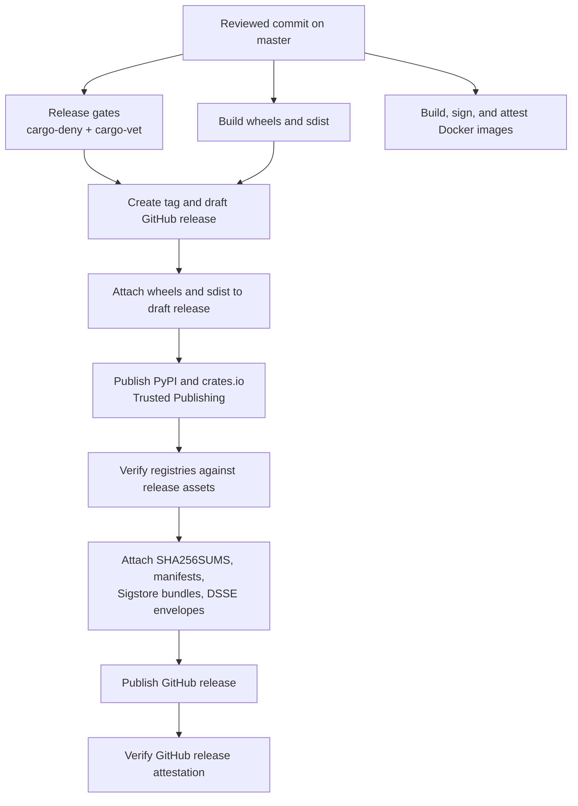

# Release Security Architecture

This page describes the security model for the NautilusTrader release pipeline.
It explains how release artifacts are built, published, attested, and verified.

Use this page with:

- [Releases](releases.md), which documents the release workflow and checklist.
- [Security Policy](https://github.com/nautechsystems/nautilus_trader/blob/develop/SECURITY.md),
  which gives consumer-facing verification commands.
- [.github/OVERVIEW.md](https://github.com/nautechsystems/nautilus_trader/blob/develop/.github/OVERVIEW.md#security),
  which documents CI/CD controls.

## Security goals

The release pipeline has four goals:

- Build every official artifact from a reviewed repository commit.
- Publish Python and Rust packages without long-lived package registry tokens.
- Attach checksums, manifests, and provenance before publishing the GitHub release.
- Give users enough public data to verify that downloaded artifacts match the release.

The GitHub release anchors package integrity. Stable releases attach wheel and
sdist assets to a draft GitHub release before any package index publish starts.
The pipeline publishes package indexes, verifies those indexes against the
GitHub release assets, attaches final integrity assets, then publishes the
GitHub release.

## Threat model

The pipeline defends against:

- Compromised or mutable third-party GitHub Actions, by pinning actions to commit SHAs.
- Accidental release from the wrong workflow, branch, or environment, by binding OIDC publishers
  to `nautechsystems/nautilus_trader`, `build.yml`, and the `release` environment.
- Long-lived package registry token theft, by using PyPI and crates.io Trusted Publishing.
- Registry propagation lag or partial re-runs, by making publish and verify scripts idempotent
  and retry-tolerant.
- Registry substitution or upload drift, by comparing PyPI and crates.io artifacts against
  release manifests and registry metadata.
- Silent manual crate recovery, by requiring explicit `CRATES_IO_MANUAL_PUBLISH_EXCEPTIONS`
  entries and recording those exceptions in `crates-manifest.json`.

The pipeline does not defend against:

- A malicious maintainer with permission to change release workflows and approve releases.
- A compromise of GitHub, PyPI, crates.io, or Sigstore that can forge the trust roots users rely on.
- A compromised end-user machine before verification runs.
- Runtime compromise of an exchange, broker, data provider, or user trading strategy.
- Bit-identical rebuild drift for wheels and sdists. The current guarantee is provenance and
  digest verification, not reproducible builds.

## Trust roots

- GitHub repository rules protect reviewed source, release branches, and release tags.
  Protected `master` and immutable `v*` release tags are the relevant records.
- GitHub Actions OIDC issuer provides short-lived workflow identities from
  `https://token.actions.githubusercontent.com`.
- GitHub `release` environment gates package publishing and release approvals.
  The environment restricts deployment to `master` and requires reviewer approval.
- PyPI Trusted Publishing publishes wheels and sdist without a persistent token.
  It binds to repository `nautechsystems/nautilus_trader`, workflow `build.yml`,
  and environment `release`.
- crates.io Trusted Publishing publishes Rust crates without a persistent token.
  It binds to owner `nautechsystems`, repository `nautilus_trader`, workflow
  `build.yml`, and environment `release`.
- Sigstore Fulcio, Rekor, and TUF bind artifacts to OIDC identities and the
  transparency log. GitHub artifact attestations, PyPI publish attestations, and
  Docker cosign signatures rely on this root.
- GitHub release immutability prevents post-publish asset and tag replacement.
  Published release assets and the release tag become immutable.

## Release flow



The Docker workflow is separate from the package release workflow, but it follows
the same identity model: image signatures and SBOM attestations bind the image
digest to the expected GitHub Actions workflow identity.

## Artifact records

- Python wheels are published to GitHub Releases, PyPI, and the Nautech Systems
  package index (`packages.nautechsystems.io`). `SHA256SUMS`, per-asset
  `.sha256` files, and `dist-manifest.json` record integrity. GitHub artifact
  attestations, PyPI publish attestations, `.sigstore` bundles, and
  `.intoto.jsonl` envelopes record provenance.
- Python sdists use the same public locations, integrity records, and provenance
  records as wheels.
- Rust crates are published to crates.io. The crates.io checksum and
  `crates-manifest.json` record integrity. crates.io `trustpub_data` records
  provenance unless an explicit manual exception is present.
- Docker images are published to GitHub Container Registry. The image digest is
  the integrity record. Sigstore cosign signatures and SPDX SBOM attestations
  record provenance.
- The GitHub release record is published through GitHub Releases. Published
  release assets and the immutable tag record integrity. The GitHub release
  attestation records provenance.

## Consumer verification map

Detailed commands live in
[Verifying releases](https://github.com/nautechsystems/nautilus_trader/blob/develop/SECURITY.md#verifying-releases).
The checks below show the public data each consumer should verify.

### Python wheels and sdist

Verify:

- The artifact digest matches `SHA256SUMS`, the per-asset `.sha256` file, or
  `dist-manifest.json`.
- The GitHub artifact attestation identity matches
  `nautechsystems/nautilus_trader/.github/workflows/build.yml` on `master` or `nightly`.
- The PyPI publish attestation reports repository `nautechsystems/nautilus_trader`,
  workflow `build.yml`, and environment `release`.

Fish-compatible example:

```fish
set -gx TAG v1.228.0
set -gx REPO nautechsystems/nautilus_trader
set -gx ARTIFACT nautilus_trader-1.228.0.tar.gz
set -gx ISSUER https://token.actions.githubusercontent.com
set -gx IDENTITY \
  '^https://github\.com/nautechsystems/nautilus_trader/\.github/workflows/build\.yml@refs/heads/(master|nightly)$'

gh release download $TAG --repo $REPO --pattern $ARTIFACT --pattern $ARTIFACT.sha256
sha256sum -c $ARTIFACT.sha256
gh attestation verify $ARTIFACT \
  --repo $REPO \
  --cert-identity-regex $IDENTITY \
  --cert-oidc-issuer $ISSUER
```

### PyPI publish provenance

Verify:

- PyPI file hashes match `dist-manifest.json`.
- PyPI provenance exposes the expected GitHub publisher identity.
- `pypi-attestations verify` accepts the downloaded file URL.

Fish-compatible example:

```fish
set -gx VERSION 1.228.0
set -gx ARTIFACT nautilus_trader-1.228.0.tar.gz
set -gx PYPI_URL (curl -sS https://pypi.org/pypi/nautilus_trader/$VERSION/json | \
  jq -r --arg artifact "$ARTIFACT" '.urls[] | select(.filename == $artifact) | .url')

uv run --no-project --no-build --with pypi-attestations -- \
  pypi-attestations verify pypi \
  --repository https://github.com/nautechsystems/nautilus_trader \
  $PYPI_URL
```

### Rust crates

Verify:

- The crates.io version checksum matches the downloaded `.crate` file.
- `trustpub_data.provider` is `github`.
- `trustpub_data.repository` is `nautechsystems/nautilus_trader`.
- `published_by` is `null`, unless `crates-manifest.json` records an explicit
  `manual_token_publish` exception.

Fish-compatible example:

```fish
set -gx CRATE nautilus-core
set -gx VERSION 0.58.0
set -gx REPO nautechsystems/nautilus_trader
set -gx VERSION_JSON (curl -sS https://crates.io/api/v1/crates/$CRATE/versions | \
  jq -c --arg version "$VERSION" '.versions[] | select(.num == $version)')
set -gx CRATE_SHA256 (printf '%s\n' "$VERSION_JSON" | jq -r '.checksum')

printf '%s\n' "$VERSION_JSON" | jq -e --arg repo "$REPO" \
  '.trustpub_data.provider == "github" and .trustpub_data.repository == $repo and .published_by == null'
curl -sSL https://static.crates.io/crates/$CRATE/$CRATE-$VERSION.crate -o $CRATE-$VERSION.crate
test (sha256sum $CRATE-$VERSION.crate | cut -d ' ' -f 1) = $CRATE_SHA256
```

### Docker images

Verify:

- The mutable tag resolves to the digest you intend to run.
- The cosign signature identity matches the Docker workflow.
- The SPDX SBOM attestation is bound to the same image digest.

Fish-compatible example:

```fish
set -gx IMAGE_BASE ghcr.io/nautechsystems/nautilus_trader
set -gx DIGEST (crane digest $IMAGE_BASE:latest)
set -gx IMAGE $IMAGE_BASE@$DIGEST
set -gx ISSUER https://token.actions.githubusercontent.com
set -gx IDENTITY \
  '^https://github\.com/nautechsystems/nautilus_trader/\.github/workflows/docker\.yml@refs/heads/(master|nightly)$'

cosign verify $IMAGE --certificate-identity-regexp $IDENTITY --certificate-oidc-issuer $ISSUER
cosign verify-attestation \
  --type https://spdx.dev/Document/v2.3 \
  $IMAGE \
  --certificate-identity-regexp $IDENTITY \
  --certificate-oidc-issuer $ISSUER
```

## Manual recovery posture

Normal releases use Trusted Publishing only. Manual package publishing is a
last-resort recovery path after a partial release.

Rules for manual recovery:

- Prefer re-running the failed job or workflow when a registry or Sigstore verifier fails.
- Do not replace a release tag or GitHub release assets after publication.
- Do not silently accept manually published crates.
- If a crate must be recovered with a token, list each `crate@version` in
  `CRATES_IO_MANUAL_PUBLISH_EXCEPTIONS`.
- Record the exception in release notes and in `crates-manifest.json` with
  `release_status: "manual_token_publish"`.

No routine release path depends on a long-lived PyPI or crates.io token.

## Incident response posture

- PyPI publisher drift is detected by the PyPI provenance verifier. Stop
  publishing, fix the PyPI Trusted Publisher, and rerun verification.
- crates.io publisher drift is detected by the trusted-publishing check or
  registry verifier. Fix crate publisher settings and rerun. Use a manual
  exception only for partial recovery.
- GitHub release asset mismatch is detected by checksum or manifest verification.
  Stop the release before publication, or publish an advisory if assets already
  shipped.
- Sigstore, Rekor, or TUF lag is detected by retryable transparency errors.
  Retry with bounded backoff, then pause release sealing if lag persists.
- Sigstore trust root concern appears when attestation verification becomes
  ambiguous. Pause releases, verify against registry records, and rotate trust
  roots when supported.
- Workflow identity mismatch is detected by GitHub, PyPI, or cosign identity
  checks. Treat it as configuration drift or compromise until reviewed.
- Manual crate publish exceptions are detected when crates.io shows
  `published_by` instead of `trustpub_data`. Record the explicit exception,
  document affected crates, and preserve the audit trail.

## SLSA posture

Python release artifacts carry build provenance through GitHub artifact attestations
and PyPI publish attestations. Docker images carry Sigstore signatures and SPDX SBOM
attestations. Rust crates rely on crates.io Trusted Publishing metadata and the
release `crates-manifest.json`.

This page does not assert a named SLSA level for all artifact classes. Any future
SLSA level claim must cite this architecture, name the artifact classes it covers,
and include CI validation that the published provenance parses as the claimed
predicate type.
