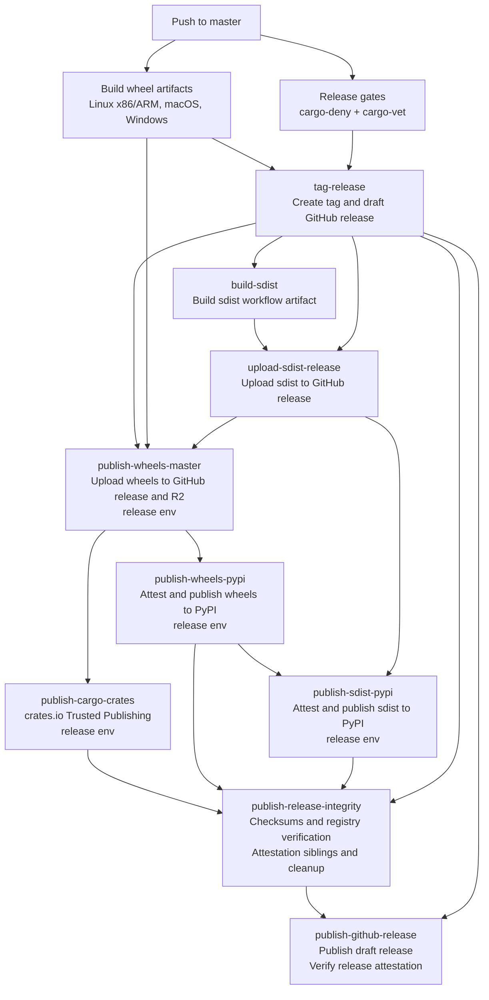

# Releases

This guide covers the release process and the standards for writing release notes.

## Overview

NautilusTrader uses a three-branch model:

- **`develop`**: active development; publishes dev wheels to Cloudflare R2 on every push.
- **`nightly`**: pre-release testing; publishes alpha wheels and CLI binaries.
- **`master`**: stable releases; triggers the full release pipeline.

Pushing to `master` automatically tags the version from `pyproject.toml`, creates a draft GitHub
release, uploads release assets, publishes Cargo crates to crates.io, publishes wheels and sdist to
PyPI, publishes the GitHub release, builds Docker images, and triggers a docs rebuild.

## Stable release workflow

The `build` workflow treats the GitHub release as the anchor for stable releases. It creates the
release as a draft first, uploads the wheel and sdist assets to that draft release, and only then
publishes those packages to package indexes. The workflow publishes the GitHub release only after
the registry verification and final integrity assets are complete.



Keep these sequencing rules intact when editing `.github/workflows/build.yml`:

- The draft GitHub release must exist before any release asset upload or package registry publish.
- Wheel and sdist assets must be attached to the GitHub release before package index publishing
  starts (`packages.nautechsystems.io`, PyPI, crates.io).
- PyPI and crates.io Trusted Publishing jobs must keep `environment: release` and
  `id-token: write`; those registrations depend on the `release` environment.
- Non-OIDC integrity and asset-upload jobs should avoid `environment: release` unless they need
  release environment secrets or approvals.
- `publish-release-integrity` must run after PyPI and crates.io publishing so it verifies the
  registries against the release manifest before attaching final integrity assets.
- `publish-github-release` must be the final stable release job. GitHub recommends creating a
  draft release, attaching all assets, then publishing the draft before enabling release
  immutability. Once GitHub release immutability is enabled for the repo, published release assets
  and the release tag cannot be changed; only the title and release notes remain editable. The job
  verifies GitHub's release attestation after publishing the draft.

## Versioning

The project maintains two version numbers:

| File                     | Scope          | Example   |
|--------------------------|----------------|-----------|
| `pyproject.toml`         | Python package | `1.223.0` |
| `Cargo.toml` (workspace) | Rust crates    | `0.55.0`  |

These are bumped independently. The Python version drives the release tag (`v1.223.0`).

## Crates.io publishing

The `build` workflow publishes Cargo crates from the `publish-cargo-crates` job. The job uses
crates.io Trusted Publishing through GitHub Actions OIDC, so it does not use a persistent cargo
token. Configure each crate on crates.io with:

| Field       | Value             |
|-------------|-------------------|
| Owner       | `nautechsystems`  |
| Repository  | `nautilus_trader` |
| Workflow    | `build.yml`       |
| Environment | `release`         |

Enable Trusted Publishing Only for crates after their trusted publisher is configured. Crates that
have never been published still need an initial manual publish before crates.io allows the trusted
publisher configuration.

Do not use `cargo publish --workspace` for CI releases. The release job runs
`scripts/ci/publish-cargo-crates.sh`, which publishes crates one at a time in dependency order,
skips versions already present on crates.io, and waits for each new version to appear in the
crates.io API and sparse index before publishing dependents. The script fails before uploading if a
publishable crate depends on a local `publish = false` crate that is absent from crates.io.
Optional local dependencies count as blockers because publishing a public feature that resolves to
an absent crate would leave that feature unusable.

Post-publish verification treats an existing crate version as `previously_published` only when
crates.io shows it was trusted-published by this repository. It still fails for user-published
crate versions, wrong trusted-publishing repositories, and checksum or sparse-index mismatches.

## Release checklist

### Pre-release (on `develop`)

- [ ] Finalize `RELEASES.md`: review all items, remove empty sections
- [ ] Ensure versions are set in `pyproject.toml` and `Cargo.toml` workspace
- [ ] Ensure crates.io Trusted Publishing is configured for every crate that CI publishes:
  `bash scripts/ci/check-crates-io-trusted-publishing.sh`
- [ ] Ensure all CI checks pass on `develop`

### Release

- [ ] Merge `develop` into `nightly`, verify nightly CI passes
- [ ] Merge `nightly` into `master`
- [ ] Verify the `build` workflow completes:
  - Wheels built for Linux x86/ARM, macOS, Windows
  - `cargo-deny` and `cargo-vet` pass
  - Tag and draft GitHub release created
  - Wheels and sdist attached to the GitHub release before package registry publishing
  - Cargo crates published to crates.io or skipped because the version already exists
  - Wheels and sdist published to PyPI
  - Release checksums, registry verification, crates manifest, and attestation siblings published
  - GitHub release published after all release assets and integrity assets are attached
- [ ] Verify the `docker` workflow completes (images built and pushed)
- [ ] Verify the `build-docs` workflow completes (docs rebuild triggered)

### Post-release (on `develop`)

- [ ] Update the release date in `RELEASES.md` for the published version
- [ ] Add horizontal separator `---` below the completed release
- [ ] Add the next version template at the top of `RELEASES.md` (see below)
- [ ] Bump `pyproject.toml` version to the next release number
- [ ] Bump crate versions in tutorial and how-to `Cargo.toml` snippets
  (`docs/concepts/rust.md`, `docs/how_to/run_rust_backtest.md`,
  `docs/how_to/run_rust_live_trading.md`)

## Release notes

This section documents the standards for writing release notes in `RELEASES.md`.

### Sections

Use the following sections in this order:

1. Enhancements
2. Breaking Changes
3. Security
4. Fixes
5. Internal Improvements
6. Documentation Updates
7. Deprecations

Omit sections that have no items for a given release.

### Enhancements

New features and user-visible improvements.

**Format**:

```markdown
- Added `subscribe_order_fills(...)` and `unsubscribe_order_fills(...)` for `Actor`
- Added BitMEX conditional orders support
- Added support for `OrderBookDepth10` requests (#2955), thanks @faysou
```

**Guidelines**:

- Start with "Added".
- Use backticks for code elements.
- Be specific about what was added, not how.

### Breaking Changes

Changes that may break existing code.

**Format**:

```markdown
- Removed `nautilus_trader.analysis.statistics` subpackage - must import from `nautilus_trader.analysis`
- Renamed `BinanceAccountType.USDT_FUTURE` to `USDT_FUTURES`
- Changed `start` parameter to required for `Actor` data request methods
```

**Guidelines**:

- Start with "Removed", "Renamed", or "Changed".
- Explain migration path briefly.

### Security

Security hardening and fixes that prevent crashes, undefined behavior, or data corruption.
Includes significant hardening improvements elevated from Internal Improvements.

**Format**:

```markdown
- Fixed non-executable stack for Cython extensions to support hardened Linux systems
- Fixed divide-by-zero and overflow bugs in model crate that could cause crashes
- Fixed core arithmetic operations to reject NaN/Infinity values and improve overflow handling
```

**Guidelines**:

- Include overflow/underflow fixes, memory safety improvements, FFI guards, data integrity fixes.
- Focus on user impact: what could have happened.
- Exclude routine dependency updates, minor hardening, or test-only fixes.
- Omit this section entirely if there are no security items for the release.

### Fixes

Bug fixes that improve correctness but don't qualify as security issues.

**Format**:

```markdown
- Fixed reduce-only order panic when quantity exceeds position
- Fixed Binance order status parsing for external orders (#3006), thanks for reporting @bmlquant
```

**Guidelines**:

- Start with "Fixed".

### Internal Improvements

Implementation details and infrastructure changes.

**Format**:

```markdown
- Added ARM64 support to Docker builds
- Ported `PortfolioAnalyzer` to Rust
- Improved clock and timer thread safety
- Upgraded Rust (MSRV) to 1.90.0
- Upgraded `pyo3` crates to v0.26.0
```

**Guidelines**:

- Use "Added", "Implemented", "Improved", "Optimized", "Upgraded", "Refined", "Standardized".
- Include version numbers for dependency upgrades.

### Documentation Updates

Changes to guides and examples.

**Format**:

```markdown
- Added rate limit tables with links to official docs
- Improved dark and light themes for readability
- Fixed broken links
```

### Deprecations

Features marked for removal.

**Format**:

```markdown
- Deprecated `some_config_option`; disable (`False`) to maintain consistent behaviour. Will be removed in future version
```

**Guidelines**:

- Explain migration path and provide alternatives.

## Attribution

- Credit external contributors: `thanks @username` or `thanks for reporting @username`.
- Include issue/PR numbers for community contributions and complex features: `(#1234)`.

## Style

- Use sentence case (capitalize first word only).
- Do not end with periods.
- Use backticks for code elements.
- Focus on **what** changed, not how.

**Be specific**:

```markdown
❌ Improved Binance adapter
✅ Improved Binance fill handling when instrument not cached
```

## Security classification

Include in Security if the change addresses:

- Memory safety (overflow, underflow, divide-by-zero that threatens stability).
- Undefined behavior or crashes that could corrupt state.
- Data integrity (NaN/Infinity propagation, race conditions leading to corruption).
- Input validation preventing injection or exploitation (SQL injection, command injection, path traversal).
- Build hardening (non-exec stack, FFI guards).
- Significant hardening that users should know about.

Otherwise use Fixes (for logic bugs and panics) or Internal Improvements (for minor hardening).

Note: Plain logic panics belong in Fixes unless they threaten system stability or data corruption.

## Examples

**Security** (could cause crashes/corruption):

```markdown
- Fixed divide-by-zero in margin calculations that could crash the engine
- Fixed non-executable stack for Cython extensions to support hardened systems
```

**Fixes** (incorrect but safe):

```markdown
- Fixed Binance order status parsing for external orders
- Fixed position purge logic to prevent purging re-opened position
```

**Enhancements** (user-facing):

```markdown
- Added BitMEX conditional orders support
```

**Internal** (implementation):

```markdown
- Implemented BitMEX ping/pong handling
```

## Release notes template

```markdown
# NautilusTrader <VERSION> Beta

Released on TBD (UTC).

### Enhancements

### Breaking Changes

### Security

### Fixes

### Internal Improvements

### Documentation Updates

### Deprecations

---
```
