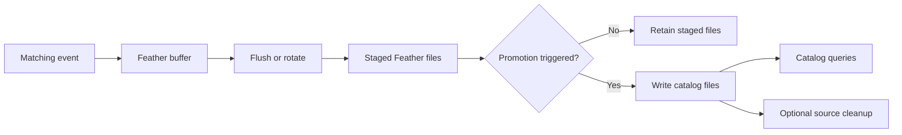

# Stream Data Into a Parquet Catalog

Use the Parquet streaming writer to stage live or backtest records in Feather and promote them into
queryable catalog files. Direct `ParquetDataCatalog.write_*` calls write catalog data without this
staging lifecycle.

## Configure the writer

Select `Parquet` explicitly. `Feather` stages records for manual conversion; it does not automatically
promote them into a catalog.

```python
from nautilus_trader.config import BacktestEngineConfig
from nautilus_trader.persistence import StreamingConfig

streaming = StreamingConfig(
    catalog_path="./catalog",
    writer_backend="Parquet",
    params={
        "parquet_commit_interval_ms": 5_000,
        "promote_on_close": True,
        "delete_feather_after_commit": False,
    },
)
engine_config = BacktestEngineConfig(streaming=streaming)
```

Pass `engine_config` as the `engine` argument to `BacktestRunConfig`. The runtime owns the sink and closes it at
shutdown. Run data stages under `<catalog_path>/<backtest|sandbox|live>/<instance_id>`; the catalog
root contains the promoted data used by queries.

| Setting                       | Default | Meaning                                                |
| ----------------------------- | ------- | ------------------------------------------------------ |
| `parquet_commit_interval_ms`  | Unset   | No interval-based promotion; zero also disables it.    |
| `promote_on_close`            | `true`  | Promote staged files when the sink closes.             |
| `delete_feather_after_commit` | `false` | Retain source Feather files after a successful commit. |
| `use_ts_event_for_ts_init`    | `false` | Preserve initialization timestamps during promotion.   |

These are Parquet writer defaults. They are independent of defaults for other writer backends.

## Understand query visibility

The shared writer core owns filtering, Feather buffering, rotation, and promotion scheduling.
The Parquet backend converts sealed files and records replay identities for completed promotions.



A staging flush makes buffered records available for promotion; it does not promise immediate catalog
visibility. With no commit interval, records remain staged until close-time promotion or manual
conversion. Queries see the records after promotion succeeds.

A positive interval starts a wall-clock promotion timer for a live clock, including quiet periods.
Backtests use their supplied test clock and check the interval during write or flush operations;
advancing simulated time alone does not start an independent live timer. A flush can trigger promotion
when that interval is due. Closing waits for pending work and, by default, promotes remaining records.

## Retain and recover staged files

Keep `delete_feather_after_commit=False` to retain the Feather source after successful promotion.
Enable it only when source cleanup is desired. Cleanup follows a successful commit; it is separate
from making catalog data queryable. Promotion identities prevent a repeated completed source from
being imported again.

Use explicit close and handle its error. Dropping a writer only provides best-effort cleanup and is
not evidence of successful promotion. If a promotion fails, preserve its staged files and investigate
the error before retrying. With `promote_on_close=False`, closing can intentionally leave a completed
run staged for later conversion through `ParquetDataCatalog.convert_stream_to_data()`.

Parquet promotion can write multiple destination files. It does not provide the snapshot transaction
or historical query pin of a transactional catalog backend. Coordinate readers if an application
requires all files from a promotion to become visible together.

See the [catalog guide](../concepts/data/index.md#data-catalog) for query and storage behavior and
[Parquet migration](migrate_parquet_catalog.md) for importing older catalogs.
