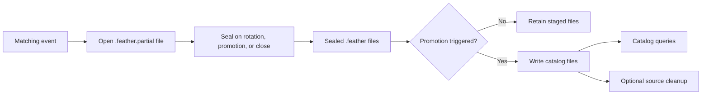

# Stream Data Into a Parquet Catalog

Use the Parquet streaming writer to stage live or backtest records in Feather and promote them into
queryable catalog files. Direct `ParquetDataCatalog.write_*` calls write catalog data without this
staging lifecycle.

## Configure the writer

Give `StreamingConfig` a local `writer_path` for the Feather files and a `catalog` to promote them
into. Without a `catalog`, the writer keeps only the Feather files for manual conversion.

```python
from nautilus_trader.config import BacktestEngineConfig
from nautilus_trader.persistence import DataCatalogConfig
from nautilus_trader.persistence import StreamingConfig

streaming = StreamingConfig(
    writer_path="./stream",
    catalog=DataCatalogConfig(path="./catalog"),
    promotion_interval_ms=5_000,
    promote_on_close=True,
    delete_feather_after_promotion=False,
)
engine_config = BacktestEngineConfig(streaming=streaming)
```

Pass `engine_config` as the `engine` argument to `BacktestRunConfig`. The runtime owns the sink: a backtest closes it
when the run ends, and a live node flushes it on stop and closes it on dispose, so events processed during shutdown are
still staged. Run data stages under `<writer_path>/<backtest|sandbox|live>/<instance_id>`, which must be
local because the writer appends to open files. The catalog holds the promoted data used by queries
and can be local or remote, such as `DataCatalogConfig(path="bucket/catalog", fs_protocol="s3")`.
The catalog's `catalog_backend` selects the writer that promotes into it. The Parquet writer
creates a missing local catalog directory.

| Setting                          | Default | Meaning                                                   |
| -------------------------------- | ------- | --------------------------------------------------------- |
| `promotion_interval_ms`          | Unset   | No interval-based promotion; must be positive when set.   |
| `promote_on_close`               | `true`  | Promote staged files when the sink closes.                |
| `delete_feather_after_promotion` | `false` | Retain source Feather files after a successful promotion. |
| `use_ts_event_for_ts_init`       | `false` | Preserve initialization timestamps during promotion.      |

The runtime validates the config before it opens the writer. Without a `catalog`,
`promotion_interval_ms` must be unset, and `delete_feather_after_promotion` and
`use_ts_event_for_ts_init` must be false.

To stage runs inside the catalog directory, set `writer_path` and the catalog `path` to the same
local directory. `ParquetDataCatalog.convert_stream_to_data()` writes into the catalog it is opened
on, so manual conversion of a run staged elsewhere writes into a catalog opened at `writer_path`.

### Rotate files

`rotation_config` seals a type's open file and starts a new one by size, by interval, or on a
schedule. The default, `RotationConfig.no_rotation()`, seals files only for promotion and close.

```python
from nautilus_trader.persistence import RotationConfig

RotationConfig.size(1_073_741_824)
RotationConfig.interval(3_600_000_000_000)
RotationConfig.scheduled_dates(
    86_400_000_000_000,
    1_800_000_000_000,
    timezone="America/New_York",
)
```

`scheduled_dates` takes an interval duration in nanoseconds and a time of day in nanoseconds since
midnight, in its IANA `timezone`, which defaults to `UTC`. Sizes and intervals must be positive.

## Understand query visibility

The shared writer core owns filtering, Feather file appends, rotation, and promotion scheduling.
The Parquet backend converts sealed files and records replay identities for completed promotions.


```mermaid
flowchart LR
    Event[Matching event] --> Open[Open .feather.partial file]
    Open --> Seal[Seal on rotation, promotion, or close]
    Seal --> Stage[Sealed .feather files]
    Stage --> Trigger{Promotion triggered?}
    Trigger -->|No| Retain[Retain staged files]
    Trigger -->|Yes| Commit[Write catalog files]
    Commit --> Query[Catalog queries]
    Commit --> Cleanup[Optional source cleanup]
```

Each data or record type stages one open file under the run folder, and instruments stage one file
per instrument class. Rows of every identifier share their type's file and carry an `identifier`
column, which promotion uses to write each identifier's catalog directory. Promotion then drops the
column, so promoted files have the same schema as files written directly to the catalog.

A flush appends the records buffered since the previous flush to the open file as one Arrow record
batch, without starting a new file. Promotion first seals the open files, so each promotion takes the
records written so far; it does not promise immediate catalog visibility. With no promotion interval,
records remain staged until close-time promotion or manual conversion. Queries see the records after
promotion succeeds.

A positive interval starts a wall-clock promotion timer for a live clock, including quiet periods.
Backtests use their supplied test clock and check the interval during write or flush operations;
advancing simulated time alone does not start an independent live timer. A flush can trigger promotion
when that interval is due. Closing waits for pending work and, by default, promotes remaining records.

## Retain and recover staged files

Keep `delete_feather_after_promotion=False` to retain the Feather source after successful promotion.
Enable it only when source cleanup is desired. Cleanup follows a successful commit; it is separate
from making catalog data queryable. Promotion identities prevent a repeated completed source from
being imported again.

Use explicit close and handle its error. Dropping a writer only provides best-effort cleanup and is
not evidence of successful promotion. If a promotion fails, preserve its staged files and investigate
the error before retrying. With `promote_on_close=False`, closing can intentionally leave a completed
run staged for later conversion through `ParquetDataCatalog.convert_stream_to_data()`. Pass the
run's `environment`, such as `Environment.LIVE`, to convert a run outside the default backtest
folder.

A writer holds an exclusive lock on each `.feather.partial` file until it seals the file, so a
crashed process leaves its open files unlocked. Recovery seals each unlocked partial file: it keeps
the complete record batches, drops any bytes after them with a warning, and renames the file to
`.feather`. It removes a partial file that has no complete record batch and leaves an empty one in
place. A read error other than a write cut short leaves the file for a later recovery pass.

Recovery runs when a streaming writer starts on the run folder, and when
`ParquetDataCatalog.read_backtest()`, `read_live_run()`, or `convert_stream_to_data()` reads the
run. A writer that gives up on a file after a failed append, flush, or seal tries to recover it at
once, so promotion includes the record batches that reached the file. When that recovery fails,
the writer logs the error and leaves the partial file for a later recovery pass.

Parquet promotion can write multiple destination files. It does not provide the snapshot transaction
or historical query pin of a transactional catalog backend. Coordinate readers if an application
requires all files from a promotion to become visible together.

### Overlapping schema-group intervals

Promotion groups restored Feather batches by identifier and by schema, including precision metadata.
Groups are split by schema rather than by time, so two groups for one identifier can share a
`ts_init` interval. One
Feather file produces two such groups when its records differ in schema, for example an empty order
book depth staged alongside a populated one for the same instrument. The catalog filename also
carries a hash of the promotion identity.

The catalog requires disjoint closed `ts_init` intervals per identifier directory. Before writing one
Feather file, promotion unifies groups whose precision metadata differs only by a zero precision and
whose zero-precision group has no decimal values, and writes one file for the combined interval.
Groups that still overlap, or that cannot be unified without changing decimal values, fail before
any catalog file from that Feather source is written. The staged Feather source is retained, and no
promotion identity is recorded for that source. Automatic promotion and
`ParquetDataCatalog.convert_stream_to_data()` plan each Feather file the same way. A storage error
after that check, or a later Feather file in the same run, can still leave files already written;
promotion is not a snapshot transaction. A repeated promotion of a file that was already written is
skipped.

See the [catalog guide](../concepts/data/catalog.md) for query and storage behavior and
[Parquet migration](migrate_parquet_catalog.md) for importing older catalogs.
