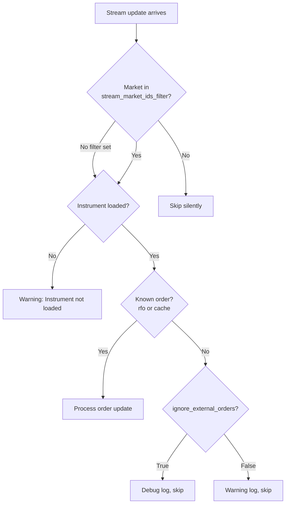

# Betfair

Founded in 2000, Betfair operates the world’s largest online betting exchange,
with its headquarters in London and satellite offices across the globe.

NautilusTrader provides an adapter for integrating with the Betfair REST API and
Exchange Streaming API.

## Installation

Install NautilusTrader with Betfair support:

```bash
uv pip install "nautilus_trader[betfair]"
```

To build from source with Betfair extras:

```bash
uv sync --all-extras
```

## Examples

You can find live example scripts [here](https://github.com/nautechsystems/nautilus_trader/tree/develop/examples/live/betfair/).

## Betfair documentation

Betfair provides documentation for developers:

- [Betfair Developer Portal](https://developer.betfair.com/): Main entry point for API access and documentation.
- [Exchange API Guide](https://developer.betfair.com/exchange-api/): Overview of the Betting, Accounts, and Streaming APIs.

## Application keys

Betfair requires an Application Key to authenticate API requests. After registering and funding your account,
obtain your key using the [API-NG Developer AppKeys Tool](https://apps.betfair.com/visualisers/api-ng-account-operations/).

Two App Keys are assigned per account: a **Live** key (requires a one-time activation fee) and a
**Delayed** key for development and testing.

:::info
See the [Application Keys](https://betfair-developer-docs.atlassian.net/wiki/spaces/1smk3cen4v3lu3yomq5qye0ni/pages/2687105/Application+Keys) documentation for detailed setup instructions.
:::

## API credentials

Supply your Betfair credentials via environment variables or client configuration:

```bash
export BETFAIR_USERNAME=<your_username>
export BETFAIR_PASSWORD=<your_password>
export BETFAIR_APP_KEY=<your_app_key>
export BETFAIR_CERTS_DIR=<path_to_certificate_dir>
```

:::tip
We recommend using environment variables to manage your credentials.
:::

## SSL Certificates

Betfair recommends [non-interactive (bot) login](https://betfair-developer-docs.atlassian.net/wiki/spaces/1smk3cen4v3lu3yomq5qye0ni/pages/2687915/Non-Interactive+bot+login)
with SSL certificates for automated trading systems. The `certs_dir` configuration is optional,
but certificates are recommended for production deployments.

### Generating certificates

Create a 2048-bit RSA certificate using OpenSSL:

```bash
# Generate private key and certificate signing request
openssl genrsa -out client-2048.key 2048
openssl req -new -key client-2048.key -out client-2048.csr

# Self-sign the certificate (valid for 365 days)
openssl x509 -req -days 365 -in client-2048.csr -signkey client-2048.key -out client-2048.crt
```

### Uploading to Betfair

Before using the certificate, attach it to your Betfair account:

1. Navigate to [My Betfair Account Security](https://myaccount.betfair.com/accountdetails/mysecurity?showAPI=1).
2. Scroll to **Automated Betting Program Access** and click **Edit**.
3. Upload your `client-2048.crt` file.

### Directory structure

Place your certificate files in a directory and set `BETFAIR_CERTS_DIR` to that path:

```
/path/to/certs/
├── client-2048.crt
└── client-2048.key
```

:::info
SSL certificates are used for the Exchange Streaming API connection. The REST API uses
username/password authentication with your Application Key.
:::

:::warning
Enabling 2-Step Authentication on the Betfair website does not affect API access.
Certificate-based login remains functional regardless of 2FA settings.
:::

## Overview

The Betfair adapter provides three primary components:

- `BetfairInstrumentProvider`: loads Betfair markets and converts them into Nautilus instruments.
- `BetfairDataClient`: streams real-time market data from the Exchange Streaming API.
- `BetfairExecutionClient`: submits orders (bets) and tracks execution status via the REST API.

## Orders capability

Betfair operates as a betting exchange with unique characteristics compared to traditional financial exchanges:

### Order types

| Order Type             | Supported | Notes                               |
|------------------------|-----------|-------------------------------------|
| `MARKET`               | -         | Not applicable to betting exchange. |
| `LIMIT`                | ✓         | Orders placed at specific odds.     |
| `STOP_MARKET`          | -         | *Not supported*.                    |
| `STOP_LIMIT`           | -         | *Not supported*.                    |
| `MARKET_IF_TOUCHED`    | -         | *Not supported*.                    |
| `LIMIT_IF_TOUCHED`     | -         | *Not supported*.                    |
| `TRAILING_STOP_MARKET` | -         | *Not supported*.                    |

### Execution instructions

| Instruction   | Supported | Notes                               |
|---------------|-----------|-------------------------------------|
| `post_only`   | -         | Not applicable to betting exchange. |
| `reduce_only` | -         | Not applicable to betting exchange. |

### Time in force options

| Time in force | Supported | Notes                                      |
|---------------|-----------|--------------------------------------------|
| `GTC`         | ✓         | Maps to Betfair `PERSIST` persistence.     |
| `GTD`         | -         | *Not supported*.                           |
| `DAY`         | ✓         | Maps to Betfair `LAPSE` persistence.       |
| `FOK`         | ✓         | Maps to Betfair `FILL_OR_KILL`.            |
| `IOC`         | ✓         | Maps to `FILL_OR_KILL` with partial fills. |

:::note
Betfair uses a persistence model rather than traditional time-in-force. The adapter maps `FOK` to
Betfair's `FILL_OR_KILL`, while `IOC` uses `FILL_OR_KILL` with `min_fill_size=0` to allow partial fills.
:::

### Advanced order features

| Feature            | Supported | Notes                                    |
|--------------------|-----------|------------------------------------------|
| Order Modification | ✓         | Limited to non-exposure changing fields. |
| Bracket/OCO Orders | -         | *Not supported*.                         |
| Iceberg Orders     | -         | *Not supported*.                         |

### Batch operations

| Operation          | Supported | Notes                |
|--------------------|-----------|----------------------|
| Batch Submit       | -         | *Not supported*.     |
| Batch Modify       | -         | *Not supported*.     |
| Batch Cancel       | -         | *Not supported*.     |

### Position management

| Feature             | Supported | Notes                                   |
|---------------------|-----------|-----------------------------------------|
| Query positions     | -         | Betting exchange model differs.         |
| Position mode       | -         | Not applicable to betting exchange.     |
| Leverage control    | -         | No leverage in betting exchange.        |
| Margin mode         | -         | No margin in betting exchange.          |

### Order querying

| Feature              | Supported | Notes                                  |
|----------------------|-----------|----------------------------------------|
| Query open orders    | ✓         | List all active bets.                  |
| Query order history  | ✓         | Historical betting data.               |
| Order status updates | ✓         | Real-time bet state changes.           |
| Trade history        | ✓         | Bet matching and settlement reports.   |

### Contingent orders

| Feature             | Supported | Notes                                   |
|---------------------|-----------|-----------------------------------------|
| Order lists         | -         | *Not supported*.                        |
| OCO orders          | -         | *Not supported*.                        |
| Bracket orders      | -         | *Not supported*.                        |
| Conditional orders  | -         | Basic bet conditions only.              |

## Tick scheme and pricing

Betfair uses a tiered tick scheme with varying increments across price ranges:

| Price Range   | Tick Size |
|---------------|-----------|
| 1.01 - 2.00   | 0.01      |
| 2.00 - 3.00   | 0.02      |
| 3.00 - 4.00   | 0.05      |
| 4.00 - 6.00   | 0.10      |
| 6.00 - 10.00  | 0.20      |
| 10.00 - 20.00 | 0.50      |
| 20.00 - 30.00 | 1.00      |
| 30.00 - 50.00 | 2.00      |
| 50.00 - 100.00 | 5.00     |
| 100.00 - 1000.00 | 10.00  |

The minimum price is 1.01 and the maximum is 1000.00.

## Order modification

Order modification on Betfair has specific constraints:

- **Price and size cannot be changed atomically** - these require separate operations.
- **Price modification** uses `ReplaceOrders` (cancel + new order at new price).
- **Size reduction** uses `CancelOrders` with a `size_reduction` parameter.
- **Size increase** is not supported - submit a new order instead.

:::warning
A replace operation generates both a cancel event for the original order and an accepted event
for the replacement order. The adapter tracks pending replacements to suppress synthetic cancel events.
:::

## Order stream fill handling

The execution client processes order updates from the Betfair Exchange Streaming API.
Two configuration options control how updates are filtered:

- **`stream_market_ids_filter`**: Filters at the market level (early exit, silent skip).
- **`ignore_external_orders`**: Filters at the order level (controls warning vs debug logging).

Note that `stream_market_ids_filter` is independent of reconciliation scope (`reconcile_market_ids_only`).
Stream filtering affects live updates only; reconciliation uses its own market filter.



The same `stream_market_ids_filter` is also applied during full-image reconciliation in `check_cache_against_order_image`.

When `ignore_external_orders=True`, the client silently skips orders and fills not found in cache:

| Scenario                       | Description                                         |
|--------------------------------|-----------------------------------------------------|
| Unknown order in stream update | No venue-to-client order ID mapping exists.         |
| Unknown order in full image    | Order not found in cache during image sync.         |
| Unknown fill in full image     | Fill does not match any known order during sync.    |

:::info
For multi-node setups sharing a Betfair account, set both `stream_market_ids_filter` (your markets only)
and `ignore_external_orders=True` to avoid warnings about orders managed by other nodes.
:::

### Fill handling

The adapter handles several edge cases when processing fills from the stream:

- **Incremental fills**: Betfair reports cumulative matched sizes. The adapter calculates incremental
  fills by tracking the last known filled quantity per order.
- **Overfill protection**: Fills that would exceed the order quantity are rejected.
- **Deduplication**: A cache of published trade IDs prevents duplicate fill events from late messages
  or stream reconnection replays.
- **Race conditions**: When stream fills arrive before the HTTP order response, the adapter caches
  the venue order ID immediately to ensure correct order matching.
- **Network error recovery**: When an HTTP order submission fails with a network error (timeout,
  connection reset), the order may still have been placed on the venue. The adapter leaves the
  order in SUBMITTED status and retains the customer order reference so the stream can confirm
  the order when it reconnects. API errors (where Betfair explicitly rejected) still reject
  immediately.

## Rate limiting

The adapter uses separate rate limit buckets so that account state polling and
reconciliation do not throttle order placement:

| Bucket  | Default | Endpoints                                            | Configurable                     |
|---------|---------|------------------------------------------------------|----------------------------------|
| General | 5/s     | Account state, reconciliation, keep-alive.           |                                  |
| Orders  | 20/s    | `placeOrders`, `replaceOrders`, `cancelOrders`.      | `order_request_rate_per_second`. |

Order status and fill report queries retry once on `TOO_MANY_REQUESTS` errors
after a 1-second delay; order operations reject with the error message.

Betfair's actual API limits are more nuanced:

| Category                 | Limit                | Notes                                                |
|--------------------------|----------------------|------------------------------------------------------|
| Order operations         | 1,000 transactions/s | Total instructions across `placeOrders`, `cancelOrders`, `replaceOrders`. |
| Order projection queries | 3 concurrent         | `listMarketBook` (with `OrderProjection`), `listCurrentOrders`, `listMarketProfitAndLoss`. |
| Best practice            | 5 requests/s         | Recommended for `listMarketBook` per market.         |

:::info
For details on rate limits, see [Why am I receiving the TOO_MANY_REQUESTS error?](https://support.developer.betfair.com/hc/en-us/articles/360000406111)
and [Market Data Request Limits](https://docs.developer.betfair.com/display/1smk3cen4v3lu3yomq5qye0ni/Market+Data+Request+Limits).
:::

## Custom data types

The Betfair adapter provides several custom data types that flow through the market stream.
All custom data is delivered automatically when subscribed to markets - no explicit subscription is required,
though strategies can register handlers for specific data types.

### BetfairTicker

Real-time ticker data for a betting selection.

| Field                 | Type    | Description                     |
|-----------------------|---------|---------------------------------|
| `instrument_id`       | str     | Nautilus instrument identifier. |
| `last_traded_price`   | float   | Last matched price (odds).      |
| `traded_volume`       | float   | Total matched volume.           |
| `starting_price_near` | float   | Near-side BSP indicator.        |
| `starting_price_far`  | float   | Far-side BSP indicator.         |

### BetfairStartingPrice

The realized Betfair Starting Price (BSP) after market close.

| Field           | Type  | Description                     |
|-----------------|-------|---------------------------------|
| `instrument_id` | str   | Nautilus instrument identifier. |
| `bsp`           | float | Final starting price (odds).    |

### BetfairRaceRunnerData

Live GPS tracking data for individual horses (Total Performance Data).
Available for supported UK and Irish races.

| Field              | Type  | Description                             |
|--------------------|-------|-----------------------------------------|
| `race_id`          | str   | Betfair race identifier.                |
| `market_id`        | str   | Betfair market identifier.              |
| `selection_id`     | int   | Betfair selection (runner) identifier.  |
| `latitude`         | float | GPS latitude.                           |
| `longitude`        | float | GPS longitude.                          |
| `speed`            | float | Current speed in m/s (Doppler-derived). |
| `progress`         | float | Distance to finish line in meters.      |
| `stride_frequency` | float | Stride frequency in Hz.                 |

### BetfairRaceProgress

Race summary data with sectional times and running order.

| Field            | Type       | Description                                   |
|------------------|------------|-----------------------------------------------|
| `race_id`        | str        | Betfair race identifier.                      |
| `market_id`      | str        | Betfair market identifier.                    |
| `gate_name`      | str        | Timing gate (e.g., "1f", "2f", "Finish").     |
| `sectional_time` | float      | Time for this section in seconds.             |
| `running_time`   | float      | Total time since race start in seconds.       |
| `speed`          | float      | Lead horse speed in m/s.                      |
| `progress`       | float      | Lead horse distance to finish in meters.      |
| `order`          | list[int]  | Selection IDs in current race position order. |
| `jumps`          | list[dict] | Jump obstacle data for National Hunt races.   |

### Subscribing to custom data

Custom data flows automatically through the Betfair market stream when you subscribe to markets.
To receive custom data in your strategy or actor, register a handler with the Betfair client ID:

```python
from nautilus_trader.adapters.betfair.constants import BETFAIR_CLIENT_ID
from nautilus_trader.adapters.betfair.data_types import BetfairRaceRunnerData
from nautilus_trader.adapters.betfair.data_types import BetfairRaceProgress
from nautilus_trader.adapters.betfair.data_types import BetfairTicker
from nautilus_trader.model.data import DataType

class MyStrategy(Strategy):
    def on_start(self):
        # Subscribe to ticker data
        self.subscribe_data(DataType(BetfairTicker), client_id=BETFAIR_CLIENT_ID)

        # Subscribe to ALL race runner data (wildcard)
        self.subscribe_data(DataType(BetfairRaceRunnerData), client_id=BETFAIR_CLIENT_ID)

        # Or subscribe to a specific runner by selection_id
        self.subscribe_data(
            DataType(BetfairRaceRunnerData, metadata={"selection_id": 49411491}),
            client_id=BETFAIR_CLIENT_ID,
        )

        # Subscribe to ALL race progress updates (wildcard)
        self.subscribe_data(DataType(BetfairRaceProgress), client_id=BETFAIR_CLIENT_ID)

        # Or subscribe to a specific race by race_id
        self.subscribe_data(
            DataType(BetfairRaceProgress, metadata={"race_id": "35278018.1617"}),
            client_id=BETFAIR_CLIENT_ID,
        )

    def on_data(self, data):
        if isinstance(data, BetfairRaceRunnerData):
            self.log.info(
                f"Runner {data.selection_id}: speed={data.speed} m/s, "
                f"progress={data.progress}m to finish"
            )
        elif isinstance(data, BetfairRaceProgress):
            self.log.info(f"Race order: {data.order}")
        elif isinstance(data, BetfairTicker):
            self.log.info(f"LTP: {data.last_traded_price}")
```

:::info
Subscribing with `DataType(BetfairRaceRunnerData)` (no metadata) receives data for
**all** runners. Adding `metadata={"selection_id": <id>}` filters to a specific runner.
Similarly, `DataType(BetfairRaceProgress)` receives progress for all races, while
`metadata={"race_id": <id>}` filters to a specific race.

Race data (RCM messages) requires Total Performance Data (TPD) coverage and a Betfair
API key with TPD access. Not all races have GPS tracking enabled.
:::

### Loading race data from files

For backtesting with recorded race data, use the file parser:

```python
from nautilus_trader.adapters.betfair.parsing.core import parse_betfair_rcm_file

for data in parse_betfair_rcm_file("path/to/rcm_data.json"):
    if isinstance(data, BetfairRaceRunnerData):
        print(f"Runner {data.selection_id} at {data.latitude}, {data.longitude}")
```

## Configuration

### Data client configuration options

| Option                    | Default   | Description |
|---------------------------|-----------|-------------|
| `account_currency`        | Required  | Betfair account currency for data and price feeds. |
| `username`                | `None`    | Betfair account username; taken from environment when omitted. |
| `password`                | `None`    | Betfair account password; taken from environment when omitted. |
| `app_key`                 | `None`    | Betfair application key used for API authentication. |
| `certs_dir`               | `None`    | Directory containing Betfair SSL certificates for login. |
| `instrument_config`       | `None`    | Optional `BetfairInstrumentProviderConfig` to scope available markets. |
| `subscription_delay_secs` | `3`       | Delay (seconds) before initial market subscription request is sent. |
| `keep_alive_secs`         | `36,000`  | Keep-alive interval (seconds) for the Betfair session. |
| `subscribe_race_data`     | `False`   | When `True`, subscribe to Race Change Messages (RCM) for live GPS tracking data. |
| `stream_conflate_ms`      | `None`    | Explicit stream conflation interval in milliseconds (`0` disables conflation). |
| `stream_heartbeat_ms`     | `5,000`    | Stream heartbeat interval in milliseconds (500-5000). `None` to omit. |
| `proxy_url`               | `None`    | Optional proxy URL for HTTP requests. |

:::warning
When `stream_conflate_ms` is `None`, Betfair applies its default conflation behavior (typically enabled).
Set `stream_conflate_ms=0` explicitly to guarantee no conflation and receive every price update.
:::

### Execution client configuration options

| Option                       | Default  | Description |
|------------------------------|----------|-------------|
| `account_currency`           | Required | Betfair account currency for order placement and balances. |
| `username`                   | `None`   | Betfair account username; taken from environment when omitted. |
| `password`                   | `None`   | Betfair account password; taken from environment when omitted. |
| `app_key`                    | `None`   | Betfair application key used for API authentication. |
| `certs_dir`                  | `None`   | Directory containing Betfair SSL certificates for login. |
| `instrument_config`          | `None`   | Optional `BetfairInstrumentProviderConfig` to scope reconciliation. |
| `calculate_account_state`    | `True`   | Calculate account state locally from events when `True`. |
| `request_account_state_secs` | `300`    | Interval (seconds) to poll Betfair for account state (`0` disables). |
| `reconcile_market_ids_only`  | `False`  | When `True`, reconciliation only covers `instrument_config.market_ids` (no effect if unset). |
| `stream_market_ids_filter`   | `None`   | List of market IDs to process from stream; others are silently skipped. |
| `ignore_external_orders`     | `False`  | When `True`, ignore stream orders missing from the local cache. |
| `use_market_version`         | `False`  | When `True`, attach the latest market version to order requests for price protection. |
| `order_request_rate_per_second` | `20`  | Rate limit (requests/second) for order endpoints, separate from general API endpoints. |
| `stream_heartbeat_ms`        | `5,000`   | Order stream heartbeat interval in milliseconds (500-5000). `None` to omit. |
| `proxy_url`                  | `None`   | Optional proxy URL for HTTP requests. |

:::warning
If you set `stream_market_ids_filter`, ensure it includes all markets you trade. Orders placed on
markets excluded from this filter will miss live fill and cancel updates from the stream.
:::

## Session management

Betfair sessions typically expire every 12-24 hours. The adapter automatically handles session
reconnection when `NO_SESSION` or `INVALID_SESSION_INFORMATION` errors occur:

- The HTTP client reconnects and obtains a new session token.
- The streaming client re-authenticates and resubscribes to markets.
- The keep-alive mechanism (`keep_alive_secs`, default 10 hours) proactively extends sessions.

:::info
Session errors during account state polling or keep-alive trigger automatic reconnection.
No manual intervention is required for normal session expiry.
:::

## Market version price protection

Betfair markets have a `version` number that increments whenever the market book changes
(e.g., a new price level appears, a bet is matched). The adapter can attach this version
to `placeOrders` and `replaceOrders` requests, providing price protection against stale orders.

When `use_market_version=True`, each order request includes the market version last seen
by the adapter. If the market has advanced beyond that version by the time Betfair processes
the order, Betfair **lapses** the bet rather than matching it against a changed book.

```python
from nautilus_trader.adapters.betfair.config import BetfairExecClientConfig

exec_config = BetfairExecClientConfig(
    account_currency="GBP",
    use_market_version=True,
)
```

The adapter reads the market version from the instrument's `info` dictionary, which
the Exchange Streaming API's `MarketDefinition` updates populate. This means:

- The version reflects the most recent stream update, not the HTTP API snapshot.
- There is inherent latency between a market change and the adapter receiving the updated version.
- Orders submitted before the first stream `MarketDefinition` is received will not include a version.

:::warning
Market version protection is conservative. In fast-moving markets, the version may advance
between your order signal and submission, causing the bet to lapse even though the price
is still acceptable. Consider this trade-off between protection and fill rate.
:::

## Multi-node deployment

When multiple trading nodes share a single Betfair account across different markets, configure
each node to avoid interference:

1. Set `stream_market_ids_filter` to include only that node's markets.
2. Set `ignore_external_orders=True` to suppress warnings about orders from other nodes.
3. Set `reconcile_market_ids_only=True` to limit reconciliation scope.

This prevents warning spam and ensures each node processes only its own orders and fills.

Here is a minimal example showing how to configure a live `TradingNode` with Betfair clients:

```python
from nautilus_trader.adapters.betfair import BETFAIR
from nautilus_trader.adapters.betfair import BetfairLiveDataClientFactory
from nautilus_trader.adapters.betfair import BetfairLiveExecClientFactory
from nautilus_trader.config import TradingNodeConfig
from nautilus_trader.live.node import TradingNode

# Configure Betfair data and execution clients (using AUD account currency)
config = TradingNodeConfig(
    data_clients={BETFAIR: {"account_currency": "AUD"}},
    exec_clients={BETFAIR: {"account_currency": "AUD"}},
)

# Build the TradingNode with Betfair adapter factories
node = TradingNode(config)
node.add_data_client_factory(BETFAIR, BetfairLiveDataClientFactory)
node.add_exec_client_factory(BETFAIR, BetfairLiveExecClientFactory)
node.build()
```

## Contributing

:::info
For additional features or to contribute to the Betfair adapter, please see our
[contributing guide](https://github.com/nautechsystems/nautilus_trader/blob/develop/CONTRIBUTING.md).
:::
