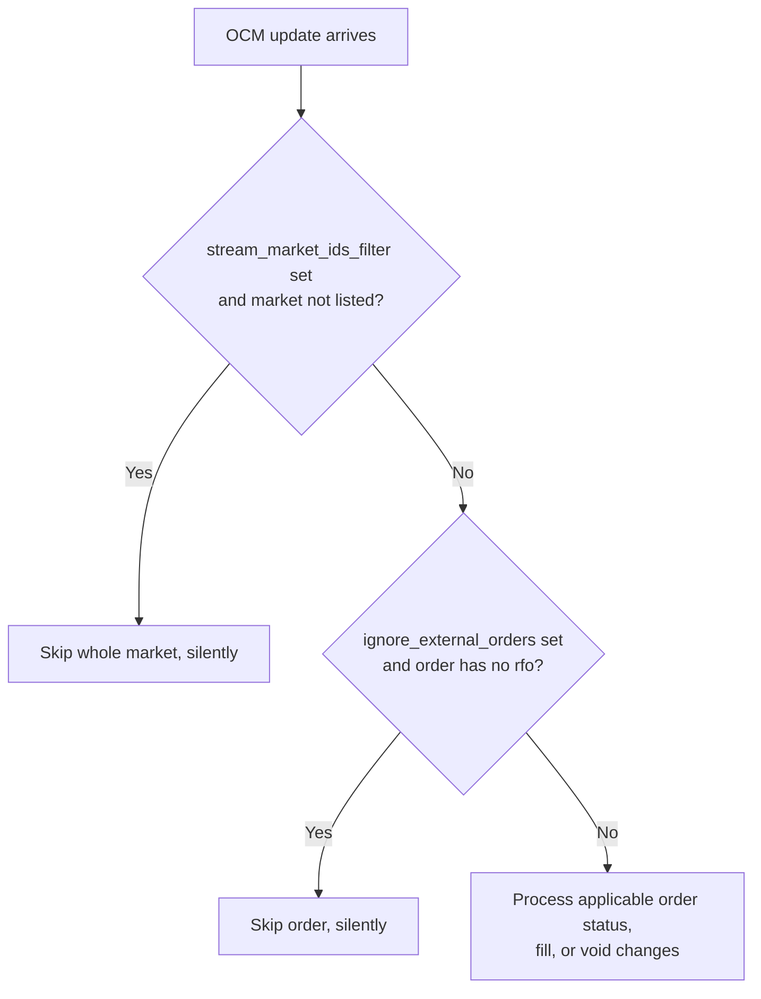

# Betfair

Founded in 2000, Betfair operates the world's largest online betting exchange. This integration
supports instrument discovery, live market data, account state, order management, and execution
updates through the Betfair Betting, Accounts, and Exchange Streaming APIs.

The adapter is implemented in Rust and exposed to Python at `nautilus_trader.adapters.betfair`, so
data and execution have the same behavior from either language.

## Overview

The adapter includes several components, which can be used separately or together:

- `BetfairHttpClient`: Low-level Betting and Accounts API connectivity.
- `BetfairStreamClient`: Low-level Exchange Streaming API connectivity for the market and order streams.
- `BetfairRaceStreamClient`: Low-level connectivity for the race and cricket data streams.
- `BetfairInstrumentProvider`: Loads Betfair markets and converts them into Nautilus instruments.
- `BetfairDataClient`: Market data feed manager.
- `BetfairExecutionClient`: Account management and bet execution gateway.
- `BetfairDataClientFactory`: Factory for Betfair data clients.
- `BetfairExecutionClientFactory`: Factory for Betfair execution clients.

:::note
Most users will define a configuration for a live trading node, and won't need to work directly with
these lower-level components. The Python examples show a complete `LiveNode.builder(...)`
configuration for data and execution clients.
:::

## Installation

Install NautilusTrader using the [installation guide](../getting_started/installation.md). The
Betfair adapter is included in the Python package; no adapter-specific extra is required.

## Examples

- [Python examples](https://github.com/nautechsystems/nautilus_trader/tree/develop/examples/live/betfair/)
- [Rust examples](https://github.com/nautechsystems/nautilus_trader/tree/develop/crates/adapters/betfair/examples/)
- [Book imbalance backtest tutorial](../tutorials/backtest_book_imbalance_betfair.md)

## Betfair documentation

- [Betfair Developer Program](https://developer.betfair.com/)
- [Exchange API Guide](https://developer.betfair.com/exchange-api/)
- [Application keys](https://betfair-developer-docs.atlassian.net/wiki/spaces/1smk3cen4v3lu3yomq5qye0ni/pages/2687105/Application+Keys)
- [Interactive login](https://betfair-developer-docs.atlassian.net/wiki/spaces/1smk3cen4v3lu3yomq5qye0ni/pages/2687772/Interactive+Login+-+API+Endpoint)

## Credentials

Betfair requires an application key to authenticate API requests. After registering and funding your
account, obtain your key with the
[API-NG Developer AppKeys Tool](https://apps.betfair.com/visualisers/api-ng-account-operations/).
Betfair assigns two keys per account: a **Live** key, which requires a one-time activation fee, and
a **Delayed** key for development and testing.

Supply the account credentials through configuration or environment variables:

```bash
export BETFAIR_USERNAME=<your_username>
export BETFAIR_PASSWORD=<your_password>
export BETFAIR_APP_KEY=<your_app_key>
```

The adapter uses Betfair's interactive login endpoint. It does not use client certificates.

## Timestamp policy

The adapter keeps venue event time separate from local initialization time:

- `ts_event` records when Betfair says the event occurred.
- `ts_init` records when the live adapter received the containing stream message.

Each live stream callback reads the real-time atomic clock once, before decoding the message. Every
output decoded from that message shares the same `ts_init`.

| Input                  | `ts_event` source                                                                                                                                                                                                     | `ts_init` source                                                              |
| ---------------------- | --------------------------------------------------------------------------------------------------------------------------------------------------------------------------------------------------------------------- | ----------------------------------------------------------------------------- |
| Market change (`mcm`)  | Message publish time (`pt`).                                                                                                                                                                                          | Local receipt time.                                                           |
| Race change (`rcm`)    | Runner or race feed time (`ft`), falling back to the message publish time (`pt`) when `ft` is absent.                                                                                                                 | Local receipt time.                                                           |
| Cricket change (`ccm`) | Message publish time (`pt`).                                                                                                                                                                                          | Local receipt time.                                                           |
| Order change (`ocm`)   | The relevant order lifecycle time. Acceptance uses `pd`; fills use `md`, falling back to `pt`; status and cancel events use the latest of `md`, `cd`, or `ld`, falling back to `pt`. OCM-level custom data uses `pt`. | Local receipt time.                                                           |
| Historical data loader | The same feed-time rules as live data.                                                                                                                                                                                | Message publish time (`pt`), because recorded data has no local receipt time. |

When an OCM arrives during post-reconnect reconciliation, the adapter buffers the message together
with its captured `ts_init`. Draining the buffer preserves the original receipt time instead of using
the later replay time.

## Orders capability

Betfair is a betting exchange, so several concepts from traditional financial venues do not apply.

### Order types

| Order Type             | Supported | Notes                                                             |
| ---------------------- | --------- | ----------------------------------------------------------------- |
| `MARKET`               | ✓*        | Supports `AT_THE_CLOSE`, which maps to Betfair `MARKET_ON_CLOSE`. |
| `LIMIT`                | ✓         | Supports regular limit orders and BSP on-close limit orders.      |
| `STOP_MARKET`          | -         | Not supported.                                                    |
| `STOP_LIMIT`           | -         | Not supported.                                                    |
| `MARKET_IF_TOUCHED`    | -         | Not supported.                                                    |
| `LIMIT_IF_TOUCHED`     | -         | Not supported.                                                    |
| `TRAILING_STOP_MARKET` | -         | Not supported.                                                    |

Submitting a `MARKET` order with any time in force other than `AT_THE_CLOSE` is rejected, because
Betfair has no immediate market order.

:::warning
BSP on-close instructions carry a **liability**, not a stake. For `MARKET_ON_CLOSE` and
`LIMIT_ON_CLOSE` orders, the adapter sends the order quantity as the Betfair liability. Size a BSP
order by the amount you are prepared to lose, not by the stake you want matched.
:::

### Time in force

| Time in force  | Supported | Notes                                                        |
| -------------- | --------- | ------------------------------------------------------------ |
| `GTC`          | ✓         | Maps to Betfair `PERSIST`.                                   |
| `DAY`          | ✓         | Maps to Betfair `LAPSE`.                                     |
| `FOK`          | ✓         | Maps to Betfair `FILL_OR_KILL`.                              |
| `IOC`          | ✓         | Maps to `FILL_OR_KILL` with `min_fill_size=0`.               |
| `AT_THE_CLOSE` | ✓         | Used for Betfair BSP `LIMIT_ON_CLOSE` and `MARKET_ON_CLOSE`. |
| `GTD`          | -         | Not supported; the expiry is ignored and maps to `LAPSE`.    |

A `LIMIT` order in `AT_THE_OPEN` mode also routes to `LIMIT_ON_CLOSE`, because Betfair has no
at-the-open instruction.

### Execution instructions

| Instruction   | Supported | Notes                                 |
| ------------- | --------- | ------------------------------------- |
| `post_only`   | -         | Not applicable to a betting exchange. |
| `reduce_only` | -         | Not applicable to a betting exchange. |

### Advanced order features

| Feature            | Supported | Notes                             |
| ------------------ | --------- | --------------------------------- |
| Order Modification | ✓         | Price and size change separately. |
| Bracket/OCO Orders | -         | Not supported.                    |
| Iceberg Orders     | -         | Not supported.                    |

### Batch operations

| Operation    | Supported | Notes                                    |
| ------------ | --------- | ---------------------------------------- |
| Batch Submit | ✓         | Implemented through `SubmitOrderList`.   |
| Batch Modify | -         | Not supported.                           |
| Batch Cancel | ✓         | Implemented through `BatchCancelOrders`. |

### Position management

| Feature          | Supported | Notes                                          |
| ---------------- | --------- | ---------------------------------------------- |
| Query positions  | -         | Exposure is tracked per bet, not per position. |
| Position mode    | -         | Not applicable to a betting exchange.          |
| Leverage control | -         | No leverage on a betting exchange.             |
| Margin mode      | -         | No margin on a betting exchange.               |

Set `position_check_interval_secs=None` on `LiveExecEngineConfig`, because Betfair reports no
venue-side positions to check against.

### Order querying

| Feature               | Supported | Notes                                              |
| --------------------- | --------- | -------------------------------------------------- |
| Query open orders     | ✓         | Built from `listCurrentOrders`.                    |
| Order status updates  | ✓         | Real-time bet state changes from the order stream. |
| Fill reports          | ✓         | Matched sizes and prices from `listCurrentOrders`. |
| Cleared order history | -         | The adapter does not request settlement history.   |

## Execution control flow

Startup:

1. Connect the HTTP client and fetch initial account funds.
2. Seed OCM state from cached orders.
3. Connect the Betfair execution stream and subscribe to order updates.
4. Generate startup mass status from `listCurrentOrders`.
5. Reconcile order and fill reports into the execution engine.

On every stream reconnect, the adapter repeats the order-and-fill mass-status fetch over a recent
window. It halts new-order submissions after transport loss or a server `connectionClosed` status
until the latest recovery generation dispatches its mass status.

For the full transition sequence, see
[post-reconnect reconciliation](#post-reconnect-reconciliation).

Reconciliation behavior:

- `stream_market_ids_filter` filters live OCM updates.
- Reconciliation uses `reconcile_market_ids` only when `reconcile_market_ids_only=True` and
  `reconcile_market_ids` is set.
- In every other case, including `reconcile_market_ids_only=True` with no `reconcile_market_ids`,
  the adapter falls back to `stream_market_ids_filter` for reconciliation scope.
- `ignore_external_orders=True` skips OCM updates with no `rfo`.

## Session management and reconnection

Betfair expires session tokens, so the adapter renews them rather than waiting for a failure. It
handles renewal and recovery through four mechanisms:

| Mechanism            | Trigger                                     | Action                                                                                               |
| -------------------- | ------------------------------------------- | ---------------------------------------------------------------------------------------------------- |
| Periodic keep-alive  | Every 10 hours (36,000 seconds).            | Renew the session token and update retained stream authentication without reconnecting.              |
| Keep-alive fallback  | Keep-alive returns `LoginFailed`.           | Re-login, update all active stream authentication, then request replacement stream transports.       |
| Stream reconnect     | `Connection` message after initial connect. | Try keep-alive. `LoginFailed` triggers full re-login; other failures retain the existing session.    |
| HTTP report recovery | A report query returns a session error.     | Try keep-alive and retry once; any keep-alive failure falls back to full re-login before that retry. |

The periodic keep-alive tasks and data stream reconnect handler log and skip transient keep-alive
errors such as network timeouts and 5xx responses. The execution reconnect handler also preserves
the existing session token, but continues report reconciliation. At the periodic or handler-level
keep-alive step, only `LoginFailed` triggers full re-login. HTTP report recovery differs: after a
session error, any keep-alive failure falls back to full re-login before the report-level retry.

Both the data and execution clients use the same session-renewal policy. Each spawns:

- A **keep-alive task** that periodically attempts renewal. An ordinary successful keep-alive
  updates retained authentication without replacing the transport.
- A **reconnect handler** that listens for `Connection` messages after a stream reconnect and
  attempts to refresh the session.

After a full re-login, the adapter updates authentication for every affected active stream before it
requests any reconnect. Each replacement connection sends the latest authentication before retained
subscriptions or traffic buffered during the reconnect. Market and order streams also
retain their subscription IDs and `clk`/`initialClk` resume values.

The data client applies the same update to active market, race, and cricket streams. A periodic
keep-alive fallback requests replacement transports immediately after updating authentication. An
HTTP report recovery requests an execution stream replacement after the query finishes. When full
re-login occurs inside the execution stream reconnect handler, that handler first fetches and
dispatches mass status, then requests a replacement execution stream. The replacement stream's
`Connection` message starts another handler iteration; a successful keep-alive updates retained
authentication without requesting another replacement. This ordering prevents a reconnect loop.

## Post-reconnect reconciliation

After the initial handshake, a Betfair execution transport loss immediately halts new-order
submissions. This applies to automatic network reconnects and replacements requested after a full
re-login. The adapter assumes the cache may have diverged while the previous transport was
unavailable. In particular, fills can complete and roll off the unmatched book before the
post-reconnect stream image arrives. The adapter therefore fetches and dispatches a mass status over
a recent window before allowing new submissions.

| Step | Trigger                                               | Action                                                                                                                                                  |
| ---- | ----------------------------------------------------- | ------------------------------------------------------------------------------------------------------------------------------------------------------- |
| 1    | Transport loss or a server `connectionClosed` status. | Advances the reconciliation generation and halts new submissions immediately.                                                                           |
| 2    | Replacement `Connection` message.                     | Advances the generation again, raises `pending_resync`, and queues that generation.                                                                     |
| 3    | Reconnect task receives the generation.               | Attempts a session refresh, publishes authentication after a successful refresh, requests `getAccountFunds`, then queries orders and fills in sequence. |
| 4    | Both `listCurrentOrders` queries succeed.             | Builds and dispatches `ExecutionReport::MassStatus` through the execution event channel.                                                                |
| 5    | Recovery task finishes.                               | Requests a replacement after full re-login. Clears the halt if mass status was dispatched and the generation is current.                                |

The account-state refresh is best effort: a request or parse failure is logged but does not prevent
mass-status dispatch or reopening the gate. A keep-alive failure other than `LoginFailed` continues
with the retained session because the report queries retain their own retry and session-recovery
logic. A failed full re-login or either report query leaves the gate halted until a later reconnect
succeeds or the client disconnects. This fail-closed behavior also covers the interval where the
replacement socket is active but Betfair has not sent its `Connection` message.

Mass-status dispatch is the completion boundary for the handled generation. The gate does not wait
for a separate acknowledgement that the execution engine has applied the report to its cache.

While the execution stream is unavailable or reconciliation is in progress:

- `submit_order` and `submit_order_list` emit `OrderDenied` with reason
  `STREAM_RECONCILING: execution stream unavailable or recovering, retry after recovery`.
- `cancel_order`, `batch_cancel_orders`, and `modify_order` pass through unchanged.
- `pending_resync` buffers OCMs received after the replacement `Connection` message. Connectivity
  polling and command or report entry points invoke `process_pending_resync` on the engine thread,
  which synchronizes OCM state from the cache and drains the buffer.

If the client disconnects while a reconciliation is still in flight, `clear_resync_state` clears
the active halt so a subsequent connect/submit cycle starts clean.

The lookback window for the mass-status fetch is `stream_gap_recovery_lookback_mins`
(default `10`). It should comfortably exceed the longest expected reconnect duration so
a fill that completed mid-gap is still captured.

## Tick scheme and pricing

Betfair uses a tiered tick scheme with varying increments across price ranges:

| Price range      | Tick size |
| ---------------- | --------- |
| 1.01 - 2.00      | 0.01      |
| 2.00 - 3.00      | 0.02      |
| 3.00 - 4.00      | 0.05      |
| 4.00 - 6.00      | 0.10      |
| 6.00 - 10.00     | 0.20      |
| 10.00 - 20.00    | 0.50      |
| 20.00 - 30.00    | 1.00      |
| 30.00 - 50.00    | 2.00      |
| 50.00 - 100.00   | 5.00      |
| 100.00 - 1000.00 | 10.00     |

Minimum price is 1.01, maximum is 1000.00.

## Order modification

- Price and size cannot change atomically; these require separate operations.
- Price modification uses `ReplaceOrders` (cancel + new order at new price).
- Size reduction uses `CancelOrders` with a `size_reduction` parameter.
- Size increase is not supported; submit a new order instead.

A successful price replacement remains the same logical Nautilus order. The adapter maps the old
and new Bet IDs to the same `client_order_id`, suppresses the cancel for the old bet, and emits
exactly one `OrderUpdated` carrying the new Bet ID. This holds whether the REST response or order
change message (OCM) arrives first. If the replacement OCM already contains a fill, `OrderUpdated`
precedes `OrderFilled`.

Betfair can return `CANCELLED_NOT_PLACED` when the replace operation cancels the old bet but fails to
place its replacement. The adapter then emits `OrderCanceled` for the logical order instead of
`OrderModifyRejected`. A late fill for the canceled Bet ID is still applied once, after which the
order remains `CANCELED`. The same terminal outcome applies when the old-bet cancel OCM arrives
while a replacement is pending and the REST call later returns any definitive replace failure.

## Order command failures and retries

### Request correlation

Betfair provides separate values for logical order correlation and request deduplication:

| Field              | Scope             | Adapter behavior                                                                                                             |
| ------------------ | ----------------- | ---------------------------------------------------------------------------------------------------------------------------- |
| `customerOrderRef` | One logical order | Derived from `client_order_id`, returned as OCM `rfo`, and retained across replacement Bet IDs.                              |
| `customerRef`      | One REST command  | Generated for each place, replace, or cancel request and reused unchanged for every retry, including batches and reductions. |

### Retry and ambiguity

State-changing order calls use up to three retries by default within a 45-second total budget. The
elapsed-time limit keeps every retry within Betfair's 60-second `customerRef` deduplication window.
The adapter handles failures as follows:

| Failure or response                                                           | Order command handling                                                                     |
| ----------------------------------------------------------------------------- | ------------------------------------------------------------------------------------------ |
| Transport failure, client timeout, malformed success response, or HTTP 5xx    | Mark the attempt ambiguous and retry with the same `customerRef`.                          |
| HTTP 429, `TOO_MANY_REQUESTS`, or `SERVICE_BUSY`                              | Retry with the same `customerRef`.                                                         |
| `UNEXPECTED_ERROR`                                                            | Mark the attempt ambiguous and retry with the same `customerRef`.                          |
| `TIMEOUT_ERROR` or an adapter cancellation                                    | Leave the command ambiguous without retrying it.                                           |
| `TIMEOUT` report or `BET_IN_PROGRESS`                                         | Leave the command ambiguous for OCM or reconciliation.                                     |
| Incomplete or contradictory report                                            | Leave the command ambiguous unless a definitive top-level error proves rejection.          |
| Known validation, authentication, permission, or other definitive venue error | Reject the affected command without retrying it.                                           |
| Missing, malformed, or unknown nested API error under a server error          | Leave the command ambiguous without retrying it until its meaning is explicitly supported. |

An ambiguous placement remains `SUBMITTED`, an ambiguous replacement remains `PENDING_UPDATE`, and
an ambiguous cancellation remains `PENDING_CANCEL` until OCM or reconciliation resolves it. The
adapter does not emit a rejection because Betfair may have applied the request. Once a dispatched
attempt has an unknown outcome, a later failed attempt cannot make the overall result definitive.

Definitive placement, cancellation, and modification failures normally emit `OrderRejected`,
`OrderCancelRejected`, and `OrderModifyRejected`, respectively. A definitive price replacement
failure instead emits `OrderCanceled` once the old-bet cancel has arrived because that bet is no
longer executable. `BET_TAKEN_OR_LAPSED` completes a cancellation for the same terminal reason.

### JSON-RPC errors

Betfair JSON-RPC errors contain an outer numeric `code` and `message` and can also contain a nested
API `errorCode` and `errorDetails`. The outer values describe the JSON-RPC envelope; Betfair commonly
uses `-32099` with an actionable API error stored in the object named by `data.exceptionname`, such
as `APINGException` or `AccountAPINGException`. The adapter preserves the outer and nested fields and
uses the nested API error when available. Unknown, missing, or malformed nested data remains visible
through the outer code and message and receives the conservative order handling shown above.
Read-only calls retain their broader retry policy and can retry `TIMEOUT_ERROR` or a generic
retryable outer error.

## Order stream fill handling

The execution client processes order updates from the Betfair Exchange Streaming API.
Two configuration options control how updates are filtered:

- `stream_market_ids_filter`: filters at the market level (early exit, silent skip).
- `ignore_external_orders`: filters at the order level (skips OCM updates with no `rfo`).


```mermaid
flowchart TD
    A[OCM update arrives] --> B{stream_market_ids_filter set<br/>and market not listed?}
    B -->|Yes| C[Skip whole market, silently]
    B -->|No| D{ignore_external_orders set<br/>and order has no rfo?}
    D -->|Yes| E[Skip order, silently]
    D -->|No| F[Process applicable order status,<br/>fill, or void changes]
```

After both filters pass, the adapter emits only the outputs that apply to the update. Market-level
filtering exits before any per-runner work, and neither filter logs a warning.

:::warning
If you set `stream_market_ids_filter`, ensure it includes every market you trade. Orders placed on
markets excluded from the filter miss live fill and cancel updates from the stream.
:::

### Fill handling

The adapter handles several edge cases when processing fills from the stream:

- **Incremental fills**: Betfair reports cumulative matched sizes per Bet ID. The adapter tracks a
  separate fill cursor for every current or historical Bet ID and restores those cursors from
  cached events during reconciliation.
- **Overfill protection**: fills that would exceed the order quantity are rejected.
- **Race conditions**: when stream fills arrive before the HTTP order response, the adapter
  caches the venue order ID immediately to ensure correct order matching.
- **Replacement fills**: a fill reported against an old Bet ID updates the same logical order once
  without replacing its current Bet ID. A partial fill received while an order is `PENDING_UPDATE`
  or `PENDING_CANCEL` updates its filled quantity while preserving the pending command state.
- **Gap-window fills**: a fill that completes and rolls off the unmatched book during a
  stream disconnect is recovered by the post-reconnect mass-status reconciliation; see
  [Post-reconnect reconciliation](#post-reconnect-reconciliation).

### Voided fills

Betfair can void matched bets after reporting them, for example after an integrity ruling or a VAR
decision. The order stream carries the running total in `sv` (size voided). Voids caused by runner
removal settle instead of streaming, so they do not reach this path.

The adapter allocates each `sv` increase to locally applied fill lots newest-first and emits one
cumulative [`OrderFillVoided`](../concepts/events/order_fill_voided.md) per affected `trade_id`. A
first-seen snapshot seeds its cumulative void state without reversing exposure Nautilus never
applied, so a reconnect does not double-correct. Any `sv` increase also triggers an account refresh.

An `EXECUTION_COMPLETE` update with no locally applied fill lots takes the terminal path instead: one
correction under a synthetic `VOID-{bet_id}` trade ID that carries the order to `VOIDED`. That status
resolves only when `sv` is positive and both cancelled and lapsed quantities are zero, so a mixed
update carrying `sc` or `sl` alongside `sv` emits no correction. Betfair voids never set
`is_reopened`, so `VOIDED` is final.

The adapter also publishes the [`BetfairOrderVoided`](#custom-data-types) custom data type carrying
the venue's raw void detail.

## Rate limiting

The adapter uses separate rate limit buckets so that account state polling and
reconciliation do not throttle order placement:

| Bucket  | Default | Endpoints                                       | Configurable                     |
| ------- | ------- | ----------------------------------------------- | -------------------------------- |
| General | 5/s     | Account state, reconciliation, keep-alive.      | `request_rate_per_second`.       |
| Orders  | 20/s    | `placeOrders`, `replaceOrders`, `cancelOrders`. | `order_request_rate_per_second`. |

Read-only Betting API calls use the general HTTP retry budget, with up to three retries by default.
State-changing calls use the policy in [Order command failures and retries](#order-command-failures-and-retries).

After a report query returns a session or rate-limit error, the order status and fill report paths
make one additional report-level attempt. A session error first tries keep-alive and falls back to
full re-login after any keep-alive failure. Full re-login updates execution stream authentication
and requests a replacement after the query finishes. A `TOO_MANY_REQUESTS` error waits 5 seconds
before the report-level retry.

Betfair's own API limits are more nuanced than a single request rate:

| Category                 | Limit                | Notes                                                                                      |
| ------------------------ | -------------------- | ------------------------------------------------------------------------------------------ |
| Order operations         | 1,000 transactions/s | Total instructions across `placeOrders`, `cancelOrders`, `replaceOrders`.                  |
| Order projection queries | 3 concurrent         | `listMarketBook` (with `OrderProjection`), `listCurrentOrders`, `listMarketProfitAndLoss`. |
| Best practice            | 5 requests/s         | Recommended for `listMarketBook` per market.                                               |

See [Why am I receiving the TOO_MANY_REQUESTS error?](https://support.developer.betfair.com/hc/en-us/articles/360000406111)
for how Betfair applies these limits.

## Market version price protection

Betfair carries a `version` on the market definition. It changes when the market itself is
redefined, for example when a runner is removed or the market status changes. It does not track
ordinary price updates or matched volume. Attaching that version to an order asks Betfair to lapse
the bet rather than match it into a market that has since been redefined.

:::warning
`use_market_version` provides no protection today. The adapter reads the market version from the
instrument's `info` dictionary, but it constructs every Betfair instrument with `info` unset, so no
version is ever attached to a `placeOrders` or `replaceOrders` request. Setting
`use_market_version=True` currently changes nothing; do not rely on it for price protection.
:::

## Custom data types

The adapter emits custom data through the market, order, race, and cricket streams. Market custom
data flows automatically when subscribed to markets.

| Type                       | Stream  | Metadata key    | Description                                        |
| -------------------------- | ------- | --------------- | -------------------------------------------------- |
| `BetfairTicker`            | Market  | `instrument_id` | Last traded price, traded volume, BSP indicators.  |
| `BetfairStartingPrice`     | Market  | `instrument_id` | Realized BSP after market close.                   |
| `BetfairBspBookDelta`      | Market  | `instrument_id` | BSP projected book updates.                        |
| `BetfairSequenceCompleted` | Market  |                 | Marks end of a market change sequence.             |
| `BetfairOrderVoided`       | Order   | `instrument_id` | Voided order details (size voided, price, side).   |
| `BetfairRaceRunnerData`    | Race    | `selection_id`  | Live GPS tracking per runner (TPD).                |
| `BetfairRaceProgress`      | Race    | `race_id`       | Sectional times, running order, jump data.         |
| `BetfairCricketMatch`      | Cricket | `event_id`      | Fixture, team, match statistic, and incident data. |

Subscribe by type name from an actor or strategy. Every type in the table above carries its metadata
key on the published topic, so the subscription must supply that key and the value it is scoped to.
`BetfairSequenceCompleted` is the exception: it publishes without metadata, so it is subscribed by
type name alone.

```python
from nautilus_trader.model import DataType

# One runner's GPS data
self.subscribe_data(DataType("BetfairRaceRunnerData", metadata={"selection_id": 49411491}))

# One race's progress
self.subscribe_data(DataType("BetfairRaceProgress", metadata={"race_id": "35278018.1617"}))

# Sequence markers carry no metadata
self.subscribe_data(DataType("BetfairSequenceCompleted"))
```

Race data requires Total Performance Data (TPD) coverage and a Betfair API key with TPD
access. Enable with `subscribe_race_data=True`. Not every race has GPS tracking. Cricket data
requires `subscribe_cricket_data=True`.

## Historical data

`BetfairDataLoader` converts recorded Betfair stream files into instruments, order book deltas,
trade ticks, and instrument status and close events, along with the market, race, and cricket custom
data types above. Files hold newline-delimited JSON, either plain or compressed with gzip (`.gz`) or
bzip2 (`.bz2`). The loader parses `mcm`, `rcm`, and `ccm` messages and skips the rest, so it produces
no `BetfairOrderVoided` because that type comes from the order stream. Use `load_instruments` when
only the instrument definitions are needed, because it skips all other parsing.

Trade ticks are derived from cumulative traded volumes, so the loader keeps that state across lines
within a file. Call `reset` before loading an unrelated file to clear cached volumes and instruments.
See the
[Rust examples](https://github.com/nautechsystems/nautilus_trader/tree/develop/crates/adapters/betfair/examples/)
for loading a file and running it through a backtest.

## Multi-node deployment

When multiple trading nodes share a single Betfair account across different markets:

1. Set `stream_market_ids_filter` to include only that node's markets.
2. Set `reconcile_market_ids_only=True` with `reconcile_market_ids` to limit reconciliation scope.
3. Set `ignore_external_orders=True` to drop bets placed outside NautilusTrader.

Market isolation between nodes comes from `stream_market_ids_filter` and the reconciliation scope,
not from `ignore_external_orders`. Every bet this adapter submits carries a customer order
reference, so another node's bets pass that filter; only bets with no reference, such as those
placed on the Betfair site, are dropped. Without the market filters, each node reconciles and
reports the whole account.

## Configuration

### Data client configuration

| Option                              | Default  | Notes                                       |
| ----------------------------------- | -------- | ------------------------------------------- |
| `account_currency`                  | `GBP`    | Betfair account currency.                   |
| `username`                          | `None`   | Falls back to `BETFAIR_USERNAME`.           |
| `password`                          | `None`   | Falls back to `BETFAIR_PASSWORD`.           |
| `app_key`                           | `None`   | Falls back to `BETFAIR_APP_KEY`.            |
| `proxy_url`                         | `None`   | Optional proxy URL for HTTP requests.       |
| `request_rate_per_second`           | `5`      | General HTTP rate limit.                    |
| `default_min_notional`              | `None`   | Optional minimum notional override.         |
| `event_type_ids`                    | `None`   | Optional navigation filter.                 |
| `event_type_names`                  | `None`   | Optional navigation filter.                 |
| `event_ids`                         | `None`   | Optional navigation filter.                 |
| `country_codes`                     | `None`   | Optional navigation filter.                 |
| `market_types`                      | `None`   | Optional navigation filter.                 |
| `market_ids`                        | `None`   | Optional navigation filter.                 |
| `min_market_start_time`             | `None`   | Optional navigation filter.                 |
| `max_market_start_time`             | `None`   | Optional navigation filter.                 |
| `stream_host`                       | `None`   | Optional stream host override.              |
| `stream_port`                       | `None`   | Optional stream port override.              |
| `stream_heartbeat_secs`             | `5`      | Interval between stream heartbeats.         |
| `stream_heartbeat_timeout_secs`     | `60`     | Dead-peer timeout before reconnect.         |
| `stream_reconnect_delay_initial_ms` | `2,000`  | Initial reconnect delay.                    |
| `stream_reconnect_delay_max_ms`     | `30,000` | Maximum reconnect delay.                    |
| `stream_use_tls`                    | `True`   | Use TLS for the stream connection.          |
| `stream_conflate_ms`                | `None`   | Explicit conflation setting.                |
| `subscription_delay_secs`           | `3`      | Delay before the first market subscription. |
| `subscribe_race_data`               | `False`  | Subscribe to RCM updates.                   |
| `subscribe_cricket_data`            | `False`  | Subscribe to cricket CCM updates.           |

:::warning
When `stream_conflate_ms` is `None`, the adapter omits `conflateMs` from the subscription and leaves
the conflation rate to Betfair. Set `stream_conflate_ms=0` to request no conflation explicitly and
receive every price update.
:::

### Execution client configuration

| Option                              | Default       | Notes                                                              |
| ----------------------------------- | ------------- | ------------------------------------------------------------------ |
| `trader_id`                         | `TRADER-001`  | Trader ID for the client core.                                     |
| `account_id`                        | `BETFAIR-001` | Account ID for the client core.                                    |
| `account_currency`                  | `GBP`         | Betfair account currency.                                          |
| `username`                          | `None`        | Falls back to `BETFAIR_USERNAME`.                                  |
| `password`                          | `None`        | Falls back to `BETFAIR_PASSWORD`.                                  |
| `app_key`                           | `None`        | Falls back to `BETFAIR_APP_KEY`.                                   |
| `proxy_url`                         | `None`        | Optional proxy URL for HTTP requests.                              |
| `request_rate_per_second`           | `5`           | General HTTP rate limit.                                           |
| `order_request_rate_per_second`     | `20`          | Order endpoint rate limit.                                         |
| `stream_host`                       | `None`        | Optional stream host override.                                     |
| `stream_port`                       | `None`        | Optional stream port override.                                     |
| `stream_heartbeat_secs`             | `5`           | Interval between stream heartbeats.                                |
| `stream_heartbeat_timeout_secs`     | `60`          | Dead-peer timeout before reconnect.                                |
| `stream_reconnect_delay_initial_ms` | `2,000`       | Initial reconnect delay.                                           |
| `stream_reconnect_delay_max_ms`     | `30,000`      | Maximum reconnect delay.                                           |
| `stream_use_tls`                    | `True`        | Use TLS for the stream connection.                                 |
| `stream_market_ids_filter`          | `None`        | Optional live OCM market filter.                                   |
| `ignore_external_orders`            | `False`       | Only skips OCM updates with no `rfo`.                              |
| `calculate_account_state`           | `True`        | Enables periodic account state polling.                            |
| `request_account_state_secs`        | `300`         | Poll interval for account funds (`0` disables).                    |
| `reconcile_market_ids_only`         | `False`       | When `True`, use `reconcile_market_ids`.                           |
| `reconcile_market_ids`              | `None`        | Explicit startup reconciliation market IDs.                        |
| `use_market_version`                | `False`       | Attach market version to orders; currently has no effect.          |
| `stream_gap_recovery_lookback_mins` | `10`          | Lookback window for the post-reconnect mass-status reconciliation. |

## Contributing

:::info
For additional features or to contribute to the Betfair adapter, please see our
[contributing guide](https://github.com/nautechsystems/nautilus_trader/blob/develop/CONTRIBUTING.md).
:::
