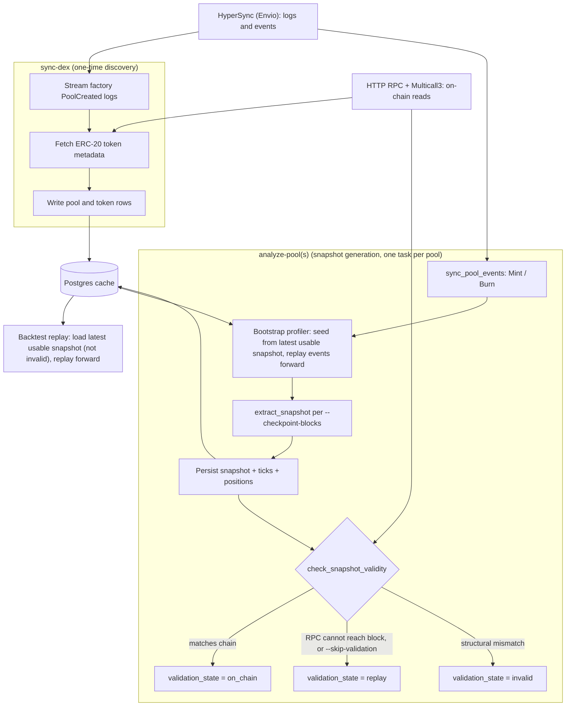

# Blockchain

## Overview

The blockchain adapter ingests DeFi data from EVM chains and exposes it through the
NautilusTrader data model. It combines three services:

- HyperSync for high-throughput historical blocks and contract logs.
- HTTP RPC for contract calls, Multicall reads, and final on-chain state hydration.
- Postgres for optional durable cache state, pool metadata, decoded events, and snapshots.

HyperSync and RPC serve different roles. HyperSync is the fast event source. HTTP RPC remains the
source of truth for current contract state, including Uniswap V3 slot state, active ticks, and
positions.

## Core primitives

The DeFi domain model lives in `nautilus_model::defi`.

### Chain

`Chain` defines the target blockchain and its default service endpoints.

| Field                       | Type         | Description                                                        |
|-----------------------------|--------------|--------------------------------------------------------------------|
| `name`                      | `Blockchain` | Chain enum value, such as `Ethereum` or `Arbitrum`.                |
| `chain_id`                  | `u32`        | EVM chain ID, such as `1` for Ethereum.                            |
| `hypersync_url`             | `String`     | HyperSync endpoint, by default `https://{chain_id}.hypersync.xyz`. |
| `rpc_url`                   | `Option`     | Optional direct RPC endpoint stored on the chain model.            |
| `native_currency_decimals`  | `u8`         | Native gas token decimal precision, usually `18`.                  |

Chains can be loaded by numeric ID with `Chain::from_chain_id` or by name with
`Chain::from_chain_name`.

| Chain family                                    | Code | Name         | Decimals |
|-------------------------------------------------|------|--------------|----------|
| Ethereum and L2s                                | ETH  | Ethereum     | 18       |
| Polygon                                         | POL  | Polygon      | 18       |
| Avalanche                                       | AVAX | Avalanche    | 18       |
| BSC                                             | BNB  | Binance Coin | 18       |

### DEX and pools

DEX integrations register factory addresses, event signatures, parser functions, and AMM type.
Pool definitions bind a chain, DEX, pool contract, token pair, fee tier, tick spacing, and creation
block into a stable Nautilus instrument ID.

Uniswap V3 and compatible concentrated-liquidity pools also use:

- `Initialize(uint160,int24)` for initial price state.
- `Mint` and `Burn` events for position and tick state replay.
- `Swap` events for live pool price movement.
- HTTP RPC final-state reads for `slot0`, liquidity, active ticks, and position data.

## Configuration

| Option                            | Default            | Description                                            |
|-----------------------------------|--------------------|--------------------------------------------------------|
| `chain`                           | Required           | Target `Chain`, such as Ethereum or Arbitrum.          |
| `dex_ids`                         | `[]`               | DEX integrations to register and sync.                 |
| `http_rpc_url`                    | Required           | HTTP RPC endpoint for contract reads and Multicall.    |
| `wss_rpc_url`                     | `None`             | Optional WSS RPC endpoint for RPC live streams.        |
| `rpc_requests_per_second`         | `None`             | Optional RPC request throttle.                         |
| `multicall_calls_per_rpc_request` | `200`              | Requested maximum Multicall targets per RPC request.   |
| `use_hypersync_for_live_data`     | `false` in Rust    | When true, live block and event streams use HyperSync. |
| `from_block`                      | `None`             | Optional start block for historical sync.              |
| `pool_filters`                    | `DexPoolFilters()` | Pool universe filtering rules.                         |
| `postgres_cache_database_config`  | `None`             | Optional Postgres cache configuration.                 |
| `proxy_url`                       | `None`             | Optional HTTP and WebSocket proxy URL.                 |
| `transport_backend`               | `Tungstenite`      | WebSocket transport backend.                           |

:::note
Pool snapshot requests currently require a Postgres cache database. The in-memory cache can hold
tokens and pools, but latest pool profiler bootstrap reads snapshot and event state through the
cache database path.
:::

## Environment

Set the HyperSync token and RPC URLs outside the repository. Do not commit `.env` files containing
secrets.

```fish
set -x ENVIO_API_TOKEN "<envio-token>"
set -x RPC_HTTP_URL "https://your-rpc.example"
set -x RPC_WSS_URL "wss://your-rpc.example"
```

For local `.env` usage:

```dotenv
ENVIO_API_TOKEN=<envio-token>
RPC_HTTP_URL=https://your-rpc.example
RPC_WSS_URL=wss://your-rpc.example
```

`ENVIO_API_TOKEN` is required by the Rust HyperSync client. Missing or malformed tokens fail client
construction before any query is sent.

### RPC endpoints

`RPC_HTTP_URL` (or `--rpc-url`) must point at an EVM JSON-RPC endpoint for the target chain. It is
required, not optional: the data client resolves it at construction, and a first-time pool sync reads
on-chain state through it. The HyperSync endpoint is derived per chain (`https://{chain_id}.hypersync.xyz`)
and needs no separate URL.

Verified free public HTTP endpoints (June 2026, no API key):

| Chain        | HTTP endpoint                          | Archive |
| ------------ | -------------------------------------- | ------- |
| Arbitrum One | `https://arb1.arbitrum.io/rpc`         | No      |
| Arbitrum One | `https://arbitrum.gateway.tenderly.co` | Yes     |
| Ethereum     | `https://ethereum-rpc.publicnode.com`  | No      |

Free archive endpoints exist (for example Tenderly above, Blast `https://arbitrum-one.public.blastapi.io`,
and dRPC `https://arbitrum.drpc.org`). They are rate-limited, but snapshot validation hydrates only a
handful of `eth_call`s per pool, so a free archive endpoint is enough to get `validation_state = on_chain`.

Archive vs non-archive controls snapshot validation, not whether the sync runs:

- On an archive node a historical-block snapshot validates against on-chain state and is stored with
  `validation_state = on_chain`.
- On a non-archive node the historical read fails and the snapshot is kept `validation_state = replay`,
  which is still usable as a replay start point.
- A first-time sync on a non-archive node must run to a recent `--to-block`, because the bootstrap
  reads on-chain state at the target block; only recent state is served.

For other chains or archive access, use a directory such as [chainlist.org](https://chainlist.org) or
[comparenodes.com](https://www.comparenodes.com), or a keyed provider (Infura, Alchemy, dRPC).

## Local services

The development compose file starts Postgres, Redis, and pgAdmin.

```fish
make start-services
make init-db
```

The default Postgres service listens on `127.0.0.1:5432` with database `nautilus`, user
`nautilus`, and password `pass`.

Check that the schema exists:

```fish
docker exec nautilus-database psql -U nautilus -d nautilus -Atc \
    "select count(*) from information_schema.tables where table_schema='public'"
```

For destructive DeFi test runs, use a separate database or resettable Docker volume. Pool discovery
and snapshot tests can write many rows to `token`, `pool`, `pool_*_event`, `pool_snapshot`,
`pool_position`, and `pool_tick`.

## Data flow

### Architecture

The adapter draws on three backends: HyperSync (Envio) for high-throughput logs and events, HTTP RPC
with Multicall3 for on-chain reads, and Postgres for the durable cache. `sync-dex` discovers and
registers pools once; `analyze-pool(s)` then generates `pool_snapshot` rows, each carrying a
`validation_state`.



`analyze-pools` runs each pool through the analyze pipeline concurrently, bounded by `--concurrency`;
each pool uses its own data client and shares no state. A snapshot is usable as a replay start point
unless its `validation_state` is `invalid`.

### Pool discovery

Pool discovery streams DEX factory events from HyperSync, fetches ERC-20 metadata through RPC, and
stores valid tokens and pools in the cache. Pools with invalid or empty token metadata can be
filtered out through `DexPoolFilters`.

### Live data

When `use_hypersync_for_live_data` is true, the adapter subscribes to blocks through HyperSync and
then fetches matching DEX contract events for subscribed pools. When false, WSS RPC is used where a
streaming implementation exists.

### Snapshot bootstrap

For Uniswap V3 snapshots, bootstrap uses a two-stage process:

- Replay historical Initialize, Mint, and Burn events from HyperSync to rebuild ticks and
  positions.
- Fetch the final on-chain state through HTTP RPC and Multicall, then restore the profiler from
  that snapshot.

If final RPC hydration fails, the adapter must fail closed. It must not emit a snapshot built from
replayed events with stale price state.

### Snapshot validation

Before marking a snapshot valid, the bootstrap compares the replayed profiler against the on-chain
state. Structural state must match exactly: the current tick, active liquidity, per-tick net and
gross liquidity, and position liquidity. A mismatch in any of these fails closed, and the snapshot
is not marked valid.

Two fields are tolerated as non-blocking and logged as a warning rather than an error:

- Sqrt price, which differs when replay is event-scoped but the RPC snapshot is block-scoped.
- Fee protocol, which lags the on-chain value until `SetFeeProtocol` events are indexed and
  replayed.

A fee-protocol-only mismatch still accepts the snapshot, matching backtest replay behavior. The
accepted snapshot carries the replayed `fee_protocol`, so a profiler restored from it splits protocol
and LP fees with that lagging setting until `SetFeeProtocol` replay lands. The protocol-fee split on
such a snapshot can diverge from on-chain until then.

### Snapshot bootstrap guard

Use `--require-existing-snapshot` when a pool analysis job should prepare a bounded replay only from
the local snapshot cache. The command checks for the latest valid `pool_snapshot` at or before the
target block before syncing pool events. If no usable snapshot exists, or the only match is the
empty creation-block snapshot with no positions or ticks, it returns `needs_bootstrap` and skips the
creation-to-target bootstrap for that pool.

```fish
nautilus blockchain analyze-pools \
    --chain ethereum \
    --dex UniswapV3 \
    --addresses-file pools.txt \
    --to-block 25218797 \
    --require-existing-snapshot \
    --rpc-url "$RPC_HTTP_URL"
```

Both `analyze-pool` and `analyze-pools` print one JSON result per requested `--checkpoint-blocks`
entry, or a single result at `--to-block` when none are given. A pool that needs a first-time
bootstrap (under `--require-existing-snapshot`) has this shape:

```json
{
  "chain": "Ethereum",
  "dex": "UniswapV3",
  "pool_address": "0x1111111111111111111111111111111111111111",
  "target_block": 25218797,
  "status": "needs_bootstrap"
}
```

A successful analysis reports `validation_state`, one of `on_chain` (hydrated and matched against
chain), `replay` (replay-derived, not checked, still usable as a replay start point), or `invalid`
(hydrated and mismatched, not usable):

```json
{
  "chain": "Ethereum",
  "dex": "UniswapV3",
  "pool_address": "0x1111111111111111111111111111111111111111",
  "target_block": 25218797,
  "status": "success",
  "snapshot_block": 25218790,
  "positions": 2,
  "ticks": 7,
  "validation_state": "replay",
  "already_valid": false,
  "liquidity_utilization_rate": 0.25
}
```

### Checkpoints and concurrency

`--checkpoint-blocks b1,b2,...` produces a `pool_snapshot` at each block in a single bootstrap pass
(sorted, deduped, clamped to `--to-block`), instead of one run per block. `analyze-pools` analyzes
pools concurrently up to `--concurrency` (default 4), each with its own data client. `--skip-validation`
skips the on-chain compare and keeps snapshots `replay`.

Each snapshot is keyed to the last liquidity event at or before its checkpoint, so checkpoints with no
events between them resolve to the same snapshot: every requested checkpoint still prints a result
line, but they share one stored row (deduped on insert).

### Backtest replay

In backtest mode the adapter does not service live snapshot requests, so the pool profiler must
initialize from a snapshot supplied in the replay data. `load_pool_snapshot` reads a pool snapshot
from the Postgres cache, reconstructed with its full position and tick state, as of a chosen block:

```python
from nautilus_trader.adapters.blockchain import load_pool_snapshot

snapshot = load_pool_snapshot(
    pg_config=postgres_config,
    chain_id=chain_id,
    pool_address=pool_address,
    before_block=replay_start_block,  # latest snapshot at or before this block
)
```

By default only snapshots validated against on-chain state are returned; pass `require_valid=False`
to accept unvalidated snapshots. The function returns `None` when the cache holds no matching
snapshot, which should be treated as a setup error rather than replayed without profiler state. Wrap
the snapshot as `DefiData.PoolSnapshot(snapshot)` and pass it to `BacktestEngine.add_defi_data`
alongside the events to replay. The data engine restores the profiler from the snapshot, buffering
any pool events that precede it in the stream and applying them once the profiler is ready. Replay
every pool event from the snapshot's block forward: a snapshot earlier than the first replayed event
leaves the profiler stale.

Cached block timestamps load into Nautilus data objects as UNIX nanoseconds. Cache rows written with
second-resolution block timestamps are normalized to nanoseconds when snapshots and pool events are
loaded, while nanosecond rows preserve their stored precision.

## Contracts

### Base contract and Multicall3

`BaseContract` batches contract calls through Multicall3 at
`0xcA11bde05977b3631167028862bE2a173976CA11`.

- Calls use `allow_failure: true` so individual contract call failures can be reported.
- Reads execute against a single block context.
- Transport and provider failures surface as RPC errors.

### ERC-20 metadata

`Erc20Contract` reads `name`, `symbol`, and `decimals` through Multicall. Non-standard token
contracts may return malformed strings, raw bytes, or empty fields. The adapter can skip pools with
tokens that fail metadata validation.

### Uniswap V3 pools

`UniswapV3PoolContract` reads global pool state, active ticks, and positions. Large pools can exceed
provider limits if too many ticks or positions are packed into a single RPC call. The current safety
behavior is fail-closed on hydration failure; successful delivery for very large pools depends on
provider limits or future chunked/minimal hydration work.

## Smoke tests

### HyperSync authentication

```fish
curl -fsS --max-time 15 \
    -H "Authorization: Bearer $ENVIO_API_TOKEN" \
    https://1.hypersync.xyz/height
```

Expected result: JSON with a numeric `height`.

### Small HyperSync query

```fish
set query (string join '' \
    '{"from_block":25170900,' \
    '"to_block":25170901,' \
    '"include_all_blocks":true,' \
    '"field_selection":{"block":["number","timestamp","hash"]}}')

curl -sS --max-time 30 \
    -H "Authorization: Bearer $ENVIO_API_TOKEN" \
    -H "Content-Type: application/json" \
    --data "$query" \
    https://1.hypersync.xyz/query/arrow-ipc \
    -o /dev/null \
    -w "http_code=%{http_code} size_download=%{size_download}\n"
```

Expected result: HTTP `200` with a non-zero response size.

### Adapter compile check

```fish
cargo check -p nautilus-blockchain --features hypersync
```

### Live fail-closed regression

This ignored test uses real HyperSync replay for the Ethereum WETH/USDT Uniswap V3 pool and a
deliberately invalid local HTTP RPC URL. It verifies that final RPC hydration failure returns an
error instead of allowing a stale snapshot through the construction path.

```fish
cargo test -p nautilus-blockchain --features hypersync \
    live_hypersync_bootstrap_fails_closed_when_rpc_hydration_fails \
    -- --ignored --nocapture
```

Expected result: one ignored test passes. On a live network this can take several minutes.

## Operational notes

- Use HyperSync for high-volume historical log scans.
- Use HTTP RPC for final contract state and validation.
- Use a paid or high-limit RPC provider for large Uniswap V3 pools.
- Keep `ENVIO_API_TOKEN`, RPC keys, and Postgres credentials outside version control.
- Use a separate Postgres database for repeatable DeFi test runs that write pool snapshots.
- Treat failed final-state hydration as a hard failure for emitted snapshots.

### Pool analysis prerequisites and gotchas

These surface as `analyze-pool(s)` failures with a clear cause and fix.

#### Discover pools before analysis

`analyze-pool(s)` reads pool metadata from the cache and fails with `Pool <address> is not registered`
if the pool was never discovered. Run `sync-dex` for the chain/DEX once to populate the `pool` table
first.

#### Use checksummed pool addresses

Addresses must be EIP-55 checksummed; a lowercase address fails with
`Blockchain address '<address>' has incorrect checksum`. Resolving a pool from
`UniswapV3Factory.getPool` returns lowercase, so checksum it before passing `--address`.

#### Lower the multicall batch on capped RPCs

Public nodes enforce a per-call gas limit, so a large multicall returns `out of gas` and the adapter
falls back to slow per-item fetches. Pass a smaller `--multicall-calls-per-rpc-request` (for example
`50` on `https://arb1.arbitrum.io/rpc`) to keep batches under the cap.

#### Use a recent target block on non-archive RPCs

A first-time sync reads on-chain state at `--to-block`, and a non-archive node only serves recent
state, so historical targets fail the on-chain read. See [RPC endpoints](#rpc-endpoints).

#### HyperSync rate limits are shared per token

A free Envio token caps requests per window (for example 40), and `--concurrency` makes all pools draw
from that one budget at once, so high concurrency on a free token spends most of its time backing off
(`rate limited by server (remaining=0/40 ...)`). Keep `--concurrency` low (or `1`) on a free token, or
raise the limit with a paid plan. A full first-time sync of a large, long-lived pool needs many
thousands of requests, so it is impractical on a free token regardless of concurrency.

#### Pools with no liquidity events panic in extraction

A pool with no processed Mint/Burn events up to the target block currently panics in snapshot
extraction with `No events processed yet`. Under `analyze-pools` the panic is contained as a single
per-pool failure and the other pools still complete; under single-pool `analyze-pool` it aborts the
command. Choose pools with liquidity activity, or expect that one as a per-pool failure.

#### Exit code does not reflect per-pool failures

A failed pool is reported as a JSON line with `"status": "failure"`, but the process can still exit
`0`, so a partial failure is not visible in the exit code. Parse each result line's `status` rather
than relying on the exit status.

## Current limitations

- Very large Uniswap V3 pools can still hit provider payload, timeout, or rate limits during
  final-state Multicall hydration.
- `multicall_calls_per_rpc_request` documents the intended batching limit, but some final snapshot
  paths still need chunking hardening.
- A full successful WETH/USDT or WETH/USDC delivery test needs a real HTTP RPC provider that can
  serve the final-state reads, or the adapter needs minimal/chunked hydration first.
