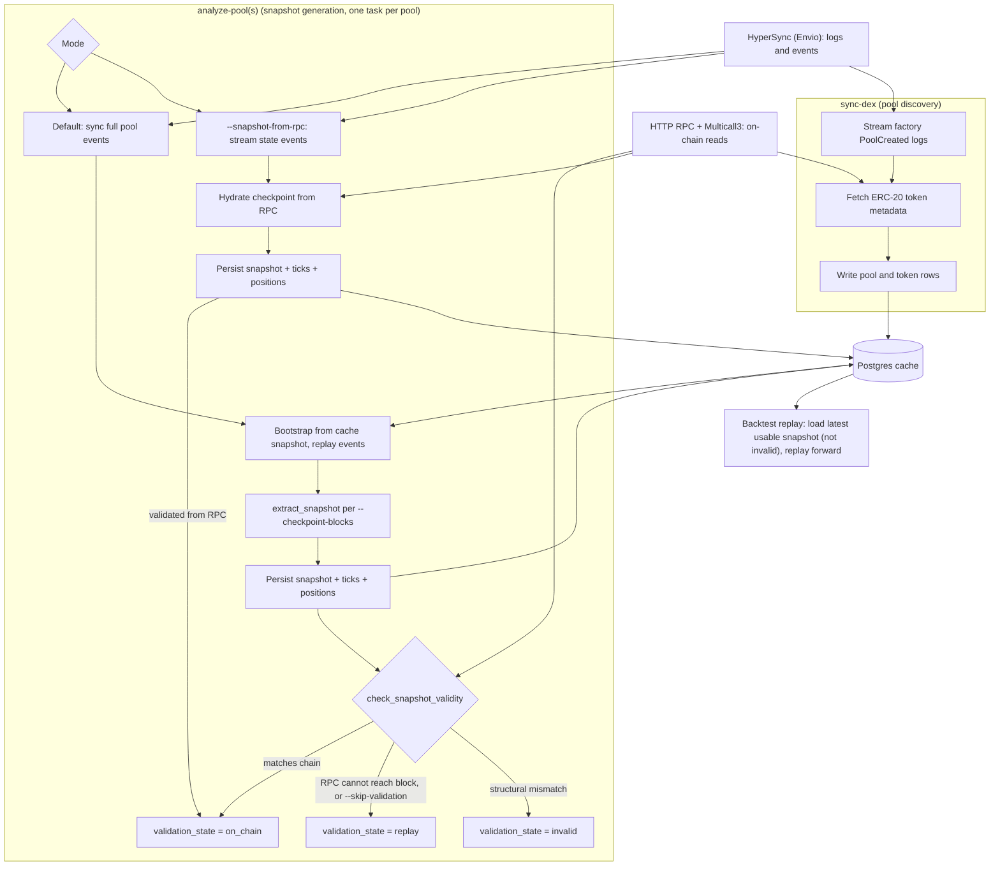

# Blockchain

## Overview

The blockchain adapter ingests DeFi data from EVM chains and exposes it through the
NautilusTrader data model. It also has a fork-validated initial execution client for locally
signed Uniswap V3 swaps, proven end to end on Arbitrum (see [Execution](#execution)). That
capability is not production-ready Uniswap execution. The adapter uses three backends:

- HyperSync: high-throughput historical blocks and contract logs. See the
  [Envio HyperSync docs](https://docs.envio.dev/docs/HyperSync/hypersync-usage) for query shape,
  pagination, and tuning.
- HTTP RPC: contract calls, Multicall reads, and final on-chain state hydration.
- Postgres: optional durable cache state, pool metadata, decoded events, and snapshots.

## Core primitives

The DeFi domain model lives in `nautilus_model::defi`.

### Chain

`Chain` defines the target blockchain and its default service endpoints.

| Field                      | Type             | Description                                                        |
| -------------------------- | ---------------- | ------------------------------------------------------------------ |
| `name`                     | `Blockchain`     | Chain enum value, such as `Ethereum` or `Arbitrum`.                |
| `chain_id`                 | `u32`            | EVM chain ID, such as `1` for Ethereum.                            |
| `hypersync_url`            | `String`         | HyperSync endpoint, by default `https://{chain_id}.hypersync.xyz`. |
| `rpc_url`                  | `Option<String>` | Optional direct RPC endpoint stored on the chain model.            |
| `native_currency_decimals` | `u8`             | Native gas token decimal precision, usually `18`.                  |

Chains can be loaded by numeric ID with `Chain::from_chain_id` or by name with
`Chain::from_chain_name`.

| Chain family     | Code | Name         | Decimals |
| ---------------- | ---- | ------------ | -------- |
| Ethereum and L2s | ETH  | Ethereum     | 18       |
| Polygon          | POL  | Polygon      | 18       |
| Avalanche        | AVAX | Avalanche    | 18       |
| BSC              | BNB  | Binance Coin | 18       |

### DEX and pools

DEX integrations register:

- Factory addresses.
- Event signatures and parser functions.
- AMM type.

Pool definitions bind the chain and DEX to a pool contract address or protocol pool ID to form a
stable Nautilus instrument ID. The token pair, fee tier, tick spacing, and creation block remain
pool metadata.

When the data engine processes a pool definition, it caches and publishes a `CurrencyPair` under
the same pool instrument ID. The instrument keeps the raw pool `token0`/`token1` order as base/quote,
derives price and size precision from token decimals up to `FIXED_PRECISION`, and exposes the fee
tier divided by 1,000,000 as `taker_fee`. Distinct pool identifiers let same-token pools coexist in
the cache and on the message bus.

Uniswap V3 and compatible concentrated-liquidity pools also use:

- `Initialize(uint160,int24)` for initial price state.
- `Mint` and `Burn` events for position and tick state replay.
- `Swap` events for live pool price movement.
- HTTP RPC final-state reads for `slot0`, liquidity, active ticks, and position data.

## Configuration

| Option                            | Default                       | Description                                            |
| --------------------------------- | ----------------------------- | ------------------------------------------------------ |
| `chain`                           | Required                      | Target `Chain`, such as Ethereum or Arbitrum.          |
| `dex_ids`                         | `[]`                          | DEX integrations to register and sync.                 |
| `http_rpc_url`                    | Required                      | HTTP RPC endpoint for contract reads and Multicall.    |
| `wss_rpc_url`                     | `None`                        | WSS endpoint; required for RPC live streams.           |
| `rpc_requests_per_second`         | `None`                        | Optional RPC request throttle.                         |
| `multicall_calls_per_rpc_request` | `200`                         | Requested maximum Multicall targets per RPC request.   |
| `use_hypersync_for_live_data`     | Rust: `false`; Python: `true` | When true, live block and event streams use HyperSync. |
| `from_block`                      | `None`                        | Optional start block for historical sync.              |
| `pool_filters`                    | `DexPoolFilters()`            | Pool universe filtering rules.                         |
| `postgres_cache_database_config`  | `None`                        | Optional Postgres cache configuration.                 |
| `proxy_url`                       | `None`                        | Optional HTTP and WebSocket proxy URL.                 |
| `transport_backend`               | `Sockudo`                     | WebSocket transport backend.                           |

:::note
Pool snapshot requests currently require a Postgres cache database. The in-memory cache can hold
tokens and pools, but latest pool profiler bootstrap reads snapshot and event state through the
cache database path.
:::

## Environment

Set credentials outside the repository:

```bash
export ENVIO_API_TOKEN="<envio-token>"
export RPC_HTTP_URL="https://your-rpc.example"
export RPC_WSS_URL="wss://your-rpc.example"
```

For local `.env` usage, keep the file out of version control:

```dotenv
ENVIO_API_TOKEN=<envio-token>
RPC_HTTP_URL=https://your-rpc.example
RPC_WSS_URL=wss://your-rpc.example
```

- `ENVIO_API_TOKEN` is required by the Rust HyperSync client. Missing or malformed tokens fail
  client construction before any query is sent.
- `RPC_HTTP_URL` or `--rpc-url` is required for contract reads and snapshot hydration.
- `RPC_WSS_URL` is required when `use_hypersync_for_live_data = false`; that mode uses WSS RPC live
  streams.

Execution adds further variables (see [Execution](#execution)):

- The signer private key is read from the variable named by the `signer_private_key_env`
  configuration field, never from configuration directly.
- `BLOCKCHAIN_FORK_TESTS=1` enables the pinned-block Anvil integration suite.
  `BLOCKCHAIN_FORK_RPC_URL` is then required as Anvil's read-only Arbitrum fork source; signed
  transactions go to localhost only.

For token setup and quota details, see Envio's
[HyperSync API token docs](https://docs.envio.dev/docs/HyperSync/api-tokens).

### RPC endpoints

`RPC_HTTP_URL` or `--rpc-url` must point at an EVM JSON-RPC endpoint for the target chain.
The data client uses it for contract reads, and first-time pool syncs read on-chain state through it.
The client reads the HyperSync endpoint from `Chain::hypersync_url`; built-in chains default to
`https://{chain_id}.hypersync.xyz`.

Checked public HTTP endpoints (August 2026, no API key):

| Chain        | HTTP endpoint                          | Archive |
| ------------ | -------------------------------------- | ------- |
| Arbitrum One | `https://arb1.arbitrum.io/rpc`         | No      |
| Arbitrum One | `https://arbitrum.gateway.tenderly.co` | Yes     |
| Ethereum     | `https://ethereum-rpc.publicnode.com`  | No      |

Free archive endpoints exist, but availability and limits change. Snapshot validation usually needs
only a small number of `eth_call`s per pool, so a free archive endpoint can be enough to get
`validation_state = on_chain`.

Archive support affects validation, not whether event sync runs:

- On an archive node, a historical-block snapshot validates against on-chain state and is stored with
  `validation_state = on_chain`.
- On a non-archive node, the historical read fails and the snapshot stays `validation_state = replay`,
  which is still usable as a replay start point.
- A first-time sync on a non-archive node must run to a recent `--to-block`, because non-archive
  nodes only serve recent state and bootstrap reads on-chain state at the target block.

For other chains or archive access, use a directory such as [chainlist.org](https://chainlist.org) or
[comparenodes.com](https://www.comparenodes.com), or a keyed provider (Infura, Alchemy, dRPC).

## Local services

The development compose file starts Postgres, Redis, and pgAdmin.

```bash
make start-services
make init-db
```

Default Postgres connection:

- Host: `127.0.0.1:5432`
- Database: `nautilus`
- User: `nautilus`
- Password: `pass`

Check that the schema exists:

```bash
docker exec nautilus-database psql -U nautilus -d nautilus -Atc \
    "select count(*) from information_schema.tables where table_schema='public'"
```

For destructive DeFi tests, use a separate database or resettable Docker volume. Pool discovery and
snapshot tests can write many rows to `token`, `pool`, `pool_*_event`, `pool_snapshot`,
`pool_position`, and `pool_tick`.

## Data flow

### Architecture

`sync-dex` discovers and stores pools and tokens. `analyze-pool(s)` then generates `pool_snapshot`
rows. The diagram shows the default replay path and the `--snapshot-from-rpc` path.


```mermaid
flowchart TD
    HS["HyperSync (Envio): logs and events"]
    RPC["HTTP RPC + Multicall3: on-chain reads"]
    PG[("Postgres cache")]

    subgraph discovery["sync-dex (pool discovery)"]
        direction TB
        D1["Stream factory PoolCreated logs"]
        D2["Fetch ERC-20 token metadata"]
        D3["Write pool and token rows"]
        D1 --> D2 --> D3
    end

    subgraph analyze["analyze-pool(s) (snapshot generation, one task per pool)"]
        direction TB
        AP0{"Mode"}
        AP1["Default: sync full pool events"]
        AP2["Bootstrap from cache snapshot, replay events"]
        AP3["extract_snapshot per --checkpoint-blocks"]
        AP4["Persist snapshot + ticks + positions"]
        AP5{"check_snapshot_validity"}
        RP1["--snapshot-from-rpc: stream state events"]
        RP2["Hydrate checkpoint from RPC"]
        RP3["Persist snapshot + ticks + positions"]
        AP0 --> AP1 --> AP2 --> AP3 --> AP4 --> AP5
        AP0 --> RP1 --> RP2 --> RP3
        AP5 -->|"matches chain"| V1["validation_state = on_chain"]
        AP5 -->|"RPC cannot reach block, or --skip-validation"| V2["validation_state = replay"]
        AP5 -->|"structural mismatch"| V3["validation_state = invalid"]
        RP3 -->|"validated from RPC"| V1
    end

    R["Backtest replay: load latest usable snapshot (not invalid), replay forward"]

    HS --> D1
    RPC --> D2
    D3 --> PG
    HS --> AP1
    HS --> RP1
    PG --> AP2
    AP4 --> PG
    RP3 --> PG
    RPC --> AP5
    RPC --> RP2
    PG --> R
```

`analyze-pools` runs one task per pool, bounded by `--concurrency`. Each task owns its data client.
A snapshot is usable as a replay start point unless its `validation_state` is `invalid`.

### Pool discovery

Pool discovery:

- Streams DEX factory events from HyperSync.
- Fetches ERC-20 metadata through RPC.
- Stores valid tokens and pools in the cache.
- Skips invalid token metadata. `DexPoolFilters` can also exclude empty token metadata.

### Live data

- `use_hypersync_for_live_data = true`: subscribe to blocks through HyperSync for live timestamps
  and hold one open-ended HyperSync DEX-event stream per subscribed DEX filter.
- `use_hypersync_for_live_data = false`: use WSS RPC block and pool-log subscriptions for live
  swaps, liquidity updates, fee collections, flash events, and fee-protocol events.

### Snapshot bootstrap

For Uniswap V3-compatible snapshots, the default bootstrap replays stored pool events to rebuild
price, liquidity, ticks, positions, fees, and counters. Validation then reads on-chain state through
HTTP RPC and Multicall.

Bootstrap modes:

- Default: store the full pool event history up to the target block, then bootstrap from the
  database.
- `--snapshot-from-rpc`: skip full swap storage, stream Initialize, Mint, Burn, SetFeeProtocol, and
  CollectProtocol events from HyperSync to enumerate ticks and positions, then hydrate the exact
  checkpoint block from RPC.

Use `--snapshot-from-rpc` for old high-volume pools when the required output is the final snapshot,
not a stored swap history. It cannot be combined with `--from-block`, `--reset`, or
`--require-existing-snapshot`.

In `--snapshot-from-rpc` mode, final RPC hydration is the source of the checkpoint state. If it
fails, the command fails instead of emitting a replayed snapshot with stale price state.

### Snapshot validation

For a replay-derived snapshot, bootstrap compares the profiler against on-chain state before
marking it valid.

| Class          | Fields                                                                      | Mismatch result                                |
| -------------- | --------------------------------------------------------------------------- | ---------------------------------------------- |
| Structural     | Current tick, active liquidity, per-tick liquidity, and position liquidity. | Store `invalid`; exclude from default loading. |
| Non-structural | Sqrt price, fee protocol, and protocol-fee balances.                        | Warn and accept the snapshot as `on_chain`.    |

Non-structural differences can arise because event replay is transaction-scoped while an RPC
snapshot is block-scoped, a fork or replay range omits a fee-protocol update, or replay rounding
differs from the on-chain fee accumulator. Accepting those fields matches backtest replay behavior.

### Snapshot bootstrap guard

Use `--require-existing-snapshot` when analysis should run only from the local snapshot cache:

- Checks for the latest usable `pool_snapshot` at or before the target block.
- Returns `needs_bootstrap` if no usable snapshot exists.
- Treats an empty creation-block snapshot with no positions or ticks as unusable.
- Skips the creation-to-target bootstrap for that pool.

```bash
nautilus blockchain analyze-pools \
    --chain ethereum \
    --dex UniswapV3 \
    --addresses-file pools.txt \
    --to-block 25218797 \
    --require-existing-snapshot \
    --rpc-url "$RPC_HTTP_URL"
```

#### Analysis output

`analyze-pool(s)` prints:

- One JSON result per `--checkpoint-blocks` entry.
- One JSON result at `--to-block` when no checkpoints are given.

A pool that needs a first-time bootstrap has this shape:

```json
{
  "chain": "Ethereum",
  "dex": "UniswapV3",
  "pool_address": "0x1111111111111111111111111111111111111111",
  "target_block": 25218797,
  "status": "needs_bootstrap"
}
```

A successful result includes `validation_state`:

- `on_chain`: hydrated and matched against chain.
- `replay`: replay-derived or unchecked, still usable as a replay start point.
- `invalid`: hydrated and mismatched, not usable.

```json
{
  "chain": "Ethereum",
  "dex": "UniswapV3",
  "pool_address": "0x1111111111111111111111111111111111111111",
  "target_block": 25218797,
  "status": "success",
  "snapshot_block": 25218790,
  "positions": 2,
  "ticks": 7,
  "validation_state": "replay",
  "already_valid": false,
  "liquidity_utilization_rate": 0.25
}
```

### Checkpoints and concurrency

- `--checkpoint-blocks b1,b2,...`: produces snapshots in one bootstrap pass. Blocks are sorted,
  deduped, and clamped to `--to-block`.
- `--concurrency`: controls `analyze-pools` parallelism. Default: `4`.
- `--skip-validation`: skips the on-chain compare and keeps replay-derived snapshots as `replay`.
- `--snapshot-from-rpc`: hydrates from chain at the checkpoint block and records snapshots as
  `on_chain`.

Snapshot keys:

- Default mode: keyed to the last pool event at or before the checkpoint. Checkpoints with no events
  between them can share one stored row.
- `--snapshot-from-rpc`: keyed to the requested checkpoint block with a block-scoped sentinel
  transaction/log index.

### Backtest replay

Backtest replay needs a snapshot in the input data. The adapter does not service live snapshot
requests during backtests.

`load_pool_snapshot` reads a full snapshot, including positions and ticks, from Postgres:

```python
from nautilus_trader.adapters.blockchain import load_pool_snapshot

snapshot = load_pool_snapshot(
    pg_config=postgres_config,
    chain_id=chain_id,
    pool_address=pool_address,
    before_block=replay_start_block,  # latest snapshot at or before this block
)
```

Replay rules:

- By default, snapshots marked `invalid` are excluded; both `on_chain` and `replay` snapshots can
  be returned. Pass `require_valid=False` only when the caller also accepts `invalid` snapshots.
- Treat `None` as setup failure. Do not replay without profiler state.
- Wrap the result as `DefiData.PoolSnapshot(snapshot)` and pass it to
  `BacktestEngine.add_defi_data` with the pool events.
- Replay every pool event from the snapshot block forward. Starting after the snapshot block can leave
  the profiler stale.

Cached block timestamps load into Nautilus data objects as UNIX nanoseconds. Cache rows written with
second-resolution block timestamps are normalized to nanoseconds when snapshots and pool events are
loaded, while nanosecond rows preserve their stored precision.

## Contracts

### Base contract and Multicall3

`BaseContract` batches contract calls through Multicall3
(`0xcA11bde05977b3631167028862bE2a173976CA11`):

- Multicall uses `tryAggregate(requireSuccess: false)`, so each result reports its own success or
  failure and the contract wrapper decides whether to reject it.
- Reads execute against a single block context.
- Transport and provider failures surface as RPC errors.

### ERC-20 metadata

`Erc20Contract` reads `name`, `symbol`, and `decimals` through Multicall. The adapter can skip pools
whose token metadata is malformed, raw bytes, or empty.

### Uniswap V3 pools

`UniswapV3PoolContract` reads global pool state, active ticks, and positions.

- Large pools can exceed provider payload, gas, or timeout limits.
- RPC-snapshot hydration fails closed if the final-state read fails.
- Very large pools may need a lower `multicall_calls_per_rpc_request` or a stronger provider.

PancakeSwap V3 reuses the Uniswap V3 read contract because `slot0`, `ticks`, `positions`,
`liquidity`, and fee-growth reads share the same ABI. Fee-protocol encoding differs:

- Uniswap V3 packs two 4-bit fee denominators into one `uint8`.
- PancakeSwap V3 stores two 16-bit basis-point shares in `slot0.feeProtocol` and emits
  `SetFeeProtocol(uint32,uint32,uint32,uint32)`.
- PancakeSwap V3 snapshots store `fee_protocol0_basis_points` and
  `fee_protocol1_basis_points`, and replay computes protocol fees as `fee * basis_points / 10000`.

## Execution

:::note
Execution support is under active development. `BlockchainExecutionClient` implements preflight,
explicit WETH wrap and ERC-20 approval, local EIP-1559 signing, durable reconciliation, and one
Uniswap V3 swap flow. Arbitrum Uniswap V3 is the only chain and DEX combination covered end to end.
Other order operations fail closed with no on-chain or durable side effects.
:::

### Connection and account state

Connect performs these checks before enabling transaction submission:

1. When Postgres is configured, install or verify the execution schema and reconcile the signer's
   active intent.
1. Verify that the RPC chain ID matches the configured chain.
1. Load the private key from `signer_private_key_env` and verify that its address matches
   `wallet_address`.
1. Read the native balance and every ERC-20 balance configured in `tokens`.
1. Install the complete wallet snapshot and publish one `AccountState` under the configured account
   ID.

Without Postgres, the client can connect and publish balances, but all transaction operations are
refused. If reconciliation, a balance read, or an exact amount conversion fails, the client stays
disconnected. Any loaded signer is removed, the previous complete snapshot remains installed, and
no partial wallet state is published. Duplicate token symbols also reject the snapshot because
symbols define currency identity.

Published balances use `total = free` and `locked = 0`. The wallet account applies local
reservations when it derives effective free and locked balances, as described in
[Wallet accounts](../concepts/accounting.md#wallet-accounts).

After the client starts, `QueryAccount` republishes the installed snapshot without another RPC
read. It fails when:

- The requested account ID differs from the client account ID.
- The client has not started.
- No complete snapshot exists.

Disconnect removes the signer and aborts in-flight submission tasks. Transaction operations reject
a disconnected client before any execution RPC call.

### Supported order slice

The client accepts one order shape:

| Axis        | Accepted                                                                 | Rejected                                                   |
| ----------- | ------------------------------------------------------------------------ | ---------------------------------------------------------- |
| Chain       | The chain configured on the execution client.                            | An instrument venue for another chain.                     |
| DEX         | Uniswap V3.                                                              | Every other DEX, including PancakeSwap V3.                 |
| Pool        | An address-based pool in `Cache::pool` with a fee tier.                  | Unknown pools, V4 pool IDs, and pools without a fee tier.  |
| Order       | A single `MarketOrder` with side `SELL`.                                 | BUY and non-market orders submitted through `SubmitOrder`. |
| Quantity    | Base-denominated input that fits the configured raw-unit amount ceiling. | Quote-denominated input and amounts above the ceiling.     |
| Orientation | Tokens with distinct model priorities.                                   | A pair whose tokens have equal priority and are ambiguous. |

The `InstrumentId` selects the pool, for example
`0xC6962004f452bE9203591991D15f6b388e09E8D0.Arbitrum:UniswapV3`. Its venue must parse as
`<Chain>:<DexType>`, and its symbol must parse as an address `PoolIdentifier`.
`Pool::get_base_token` and `Pool::get_quote_token` apply the model's token-priority convention:
stablecoins are quote assets, wrapped native assets have the next priority, and other tokens become
base assets against them. Equal `Token::get_token_priority` values are ambiguous and reject the
order.

The implementation admits Uniswap V3 on any configured chain whose venue matches. Only Arbitrum
Uniswap V3 has end-to-end adapter coverage, including the fork test described below.

Order lists deny each open order with `OrderDenied`; modify, cancel, and batch-cancel commands
reject each referenced cached order with `OrderModifyRejected` or `OrderCancelRejected`; cancel-all
commands and order queries log a warning without an event. Mass status returns `Ok(None)` so
startup reconciliation logs and continues. Order, fill, and position report probes return an error
so LiveNode does not treat an empty answer as absence. These paths never sign, broadcast, or persist
an intent.

A swap stays `Submitted` until finality, and venue status queries cannot resolve it. Set
`inflight_check_interval_ms = 0` and leave open-order checks off. The engine's default in-flight
timeout would otherwise reject a live swap.

Execution routing follows Nautilus's multi-venue broker pattern because the client represents a
wallet and RPC connection for one chain while each instrument venue identifies both its chain and
DEX. A strategy may select the client explicitly through `client_id`; node configuration may instead
register the client for instrument venues through `RoutingConfig.venues` or use it as the default
execution client. After client selection, `ExecutionClient::handles_order_venue` accepts only a
venue whose parsed chain matches the client configuration and whose DEX is supported by the client.
The instrument retains its `<Chain>:<DexType>` venue rather than being rewritten to `BLOCKCHAIN`.

The order maps to a single `exactInputSingle` call on the original Uniswap SwapRouter (the
deployment whose signature carries a deadline):

| Parameter           | Source                                                      |
| ------------------- | ----------------------------------------------------------- |
| `tokenIn`           | Pool base token address                                     |
| `tokenOut`          | Pool quote token address                                    |
| `fee`               | Pool fee tier                                               |
| `recipient`         | Execution wallet address                                    |
| `deadline`          | Latest block timestamp plus configured `deadline_seconds`   |
| `amountIn`          | `Quantity` converted to raw `U256` with base token decimals |
| `amountOutMinimum`  | Derived from a current quote (see below)                    |
| `sqrtPriceLimitX96` | `0` (slippage is bounded by `amountOutMinimum`)             |

### Slippage protection

`amountOutMinimum` is always derived, never caller-supplied:

1. Require an active data-side subscription to the pool so the `PoolProfiler` in the shared engine
   cache (`Cache::pool_profiler`) is live; without a live profiler no quote exists and the order
   is rejected.
1. Simulate the exact-input swap locally with `PoolProfiler::swap_exact_in` on that profiler, and
   require the simulation to consume the full input amount; a partially filled quote means the
   pool's liquidity cannot fill the order, and the order is rejected.
1. Require the pool state to be fresh within `max_quote_age_blocks` of the chain's latest block;
   with no running data engine the profiler stops tracking the chain, the quote is stale, and the
   order is rejected.
1. Compute `amountOutMinimum = quoted_amount_out * (10_000 - slippage_bps) / 10_000` in integer
   arithmetic and reject the order when the result is zero.

The slippage comes from the `slippage_bps` configuration field, overridable per order through a
`slippage_bps` entry in the submit command's `params`; an override above the `max_slippage_bps`
ceiling is rejected before signing.

### Preflight, wrapping, and approval

Preflight, WETH wrapping, and router approval are explicit operations on the client, separate from
`submit_order`:

| Operation | State change                       | Pre-broadcast checks                                                       | Completion check                                     |
| --------- | ---------------------------------- | -------------------------------------------------------------------------- | ---------------------------------------------------- |
| Preflight | None.                              | Chain ID, deployed contracts, balances, allowance, and current fee policy. | Returns a structured, sanitized report.              |
| Wrap      | Calls WETH `deposit()` with value. | WETH bytecode and a readable ERC-20 balance.                               | WETH balance increased by the exact wrapped amount.  |
| Approve   | Calls `approve(router, amount)`.   | Token bytecode, router allowlist, and a successful simulation.             | Allowance at the inclusion block covers the request. |

Preflight resolves the pool from `Cache::pool`. Its report contains no RPC URL, private key, or raw
signed transaction.

Approve rejects a standard `false` return and accepts tokens that return no data. With
`unlimited_approval`, it requests `U256::MAX` but accepts a token-specific maximum allowance when
that allowance still covers the requested amount.

During an uninterrupted call, wrap and approve use the shared EIP-1559 path, persist the intent and
signed hash before broadcast, and return after stable finality and the operation's postcondition.
Wrap compares the WETH balance immediately before and at the inclusion block, which avoids a stale
pre-broadcast baseline. A failed postcondition returns an error after finality, so the transaction
may still have changed on-chain state.

Before signing a swap, order submission checks:

- Deployed bytecode at the pool, router, and token addresses.
- Router allowance and input-token balance sufficient for the raw input amount.
- Native balance sufficient for transaction value plus the maximum gas cost.

Submission never wraps or approves. An insufficient allowance or balance emits `OrderDenied`.

### Transaction signing and broadcast

#### Local signing

The client builds and signs EIP-1559 typed transactions locally with Alloy:

- It builds `alloy::consensus::TxEip1559` with the chain ID, nonce, gas, fees, destination, value,
  and calldata.
- It signs `SignableTransaction::signature_hash()` with
  `alloy::signers::local::PrivateKeySigner`, producing `Signed<TxEip1559>`.
- It encodes the EIP-2718 envelope with
  `alloy::eips::eip2718::Encodable2718::encoded_2718()` and sends the raw bytes through
  `eth_sendRawTransaction`.

The private key comes from the environment variable named by `signer_private_key_env`. It is never
logged, serialized, or stored in configuration. The client supports one signer, whose derived
address must match `wallet_address` at connect.

#### Signer and nonce ownership

At most one transaction can be in flight across wraps, approvals, and swaps:

- The client claims the local slot before the first preparation RPC call, then reads the nonce with
  `eth_getTransactionCount` and the `pending` tag.
- A preparation failure releases the slot only when no signature exists.
- After signing, the slot stays claimed through persistence, broadcast, finality, and required
  order-event persistence.
- A persistence error keeps the slot claimed because Postgres may have committed before the client
  lost the acknowledgement.
- Cancelling an operation during persistence or broadcast does not release the slot and admit a new
  transaction.

Fee and gas policy also runs before signing:

- Fees use `eth_maxPriorityFeePerGas` plus the latest base fee and `base_fee_buffer_bps`. The client
  rejects a derived fee above `max_fee_per_gas_wei`.
- Gas uses `eth_estimateGas` plus `gas_buffer_bps`. The client rejects a buffered estimate above
  `gas_limit`; it does not clamp the estimate.

#### Persist before broadcast

The client reserves a durable intent before it assigns a nonce or signs. It then stores the nonce,
raw signed transaction, and local hash before broadcast. A transaction cannot be submitted without
a durable store.

Immediately before sending, the client records the `broadcast` transition. Any outcome after that
write, including a node rejection, is treated as uncertain until canonical nonce and receipt
observation resolves it. The client does not rebroadcast an unresolved signed intent.

Broadcast and receipt handling follow these rules:

- Each execution JSON-RPC request has a 10-second timeout. Errors omit the endpoint URL, request
  payload, and signed bytes.
- `already known` counts as acceptance.
- A timeout, reset, node rejection, unreadable response, or returned hash that differs from the
  signed hash enters reconciliation under the persisted intent.
- A `null` receipt is a valid pending response.
- Receipt observation retries RPC errors within the configured finality poll window without
  rebroadcasting.
- Poll exhaustion records `dropped` and leaves the signer slot occupied.

### Risk and validation boundaries

Generic pre-trade risk stays in the engine. Venue-specific gates live in the adapter as a
configuration-driven limiter:

| Check                 | Boundary       | Enforcement                                               |
| --------------------- | -------------- | --------------------------------------------------------- |
| Chain ID              | Adapter        | Preflight at connect and before every signature           |
| Router allowlist      | Risk (adapter) | `router_addresses` only                                   |
| Token-pair allowlist  | Risk (adapter) | `allowed_token_pairs` only                                |
| Order amount          | Risk (adapter) | `max_order_amount` in raw units of the order's base token |
| Gas and fee           | Risk (adapter) | `gas_limit` and `max_fee_per_gas_wei` ceilings            |
| Balance sufficiency   | Adapter + risk | Wallet balances as account state; limiter rejects short   |
| Allowance sufficiency | Adapter        | Preflight and submission check against router allowance   |
| Slippage              | Risk (adapter) | `max_slippage_bps` ceiling; quote derives the minimum     |
| In-flight limit       | Adapter + DB   | Local slot plus persisted signer and nonce uniqueness     |

Every limiter rejection refuses the order before signing and reports a structured reason.

### Order events

Order submission emits only events justified by known transaction state:

| Observation                                                | Event             | Result                                                           |
| ---------------------------------------------------------- | ----------------- | ---------------------------------------------------------------- |
| Failure before the persisted broadcast transition.         | `OrderDenied`     | No transaction left the client.                                  |
| Persisted broadcast attempt, including an ambiguous reply. | `OrderSubmitted`  | The signed intent remains the observation authority.             |
| Stable finalized revert.                                   | `OrderRejected`   | The terminal marker releases signer ownership.                   |
| Stable finalized transaction that mismatches the intent.   | `OrderRejected`   | The client refuses to derive a fill.                             |
| Stable finalized success with exact transaction and log.   | `OrderFilled`     | Wallet refresh and marker persistence then complete the intent.  |
| Timeout, disappearing receipt, or pre-finality reorg.      | No terminal event | The order stays submitted and signer ownership remains occupied. |

A successful receipt at first inclusion does not emit a fill. The client waits for the stable
finalized boundary described below.

### Persistence and reconciliation

#### Durable record model

Execution schema version 2 separates the logical wallet operation from its physical transaction
hashes:

| Record       | Represents                                          | Recovery use                                                    |
| ------------ | --------------------------------------------------- | --------------------------------------------------------------- |
| Intent       | One logical `wrap`, `approve`, or `swap` operation. | Owns signer, nonce, call fields, order identity, and markers.   |
| Hash history | The signed hash and any same-nonce replacements.    | Selects the current hash and stores receipt observations.       |
| Transition   | Append-only status history for an intent and hash.  | Records observations; recovery reads current intent/hash state. |

`purpose` is an adapter-local execution field with the values `wrap`, `approve`, and `swap`. It
tells reconciliation whether the intent also owns a Nautilus order lifecycle. It is not a field in
the generic Nautilus order or `SubmitOrder` specification.

The schema keeps the legacy execution transaction table. Its connect-time migration:

- Takes an exclusive lock on the legacy table.
- Refuses unresolved legacy rows that cannot be mapped safely.
- Fences legacy writes after schema version 2 activates.
- Preserves existing data.

Partial unique indexes enforce one active intent per signer, one active owner per signer and nonce,
and one intent per client order. An intent also stores separate acknowledgement, fill, and terminal
event markers. A finalized or reverted intent remains active until its fill or terminal marker is
durable.

#### States

| State         | Detection or transition                                             | Ownership and event effect                                 |
| ------------- | ------------------------------------------------------------------- | ---------------------------------------------------------- |
| `prepared`    | Intent reserved before nonce assignment.                            | Owns the signer; no transaction exists.                    |
| `signed`      | Nonce assigned; any completed signature is stored before broadcast. | Owns the signer and nonce.                                 |
| `broadcast`   | Broadcast attempt persisted before send.                            | A swap can record its `OrderSubmitted` marker.             |
| `included`    | Receipt block hash matches the canonical numbered block.            | Nonterminal; no fill.                                      |
| `replaced`    | Another canonical hash consumed the signer nonce.                   | The replacement joins the original intent.                 |
| `reorged`     | Receipt disappears or its block hash stops matching.                | Observation resumes; no terminal event.                    |
| `dropped`     | No stable finalized receipt within the poll window.                 | Remains active and blocks new signing.                     |
| `finalized`   | Successful receipt reaches a stable finalized boundary.             | Stays active until a fill or terminal marker.              |
| `reverted`    | Failed receipt reaches a stable finalized boundary.                 | Operator call errors; swap emits `OrderRejected`.          |
| `recoverable` | Restart finds `prepared` or `signed` before broadcast.              | Becomes inactive because no broadcast could have occurred. |

#### Restart and replacement

On connect, the client reloads the active signer intent before enabling new signing:

- `prepared` and `signed` pre-broadcast intents become `recoverable` and inactive.
- Later states restore the local in-flight slot and observe the current hash without submitting the
  raw transaction again.
- A restored wrap or approve revalidates destination, calldata, and value, including a same-nonce
  replacement, then reruns its live postcondition before reporting success.
- A swap also requires its order, instrument, and pool to be restored in the engine cache. Missing
  or inconsistent state fails connect.

When no receipt exists and the latest signer nonce has advanced, the client scans canonical full
blocks from the intent's creation block for a transaction from the same signer with the same nonce.
It adds a different hash to the original intent as a replacement. A disappearing receipt or changed
canonical block records `reorged` and resumes observation. Poll timeout records `dropped` and keeps
the signer slot occupied for the next connect attempt.

:::warning
Keep the signing key exclusive to this client while an intent is active. On restart, a restored wrap
or approve must match the persisted destination, calldata, and value, including a same-nonce
replacement. The wrap then rereads WETH balances at the inclusion block and the previous block; the
approve rereads router allowance at the inclusion block. A call-identity mismatch or a failed
postcondition keeps the intent active, occupies the in-flight signer slot, and fails connect,
including on a later process. A mismatched swap emits `OrderRejected` instead.
:::

#### Finality and fills

Finality uses the chain's `finalized` block tag through `eth_getBlockByNumber`, not a confirmation
count. The client:

1. Matches the receipt block hash to the canonical numbered block.
1. Waits until the finalized height reaches the inclusion height.
1. Reads the inclusion and finalized blocks again.
1. Requires both hashes to remain unchanged before recording a terminal state.

The RPC endpoint must support the `finalized` tag. An unsupported tag fails reconciliation closed.

For a successful swap, the full finalized transaction must match the persisted signer, nonce,
destination, calldata, and value. The receipt must contain exactly one `Swap` log from the selected
pool, and its raw positive base input must equal the persisted SELL amount. Existing Uniswap V3
parsing derives the executed amount and price.

The fill contains:

- The original order quantity.
- The transaction hash as venue order ID.
- A deterministic trade ID derived from the transaction hash and log index.
- `effectiveGasPrice * gasUsed` as native-currency commission.

After emitting the fill, the client refreshes native and tracked token balances, publishes wallet
account state, stores the fill marker, and releases signer ownership. A wallet refresh failure keeps
the finalized intent active for reconciliation.

#### Event delivery across restarts

Reconciliation checks persisted event markers, restored order state, and deterministic trade IDs
before it emits a repeated order event. These checks suppress duplicates once the corresponding
state is durable.

Event publication and marker persistence are separate operations. A process crash between them can
therefore cause an event to be delivered again after restart. Consumers must handle order events
idempotently; this adapter does not provide an atomic exactly-once delivery guarantee.

### Execution configuration

The `BlockchainExecutionClientConfig` fields, exposed to Python following the
`BlockchainDataClientConfig` pattern:

| Field                            | Default   | Description                                                          |
| -------------------------------- | --------- | -------------------------------------------------------------------- |
| `trader_id`                      | Required  | Trader ID for the client.                                            |
| `client_id`                      | Required  | Account ID for the client.                                           |
| `chain`                          | Required  | Blockchain chain configuration.                                      |
| `wallet_address`                 | Required  | Wallet address for the execution client.                             |
| `http_rpc_url`                   | Required  | HTTP URL for the blockchain RPC endpoint.                            |
| `signer_private_key_env`         | Required  | Environment variable that holds the signer key.                      |
| `router_addresses`               | Required  | SwapRouter allowlist; at least one address is required.              |
| `max_fee_per_gas_wei`            | Required  | Maximum derived fee per gas in wei.                                  |
| `base_fee_buffer_bps`            | Required  | Buffer applied over the latest base fee.                             |
| `gas_limit`                      | Required  | Gas ceiling; a higher buffered estimate is rejected.                 |
| `gas_buffer_bps`                 | Required  | Buffer applied over `eth_estimateGas`.                               |
| `unlimited_approval`             | `false`   | Request unlimited approval instead of the exact amount.              |
| `weth_address`                   | Required  | Wrapped native token used by `wrap`.                                 |
| `allowed_token_pairs`            | Required  | Allowed input and output token address pairs.                        |
| `slippage_bps`                   | Required  | Default slippage used to derive the minimum output.                  |
| `max_slippage_bps`               | Required  | Ceiling for a per-order slippage override.                           |
| `max_order_amount`               | Required  | `u64` ceiling in raw base-token units.                               |
| `deadline_seconds`               | Required  | Swap deadline offset from the latest block timestamp.                |
| `max_quote_age_blocks`           | Required  | Maximum age of the local quote in blocks.                            |
| `receipt_timeout_secs`           | Required  | Deadline for the receipt and finality polling loop.                  |
| `tokens`                         | `None`    | ERC-20 addresses included in balance publication.                    |
| `rpc_requests_per_second`        | `None`    | HTTP RPC rate limit.                                                 |
| `postgres_cache_database_config` | `None`    | Durable execution store; transaction submission requires it.         |
| `transport_backend`              | `Sockudo` | Compatibility field; the execution client currently does not use it. |

The first allowlisted router executes swaps, so preflight readiness requires allowance on that
router. `receipt_timeout_secs` controls the polling deadline for swaps, wraps, and approvals. It is
not a strict upper bound on the full call because final RPC and persistence operations can add time.

### Execution testing

The execution tests have three layers:

| Layer           | External state                            | Main coverage                                             |
| --------------- | ----------------------------------------- | --------------------------------------------------------- |
| Unit/mocked RPC | File-backed JSON-RPC responses.           | Encoding, signing, policy, events, and chain observation. |
| Postgres        | Temporary schema when Postgres is active. | Schema, ordering, uniqueness, and terminal persistence.   |
| Anvil fork      | Local chain plus read-only archive RPC.   | Real contract calls, swap flow, and restart recovery.     |

#### Default test coverage

Default tests do not connect to a live chain. They cover:

- Transaction primitives: `deposit`, `approve`, `allowance`, and `exactInputSingle` calldata;
  EIP-1559 signing against a fixed-key vector; `pending` nonce selection; fee and gas derivation;
  and ceiling rejection.
- RPC observation: pending and reverted receipts, finalized-tag reads, canonical block changes,
  disappearing receipts, same-nonce replacements, retries without rebroadcast, `already known`,
  node rejection, and timeout after send.
- Safety checks: signer revocation, cancellation around persistence and dispatch, deployed bytecode,
  approval return values, preflight readiness, wrap and approval postconditions, exact wallet
  snapshots, atomic refresh, connect and repeated account queries, order validation, limiter
  denials, quote freshness, slippage, token orientation, final fill fields, and commission.
- Durability: submission ordering, one in-flight transaction, restart without rebroadcast, tested
  duplicate suppression paths, wallet refresh ownership, schema migration, and initial and terminal
  status writes. Database tests skip when Postgres is unavailable.

JSON-RPC fixtures live under `crates/adapters/blockchain/test_data/execution/`.

#### Anvil fork coverage

The opt-in integration suites share this environment:

| Property     | Value                                                                        |
| ------------ | ---------------------------------------------------------------------------- |
| Fork chain   | Arbitrum One, chain ID `42161`.                                              |
| Fork block   | `489000000`.                                                                 |
| Local mining | One-second blocks, mixed mining, and one slot per epoch for finality.        |
| Fork source  | Archive-capable `BLOCKCHAIN_FORK_RPC_URL`; read-only access.                 |
| Transactions | Signed by a fresh funded key and sent only to a random localhost Anvil port. |
| Persistence  | A reachable Postgres instance.                                               |

The direct-client suite (`execution_fork`) runs these scenarios:

| Scenario                                 | Expected result                                                        |
| ---------------------------------------- | ---------------------------------------------------------------------- |
| PancakeSwap V3 market SELL.              | `OrderDenied`; no nonce use or durable intent.                         |
| Uniswap V3 limit SELL.                   | `OrderDenied`; no nonce use or durable intent.                         |
| Uniswap V3 market BUY.                   | `OrderDenied`; no nonce use or durable intent.                         |
| Uniswap V3 market SELL before approval.  | `OrderDenied`; no nonce use or durable intent.                         |
| WETH wrap and router approval.           | Successful receipts, balance delta, allowance, and terminal records.   |
| WETH to USDC Uniswap V3 market SELL.     | Exact submitted/fill events, asset deltas, gas, and final transitions. |
| Disconnect and reconnect after finality. | No nonce use, rebroadcast, or repeated order event.                    |
| Restart a dropped wrap or approve.       | Call identity and postcondition pass; the intent becomes inactive.     |
| Restart after a mismatched replacement.  | Connect fails closed; the wrap is not treated as success.              |

Anvil does not reproduce Arbitrum ArbOS gas pricing. Mocked RPC tests cover gas estimation and fee
policy.

A second suite, `execution_livenode_fork`, proves the supported swap slice through the full node
path: `BlockchainExecutionClientFactory` registration, venue routing, and a strategy submitting a
SELL market order through the risk and execution engines to a finalized fill with refreshed wallet
account state. A second node then reconnects after finality with no nonce use, no new intent or
transaction hash, and its terminal emission markers still in place, so restart reconciliation
cannot re-emit order events; the direct-client suite's channel-level check covers duplicate event
emission. Operator wrap and router approval run first through direct client construction, matching
the `node_wallet` operator tooling, because those operations precede node routing. Its data client
stub stands in for the HyperSync-backed adapter at the venue boundary only, because HyperSync
serves the live chain rather than the fork's pinned state; the stub also derives a synthetic quote
from the pool's on-chain price for market-order risk pricing. The engine-side pool, instrument,
and profiler restoration it feeds is production code. The suite sets
`inflight_check_interval_ms = 0` because venue probes cannot resolve a `Submitted` swap.

:::warning
DeFi pool definitions and account-state updates publish on typed message-bus routers.
A `subscribe_any` handler never receives them. Use `subscribe_defi_pools` and
`subscribe_account_state` (or the matching actor subscription APIs) when observing those
events from a test or an external handler.
:::

To run the fork suites with Foundry's Anvil installed:

```bash
BLOCKCHAIN_FORK_TESTS=1 BLOCKCHAIN_FORK_RPC_URL="https://your-archive-capable-arbitrum-rpc.example.com" \
cargo nextest run -p nautilus-blockchain --features hypersync --test execution_fork --test execution_livenode_fork
```

Use a stable Anvil release. Anvil `1.5.1-stable` completes these fork suites; Anvil `1.8.0-nightly`
rejects contract calls at the pinned Arbitrum block with
`Excess blob gas not set`. Confirm archive support with a historical state read such as
`eth_getCode` at block `0x1d258c40`: a provider may return that block's header while its historical
contract state is unavailable.

:::warning
Without `BLOCKCHAIN_FORK_TESTS=1`, nextest reports each test's early return as a pass. No fork or
transaction ran.
:::

Once enabled, a missing RPC URL, unreachable Postgres, absent Anvil, or incompatible Anvil fails
the tests. Each test removes its own stale evidence before it starts, and the two suites serialize
against each other so they can share one invocation and one Postgres instance.

#### Evidence packet

Each fork suite writes `target/blockchain-fork-evidence/` with:

- Commit, staged-patch SHA-256, and complete working-tree patch SHA-256.
- Chain, fork block, Anvil version, and configured protections.
- Transaction hashes, receipt status, block, gas use, and client order ID.
- Observed asset deltas and file SHA-256 sums.

The direct-client packet (`run.json`, verified by `SHA256SUMS`) additionally records the pre-trade
denial cases; the node packet (`livenode-run.json`, verified by `SHA256SUMS.livenode`) additionally
records the execution client factory, routing venue, reconnect outcome, and account-state event
count.

Verify a successful packet from its directory so the relative paths in the checksum files
resolve:

```bash
(
cd target/blockchain-fork-evidence
if command -v sha256sum >/dev/null 2>&1; then
    sha256sum -c SHA256SUMS
    sha256sum -c SHA256SUMS.livenode
else
    shasum -a 256 -c SHA256SUMS
    shasum -a 256 -c SHA256SUMS.livenode
fi
)
```

## Smoke tests

### HyperSync authentication

```bash
curl -fsS --max-time 15 \
    -H "Authorization: Bearer $ENVIO_API_TOKEN" \
    https://1.hypersync.xyz/height
```

Expected result: JSON with a numeric `height`.

### Small HyperSync query

```bash
query='{"from_block":25170900,"to_block":25170901,"include_all_blocks":true,"field_selection":{"block":["number","timestamp","hash"]}}'

curl -sS --max-time 30 \
    -H "Authorization: Bearer $ENVIO_API_TOKEN" \
    -H "Content-Type: application/json" \
    --data "$query" \
    https://1.hypersync.xyz/query/arrow-ipc \
    -o /dev/null \
    -w "http_code=%{http_code} size_download=%{size_download}\n"
```

Expected result: HTTP `200` with a non-zero response size.

### Adapter compile check

```bash
cargo check -p nautilus-blockchain --features hypersync
```

### Live fail-closed regression

This ignored test uses real HyperSync replay plus an invalid local HTTP RPC URL. It verifies that
final RPC hydration fails closed instead of emitting a stale snapshot.

```bash
cargo test -p nautilus-blockchain --features hypersync \
    live_hypersync_bootstrap_fails_closed_when_rpc_hydration_fails \
    -- --ignored --nocapture
```

Expected result: one ignored test passes. This can take several minutes.

## Operational notes

- Use HyperSync for high-volume historical log scans. See
  [Envio HyperSync docs](https://docs.envio.dev/docs/HyperSync/hypersync-usage) for request shape and
  tuning details.
- Use HTTP RPC for final contract state and validation.
- Use a paid or high-limit RPC provider for large Uniswap V3 pools.
- Keep `ENVIO_API_TOKEN`, RPC keys, and Postgres credentials outside version control.
- Use a separate Postgres database for repeatable DeFi test runs that write pool snapshots.
- Treat failed `--snapshot-from-rpc` hydration as a hard failure.

### Pool analysis prerequisites and gotchas

These surface as `analyze-pool(s)` failures with a clear cause and fix.

#### Discover pools before analysis

`analyze-pool(s)` reads pool metadata from the cache and fails with `Pool <address> is not registered`
if the pool was never discovered. Run `sync-dex` for the chain/DEX once to populate the `pool` table
first.

#### Unsupported DEX combinations fail before sync

A DEX can be registered for a chain yet lack the parsers a command needs. The CLI fails fast:

- `sync-dex` (discovery) needs a `PoolCreated` parser.
- `analyze-pool(s)` (snapshots) need Initialize, Swap, Mint, Burn, and Collect parsers.
- Replay-ready DEXes additionally parse `SetFeeProtocol`, so replay keeps fee-protocol settings
  correct.
- DEXes that also parse `CollectProtocol` can replay protocol-fee balance withdrawals.

Current command support:

| Capability     | DEX                       | Chains                             |
| -------------- | ------------------------- | ---------------------------------- |
| Replay-ready   | Uniswap V3                | Ethereum, Base, Arbitrum, and BSC. |
| Replay-ready   | PancakeSwap V3            | Ethereum, Base, Arbitrum, and BSC. |
| Snapshot only  | Aerodrome Slipstream      | Base.                              |
| Discovery only | Uniswap V2 and Uniswap V4 | Ethereum, Base, and Arbitrum.      |
| Discovery only | Camelot V3 and Fluid DEX  | Arbitrum.                          |
| Blocks only    | No DEX registrations      | Polygon.                           |

Aerodrome Slipstream has no `PoolCreated` parser. Register its pools another way before running
`analyze-pool(s)`. Other registered DEXes that lack the required parsers are omitted from command
help and fail the capability check.

Polygon supports `sync-blocks`, but has no registered DEX integrations.

`blockchain analyze-pool --help` and `blockchain sync-dex --help` print the current supported chain
and DEX combinations, derived from the registered parsers.

#### Use checksummed pool addresses

Addresses must be EIP-55 checksummed; a lowercase address fails with
`Blockchain address '<address>' has incorrect checksum`. Resolving a pool from
`UniswapV3Factory.getPool` returns lowercase, so checksum it before passing `--address`.

#### Lower the multicall batch on capped RPCs

Public nodes enforce a per-call gas limit, so a large multicall returns `out of gas` and the adapter
cannot hydrate the snapshot. Pass a smaller `--multicall-calls-per-rpc-request` (for example `50` on
`https://arb1.arbitrum.io/rpc`) to keep batches under the cap.

#### Use a recent target block on non-archive RPCs

A first-time sync reads on-chain state at `--to-block`, and a non-archive node only serves recent
state, so historical targets fail the on-chain read. See [RPC endpoints](#rpc-endpoints).

#### HyperSync rate limits are shared per token

HyperSync rate limits apply per token. See Envio's
[HyperSync API token docs](https://docs.envio.dev/docs/HyperSync/api-tokens) for token and usage
details.

- Keep `--concurrency` low on free or low-quota tokens.
- A full first-time sync of a large old pool can need thousands of requests.
- Use `--snapshot-from-rpc` when an exact checkpoint snapshot is enough and full swap storage is not
  needed.

#### Pools with no liquidity events fail cleanly

A pool with no processed Mint/Burn events up to the target block has no state to snapshot:

- `analyze-pools` emits a per-pool `"status": "failure"` JSON line and keeps other pools running.
- `analyze-pool` returns the error.
- Choose pools with liquidity activity to avoid this failure.

#### Exit code reflects per-pool failures

`analyze-pool(s)` exits non-zero when any pool fails, and each failed pool is also reported as a JSON
line with `"status": "failure"`. Rely on the exit code for an overall pass/fail signal, and parse
each result line's `status` for per-pool detail.

## Runbook: live pool-sync smoke test

Use this to check pool discovery, event parsing, and snapshot generation for one DEX on one chain.
The example uses PancakeSwap V3 on Arbitrum.

### Prerequisites

- `ENVIO_API_TOKEN` exported.
- RPC HTTP URL for the chain (`--rpc-url` or `RPC_HTTP_URL`).
- Postgres up with schema (`make start-services && make init-db`).
- Built CLI: `cargo build -p nautilus-cli --features defi --bin nautilus`.

### Steps

Discover pools first, then analyze specific pools:

```bash
./target/debug/nautilus blockchain sync-dex --chain arbitrum --dex PancakeSwapV3 \
    --rpc-url https://arb1.arbitrum.io/rpc \
    --host 127.0.0.1 --port 5432 --username nautilus --password pass --database nautilus

./target/debug/nautilus blockchain analyze-pools --chain arbitrum --dex PancakeSwapV3 \
    --address <pool-address> --address <pool-address> \
    --rpc-url https://arb1.arbitrum.io/rpc \
    --host 127.0.0.1 --port 5432 --username nautilus --password pass --database nautilus \
    --concurrency 1
```

Verify by counting rows in:

- `pool_swap_event`
- `pool_liquidity_event`
- `pool_collect_event`
- `pool_flash_event`
- `pool_fee_protocol_update_event`
- `pool_fee_protocol_collect_event`
- `pool_snapshot`
- `pool_position`
- `pool_tick`

Fee-protocol tables are often empty or small because `SetFeeProtocol` and `CollectProtocol` rarely
fire.

### Gotchas

- Free or low-quota Envio tokens can spend most time backing off on high-activity pools. Pick
  short-history pools, lower `--concurrency`, or use `--snapshot-from-rpc`.
- Development Postgres data can disappear mid-session while the schema remains. Run `sync-dex`
  immediately before `analyze-pool(s)` when in doubt.
- `--from-block` at a mid-life block skips `Initialize`, so snapshot bootstrap can fail with
  `Pool is not initialized and it doesn't contain initial price, cannot bootstrap profiler`. Sync
  from creation when a snapshot is required.
- Addresses must be EIP-55 checksummed. Use the CLI or `count(*)` to inspect pool rows.
- Capability guards fail unsupported DEX/parser combinations before sync. See
  [Unsupported DEX combinations fail before sync](#unsupported-dex-combinations-fail-before-sync).

## Extending the adapter

The event model currently targets Uniswap V3 concentrated-liquidity pools:

- `PoolSwap` carries `sqrt_price_x96` and `tick`.
- `PoolLiquidityUpdate` carries `tick_lower` and `tick_upper`.
- Other `DexType` and `AmmType` families exist, but most are not wired beyond discovery.

### Adding an event or protocol family

Design the taxonomy before writing a parser. Most families do not fit the V3 structs:

- Uniswap V2 emits `Sync`.
- Uniswap V4 uses `ModifyLiquidity` and `Donate`.
- Curve and Balancer pools can hold more than two tokens.

Adding events piecemeal tends to create optional fields, duplicate variants, and later renames.

The design pass should:

- Map the protocol's events and decide, per event, whether each reuses, extends, or adds a
  `DexPoolData` variant.
- Decide whether the family needs a new taxonomy axis. Singleton or `poolId` protocols (Uniswap V4,
  Balancer) and multi-token pools (Curve) break the per-pool-address, token-pair assumptions.
- Name events with the `<concept>_<verb>` convention, such as `fee_protocol_update`. Reserve the
  literal on-chain event name for signatures and error labels.

Then wire each event through the full path, mirroring an existing one such as `fee_protocol_collect`:

- Event struct
- HyperSync and RPC parsers
- `DexExtended` parser slot
- `DexPoolData` and `DefiData` variants
- Profiler apply method
- Event table and its insert
- `stream_pool_events` UNION arm and row mapper
- PyO3 binding

Cover it with a parser round-trip test, a profiler apply test, and the parser-parity test.

Incremental sync resumes from each pool's last-synced block. Adding an event type does not backfill
already-synced history; run a reset sync from creation to populate the new table.

### Adding a chain

A new chain is registration only if its DEXes reuse modeled events:

- Add the `Chain`.
- Add its RPC client.
- Add per-DEX registrations.

A new protocol family needs the design pass above.

## Current limitations

- Order submission supports only SELL market orders swapping a Uniswap V3 pool's base token for
  its quote token on the client's chain. Order lists are denied, modify and cancel operations are
  rejected, and venue report probes return an error except mass status, which returns `Ok(None)`;
  all fail closed with no on-chain or durable side effects. LiveNode must disable in-flight checks
  and leave open-order checks off. BUY-side, quote-denominated, and multi-hop orders are not
  supported. See [Execution](#execution).
- Order event publication and its durable marker are separate writes, so the adapter does not
  guarantee atomic exactly-once event delivery across a process crash.
- Very large Uniswap V3 pools can still hit provider payload, timeout, or rate limits during
  final-state Multicall hydration.
- On-chain snapshot validation covers Uniswap V3 and PancakeSwap V3 (shared V3 pool read ABI). Forks
  with a different pool ABI sync events and produce replay snapshots, but cannot reach
  `validation_state = on_chain` until the final-state hydration covers their pool contracts.
