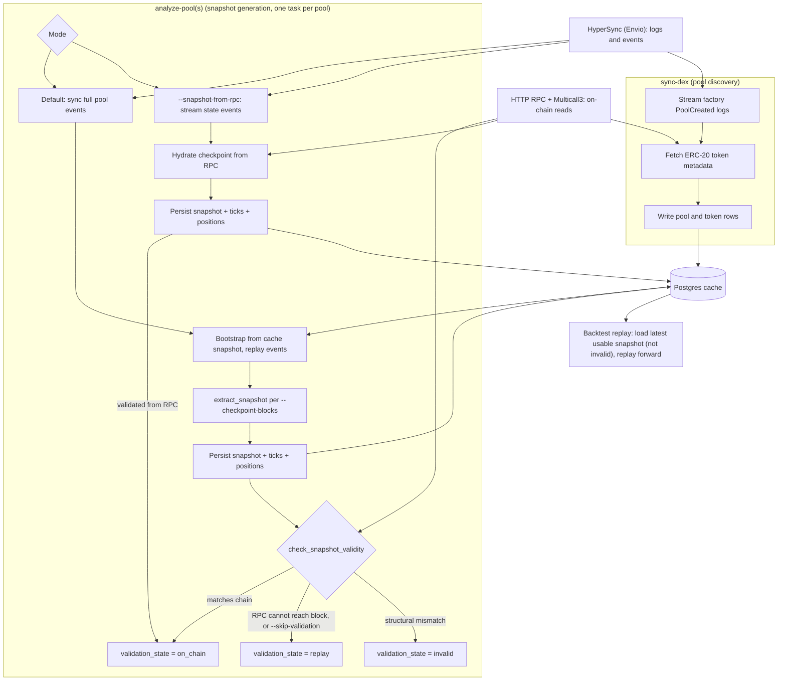

# Blockchain

## Overview

The blockchain adapter ingests DeFi data from EVM chains and exposes it through the
NautilusTrader data model. It also includes an execution client for locally signed Uniswap V3
market swaps. Fork tests exercise the supported path end to end on Arbitrum, but the execution
client is not production-ready. The adapter uses three backends:

- HyperSync: high-throughput historical blocks and contract logs. See the
  [Envio HyperSync docs](https://docs.envio.dev/docs/HyperSync/hypersync-usage) for query shape,
  pagination, and tuning.
- HTTP RPC: contract calls, Multicall reads, and final on-chain state hydration.
- Postgres: optional durable cache state, pool metadata, decoded events, and snapshots.

## Capability status

| Capability                | Scope                                                                      | Readiness                                                     |
| ------------------------- | -------------------------------------------------------------------------- | ------------------------------------------------------------- |
| Historical blocks         | Any configured `Chain` with a reachable HyperSync endpoint.                | Available through the Rust service and `sync-blocks`.         |
| Live blocks               | HyperSync, or WSS RPC for chains with an RPC client.                       | Available through the Rust and Python data-client surfaces.   |
| DEX pool discovery        | Chain and DEX combinations with a registered pool-creation parser.         | Available through the data client and `sync-dex`.             |
| Pool snapshots and replay | Concentrated-liquidity integrations with the complete snapshot parser set. | Available with Postgres and the provider constraints below.   |
| Live pool events          | Registered swap, liquidity, collect, flash, and fee-protocol parsers.      | Available through the Rust and Python data-client surfaces.   |
| Transaction execution     | Locally signed Uniswap V3 BUY and SELL market swaps.                       | Experimental; not production-ready or exposed for Python use. |

Direct WSS RPC clients exist for Ethereum, Polygon, Base, Arbitrum, and BSC. Other configured chain
values can use HyperSync block history when their endpoint is reachable, but they do not support
WSS live mode.

### Chain and DEX command support

Command support is derived from the parsers registered for each chain and DEX. The CLI help for
`sync-dex` and `analyze-pool(s)` prints the same capability boundaries.

| Tier            | Meaning                                                      | DEXes                                               | Chains                                      |
| --------------- | ------------------------------------------------------------ | --------------------------------------------------- | ------------------------------------------- |
| Replay-ready    | Discovery, snapshot, and fee-protocol replay parsers.        | Uniswap V3 and PancakeSwap V3.                      | Ethereum, Base, Arbitrum, and BSC.          |
| Analysis only   | Snapshot parsers without CLI pool discovery.                 | Aerodrome Slipstream.                               | Base.                                       |
| Discovery only  | Pool discovery without the complete snapshot parser set.     | Uniswap V2 and Uniswap V4.                          | Ethereum, Base, and Arbitrum.               |
| Discovery only  | Pool discovery without the complete snapshot parser set.     | Camelot V3 and Fluid DEX.                           | Arbitrum.                                   |
| Registered only | Metadata registration without command-capable event parsers. | Curve Finance and Fluid DEX.                        | Ethereum.                                   |
| Registered only | Metadata registration without command-capable event parsers. | Aerodrome V1, BaseSwap V2, BaseX, and SushiSwap V3. | Base.                                       |
| Registered only | Metadata registration without command-capable event parsers. | Curve Finance, SushiSwap V2, and SushiSwap V3.      | Arbitrum.                                   |
| Blocks only     | No DEX registration; `sync-blocks` remains available.        | -                                                   | Other configured chains, including Polygon. |

`sync-dex` requires a pool-creation parser. `analyze-pool(s)` requires Initialize, Swap, Mint,
Burn, and Collect parsers. Replay-ready integrations also parse `SetFeeProtocol`; integrations
with a `CollectProtocol` parser can replay protocol-fee withdrawals.

Aerodrome Slipstream has no pool-creation parser, and the CLI has no separate pool-registration
command. Analysis works only when its pool and token metadata already exist in the cache through
another integration path. Its replay-derived snapshots cannot be validated against on-chain state.
Registered-only DEXes are omitted from command help and fail the relevant capability check.

### Interface availability

| Surface                               | Rust                                      | Python                     | CLI                                      |
| ------------------------------------- | ----------------------------------------- | -------------------------- | ---------------------------------------- |
| Data configuration and factory        | Public config and factory.                | Public config and factory. | -                                        |
| Live data subscriptions               | Data-client subscription API.             | LiveNode data-client API.  | -                                        |
| Block sync, discovery, and analysis   | Adapter services.                         | -                          | `sync-blocks`, `sync-dex`, and analysis. |
| Stored snapshot loading               | Cache API.                                | `load_pool_snapshot`.      | -                                        |
| Execution configuration               | Public config.                            | Configuration types only.  | -                                        |
| Execution factory and order routing   | Public factory and client.                | -                          | -                                        |
| Preflight, wrap, approve, and storage | Direct `BlockchainExecutionClient` calls. | -                          | -                                        |

The Python module does not register or export `BlockchainExecutionClientFactory`, so Python
LiveNode configuration cannot instantiate the execution client.

### Examples

Runnable data-client examples are available for both public language surfaces:

- [Rust LiveNode data tester](../../crates/adapters/blockchain/examples/node_data_tester.rs).
- [Python data tester](../../examples/live/blockchain/data_tester.py).
- [Python LiveNode example](../../examples/live/blockchain/node_test.py).

The repository does not provide a maintained runnable execution setup example. Build execution
integrations in Rust and apply the constraints in [Execution](#execution).

## Core primitives

The DeFi domain model lives in `nautilus_model::defi`.

### Chain

`Chain` defines the target blockchain and its default service endpoints.

| Field                      | Type             | Description                                                        |
| -------------------------- | ---------------- | ------------------------------------------------------------------ |
| `name`                     | `Blockchain`     | Chain enum value, such as `Ethereum` or `Arbitrum`.                |
| `chain_id`                 | `u32`            | EVM chain ID, such as `1` for Ethereum.                            |
| `hypersync_url`            | `String`         | HyperSync endpoint, by default `https://{chain_id}.hypersync.xyz`. |
| `rpc_url`                  | `Option<String>` | Optional direct RPC endpoint stored on the chain model.            |
| `native_currency_decimals` | `u8`             | Native gas token decimal precision, usually `18`.                  |

Chains can be loaded by numeric ID with `Chain::from_chain_id` or by name with
`Chain::from_chain_name`.

| Chain family     | Code | Name         | Decimals |
| ---------------- | ---- | ------------ | -------- |
| Ethereum and L2s | ETH  | Ethereum     | 18       |
| Polygon          | POL  | Polygon      | 18       |
| Avalanche        | AVAX | Avalanche    | 18       |
| BSC              | BNB  | Binance Coin | 18       |

### DEX and pools

DEX integrations register:

- Factory addresses.
- Event signatures and parser functions.
- AMM type.

Pool definitions bind the chain and DEX to a pool contract address or protocol pool ID to form a
stable Nautilus instrument ID. The token pair, fee tier, tick spacing, and creation block remain
pool metadata.

When the data engine processes a pool definition, it caches and publishes a `CurrencyPair` under
the same pool instrument ID. The instrument keeps the raw pool `token0`/`token1` order as base/quote,
derives price and size precision from token decimals up to `FIXED_PRECISION`, and exposes the fee
tier divided by 1,000,000 as `taker_fee`. Distinct pool identifiers let same-token pools coexist in
the cache and on the message bus.

Uniswap V3 and compatible concentrated-liquidity pools also use:

- `Initialize(uint160,int24)` for initial price state.
- `Mint` and `Burn` events for position and tick state replay.
- `Swap` events for live pool price movement.
- HTTP RPC final-state reads for `slot0`, liquidity, active ticks, and position data.

## Data client configuration

| Option                            | Default                       | Description                                            |
| --------------------------------- | ----------------------------- | ------------------------------------------------------ |
| `chain`                           | Required                      | Target `Chain`, such as Ethereum or Arbitrum.          |
| `dex_ids`                         | `[]`                          | DEX integrations to register and sync.                 |
| `http_rpc_url`                    | Required                      | HTTP RPC endpoint for contract reads and Multicall.    |
| `wss_rpc_url`                     | `None`                        | WSS endpoint; required for RPC live streams.           |
| `rpc_requests_per_second`         | `None`                        | Optional RPC request throttle.                         |
| `multicall_calls_per_rpc_request` | `200`                         | Requested maximum Multicall targets per RPC request.   |
| `use_hypersync_for_live_data`     | Rust: `false`; Python: `true` | When true, live block and event streams use HyperSync. |
| `from_block`                      | `None`                        | Optional start block for historical sync.              |
| `pool_filters`                    | `DexPoolFilters()`            | Pool universe filtering rules.                         |
| `postgres_cache_database_config`  | `None`                        | Optional Postgres cache configuration.                 |
| `proxy_url`                       | `None`                        | Optional HTTP and WebSocket proxy URL.                 |
| `transport_backend`               | `Sockudo`                     | WebSocket transport backend.                           |

:::note
Pool snapshot requests require a Postgres cache database. The in-memory cache can hold
tokens and pools, but latest pool profiler bootstrap reads snapshot and event state through the
cache database path.
:::

## Environment

Set credentials outside the repository:

```bash
export ENVIO_API_TOKEN="<envio-token>"
export RPC_HTTP_URL="https://your-rpc.example"
export RPC_WSS_URL="wss://your-rpc.example"
```

For local `.env` usage, keep the file out of version control:

```dotenv
ENVIO_API_TOKEN=<envio-token>
RPC_HTTP_URL=https://your-rpc.example
RPC_WSS_URL=wss://your-rpc.example
```

- `ENVIO_API_TOKEN` is required by the Rust HyperSync client. Missing or malformed tokens fail
  client construction before any query is sent.
- `RPC_HTTP_URL` or `--rpc-url` is required for contract reads and snapshot hydration.
- `RPC_WSS_URL` is required when `use_hypersync_for_live_data = false`; that mode uses WSS RPC live
  streams.

Execution adds further variables (see [Execution](#execution)):

- The signer private key is read from the variable named by the `signer_private_key_env`
  configuration field, never from configuration directly.
- Signed-payload protection reads the active and retired 32-byte keys from the variables named by
  `payload_key_env` and `payload_key_retired_env`. These configuration fields contain variable names,
  never key values.

For token setup and quota details, see Envio's
[HyperSync API token docs](https://docs.envio.dev/docs/HyperSync/api-tokens).

### RPC provider requirements

`RPC_HTTP_URL` or `--rpc-url` must point at an EVM JSON-RPC endpoint for the target chain.
The data client uses it for contract reads, and first-time pool syncs read on-chain state through it.
The client reads the HyperSync endpoint from `Chain::hypersync_url`; built-in chains default to
`https://{chain_id}.hypersync.xyz`.

Choose an RPC provider that supports the intended target blocks and Multicall workload. Provider
labels are not sufficient evidence of archive access: verify an `eth_getCode` or `eth_call` against
the historical block the workflow will use. Returning the block header alone does not prove that
historical contract state is available. Large pools may also require higher payload, gas, timeout,
and request-rate limits.

Archive support affects validation, not whether event sync runs:

- On an archive node, a historical-block snapshot validates against on-chain state and is stored with
  `validation_state = on_chain`.
- On a non-archive node, the historical read fails and the snapshot stays `validation_state = replay`,
  which is still usable as a replay start point.
- A first-time sync on a non-archive node must use a recent `--to-block`, because bootstrap reads
  on-chain state at the target block and non-archive nodes serve only recent state.

## Local services

The development Docker Compose file starts Postgres, Redis, and pgAdmin. To create the containers,
wait for Postgres, and initialize the database schema, run:

```bash
make init-services
```

Use `make start-services` to start an initialized stack. Run `make init-db` to initialize or reapply
the Postgres schema.

The local Postgres defaults are:

| Field    | Value            |
| -------- | ---------------- |
| Host     | `127.0.0.1:5432` |
| Database | `nautilus`       |
| User     | `nautilus`       |
| Password | `pass`           |

Check that the schema exists:

```bash
docker exec nautilus-database psql -U nautilus -d nautilus -Atc \
    "select count(*) from information_schema.tables where table_schema='public'"
```

Pool snapshot generation and snapshot requests require a schema-initialized Postgres cache. Pool
discovery and snapshot generation write `token`, `pool`, `pool_*_event`, `pool_snapshot`,
`pool_position`, and `pool_tick` rows. Use a dedicated database or resettable Docker volume for
repeatable or destructive data workloads.

## Data flow

### Architecture

`sync-dex` discovers and stores pools and tokens. `analyze-pool(s)` then generates `pool_snapshot`
rows. The diagram shows the default replay path and the `--snapshot-from-rpc` path.


```mermaid
flowchart TD
    HS["HyperSync (Envio): logs and events"]
    RPC["HTTP RPC + Multicall3: on-chain reads"]
    PG[("Postgres cache")]

    subgraph discovery["sync-dex (pool discovery)"]
        direction TB
        D1["Stream factory PoolCreated logs"]
        D2["Fetch ERC-20 token metadata"]
        D3["Write pool and token rows"]
        D1 --> D2 --> D3
    end

    subgraph analyze["analyze-pool(s) (snapshot generation, one task per pool)"]
        direction TB
        AP0{"Mode"}
        AP1["Default: sync full pool events"]
        AP2["Bootstrap from cache snapshot, replay events"]
        AP3["extract_snapshot per --checkpoint-blocks"]
        AP4["Persist snapshot + ticks + positions"]
        AP5{"check_snapshot_validity"}
        RP1["--snapshot-from-rpc: stream state events"]
        RP2["Hydrate checkpoint from RPC"]
        RP3["Persist snapshot + ticks + positions"]
        AP0 --> AP1 --> AP2 --> AP3 --> AP4 --> AP5
        AP0 --> RP1 --> RP2 --> RP3
        AP5 -->|"matches chain"| V1["validation_state = on_chain"]
        AP5 -->|"RPC cannot reach block, or --skip-validation"| V2["validation_state = replay"]
        AP5 -->|"structural mismatch"| V3["validation_state = invalid"]
        RP3 -->|"validated from RPC"| V1
    end

    R["Backtest replay: load latest usable snapshot (not invalid), replay forward"]

    HS --> D1
    RPC --> D2
    D3 --> PG
    HS --> AP1
    HS --> RP1
    PG --> AP2
    AP4 --> PG
    RP3 --> PG
    RPC --> AP5
    RPC --> RP2
    PG --> R
```

`analyze-pools` runs one task per pool, bounded by `--concurrency`. Each task owns its data client.
A snapshot is usable as a replay start point unless its `validation_state` is `invalid`.

### Data-client surface

The public data client supports these DeFi subscriptions and requests:

| Surface           | Commands                                                           | Behavior                                                                                           |
| ----------------- | ------------------------------------------------------------------ | -------------------------------------------------------------------------------------------------- |
| Blocks            | `SubscribeBlocks`, `UnsubscribeBlocks`                             | Starts or stops the shared HyperSync or WSS RPC block feed.                                        |
| Complete pool     | `SubscribePool`, `UnsubscribePool`                                 | Selects swaps, mints, burns, collects, flashes, and both fee-protocol event types.                 |
| Pool swaps        | `SubscribePoolSwaps`, `UnsubscribePoolSwaps`                       | Selects swap events for one pool instrument.                                                       |
| Liquidity updates | `SubscribePoolLiquidityUpdates`, `UnsubscribePoolLiquidityUpdates` | Selects mint and burn events for one pool instrument.                                              |
| Fee collections   | `SubscribePoolFeeCollects`, `UnsubscribePoolFeeCollects`           | Selects collect events for one pool instrument.                                                    |
| Flash events      | `SubscribePoolFlashEvents`, `UnsubscribePoolFlashEvents`           | Selects flash events for one pool instrument.                                                      |
| Pool snapshot     | `RequestPoolSnapshot`                                              | Publishes the pool definition, then a usable snapshot when cache bootstrap and validation succeed. |

Subscriptions share the underlying block and DEX event feeds. Removing one subscription does not
stop a feed that another subscription still owns. Pool snapshot requests require Postgres because
bootstrap reads stored pool and event state through the cache database.

:::warning
DeFi pool definitions and account-state updates publish on typed message-bus routers. A
`subscribe_any` handler never receives them. Use `subscribe_defi_pools` and
`subscribe_account_state`, or the matching actor subscription APIs.
:::

### Pool discovery

Pool discovery:

- Streams DEX factory events from HyperSync.
- Fetches ERC-20 metadata through RPC.
- Stores valid tokens and pools in the cache.
- Skips invalid token metadata. `DexPoolFilters` can also exclude empty token metadata.

### Live data

- `use_hypersync_for_live_data = true`: subscribe to blocks through HyperSync for live timestamps
  and hold one open-ended HyperSync DEX-event stream per subscribed DEX filter.
- `use_hypersync_for_live_data = false`: use WSS RPC block and pool-log subscriptions for live
  swaps, liquidity updates, fee collections, flash events, and fee-protocol events.

### Snapshot bootstrap

For Uniswap V3-compatible snapshots, the default bootstrap replays stored pool events to rebuild
price, liquidity, ticks, positions, fees, and counters. Validation then reads on-chain state through
HTTP RPC and Multicall.

Bootstrap modes:

- Default: store the full pool event history up to the target block, then bootstrap from the
  database.
- `--snapshot-from-rpc`: skip full swap storage, stream Initialize, Mint, Burn, SetFeeProtocol, and
  CollectProtocol events from HyperSync to enumerate ticks and positions, then hydrate the exact
  checkpoint block from RPC.

Use `--snapshot-from-rpc` for old high-volume pools when the required output is the final snapshot,
not a stored swap history. It cannot be combined with `--from-block`, `--reset`, or
`--require-existing-snapshot`.

In `--snapshot-from-rpc` mode, final RPC hydration is the source of the checkpoint state. If it
fails, the command fails instead of emitting a replayed snapshot with stale price state.

### Snapshot validation

For a replay-derived snapshot, bootstrap compares the profiler against on-chain state before
marking it valid.

| Class          | Fields                                                                      | Mismatch result                                |
| -------------- | --------------------------------------------------------------------------- | ---------------------------------------------- |
| Structural     | Current tick, active liquidity, per-tick liquidity, and position liquidity. | Store `invalid`; exclude from default loading. |
| Non-structural | Sqrt price, fee protocol, and protocol-fee balances.                        | Warn and accept the snapshot as `on_chain`.    |

Non-structural differences can arise because event replay is transaction-scoped while an RPC
snapshot is block-scoped, a fork or replay range omits a fee-protocol update, or replay rounding
differs from the on-chain fee accumulator. Accepting those fields matches backtest replay behavior.

### Snapshot bootstrap guard

Use `--require-existing-snapshot` when analysis should run only from the local snapshot cache:

- Checks for the latest usable `pool_snapshot` at or before the target block.
- Returns `needs_bootstrap` if no usable snapshot exists.
- Treats an empty creation-block snapshot with no positions or ticks as unusable.
- Skips the creation-to-target bootstrap for that pool.

#### Analysis output

`analyze-pool(s)` prints:

- One JSON result per `--checkpoint-blocks` entry.
- One JSON result at `--to-block` when no checkpoints are given.

A pool that needs a first-time bootstrap has this shape:

```json
{
  "chain": "Ethereum",
  "dex": "UniswapV3",
  "pool_address": "0x1111111111111111111111111111111111111111",
  "target_block": 25218797,
  "status": "needs_bootstrap"
}
```

A successful result includes `validation_state`:

- `on_chain`: hydrated and matched against chain.
- `replay`: replay-derived or unchecked, still usable as a replay start point.
- `invalid`: hydrated and mismatched, not usable.

```json
{
  "chain": "Ethereum",
  "dex": "UniswapV3",
  "pool_address": "0x1111111111111111111111111111111111111111",
  "target_block": 25218797,
  "status": "success",
  "snapshot_block": 25218790,
  "positions": 2,
  "ticks": 7,
  "validation_state": "replay",
  "already_valid": false,
  "liquidity_utilization_rate": 0.25
}
```

### Checkpoints and concurrency

- `--checkpoint-blocks b1,b2,...`: produces snapshots in one bootstrap pass. Blocks are sorted,
  deduped, and clamped to `--to-block`.
- `--concurrency`: controls `analyze-pools` parallelism. Default: `4`.
- `--skip-validation`: skips the on-chain compare and keeps replay-derived snapshots as `replay`.
- `--snapshot-from-rpc`: hydrates from chain at the checkpoint block and records snapshots as
  `on_chain`.

Snapshot keys:

- Default mode: keyed to the last pool event at or before the checkpoint. Checkpoints with no events
  between them can share one stored row.
- `--snapshot-from-rpc`: keyed to the requested checkpoint block with a block-scoped sentinel
  transaction/log index.

### Backtest replay

Backtest replay needs a snapshot in the input data. The adapter does not service live snapshot
requests during backtests.

`load_pool_snapshot` reads a full snapshot, including positions and ticks, from Postgres:

```python
from nautilus_trader.adapters.blockchain import load_pool_snapshot

snapshot = load_pool_snapshot(
    pg_config=postgres_config,
    chain_id=chain_id,
    pool_address=pool_address,
    before_block=replay_start_block,  # latest snapshot at or before this block
)
```

Replay rules:

- By default, snapshots marked `invalid` are excluded; both `on_chain` and `replay` snapshots can
  be returned. Pass `require_valid=False` only when the caller also accepts `invalid` snapshots.
- Treat `None` as setup failure. Do not replay without profiler state.
- Wrap the result as `DefiData.PoolSnapshot(snapshot)` and pass it to
  `BacktestEngine.add_defi_data` with the pool events.
- Replay every pool event from the snapshot block forward. Starting after the snapshot block can leave
  the profiler stale.

Cached block timestamps load into Nautilus data objects as UNIX nanoseconds. Cache rows written with
second-resolution block timestamps are normalized to nanoseconds when snapshots and pool events are
loaded, while nanosecond rows preserve their stored precision.

### Pool analysis constraints

`analyze-pool(s)` validates its prerequisites and reports each pool independently. These boundaries
also apply when the underlying analysis services are called from Rust.

| Condition                  | Behavior                                                                                 | Constraint                                                                                                       |
| -------------------------- | ---------------------------------------------------------------------------------------- | ---------------------------------------------------------------------------------------------------------------- |
| Missing pool metadata      | Fails with `Pool <address> is not registered`.                                           | Discover the pool first; analysis cannot infer or register metadata.                                             |
| Missing parser capability  | Fails before sync.                                                                       | Use a snapshot-capable combination from [Chain and DEX command support](#chain-and-dex-command-support).         |
| Non-checksummed address    | Fails with `Blockchain address '<address>' has incorrect checksum`.                      | Supply an EIP-55 address; factory `getPool` results may need checksum conversion.                                |
| Provider Multicall cap     | An `out of gas`, payload, or timeout error aborts final-state hydration.                 | Lower `multicall_calls_per_rpc_request` or use a provider with higher limits.                                    |
| Missing historical state   | A first bootstrap cannot read final state at an old `--to-block`.                        | Use a recent target or an archive-capable provider; see [RPC provider requirements](#rpc-provider-requirements). |
| Restricted HyperSync quota | High-activity pools back off, and a full first sync can require thousands of requests.   | Lower `--concurrency`, or use `--snapshot-from-rpc` when stored swap history is unnecessary.                     |
| Mid-life `--from-block`    | Omitting `Initialize` can leave the profiler without an initial price.                   | Sync from pool creation when generating a first snapshot.                                                        |
| No liquidity events        | `analyze-pool` errors; `analyze-pools` emits a failure result and continues other pools. | Select a pool with a Mint or Burn at or before the target block.                                                 |
| Any per-pool failure       | Emits `"status": "failure"` and makes `analyze-pool(s)` exit non-zero.                   | Use the exit code for the overall result and each JSON status for the per-pool result.                           |

Final RPC hydration in `--snapshot-from-rpc` mode is authoritative for checkpoint state. A failed
hydration aborts analysis rather than storing a snapshot with stale price state.

## Pool analysis operations

### Discover pools before analysis

`analyze-pool(s)` reads pool metadata from the Postgres cache and fails with
`Pool <address> is not registered` when the pool has not been discovered. Run `sync-dex` for the
chain and DEX before analysis to populate the `pool` and `token` tables.

### Check command support

Use [Chain and DEX command support](#chain-and-dex-command-support) or the command help before
starting a sync. `sync-dex` and `analyze-pool(s)` reject unsupported chain and DEX combinations
before querying events, rather than returning an empty result.

```bash
./target/debug/nautilus blockchain sync-dex --help
./target/debug/nautilus blockchain analyze-pools --help
```

### Use checksummed pool addresses

Pool addresses must use the EIP-55 checksum. A lowercase address fails with
`Blockchain address '<address>' has incorrect checksum`. Convert discovered addresses to checksum
form before passing `--address` or adding them to an addresses file.

### Reduce the Multicall request size

An RPC provider can reject a large final-state Multicall with an out-of-gas, payload, or timeout
error. Lower `--multicall-calls-per-rpc-request` from its default of `200` to keep each request
within the provider's limits.

### Choose a target block the RPC provider can serve

A first-time sync reads on-chain state at `--to-block`. Use a recent target with a non-archive RPC
provider, or use a provider that serves contract state at the requested historical block. See
[RPC provider requirements](#rpc-provider-requirements).

### Control HyperSync request volume

A full first-time sync of a large or old pool can require thousands of requests. Lower
`--concurrency` when the configured token has a restrictive quota. Use `--snapshot-from-rpc` when
an exact checkpoint snapshot is sufficient and stored swap history is not required.

### Start an initial replay at pool creation

Starting `--from-block` in the middle of a pool's history can omit its `Initialize` event. Without
an initial price, snapshot bootstrap fails with
`Pool is not initialized and it doesn't contain initial price, cannot bootstrap profiler`. Sync
from pool creation when generating the first snapshot.

### Interpret pool failures

A pool without processed Mint or Burn events at or before the target block can lack the state needed
for a snapshot. `analyze-pool` returns the error. `analyze-pools` emits a JSON line with
`"status": "failure"`, continues with the other pools, and exits non-zero after any per-pool
failure. Use the process exit code for the overall result and each JSON status for individual
results.

## Runbook: validate a live pool sync

Use this procedure to check pool discovery, event parsing, and snapshot generation for one DEX on
one chain. The example uses PancakeSwap V3 on Arbitrum. It performs read-only chain queries and
writes only to the configured Postgres cache.

### Prerequisites

- Docker is available for the local Postgres service.
- `ENVIO_API_TOKEN` contains a valid HyperSync token.
- `RPC_HTTP_URL` points to an Arbitrum RPC provider that can serve the target block.
- `POOL_ADDRESS` contains an EIP-55 checksummed PancakeSwap V3 pool address.

### Start the local services and build the CLI

```bash
make init-services
cargo build -p nautilus-cli --features defi --bin nautilus
```

### Discover pools

Run discovery immediately before analysis when the local database has been reset:

```bash
./target/debug/nautilus blockchain sync-dex \
    --chain arbitrum \
    --dex PancakeSwapV3 \
    --rpc-url "$RPC_HTTP_URL" \
    --host 127.0.0.1 \
    --port 5432 \
    --username nautilus \
    --password pass \
    --database nautilus
```

### Analyze the pool

Keep concurrency at one for this validation run:

```bash
./target/debug/nautilus blockchain analyze-pools \
    --chain arbitrum \
    --dex PancakeSwapV3 \
    --address "$POOL_ADDRESS" \
    --rpc-url "$RPC_HTTP_URL" \
    --host 127.0.0.1 \
    --port 5432 \
    --username nautilus \
    --password pass \
    --database nautilus \
    --concurrency 1
```

### Check the stored data

Count the rows written for the pool in:

- `pool_swap_event`
- `pool_liquidity_event`
- `pool_collect_event`
- `pool_flash_event`
- `pool_fee_protocol_update_event`
- `pool_fee_protocol_collect_event`
- `pool_snapshot`
- `pool_position`
- `pool_tick`

Fee-protocol tables remain empty when the synced range contains no `SetFeeProtocol` or
`CollectProtocol` events. After a local database reset, rerun discovery before analysis so the pool
row exists. See [Pool analysis operations](#pool-analysis-operations) for address, provider,
replay-range, and request-volume failures.

## Contracts

### Base contract and Multicall3

`BaseContract` batches contract calls through Multicall3
(`0xcA11bde05977b3631167028862bE2a173976CA11`):

- Multicall uses `tryAggregate(requireSuccess: false)`, so each result reports its own success or
  failure and the contract wrapper decides whether to reject it.
- Reads execute against a single block context.
- Transport and provider failures surface as RPC errors.

### ERC-20 metadata

`Erc20Contract` reads `name`, `symbol`, and `decimals` through Multicall. The adapter can skip pools
whose token metadata is malformed, raw bytes, or empty.

### Uniswap V3 pools

`UniswapV3PoolContract` reads global pool state, active ticks, and positions.

- Large pools can exceed provider payload, gas, or timeout limits.
- RPC-snapshot hydration fails closed if the final-state read fails.
- Very large pools may need a lower `multicall_calls_per_rpc_request` or a stronger provider.

PancakeSwap V3 reuses the Uniswap V3 read contract because `slot0`, `ticks`, `positions`,
`liquidity`, and fee-growth reads share the same ABI. Fee-protocol encoding differs:

- Uniswap V3 packs two 4-bit fee denominators into one `uint8`.
- PancakeSwap V3 stores two 16-bit basis-point shares in `slot0.feeProtocol` and emits
  `SetFeeProtocol(uint32,uint32,uint32,uint32)`.
- PancakeSwap V3 snapshots store `fee_protocol0_basis_points` and
  `fee_protocol1_basis_points`, and replay computes protocol fees as `fee * basis_points / 10000`.

## Execution

:::warning
The execution client is not production-ready. `BlockchainExecutionClient` implements preflight,
explicit WETH wrap and ERC-20 approval, local EIP-1559 signing, durable reconciliation, and one
Uniswap V3 swap flow. Arbitrum Uniswap V3 is the only chain and DEX combination covered by
end-to-end fork tests. Other order operations fail closed with no on-chain or durable side effects.
:::

Execution uses these terms throughout this section:

| Term                | Meaning                                                                                                       |
| ------------------- | ------------------------------------------------------------------------------------------------------------- |
| Decision height     | The minimum fresh head accepted across all three RPC sources for one authorizing read set.                    |
| Verification source | One authoritative endpoint or one of exactly two read-only verifiers in a distinct configured failure domain. |
| Deployment manifest | Reviewed contracts, code hashes, proxy bindings, identities, pools, tokens, and permitted call edges.         |
| Intent              | One durable logical wrap, approve, or swap operation, independent of its transaction-hash history.            |
| Signer ownership    | Exclusive control of the wallet signer and, after assignment, its active nonce.                               |
| Finalized boundary  | The point where all sources agree on finalized ancestry through the transaction's inclusion block.            |

### Connection and account state

Client construction requires one authoritative RPC endpoint and exactly two read-only verification
providers. Each source needs a distinct endpoint, provider ID, operator ID, and pairwise-disjoint
set of failure-domain IDs.

#### Enforced operating conditions

- The authoritative execution endpoint and both verifier endpoints must use HTTPS. Cleartext HTTP
  is accepted only for a canonical IPv4 loopback literal in `127.0.0.0/8` or exactly `[::1]`.
  Hostnames, IPv4-mapped IPv6, private and link-local addresses, and noncanonical numeric forms do
  not qualify.
- HyperSync uses the same HTTPS rule. This validation runs before the HyperSync token is loaded or
  its client is created.
- Blockchain HTTP clients reject redirects. A canonical loopback RPC connection also bypasses
  configured and ambient proxies. Remote HTTPS execution RPC clients continue to honor ambient
  proxy environment variables.
- A Postgres-backed execution connection requires an active payload key, a stable deployment ID,
  ready protected storage, and every key referenced by stored envelopes. It authenticates every
  retained payload before loading the signer or making an execution RPC call.
- An attached Postgres database can be unprotected only while the client is disconnected for
  checks, protection, or rollback work. Rewrap requires protected storage. An unprotected database
  cannot provide execution capability.

#### Operator assumptions

A failure domain represents any shared upstream, reseller, gateway, proxy, account, network path,
or hosting control plane. Distinct URLs and distinct configured identities do not prove operational
independence. The operator must verify that the three providers do not share a control or failure
domain. The operator must also identify and monitor every party or governance mechanism that can
change a manifest-pinned deployment's code or a manifest-pinned proxy's implementation. If such a
deployment change or proxy upgrade is announced or suspected, stop execution and revoke every
outstanding allowance whose spender is a router address in the affected deployment. Complete the
revocations before the changed code or implementation is present at the decision block used for
signing. Once it is, the pre-sign deployment check fails closed for every client transaction,
including revocation. The operator must keep the signing key exclusive to one live client and
control access to the host environment, database, replicas, backups, and exports.

Connect completes these checks before it loads the signer:

1. Open the durable execution store. When Postgres is configured, require ready protected storage
   and authenticate every retained payload before loading any existing verification ledger.
1. Require all three sources to match the local chain ID and reviewed finalized checkpoint.
1. Extend or recheck the durable finalized-header ancestry in windows of at most 4,096 blocks.
1. Require an exact finalized-height signer nonce from all three sources.
1. Verify the reviewed deployment manifest at the finalized height. This includes runtime code,
   proxy slots, implementations, router and factory relationships, pool identity, token decimals,
   and the pinned quote contract.
1. Probe archive, finalized-tag, explicit-height state and call, gas, storage, quote, and call-trace
   capabilities on every source.
1. Atomically install the verification ledger or migrate retained execution history with the
   evidence that authorized each classification.
1. Load the private key from `signer_private_key_env`, require its address to equal
   `wallet_address`, and reconcile any active intent.
1. Read the native balance and configured ERC-20 balances, install the complete wallet snapshot,
   and publish one `AccountState` under the configured account ID.

Without Postgres, the client can connect and publish balances, but all transaction operations are
refused. A verification, migration, reconciliation, balance, or exact amount conversion failure
keeps the client disconnected. Any loaded signer is removed, the previous complete snapshot stays
installed, and no partial wallet state is published. Duplicate token symbols also reject the
snapshot because symbols define currency identity.

The verification providers never receive signed transaction bytes and have no broadcast method.
The authoritative endpoint alone receives `eth_sendRawTransaction`. Security-critical unsigned
reads that authorize a signature, rebroadcast, or durable transition go to all three sources.
Diagnostic preflight and connect-time balance publication use the authoritative endpoint and cannot
authorize execution. This protects integrity, not order confidentiality. Operators who need route
or amount confidentiality need a separate execution design.

Published balances use `total = free` and `locked = 0`. The wallet account applies local
reservations when it derives effective free and locked balances, as described in
[Wallet accounts](../concepts/accounting.md#wallet-accounts).

After the client starts, `QueryAccount` republishes the installed snapshot without another RPC
read. It fails when:

- The requested account ID differs from the client account ID.
- The client has not started.
- No complete snapshot exists.

Disconnect removes the signer and aborts in-flight submission tasks. Transaction operations reject
a disconnected client before any execution RPC call.

### Supported order slice

The client accepts one market-order shape:

| Axis        | Accepted                                                                                        | Rejected                                                              |
| ----------- | ----------------------------------------------------------------------------------------------- | --------------------------------------------------------------------- |
| Chain       | The chain configured on the execution client.                                                   | An instrument venue for another chain.                                |
| DEX         | Uniswap V3.                                                                                     | Every other DEX, including PancakeSwap V3.                            |
| Pool        | An address-based pool in `Cache::pool` with a fee tier.                                         | Unknown pools, V4 pool IDs, and pools without a fee tier.             |
| Order       | A single `MarketOrder` with side `BUY` or `SELL`.                                               | Non-market orders submitted through `SubmitOrder`.                    |
| Quantity    | Base-denominated size within `max_order_amount`; a BUY also needs a matching quote-spend limit. | Quote-denominated input or an amount above either applicable ceiling. |
| Orientation | Tokens with distinct model priorities.                                                          | A pair whose tokens have equal priority and are ambiguous.            |

The `InstrumentId` selects the pool, for example
`0xC6962004f452bE9203591991D15f6b388e09E8D0.Arbitrum:UniswapV3`. Its venue must parse as
`<Chain>:<DexType>`, and its symbol must parse as an address `PoolIdentifier`.
`Pool::get_base_token` and `Pool::get_quote_token` apply the model's token-priority convention:
stablecoins are quote assets, wrapped native assets have the next priority, and other tokens become
base assets against them. Equal `Token::get_token_priority` values are ambiguous and reject the
order.

Venue routing admits Uniswap V3 on any configured chain whose venue matches. Swap preparation also
requires a registered Uniswap V3 deployment and factory for that chain. Only Arbitrum Uniswap V3
has end-to-end adapter coverage, including the fork tests described below.

Order lists deny each open order with `OrderDenied`; modify, cancel, and batch-cancel commands
reject each referenced cached order with `OrderModifyRejected` or `OrderCancelRejected`; cancel-all
commands and order queries log a warning without an event. Mass status returns `Ok(None)` so
startup reconciliation logs and continues. Order, fill, and position report probes return an error
so LiveNode does not treat an empty answer as absence. These paths never sign, broadcast, or persist
an intent.

A swap stays `Submitted` until finality, and venue status queries cannot resolve it. Set
`inflight_check_interval_ms = 0` and leave open-order checks off. The engine's default in-flight
timeout would otherwise reject a live swap.

Execution routing follows Nautilus's multi-venue broker pattern because the client represents a
wallet and RPC connection for one chain while each instrument venue identifies both its chain and
DEX. A strategy may select the client explicitly through `client_id`; node configuration may instead
register the client for instrument venues through `RoutingConfig.venues` or use it as the default
execution client. After client selection, `ExecutionClient::handles_order_venue` accepts only a
venue whose parsed chain matches the client configuration and whose DEX is supported by the client.
The instrument retains its `<Chain>:<DexType>` venue rather than being rewritten to `BLOCKCHAIN`.

The order maps to a single `exactInputSingle` call on the original Uniswap SwapRouter (the
deployment whose signature carries a deadline). `allowed_token_pairs` is directional
`(token_in, token_out)`: a SELL requires the base-to-quote pair, and a BUY requires the
quote-to-base pair. Listing only one direction does not admit the other.

| Parameter           | Source                                                                                     |
| ------------------- | ------------------------------------------------------------------------------------------ |
| `tokenIn`           | SELL: pool base token. BUY: pool quote token.                                              |
| `tokenOut`          | SELL: pool quote token. BUY: pool base token.                                              |
| `fee`               | Pool fee tier.                                                                             |
| `recipient`         | Execution wallet address.                                                                  |
| `deadline`          | Verified decision-header timestamp plus configured `deadline_seconds`.                     |
| `amountIn`          | SELL: `Quantity` as raw base units. BUY: quote input from the verified exact-output quote. |
| `amountOutMinimum`  | Derived from the verified quote at the decision height (see below).                        |
| `sqrtPriceLimitX96` | `0` (slippage is bounded by `amountOutMinimum`).                                           |

### BUY quote-spend limits

Every BUY needs one `quote_spend_limits` entry for its directed quote-to-base pair. The entry repeats
the quote-token address and decimals beside `max_amount`, a base-10 string in the token's raw units.
Client construction rejects a second entry for the same directed pair, a `spend_token` that differs
from `token_in`, a `max_amount` that is not a base-10 unsigned integer within the `U256` range, and
pairs outside `allowed_token_pairs`. Order preparation also checks the configured token and decimals
against the selected pool (see [Execution configuration](#execution-configuration) for an example
entry).

The client compares the independently verified exact-output quote's `amountIn` with this limit
before signing. Equality is accepted; a quote one raw unit above the limit is denied.
`max_order_amount` remains a separate ceiling on the submitted base quantity, and SELL orders do
not use `quote_spend_limits`.

### Slippage protection

`amountOutMinimum` is always derived, never caller-supplied:

1. Require an initialized `PoolProfiler` with a processed event watermark in the shared engine cache
   (`Cache::pool_profiler`). Its local simulation must consume the full SELL input or produce a
   nonzero BUY input, but its amount does not set a signed field. A live data-side subscription
   normally maintains this state.
1. Choose a decision height from the minimum fresh head reported by the three sources. The head
   skew must remain within `verification.chain_anchor.max_head_skew_blocks`.
1. Require the profiler watermark to include the block hash observed during ingestion. All three
   sources must return that exact explicit-height header. A block-scoped snapshot must also carry
   the header hash as its snapshot identifier.
1. For an event watermark, require a successful canonical receipt whose transaction, block, and
   index metadata match the profiler position. The selected log must come from the expected pool
   and use a supported pool-event signature.
1. Verify one unanimous parent-linked ancestry from the profiler height through the decision
   height. The distance must not exceed `max_quote_age_blocks`, which must be in `1..=4095`.
1. Call the manifest-pinned `IQuoterV2` contract at the decision height through all three sources.
   SELL uses `quoteExactInputSingle`; BUY uses `quoteExactOutputSingle`. The full decoded result
   must agree, including amount, resulting square-root price, initialized ticks crossed, and gas
   estimate.
1. Immediately before signing, reread the checkpoint, profiler header, decision header, ancestry,
   and quote. An unavailable or changed result blocks signing.
1. For SELL, compute `amountOutMinimum` from the verified exact-input output. For BUY, use the
   verified exact-output input as `amountIn` and derive `amountOutMinimum` from the requested base
   output. Integer arithmetic rejects a zero minimum.

Profiler divergence can request a data refresh, but it cannot override a verified quote or weaken
the signed limits.

The slippage comes from the `slippage_bps` configuration field, overridable per order through a
`slippage_bps` entry in the submit command's `params`; an override above the `max_slippage_bps`
ceiling is rejected before signing.

Pre-upgrade event rows can lack an ingestion block hash because the schema migration does not
backfill one. Such rows cannot authorize execution. Refresh the traded pool through the normal live
data subscription, or resync its events and rebuild its snapshot, before submitting an order.

### Preflight, wrapping, and approval

Preflight, WETH wrapping, and router approval are explicit operations on the client, separate from
`submit_order`:

| Operation | State change                       | Pre-broadcast checks                                                                                                        | Completion check                                    |
| --------- | ---------------------------------- | --------------------------------------------------------------------------------------------------------------------------- | --------------------------------------------------- |
| Preflight | None.                              | Authoritative chain, deployed-code, balance, allowance, and current-fee diagnostics.                                        | Returns a structured, sanitized report.             |
| Wrap      | Calls WETH `deposit()` with value. | Verified decision ancestry, deployment, WETH balance, native balance, gas, fee, nonce, and explicit-height simulation.      | WETH balance increased by the exact wrapped amount. |
| Approve   | Calls `approve(router, amount)`.   | Wrap checks plus router policy, factory and WETH identity, input-token membership, zero allowance, and approval simulation. | Allowance at the inclusion block equals the target. |

Preflight resolves the pool from `Cache::pool`. Its report contains no RPC URL, private key, or raw
signed transaction. It reports the expected and observed chain IDs, pool, router and token code
checks, token balances and allowances, native balance, base and priority fees, the derived maximum
fee, whether the fee stays within its ceiling, overall readiness, and every failed check.

Approve rejects a standard `false` return and accepts tokens that return no data. A nonzero
approval is limited to configured input tokens and requires the existing allowance to be zero.
With `unlimited_approval`, every nonzero request targets `U256::MAX`. The final allowance must equal
the target exactly. A zero request revokes an allowlisted router even when router deployment
metadata is unavailable, so a broken router check cannot prevent revocation.

During an uninterrupted call, wrap and approve use the shared EIP-1559 path, persist the intent and
signed hash before broadcast, and return after stable finality and the operation's postcondition.
Wrap compares the WETH balance immediately before and at the inclusion block, which avoids a stale
pre-broadcast baseline. A failed postcondition returns an error after finality, so the transaction
may still have changed on-chain state.

Before signing a swap, order submission requires exact agreement from all three sources for:

- The decision header and parent-linked ancestry from the durable finalized ledger.
- The deployment manifest at the decision height, including every configured code hash, proxy
  binding, and role probe.
- The router reports the registered factory and configured WETH, and the factory resolves the
  exact pool for the input token, output token, and fee tier.
- Both tokens report the decimals stored in the reviewed manifest.
- The manifest-pinned quote contract returns one exact quote.
- Router allowance and input-token balance sufficient for the raw input amount.
- Native balance sufficient for transaction value plus the maximum gas cost.
- Canonical and pending nonce observations that agree with the durable nonce ledger.
- The maximum gas estimate, median priority fee, and local gas and fee ceilings.

The decision header supplies the deadline, quote-age boundary, durable `created_block`, and
EIP-1559 base fee. State, call, code, storage, gas, balance, and allowance reads use its explicit
block number. Immediately before local signing, the client repeats the chain, header, ancestry,
deployment, quote, canonical nonce, and pending nonce checks. It persists this evidence atomically
with nonce assignment. A failure before signing produces `OrderDenied` and no broadcast. The
client releases its preparation slot only after the durable recoverable transition succeeds; a
failed transition keeps ownership for reconciliation.

The input token is the base token for a SELL and the quote token for a BUY. Preflight readiness
still reports the base-token allowance used by SELL setup. A BUY needs a separate quote-token
approval; submission denies the order if that allowance or balance is short.

Submission never wraps or approves. An insufficient allowance or balance emits `OrderDenied`.

### Transaction signing and broadcast

#### Local signing

The client builds and signs EIP-1559 typed transactions locally with Alloy:

- It builds `alloy::consensus::TxEip1559` with the chain ID, nonce, gas, fees, destination, value,
  and calldata.
- It signs `SignableTransaction::signature_hash()` with
  `alloy::signers::local::PrivateKeySigner`, producing `Signed<TxEip1559>`.
- It encodes the EIP-2718 envelope with
  `alloy::eips::eip2718::Encodable2718::encoded_2718()` and sends the raw bytes through
  `eth_sendRawTransaction`.

The private key comes from the environment variable named by `signer_private_key_env`. It is never
logged, serialized, or stored in configuration. Zeroizing buffers hold the temporary key text and
decoded bytes while the signer is constructed. The client supports one signer, whose derived
address must match `wallet_address` at connect.

#### Signer and nonce ownership

At most one transaction can be in flight across wraps, approvals, and swaps:

- The client claims the local slot before the first preparation RPC call.
- The durable canonical nonce comes from unanimous explicit finalized-height reads. Pending nonce
  is an additional mempool observation and never proves canonical consumption.
- A new signature requires canonical nonce `N`, no unexplained pending use, and an intent that can
  atomically own `N` with its verification evidence.
- A preparation failure releases the slot only when no signature exists.
- After signing, the slot stays claimed through persistence, broadcast, finality, and required
  order-event persistence.
- A persistence error keeps the slot claimed because Postgres may have committed before the client
  lost the acknowledgement.
- Cancelling an operation during persistence or broadcast does not release the slot and admit a new
  transaction.

Fee and gas policy also runs before signing:

- All paths use the unanimous decision header's base fee. Three priority-fee values select the
  median before `base_fee_buffer_bps` is applied. The client rejects a derived fee above
  `max_fee_per_gas_wei`.
- All three sources estimate the exact unsigned transaction at the decision height. The client
  selects the maximum estimate, applies `gas_buffer_bps`, and rejects a result above `gas_limit`;
  it does not clamp the estimate.

#### Persist before broadcast

The client reserves a durable intent before it assigns a nonce or signs. It then stores the nonce,
an authenticated signed-payload envelope, and the local hash before broadcast. A transaction
cannot be submitted without a ready protected durable store.

Immediately before sending, the client records the `broadcast` transition. Any outcome after that
write, including a node rejection, is treated as uncertain until canonical nonce and receipt
observation resolves it. A signed intent without a durable broadcast transition remains active and
blocks connect pending explicit recovery. The adapter has no automated recovery command or client
method for that state. An operator must inspect the durable `execution_intent` and
`execution_transaction_hash` records and make an explicit, reviewed recovery decision; the adapter
does not release the signer slot or resend the transaction automatically. A durable `broadcast`
intent may resend only its exact persisted bytes before observation resumes.

Broadcast and receipt handling follow these rules:

- Each execution JSON-RPC request has a 10-second timeout. Errors omit the endpoint URL, request
  payload, and signed bytes.
- `already known` counts as acceptance.
- A timeout, reset, node rejection, unreadable response, or returned hash that differs from the
  signed hash enters reconciliation under the persisted intent.
- Three null receipts are retryable. Partial propagation is retryable. Conflicting present
  receipts are disagreement and cannot authorize a state change.
- Receipt observation retries transient RPC errors within the configured finality poll window.
- Poll exhaustion records `dropped` and leaves the signer slot occupied.
- Exact-byte rebroadcast uses only the authenticated retained envelope. Before sending it again,
  all three sources must verify the chain, ancestry, deployment, canonical and pending nonce,
  receipt absence, and purpose-specific explicit-height simulation. Only the authoritative source
  receives the bytes.

### Risk and validation boundaries

Generic pre-trade risk stays in the engine. Venue-specific gates live in the adapter as a
configuration-driven limiter:

| Check                 | Boundary       | Enforcement                                                                                                      |
| --------------------- | -------------- | ---------------------------------------------------------------------------------------------------------------- |
| Chain identity        | Adapter        | Reviewed checkpoint, three-source chain ID, fresh headers, and parent-linked ancestry                            |
| Deployment identity   | Adapter + risk | Reviewed code hashes, proxy bindings, role probes, pool identity, and inclusion call graph                       |
| Token-pair allowlist  | Risk (adapter) | Directional pairs for swaps; input-token membership for nonzero approvals                                        |
| Order amount          | Risk (adapter) | `max_order_amount` on submitted base quantity; pair-specific `quote_spend_limits` on verified BUY quote input    |
| Quote provenance      | Adapter        | Canonical profiler watermark, bounded ancestry, pinned QuoterV2 result, and final pre-signature recheck          |
| Gas and fee           | Risk (adapter) | Maximum three-source gas estimate, median priority fee, and local `gas_limit` and `max_fee_per_gas_wei` ceilings |
| Balance sufficiency   | Adapter + risk | Explicit-height three-source input-token and native balance checks                                               |
| Allowance sufficiency | Adapter        | Explicit-height three-source router allowance checks                                                             |
| Slippage              | Risk (adapter) | `max_slippage_bps` ceiling and verified quote-derived minimum output                                             |
| In-flight limit       | Adapter + DB   | Local slot plus durable canonical nonce and signer ownership                                                     |

Every limiter rejection refuses the order before signing and reports a structured reason.

### Order events

Order submission emits only events justified by known transaction state:

| Observation                                                | Event             | Result                                                                                                                                                                                                                           |
| ---------------------------------------------------------- | ----------------- | -------------------------------------------------------------------------------------------------------------------------------------------------------------------------------------------------------------------------------- |
| Failure before the persisted broadcast transition.         | `OrderDenied`     | No transaction left the client.                                                                                                                                                                                                  |
| Persisted broadcast attempt, including an ambiguous reply. | `OrderSubmitted`  | The signed intent remains the observation authority.                                                                                                                                                                             |
| Verified finalized revert.                                 | `OrderRejected`   | The stable event ID and terminal marker permit signer release.                                                                                                                                                                   |
| Finalized transaction, trace, or deployment mismatch.      | No terminal event | The client refuses to derive a fill and keeps signer ownership quarantined.                                                                                                                                                      |
| Verified finalized success with exact transaction and log. | `OrderFilled`     | Wallet refresh and marker persistence then complete the intent. A BUY that executes below the order quantity also emits `OrderCanceled` for the remainder. A BUY that executes above the order quantity reports the full output. |
| Timeout, disagreement, unavailable read, or reorg.         | No terminal event | The order stays submitted and signer ownership remains occupied.                                                                                                                                                                 |

A successful receipt at first inclusion does not emit a fill. The client waits for the stable
finalized boundary described below.

### Persistence and reconciliation

#### Durable record model

Execution schema version 2 separates the logical wallet operation from its physical transaction
hashes. Verification schema version 2 adds the canonical nonce, finalized header, decision
evidence, and replacement-scan ledgers:

| Record            | Represents                                              | Recovery use                                                        |
| ----------------- | ------------------------------------------------------- | ------------------------------------------------------------------- |
| Intent            | One logical `wrap`, `approve`, or `swap` operation.     | Owns signer, nonce, call fields, order identity, and markers.       |
| Hash history      | Authenticated signed envelopes and their hashes.        | Selects the current hash and stores receipt observations.           |
| Transition        | Append-only status history for an intent and hash.      | Records observations; recovery reads current intent and hash state. |
| Canonical nonce   | Next signer nonce proven at a finalized height.         | Prevents pending mempool state from releasing or skipping a nonce.  |
| Finalized headers | Parent-linked headers from the reviewed checkpoint.     | Resumes ancestry and bounded replacement scans.                     |
| Decision evidence | Sanitized results for each authorizing verification.    | Proves which read class authorized a durable transition.            |
| Scan cursor       | Last fully scanned finalized replacement-search height. | Resumes multi-window scans and rescans the unfinalized tail.        |

`purpose` is an adapter-local execution field with the values `wrap`, `approve`, and `swap`. It
tells reconciliation whether the intent also owns a Nautilus order lifecycle. It is not a field in
the generic Nautilus order or `SubmitOrder` specification.

The schema keeps the legacy execution transaction table. Its connect-time migration:

- Takes an exclusive lock on the legacy table.
- Refuses unresolved legacy rows that cannot be mapped safely.
- Fences legacy writes after schema version 2 activates.
- Preserves existing data.

The first connection after enabling independent verification also classifies every retained
execution intent. It authenticates every retained payload before remote reconstruction. An
unsigned active `prepared` intent becomes inactive `recoverable`. A signed active intent at the
canonical nonce remains active for reconciliation. A consumed nonce requires archive proof of its
receipt, finalized ancestry, full transaction identity, call trace, deployment identity, and
terminal status. Released history must already have a consistent marker and must not retain signed
ownership. Duplicate nonce ownership, missing archive state, a payload mismatch, or changed history
blocks migration before the signer loads.

Partial unique indexes enforce one active intent per signer, one active owner per signer and nonce,
and one intent per client order. An intent also stores separate acknowledgement, fill, and terminal
event markers. A finalized or reverted intent remains active until its fill or terminal marker is
durable.

#### States

| State         | Detection or transition                                             | Ownership and event effect                                      |
| ------------- | ------------------------------------------------------------------- | --------------------------------------------------------------- |
| `prepared`    | Intent reserved before nonce assignment.                            | Owns the signer; no transaction exists.                         |
| `signed`      | Nonce assigned; any completed signature is stored before broadcast. | Owns the signer and nonce.                                      |
| `broadcast`   | Broadcast attempt persisted before send.                            | A swap can record its `OrderSubmitted` marker.                  |
| `included`    | Receipt block hash matches the canonical numbered block.            | Nonterminal; no fill.                                           |
| `replaced`    | Another canonical hash consumed the signer nonce.                   | The replacement joins the original intent.                      |
| `reorged`     | Receipt disappears or its block hash stops matching.                | Observation resumes; no terminal event.                         |
| `dropped`     | No stable finalized receipt within the poll window.                 | Remains active and blocks new signing.                          |
| `finalized`   | Successful receipt reaches a stable finalized boundary.             | Stays active until a fill or terminal marker.                   |
| `reverted`    | Failed receipt reaches a stable finalized boundary.                 | Terminal marker releases ownership; swap emits `OrderRejected`. |
| `recoverable` | Preparation fails, or restart finds an unsigned `prepared` intent.  | Becomes inactive because no signature exists.                   |

#### Restart and replacement

On connect, the client reloads the active signer intent before enabling new signing:

- An unsigned `prepared` intent becomes `recoverable` and inactive.
- A `signed` intent remains active and keeps its nonce reserved. Connect fails until an explicit
  recovery decision is available.
- A durable `broadcast` intent may resend only the exact authenticated stored bytes, and only after
  the three-source rebroadcast checks pass. Later states restore the local in-flight slot and
  observe the current hash without another send.
- A legacy `recoverable` intent that still has signed bytes also fails connect rather than releasing
  its nonce.
- A restored wrap or approve revalidates destination, calldata, and value, including a same-nonce
  replacement, then reruns its live postcondition before reporting success.
- A swap also requires its order, instrument, and pool to be restored in the engine cache. Missing
  or inconsistent state fails connect.

When no receipt exists and the verified canonical signer nonce has advanced, the client scans
unanimous canonical full blocks from the intent's creation height. Each attempt covers at most
4,096 blocks. A finalized cursor commits with its verification evidence; the next attempt resumes
there and rescans the unfinalized tail. A same-nonce transaction can attach only when its hash and
full decoded identity match an authenticated retained envelope for that intent. An unknown or
mismatched replacement remains quarantined, emits no order rejection, and does not release signer
ownership. A disappearing receipt or changed canonical block records `reorged` and resumes
observation. Poll timeout records `dropped` and keeps the signer slot occupied for the next connect
attempt.

:::warning
Keep the signing key exclusive to this client while an intent is active. On restart, a restored wrap
or approve must match the persisted destination, calldata, and value, including a same-nonce
replacement. The wrap then rereads WETH balances at the inclusion block and the previous block; the
approve rereads router allowance at the inclusion block. A call-identity mismatch or a failed
postcondition keeps the intent active, occupies the in-flight signer slot, and fails connect,
including on a later process. A mismatched swap emits no terminal event and remains active.
:::

#### Finality and fills

Finality uses each source's `finalized` block tag through `eth_getBlockByNumber`, not a confirmation
count. The client:

1. Requires three identical non-null normalized receipts.
1. Matches the receipt block hash to one unanimous explicit inclusion header.
1. Waits until the minimum verified finalized height reaches the inclusion height.
1. Extends the unanimous parent-linked finalized ancestry.
1. Requires the full transaction to match the authenticated signed envelope.
1. Requires three identical `debug_traceTransaction` call trees and admits each internal call only
   when its purpose, caller, target, and call type match one manifest edge exactly. Contract
   creation and self-destruction are denied.
1. Rechecks the deployment manifest at inclusion, then commits finality evidence, receipt state,
   header ancestry, and canonical nonce advancement in one database transaction.

After on-chain execution, deployment or call-trace drift detected by the final-inclusion checks
leaves signer ownership quarantined. Those checks cannot reverse on-chain effects from a contract
upgrade after the decision block used by the final pre-sign check, including an upgrade after that
check completes and before transaction execution.

All three RPC sources must support the `finalized` tag. An unsupported tag fails reconciliation
closed.

For a successful swap, the full finalized transaction must match the persisted signer, nonce,
destination, calldata, and value. The receipt must contain exactly one `Swap` log from the selected
pool. A SELL requires the log's positive base input to equal the persisted amount. A BUY requires
the log's positive quote input to equal the persisted amount and a negative base output. Existing
Uniswap V3 parsing derives the executed amount. A BUY fill price is the quote spent divided by
the emitted last quantity.

The fill contains:

- The original order quantity for a SELL. For a BUY, the executed base output converted at
  `FIXED_PRECISION`. A BUY can fill more than the submitted quantity when the pool price
  improves; set `allow_overfills = true` on the live execution engine so that fill is applied.
- The average fill price. For a BUY, quote spent divided by the emitted last quantity.
- The transaction hash as venue order ID.
- A deterministic trade ID derived from the transaction hash and log index.
- `effectiveGasPrice * gasUsed` as native-currency commission.

Before emitting the fill, the client verifies native and tracked-token state at the finalized
inclusion height through all three sources. It then publishes the stable-ID order event and wallet
account state, stores the fill marker, and releases signer ownership. A wallet refresh or event
dispatch failure keeps the finalized intent active for reconciliation.

#### Event delivery across restarts

Reconciliation checks persisted event markers and restored order state before it emits a repeated
order event. Terminal event IDs are deterministic from the transaction hash and event kind, and
trade IDs are deterministic from the transaction hash and log index. These identities suppress
duplicates once the corresponding state is durable and let downstream consumers deduplicate a
retry after a crash.

Event publication and marker persistence are separate operations. A process crash between them can
therefore cause an event to be delivered again after restart. Consumers must handle order events
idempotently; this adapter does not provide an atomic exactly-once delivery guarantee.

### Signed transaction storage

Postgres-backed execution requires protected signed-transaction storage. Protection seals every
signed EIP-2718 transaction with AES-256-GCM and clears its live plaintext column. The authenticated
context binds the exact signed bytes to the deployment, chain, signer, intent, signer nonce, and
transaction hash.

Storage maintenance uses direct Rust methods on a disconnected `BlockchainExecutionClient`; Python
and the CLI do not expose them. Connect never activates, resumes, or repairs protection implicitly.
Every Postgres-backed connect requires ready protected state and authenticates every retained
payload before loading the signer.

Protected storage has these key and deployment constraints:

- Supply every payload sealing key as the hexadecimal encoding of exactly 32 raw bytes, with an
  optional `0x` prefix. The operator must generate those bytes with a cryptographically secure
  pseudorandom number generator (CSPRNG) and use a unique raw key for each independently sealing
  database. Keep key values out of configuration, logs, shell history, and process arguments.
- Keep `payload_deployment_id` stable for the life of the protected database. A changed deployment
  ID makes existing envelopes unreadable by design.
- List every old key variable in `payload_key_retired_env` until no stored envelope references it.
  Retired keys can open existing envelopes but never seal new ones.
- Keep the complete key set available on every connect. A missing active or retired key, malformed
  envelope, failed authentication tag, durable-context mismatch, or unexpected plaintext row fails
  closed. Protected storage never falls back to `raw_transaction`.
- Treat `2^32` seals as one lifetime budget for a raw key, not a limit that resets per database.
  Rotate the active key before aggregate use reaches that ceiling. With the client disconnected,
  configure the replacement as active, retain the old key as retired, and run the Rust rewrap
  method before the next connect. A restored copy that becomes write-active with the original raw
  key shares the same budget. Each database reserves and counts its own seals, including migration
  and rewrap work, and rejects further local use when its counter exhausts the numeric ceiling, but
  database-local counters cannot enforce the aggregate after copies diverge. The operator must
  count shared pre-restore history once and every later seal from each copy once.

| Method                                 | Requirement                                                   | Result                                                                                                    |
| -------------------------------------- | ------------------------------------------------------------- | --------------------------------------------------------------------------------------------------------- |
| `protect_payload_storage()`            | Active key, stable deployment ID, and disconnected clients.   | Records the marker first, then seals plaintext rows in bounded, resumable batches.                        |
| `check_payload_storage(batch_size)`    | Disconnected client and every referenced key.                 | Authenticates a stable snapshot without returning payload bytes and reports row, key-ID, and role counts. |
| `rewrap_payload_storage(batch_size)`   | Protected storage, new active key, and all old keys retained. | Rewraps in bounded, resumable batches; a full check must pass before an old key is removed.               |
| `rollback_payload_storage(batch_size)` | Incident recovery, disconnected clients, and every key.       | Restores and verifies exact plaintext, clears envelopes, and removes the protection marker last.          |

Run the full check after protection, restore, rewrap, or rollback. Its role report includes direct
table owners and roles with `SELECT` grants. The full report also contains protected status,
deployment ID, plaintext, original, replacement, and authenticated row counts, and referenced key
IDs. Superuser and inherited privileges still require a server-level review. Rewrap changes one
database copy but cannot revoke a transaction or envelope copied before rewrap. Rollback leaves
execution unavailable until storage is protected and passes a full protected check again, and it
does not remove signed bytes from WAL, replicas, backups, snapshots, or earlier exports.

:::warning
Signed transaction bytes remain bearer capabilities until their signer nonce is consumed. Protected
storage covers live database payloads; it does not cover bytes before persistence, process memory,
dead tuples, WAL, point-in-time recovery archives, replicas, backups, snapshots, restores, or
operational exports. PostgreSQL statement or bind-parameter logging can also capture plaintext in
the default mode and during rollback. Debug output, operational checks, and execution RPC errors do
not expose the bytes.

A restored protected database requires its original `payload_deployment_id` and complete key
inventory. Each database enforces signer and nonce ownership independently, so never run a restored
copy against a signer used by another live deployment. Do not point two copies with the same
deployment ID at the same signer.
:::

### Execution configuration

`BlockchainExecutionClientConfig` follows the `BlockchainDataClientConfig` pattern and exposes
these fields to Python:

| Field                            | Default   | Description                                                              |
| -------------------------------- | --------- | ------------------------------------------------------------------------ |
| `client_id`                      | Required  | Account ID for the client.                                               |
| `chain`                          | Required  | Blockchain chain configuration.                                          |
| `wallet_address`                 | Required  | Wallet address for the execution client.                                 |
| `http_rpc_url`                   | Required  | Sole authoritative RPC endpoint and broadcast destination.               |
| `verification`                   | Required  | Two read-only providers, local chain anchor, and deployment manifest.    |
| `signer_private_key_env`         | Required  | Environment variable that holds the signer key.                          |
| `payload_key_env`                | `None`    | Active 32-byte key variable; required with Postgres execution.           |
| `payload_key_retired_env`        | `[]`      | Environment variables for old keys that may only open envelopes.         |
| `payload_deployment_id`          | `None`    | Stable database identity; required with Postgres execution.              |
| `router_addresses`               | Required  | SwapRouter allowlist; at least one address is required.                  |
| `max_fee_per_gas_wei`            | Required  | Maximum derived fee per gas in wei.                                      |
| `base_fee_buffer_bps`            | Required  | Buffer over the unanimous decision-header base fee.                      |
| `gas_limit`                      | Required  | Gas ceiling; a higher buffered estimate is rejected.                     |
| `gas_buffer_bps`                 | Required  | Buffer applied over `eth_estimateGas`.                                   |
| `unlimited_approval`             | `false`   | Request unlimited approval instead of the exact amount.                  |
| `weth_address`                   | Required  | Wrapped native token used by `wrap`.                                     |
| `allowed_token_pairs`            | Required  | Directional input/output pairs; BUY needs the reverse pair.              |
| `quote_spend_limits`             | `None`    | Directed quote-token ceilings; a BUY without a matching entry is denied. |
| `slippage_bps`                   | Required  | Default slippage used to derive the minimum output.                      |
| `max_slippage_bps`               | Required  | Ceiling for a per-order slippage override.                               |
| `max_order_amount`               | Required  | `u64` ceiling on submitted base quantity, in raw base-token units.       |
| `deadline_seconds`               | Required  | Swap deadline offset from the verified decision-header timestamp.        |
| `max_quote_age_blocks`           | Required  | Maximum profiler-to-decision ancestry distance, in blocks.               |
| `receipt_timeout_secs`           | Required  | Deadline for the receipt and finality polling loop.                      |
| `tokens`                         | `None`    | ERC-20 addresses read and published when the client connects.            |
| `rpc_requests_per_second`        | `None`    | Per-client HTTP RPC rate limit used by all three sources.                |
| `postgres_cache_database_config` | `None`    | Durable execution store; transaction submission requires it.             |
| `transport_backend`              | `Sockudo` | Compatibility field; unused by the execution client.                     |

The adapter enforces these constraints during configuration validation, client setup, connection,
or transaction authorization:

| Constraint            | Rule                                                                                                                                                      |
| --------------------- | --------------------------------------------------------------------------------------------------------------------------------------------------------- |
| Transaction limits    | `allowed_token_pairs`, both slippage fields, `max_order_amount`, `deadline_seconds`, `max_quote_age_blocks`, and `receipt_timeout_secs` must all be set.  |
| Slippage              | `slippage_bps` must not exceed `max_slippage_bps`, and `max_slippage_bps` must be below 10,000.                                                           |
| Quote age             | `max_quote_age_blocks` must be in `1..=4095`.                                                                                                             |
| Routers               | `router_addresses` must contain at least one valid address.                                                                                               |
| Verification topology | The configuration must contain exactly two verifiers, with distinct provider, operator, endpoint, and failure-domain identities across all three sources. |
| Remote transport      | Remote execution, verifier, and HyperSync endpoints must use HTTPS; only canonical loopback literals may use HTTP.                                        |
| Durable execution     | Transaction operations require Postgres, an active payload key, a stable deployment ID, and ready protected storage.                                      |

The first allowlisted router executes swaps, so preflight readiness requires allowance on that
router. `receipt_timeout_secs` controls the polling deadline for swaps, wraps, and approvals. It is
not a strict upper bound on the full call because final RPC and persistence operations can add time.

`BlockchainVerificationConfig` contains:

| Field                 | Requirement                                                                                       |
| --------------------- | ------------------------------------------------------------------------------------------------- |
| `authoritative`       | Stable identity for `http_rpc_url`; it has no second URL in this object.                          |
| `verifiers`           | Exactly two `BlockchainVerificationProviderConfig` values with read-only HTTP URLs.               |
| `chain_anchor`        | Chain ID and name, finalized checkpoint height/hash/timestamp, and nonzero head freshness limits. |
| `manifest_version`    | Reviewed deployment version, equal to `deployment_manifest.version`.                              |
| `manifest_digest`     | Keccak-256 digest of the canonical JSON serialization of `deployment_manifest`.                   |
| `deployment_manifest` | Reviewed contracts, tokens, pools, proxy bindings, identity probes, and exact call edges.         |

Each `BlockchainProviderIdentity` has a stable `provider_id`, `operator_id`, and one or more opaque
`failure_domain_ids`. All provider IDs and operator IDs must be distinct, every pair of failure
domain sets must be disjoint, and the three normalized endpoint URIs must differ. Do not place RPC
URLs, credentials, or provider response bodies in the manifest or retained evidence.

Python constructs `BlockchainVerificationConfig` with `deployment_manifest_json`. The manifest is
parsed locally and its configured digest is checked before the client is created. The RPC sources
cannot create, update, or approve a manifest. A contract upgrade, new token, new pool, or changed
call edge needs an independently reviewed manifest and checkpoint update before execution resumes.
Proxy bindings support the EIP-1967 implementation slot and the Zeppelinos unstructured
implementation slot used by Circle FiatToken deployments. Each binding pins the exact storage
value, implementation address, and implementation runtime code hash.

The following entry admits a USDC-to-WETH BUY only when the derived USDC input is at most 1,000 USDC.
Pass the list as `quote_spend_limits` when constructing `BlockchainExecutionClientConfig`:

```python
from nautilus_trader.adapters.blockchain import QuoteSpendLimit

quote_spend_limits = [
    QuoteSpendLimit(
        token_in="0xaf88d065e77c8cC2239327C5EDb3A432268e5831",
        token_out="0x82aF49447D8a07e3bd95BD0d56f35241523fBab1",
        spend_token="0xaf88d065e77c8cC2239327C5EDb3A432268e5831",
        spend_token_decimals=6,
        max_amount="1000000000",
    ),
]
```

### Validation coverage

The execution tests have three layers:

| Layer           | External state                            | Main coverage                                                      |
| --------------- | ----------------------------------------- | ------------------------------------------------------------------ |
| Unit/mocked RPC | Scripted three-source JSON-RPC responses. | Typed outcomes, hostile disagreement, signing, and reconciliation. |
| Postgres        | Temporary schema when Postgres is active. | Evidence ordering, migration, nonce ownership, and crash recovery. |
| Anvil fork      | Local chain plus read-only archive RPC.   | Three-origin transport, contract calls, swaps, and restart paths.  |

Default tests do not connect to a live chain. They cover:

- Transaction primitives: `deposit`, `approve`, `allowance`, and `exactInputSingle` calldata;
  EIP-1559 signing against a fixed-key vector; canonical nonce selection with pending-nonce
  validation; fee and gas derivation; and ceiling rejection.
- RPC verification: wrong chain or checkpoint, head skew and freshness, broken ancestry, deployment
  and proxy changes, quote disagreement, pending and reverted receipts, partial receipt propagation,
  disappearing receipts, divergent traces, unauthorized internal calls, exact-intent same-nonce
  replacements, `already known`, node rejection, and timeout after send.
- Safety checks: invalid provider independence, signer revocation, cancellation around persistence
  and dispatch, router/factory/WETH/pool identity, approval transitions and return values, preflight
  readiness, wrap and approval postconditions, exact wallet snapshots, connect and repeated account
  queries, order validation, limiter denials, canonical quote provenance, slippage, token
  orientation, exact quote-spend boundaries, stable event IDs, final fill fields, and commission.
- Durability: submission ordering, one in-flight transaction, pre-broadcast signature quarantine,
  authorized exact-byte rebroadcast, authenticated replacement scans, durable ancestry resume,
  retained-history migration, event retry identity, wallet refresh ownership, and atomic evidence
  with authorizing transitions. Database tests skip when Postgres is unavailable.

JSON-RPC fixtures live under `crates/adapters/blockchain/test_data/execution/`. The shared network
HTTP unit suite covers redirect rejection.

#### Anvil fork coverage

The opt-in fork suites use a pinned Arbitrum One state and one deterministic Anvil process behind
three localhost proxy origins. A fresh funded key sends transactions only to the authoritative
proxy, while both verifier proxies reject `eth_sendRawTransaction`. This topology proves transport
separation and read-only verifier enforcement; one shared Anvil process does not model operational
provider independence or Arbitrum ArbOS gas pricing.

Request counters require reads from every proxy, broadcasts only through the authoritative proxy,
and no broadcast attempt through either verifier. The direct-client suite covers these scenarios:

| Scenario                                             | Expected result                                                        |
| ---------------------------------------------------- | ---------------------------------------------------------------------- |
| PancakeSwap V3 market SELL.                          | `OrderDenied`; no nonce use or durable intent.                         |
| Uniswap V3 limit SELL.                               | `OrderDenied`; no nonce use or durable intent.                         |
| Uniswap V3 market BUY without the reverse pair.      | `OrderDenied`; no nonce use or durable intent.                         |
| Uniswap V3 market SELL before approval.              | `OrderDenied`; no nonce use or durable intent.                         |
| WETH wrap and router approval.                       | Successful receipts, balance delta, allowance, and terminal records.   |
| WETH to USDC Uniswap V3 market SELL.                 | Exact submitted/fill events, asset deltas, gas, and final transitions. |
| USDC to WETH Uniswap V3 market BUY.                  | Exact submitted/fill events, asset deltas, gas, and reconnect.         |
| Disconnect and reconnect after finality.             | No nonce use, rebroadcast, or repeated order event.                    |
| Restart a dropped wrap or approve.                   | Call identity and postcondition pass; the intent becomes inactive.     |
| Restart after a multi-window mismatched replacement. | The first scan persists its bounded cursor; the next fails closed.     |

The LiveNode suite covers factory registration, venue routing, and a strategy submitting BUY and
SELL market orders through the risk and execution engines to finalized fills with refreshed wallet
state. A second node reconnects without new nonce use, intent, transaction hash, or repeated terminal
event. Operator wrap and router approval use direct client construction because they precede node
routing.

Its data-client stub replaces only the HyperSync-backed venue boundary because HyperSync serves the
live chain instead of the fork's pinned state. The stub derives a synthetic risk price from the
pool's on-chain price; the pool, instrument, profiler, risk, execution, and persistence paths remain
production code.

The fork suites run only when `BLOCKCHAIN_FORK_TESTS=1`; otherwise their early returns appear as
passes even though no fork or transaction ran. An enabled run requires an archive-capable fork
source, Postgres, and a compatible Anvil installation. The two suites serialize their shared
database and fork environment.

Execution validation on public networks must remain read-only and must not load a signer or call
`eth_sendRawTransaction`. State-changing validation belongs on the three-origin localhost fork.

## Limitations

- Order submission supports BUY and SELL market orders through a registered Uniswap V3 deployment
  on the client's chain. Order lists are denied, modify and cancel operations are rejected, and
  venue report probes return an error except mass status, which returns `Ok(None)`; all fail closed
  with no on-chain or durable side effects. LiveNode must disable in-flight checks and leave
  open-order checks off. Quote-denominated and multi-hop orders are not supported. See
  [Execution](#execution).
- Postgres-backed execution requires authenticated signed-transaction envelopes. Disconnected
  rollback can restore plaintext for incident work, but the adapter rejects execution until the
  database is protected and passes a full check again. Treat database storage, replicas, backups,
  and exports as broadcast-capable material in either representation. See
  [Signed transaction storage](#signed-transaction-storage).
- Recovery is not fully automated. A signed intent without a durable `broadcast` transition blocks
  connect, and a same-nonce replacement search over 4,096 blocks requires an explicit recovery
  decision. See [Persistence and reconciliation](#persistence-and-reconciliation).
- Order event publication and its durable marker are separate writes, so the adapter does not
  guarantee atomic exactly-once event delivery across a process crash.
- Very large Uniswap V3 pools can still hit provider payload, timeout, or rate limits during
  final-state Multicall hydration.
- On-chain snapshot validation supports Uniswap V3 and PancakeSwap V3 through their shared V3 pool
  read ABI. Pools with a different ABI can sync events and produce replay snapshots, but cannot
  reach `validation_state = on_chain`.
