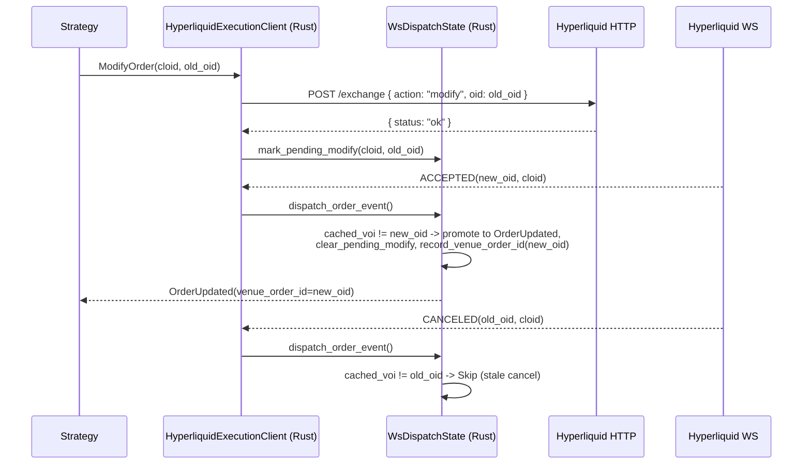

# Hyperliquid

[Hyperliquid](https://hyperliquid.gitbook.io/hyperliquid-docs) is a decentralized perpetual futures
and spot exchange built on the Hyperliquid L1, a purpose-built blockchain optimized for trading.
HyperCore provides a fully on-chain order book and matching engine. This integration supports
live market data ingest and order execution on Hyperliquid.

## Overview

This adapter is implemented in Rust with Python bindings. It provides direct integration
with Hyperliquid's REST and WebSocket APIs without requiring external client libraries.

The Hyperliquid adapter includes multiple components:

- `HyperliquidHttpClient`: Low-level HTTP API connectivity.
- `HyperliquidWebSocketClient`: Low-level WebSocket API connectivity.
- `HyperliquidInstrumentProvider`: Instrument parsing and loading functionality.
- `HyperliquidDataClient`: Market data feed manager.
- `HyperliquidExecutionClient`: Account management and trade execution gateway.
- `HyperliquidDataClientFactory`: Factory for Hyperliquid data clients (used by the trading node builder).
- `HyperliquidExecutionClientFactory`: Factory for Hyperliquid execution clients (used by the trading node builder).

:::note
Most users will define a configuration for a live trading node (as shown below)
and won't need to work directly with these lower-level components.
:::

## Examples

You can find live example scripts [here](https://github.com/nautechsystems/nautilus_trader/tree/develop/examples/live/hyperliquid/).

## Builder code attribution

Submitted mainnet orders carry the NautilusTrader builder code at a **zero fee rate**, so
attribution adds no trading cost. This helps us gauge real usage of the integration and
prioritize ongoing maintenance. Users who attribute order flow may also qualify for direct
support through the [Institutional](https://nautilustrader.io/institutional/) tier when trading
at scale.

You may opt out of attribution with `include_builder_attribution: false` in serialized config,
or `include_builder_attribution=False` in Python.

The builder address is omitted from orders in three cases:

- **Testnet**: Hyperliquid testnet rejects orders that include a builder address the wallet has
  not explicitly approved (faucet-funded testnet wallets typically have no approval), so testnet
  orders never include the builder.
- **Vault trading** (`vault_address` configured): Hyperliquid does not allow vaults to approve
  builder fees, so including the builder address would cause the exchange to reject the order.
- **Attribution disabled** (`include_builder_attribution=False`): Users who choose not to
  attribute their order flow can disable builder attribution explicitly.

```python
from nautilus_trader.adapters.hyperliquid import HyperliquidExecClientConfig

config = HyperliquidExecClientConfig(
    include_builder_attribution=False,
)
```

### Builder fee approval

Hyperliquid requires a one-time `ApproveBuilderFee` approval before orders can carry the builder
address: orders from a wallet that has never approved a builder fee are rejected with the reason
`Builder fee has not been approved` (any prior approval, including at a 0% rate, satisfies the
check). The approval must be signed by the master wallet's private key, which the adapter does
not hold in agent (API) wallet setups, so it runs as a one-time script rather than at execution
client startup. The 0% max fee rate permits attribution only: no builder fee is ever charged,
and raising the rate would require a new approval signed by you.

Run the approval script once per wallet (reads `HYPERLIQUID_PK`, or `HYPERLIQUID_TESTNET_PK`
with `HYPERLIQUID_TESTNET=true`):

```bash
cargo run -p nautilus-hyperliquid --bin hyperliquid-builder-fee-approve
```

Or from Python:

```python
from nautilus_trader.adapters.hyperliquid import builder_fee_approve

builder_fee_approve()
```

### Revoking the approval

Use revocation to cap a previously approved builder fee at 0% (for example, an approval from a
version that charged builder fees). Revocation caps the fee; it does not remove the approval
record, so attribution continues unless `include_builder_attribution` is disabled.

```bash
cargo run -p nautilus-hyperliquid --bin hyperliquid-builder-fee-revoke
```

Or from Python:

```python
from nautilus_trader.adapters.hyperliquid import builder_fee_revoke

builder_fee_revoke()
```

The Rust scripts print a summary of the action and pause for an Enter keypress before signing;
abort with `Ctrl+C` if anything in the summary looks wrong, or pass `--yes` to skip the prompt.
The Python bindings do not prompt: review the active environment variables yourself before
calling.

## Testnet setup

Hyperliquid provides a testnet environment for testing strategies with mock funds.

:::info
**Mainnet account required.** Hyperliquid's testnet faucet only works for wallets that have
previously deposited on mainnet. You must fund a mainnet account first before you can obtain
testnet USDC.
:::

### Getting testnet funds

To receive testnet USDC, you must first have deposited on **mainnet** using the same wallet address:

1. Visit the [Hyperliquid mainnet portal](https://app.hyperliquid.xyz/) and make a deposit with your wallet.
2. Visit the [testnet faucet](https://app.hyperliquid-testnet.xyz/drip) using the same wallet.
3. Claim 1,000 mock USDC from the faucet.

:::note
**Email wallet users**: Email login generates different addresses for mainnet vs testnet.
To use the faucet, export your email wallet from mainnet, import it into MetaMask or Rabby,
then connect the extension to testnet.
:::

### Creating a testnet account

1. Visit the [Hyperliquid testnet portal](https://app.hyperliquid-testnet.xyz/).
2. Connect your wallet (MetaMask, WalletConnect, or email).
3. The testnet automatically creates an account for your wallet address.

### Exporting your private key

To use your testnet account with NautilusTrader, you need to export your wallet's private key:

**MetaMask:**

1. Click the three dots menu next to your account.
2. Select "Account details".
3. Click "Show private key".
4. Enter your password and copy the private key.

:::warning
**Never share your private keys.**
Store private keys securely using environment variables; never commit them to version control.
:::

### Setting environment variables

Set your testnet credentials as environment variables:

```bash
export HYPERLIQUID_TESTNET_PK="your_private_key_here"
# Optional: for vault trading
export HYPERLIQUID_TESTNET_VAULT="vault_address_here"
```

The adapter automatically loads these when `environment=HyperliquidEnvironment.TESTNET` in the
configuration.

:::warning
**Agent / API wallets**: if `HYPERLIQUID_TESTNET_PK` is an
[agent wallet](#agent-wallets) approved under a master account (the typical
setup when you create an API wallet on the Hyperliquid UI), you must also
set `HYPERLIQUID_ACCOUNT_ADDRESS` to the master account address. Without it,
`OrderStatusReport` requests and WebSocket user feeds come back empty even
though orders are live on the venue. See [GH-4010](https://github.com/nautechsystems/nautilus_trader/issues/4010).
:::

## Product support

Hyperliquid offers linear perpetual futures, HIP-3 builder-deployed perpetuals, native
spot markets, and HIP-4 binary outcome markets.

| Product Type      | Data Feed | Trading | Notes                                                   |
|-------------------|-----------|---------|---------------------------------------------------------|
| Spot              | ✓         | ✓       | Native spot markets.                                    |
| Perpetual Futures | ✓         | ✓       | USDC‑settled linear perps (validator‑operated).         |
| HIP‑3 Perpetuals  | ✓         | ✓       | Builder‑deployed perps with per‑dex collateral. Opt‑in. |
| HIP‑4 Outcomes    | ✓         | ✓       | USDH‑settled binary outcomes. Opt‑in.                   |

:::note
Standard Hyperliquid perpetuals are settled in USDC. HIP-3 dexes may settle in
their own collateral token, such as USDH, USDE, or USDT0, while keeping Nautilus
symbols quoted as `USD`. Spot markets are standard currency pairs. See
[HIP-3 builder-deployed perpetuals](#hip-3-builder-deployed-perpetuals) and
[HIP-4 outcome markets](#hip-4-outcome-markets) for configuration and opt-in
details. Hyperliquid's current API docs mark `outcomeMeta` as testnet-only, so
HIP-4 discovery depends on that payload being available from the selected
environment.
:::

## Symbology

Hyperliquid uses a specific symbol format for instruments:

### Spot markets

Format: `{Base}-{Quote}-SPOT`

Examples:

- `PURR-USDC-SPOT` - PURR/USDC spot pair
- `HYPE-USDC-SPOT` - HYPE/USDC spot pair

To subscribe in your strategy:

```python
InstrumentId.from_str("PURR-USDC-SPOT.HYPERLIQUID")
```

:::note
Spot instruments may include vault tokens (prefixed with `vntls:`). These are automatically
handled by the instrument provider.
:::

### Perpetual futures

Format: `{Base}-USD-PERP`

Examples:

- `BTC-USD-PERP` - Bitcoin perpetual futures
- `ETH-USD-PERP` - Ethereum perpetual futures
- `SOL-USD-PERP` - Solana perpetual futures

To subscribe in your strategy:

```python
InstrumentId.from_str("BTC-USD-PERP.HYPERLIQUID")
InstrumentId.from_str("ETH-USD-PERP.HYPERLIQUID")
```

### HIP-3 perpetuals

Format: `{dex}:{Asset}-USD-PERP`

[HIP-3](https://hyperliquid.gitbook.io/hyperliquid-docs/hyperliquid-improvement-proposals-hips/hip-3-builder-deployed-perpetuals)
markets use a dex prefix separated by a colon. The dex name identifies which
builder-deployed perp dex the market belongs to.

Examples:

- `xyz:TSLA-USD-PERP` - Tesla perp on trade.xyz
- `xyz:GOLD-USD-PERP` - Gold perp on trade.xyz
- `flx:NVDA-USD-PERP` - Nvidia perp on Felix
- `vntl:SPACEX-USD-PERP` - SpaceX perp on Ventuals

To subscribe in your strategy:

```python
InstrumentId.from_str("xyz:TSLA-USD-PERP.HYPERLIQUID")
```

### HIP-4 outcome side tokens

Format: `{outcome_index}-{YES|NO}-OUTCOME.HYPERLIQUID`, where `outcome_index`
is the `outcome` field from `outcomeMeta` and the middle segment names the
binary side. The `-OUTCOME` suffix is symmetric with `-PERP` / `-SPOT`.

[HIP-4](https://hyperliquid.gitbook.io/hyperliquid-docs/hyperliquid-improvement-proposals-hips/hip-4-outcome-markets)
side tokens are binary contracts that settle in USDH at `0` (loser) or `1`
(winner). The Nautilus symbol uses the human-readable form above; the wire
`raw_symbol` uses the venue coin form `#{encoding}` (where
`encoding = 10 * outcome_index + side`, `side` is `0` for Yes / `1` for No),
which is what `l2Book` and `allMids` accept.

Examples (outcome 25):

- `25-YES-OUTCOME.HYPERLIQUID`: Yes side. Encoding `250`, wire coin `#250`,
  token name `+250`, action asset id `100_000_250`.
- `25-NO-OUTCOME.HYPERLIQUID`: No side. Encoding `251`, wire coin `#251`,
  token name `+251`, action asset id `100_000_251`.

To subscribe in your strategy:

```python
InstrumentId.from_str("25-YES-OUTCOME.HYPERLIQUID")
```

:::note
The outcome universe cycles. Each settlement removes the resolved outcome
from `outcomeMeta`, and the venue's next listing advances the index. Inspect
the live universe with
`curl -s -X POST https://api.hyperliquid.xyz/info -d '{"type":"outcomeMeta"}'`.
:::

See [HIP-4 outcome markets](#hip-4-outcome-markets) for the trading flow,
settlement, and current limitations.

## HIP-3 builder-deployed perpetuals

[HIP-3](https://hyperliquid.gitbook.io/hyperliquid-docs/hyperliquid-improvement-proposals-hips/hip-3-builder-deployed-perpetuals)
allows qualified deployers to launch permissionless perp dexes on Hyperliquid. These markets
include equities (TSLA, NVDA, AAPL), commodities (gold, crude oil), indices (S&P 500), and
pre-IPO tokens (SpaceX, OpenAI).

In a live `TradingNode`, HIP-3 perpetuals load automatically alongside standard perpetuals at
connect: the adapter fetches every perp dex (standard and builder-deployed) from `allPerpMetas`,
so no additional client configuration is required.

To narrow the loaded set, filter with `InstrumentProviderConfig`:

```python
instrument_provider=InstrumentProviderConfig(
    load_all=True,
    filters={"market_types": ["perp_hip3"]},
)
```

For direct `HyperliquidHttpClient` usage, the HIP-3 perp dexes are excluded unless you opt in
through `load_instrument_definitions`:

```python
from nautilus_trader.adapters.hyperliquid import HyperliquidEnvironment
from nautilus_trader.adapters.hyperliquid import HyperliquidHttpClient

client = HyperliquidHttpClient.from_env(HyperliquidEnvironment.MAINNET)
instruments = await client.load_instrument_definitions(
    include_spot=True,
    include_perps=True,
    include_perps_hip3=True,
    include_outcomes=False,
)
```

### Differences from standard perpetuals

HIP-3 markets trade on the same HyperCore matching engine and use the same order API.
The key differences are:

- **Higher fees**: 2x standard perp fees by default. The deployer receives half.
- **Isolated margin**: HIP-3 markets default to isolated-only margin.
- **Per-dex collateral**: Each HIP-3 dex declares its settlement token through
  its `collateralToken` entry in `allPerpMetas`. Nautilus resolves that token
  through `spotMeta` and keeps the symbol's quote leg as `USD`. If a non-USDC
  collateral token cannot resolve from `spotMeta`, instrument loading returns
  an error rather than falling back to USDC.
- **Deployer-managed oracles**: The deployer operates the oracle feed, not validators.
- **Growth mode**: Some dexes enable growth mode, which reduces protocol fees by 90%.

For full protocol details, see the Hyperliquid docs:

- [HIP-3 proposal](https://hyperliquid.gitbook.io/hyperliquid-docs/hyperliquid-improvement-proposals-hips/hip-3-builder-deployed-perpetuals)
- [HIP-3 deployer actions](https://hyperliquid.gitbook.io/hyperliquid-docs/for-developers/api/hip-3-deployer-actions)
- [Asset IDs](https://hyperliquid.gitbook.io/hyperliquid-docs/for-developers/api/asset-ids)
- [Fees](https://hyperliquid.gitbook.io/hyperliquid-docs/trading/fees)

### Wildcard character sanitization

Some HIP-3 dexes deploy assets whose venue names contain `*` or `?` bytes
(for example `dex:STREAMABCD****-USD-PERP`). Those bytes collide with the
Nautilus message bus pattern syntax (`*` = zero-or-more, `?` = one-char) and
would corrupt subscription routing if embedded in topic strings unchanged.

The Hyperliquid adapter substitutes both bytes with `x` when constructing the
`InstrumentId.symbol`, so a HIP-3 asset named `dex:STREAMABCD****` is exposed
to strategies as:

```python
InstrumentId.from_str("dex:STREAMABCDxxxx-USD-PERP.HYPERLIQUID")
```

The substitution applies only to the Nautilus-internal symbol used in topics,
caches, logs, and config. The venue-official name is preserved on the
instrument's `raw_symbol` field for HTTP and WebSocket wire calls, and order
submissions reference the numeric asset index, so the round-trip with
Hyperliquid is unaffected.

When subscribing to a HIP-3 instrument with wildcard bytes in its venue name,
use the sanitized form. Symbols without `*` or `?` are passed through
unchanged.

The substitution is lossy: two distinct venue names such as `dex:FOO*` and
`dex:FOO?` would normalize onto the same Nautilus symbol. The instrument
loader detects collisions, keeps the first definition, and logs a warning
with the dropped venue name; the dropped instrument will not be tradeable
through Nautilus until the venue rename resolves the collision.

## HIP-4 outcome markets

[HIP-4](https://hyperliquid.gitbook.io/hyperliquid-docs/for-developers/api/asset-ids#outcomes)
markets are fully-collateralized binary contracts. Each market has two side
tokens (Yes / No) that settle to `1 USDH` (winner) or `0 USDH` (loser) on the
resolution date. Hyperliquid's current API docs expose outcome metadata through
`outcomeMeta` and mark that endpoint as testnet-only. The adapter treats outcome
metadata as best-effort and skips HIP-4 instruments when the venue does not
return that payload.

### Loading outcome instruments

In a live `TradingNode`, outcome instruments load automatically (best-effort) when the venue
exposes `outcomeMeta`; current Hyperliquid docs mark that metadata endpoint as testnet-only, and
the adapter skips HIP-4 instruments when the payload is unavailable. No client configuration is
required.

For direct `HyperliquidHttpClient` usage, opt in through `load_instrument_definitions`:

```python
from nautilus_trader.adapters.hyperliquid import HyperliquidEnvironment
from nautilus_trader.adapters.hyperliquid import HyperliquidHttpClient

client = HyperliquidHttpClient.from_env(HyperliquidEnvironment.TESTNET)
instruments = await client.load_instrument_definitions(
    include_spot=True,
    include_perps=True,
    include_perps_hip3=False,
    include_outcomes=True,
)
```

The provider emits two `BinaryOption` instruments per outcome (one per side),
denominated in USDH. Symbols use the form
`{outcome_index}-{YES|NO}-OUTCOME.HYPERLIQUID`. `expiration_ns` is parsed
from the venue description (`expiry:YYYYMMDD-HHMM`, UTC). Standalone binaries
carry their own expiry; named and fallback outcomes inherit from their
parent question. Defaults: `0.0001` per tick, `0.01` per lot.

Each instrument's `BinaryOption.info` carries the parsed venue metadata as a
key/value map (consumed via `info["key"]` in Python or `Params.get_str(...)`
in Rust). Derived identifiers are always populated; description-derived
fields appear when the venue includes them.

| Field              | Source                         | Notes                                             |
|--------------------|--------------------------------|---------------------------------------------------|
| `outcome_index`    | derived                        | `outcome` from `outcomeMeta`                      |
| `outcome_side`     | derived                        | `0` = Yes, `1` = No                               |
| `side_name`        | derived                        | `"Yes"` or `"No"`                                 |
| `encoding`         | derived                        | `10 * outcome_index + side`                       |
| `asset_id`         | derived                        | `100_000_000 + encoding`                          |
| `market_name`      | `outcomeMeta.outcomes[*].name` | venue market label                                |
| `class`            | description                    | `priceBinary` or `priceBucket`                    |
| `underlying`       | description                    | underlying asset code                             |
| `expiry`           | description                    | `YYYYMMDD-HHMM` UTC                               |
| `target_price`     | description                    | binary settlement threshold                       |
| `period`           | description                    | recurrence period (e.g. `1d`, `3m`)               |
| `price_thresholds` | description                    | comma‑separated thresholds (bucket markets)       |
| `named_index`      | named‑outcome description      | position in parent `named_outcomes` array         |
| `is_fallback`      | fallback‑outcome description   | `true` for the `other` outcome of a question      |
| `question`         | parent question                | question id                                       |
| `question_name`    | parent question                | question label                                    |
| `question_*`       | parent question description    | every parsed question field, `question_` prefixed |

Description keys are lowered from venue camelCase to snake_case
(`targetPrice` -> `target_price`, `priceThresholds` -> `price_thresholds`).
Values are kept as strings to preserve wire fidelity; numeric identifiers
(`outcome_index`, `outcome_side`, `encoding`, `asset_id`, `question`,
`named_index`) are stored as JSON numbers.

### Settlement currency

Outcomes settle in USDH (token index 360, traded on the `USDH/USDC` spot pair
`@230`). The adapter registers USDH at 8-decimal precision on first outcome
instrument creation, so `BinaryOption.currency`, `quote_currency`, and the
commission currency on zero-fee outcome fills all resolve to USDH.

USDH spot balances merge with the perp clearinghouse view, so `AccountState`
carries USDH alongside USDC and any other non-zero spot holdings.

### Trading flow

Outcome side tokens (`{outcome_index}-{YES|NO}-OUTCOME.HYPERLIQUID`) trade
through the standard order path. Submit `SubmitOrder` as you would for any
perp or spot instrument; the execution client routes it through the same
`Order` action against the venue's `#{encoding}` orderbook (where
`encoding = 10 * outcome_index + outcome_side`). No HIP-4-specific call is
needed.

Settlement is venue-driven; see [Settlement dispatch](#settlement-dispatch).

#### Advanced workflows

The full `userOutcome` action set is reachable directly on
`HyperliquidHttpClient` (Rust and PyO3) for strategies that need to manage
side-token inventory off-book:

```python
from decimal import Decimal
from nautilus_trader.core.nautilus_pyo3 import HyperliquidEnvironment
from nautilus_trader.core.nautilus_pyo3 import HyperliquidHttpClient

client = HyperliquidHttpClient.from_env(HyperliquidEnvironment.MAINNET)

# Mint matched Yes + No side tokens from USDH (e.g. dual-side market making)
await client.submit_split_outcome(50, Decimal("1.0"))

# Burn a matched Yes + No pair back to USDH (amount=None merges the max)
await client.submit_merge_outcome(50, None)

# Multi-outcome priceBucket helpers
await client.submit_merge_question(9, None)
await client.submit_negate_outcome(9, 52, Decimal("1.0"))
```

| Action                  | Use case |
|-------------------------|----------|
| `submit_split_outcome`  | Mint paired Yes + No tokens from quote (initial market making, dual‑side hedges) |
| `submit_merge_outcome`  | Burn a matched Yes + No pair back to quote without crossing the spread |
| `submit_merge_question` | Close a full multi‑outcome basket back to quote atomically |
| `submit_negate_outcome` | Convert No shares of one outcome into Yes shares of every other in the same question |

For directional bets the ordinary `SubmitOrder` path is sufficient; the
methods above are only needed when you want to create or destroy side-token
inventory off-book.

### Order constraints

Outcome side tokens behave like spot tokens (no margin, no funding, no
liquidation). The execution client rejects features that don't apply:

- `reduce_only` orders.
- Trigger order types (`StopMarket`, `StopLimit`, `MarketIfTouched`,
  `LimitIfTouched`, trailing stops).

`Limit` and `Market` orders with `GTC`, `IOC`, or `ALO` time-in-force are
supported. The venue minimum is 10 USDH notional; size `order_qty` so that
`order_qty * limit_price >= 10`.

### Settlement dispatch

At expiry the venue closes held side-token balances and emits a `Settlement`
fill per side. The adapter consumes these through the standard user-fills
stream (HTTP poll and WebSocket); no synthetic dispatch runs.

Each settlement fill:

- `order_side = SELL`, zero commission.
- Price `1` USDH for the winning side, `0` for the loser.
- Surfaces as a `FillReport`.
- Also emits `OrderFilled` when WebSocket dispatch links the position to a
  tracked order.

Covers standalone `priceBinary` outcomes and multi-outcome `priceBucket`
questions uniformly.

### Position reconciliation

HIP-4 side tokens arrive on `spotClearinghouseState` with `coin` set to the
`+E` token form and no `token` field. The adapter:

- Treats `SpotBalance.token` as optional during deserialization.
- Resolves `+E` / `#E` coins to their `BinaryOption` instrument when
  generating `PositionStatusReport`s.
- Skips the perp clearinghouse fetch when the position-status filter is an
  outcome instrument (outcomes never appear in `assetPositions`).

### Multi-outcome (priceBucket) markets

The venue exposes multi-outcome markets via the top-level `questions` array in
`outcomeMeta`. Each question references a fallback outcome plus a sequence of
named outcomes whose individual descriptions point back at the question via
`index:N`. Each side token is modeled as an independent `BinaryOption`
instrument; the `submit_merge_question` and `submit_negate_outcome` actions
on `HyperliquidHttpClient` operate at the question level for basket close
and cross-outcome rotation.

## Instrument provider

The instrument provider supports filtering when loading instruments via
`InstrumentProviderConfig(filters=...)`:

| Filter key                  | Type        | Description                                 |
|-----------------------------|-------------|---------------------------------------------|
| `market_types` (or `kinds`) | `list[str]` | `"perp"`, `"perp_hip3"`, or `"spot"`.       |
| `bases`                     | `list[str]` | Base currency codes, e.g. `["BTC", "ETH"]`. |
| `quotes`                    | `list[str]` | Quote currency codes, e.g. `["USDC"]`.      |
| `symbols`                   | `list[str]` | Full symbols, e.g. `["BTC-USD-PERP"]`.      |

Example loading only perpetual instruments:

```python
instrument_provider=InstrumentProviderConfig(
    load_all=True,
    filters={"market_types": ["perp"]},
)
```

## Data subscriptions

The adapter supports the following data subscriptions. All perpetual data types
(mark prices, index prices, funding rates) apply to both standard and HIP-3 perps.

| Data type         | Sub. | Snapshot | Hist. | Nautilus type                 | Notes                                 |
|-------------------|------|----------|-------|-------------------------------|---------------------------------------|
| Trade ticks       | ✓    | -        | ✓     | `TradeTick`                   | WebSocket trades; `recentTrades`.     |
| Quote ticks       | ✓    | -        | -     | `QuoteTick`                   | Best bid/offer.                       |
| Order book deltas | ✓    | ✓        | -     | `OrderBookDelta`              | L2 snapshots.                         |
| Order book depth  | ✓    | -        | -     | `OrderBookDepth10`            | Top-10 L2 snapshots.                  |
| Bars              | ✓    | -        | ✓     | `Bar`                         | Supported intervals below.            |
| Mark prices       | ✓    | -        | -     | `MarkPriceUpdate`             | Perpetual mark price ticks.           |
| Index prices      | ✓    | -        | -     | `IndexPriceUpdate`            | Underlying reference prices.          |
| Funding rates     | ✓    | -        | ✓     | `FundingRateUpdate`           | `fundingHistory` endpoint.            |
| Open interest     | ✓    | -        | -     | `HyperliquidOpenInterest`     | Custom data from `activeAssetCtx`.    |
| All mids          | ✓    | -        | -     | `HyperliquidAllMids`          | Custom data from `allMids`.           |
| All dex contexts  | ✓    | -        | -     | `HyperliquidAllDexsAssetCtxs` | Custom data from `allDexsAssetCtxs`.  |

:::note
Historical quote requests are not supported. Historical trade requests use the
`recentTrades` info endpoint, which returns a recent snapshot of public trades
(newest first) with no time range. `request_trades` filters that snapshot to the
requested `[start, end]` window and applies `limit` by keeping the most recent
trades. When the request reaches below the snapshot's oldest trade, the adapter
logs a warning and serves the available subset (or an empty response). The
endpoint depends on the Hyperliquid indexer: self-hosted `/info` nodes return
HTTP 422, which the adapter treats as no coverage and answers with an empty
response. Real-time trades remain available via the WebSocket `trades` channel.
:::

### Order book precision controls

The `l2Book` subscription accepts optional `nSigFigs` and `mantissa` parameters
that thin the venue-side book aggregation. The adapter forwards them when
passed through `subscribe_params` on book deltas and depth subscriptions.

Hyperliquid accepts `nSigFigs` values `2`, `3`, `4`, `5`, or omitted for full
precision. `mantissa` is only valid when `nSigFigs=5` and accepts `1`, `2`, or
`5`.

```python
from nautilus_trader.model.data import BookType

self.subscribe_order_book_deltas(
    instrument_id=instrument_id,
    book_type=BookType.L2_MBP,
    params={"n_sig_figs": 5, "mantissa": 2},
)
```

Omitting both params subscribes to the full-depth book.

### Hyperliquid specific data

The adapter emits two Hyperliquid-specific custom data types:

- `HyperliquidAllMids` from the WebSocket `allMids` feed. Each update carries
  all currently reported mid prices in one payload.
- `HyperliquidAllDexsAssetCtxs` from the WebSocket `allDexsAssetCtxs` feed.
  Each update carries normalized per-instrument asset-context entries across
  the default perp dex and HIP-3 builder dexes.
- `HyperliquidOpenInterest` from the shared `activeAssetCtx` feed used by
  mark prices, index prices, and funding rates.

| Field      | Type             | Description                                              |
|------------|------------------|----------------------------------------------------------|
| `mids`     | `dict[str, str]` | Instrument ID to mid price mapping.                      |
| `ts_event` | `int`            | UNIX timestamp in nanoseconds when the update occurred.  |
| `ts_init`  | `int`            | UNIX timestamp in nanoseconds when the object was built. |

Subscribe from an actor or strategy with `DataType(HyperliquidAllMids)`.
For HIP-3 dex-specific streams, pass the venue dex in `metadata["dex"]`:

```python
from nautilus_trader.adapters.hyperliquid.constants import HYPERLIQUID_CLIENT_ID
from nautilus_trader.adapters.hyperliquid.data import HyperliquidAllMids
from nautilus_trader.model.data import DataType

self.subscribe_data(
    data_type=DataType(HyperliquidAllMids, metadata={"dex": "hyperliquid"}),
    client_id=HYPERLIQUID_CLIENT_ID,
)
```

`HyperliquidOpenInterest` carries the latest open interest for one
perpetual instrument. Subscribe with the canonical Nautilus `instrument_id`
in `metadata["instrument_id"]`:

| Field           | Type           | Description                                                                 |
|-----------------|----------------|-----------------------------------------------------------------------------|
| `instrument_id` | `InstrumentId` | Canonical Nautilus instrument ID.                                           |
| `open_interest` | `Decimal`      | Open interest parsed for direct arithmetic use.                             |
| `ts_event`      | `int`          | UNIX timestamp in nanoseconds when the update occurred. Mirrors `ts_init`.  |
| `ts_init`       | `int`          | UNIX timestamp in nanoseconds when the object was built.                    |

```python
from nautilus_trader.adapters.hyperliquid import HYPERLIQUID_CLIENT_ID
from nautilus_trader.adapters.hyperliquid import HyperliquidOpenInterest
from nautilus_trader.model.data import DataType

self.subscribe_data(
    data_type=DataType(
        HyperliquidOpenInterest,
        metadata={"instrument_id": str(self.instrument_id)},
    ),
    client_id=HYPERLIQUID_CLIENT_ID,
)
```

`HyperliquidOpenInterest` reuses the same single underlying
`activeAssetCtx` venue subscription that already backs mark prices, index
prices, and funding rates for the same coin. Adding OI does not open a second
parallel `activeAssetCtx` subscription.

In a Python strategy running inside a `TradingNode`, the payload is delivered
to `on_data` as the concrete custom data type itself:

```python
from decimal import Decimal

from nautilus_trader.adapters.hyperliquid import HyperliquidOpenInterest

def on_data(self, data) -> None:
    if isinstance(data, HyperliquidOpenInterest):
        if data.open_interest > Decimal("1000"):
            self.log.info(f"OI {data.instrument_id} -> {data.open_interest}")
```

`HyperliquidAllDexsAssetCtxs` exposes a whole-feed aggregate rather than one
topic per instrument, so strategies subscribe once and filter the normalized
entries they need:

| Field             | Type                              | Description                                                                |
|-------------------|-----------------------------------|----------------------------------------------------------------------------|
| `dex`             | `str`                             | Perp dex identifier from Hyperliquid `perpDexs`. `""` is the default dex.  |
| `instrument_id`   | `InstrumentId`                    | Canonical Nautilus instrument ID for the entry.                            |
| `mark_price`      | `Price`                           | Current mark price.                                                        |
| `oracle_price`    | `Price`                           | Current oracle / index reference price.                                    |
| `prev_day_price`  | `Price`                           | Previous day reference price from the venue payload.                       |
| `mid_price`       | `Price \| None`                   | Mid price when present in the venue payload.                               |
| `impact_prices`   | `HyperliquidImpactPrices \| None` | Best bid / ask impact prices when present.                                 |
| `funding_rate`    | `Decimal`                         | Funding rate parsed for direct arithmetic use.                             |
| `open_interest`   | `Decimal`                         | Open interest parsed for direct arithmetic use.                            |
| `premium`         | `Decimal \| None`                 | Premium when present in the venue payload.                                 |
| `day_ntl_volume`  | `Decimal`                         | 24h notional volume.                                                       |
| `day_base_volume` | `Decimal`                         | 24h base volume.                                                           |
| `ts_event`        | `int`                             | UNIX timestamp in nanoseconds when the update occurred. Mirrors `ts_init`. |
| `ts_init`         | `int`                             | UNIX timestamp in nanoseconds when the object was built.                   |

The underlying Hyperliquid wire payload arrives as
`ctxs: [[dex, ctxs[]], ...]`. The adapter decodes that live venue format and
normalizes it into the per-entry output shown below before the strategy sees
the data.

The adapter does not invent `dex` values. It bootstraps the ordered dex
universe from Hyperliquid `meta` / `allPerpMetas` and resolves builder dex
identifiers from the live `perpDexs` info endpoint. The empty string `""`
represents Hyperliquid's default perp dex; non-empty values such as `xyz`,
`flx`, or `vntl` are venue-defined builder dex identifiers.

The mapping is resolved from the instruments loaded at connect, and the feed is
positional (no per-entry coin name), so perps listed later only appear after a
reconnect. A context-count mismatch for a dex logs a warning to reconnect;
entries stay aligned positionally, which is correct for appended listings.

```python
from nautilus_trader.adapters.hyperliquid import HYPERLIQUID_CLIENT_ID
from nautilus_trader.adapters.hyperliquid import HyperliquidAllDexsAssetCtxs
from nautilus_trader.model.data import DataType

self.subscribe_data(
    data_type=DataType(HyperliquidAllDexsAssetCtxs),
    client_id=HYPERLIQUID_CLIENT_ID,
)

def on_data(self, data) -> None:
    if isinstance(data, HyperliquidAllDexsAssetCtxs):
        for entry in data.entries:
            if entry.dex == "xyz":
                self.log.info(f"{entry.instrument_id} OI={entry.open_interest}")
```

### Supported bar intervals

| Resolution | Hyperliquid candle |
|------------|--------------------|
| 1-MINUTE   | `1m`               |
| 3-MINUTE   | `3m`               |
| 5-MINUTE   | `5m`               |
| 15-MINUTE  | `15m`              |
| 30-MINUTE  | `30m`              |
| 1-HOUR     | `1h`               |
| 2-HOUR     | `2h`               |
| 4-HOUR     | `4h`               |
| 8-HOUR     | `8h`               |
| 12-HOUR    | `12h`              |
| 1-DAY      | `1d`               |
| 3-DAY      | `3d`               |
| 1-WEEK     | `1w`               |
| 1-MONTH    | `1M`               |

## Orders capability

Hyperliquid supports a full set of order types and execution options.

:::note
In the tables below, "Perpetuals" covers both standard validator-operated perps and
HIP-3 builder-deployed perps. The same order types, time-in-force options, and execution
instructions apply to both.
:::

### Order types

| Order Type          | Perpetuals | Spot | Notes                                               |
|---------------------|------------|------|-----------------------------------------------------|
| `MARKET`            | ✓          | ✓    | IOC limit with configurable slippage from best BBO. |
| `LIMIT`             | ✓          | ✓    |                                                     |
| `STOP_MARKET`       | ✓          | ✓    | Stop loss orders.                                   |
| `STOP_LIMIT`        | ✓          | ✓    | Stop loss with limit execution.                     |
| `MARKET_IF_TOUCHED` | ✓          | ✓    | Take profit at market.                              |
| `LIMIT_IF_TOUCHED`  | ✓          | ✓    | Take profit with limit execution.                   |

:::info
Conditional orders (stop and if-touched) are implemented using Hyperliquid's native trigger
order functionality with automatic TP/SL mode detection. All trigger orders are evaluated
against the [mark price](https://hyperliquid.gitbook.io/hyperliquid-docs/trading/robust-price-indices).
:::

:::note
Market orders require cached quote data. The adapter uses the best ask (for buys) or best bid
(for sells) with a configurable slippage buffer (default 50 bps). Prices are rounded to
Hyperliquid's price constraints before submission. Ensure you subscribe to quotes for any
instrument you intend to trade with market orders.

The slippage buffer is controlled by `market_order_slippage_bps` on `HyperliquidExecClientConfig`
(default 50 bps) and can be overridden per-order via the `market_order_slippage_bps` key in
`SubmitOrder.params`.
:::

:::note
`STOP_MARKET` and `MARKET_IF_TOUCHED` orders do not carry a limit price. The adapter derives
one from the trigger price with the same configurable slippage buffer (default 50 bps), rounds
to 5 significant figures, and clamps to the venue decimal limit (ceiling for buys, floor for
sells). This guarantees Hyperliquid's `limit_px >= trigger_px` (buys) /
`limit_px <= trigger_px` (sells) constraint.
:::

:::warning
**Price normalization is enabled by default.** Hyperliquid enforces a maximum of 5 significant
figures on order prices, plus a per-asset decimal limit based on `szDecimals`
(`6 - szDecimals` for perps, `8 - szDecimals` for spot). For example, if ETH is trading at
$2,600 (4 integer digits), only 1 decimal place is allowed despite the instrument having
`price_precision=2`.

By default, the adapter normalizes all outgoing limit and trigger prices to 5 significant
figures and clamps them to the instrument price precision to prevent order rejections. This
means your submitted prices may shift slightly.
To disable this and take full control of price formatting, set `normalize_prices=False`
in your `HyperliquidExecClientConfig`.

If you disable normalization, you can apply the same rounding in your strategy:

```python
from decimal import Decimal, ROUND_DOWN

def round_to_sig_figs(price: Decimal, sig_figs: int = 5) -> Decimal:
    if price == 0:
        return Decimal(0)
    shift = sig_figs - int(price.adjusted()) - 1
    if shift <= 0:
        factor = Decimal(10) ** (-shift)
        return (price / factor).to_integral_value() * factor
    return round(price, shift)
```

:::

### Time in force

| Time in force | Perpetuals | Spot | Notes                |
|---------------|------------|------|----------------------|
| `GTC`         | ✓          | ✓    | Good Till Canceled.  |
| `IOC`         | ✓          | ✓    | Immediate or Cancel. |
| `FOK`         | -          | -    | *Not supported*.     |
| `GTD`         | -          | -    | *Not supported*.     |

### Execution instructions

| Instruction   | Perpetuals | Spot | Notes                            |
|---------------|------------|------|----------------------------------|
| `post_only`   | ✓          | ✓    | Equivalent to ALO time in force. |
| `reduce_only` | ✓          | ✓    | Close‑only orders.               |

:::info
Post-only orders that would immediately match are rejected by Hyperliquid. The adapter detects
this and generates an `OrderRejected` event. Post-only orders are routed through Hyperliquid's
ALO (Add-Liquidity-Only) lane.
:::

### Order operations

| Operation         | Perpetuals | Spot | Notes                                                 |
|-------------------|------------|------|-------------------------------------------------------|
| Submit order      | ✓          | ✓    | Single order submission.                              |
| Submit order list | ✓          | ✓    | Batch order submission (single API call).             |
| Modify order      | ✓          | ✓    | Requires venue order ID.                              |
| Cancel order      | ✓          | ✓    | Cancel by client order ID.                            |
| Cancel all orders | ✓          | ✓    | Single batched `cancelByCloid` for open orders.       |
| Batch cancel      | ✓          | ✓    | Single batched `cancelByCloid` for the provided list. |

:::info
When the venue returns an authoritative per-order rejection inside a batch-cancel response (for
example `MissingOrder` for an already-terminal order), the adapter emits a per-order
`OrderCancelRejected` event and leaves the other cancels intact. Whole-request failures with
unknown venue outcome do not carry this per-order evidence.
:::

:::info
Orders placed outside NautilusTrader (e.g. via the Hyperliquid web UI or another client)
are detected and tracked as external orders. They appear in order status reports and position
reconciliation.
:::

### Modify as cancel-replace

Hyperliquid implements order modification as a **cancel-replace**. The `modify` action on the
[exchange endpoint](https://hyperliquid.gitbook.io/hyperliquid-docs/for-developers/api/exchange-endpoint#modify-an-order)
cancels the original order (old `oid`) and opens a replacement with a new `oid`. Both legs
share the same client order ID (`cloid`).

The modify HTTP response only confirms success. The
[`orderUpdates` WebSocket subscription](https://hyperliquid.gitbook.io/hyperliquid-docs/for-developers/api/websocket/subscriptions)
then delivers an `ACCEPTED(new_oid)` status report, followed by a `CANCELED(old_oid)` for the
original leg.

The Rust-native `HyperliquidExecutionClient` (used through
`HyperliquidExecutionClientFactory`) runs detection, deduplication, and event promotion on the
Rust side via the
[`WsDispatchState`](https://github.com/nautechsystems/nautilus_trader/tree/develop/crates/adapters/hyperliquid/src/websocket/dispatch.rs)
owned by the execution client. On submission the client registers an `OrderIdentity` (strategy,
instrument, side, type, quantity, last-known price) keyed by `client_order_id`. Each inbound
status report or fill is routed through the dispatch: tracked orders emit typed
`OrderEventAny::*` events via `ExecutionEventEmitter::send_order_event`; external orders fall
back to the raw `OrderStatusReport` / `FillReport` so the engine can reconcile. The dispatch
compares the report's `venue_order_id` against the last cached value for the `cloid`; when
they differ it promotes the `ACCEPTED` to `OrderUpdated` and suppresses the paired stale cancel:



If Hyperliquid delivers `CANCELED(old_oid)` before `ACCEPTED(new_oid)` for an in-flight modify,
the pending-modify marker lets the dispatch drop the old leg's cancel and still route the
subsequent `ACCEPTED` through the `OrderUpdated` path. The marker is only set after a confirmed
HTTP success, so a failed modify never leaves stale race state. Because detection otherwise
relies on the cached `venue_order_id`, the adapter also recovers a modify that times out on the
HTTP call but still reaches the venue: the eventual WS `ACCEPTED(new_oid)` sees the old cached
`oid` and translates to `OrderUpdated`. See [GH-3827](https://github.com/nautechsystems/nautilus_trader/issues/3827).

The same marker guards the inflight query and single-order reconcile paths. While a modify is in
flight, `query_order` and `generate_order_status_report` drop a `Canceled` for the superseded leg,
so an out-of-band status probe that resolves the old `oid` before the replacement appears cannot
terminate the live order. A non-cancel status for the old leg (such as a late `Filled`) is still
forwarded so reconciliation can recover it.

These paths also promote the replacement. Hyperliquid lists the replacement under the same `cloid`
with a new `oid` in `frontendOpenOrders`, so when the replacement `ACCEPTED(new_oid)` was dropped
on the WebSocket and no fill has arrived, the query resolves it by `cloid` and promotes it to
`OrderUpdated` directly (rebinding the `cloid` to `new_oid` and clearing the pending-modify
marker). The order is therefore not left bound to the canceled leg, and subsequent modifies and
cancels target the live replacement. See
[GH-4270](https://github.com/nautechsystems/nautilus_trader/issues/4270).

:::note
One narrow edge case remains when all three conditions occur together:

1. The modify HTTP call raises (transport timeout or connection error).
2. Hyperliquid still processes the modify on the exchange side.
3. Hyperliquid delivers `CANCELED(old_oid)` before `ACCEPTED(new_oid)` on the WebSocket.

Under (1) the pending-modify marker is not installed, so the early `CANCELED(old_oid)` emits as
`OrderCanceled` before the replacement `ACCEPTED(new_oid)` arrives. The periodic reconciliation
cycle restores the correct order state against the exchange.
:::

A `FillReport` for the replacement leg can also race ahead of `ACCEPTED(new_oid)`. The dispatch
buffers such fills (when the pending-modify marker is set and the report's `oid` does not match
the cached value) and drains them on the matching `ACCEPTED`, so `OrderFilled` always follows
the promoting `OrderUpdated` against up-to-date state. See
[GH-3972](https://github.com/nautechsystems/nautilus_trader/issues/3972).

:::note
A chained-modify edge case is deferred: if a delayed fill from a *prior* leg arrives during a
*new* in-flight modify and that new modify then fails, the buffered fill is stranded until
terminal cleanup. Reconciliation (`request_fill_reports`) recovers it. Fully closing this
requires additional design work (retired-VOI tracking or drain on modify-failure paths).
:::

## Order books

Order books are maintained via L2 WebSocket subscription. Each message delivers a full-depth
snapshot (clear + rebuild), not incremental deltas.

:::note
There is a limitation of one order book per instrument per trader instance.
:::

## Account and position management

`AccountState` merges perp margin and spot balances. Perp margin and cross-margin
usage come from `clearinghouseState`; non-zero spot tokens (USDC, USDH, HYPE,
vault tokens, HIP-4 outcome side tokens, etc.) come from `spotClearinghouseState`.
USDC is deduplicated when the perp summary is present.

Standard perps default to cross margin; HIP-3 perps default to isolated. On
connect, the execution client reconciles orders, fills, and positions against
Hyperliquid's clearinghouse state. Spot positions are reconstructed from held
balances (long-only); HIP-4 side tokens reconcile against their matching
`BinaryOption` instruments.

:::note
Leverage is managed directly through the Hyperliquid web UI or API, not through the adapter.
Set your desired leverage per instrument on Hyperliquid before trading.
:::

## Liquidation and ADL handling

Hyperliquid signals venue-initiated closures through two WebSocket surfaces on
the `userEvents` subscription:

- **`liquidation` event**: emitted when an account is liquidated. Carries a
  `liquidation ID`, liquidator address, liquidated user, liquidated notional
  position, and liquidated account value. The adapter logs these at warning
  level for operator visibility.
- **Fill-level `liquidation` metadata**: each entry in the `fills` array can
  carry an optional `liquidation` object with `method`, `markPx`, and
  `liquidatedUser`. The `method` value is either `market` (liquidated into
  the book) or `backstop` (closed against the backstop vault, the equivalent
  of an ADL close when the insurance mechanism steps in).

The adapter emits the standard `FillReport` for each liquidation fill. The
liquidation metadata is logged alongside the fill so you can correlate closures
to venue-side events. No strategy-side changes are required; existing risk and
reconciliation logic runs over these fills as for any other TAKER fill.

Upstream references:

- [WebSocket `userEvents` (`liquidation` and `FillLiquidation`)](https://hyperliquid.gitbook.io/hyperliquid-docs/for-developers/api/websocket/subscriptions)
- [Liquidation mechanics](https://hyperliquid.gitbook.io/hyperliquid-docs/trading/liquidations)

## Connection management

The adapter automatically reconnects on WebSocket disconnection using exponential backoff
(starting at 250ms, up to 5s). On reconnect, all active subscriptions are resubscribed
automatically, and order book snapshots are rebuilt. No manual intervention is required.

A heartbeat ping is sent every 30 seconds to keep the connection alive (Hyperliquid closes
idle connections after 60 seconds).

## API credentials

There are two options for supplying your credentials to the Hyperliquid clients.
Either pass the corresponding values to the configuration objects, or
set the following environment variables:

For Hyperliquid mainnet clients, you can set:

- `HYPERLIQUID_PK`
- `HYPERLIQUID_VAULT` (optional, for vault trading)

For Hyperliquid testnet clients, you can set:

- `HYPERLIQUID_TESTNET_PK`
- `HYPERLIQUID_TESTNET_VAULT` (optional, for vault trading)

For agent (API) wallet trading on either environment, you can also set:

- `HYPERLIQUID_ACCOUNT_ADDRESS` (master account address; shared between mainnet and testnet)

:::tip
We recommend using environment variables to manage your credentials.
:::

## Agent wallets

Hyperliquid lets a master account approve an
[agent wallet](https://hyperliquid.gitbook.io/hyperliquid-docs/for-developers/api/nonces-and-api-wallets)
(also called an API wallet or sub-key) that signs orders on the master's behalf.
Orders signed by the agent belong to the master account, not to the agent's address.

If your `HYPERLIQUID_PK` (or `HYPERLIQUID_TESTNET_PK`) is an agent wallet, you
must also set `account_address` (or the `HYPERLIQUID_ACCOUNT_ADDRESS`
environment variable) to the master account address. Otherwise the adapter
queries the agent's address for balances, orders, and WebSocket events, which
owns nothing, and submitted orders will never reconcile (no
`OrderStatusReport`, no fills surfaced).

The execution factory resolves one account address and passes that same value
to REST account queries and WebSocket user subscriptions. Signing still uses
the configured private key, and vault trading still sends `vaultAddress` in the
signed exchange payload when `vault_address` is set.

Explicit config values take precedence over environment variables. Environment
variables fill only omitted config values.

Resolution order for the execution account address used by info queries and
WebSocket subscriptions:

1. `account_address` (master account when using an agent wallet).
2. `vault_address` (vault sub-account).
3. `HYPERLIQUID_ACCOUNT_ADDRESS`.
4. `HYPERLIQUID_VAULT` or `HYPERLIQUID_TESTNET_VAULT`.
5. The address derived from the private key (the wallet itself).

:::note
`HYPERLIQUID_ACCOUNT_ADDRESS` is a single env var shared by both mainnet and
testnet (unlike `HYPERLIQUID_PK` / `HYPERLIQUID_TESTNET_PK`). If your agent
wallet is approved under the same master address on both environments, one
value covers both.
:::

:::tip
Email-login wallets generate different addresses for mainnet and testnet, so
the master address may differ. In that case, prefer setting `account_address`
explicitly in `HyperliquidExecClientConfig` per environment rather than
relying on the shared environment variable.
:::

## Vault trading

Hyperliquid supports
[vault trading](https://hyperliquid.gitbook.io/hyperliquid-docs/trading/vaults), where a wallet
operates on behalf of a vault (sub-account). Orders are signed with the wallet's private key
but include the vault address in the signature payload.

To trade via a vault, set the `vault_address` in your execution client config (or set the
`HYPERLIQUID_VAULT` / `HYPERLIQUID_TESTNET_VAULT` environment variable).

:::warning
For normal vault trading, leave `account_address` unset so `vault_address`
becomes the account address used for REST queries and WebSocket user
subscriptions. If both `account_address` and `vault_address` are set,
`account_address` wins for queries and subscriptions, while `vault_address`
still goes into the signed exchange payload.
:::

## Funding rates

Hyperliquid perpetual futures use a fixed 1-hour funding interval. The adapter sets
`interval` to `60` (minutes) on all `FundingRateUpdate` objects.

## Rate limiting

The adapter implements a token bucket rate limiter for Hyperliquid's REST API with a capacity
of 1200 weight per minute. HTTP info requests are automatically retried with exponential
backoff (full jitter) on rate limit (429) and server error (5xx) responses.
For WebSocket post trading requests, the adapter caps simultaneous inflight messages at 100 to
match the venue limit.

## Configuration

### Data client configuration options

| Option              | Default   | Description |
|---------------------|-----------|-------------------------------------------------|
| `environment`       | `None`    | Environment enum (`MAINNET` or `TESTNET`). |
| `base_url_ws`       | `None`    | Override for the WebSocket base URL. |
| `http_timeout_secs` | `60`      | Timeout (seconds) applied to REST calls. |
| `proxy_url`         | `None`    | Optional proxy URL for HTTP and WebSocket transports. |
| `transport_backend` | `Sockudo` | WebSocket transport backend. |

### Execution client configuration options

| Option                         | Default   | Description |
|--------------------------------|-----------|-------------------------------------------------------------------------------------------|
| `private_key`                  | `None`    | EVM private key; loaded from `HYPERLIQUID_PK` or `HYPERLIQUID_TESTNET_PK` when omitted. |
| `vault_address`                | `None`    | Vault address; loaded from `HYPERLIQUID_VAULT` or `HYPERLIQUID_TESTNET_VAULT` if omitted. |
| `account_address`              | `None`    | Main account address for agent wallet trading; loaded from `HYPERLIQUID_ACCOUNT_ADDRESS`. |
| `environment`                  | `None`    | Environment enum (`MAINNET` or `TESTNET`); resolves to `MAINNET` when unset. |
| `base_url_ws`                  | `None`    | Override for the WebSocket base URL. |
| `max_retries`                  | `3`       | Maximum retry attempts for submit, cancel, or modify order requests. |
| `retry_delay_initial_ms`       | `100`     | Initial delay (milliseconds) between retries. |
| `retry_delay_max_ms`           | `5000`    | Maximum delay (milliseconds) between retries. |
| `http_timeout_secs`            | `60`      | Timeout (seconds) applied to REST calls. |
| `normalize_prices`             | `True`    | Normalize order prices to 5 significant figures before submission. |
| `include_builder_attribution`  | `True`    | Include zero‑fee Nautilus builder attribution on eligible mainnet orders. |
| `market_order_slippage_bps`    | `50`      | Slippage buffer (bps) applied to MARKET and stop trigger derivations. Overridable per‑order via `SubmitOrder.params`. |
| `outcome_settlement_poll_secs` | `0`       | HIP‑4 `outcomeMeta` settlement poll interval (seconds). Rust‑only; venue `Settlement` fills cover settlement, so polling is disabled by default. |
| `proxy_url`                    | `None`    | Optional proxy URL for HTTP and WebSocket transports. |
| `transport_backend`            | `Sockudo` | WebSocket transport backend. |

:::note
`outcome_settlement_poll_secs` is the only Rust-only option: it is not exposed on the
`HyperliquidExecClientConfig` Python constructor and always uses its default. The
`max_retries`, `retry_delay_initial_ms`, and `retry_delay_max_ms` fields are accepted on
both the Rust and Python config but are not yet consumed by the execution client (its HTTP
client is constructed with only the request timeout and proxy).
:::

### Configuration example

```python
from nautilus_trader.adapters.hyperliquid import HYPERLIQUID
from nautilus_trader.adapters.hyperliquid import HyperliquidDataClientConfig
from nautilus_trader.adapters.hyperliquid import HyperliquidEnvironment
from nautilus_trader.adapters.hyperliquid import HyperliquidExecClientConfig
from nautilus_trader.config import InstrumentProviderConfig
from nautilus_trader.config import TradingNodeConfig

config = TradingNodeConfig(
    data_clients={
        HYPERLIQUID: HyperliquidDataClientConfig(
            instrument_provider=InstrumentProviderConfig(load_all=True),
            environment=HyperliquidEnvironment.TESTNET,
        ),
    },
    exec_clients={
        HYPERLIQUID: HyperliquidExecClientConfig(
            private_key=None,  # Loads from HYPERLIQUID_TESTNET_PK env var
            vault_address=None,  # Optional: loads from HYPERLIQUID_TESTNET_VAULT
            instrument_provider=InstrumentProviderConfig(load_all=True),
            environment=HyperliquidEnvironment.TESTNET,
            normalize_prices=True,  # Rounds prices to 5 significant figures
        ),
    },
)
```

:::note
When `environment=HyperliquidEnvironment.TESTNET`, the adapter automatically uses testnet
environment variables (`HYPERLIQUID_TESTNET_PK` and `HYPERLIQUID_TESTNET_VAULT`) instead of
mainnet variables.
:::

Then, create a `TradingNode` and add the client factories:

```python
from nautilus_trader.adapters.hyperliquid import HYPERLIQUID
from nautilus_trader.adapters.hyperliquid import HyperliquidDataClientFactory
from nautilus_trader.adapters.hyperliquid import HyperliquidExecutionClientFactory
from nautilus_trader.live.node import TradingNode

# Instantiate the live trading node with a configuration
node = TradingNode(config=config)

# Register the client factories with the node
node.add_data_client_factory(HYPERLIQUID, HyperliquidDataClientFactory)
node.add_exec_client_factory(HYPERLIQUID, HyperliquidExecutionClientFactory)

# Finally build the node
node.build()
```

## Contributing

:::info
For additional features or to contribute to the Hyperliquid adapter, please see our
[contributing guide](https://github.com/nautechsystems/nautilus_trader/blob/develop/CONTRIBUTING.md).
:::
