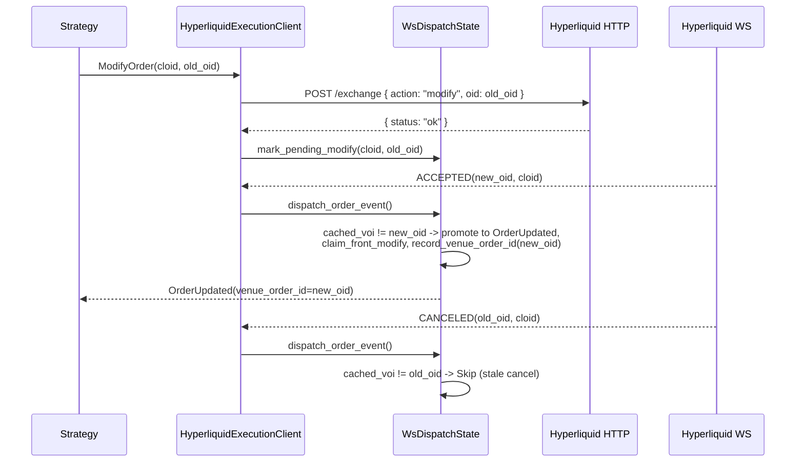

# Hyperliquid

[Hyperliquid](https://hyperliquid.gitbook.io/hyperliquid-docs) is a decentralized perpetual futures
and spot exchange built on the Hyperliquid L1, a purpose-built blockchain optimized for trading.
HyperCore provides a fully on-chain order book and matching engine. This integration supports
live market data ingest and order execution on Hyperliquid.

## Overview

This adapter is implemented in Rust with Python bindings. It provides direct integration
with Hyperliquid's REST and WebSocket APIs without requiring external client libraries.

The Hyperliquid adapter includes multiple components:

- `HyperliquidHttpClient`: HTTP API connectivity, instrument loading and parsing, and reconciliation reports.
- `HyperliquidWebSocketClient`: WebSocket API connectivity for Rust callers.
- `HyperliquidDataClient`: Market data feed manager.
- `HyperliquidExecutionClient`: Account management and trade execution gateway.
- `HyperliquidDataClientFactory`: Factory for Hyperliquid data clients (used by the live node builder).
- `HyperliquidExecutionClientFactory`: Factory for Hyperliquid execution clients (used by the live node builder).

:::note
Most users configure a live trading node (see [Live node configuration](#live-node-configuration))
and never work directly with these lower-level components.
:::

## Examples

- [Python examples](https://github.com/nautechsystems/nautilus_trader/tree/develop/examples/live/hyperliquid/)
- [Rust examples](https://github.com/nautechsystems/nautilus_trader/tree/develop/crates/adapters/hyperliquid/examples/)

## Builder code attribution

Submitted mainnet orders carry the NautilusTrader builder code at a **zero fee rate**, so
attribution adds no trading cost. This helps us gauge real usage of the integration and
prioritize ongoing maintenance. Users who attribute order flow may also qualify for direct
support through the [Institutional](https://nautilustrader.io/institutional/) tier when trading
at scale.

You may opt out of attribution with `include_builder_attribution: false` in serialized config,
or `include_builder_attribution=False` in Python.

The builder address is omitted from orders in three cases:

- **Testnet**: Hyperliquid testnet rejects orders that include a builder address the wallet has
  not explicitly approved (faucet-funded testnet wallets typically have no approval), so testnet
  orders never include the builder.
- **Vault trading** (`vault_address` configured): Hyperliquid does not allow vaults to approve
  builder fees, so including the builder address would cause the exchange to reject the order.
- **Attribution disabled** (`include_builder_attribution=False`): Users who choose not to
  attribute their order flow can disable builder attribution explicitly.

```python
from nautilus_trader.adapters.hyperliquid import HyperliquidExecutionClientConfig

config = HyperliquidExecutionClientConfig(
    include_builder_attribution=False,
)
```

### Builder fee approval

Hyperliquid requires a one-time `ApproveBuilderFee` approval before orders can carry the builder
address:

- Orders from a wallet that has never approved a builder fee are rejected with the reason
  `Builder fee has not been approved` (any prior approval, including at a 0% rate, satisfies
  the check).
- The approval must be signed by the master wallet's private key, which the adapter does not
  hold in agent (API) wallet setups, so it runs as a one-time script rather than at execution
  client startup.
- The 0% max fee rate permits attribution only: no builder fee is ever charged, and raising
  the rate would require a new approval signed by you.

Run the approval script once per wallet (reads `HYPERLIQUID_PK`, or `HYPERLIQUID_TESTNET_PK`
with `HYPERLIQUID_TESTNET=true`):

```bash
cargo run -p nautilus-hyperliquid --bin hyperliquid-builder-fee-approve
```

Or from Python:

```python
from nautilus_trader.adapters.hyperliquid import builder_fee_approve

builder_fee_approve()
```

### Revoking the approval

Use revocation to cap a previously approved builder fee at 0% (for example, an approval from a
version that charged builder fees). Revocation caps the fee; it does not remove the approval
record, so attribution continues unless `include_builder_attribution` is disabled.

```bash
cargo run -p nautilus-hyperliquid --bin hyperliquid-builder-fee-revoke
```

Or from Python:

```python
from nautilus_trader.adapters.hyperliquid import builder_fee_revoke

builder_fee_revoke()
```

The Rust scripts print a summary of the action and pause for an Enter keypress before signing;
abort with `Ctrl+C` if anything in the summary looks wrong, or append `-- --yes` to the
`cargo run` command to skip the prompt. The Python bindings do not prompt, so make sure to
review the active environment variables before calling.

## Testnet setup

Hyperliquid provides a testnet environment for testing strategies with mock funds.

:::info
**Mainnet account required.** Hyperliquid's testnet faucet only works for wallets that have
previously deposited on mainnet. You must fund a mainnet account first before you can obtain
testnet USDC.
:::

### Getting testnet funds

To receive testnet USDC, you must first have deposited on **mainnet** using the same wallet address:

1. Visit the [Hyperliquid mainnet portal](https://app.hyperliquid.xyz/) and make a deposit with your wallet.
2. Visit the [testnet faucet](https://app.hyperliquid-testnet.xyz/drip) using the same wallet.
3. Claim 1,000 mock USDC from the faucet.

:::note
**Email wallet users**: Email login generates different addresses for mainnet vs testnet.
To use the faucet, export your email wallet from mainnet, import it into MetaMask or Rabby,
then connect the extension to testnet.
:::

### Creating a testnet account

1. Visit the [Hyperliquid testnet portal](https://app.hyperliquid-testnet.xyz/).
2. Connect your wallet (MetaMask, WalletConnect, or email).
3. The testnet automatically creates an account for your wallet address.

### Exporting your private key

To use your testnet account with NautilusTrader, you need to export your wallet's private key:

**MetaMask:**

1. Click the three dots menu next to your account.
2. Select "Account details".
3. Click "Show private key".
4. Enter your password and copy the private key.

:::warning
**Never share your private keys.**
Store private keys securely using environment variables; never commit them to version control.
:::

### Setting environment variables

Set your testnet credentials as environment variables:

```bash
export HYPERLIQUID_TESTNET_PK="your_private_key_here"
# Optional: for vault trading
export HYPERLIQUID_TESTNET_VAULT="vault_address_here"
```

The adapter automatically loads these when `environment=HyperliquidEnvironment.TESTNET` in the
configuration.

:::warning
**Agent / API wallets**: if `HYPERLIQUID_TESTNET_PK` is an
[agent wallet](#agent-wallets) approved under a master account (the typical
setup when you create an API wallet on the Hyperliquid UI), you must also
set `HYPERLIQUID_ACCOUNT_ADDRESS` to the master account address. Without it,
`OrderStatusReport` requests and WebSocket user feeds come back empty even
though orders are live on the venue. See [GH-4010](https://github.com/nautechsystems/nautilus_trader/issues/4010).
:::

## Product support

Hyperliquid offers linear perpetual futures, HIP-3 builder-deployed perpetuals, native
spot markets, and HIP-4 binary outcome markets.

| Product Type      | Data Feed | Trading | Notes                                            |
| ----------------- | --------- | ------- | ------------------------------------------------ |
| Spot              | ✓         | ✓       | Native spot markets.                             |
| Perpetual Futures | ✓         | ✓       | USDC-settled linear perps (validator-operated).  |
| HIP-3 Perpetuals  | ✓         | ✓       | Builder-deployed perps with per-dex collateral.  |
| HIP-4 Outcomes    | ✓         | ✓       | Fully-collateralized binary outcome side tokens. |

All four product types load automatically at connect; no per-product opt-in is required.

:::note
Standard Hyperliquid perpetuals are settled in USDC. HIP-3 dexes may settle in
their own collateral token, such as USDH, USDE, or USDT0, while keeping Nautilus
symbols quoted as `USD`. Spot markets are standard currency pairs. See
[HIP-3 builder-deployed perpetuals](#hip-3-builder-deployed-perpetuals) and
[HIP-4 outcome markets](#hip-4-outcome-markets) for the details of each.
:::

## Symbology

Hyperliquid uses a specific symbol format for instruments:

### Spot markets

Format: `{Base}-{Quote}-SPOT`

Examples:

- `PURR-USDC-SPOT` - PURR/USDC spot pair
- `HYPE-USDC-SPOT` - HYPE/USDC spot pair

To subscribe in your strategy:

```python
InstrumentId.from_str("PURR-USDC-SPOT.HYPERLIQUID")
```

Spot instruments loaded from `spotMeta` preserve venue metadata in `CurrencyPair.info`:

| Field         | Value                                           |
| ------------- | ----------------------------------------------- |
| `name`        | Raw venue pair label                            |
| `tokens`      | Base and quote indexes into `spotMeta.tokens`   |
| `index`       | Pair index before the `10000` spot asset offset |
| `isCanonical` | Venue canonical classification                  |

Read `info.get("isCanonical")` in Python or `Params.get_bool("isCanonical")` in Rust to inspect
the venue's canonical classification.

:::note
Spot instruments may include vault tokens (prefixed with `vntls:`). Hyperliquid does not list
these in `spotMeta`, so the HTTP client synthesizes a `{coin}-USDC-SPOT` instrument on first
sight to keep balances and fills resolvable. These synthetic instruments carry no venue metadata:
`info` is `None` in Rust and an empty dict in Python.
:::

### Perpetual futures

Format: `{Base}-USD-PERP`

Examples:

- `BTC-USD-PERP` - Bitcoin perpetual futures
- `ETH-USD-PERP` - Ethereum perpetual futures
- `SOL-USD-PERP` - Solana perpetual futures

To subscribe in your strategy:

```python
InstrumentId.from_str("BTC-USD-PERP.HYPERLIQUID")
InstrumentId.from_str("ETH-USD-PERP.HYPERLIQUID")
```

### HIP-3 perpetuals

Format: `{dex}:{Asset}-USD-PERP`

[HIP-3](https://hyperliquid.gitbook.io/hyperliquid-docs/hyperliquid-improvement-proposals-hips/hip-3-builder-deployed-perpetuals)
markets use a dex prefix separated by a colon. The dex name identifies which
builder-deployed perp dex the market belongs to.

Examples:

- `xyz:TSLA-USD-PERP` - Tesla perp on trade.xyz
- `xyz:GOLD-USD-PERP` - Gold perp on trade.xyz
- `flx:NVDA-USD-PERP` - Nvidia perp on Felix
- `vntl:SPACEX-USD-PERP` - SpaceX perp on Ventuals

To subscribe in your strategy:

```python
InstrumentId.from_str("xyz:TSLA-USD-PERP.HYPERLIQUID")
```

### HIP-4 outcome side tokens

Format: `{outcome_index}-{YES|NO}-OUTCOME.HYPERLIQUID`, where `outcome_index`
is the `outcome` field from `outcomeMeta` and the middle segment names the
binary side. The `-OUTCOME` suffix is symmetric with `-PERP` / `-SPOT`.

[HIP-4](https://hyperliquid.gitbook.io/hyperliquid-docs/hyperliquid-improvement-proposals-hips/hip-4-outcome-markets)
side tokens are binary contracts that settle in the market's quote token at `0`
(loser) or `1` (winner). The Nautilus symbol uses the human-readable form above; the wire
`raw_symbol` uses the venue coin form `#{encoding}` (where
`encoding = 10 * outcome_index + side`, `side` is `0` for Yes / `1` for No),
which is what `l2Book` and `allMids` accept.

Examples (outcome 25):

- `25-YES-OUTCOME.HYPERLIQUID`: Yes side. Encoding `250`, wire coin `#250`,
  token name `+250`, action asset id `100_000_250`.
- `25-NO-OUTCOME.HYPERLIQUID`: No side. Encoding `251`, wire coin `#251`,
  token name `+251`, action asset id `100_000_251`.

To subscribe in your strategy:

```python
InstrumentId.from_str("25-YES-OUTCOME.HYPERLIQUID")
```

:::note
The outcome universe cycles. Each settlement removes the resolved outcome
from `outcomeMeta`, and the venue's next listing advances the index.
Reconciliation still resolves fills and historical orders on a settled
outcome: the adapter derives the side token's instrument from its
`#{encoding}` coin, without the market name, description, expiry, or quote token that
`outcomeMeta` carries. See [Settlement currency](#settlement-currency) for the currency fallback.
Inspect the live universe with:

```bash
curl -s -X POST https://api.hyperliquid.xyz/info \
    -H 'Content-Type: application/json' \
    -d '{"type":"outcomeMeta"}'
```

:::

See [HIP-4 outcome markets](#hip-4-outcome-markets) for the trading flow,
settlement, and current limitations.

## HIP-3 builder-deployed perpetuals

[HIP-3](https://hyperliquid.gitbook.io/hyperliquid-docs/hyperliquid-improvement-proposals-hips/hip-3-builder-deployed-perpetuals)
allows qualified deployers to launch permissionless perp dexes on Hyperliquid. These markets
include equities (TSLA, NVDA, AAPL), commodities (gold, crude oil), indices (S&P 500), and
pre-IPO tokens (SpaceX, OpenAI).

In a `LiveNode`, HIP-3 perpetuals load automatically alongside standard perpetuals at
connect: the adapter fetches every perp dex (standard and builder-deployed) from `allPerpMetas`,
so no additional client configuration is required. The data client exposes no per-dex filter;
strategies select the markets they trade by `instrument_id`.

For direct `HyperliquidHttpClient` usage, the HIP-3 perp dexes are excluded unless you opt in
through `load_instrument_definitions`:

```python
from nautilus_trader.adapters.hyperliquid import HyperliquidEnvironment
from nautilus_trader.adapters.hyperliquid import HyperliquidHttpClient

client = HyperliquidHttpClient.from_env(HyperliquidEnvironment.MAINNET)
instruments = await client.load_instrument_definitions(
    include_spot=True,
    include_perps=True,
    include_perps_hip3=True,
    include_outcomes=False,
)
```

### Open-order and position reconciliation

#### Startup mass status

At `LiveNode` startup, unfiltered open-order and position reconciliation queries the default perp dex
and each unique HIP-3 dex named by the wallet's recent historical orders or fills:

- Cached dexes without wallet activity do not generate startup requests.
- If either history response reaches its 2,000-record limit, reconciliation instead queries every
  dex returned by the venue's current perp dex list so bounded history cannot hide older open
  orders or positions.
- Position reconciliation also includes spot holdings.

The returned mass status records its own coverage under the [mass-status history contract](../concepts/execution/reconciliation.md#mass-status-history-contract):
when a lookback is configured, `lookback_start` carries its lower bound (with no configured lookback
the snapshot is unbounded), and `reports_complete` is `false` when a history response reached its
record limit (and may be truncated) or when a venue row needed for the snapshot could not be decoded,
resolved to an instrument, or converted into a report. Valid rows remain in the report set. A
snapshot whose venue responses decoded cleanly within the record limits is authoritative, including
an empty one.

#### Reduce-only fill quantity

Hyperliquid can report a reduce-only order as `filled` with nothing remaining once it closes a
position smaller than the order. During startup mass status, and when it looks up a single order
by venue order ID, the adapter clamps such an order to the total of its fills, so it closes
`Filled` at a quantity smaller than the size originally submitted. The clamp applies only when the
`userFills` history is complete and under its 2,000-record limit. Otherwise the adapter keeps the
venue's quantity, and reconciliation can infer the missing fill. A single-order lookup fetches
`userFills` only for a reduce-only order reported `Filled`.

#### Command and direct requests

Outside startup mass status, unfiltered `LiveNode` open-order and position report commands and direct
`HyperliquidHttpClient` requests query the default perp dex and each builder dex represented by the
cached perpetual instruments:

- A request filtered to a HIP-3 instrument derives the builder dex from the symbol's dex prefix and
  queries only that dex.
- A standard perpetual filter queries only the default dex.
- Spot and outcome position filters keep their existing spot-only routing.
- If any required request fails, or a venue row cannot be decoded, resolved to an instrument, or
  converted into a report, the request returns an error rather than a partial snapshot; fill and
  historical-order report requests fail the same way.
- A targeted order-status lookup on the HTTP client that matches a venue row it cannot use returns
  an error instead of reporting the order as missing, and the `GenerateOrderStatusReport` command
  does the same once no venue order ID fallback remains.

#### Inferred-fill commissions

Fills inferred during reconciliation carry no commission: the adapter does not calculate fees for
inferred fills, so the generated `OrderFilled` event has `commission` set to `None`. Quantity and
price still reconcile; only realized PnL for those fills excludes trading fees.

### Differences from standard perpetuals

HIP-3 markets trade on the same HyperCore matching engine and use the same order API.
The key differences are:

- **Higher fees**: each dex sets its own deployer fee scale, which multiplies the base perp fee
  by `scale + 1` below `1` and by `scale * 2` at or above it, with the deployer taking up to half.
  Check a dex's live rate rather than assuming the standard perp schedule.
- **Isolated margin**: HIP-3 markets default to isolated-only margin.
- **Per-dex collateral**: Each HIP-3 dex declares its settlement token through
  its `collateralToken` entry in `allPerpMetas`. Nautilus resolves that token
  through `spotMeta` and keeps the symbol's quote leg as `USD`. If a non-USDC
  collateral token cannot resolve from `spotMeta`, instrument loading returns
  an error rather than falling back to USDC.
- **Deployer-managed oracles**: The deployer operates the oracle feed, not validators.
- **Growth mode**: Dexes whose markets are disjoint from validator-operated perps can opt into
  growth mode, which Hyperliquid documents as at least a 90% cut to all-in fees.

For full protocol details, see the Hyperliquid docs:

- [HIP-3 proposal](https://hyperliquid.gitbook.io/hyperliquid-docs/hyperliquid-improvement-proposals-hips/hip-3-builder-deployed-perpetuals)
- [HIP-3 deployer actions](https://hyperliquid.gitbook.io/hyperliquid-docs/for-developers/api/hip-3-deployer-actions)
- [Asset IDs](https://hyperliquid.gitbook.io/hyperliquid-docs/for-developers/api/asset-ids)
- [Fees](https://hyperliquid.gitbook.io/hyperliquid-docs/trading/fees)

### Wildcard character sanitization

Some HIP-3 dexes deploy assets whose venue names contain `*` or `?` bytes
(for example `dex:STREAMABCD****-USD-PERP`). Those bytes collide with the
Nautilus message bus pattern syntax (`*` = zero-or-more, `?` = one-char) and
would corrupt subscription routing if embedded in topic strings unchanged.

The Hyperliquid adapter substitutes both bytes with `x` when constructing the
`InstrumentId.symbol`, so a HIP-3 asset named `dex:STREAMABCD****` is exposed
to strategies as:

```python
InstrumentId.from_str("dex:STREAMABCDxxxx-USD-PERP.HYPERLIQUID")
```

The substitution applies only to the Nautilus-internal symbol used in topics,
caches, logs, and config. The venue-official name is preserved on the
instrument's `raw_symbol` field for HTTP and WebSocket wire calls, and order
submissions reference the numeric asset index, so the round-trip with
Hyperliquid is unaffected.

When subscribing to a HIP-3 instrument with wildcard bytes in its venue name,
use the sanitized form. Symbols without `*` or `?` are passed through
unchanged.

The substitution is lossy: two distinct venue names such as `dex:FOO*` and
`dex:FOO?` would normalize onto the same Nautilus symbol. Such collisions use
the first-write-wins behavior described in [Instrument loading](#instrument-loading).

## HIP-4 outcome markets

[HIP-4](https://hyperliquid.gitbook.io/hyperliquid-docs/for-developers/api/asset-ids#outcomes)
markets are fully-collateralized binary contracts. Each market has two side
tokens (Yes / No) that settle to `1` (winner) or `0` (loser) quote tokens on the
resolution date. The venue publishes outcome metadata through the `outcomeMeta`
info endpoint. The adapter treats that payload as best-effort and skips HIP-4
instruments when the venue does not return it, so a venue that drops or renames
the endpoint degrades to perps and spot rather than failing instrument loading.

### Loading outcome instruments

In a `LiveNode`, outcome instruments load automatically (best-effort) when the venue exposes
`outcomeMeta`. No client configuration is required.

For direct `HyperliquidHttpClient` usage, opt in through `load_instrument_definitions`:

```python
from nautilus_trader.adapters.hyperliquid import HyperliquidEnvironment
from nautilus_trader.adapters.hyperliquid import HyperliquidHttpClient

client = HyperliquidHttpClient.from_env(HyperliquidEnvironment.MAINNET)
instruments = await client.load_instrument_definitions(
    include_spot=True,
    include_perps=True,
    include_perps_hip3=False,
    include_outcomes=True,
)
```

Loading emits two `BinaryOption` instruments per outcome (one per side).
Symbols use the form `{outcome_index}-{YES|NO}-OUTCOME.HYPERLIQUID`.
`expiration_ns` is parsed from the venue description (`expiry:YYYYMMDD-HHMM`,
UTC). Standalone binaries carry their own expiry; named and fallback outcomes
inherit from their parent question. Defaults: `0.0001` per tick, `0.01` per lot.

Each instrument's `BinaryOption.info` carries the parsed venue metadata as a
key/value map (consumed via `info["key"]` in Python or `Params.get_str(...)`
in Rust). Derived identifiers are always populated; description-derived
fields appear when the venue includes them.

| Field              | Source                         | Notes                                             |
| ------------------ | ------------------------------ | ------------------------------------------------- |
| `outcome_index`    | derived                        | `outcome` from `outcomeMeta`                      |
| `outcome_side`     | derived                        | `0` = Yes, `1` = No                               |
| `side_name`        | `outcomeMeta` `sideSpecs`      | venue side label, `"Yes"` / `"No"` when absent    |
| `encoding`         | derived                        | `10 * outcome_index + side`                       |
| `asset_id`         | derived                        | `100_000_000 + encoding`                          |
| `market_name`      | `outcomeMeta.outcomes[*].name` | venue market label                                |
| `class`            | description                    | `priceBinary` or `priceBucket`                    |
| `underlying`       | description                    | underlying asset code                             |
| `expiry`           | description                    | `YYYYMMDD-HHMM` UTC                               |
| `target_price`     | description                    | binary settlement threshold                       |
| `period`           | description                    | recurrence period (e.g. `1d`, `3m`)               |
| `price_thresholds` | description                    | comma-separated thresholds (bucket markets)       |
| `named_index`      | named-outcome description      | position in parent `named_outcomes` array         |
| `is_fallback`      | fallback-outcome description   | `true` for the `other` outcome of a question      |
| `question`         | parent question                | question id                                       |
| `question_name`    | parent question                | question label                                    |
| `question_*`       | parent question description    | every parsed question field, `question_` prefixed |

Description keys are lowered from venue camelCase to snake_case
(`targetPrice` -> `target_price`, `priceThresholds` -> `price_thresholds`).
Values are kept as strings to preserve wire fidelity; numeric identifiers
(`outcome_index`, `outcome_side`, `encoding`, `asset_id`, `question`,
`named_index`) are stored as JSON numbers.

### Settlement currency

The adapter uses each outcome's `outcomeMeta` `quoteToken` for `BinaryOption.currency`,
`quote_currency`, and settlement currency. Zero-fee fills that report a side token as `feeToken`
use the instrument's quote currency for commission. When metadata selects USDH, the adapter
registers it explicitly at 8-decimal precision so currency auto-registration does not determine
its precision.

When `quoteToken` is missing, the adapter defaults to USDC. Settled outcomes that disappear from
`outcomeMeta` retain their currency while the instrument remains in the adapter's in-memory cache.
After a restart, the adapter uses USDC unless the instrument is supplied to that cache again.
USDC is an adapter compatibility default: mainnet and testnet outcomes observed in October 2026
quote in USDC. The outcome asset encoding does not identify its quote token, so the adapter
cannot recover a different historical currency without a cached instrument.

Reconstructed instruments also enter the cache with USDC and retain that currency until a
supplied instrument replaces them, even if later metadata specifies another quote token.

USDH spot balances merge with the perp clearinghouse view, so `AccountState`
carries USDH alongside USDC and any other non-zero spot holdings.

### Trading flow

Outcome side tokens (`{outcome_index}-{YES|NO}-OUTCOME.HYPERLIQUID`) trade
through the standard order path. Submit `SubmitOrder` as you would for any
perp or spot instrument; the execution client routes it through the same
`Order` action against the venue's `#{encoding}` orderbook (where
`encoding = 10 * outcome_index + outcome_side`). No HIP-4-specific call is
needed.

Settlement is venue-driven; see [Settlement dispatch](#settlement-dispatch).

#### Advanced workflows

The full `userOutcome` action set is reachable directly on
`HyperliquidHttpClient` (Rust and PyO3) for strategies that need to manage
side-token inventory off-book:

```python
from decimal import Decimal
from nautilus_trader.adapters.hyperliquid import HyperliquidEnvironment
from nautilus_trader.adapters.hyperliquid import HyperliquidHttpClient

client = HyperliquidHttpClient.from_env(HyperliquidEnvironment.MAINNET)

# Mint matched Yes + No side tokens from the outcome's quote token
await client.submit_split_outcome(50, Decimal("1.0"))

# Burn a matched Yes + No pair back to quote tokens (amount=None merges the max)
await client.submit_merge_outcome(50, None)

# Multi-outcome priceBucket operations
await client.submit_merge_question(9, None)
await client.submit_negate_outcome(9, 52, Decimal("1.0"))
```

| Action                  | Use case                                                                             |
| ----------------------- | ------------------------------------------------------------------------------------ |
| `submit_split_outcome`  | Mint paired Yes + No tokens from quote (initial market making, dual-side hedges)     |
| `submit_merge_outcome`  | Burn a matched Yes + No pair back to quote without crossing the spread               |
| `submit_merge_question` | Close a full multi-outcome basket back to quote atomically                           |
| `submit_negate_outcome` | Convert No shares of one outcome into Yes shares of every other in the same question |

For directional bets the ordinary `SubmitOrder` path is sufficient; the
methods above are only needed when you want to create or destroy side-token
inventory off-book.

### Order constraints

Outcome side tokens behave like spot tokens (no margin, no funding, no
liquidation). The execution client rejects features that don't apply:

- `reduce_only` orders.
- Trigger order types (`StopMarket`, `StopLimit`, `MarketIfTouched`,
  `LimitIfTouched`, trailing stops).

`Limit` and `Market` orders with `GTC`, `IOC`, or `ALO` time-in-force are
supported. The venue minimum is 10 quote tokens of notional; size `order_qty`
so that `order_qty * limit_price >= 10`.

### Settlement dispatch

At expiry the venue closes held side-token balances and emits a `Settlement`
fill per side. The adapter consumes these through the standard user-fills
stream (HTTP poll and WebSocket), preserving the venue-reported commission.

Each settlement fill:

- `order_side = SELL`.
- Price `1` quote token for the winning side, `0` for the loser.
- Surfaces as a `FillReport`.
- Venue fills also emit `OrderFilled` when WebSocket dispatch links the position to a
  tracked order.

Venue `Settlement` fills cover standalone `priceBinary` outcomes and multi-outcome `priceBucket`
questions uniformly.

The Rust-only `outcome_settlement_poll_secs` option enables synthetic settlement polling for
multi-outcome questions. It is disabled by default.

:::warning

Keep synthetic polling disabled and consume venue settlement fills. The inference assumes that a non-empty
`settledNamedOutcomes` list identifies winning outcomes within `namedOutcomes` and that all other
named outcomes and the fallback have lost. Testnet metadata observed in October 2026 instead
lists removed outcomes in `settledNamedOutcomes` while other named outcomes remain listed.
Under that shape, polling can emit closing fills for positions in markets that are still trading.

:::

Synthetic fills carry zero commission in the cached instrument's quote currency, or the metadata
quote token when no cached instrument exists, with USDC as the fallback. They have no
`client_order_id` and are dispatched as `FillReport`s.

### Position reconciliation

HIP-4 side tokens arrive on `spotClearinghouseState` with `coin` set to the
`+E` token form and no `token` field. The adapter:

- Treats `SpotBalance.token` as optional during deserialization.
- Resolves `+E` / `#E` coins to their `BinaryOption` instrument when
  generating `PositionStatusReport`s.
- Skips the perp clearinghouse fetch when the position-status filter is an
  outcome instrument (outcomes never appear in `assetPositions`).

### Multi-outcome (priceBucket) markets

The venue exposes multi-outcome markets via the top-level `questions` array in
`outcomeMeta`. Each question references a fallback outcome plus a sequence of
named outcomes whose individual descriptions point back at the question via
`index:N`. Each side token is modeled as an independent `BinaryOption`
instrument; the `submit_merge_question` and `submit_negate_outcome` actions
on `HyperliquidHttpClient` operate at the question level for basket close
and cross-outcome rotation.

## Instrument loading

The data client loads the full Hyperliquid universe at connect. One pass covers spot
markets, standard perpetuals, every HIP-3 builder-deployed perp dex, and HIP-4 outcome side
tokens; the client config exposes no per-product or per-symbol filter. Strategies select the
instruments they trade through their own `instrument_id` configuration.

The loader includes every pair in `spotMeta.universe`, including non-canonical pairs. When several
pairs share a base token, it caches the canonical pair first so balances and fills that identify the
asset by its base token resolve to the canonical Nautilus instrument. Any later definition whose
Nautilus symbol collides with an earlier definition is dropped with a warning and cannot be traded.

The data client then refetches the universe every `update_instruments_interval_mins` minutes:

- It publishes the definitions that are new or materially changed; unchanged definitions are not
  republished.
- The execution client receives those updates and registers each instrument's asset index, so a
  market listed after startup becomes tradable without a process restart.
- A `RequestInstrument` or `RequestInstruments` also refetches the whole universe and publishes
  new or changed definitions the same way.
- Set `update_instruments_interval_mins` to `0` to disable the periodic refresh; requests and a
  data client reconnect still refetch the universe on demand.

Submitting for a symbol the execution client has never loaded is denied with
`INSTRUMENT_NOT_FOUND`.

Failures degrade per product rather than aborting the load:

- Missing spot or perp metadata is logged as a warning and that product is skipped.
- An absent `outcomeMeta` payload is skipped at debug level.
- A perp dex whose non-USDC collateral token cannot be resolved through `spotMeta` is the one hard
  failure, because guessing the settlement currency would misprice the market.

To fetch a narrower set outside a `LiveNode`, call `load_instrument_definitions` on
`HyperliquidHttpClient` directly with the product flags you want:

```python
from nautilus_trader.adapters.hyperliquid import HyperliquidEnvironment
from nautilus_trader.adapters.hyperliquid import HyperliquidHttpClient

client = HyperliquidHttpClient.from_env(HyperliquidEnvironment.MAINNET)
instruments = await client.load_instrument_definitions(
    include_spot=False,
    include_perps=True,
    include_perps_hip3=False,
    include_outcomes=False,
)
```

## Data subscriptions

The adapter supports the following data subscriptions. All perpetual data types
(mark prices, index prices, funding rates) apply to both standard and HIP-3 perps.

| Data type         | Sub. | Snapshot | Hist. | Nautilus type                 | Notes                                            |
| ----------------- | ---- | -------- | ----- | ----------------------------- | ------------------------------------------------ |
| Trade ticks       | ✓    | -        | ✓     | `TradeTick`                   | WebSocket trades; `recentTrades`.                |
| Public trades     | ✓    | -        | ✓     | `HyperliquidPublicTrade`      | Opt-in custom data with counterparties and hash. |
| Quote ticks       | ✓    | -        | -     | `QuoteTick`                   | Best bid/offer.                                  |
| Order book deltas | ✓    | ✓        | -     | `OrderBookDelta`              | L2 snapshots.                                    |
| Order book depth  | ✓    | -        | -     | `OrderBookDepth`              | Top-10 L2 snapshots.                             |
| Bars              | ✓    | -        | ✓     | `Bar`                         | Supported intervals below.                       |
| Mark prices       | ✓    | -        | -     | `MarkPriceUpdate`             | Perpetual mark price ticks.                      |
| Index prices      | ✓    | -        | -     | `IndexPriceUpdate`            | Underlying reference prices.                     |
| Funding rates     | ✓    | -        | ✓     | `FundingRateUpdate`           | `fundingHistory` endpoint.                       |
| Open interest     | ✓    | -        | -     | `HyperliquidOpenInterest`     | Custom data from `activeAssetCtx`.               |
| All mids          | ✓    | -        | -     | `HyperliquidAllMids`          | Custom data from `allMids`.                      |
| All dex contexts  | ✓    | -        | -     | `HyperliquidAllDexsAssetCtxs` | Custom data from `allDexsAssetCtxs`.             |
| TWAP history      | ✓    | -        | -     | `HyperliquidTwapHistory`      | Opt-in custom data from `userTwapHistory`.       |
| TWAP slice fills  | ✓    | -        | -     | `HyperliquidTwapSliceFill`    | Opt-in custom data from `userTwapSliceFills`.    |

:::note
Historical quote requests are not supported. Historical trade requests use the
`recentTrades` info endpoint, which returns a recent snapshot of public trades
(newest first) with no time range. `request_trades` filters that snapshot to the
requested `[start, end]` window and applies `limit` by keeping the most recent
trades. When the request reaches below the snapshot's oldest trade, the adapter
logs a warning and serves the available subset (or an empty response). The
endpoint depends on the Hyperliquid indexer: self-hosted `/info` nodes return
HTTP 422, which the adapter treats as no coverage and answers with an empty
response. Real-time trades remain available via the WebSocket `trades` channel.
:::

### Order book precision controls

The `l2Book` subscription accepts optional `nSigFigs` and `mantissa` parameters
that thin the venue-side book aggregation. Pass them as `n_sig_figs` and
`mantissa` in the `params` dict on `subscribe_book_deltas` or
`subscribe_book_depth`, and the adapter forwards them to the venue.

Hyperliquid accepts `nSigFigs` values `2`, `3`, `4`, `5`, or omitted for full
precision. `mantissa` is only valid when `nSigFigs=5` and accepts `1`, `2`, or
`5`.

```python
from nautilus_trader.model import BookType

self.subscribe_book_deltas(
    instrument_id=instrument_id,
    book_type=BookType.L2_MBP,
    params={"n_sig_figs": 5, "mantissa": 2},
)
```

Omitting both params subscribes at full price precision.

Book deltas and depth snapshots for the same instrument share one venue
`l2Book` stream:

- The first subscription opens the stream and sets its precision options.
- Requesting different options while the stream is active logs a warning and keeps the active options.
- The stream closes when the last of the two uses unsubscribes.
- Reconnects restore the stream with its original precision options.

### Hyperliquid specific data

The adapter emits Hyperliquid-specific custom data types:

- `HyperliquidAllMids` from the WebSocket `allMids` feed. Each update carries
  all currently reported mid prices in one payload.
- `HyperliquidAllDexsAssetCtxs` from the WebSocket `allDexsAssetCtxs` feed.
  Each update carries normalized per-instrument asset-context entries across
  the default perp dex and HIP-3 builder dexes.
- `HyperliquidOpenInterest` from the shared `activeAssetCtx` feed used by
  mark prices, index prices, and funding rates.
- `HyperliquidPublicTrade` from `trades` and `recentTrades`. Each event is
  self-contained and includes the buyer, seller, and venue hash.
- `HyperliquidTwapHistory` from the WebSocket `userTwapHistory` feed. Each
  event is one history/lifecycle row for a user address.
- `HyperliquidTwapSliceFill` from the WebSocket `userTwapSliceFills` feed.
  Each event is one TWAP child-slice fill.

| Field      | Type                        | Description                                                                |
| ---------- | --------------------------- | -------------------------------------------------------------------------- |
| `mids`     | `dict[InstrumentId, Price]` | Canonical Nautilus instrument ID to mid price mapping.                     |
| `ts_event` | `int`                       | UNIX timestamp in nanoseconds when the update occurred. Mirrors `ts_init`. |
| `ts_init`  | `int`                       | UNIX timestamp in nanoseconds when the object was built.                   |

Subscribe from an actor or strategy with `DataType(HyperliquidAllMids.__name__)`, which covers
the default perp dex. To follow a HIP-3 builder dex instead, pass its venue identifier in
`metadata["dex"]`:

```python
from nautilus_trader.adapters.hyperliquid import HYPERLIQUID_CLIENT_ID
from nautilus_trader.adapters.hyperliquid import HyperliquidAllMids
from nautilus_trader.model import DataType

self.subscribe_data(
    data_type=DataType(HyperliquidAllMids.__name__, metadata={"dex": "xyz"}),
    client_id=HYPERLIQUID_CLIENT_ID,
)
```

The `dex` value is a venue-defined builder dex identifier from `perpDexs`, such as `xyz`, `flx`,
or `vntl`. Omit the key (or pass an empty string) for the default perp dex.

`HyperliquidOpenInterest` carries the latest open interest for one
perpetual instrument. Subscribe with the canonical Nautilus `instrument_id`
in `metadata["instrument_id"]`:

| Field           | Type           | Description                                                                |
| --------------- | -------------- | -------------------------------------------------------------------------- |
| `instrument_id` | `InstrumentId` | Canonical Nautilus instrument ID.                                          |
| `open_interest` | `Decimal`      | Open interest parsed for direct arithmetic use.                            |
| `ts_event`      | `int`          | UNIX timestamp in nanoseconds when the update occurred. Mirrors `ts_init`. |
| `ts_init`       | `int`          | UNIX timestamp in nanoseconds when the object was built.                   |

```python
from nautilus_trader.adapters.hyperliquid import HYPERLIQUID_CLIENT_ID
from nautilus_trader.adapters.hyperliquid import HyperliquidOpenInterest
from nautilus_trader.model import DataType

self.subscribe_data(
    data_type=DataType(
        HyperliquidOpenInterest.__name__,
        metadata={"instrument_id": str(self.instrument_id)},
    ),
    client_id=HYPERLIQUID_CLIENT_ID,
)
```

`HyperliquidOpenInterest` reuses the same single underlying
`activeAssetCtx` venue subscription that already backs mark prices, index
prices, and funding rates for the same coin. Adding OI does not open a second
parallel `activeAssetCtx` subscription.

`HyperliquidPublicTrade` is an opt-in alternative to generic `TradeTick` for
public order-flow research. It has `instrument_id`, `price`, `size`,
`aggressor_side`, `trade_id`, `buyer`, `seller`, `hash`, `ts_event`, and
`ts_init`. Subscribe with the same canonical instrument metadata:

```python
from nautilus_trader.adapters.hyperliquid import HYPERLIQUID_CLIENT_ID
from nautilus_trader.adapters.hyperliquid import HyperliquidPublicTrade
from nautilus_trader.model import DataType

self.subscribe_data(
    data_type=DataType(
        HyperliquidPublicTrade.__name__,
        metadata={"instrument_id": str(self.instrument_id)},
    ),
    client_id=HYPERLIQUID_CLIENT_ID,
)
```

It shares the one venue `trades` subscription with `TradeTick` when both are
requested. Unlike a sidecar `users` event, each `HyperliquidPublicTrade` is
independently Arrow-serializable and can be recorded to and queried from a
Nautilus catalog without a join. `RequestCustomData` for this type uses the
same recent-only `recentTrades` snapshot as historical trade requests.

`HyperliquidTwapHistory` and `HyperliquidTwapSliceFill` are opt-in user-keyed
custom data. They are **not** included in the execution account
`subscribe_all_user_channels` path. Subscribe with the target wallet address in
`metadata["user"]` (the address need not be the adapter trading account).

`HyperliquidTwapHistory` fields:

| Field                | Type                    | Description                                                   |
| -------------------- | ----------------------- | ------------------------------------------------------------- |
| `user`               | `str`                   | User address from the subscription envelope.                  |
| `twap_id`            | `int \| None`           | Venue `twapId` when present on the history row.               |
| `coin`               | `str`                   | Raw Hyperliquid coin symbol.                                  |
| `instrument_id`      | `InstrumentId \| None`  | Resolved Nautilus instrument ID when the coin is known.       |
| `side`               | `OrderSide`             | TWAP order side.                                              |
| `size`               | `Decimal`               | Total TWAP size.                                              |
| `executed_size`      | `Decimal`               | Executed size so far.                                         |
| `executed_notional`  | `Decimal`               | Executed notional so far.                                     |
| `minutes`            | `int`                   | TWAP duration in minutes.                                     |
| `reduce_only`        | `bool`                  | Whether the TWAP is reduce-only.                              |
| `randomize`          | `bool`                  | Whether slice timing is randomized.                           |
| `status`             | `HyperliquidTwapStatus` | Venue status (`activated`/`terminated`/`finished`/`error`/…). |
| `status_description` | `str`                   | Venue status description (often set when status is `error`).  |
| `state_timestamp`    | `int`                   | `state.timestamp` as UNIX nanoseconds.                        |
| `is_snapshot`        | `bool`                  | Whether this row belongs to a venue snapshot batch.           |
| `ts_event`           | `int`                   | History row time (`history.time`) as UNIX nanoseconds.        |
| `ts_init`            | `int`                   | UNIX timestamp in nanoseconds when the object was built.      |

`HyperliquidTwapSliceFill` fields:

| Field           | Type                   | Description                                              |
| --------------- | ---------------------- | -------------------------------------------------------- |
| `user`          | `str`                  | User address from the subscription envelope.             |
| `twap_id`       | `int`                  | Venue TWAP order identifier.                             |
| `coin`          | `str`                  | Raw Hyperliquid coin symbol.                             |
| `instrument_id` | `InstrumentId \| None` | Resolved Nautilus instrument ID when the coin is known.  |
| `price`         | `Decimal`              | Fill price.                                              |
| `size`          | `Decimal`              | Fill size.                                               |
| `side`          | `OrderSide`            | Fill side.                                               |
| `hash`          | `str`                  | L1 transaction hash.                                     |
| `oid`           | `int`                  | Venue order id for the slice.                            |
| `tid`           | `int`                  | Venue trade id.                                          |
| `crossed`       | `bool`                 | Whether the fill crossed the spread (taker).             |
| `fee`           | `Decimal`              | Fee amount (negative means rebate).                      |
| `fee_token`     | `str`                  | Token the fee was paid in.                               |
| `dir`           | `str`                  | Venue frontend direction string.                         |
| `closed_pnl`    | `Decimal`              | Closed PnL for the fill.                                 |
| `is_snapshot`   | `bool`                 | Whether this fill belongs to a venue snapshot batch.     |
| `ts_event`      | `int`                  | Fill time as UNIX nanoseconds.                           |
| `ts_init`       | `int`                  | UNIX timestamp in nanoseconds when the object was built. |

```python
from nautilus_trader.adapters.hyperliquid import HYPERLIQUID_CLIENT_ID
from nautilus_trader.adapters.hyperliquid import HyperliquidTwapHistory
from nautilus_trader.adapters.hyperliquid import HyperliquidTwapSliceFill
from nautilus_trader.model import DataType

self.subscribe_data(
    data_type=DataType(
        HyperliquidTwapHistory.__name__,
        metadata={"user": "0x..."},
    ),
    client_id=HYPERLIQUID_CLIENT_ID,
)
self.subscribe_data(
    data_type=DataType(
        HyperliquidTwapSliceFill.__name__,
        metadata={"user": "0x..."},
    ),
    client_id=HYPERLIQUID_CLIENT_ID,
)
```

Venue snapshot batches set `is_snapshot=True` on every row/fill from that
batch so consumers can clear and rebuild local TWAP state.

In a Python strategy running inside a `LiveNode`, `on_data` receives the
payload wrapped in `CustomData`. Read it from `CustomData.data` and check its
type with `isinstance`:

```python
from decimal import Decimal

from nautilus_trader.adapters.hyperliquid import HyperliquidOpenInterest
from nautilus_trader.model import CustomData


def on_data(self, data: CustomData) -> None:
    payload = data.data
    if isinstance(payload, HyperliquidOpenInterest):
        if payload.open_interest > Decimal("1000"):
            self.log.info(f"OI {payload.instrument_id} -> {payload.open_interest}")
```

`HyperliquidAllDexsAssetCtxs` exposes a whole-feed aggregate rather than one
topic per instrument, so strategies subscribe once and filter the normalized
entries they need:

| Field             | Type                              | Description                                                                |
| ----------------- | --------------------------------- | -------------------------------------------------------------------------- |
| `dex`             | `str`                             | Perp dex identifier from Hyperliquid `perpDexs`. `""` is the default dex.  |
| `instrument_id`   | `InstrumentId`                    | Canonical Nautilus instrument ID for the entry.                            |
| `mark_price`      | `Price`                           | Current mark price.                                                        |
| `oracle_price`    | `Price`                           | Current oracle / index reference price.                                    |
| `prev_day_price`  | `Price`                           | Previous day reference price from the venue payload.                       |
| `mid_price`       | `Price \| None`                   | Mid price when present in the venue payload.                               |
| `impact_prices`   | `HyperliquidImpactPrices \| None` | Best bid / ask impact prices when present.                                 |
| `funding_rate`    | `Decimal`                         | Funding rate parsed for direct arithmetic use.                             |
| `open_interest`   | `Decimal`                         | Open interest parsed for direct arithmetic use.                            |
| `premium`         | `Decimal \| None`                 | Premium when present in the venue payload.                                 |
| `day_ntl_volume`  | `Decimal`                         | 24h notional volume.                                                       |
| `day_base_volume` | `Decimal`                         | 24h base volume.                                                           |
| `ts_event`        | `int`                             | UNIX timestamp in nanoseconds when the update occurred. Mirrors `ts_init`. |
| `ts_init`         | `int`                             | UNIX timestamp in nanoseconds when the object was built.                   |

The underlying Hyperliquid wire payload arrives as
`ctxs: [[dex, ctxs[]], ...]`. The adapter decodes that live venue format and
normalizes it into the per-entry output shown above before the strategy sees
the data. This aggregate is live-only and JSON-backed rather than
Arrow-backed, so unlike the other three types it is not written to a Parquet
catalog.

The adapter does not invent `dex` values. It bootstraps the ordered dex
universe from Hyperliquid `meta` / `allPerpMetas` and resolves builder dex
identifiers from the live `perpDexs` info endpoint. The empty string `""`
represents Hyperliquid's default perp dex; non-empty values such as `xyz`,
`flx`, or `vntl` are venue-defined builder dex identifiers.

The mapping is rebuilt from the cached instruments at connect, on every
instrument refresh, and on every instrument request, and the feed is positional
(no per-entry coin name), so perps listed later appear after the next rebuild.
When `allPerpMetas` is unavailable the rebuild covers only the default dex and
keeps the existing mapping for every builder dex. A context-count mismatch for a
dex logs a warning until the next rebuild; entries stay aligned positionally,
which is correct for appended listings.

```python
from nautilus_trader.adapters.hyperliquid import HYPERLIQUID_CLIENT_ID
from nautilus_trader.adapters.hyperliquid import HyperliquidAllDexsAssetCtxs
from nautilus_trader.model import DataType

self.subscribe_data(
    data_type=DataType(HyperliquidAllDexsAssetCtxs.__name__),
    client_id=HYPERLIQUID_CLIENT_ID,
)


def on_data(self, data) -> None:
    if isinstance(data, HyperliquidAllDexsAssetCtxs):
        for entry in data.entries:
            if entry.dex == "xyz":
                self.log.info(f"{entry.instrument_id} OI={entry.open_interest}")
```

### Supported bar intervals

| Resolution | Hyperliquid candle |
| ---------- | ------------------ |
| 1-MINUTE   | `1m`               |
| 3-MINUTE   | `3m`               |
| 5-MINUTE   | `5m`               |
| 15-MINUTE  | `15m`              |
| 30-MINUTE  | `30m`              |
| 1-HOUR     | `1h`               |
| 2-HOUR     | `2h`               |
| 4-HOUR     | `4h`               |
| 8-HOUR     | `8h`               |
| 12-HOUR    | `12h`              |
| 1-DAY      | `1d`               |
| 3-DAY      | `3d`               |
| 1-WEEK     | `1w`               |
| 1-MONTH    | `1M`               |

## Orders capability

Hyperliquid supports a full set of order types and execution options. In the tables below,
"Perpetuals" covers both standard validator-operated perps and HIP-3 builder-deployed perps:
the same order types, time-in-force options, and execution instructions apply to both.

### Order types

| Order Type          | Perpetuals | Spot | Notes                                               |
| ------------------- | ---------- | ---- | --------------------------------------------------- |
| `MARKET`            | ✓          | ✓    | IOC limit with configurable slippage from best BBO. |
| `LIMIT`             | ✓          | ✓    |                                                     |
| `STOP_MARKET`       | ✓          | ✓    | Stop loss orders.                                   |
| `STOP_LIMIT`        | ✓          | ✓    | Stop loss with limit execution.                     |
| `MARKET_IF_TOUCHED` | ✓          | ✓    | Take profit at market.                              |
| `LIMIT_IF_TOUCHED`  | ✓          | ✓    | Take profit with limit execution.                   |

Conditional orders (stop and if-touched) are implemented using Hyperliquid's native trigger
order functionality with automatic TP/SL mode detection. All trigger orders are evaluated
against the [mark price](https://hyperliquid.gitbook.io/hyperliquid-docs/trading/robust-price-indices).
Standalone trigger orders rest on the venue until triggered, independent of the reduce-only
flag. Grouped (bracket) TP/SL children are always submitted as reduce-only by the adapter.

### Market-order pricing

Market orders are submitted as IOC limit orders priced from the best ask (for buys) or best
bid (for sells) with a configurable slippage buffer (default 50 bps). Prices are rounded to
Hyperliquid's price constraints before submission. The slippage buffer is controlled by
`market_order_slippage_bps` on `HyperliquidExecutionClientConfig` and can be overridden
per-order via the `market_order_slippage_bps` key in `SubmitOrder.params`.

`STOP_MARKET` and `MARKET_IF_TOUCHED` orders do not carry a limit price. The adapter derives
one from the trigger price with the same configurable slippage buffer (default 50 bps), rounds
to 5 significant figures, and clamps to the venue decimal limit (ceiling for buys, floor for
sells). This guarantees Hyperliquid's `limit_px >= trigger_px` (buys) /
`limit_px <= trigger_px` (sells) constraint.

:::info
**Market orders require cached quote data.** Without a cached quote the adapter emits
`OrderDenied` rather than guessing a price. Subscribe to quotes for any instrument you intend
to trade with market orders.
:::

### Quote-denominated quantities

Hyperliquid has no native quote-quantity order: the exchange endpoint takes a base `s` for
every order. Orders with a quote-denominated quantity (`quote_quantity=True` on the order
factory) are converted to a base size at submission, using the cached quote's best ask
(for buys) or best bid (for sells) as the reference price, rounded to the instrument's size
increment. Consequences of the conversion:

- The converted size is an estimate at the reference price: the venue executes the base size
  it receives, so the filled notional can differ slightly from the requested quote amount.
- Venue fills arrive in base units while the order's local quantity stays quote-denominated,
  so these orders reconcile from venue status reports instead of local quantity comparison.
- Modifying a quote-denominated order is rejected locally, because the venue modify replaces
  a base size that cannot be reconciled against a quote target. Cancel and resubmit with a
  new amount instead.
- The raw HTTP and WebSocket client methods (`submit_order`, `modify_order`) take explicit
  base sizes, and the OrderAny-based raw submits (`submit_orders`,
  `submit_order_from_order_any`) reject quote-denominated orders.

:::info
**Conversion requires a cached quote.** Without a cached quote, or when the rounded base size
is zero, the adapter emits `OrderDenied` rather than guessing a size. Subscribe to quotes for
any instrument you intend to trade with quote-denominated quantities.
:::

### Price normalization

:::warning
**Price normalization is enabled by default.** Hyperliquid enforces a maximum of 5 significant
figures on order prices, plus a per-asset decimal limit based on `szDecimals`
(`6 - szDecimals` for perps, `8 - szDecimals` for spot). For example, if ETH is trading at
$2,600 (4 integer digits), only 1 decimal place is allowed despite the instrument having
`price_precision=2`.

By default, the adapter normalizes all outgoing limit and trigger prices to 5 significant
figures and clamps them to the instrument price precision to prevent order rejections. This
means your submitted prices may shift slightly.
To disable this and take full control of price formatting, set `normalize_prices=False`
in your `HyperliquidExecutionClientConfig`.

If you disable normalization, you can apply the same rounding in your strategy:

```python
from decimal import Decimal


def round_to_sig_figs(price: Decimal, sig_figs: int = 5) -> Decimal:
    if price == 0:
        return Decimal(0)
    shift = sig_figs - int(price.adjusted()) - 1
    if shift <= 0:
        factor = Decimal(10) ** (-shift)
        return (price / factor).to_integral_value() * factor
    return round(price, shift)
```

When normalization is disabled, the adapter validates each outgoing limit and trigger price
against the instrument's decimal limit and denies the order locally when the price carries more
decimal places. The venue parses prices into its canonical form before verifying the request
signature, so an over-precise price fails signature verification and the venue answers with a
misleading "user or API wallet does not exist" error instead of an order validation error.

:::

### Time in force

| Time in force | Perpetuals | Spot | Notes                |
| ------------- | ---------- | ---- | -------------------- |
| `GTC`         | ✓          | ✓    | Good Till Canceled.  |
| `IOC`         | ✓          | ✓    | Immediate or Cancel. |
| `FOK`         | -          | -    | *Not supported*.     |
| `GTD`         | -          | -    | *Not supported*.     |

Venue `orderStatus` and `historicalOrders` payloads can report `FrontendMarket`
or `LiquidationMarket` instead of `IOC`. The adapter maps both to `IOC` and does
not submit those labels.

:::note
When an IOC order cannot match any resting liquidity, Hyperliquid reports
`iocCancelRejected` with `Order could not immediately match against any resting orders`.
The adapter preserves this venue rejection as `OrderRejected`. It does not synthesize an
`OrderAccepted` followed by `OrderCanceled`. A partially filled IOC still keeps its fills and
cancels only the unfilled remainder.
:::

### Execution instructions

| Instruction      | Perpetuals | Spot | Notes                                                        |
| ---------------- | ---------- | ---- | ------------------------------------------------------------ |
| `post_only`      | ✓          | ✓    | Equivalent to ALO time in force.                             |
| `reduce_only`    | ✓          | ✓    | Close-only orders.                                           |
| `quote_quantity` | ✓          | ✓    | Quote amount converted to a base size from the cached quote. |

:::info
Post-only orders that would immediately match are rejected by Hyperliquid. The adapter detects
this and generates an `OrderRejected` event. Post-only orders are routed through Hyperliquid's
ALO (Add-Liquidity-Only) lane.
:::

### Order operations

| Operation         | Perpetuals | Spot | Notes                                          |
| ----------------- | ---------- | ---- | ---------------------------------------------- |
| Submit order      | ✓          | ✓    | Single order submission.                       |
| Submit order list | ✓          | ✓    | Batch order submission (single API call).      |
| Modify order      | ✓          | ✓    | Requires venue order ID.                       |
| Cancel order      | ✓          | ✓    | Cancel by client order ID.                     |
| Cancel all orders | ✓          | ✓    | Batched `cancelByCloid` for open orders.       |
| Batch cancel      | ✓          | ✓    | Batched `cancelByCloid` for the provided list. |

:::info
Cancels prefer `cancelByCloid` and fall back to `cancel` by numeric OID when no CLOID is cached;
fast and standard cancels dispatch as separate batched actions, so one cancel request can produce
more than one venue call.

Definite local cancel failures and authoritative venue rejections emit `OrderCancelRejected` for
each affected order. Per-order errors in a batch response leave the other cancels intact; an
explicit whole-request rejection applies to every cancel in that dispatched action. Rejection
events preserve the venue's error message. After dispatch, transport failures and responses that
leave the venue outcome unknown keep orders available for reconciliation.
:::

:::info
Orders placed outside NautilusTrader (e.g. via the Hyperliquid web UI or another client)
are detected and tracked as external orders. They appear in order status reports and position
reconciliation.
:::

### Modify as cancel-replace

Hyperliquid implements order modification as a **cancel-replace**. The `modify` action on the
[exchange endpoint](https://hyperliquid.gitbook.io/hyperliquid-docs/for-developers/api/exchange-endpoint#modify-an-order)
cancels the original order (old `oid`) and opens a replacement with a new `oid`. Both legs
share the same client order ID (`cloid`).

The modify HTTP response only confirms success. The
[`orderUpdates` WebSocket subscription](https://hyperliquid.gitbook.io/hyperliquid-docs/for-developers/api/websocket/subscriptions)
then delivers an `ACCEPTED(new_oid)` status report, followed by a `CANCELED(old_oid)` for the
original leg.

`HyperliquidExecutionClient` runs detection, deduplication, and event promotion through the
[`WsDispatchState`](https://github.com/nautechsystems/nautilus_trader/tree/develop/crates/adapters/hyperliquid/src/websocket/dispatch.rs)
it owns, so strategies never see the replacement as a new order. On submission the client
registers an `OrderContext` keyed by `client_order_id`, using its strategy, instrument, side,
type, quantity, and last-known price. Each inbound
status report or fill is routed through the dispatch: tracked orders emit typed
`OrderEventAny::*` events via `ExecutionEventEmitter::send_order_event`; external orders fall
back to the raw `OrderStatusReport` / `FillReport` so the engine can reconcile. The dispatch
compares the report's `venue_order_id` against the last cached value for the `cloid`; when
they differ it promotes the `ACCEPTED` to `OrderUpdated` and suppresses the paired stale cancel:


```mermaid
sequenceDiagram
    participant Strategy
    participant ExecClient as HyperliquidExecutionClient
    participant Dispatch as WsDispatchState
    participant HTTP as Hyperliquid HTTP
    participant WS as Hyperliquid WS

    Strategy->>ExecClient: ModifyOrder(cloid, old_oid)
    ExecClient->>HTTP: POST /exchange { action: "modify", oid: old_oid }
    HTTP-->>ExecClient: { status: "ok" }
    ExecClient->>Dispatch: mark_pending_modify(cloid, old_oid)
    WS-->>ExecClient: ACCEPTED(new_oid, cloid)
    ExecClient->>Dispatch: dispatch_order_event()
    Dispatch->>Dispatch: cached_voi != new_oid -> promote to OrderUpdated,<br/>claim_front_modify, record_venue_order_id(new_oid)
    Dispatch-->>Strategy: OrderUpdated(venue_order_id=new_oid)
    WS-->>ExecClient: CANCELED(old_oid, cloid)
    ExecClient->>Dispatch: dispatch_order_event()
    Dispatch->>Dispatch: cached_voi != old_oid -> Skip (stale cancel)
```

Modify happy path: the strategy sees one `OrderUpdated` carrying the new `oid`, and the venue's
paired cancel of the old leg never reaches it.

#### Early cancel before the replacement

If Hyperliquid delivers `CANCELED(old_oid)` before `ACCEPTED(new_oid)` for an in-flight modify,
a pending-modify intent lets the dispatch hold the old leg's cancel and still route the
subsequent `ACCEPTED` through the `OrderUpdated` path, which discards the held cancel. The intent
is queued before the HTTP call, so an early cancel is held even while the request is still in
flight. If the request fails before dispatch, or the venue rejects it, the adapter emits
`OrderModifyRejected` and clears its own intent. A failure after dispatch with an unknown venue
outcome keeps the intent, so a modify that reaches the venue despite a client-side timeout still
holds the early `CANCELED(old_oid)` and promotes the eventual `ACCEPTED(new_oid)` to
`OrderUpdated` (detection otherwise falls back to the cached `venue_order_id`, which the late
`ACCEPTED` no longer matches). See
[GH-3827](https://github.com/nautechsystems/nautilus_trader/issues/3827).

A cancel from elsewhere, such as a user cancel or a reduce-only cancel by the venue, arrives the
same way while a modify of that leg is in flight, and it makes the modify fail. Once no modify or
corrective reduce still targets the leg, the adapter applies the held cancel as `OrderCanceled`
through the stream path, so bracket handling runs as for any other cancel. A cancel held behind a
request whose outcome is unknown waits until the in-flight check settles the order.

#### Chained modifies

Rapid repeated modifies under the same `cloid` queue as a chain of in-flight intents rather than
a single marker. A later modify does not overwrite an earlier intent's old-leg suppression, and a
failed modify clears only its own attempt, leaving newer queued modifies intact. Each replacement
`ACCEPTED` promotes the oldest queued intent and advances the next intent's old leg to the promoted
replacement, so every leg's stale cancel is suppressed and each `OrderUpdated` carries its own
target quantity. Hyperliquid assigns venue order IDs in increasing order, so an `ACCEPTED` or fill
for a leg older than the bound one, such as a replay after a reconnect, never moves the binding
back.

The same chain guards the inflight query and single-order reconcile paths. While a modify is in
flight, `query_order` drops a `Canceled` for the superseded leg. `generate_order_status_report`
returns an error for that report so reconciliation defers resolution rather than treating it as
proof of absence. A modify whose venue outcome is unknown keeps its intent, so the old-leg cancel
stays deferred until that intent clears. These cancel guards prevent a status probe for the old
leg from terminating the live order.

`generate_order_status_report` also defers `Accepted` and `Triggered` reports whenever their `oid`
is older than the bound one, including when no modify is pending. These checks keep single-order
reconciliation from applying an older leg's state or promoting the binding back to that leg.
After promotion, `Canceled` reports for historical legs reach shared reconciliation, which
suppresses the old cancellation while recovering missing fills. Late `Filled` reports also remain
available for recovery.

#### Dropped replacement acceptance

The inflight query and single-order reconcile paths also promote the replacement. Hyperliquid
lists the replacement under the same `cloid`
with a new `oid` in `frontendOpenOrders`, so when the replacement `ACCEPTED(new_oid)` was dropped
on the WebSocket and no fill has arrived, the query resolves it by `cloid` and promotes it to
`OrderUpdated` directly (rebinding the `cloid` to `new_oid` and advancing the modify chain).
The order is therefore not left bound to the canceled leg, and subsequent modifies and
cancels target the live replacement. See
[GH-4270](https://github.com/nautechsystems/nautilus_trader/issues/4270).

#### Fills racing the replacement

A `FillReport` for the replacement leg can also race ahead of `ACCEPTED(new_oid)`. When the
pending-modify marker is set and the report's `oid` does not match the cached value, the dispatch
promotes the binding directly from the fill (`OrderUpdated` then `OrderFilled`) using the modify
target price. If no price is available to promote with, it buffers the fill instead and drains it
on the matching `ACCEPTED`, so `OrderFilled` always follows the promoting `OrderUpdated` against
up-to-date state. See [GH-3972](https://github.com/nautechsystems/nautilus_trader/issues/3972).

:::note
A chained-modify edge case is deferred: if a delayed fill from a *prior* leg arrives during a
*new* in-flight modify and that new modify then fails, the buffered fill is stranded until
terminal cleanup. Reconciliation (`request_fill_reports`) recovers it. Fully closing this
requires additional design work (retired-VOI tracking or drain on modify-failure paths).
:::

## Order books

Order books are maintained via L2 WebSocket subscription. Each message delivers a snapshot of up to
20 price levels per side (clear + rebuild), not incremental deltas. The adapter emits each snapshot
as one event group: a `Clear` followed by `Add` deltas, all flagged `F_SNAPSHOT`, with `F_LAST` on
the final delta.

:::note
A trader instance maintains one order book per instrument, so all subscribers to an instrument
share the same book and the same venue-side precision options.
:::

### Order book recovery

The data client tracks each order book delta subscription with the
[shared book recovery machinery](../developer_guide/adapters.md#order-book-recovery-ownership).
`l2Book` messages carry no sequence numbers, so the client accepts every message as a snapshot. It
suppresses book output while a subscription write is in flight and resumes on the next snapshot.

Recovery replaces the `l2Book` subscription with an unsubscribe and a subscribe on the same
connection, echoing the stream's precision options. It starts when:

- An initial subscription write fails.
- No snapshot arrives within `book_snapshot_timeout_secs` (default 10 seconds) after the initial
  subscription write completes or the connection reconnects.
- A decoded `l2Book` frame is invalid because its prices, sizes, or timestamp cannot be converted.
  The book stops emitting until a replacement snapshot arrives, and a running recovery's current
  attempt fails without waiting for its snapshot deadline. A message that fails JSON decoding names
  no book, so the client logs and drops it.
- The stream health monitor reports the book stale while `stale_stream_recovery_enabled` is set.
  See [Stream health and recovery](#stream-health-and-recovery).

A rejected subscription delivers no snapshot, so its snapshot deadline starts recovery. A
subscription the client rejects before sending, such as one beyond the 1,000-subscription limit,
starts no recovery, and its book emits nothing.

Each recovery makes up to eight attempts within 180 seconds, with exponential backoff, then
continues at an interval that doubles from one minute to fifteen minutes until a snapshot is
accepted. A running recovery continues across reconnects with its remaining budget, and
unsubscribe or shutdown cancels it. A recovery waiting between attempts after its budget retries at
once on the new connection. Recovery never ends in a failed state.

Deltas and depth for an instrument share one `l2Book` stream, so recovering the delta book also
refreshes depth snapshots. Subscribing to deltas while depth already holds the stream replaces the
stream, so the book starts from a fresh snapshot. A depth-only stream emits no deltas.

The client does not correlate subscription acknowledgements with recovery attempts. A snapshot
queued before a replacement can complete recovery once the replacement write finishes.

Setting `book_snapshot_timeout_secs` to `0` disables snapshot deadlines. Recovery then starts only
from a failed initial write, an invalid frame, or a stale-stream report. Within the retry budget,
a replacement that delivers no snapshot leaves its attempt waiting until a snapshot is accepted, an
invalid frame fails it, recovery is cancelled, or the 180-second initial budget ends.

### Live recovery validation

The `hyperliquid-book-stress` harness is a development tool for changes to book synchronization and
recovery. It uses Hyperliquid mainnet public market data, submits no orders, and checks six
perpetual books against the book stream contract and against the book in each raw `l2Book` frame
the harness relays, best 20 levels per side.

From the repository root, run:

```bash
CARGO_BUILD_JOBS=16 bash scripts/strip-adapter-env.bash \
  cargo test -p nautilus-hyperliquid --features examples --test hyperliquid-book-stress -- --timeout 10 --rounds 12
```

`--scenario` selects the run:

- `churn` (default): checks recovery from invalid frames without reconnects, then rotates dead
  streams that the stale monitor recovers, dropped and delayed snapshots, rejected replacements,
  reconnects, and a restart during recovery.
- `initial`: drops each book's first snapshot and silences its stream, in a fresh session per
  round.
- `boundaries`: rejects every attempt in the retry budget, then checks the retry ceiling, a
  reconnect that ends the ceiling wait, unsubscribe during recovery, and shutdown during a
  reconnect. It requires a nonzero `--timeout`, since snapshot deadlines end each rejected attempt.

`--timeout` sets the snapshot timeout in seconds, where `0` disables snapshot deadlines, and
`--rounds` sets the number of rounds (12 by default). The harness enables stale stream recovery
with a 20-second threshold, since the venue pushes `l2Book` about every five seconds.

The harness requires the mainnet WebSocket stream and the public info API. See
[Stress harnesses](../developer_guide/spec_data_testing.md#stress-harnesses) for the shared flags
and output format.

## Account and position management

`AccountState` merges perp margin and spot balances. The adapter reads the account mode
from the `userAbstraction` info request, and the mode decides where balances and margin
come from.

Unified and portfolio margin accounts report every balance and hold in
`spotClearinghouseState`, so balances come from spot alone and spot USDC `hold` is the
account-wide margin.

In the other modes, perp margin and cross-margin usage come from `clearinghouseState`,
and non-zero spot tokens (USDC, USDH, HYPE, vault tokens, HIP-4 outcome side tokens, etc.)
come from `spotClearinghouseState`. USDC comes from the perp summary when it reflects
non-zero collateral, margin, or withdrawable balance; when the perp summary is absent or
zeroed, spot USDC is used instead. A mode the adapter does not recognize is logged as a
warning and handled the same way.

Spot tokens that `spotClearinghouseState` lists at zero are reported at zero, so a sold-out or
withdrawn token clears its previous balance. USDC is reported at zero when the account has no USDC
balance. Outside unified and portfolio margin both need a perp summary in the response; without one
the previous balances are kept.

If the account mode cannot be fetched or read, the account state request fails, and so
does connect.

Standard perps default to cross margin; HIP-3 perps default to isolated. On
connect, the execution client reconciles orders, fills, and positions against
Hyperliquid's clearinghouse state. Spot positions are reconstructed from held
balances (long-only); HIP-4 side tokens reconcile against their matching
`BinaryOption` instruments. See [HIP-3 reconciliation](#open-order-and-position-reconciliation) for
per-dex open-order and position fan-out.

:::note
Leverage is managed directly through the Hyperliquid web UI or API, not through the adapter.
Set your desired leverage per instrument on Hyperliquid before trading.
:::

## Liquidation and ADL handling

Hyperliquid signals venue-initiated closures through three surfaces on the
`userEvents` subscription:

- **`liquidation` event**: emitted when an account is liquidated. Carries a
  `liquidation ID`, liquidator address, liquidated user, liquidated notional
  position, and liquidated account value. The adapter logs these at warning
  level for operator visibility.
- **Fill-level `liquidation` metadata**: each entry in the `fills` array can
  carry an optional `liquidation` object with `method`, `markPx`, and
  `liquidatedUser`. The `method` value is either `market` (liquidated into
  the book) or `backstop` (closed against the backstop vault, the equivalent
  of an ADL close when the insurance mechanism steps in).
- **`Auto-Deleveraging` fill direction**: a fill whose `dir` is
  `Auto-Deleveraging` is an ADL closure taken against a counterparty position.
  It carries no `liquidation` object, so the adapter recognizes it from the
  direction alone and logs it at warning level with the instrument, order ID,
  price, and size.

The adapter emits the standard `FillReport` for each of these fills. The
liquidation or deleveraging detail is logged alongside the fill so you can
correlate closures to venue-side events. No strategy-side changes are required;
existing risk and reconciliation logic runs over these fills as for any other
TAKER fill.

Upstream references:

- [WebSocket `userEvents` (`liquidation` and `FillLiquidation`)](https://hyperliquid.gitbook.io/hyperliquid-docs/for-developers/api/websocket/subscriptions)
- [Liquidation mechanics](https://hyperliquid.gitbook.io/hyperliquid-docs/trading/liquidations)

## Connection management

The adapter automatically reconnects on WebSocket disconnection using exponential backoff
(starting at 250ms, up to 5s). On reconnect, all active subscriptions are resubscribed
automatically, order book snapshots are rebuilt, and a `Reconnected` event is forwarded after
those resubscription commands are queued. Each order book then waits up to
`book_snapshot_timeout_secs` for its snapshot before [recovery](#order-book-recovery) starts. No
manual intervention is required.

A heartbeat ping is sent every 30 seconds to keep the connection alive (Hyperliquid closes
idle connections after 60 seconds). The shared transport treats 90 seconds without any inbound
frame as a dead peer and starts the same reconnect path.

Live data and execution clients publish `SocketStateChanged` on `hyperliquid-data-streams` and
`hyperliquid-user-streams`. Both endpoints register a reconnect handle, so `reconnect_socket` can
target them without cycling the containing client.

### Execution recovery after reconnect

Hyperliquid sends no snapshot when the execution client resubscribes to `orderUpdates` and
`userEvents`, so fills and order updates that occur while the socket is down never arrive on the
stream. After a reconnect, the execution client waits for the venue to confirm both
subscriptions, then reads the account's `historicalOrders` and then its `userFills` over REST. It
processes the fills and the latest status of each venue order from the venue time of the last
report the stream delivered (the stream start before any report), less a 30-second margin, oldest
first and through the same path as stream updates. Stream updates that arrive after the reconnect
wait until this recovery finishes, so recovered events apply before any newer update.

The history endpoints can lag the venue's live state by several seconds, so an event shortly
before the reconnect can be missing from that first read. Five seconds after it, the client reads
the history again over the same window and processes it the same way, applying what the first read
missed and skipping what it already applied. Stream updates do not wait for this second read, so
it can apply an event after a newer stream update for the same order. A fill it finds for an order
that a newer update has already closed reaches reconciliation as an external fill report.

- The client skips fills it already emitted and status-only `filled` updates, whose state the
  recovered fills carry. The engine deduplicates any other fill it already applied by trade ID.
- Updates for orders this client submitted resolve to their client order IDs through the venue
  CLOID. Updates for other orders reach reconciliation as external reports, as they do on the
  stream.
- A modify gives the order a new venue order ID, so an order modified while disconnected spans
  several venue orders. Recovery opens each one the client has not seen in placement order, so the
  order rebinds to each in turn with `OrderUpdated` and each one's fills apply after it. Recovery
  drops the cancels of the replaced venue orders and applies only the newest one's status.
- A modify or corrective reduce still pending against the newest venue order holds back that
  venue order's close until the venue resolves the request, as described in
  [Early cancel before the replacement](#early-cancel-before-the-replacement). A read that shows
  the close before the replacement appears therefore cannot end an order the modify replaced.
- If the venue does not confirm the subscriptions within 10 seconds, the client logs a warning
  and reads the history anyway.
- If a history request fails, the client logs an error and resumes the stream without the missed
  events until the second read retries it. If that read fails too, a later reconnect recovers only
  from the last report the stream has delivered by then, so in-flight checks and, when configured,
  open-order checks (`open_check_interval_secs`) are the fallback.

Each history endpoint returns only the account's 2,000 most recent records, so recovery cannot
reach events older than those.

### Stream health and recovery

The data client tracks receive freshness for order book deltas, depth-10 snapshots, and BBO
quotes:

- `stale_stream_receive_timeout_secs` sets the stale threshold.
- `stale_stream_warning_cooldown_secs` controls repeat warnings.
- A fresh BBO stream for the same instrument changes stale book warnings to relative-staleness
  warnings. BBO quotes are only a freshness reference, not order book input.

Recovery is off by default. When `stale_stream_recovery_enabled` is set:

- The first stale check always warns.
- A still-stale stream is acted on once per `stale_stream_recovery_cooldown_secs`.
- A stale order book delta stream, or a depth stream that shares one, starts
  [order book recovery](#order-book-recovery), which resubscribes until a fresh snapshot arrives
  and never requests a reconnect.
- A stale depth-only or BBO stream receives a targeted resubscribe. `l2Book` resubscribes preserve
  the original precision options.
- After `stale_stream_max_targeted_resubscribes` targeted resubscribes of a depth-only or BBO
  stream, the client requests a full WebSocket reconnect.
- Fresh data resets the stream's recovery ladder.

## API credentials

There are two options for supplying your credentials to the Hyperliquid clients.
Either pass the corresponding values to the configuration objects, or
set the following environment variables:

| Environment                     | Variables                                                                       |
| ------------------------------- | ------------------------------------------------------------------------------- |
| Mainnet                         | `HYPERLIQUID_PK`; `HYPERLIQUID_VAULT` (optional, for vault trading)             |
| Testnet                         | `HYPERLIQUID_TESTNET_PK`; `HYPERLIQUID_TESTNET_VAULT` (optional, vault trading) |
| Either, for agent (API) wallets | `HYPERLIQUID_ACCOUNT_ADDRESS` (master account address; shared by both)          |

:::tip
We recommend using environment variables to manage your credentials.
:::

## Agent wallets

Hyperliquid lets a master account approve an
[agent wallet](https://hyperliquid.gitbook.io/hyperliquid-docs/for-developers/api/nonces-and-api-wallets)
(also called an API wallet or sub-key) that signs orders on the master's behalf.
Orders signed by the agent belong to the master account, not to the agent's address.

If your `HYPERLIQUID_PK` (or `HYPERLIQUID_TESTNET_PK`) is an agent wallet, you
must also set `account_address` (or the `HYPERLIQUID_ACCOUNT_ADDRESS`
environment variable) to the master account address. Otherwise the adapter
queries the agent's address for balances, orders, and WebSocket events, which
owns nothing, and submitted orders will never reconcile (no
`OrderStatusReport`, no fills surfaced).

The execution factory resolves one account address and passes that same value
to REST account queries and WebSocket user subscriptions. Signing still uses
the configured private key, and vault trading still sends `vaultAddress` in the
signed exchange payload when `vault_address` is set.

Explicit config values take precedence over environment variables. Environment
variables fill only omitted config values.

Resolution order for the execution account address used by info queries and
WebSocket subscriptions:

1. `account_address` (master account when using an agent wallet).
2. `vault_address` (vault sub-account).
3. `HYPERLIQUID_ACCOUNT_ADDRESS`.
4. `HYPERLIQUID_VAULT` or `HYPERLIQUID_TESTNET_VAULT`.
5. The address derived from the private key (the wallet itself).

:::note
`HYPERLIQUID_ACCOUNT_ADDRESS` is a single env var shared by both mainnet and
testnet (unlike `HYPERLIQUID_PK` / `HYPERLIQUID_TESTNET_PK`). If your agent
wallet is approved under the same master address on both environments, one
value covers both.
:::

:::tip
Email-login wallets generate different addresses for mainnet and testnet, so
the master address may differ. In that case, prefer setting `account_address`
explicitly in `HyperliquidExecutionClientConfig` per environment rather than
relying on the shared environment variable.
:::

## Vault trading

Hyperliquid supports
[vault trading](https://hyperliquid.gitbook.io/hyperliquid-docs/trading/vaults), where a wallet
operates on behalf of a vault (sub-account). Orders are signed with the wallet's private key
but include the vault address in the signature payload.

To trade via a vault, set the `vault_address` in your execution client config (or set the
`HYPERLIQUID_VAULT` / `HYPERLIQUID_TESTNET_VAULT` environment variable).

:::warning
For normal vault trading, leave `account_address` unset so `vault_address`
becomes the account address used for REST queries and WebSocket user
subscriptions. If both `account_address` and `vault_address` are set,
`account_address` wins for queries and subscriptions, while `vault_address`
still goes into the signed exchange payload.
:::

## Funding rates

Hyperliquid perpetual futures use a fixed 1-hour funding interval. The adapter sets
`interval` to `60` (minutes) on all `FundingRateUpdate` objects.

## Rate limiting

Hyperliquid applies limits by IP address and user address. The adapter uses the fixed venue limits
from the [Hyperliquid rate limits documentation](https://hyperliquid.gitbook.io/hyperliquid-docs/for-developers/api/rate-limits-and-user-limits).
It does not expose higher overrides.

### REST limits

#### Sharing scope

The adapter shares one 1,200-weight-per-minute token bucket among clients in the same process when
their environment, HTTP endpoint origin, and proxy route match. The `/info` and `/exchange` paths
on one origin consume the same bucket.

Separate processes, programs, proxy routes, and HTTP clients outside this adapter do not coordinate
through the in-memory bucket. Deployments that share an egress IP must leave capacity for that
traffic.

#### Request weights

| Endpoint    | Request                  | Base weight                    |
| ----------- | ------------------------ | -----------------------------: |
| `/exchange` | All actions              | `1 + floor(batch length / 40)` |
| `/info`     | `l2Book`                 |                              2 |
| `/info`     | `allMids`                |                              2 |
| `/info`     | `clearinghouseState`     |                              2 |
| `/info`     | `orderStatus`            |                              2 |
| `/info`     | `spotClearinghouseState` |                              2 |
| `/info`     | `exchangeStatus`         |                              2 |
| `/info`     | `userRole`               |                             60 |
| `/info`     | All other requests       |                             20 |

An order or cancel batch counts as one IP request. Some `/info` responses add weight based on the
number of returned items:

| Data                      | Requests                                                        | Added weight             |
| ------------------------- | --------------------------------------------------------------- | -----------------------: |
| Candles                   | `candleSnapshot`                                                | +1 per 60 returned items |
| Trades and orders         | `recentTrades`, `historicalOrders`                              | +1 per 20 returned items |
| Fills                     | `userFills`, `userFillsByTime`                                  | +1 per 20 returned items |
| Funding                   | `fundingHistory`, `userFunding`, `nonUserFundingUpdates`        | +1 per 20 returned items |
| TWAP                      | `twapHistory`, `userTwapSliceFills`, `userTwapSliceFillsByTime` | +1 per 20 returned items |
| Delegators and validators | `delegatorHistory`, `delegatorRewards`, `validatorStats`        | +1 per 20 returned items |

#### Retries

Each HTTP attempt consumes its full request weight.

| Request or response                         | Behavior                                |
| ------------------------------------------- | --------------------------------------- |
| HTTP 408, 429, or 5xx from `/info`          | Retry up to three times.                |
| HTTP 429 with integer-seconds `Retry-After` | Use the header value as the delay.      |
| Retryable response without a valid delay    | Use capped full-jitter backoff.         |
| Response failure from `/exchange`           | No retry; venue outcome may be unknown. |

### WebSocket limits

#### Sharing scope

Clients in the same process share WebSocket limits when their environment, WebSocket endpoint
origin, and proxy route match.

#### Enforced limits

| Limit             | Maximum      | Applies to                                                       |
| ----------------- | -----------: | ---------------------------------------------------------------- |
| Outbound messages | 2,000/minute | Subscriptions, unsubscriptions, posts, heartbeats, and pongs.    |
| In-flight posts   |          100 | Simultaneous post requests.                                      |
| Connections       |           10 | Simultaneous connections.                                        |
| New connections   |    30/minute | Initial connections and reconnect attempts.                      |
| Subscriptions     |        1,000 | Active and pending subscriptions.                                |
| Unique users      |           10 | User-specific subscriptions; addresses match case-insensitively. |

#### Reconnects and releases

Automatic reconnects retain the logical connection slot and active subscription reservations.
They still consume the new-connection rate. A confirmed unsubscribe, explicit client disconnect,
or terminal handler exit releases the corresponding subscription reservations.

#### Post deadlines and retries

WebSocket post requests use one caller deadline while waiting for an in-flight slot, the command
channel, the outbound-message quota, the active connection, and the response. The client retries a
post send only when the network layer proves that writing did not start. A write timeout or broken
connection after writing starts has an unknown venue outcome, so the adapter returns the error and
does not resend the action.

### Address and exchange limits

Hyperliquid also enforces server-side limits that one adapter process cannot calculate reliably.

#### Action limits

Each address starts with 10,000 action requests and accrues one request per cumulative USDC traded.
Once limited, the address may send one request every 10 seconds. Subaccounts have independent
limits.

#### Cancel allowance

Cancels receive `min(action limit + 100,000, action limit * 2)` requests. A batch of `n` actions
consumes one IP request but `n` address requests.

#### Open-order limits

Each address starts with 1,000 open orders, gains one additional order per $5 million of cumulative
volume, and is capped at 5,000. Hyperliquid rejects a new reduce-only or trigger order when the
address already has at least 1,000 other open orders.

#### Congestion

During congestion, an address's prior UTC-day maker share and the asset's fee tier determine its
block-space allowance. Do not resend a cancel after Hyperliquid returns a response.

#### Enforcement boundary

Hyperliquid remains authoritative for these limits because volume, open orders, and requests can
come from other processes and clients. Venue rejections are returned to the caller.

The adapter does not use Hyperliquid's explorer API or the official EVM JSON-RPC endpoint. Their
separate weights and request limits therefore remain outside this adapter's limiter.

## Configuration

### Data client configuration options

| Option                                   | Default   | Description                                                                                                                                     |
| ---------------------------------------- | --------- | ----------------------------------------------------------------------------------------------------------------------------------------------- |
| `private_key`                            | `None`    | Optional EVM private key for authenticated endpoints.                                                                                           |
| `base_url_ws`                            | `None`    | Override for the WebSocket base URL.                                                                                                            |
| `base_url_http`                          | `None`    | Override for the HTTP info URL.                                                                                                                 |
| `proxy_url`                              | `None`    | Optional proxy URL for HTTP and WebSocket transports.                                                                                           |
| `environment`                            | `None`    | Environment enum (`MAINNET` or `TESTNET`); resolves to `MAINNET` when unset.                                                                    |
| `http_timeout_secs`                      | `60`      | Timeout (seconds) applied to REST calls.                                                                                                        |
| `ws_timeout_secs`                        | `30`      | Timeout (seconds) applied to WebSocket connections.                                                                                             |
| `stale_stream_receive_timeout_secs`      | `120`     | Receive age threshold (seconds) for stale market data stream warnings. Set to `0` to disable the stream health monitor.                         |
| `stream_health_check_interval_secs`      | `15`      | Interval (seconds) between market data stream health checks. Set to `0` to disable the stream health monitor.                                   |
| `stale_stream_warning_cooldown_secs`     | `60`      | Cooldown (seconds) between stale warnings for the same market data stream.                                                                      |
| `stale_stream_recovery_enabled`          | `False`   | Enable automated recovery of stale market data streams (book recovery for deltas; targeted resubscribe, then reconnect for depth-only and BBO). |
| `stale_stream_recovery_cooldown_secs`    | `120`     | Cooldown (seconds) between recovery actions for the same market data stream. Must be positive for recovery to run.                              |
| `stale_stream_max_targeted_resubscribes` | `3`       | Targeted resubscribe attempts for a stale depth-only or BBO stream before escalating to a full WebSocket reconnect.                             |
| `book_snapshot_timeout_secs`             | `10`      | Initial, reconnect, and recovery order book snapshot wait (seconds). Set to `0` to disable snapshot deadlines.                                  |
| `update_instruments_interval_mins`       | `60`      | Interval (minutes) between instrument catalog refreshes. Set to `0` to disable the refresh.                                                     |
| `transport_backend`                      | `Sockudo` | WebSocket transport backend.                                                                                                                    |

### Execution client configuration options

| Option                         | Default   | Description                                                                                                                                      |
| ------------------------------ | --------- | ------------------------------------------------------------------------------------------------------------------------------------------------ |
| `account_id`                   | `Venue`   | Nautilus account identifier; defaults to `HYPERLIQUID-001`.                                                                                      |
| `private_key`                  | `None`    | EVM private key; loaded from `HYPERLIQUID_PK` or `HYPERLIQUID_TESTNET_PK` when omitted.                                                          |
| `vault_address`                | `None`    | Vault address; loaded from `HYPERLIQUID_VAULT` or `HYPERLIQUID_TESTNET_VAULT` if omitted.                                                        |
| `account_address`              | `None`    | Main account address for agent wallet trading; loaded from `HYPERLIQUID_ACCOUNT_ADDRESS`.                                                        |
| `environment`                  | `None`    | Environment enum (`MAINNET` or `TESTNET`); resolves to `MAINNET` when unset.                                                                     |
| `base_url_ws`                  | `None`    | Override for the WebSocket base URL.                                                                                                             |
| `base_url_http`                | `None`    | Override for the HTTP info base URL.                                                                                                             |
| `base_url_exchange`            | `None`    | Override for the exchange API base URL.                                                                                                          |
| `max_retries`                  | `3`       | Maximum retry attempts for submit, cancel, or modify order requests.                                                                             |
| `retry_delay_initial_ms`       | `100`     | Initial delay (milliseconds) between retries.                                                                                                    |
| `retry_delay_max_ms`           | `5,000`   | Maximum delay (milliseconds) between retries.                                                                                                    |
| `http_timeout_secs`            | `60`      | Timeout (seconds) applied to REST calls.                                                                                                         |
| `ws_post_timeout_secs`         | `10`      | Timeout (seconds) applied to WebSocket post trading requests.                                                                                    |
| `normalize_prices`             | `True`    | Normalize order prices to 5 significant figures before submission.                                                                               |
| `include_builder_attribution`  | `True`    | Include zero-fee Nautilus builder attribution on eligible mainnet orders.                                                                        |
| `market_order_slippage_bps`    | `50`      | Slippage buffer (bps) applied to MARKET and stop trigger derivations. Overridable per-order via `SubmitOrder.params`.                            |
| `outcome_settlement_poll_secs` | `0`       | HIP-4 `outcomeMeta` settlement poll interval (seconds). Rust-only; venue `Settlement` fills cover settlement, so polling is disabled by default. |
| `proxy_url`                    | `None`    | Optional proxy URL for HTTP and WebSocket transports.                                                                                            |
| `transport_backend`            | `Sockudo` | WebSocket transport backend.                                                                                                                     |

:::note
`outcome_settlement_poll_secs` is the only Rust-only option: it is not exposed on the
`HyperliquidExecutionClientConfig` Python constructor and always uses its default. The
`max_retries`, `retry_delay_initial_ms`, and `retry_delay_max_ms` fields are accepted on
both the Rust and Python config but are not yet consumed by the execution client (its HTTP
client is constructed with only the request timeout and proxy). These fields do not change the
bounded read-only REST retries or the pre-write-only WebSocket post retries described in
[Rate limiting](#rate-limiting).
:::

### Live node configuration

Register `HyperliquidDataClientConfig` with `HyperliquidDataClientFactory` on the node builder.
Register `HyperliquidExecutionClientConfig` directly with `HyperliquidExecutionClientFactory`.
The node supplies the `TraderId`, while the execution client config supplies the `AccountId`. The
[Python examples](https://github.com/nautechsystems/nautilus_trader/tree/develop/examples/live/hyperliquid/)
show the complete `LiveNode.builder(...)` wiring for both clients.

When `environment=HyperliquidEnvironment.TESTNET`, the adapter uses
`HYPERLIQUID_TESTNET_PK` and `HYPERLIQUID_TESTNET_VAULT` instead of the mainnet environment
variables.

## Contributing

:::info
For additional features or to contribute to the Hyperliquid adapter, please see our
[contributing guide](https://github.com/nautechsystems/nautilus_trader/blob/develop/CONTRIBUTING.md).
:::
