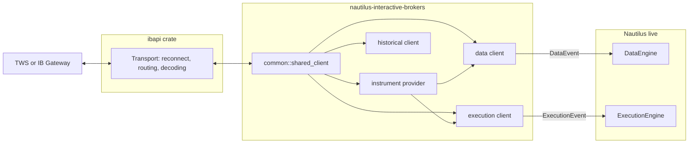
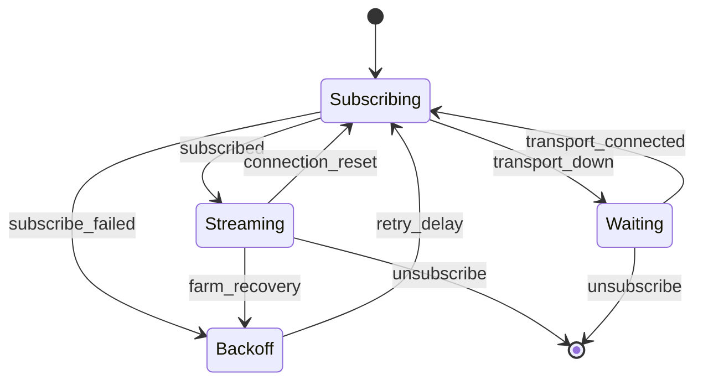
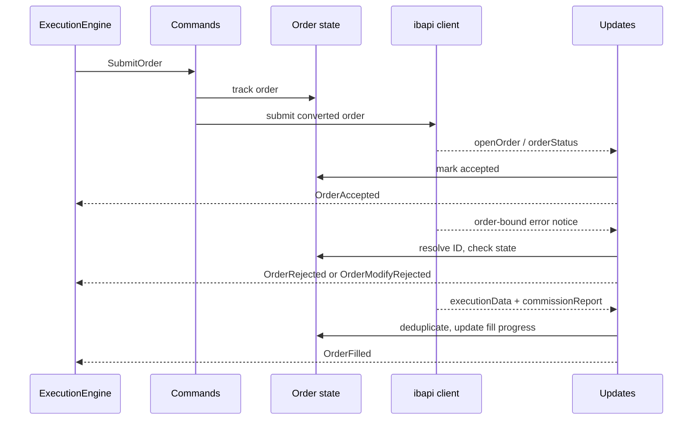
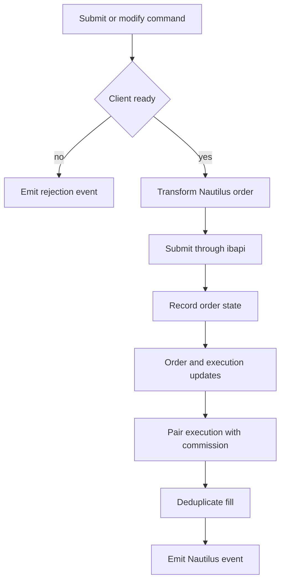
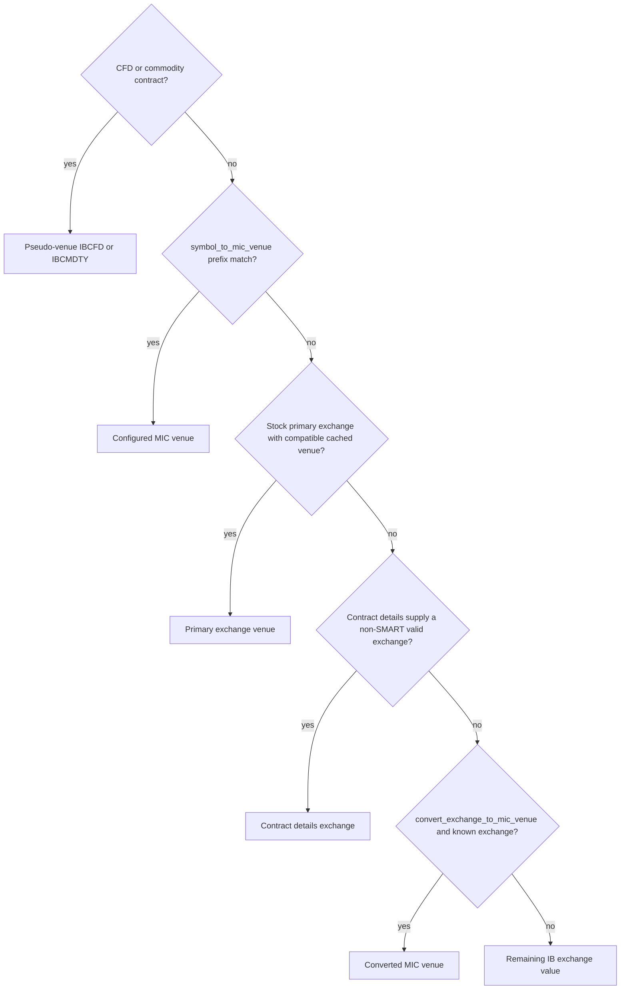

# Interactive Brokers

The Interactive Brokers adapter connects NautilusTrader to Trader Workstation (TWS) or IB Gateway
through the [TWS API](https://ibkrcampus.com/campus/ibkr-api-page/twsapi-doc/). It provides live
market data, execution, instrument discovery, historical requests, and optional management of a
Dockerized IB Gateway.

The Python package includes the adapter. Follow the [installation guide](../getting_started/installation.md),
then use the examples under [`examples/live/interactive_brokers`](https://github.com/nautechsystems/nautilus_trader/tree/develop/examples/live/interactive_brokers/).

## Connect to TWS or IB Gateway

Enable socket API access in TWS or IB Gateway before starting a client. IB uses these default ports:

| Application | Paper trading | Live trading |
| ----------- | ------------- | ------------ |
| TWS         | `7497`        | `7496`       |
| IB Gateway  | `4002`        | `4001`       |

The pinned `ibapi 4.0.1` transport requires TWS or IB Gateway server protocol version **213 or newer**.
This is the API protocol version, not the application's release number. Older servers are unsupported
even when their TCP port accepts connections. [Issue #4796](https://github.com/nautechsystems/nautilus_trader/issues/4796)
reports this failure with protocol 187 on Gateway 10.41. Upgrade TWS or IB Gateway before connecting.
The transport rejects an older version before sending `StartApi` when the server completes the initial
handshake. If an old server does not answer that handshake, the connection timeout also applies;
increasing the timeout does not add protocol support.

The adapter defaults to `127.0.0.1:4002`. Each process connected to the same TWS or Gateway session
needs a distinct IB API `client_id`. An execution client ID cannot be a multiple of `1000` because
the adapter partitions order IDs with `client_id % 1000`.

The data and execution clients can share one provider configuration:

```python
from nautilus_trader.adapters import interactive_brokers as ib
from nautilus_trader.model import AccountId
from nautilus_trader.model import InstrumentId
from nautilus_trader.model import TraderId


trader_id = TraderId.from_str("TRADER-001")
account_id = AccountId.from_str("IB-DU123456")
provider_config = ib.InteractiveBrokersInstrumentProviderConfig(
    symbology_method=ib.SymbologyMethod.SIMPLIFIED,
    load_ids={InstrumentId.from_str("AAPL.XNAS")},
)

data_config = ib.InteractiveBrokersDataClientConfig(
    host="127.0.0.1",
    port=7497,
    client_id=101,
    market_data_type=ib.MarketDataType.DELAYED_FROZEN,
    instrument_provider=provider_config,
)

exec_config = ib.InteractiveBrokersExecutionClientConfig(
    host="127.0.0.1",
    port=7497,
    client_id=102,
    account_id="DU123456",
    instrument_provider=provider_config,
)

data_factory = ib.InteractiveBrokersDataClientFactory()
exec_factory = ib.InteractiveBrokersExecutionClientFactory()
```

Pass these factories and configs to `LiveNode.builder`. The
[`connect_with_tws.py`](https://github.com/nautechsystems/nautilus_trader/blob/develop/examples/live/interactive_brokers/connect_with_tws.py)
example shows the complete node setup. Its default invocation constructs the node offline; set
`IB_V2_RUN_NODE=1` to connect.

### Market data modes

| Enum value                      | IB mode                                      |
| ------------------------------- | -------------------------------------------- |
| `MarketDataType.REALTIME`       | Live subscribed data.                        |
| `MarketDataType.FROZEN`         | Last available live data after market close. |
| `MarketDataType.DELAYED`        | Delayed data.                                |
| `MarketDataType.DELAYED_FROZEN` | Last available delayed data.                 |

IB permissions still determine which mode and instruments return data. Delayed or delayed-frozen
data can support paper-account checks outside market hours, but it does not prove a live tick path.

### Dockerized IB Gateway

`DockerizedIBGateway` manages the
[gnzsnz IB Gateway container](https://github.com/gnzsnz/ib-gateway-docker). Supply credentials in
the config or set `TWS_USERNAME` and `TWS_PASSWORD`:

```python
from nautilus_trader.adapters import interactive_brokers as ib


gateway = ib.DockerizedIBGateway(
    ib.DockerizedIBGatewayConfig(
        trading_mode=ib.TradingMode.PAPER,
        read_only_api=True,
        timeout=300,
    ),
)
gateway.safe_start_blocking()

data_config = ib.InteractiveBrokersDataClientConfig(
    host=gateway.host,
    port=gateway.port,
    client_id=101,
)
```

Start the gateway before constructing clients that connect. Python owns the container lifecycle
through `DockerizedIBGateway`; the client configs accept only `host` and `port`. Set
`read_only_api=False` only when the gateway must accept orders. Readiness uses login messages from
the current container session, so retained logs from an earlier session cannot report a false ready
state.

## Architecture

The adapter is one Rust implementation exposed through the native Rust API and PyO3 bindings.
It translates between IB's TWS API and the Nautilus live engines, and it does not own a
transport: the `ibapi` crate speaks the TWS socket protocol and reconnects it, while the
adapter's job is domain mapping, subscription lifecycle, and policy (commands, events,
instrument conversion, stream resubscription, and execution reconciliation). That boundary
explains the crate's layout, and it is why the `http` and `websocket` modules standard in other
adapters do not exist here.



Data, execution, and historical clients with the same `(host, port, client_id)` share one
reference-counted `ibapi` connection. Concurrent acquisition for the same key converges on one
connection, and the registry removes it after the final client releases its handle.

| Module       | Responsibility                                                                    |
| ------------ | --------------------------------------------------------------------------------- |
| `common`     | Contracts, enums, generic spread IDs, symbology, and shared connections.          |
| `providers`  | Contract qualification, chain discovery, venue resolution, and instrument cache.  |
| `data`       | Live subscriptions, historical request routing, conversion, and stream recovery.  |
| `execution`  | Commands, order state, updates, reports, conditions, spreads, and reconciliation. |
| `historical` | Standalone instrument, bar, and tick requests.                                    |
| `gateway`    | Docker container configuration, lifecycle, and readiness.                         |
| `python`     | PyO3 classes, enums, factories, and conversion boundaries.                        |
| `config`     | Typed data, execution, provider, and gateway configuration.                       |
| `factories`  | `DataClientFactory` and `ExecutionClientFactory` implementations.                 |

The integration surface with the rest of Nautilus is deliberately thin. The node builder hands
each factory a typed config; the factory builds the client and seeds the instrument provider
from the engine cache, which the adapter never writes. The data client sends typed data events
(ticks, bars, instruments, and correlated request responses) and the execution client sends
typed execution events (order events, fills, and account state) into the engines through their
event channels; these channels are the only paths into the engines. The adapter registers its
factories and config extractors with the global PyO3 registry, which is how Python
`TradingNode` configurations reach the Rust factories. Reconciliation is a pull interface
driven by the execution engine (see [Reconciliation](#reconciliation)).

### Reconnect and resubscribe

The `ibapi` transport reconnects the socket with Fibonacci backoff up to a bounded attempt
count, then establishes a complete session; a TCP connection followed by a transient handshake
or startup error consumes an attempt and retries instead of ending recovery. A successful
reconnect resets open subscription channels by delivering a connection-reset error to each; on
exhaustion the transport shuts down and the adapter reports disconnected. Each data stream then
waits for the transport, subscribes again, and retries failed resubscriptions with a delay. One
generic stream driver owns this lifecycle policy for every stream type, so recovery behavior
cannot drift between quotes, trades, depth, bars, greeks, and index prices. Market-data farm
notices use the same stream policy without treating a farm outage as a socket failure. TWS
resets the session's market-data type to realtime after a reconnect; the notice monitor
restores the configured frozen or delayed mode before releasing recovered subscriptions.

Order-bound error frames arrive on the order update stream as notices carrying the originating
order or request ID, delivered by the transport's routing layer rather than a decoded message
variant, so the update stream stays alive across error frames.



Quotes, trades, depth, bars, option greeks, and index prices follow this lifecycle. Before a depth
stream applies data from a replacement subscription, it clears the existing book so stale levels
cannot survive. If the order-update or global notice stream ends, the execution client reports
disconnected instead of appearing healthy with a dead stream.

### Order identity and cancellation

Distinct broker permanent IDs sharing one client order reference remain separate physical orders.
Additional orders use separate client order IDs under the original strategy, with a
`DUPLICATE_ORDER_OF:<parent>` tag. Their full quantity comes from an order snapshot, and actual
executions determine fills. An unresolved duplicate group blocks modification.

With `strategy_only=True` (the default), the strategy issues individual cancellations for its own orders.
With `strategy_only=False`, cancel-all is instrument-wide within the selected account and side.
A side-filtered cancel-all skips duplicate orders whose broker side is still unknown.
Canceling the original order
also considers its known working duplicates. The adapter cancels only uniquely bound routes owned by
the configured API client; ambiguous or unbound orders remain explicitly unresolved and require TWS
binding or operator action. One cancellation confirmation does not establish group completion.

Risk checks and execution use the same account routing. An unresolved account produces
`ACCOUNT_UNRESOLVED` rather than skipping account checks.

### Execution order flow

The execution client is split along message direction: outbound commands (submit, modify,
cancel), inbound venue updates, combo-fill assembly, and account streams are separate modules
sharing one order-state owner. That owner holds the client-to-venue ID maps, active orders, and
a bounded terminal-order cache behind a single lock; the terminal cache absorbs IB's execution
replays after a reconnect, so a completed order's re-sent fills deduplicate instead of
duplicating. The client converts each Nautilus order once, applies optional IB tags, and then
submits it through `ibapi`.





Every engine-visible order event originates from venue evidence on the update stream:
`OrderAccepted` requires an order status or open-order message, never local send success. An
order-bound IB error notice resolves against tracked orders and is handled by order state.
Before acceptance, an order rejection code (200 to 399) emits a terminal `OrderRejected`; any
other error code triggers a venue query, and the order is rejected only when IB lists it neither
as open nor as completed, since IB sends such codes for orders it keeps working (10349 sets the
time in force from an order preset). After acceptance a notice emits `OrderModifyRejected` when
a modify is pending and `OrderCancelRejected` when a cancel is pending, and otherwise triggers a
venue presence query
rather than a terminal event, because IB reports modify rejections with the same codes while
the original order keeps working. Warning codes (2100 to 2169), warning-form order messages
(code 399 with a `Warning:` line), and the cancel confirmation (202) never terminalize an order.
The global notice stream handles error frames that cannot be routed to an individual request or
order. Ambiguous command outcomes resolve through a venue query that recovers missed fills from
execution history before inferring any terminal state, so a fill can never be misreported as a
cancellation. Cancel-all prefers the tracked TWS order ID over the permanent ID, which lets the
originating client cancel its own live orders without a cross-client lookup.

## Data capabilities

| Nautilus data type | Live subscribe | Historical request | Notes                                     |
| ------------------ | -------------- | ------------------ | ----------------------------------------- |
| Instrument         | No             | Yes                | Startup loading and explicit requests.    |
| Quote tick         | Yes            | Yes                | Tick-by-tick or batched `reqMktData`.     |
| Trade tick         | Yes            | Yes                | Tick-by-tick live and historical trades.  |
| Bar                | Yes            | Yes                | External time bars.                       |
| Book delta         | Yes            | No                 | Market depth with book clear on recovery. |
| Index price        | Yes            | No                 | Index price events.                       |
| Option greeks      | Yes            | No                 | Greeks plus option open interest.         |

Set `batch_quotes=False` to prefer tick-by-tick bid/ask subscriptions. The client falls back to
`reqMktData` when tick-by-tick quotes are unavailable, and BAG spread quotes always use
`reqMktData`. `ignore_quote_tick_size_updates=True` filters quote events whose only change is size.

The quote cache assembles bid and ask updates into complete quote ticks. IB no-quote sentinels
(price `-1` without a size, or a zero price with zero size) are filtered before ticks are built
and clear the affected book side, so a one-sided market emits nothing rather than stale values.
Genuine zero and negative prices, including a `-1` price with a size, which calendar spreads
produce routinely, flow through.

For historical data, `HistoricalInteractiveBrokersClient` accepts an instrument provider and data
client config. Constructing this Python client connects immediately, so keep it behind the same
explicit run gate as the request:

```python
from nautilus_trader.adapters import interactive_brokers as ib


provider_config = ib.InteractiveBrokersInstrumentProviderConfig()
provider = ib.InteractiveBrokersInstrumentProvider(provider_config)
config = ib.InteractiveBrokersDataClientConfig(
    host="127.0.0.1",
    port=7497,
    client_id=180,
    market_data_type=ib.MarketDataType.DELAYED,
    instrument_provider=provider_config,
)

# This constructor connects to TWS or IB Gateway.
client = ib.HistoricalInteractiveBrokersClient(provider, config)
```

| Method                | Selectors and controls                                                                                                                                       |
| --------------------- | ------------------------------------------------------------------------------------------------------------------------------------------------------------ |
| `request_instruments` | Accepts Nautilus instrument IDs, IB contract dictionaries, or both.                                                                                          |
| `request_bars`        | Accepts bar specification strings, an end time, and either a start time or IB duration string; contracts or instrument IDs select the instruments.           |
| `request_ticks`       | Accepts `IbHistoricalTickType.TRADES` or `BID_ASK`, a bounded time range, contracts or instrument IDs, regular-hours filtering, timeout, and a result limit. |

Historical tick requests need both a start and an end time, page backward from the end time with a
default cap of 10,000 ticks when no limit is given, send only an end bound (IB misinterprets requests carrying both), and
deduplicate the boundary second that IB's second-resolution end encoding re-delivers. When one
second holds a full page and the window cannot retreat, the request stops with a warning
instead of looping. A bar request whose segment fails returns an error rather than a series
with a silent hole. Historical trade ticks with IB's zero size are skipped before constructing
the positive-quantity Nautilus type; other invalid conversions still fail the request.

IB controls pacing, available history, supported bar sizes, and regular-trading-hours filtering.
For continuous futures, IB rejects an explicit bar end time. The adapter omits it and requests one
duration segment anchored to the request time, so the result can fall outside the requested start
and end range.

## Execution capabilities

### Order types

| Nautilus order type    | IB order type       | Price inputs                          |
| ---------------------- | ------------------- | ------------------------------------- |
| `MARKET`               | Market              | None.                                 |
| `LIMIT`                | Limit               | Limit price.                          |
| `MARKET_TO_LIMIT`      | Market to limit     | None.                                 |
| `STOP_MARKET`          | Stop                | Trigger price.                        |
| `STOP_LIMIT`           | Stop limit          | Limit and trigger prices.             |
| `MARKET_IF_TOUCHED`    | Market if touched   | Trigger price.                        |
| `LIMIT_IF_TOUCHED`     | Limit if touched    | Limit and trigger prices.             |
| `TRAILING_STOP_MARKET` | Trailing stop       | Trailing offset and optional trigger. |
| `TRAILING_STOP_LIMIT`  | Trailing stop limit | Limit and trailing offsets.           |

The adapter maps `DAY`, `GTC`, `IOC`, `FOK`, `GTD`, and `AT_THE_OPEN` time in force values. A market
or limit order with `AT_THE_CLOSE` becomes the corresponding market-on-close or limit-on-close IB
order. GTD orders include their Nautilus expiry time in the IB order.

The adapter rejects post-only orders. Quote quantity is valid only for inverse instruments, and
trailing orders support only price offsets. These checks emit coded `OrderDenied` reasons before
the adapter sends an order to IB.

### Commands and order attributes

| Capability        | Support | Notes                                                        |
| ----------------- | ------- | ------------------------------------------------------------ |
| Submit order      | Yes     | Single orders and generic spreads.                           |
| Submit order list | Yes     | Includes bracket and linked orders.                          |
| Modify order      | Yes     | Quantity, price, trigger, and IB parameter updates.          |
| Cancel order      | Yes     | Uses tracked venue order state.                              |
| Cancel all orders | Yes     | Scoped through the execution client.                         |
| Query order       | Yes     | Checks open orders, then executions before inferring cancel. |
| Mass status       | Yes     | Orders, fills, and positions.                                |

Pass `params={"exchange": "IEX"}` to submit, submit-list, or modify commands to override the
cached contract exchange for that command. An omitted or empty value retains the cached exchange.

IB-specific order fields use a tag prefixed with `IBOrderTags:` followed by a JSON object. Keys use
the `ibapi` order field names in snake case or lower camel case. Unknown fields fail the order
conversion. The adapter normalizes `order_type`, `tif` or `timeInForce`, `action`, `oca_type`,
`trigger_method`, `origin`, `short_sale_slot`, `volatility_type`,
`reference_price_type`, `rule_80_a`, `open_close`, and `NonGuaranteed`. Active, stop, cancel, manual,
and good-till timestamps use `%Y%m%d %H:%M:%S UTC`.

The optional `conditions` array accepts these shapes:

| Condition        | Required fields | Optional fields and defaults                                                |
| ---------------- | --------------- | --------------------------------------------------------------------------- |
| `price`          | None            | `conId=0`, `exchange="SMART"`, `price=0`, `isMore=True`, `triggerMethod=0`. |
| `time`           | None            | `time=""`, `isMore=True`.                                                   |
| `margin`         | None            | `percent=0`, `isMore=True`.                                                 |
| `execution`      | `symbol`        | `secType="STK"`, `exchange="SMART"`.                                        |
| `volume`         | None            | `conId=0`, `exchange="SMART"`, `volume=0`, `isMore=True`.                   |
| `percent_change` | None            | `conId=0`, `exchange="SMART"`, `changePercent=0`, `isMore=True`.            |

Every condition accepts `conjunction="and"` or `"or"`; the default is `"and"`.

### Account state

On connect and on each account query, the execution client reads one `reqAccountSummary`
snapshot for the configured account and maps its tags to typed balances and margins. It then
reads one `reqAccountUpdates` snapshot for the same account and cancels that stream once IB
signals the download end. Every raw tag and key from both snapshots lands in `AccountState.info`
under its IB name, so values IB publishes only on `updateAccountValue` (for example
`PostExpirationExcess` and `PostExpirationMargin`) are readable from Python alongside the summary
tags such as `TotalCashValue`. A key reported once per currency keeps the last value IB sends.

## Reconciliation

Mass status requests query three independent IB sources:

- Open and completed orders produce order status reports.
- Executions paired with commission reports produce fill reports.
- Account positions produce position status reports.

Position updates do not create synthetic order status reports. If IB returns a position without
matching order or fill history, the execution engine can adopt the position from the position report
alone by creating its internal reconciliation fill. This preserves the report boundary: the adapter
reports venue state, while the engine owns inferred state needed to reconcile its cache.

On connect, the execution client resolves the instrument of every open position in the account and
publishes any the cache does not hold, so a position in a contract outside the provider's `load_ids`
is still recovered at startup rather than aborting the node.

For a pending-cancel order missing from the open-orders snapshot, the adapter checks execution
history before emitting a canceled event. Replayed executions are deduplicated after terminal order
state is evicted, including generated spread-leg fills.

Set `track_option_exercise_from_position_update=True` only when position changes should drive option
exercise tracking. This setting does not restore synthetic position-derived order reports.

After a restart, orders a previous session left working return as open external orders. IB's
`PreSubmitted` status, used for example while an order waits for its `goodAfterTime`, maps to
`ACCEPTED`. The execution client resolves each restored order's IB order ID from its `PERM-`
venue order ID and tracks it, so later IB status updates, fills, and cancels reach the owning
strategy. Filled orders from the previous session reconcile from their real executions; the
adapter reports no price for market-type orders, so reconciliation never infers a fill at price 0.

Replies to execution queries (`reqExecutions`) also arrive on IB's order update stream. The adapter
treats only unsolicited execution details there as live fills, so startup and periodic execution
queries do not apply the same fills again.

## Symbology and instruments

`InteractiveBrokersInstrumentProviderConfig.symbology_method` selects one of two public methods:

| Method                       | Use                                                       |
| ---------------------------- | --------------------------------------------------------- |
| `SymbologyMethod.SIMPLIFIED` | Readable IDs for normal instrument lookup and examples.   |
| `SymbologyMethod.RAW`        | IDs that retain the IB security type for explicit lookup. |

One symbology value built from this setting drives every mapping site in the adapter, so data,
execution, and provider paths always resolve identical IDs. Raw symbology
(`AAPL=STK.SMART`) is the lossless escape hatch: it preserves the IB local symbol and security
type for instruments the simplified format rules cannot express, such as complex international
listings.

Futures and futures-option IDs carry the local symbol reported by IB, such as `YMM6.XCBT` and
`YMM6 C45000.XCBT`. The adapter does not rewrite the contract year, so identifiers stay stable
across catalogs and caches.

The symbology method controls symbol conversion. Venue selection is a separate step with this
precedence:

1. CFD and commodity contracts use the adapter pseudo-venues `IBCFD` and `IBCMDTY`.
1. A matching `symbol_to_mic_venue` prefix wins for other security types.
1. Stock primary exchange and a compatible cached venue take precedence over SMART routing.
1. Contract details can supply a non-SMART valid exchange.
1. `convert_exchange_to_mic_venue=True` converts a known exchange to its MIC.
1. The remaining IB exchange value becomes the venue.



The pseudo-venues are part of the adapter namespace under both symbology methods. For example,
simplified symbology can produce `IBDE30.IBCFD` or `XAUUSD.IBCMDTY`, while raw symbology adds the
security type to the symbol. These venues take precedence over `symbol_to_mic_venue` and
`convert_exchange_to_mic_venue`; they do not describe a separate IB routing mechanism.

Use the same provider config for data and execution clients so both resolve identical IDs. Startup
`load_ids` and `load_contracts` are required entries: client initialization fails if a configured
instrument cannot be resolved.

### Provider configuration

| Option                          | Default      | Purpose                                                 |
| ------------------------------- | ------------ | ------------------------------------------------------- |
| `symbology_method`              | `SIMPLIFIED` | Select simplified or raw symbol conversion.             |
| `load_ids`                      | Empty        | Load Nautilus instrument IDs at startup.                |
| `load_contracts`                | Empty        | Load IB contract dictionaries at startup.               |
| `min_expiry_days`               | `None`       | Minimum relative expiry for chain loading.              |
| `max_expiry_days`               | `None`       | Maximum relative expiry for chain loading.              |
| `build_options_chain`           | `None`       | Override option chain construction.                     |
| `build_futures_chain`           | `None`       | Override futures chain construction.                    |
| `cache_validity_days`           | `None`       | Lifetime of persisted instrument data.                  |
| `convert_exchange_to_mic_venue` | `False`      | Convert known IB exchanges to MIC venues.               |
| `symbol_to_mic_venue`           | Empty        | Override venues for matching symbol prefixes.           |
| `filter_sec_types`              | Empty        | Exclude selected IB security types.                     |
| `filter_callable`               | `None`       | Apply a Python callable by fully qualified import path. |
| `cache_path`                    | `None`       | Persist the instrument cache at the selected path.      |

Contract dictionaries use IB field names. Chain bounds are days from the request date:

```python
from nautilus_trader.adapters import interactive_brokers as ib


provider_config = ib.InteractiveBrokersInstrumentProviderConfig(
    load_contracts=[
        {
            "secType": ib.IbSecurityType.STOCK.as_str(),
            "symbol": "SPY",
            "exchange": "SMART",
            "primaryExchange": "ARCA",
            "build_options_chain": True,
            "min_expiry_days": 7,
            "max_expiry_days": 45,
        },
        {
            "secType": ib.IbSecurityType.CONTINUOUS_FUTURE.as_str(),
            "symbol": "ES",
            "exchange": "CME",
            "build_futures_chain": True,
            "min_expiry_days": 30,
            "max_expiry_days": 180,
        },
    ],
)
```

Without a chain flag, `CONTFUT` represents IB's continuous future. IB limits continuous futures to
historical data; they do not support live subscriptions or orders.

### Generic spreads

Build spread IDs with `new_generic_spread_id`; do not format their leg grammar by hand. All legs
must use the same venue, and the ratio sign selects the IB leg action:

```python
from nautilus_trader.model import new_generic_spread_id


spread_id = new_generic_spread_id(
    [
        (long_leg.id, 1),
        (short_leg.id, -1),
    ],
)
```

Load the leg instruments before requesting the spread. The provider qualifies each leg, constructs
the IB BAG contract, and caches the resulting spread instrument before data subscription or order
submission.

Spread executions come back from IB as combo fills. The adapter assembles per-leg fills from the
parsed spread definition and apportions commissions by the parsed leg count, so leg fill
reports stay consistent with the spread ID grammar regardless of the leg symbols' shape.

## Configuration reference

### Data client

| Option                           | Default                   | Purpose                                                                     |
| -------------------------------- | ------------------------- | --------------------------------------------------------------------------- |
| `host`                           | `127.0.0.1`               | TWS or IB Gateway host.                                                     |
| `port`                           | `4002`                    | TWS or IB Gateway socket port.                                              |
| `client_id`                      | `1`                       | IB API client ID.                                                           |
| `use_regular_trading_hours`      | `True`                    | Restrict requests to regular trading hours.                                 |
| `market_data_type`               | `MarketDataType.REALTIME` | Select real-time, frozen, delayed, or delayed-frozen data.                  |
| `ignore_quote_tick_size_updates` | `False`                   | Filter quote changes that update only size.                                 |
| `connection_timeout`             | `300` seconds             | Set the socket connection timeout.                                          |
| `request_timeout`                | `60` seconds              | Set the IB request timeout.                                                 |
| `handle_revised_bars`            | `False`                   | Process revised real-time bars.                                             |
| `batch_quotes`                   | `True`                    | Prefer `reqMktData` for quote subscriptions.                                |
| `all_last_trades`                | `True`                    | Include AllLast trades; set `False` to request Last trades only.            |
| `subscription_idle_timeout_secs` | `None`                    | Emit a custom-data event after this many seconds without subscription data. |
| `instrument_provider`            | Default provider config   | Configure contract and instrument loading.                                  |
| `dockerized_gateway`             | `None`                    | Reserved and rejected; start the gateway separately.                        |

When `subscription_idle_timeout_secs` is set, each live subscription emits
`InteractiveBrokersSubscriptionIdle` once per interval of inactivity. A new market-data update rearms the
notification. Subscribe to `DataType("InteractiveBrokersSubscriptionIdle")` through the message bus to
receive these events in `on_data`. Each event identifies the data client, instrument, subscription, timeout,
and last local data receipt time. A quiet instrument or closed market can also trigger an event; inactivity
alone does not restart a subscription.

### Execution client

| Option                                       | Default                 | Purpose                                              |
| -------------------------------------------- | ----------------------- | ---------------------------------------------------- |
| `host`                                       | `127.0.0.1`             | TWS or IB Gateway host.                              |
| `port`                                       | `4002`                  | TWS or IB Gateway socket port.                       |
| `client_id`                                  | `1`                     | IB API client ID.                                    |
| `account_id`                                 | `None`                  | Raw IB account code such as `DU123456`.              |
| `connection_timeout`                         | `300` seconds           | Set the socket connection timeout.                   |
| `request_timeout`                            | `60` seconds            | Set the IB request timeout.                          |
| `fetch_all_open_orders`                      | `False`                 | Request all open orders visible to the session.      |
| `track_option_exercise_from_position_update` | `False`                 | Track option exercise through position updates.      |
| `instrument_provider`                        | Default provider config | Configure contract and instrument loading.           |
| `dockerized_gateway`                         | `None`                  | Reserved and rejected; start the gateway separately. |

### Dockerized gateway

| Option            | Default                            | Purpose                                                              |
| ----------------- | ---------------------------------- | -------------------------------------------------------------------- |
| `username`        | `TWS_USERNAME`                     | Set the IB login username.                                           |
| `password`        | `TWS_PASSWORD`                     | Set the IB login password; debug output and serialization redact it. |
| `trading_mode`    | `TradingMode.PAPER`                | Select paper or live login and port mapping.                         |
| `read_only_api`   | `True`                             | Disable order entry through the Gateway API.                         |
| `timeout`         | `300` seconds                      | Bound startup readiness; valid values are `1` through `3600`.        |
| `container_image` | `ghcr.io/gnzsnz/ib-gateway:stable` | Select the container image reference.                                |
| `vnc_port`        | `None`                             | Expose VNC on a port from `5900` through `5999`; `None` disables it. |

`DockerizedIBGateway` exposes asynchronous and blocking `start`, `safe_start`, and `stop` methods,
plus `container_status`. The safe start variants reuse a ready container and replace an unhealthy
one.

## Python enum reference

All public Python enum names use `SCREAMING_SNAKE_CASE`. IB conversion enums expose `as_str()` or
`as_i32()` when callers need the corresponding wire value.

### Connection, contracts, and instruments

| Enum                                | Purpose and key members                                                                                                                                |
| ----------------------------------- | ------------------------------------------------------------------------------------------------------------------------------------------------------ |
| `ContainerStatus`                   | Gateway lifecycle: `NO_CONTAINER`, `CONTAINER_CREATED`, `CONTAINER_STARTING`, `CONTAINER_STOPPED`, `NOT_LOGGED_IN`, `READY`, or `UNKNOWN`.             |
| `MarketDataType`                    | Subscription mode: `REALTIME`, `FROZEN`, `DELAYED`, or `DELAYED_FROZEN`.                                                                               |
| `SymbologyMethod`                   | Instrument ID mapping: `SIMPLIFIED` or `RAW`.                                                                                                          |
| `TradingMode`                       | Gateway login mode: `PAPER` or `LIVE`.                                                                                                                 |
| `IbSecurityType`                    | IB contract types: stock, option, future, continuous future, index, futures option, FX, spread, warrant, bond, commodity, news, fund, crypto, and CFD. |
| `IbOptionRight`                     | Option side: `CALL` or `PUT`.                                                                                                                          |
| `IbBondIdentifierKind`              | Bond identifier: `CUSIP` or `ISIN`.                                                                                                                    |
| `IbFundAssetType`                   | Fund asset classification: none, other, money market, fixed income, multi-asset, equity, sector, guaranteed, or alternative.                           |
| `IbFundDistributionPolicyIndicator` | Fund distribution policy: `NONE`, `ACCUMULATION_FUND`, or `INCOME_FUND`.                                                                               |

### Market and historical data

| Enum                     | Purpose and key members                                                                                                 |
| ------------------------ | ----------------------------------------------------------------------------------------------------------------------- |
| `IbHistoricalBarSize`    | Historical bar intervals from one second through one month.                                                             |
| `IbHistoricalTickType`   | Historical ticks: `TRADES` or `BID_ASK`.                                                                                |
| `IbHistoricalWhatToShow` | Historical source such as trades, midpoint, bid, ask, volatility, fee rate, schedule, or adjusted last.                 |
| `IbRealtimeBarSize`      | IB real-time bar size; IB supports `SEC5`.                                                                              |
| `IbRealtimeWhatToShow`   | Real-time bar source: `TRADES`, `MIDPOINT`, `BID`, or `ASK`.                                                            |
| `IbTradingHours`         | Regular or extended trading hours.                                                                                      |
| `IbTickType`             | The full IB numeric tick-field set, including live and delayed prices, sizes, option values, yields, NAVs, and volumes. |

### Orders and conditions

| Enum                     | Purpose and key members                                                                                                  |
| ------------------------ | ------------------------------------------------------------------------------------------------------------------------ |
| `IbAction`               | Order action and execution side: buy, sell, bought, sold, sell short, or sell long.                                      |
| `IbOrderType`            | Native IB order types used by conversion and `IBOrderTags`; direct Nautilus support is limited to the order table above. |
| `IbOrderStatus`          | Native lifecycle status from API pending through submitted, pending cancel, canceled, filled, or inactive.               |
| `IbTimeInForce`          | IB time in force values used for order conversion.                                                                       |
| `IbBuilderTimeInForce`   | Time in force values accepted by IB order builders, including good-till-crossing and opening auction.                    |
| `IbOrderOpenClose`       | Open or close designation.                                                                                               |
| `IbOrderOrigin`          | Customer or firm origin.                                                                                                 |
| `IbShortSaleSlot`        | No short-sale slot, broker, or third party.                                                                              |
| `IbAuctionStrategy`      | Match, improvement, or transparent auction strategy.                                                                     |
| `IbAuctionType`          | Opening, closing, or volatility auction.                                                                                 |
| `IbReferencePriceType`   | Average of NBBO or NBBO.                                                                                                 |
| `IbVolatilityType`       | Daily or annual volatility.                                                                                              |
| `IbRule80A`              | IB Rule 80A account and agency classifications.                                                                          |
| `IbOcaType`              | No OCA, cancel with block, reduce with block, or reduce without block.                                                   |
| `IbTriggerMethod`        | Default, double bid/ask, last, double last, bid/ask, last or bid/ask, or midpoint.                                       |
| `IbLiquidity`            | None, added, removed, routed out, or explicitly unknown liquidity.                                                       |
| `IbComboLegOpenClose`    | Same, open, close, or unknown combo-leg designation.                                                                     |
| `IbLegAction`            | Buy or sell combo-leg action.                                                                                            |
| `IbConditionKind`        | Price, time, margin, execution, volume, or percent-change condition.                                                     |
| `IbConditionConjunction` | `AND` or `OR`.                                                                                                           |
| `IbExerciseAction`       | Exercise or lapse an option.                                                                                             |
| `IbTwapStrategyType`     | Marketable, matching midpoint, matching same side, or matching last.                                                     |
| `IbRiskAversion`         | Get done, aggressive, neutral, or passive.                                                                               |
| `IbArticleType`          | Text or binary news article.                                                                                             |

## Test the adapter

For market data, `examples/live/interactive_brokers/data_tester.py` streams the configured
instrument with the built-in `DataTester` actor, and the Rust equivalent runs with
`cargo run --example ib-data-tester --package nautilus-interactive-brokers --features examples`.
Both connect to a locally running TWS or IB Gateway and place no orders.

The Python examples construct offline by default. Their run flags separate connection from order
submission. The Rust execution tester uses the same boundary:

```bash
# Construct the tester without connecting.
cargo run --example ib-exec-tester \
  --package nautilus-interactive-brokers \
  --features examples

# Connect in dry-run mode. This can subscribe but cannot submit tester orders.
NAUTILUS_IB_ACCOUNT_ID=DU123456 \
NAUTILUS_IB_RUN=1 \
cargo run --example ib-exec-tester \
  --package nautilus-interactive-brokers \
  --features examples

# Submit paper-account stop orders only after the second opt-in.
NAUTILUS_IB_ACCOUNT_ID=DU123456 \
NAUTILUS_IB_RUN=1 \
NAUTILUS_IB_LIVE_ORDERS=1 \
NAUTILUS_IB_EXEC_PROFILE=stop \
cargo run --example ib-exec-tester \
  --package nautilus-interactive-brokers \
  --features examples
```

Available execution profiles are `lifecycle`, `cancel-modify`, `rejection`, `options`, `stop`,
`stop-limit`, `trailing`, `bracket`, and `unsupported-flags`. Run live tests only against an account
and instruments intended for the selected profile.

## Troubleshooting

- Confirm TWS or IB Gateway is running, logged in, and configured for socket API access.
- Confirm the port matches the application and trading mode.
- Confirm no other process uses the same IB API client ID.
- Confirm the account has permission for the requested market data type and instrument.
- Run the ignored connection smoke explicitly when a paper session is available:
  `cargo test -p nautilus-interactive-brokers --test connection -- --ignored`.

For IB error codes, pacing, and connection settings, see the
[official TWS API reference](https://ibkrcampus.com/campus/ibkr-api-page/twsapi-doc/).
