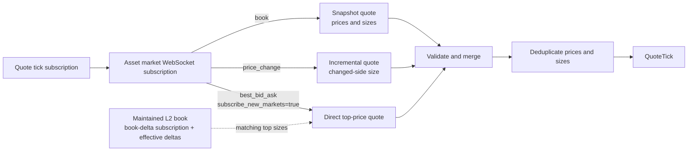

# Polymarket

Founded in 2020, Polymarket is a decentralized prediction market platform that enables
traders to speculate on event outcomes by buying and selling outcome tokens.

NautilusTrader provides a venue integration for data and execution via Polymarket's Central Limit
Order Book (CLOB) API.

The adapter is implemented in Rust and exposed to Python at
`nautilus_trader.adapters.polymarket`; data, execution, signing, and WebSocket
operations therefore have the same behavior from Rust and Python.

NautilusTrader supports multiple Polymarket signature types for order signing, which gives
flexibility for different wallet configurations while NautilusTrader handles signing and order
preparation.

## Installation

The Python package includes the Polymarket adapter; no adapter-specific extra is required.

To install the latest pre-release build:

```bash
uv pip install --pre nautilus_trader
```

To build the Python package from source, run from the repository root:

```bash
make build-debug
```

For development wheels and source-build prerequisites, see the
[installation guide](../getting_started/installation.md).

## Examples

The maintained examples are available in
[`crates/adapters/polymarket/examples`](https://github.com/nautechsystems/nautilus_trader/tree/develop/crates/adapters/polymarket/examples)
for Rust. For Python, use the Rust-native [data tester](https://github.com/nautechsystems/nautilus_trader/blob/develop/examples/live/polymarket/data_tester.py),
[execution tester](https://github.com/nautechsystems/nautilus_trader/blob/develop/examples/live/polymarket/exec_tester.py),
or [Up/Down smoke tester](https://github.com/nautechsystems/nautilus_trader/blob/develop/examples/live/polymarket/updown_smoke_tester.py).
The exec tester configurations apply the
[close precision](#exec-tester-close-residuals) needed for Polymarket market SELL orders.

## Binary options

A [binary option](https://en.wikipedia.org/wiki/Binary_option) is a type of financial exotic
option contract in which traders bet on the outcome of a yes-or-no proposition. If the
prediction is correct, the trader receives a fixed payout; otherwise, they receive nothing.
NautilusTrader represents Polymarket outcome tokens as `BinaryOption` instruments.

Polymarket uses **pUSD** as the collateral token for trading, [see below](#pusd) for more
information.

## Polymarket documentation

Polymarket offers resources for different audiences:

- [Polymarket Learn](https://learn.polymarket.com/): Educational content and guides for users
  to understand the platform and how to engage with it.
- [Polymarket CLOB API](https://docs.polymarket.com/getting-started/api): Technical
  documentation for developers interacting with the Polymarket CLOB API.

## Overview

This guide assumes a trader is setting up for both live market data feeds and trade execution.
The Rust implementation includes multiple components, which can be used together or separately
depending on the use case.

- `PolymarketWebSocketClient`: Low-level WebSocket API connectivity built on the Nautilus Rust
  `WebSocketClient`.
- `PolymarketInstrumentProvider`: Instrument parsing and loading functionality for `BinaryOption`
  instruments.
- `PolymarketDataClient`: A market data feed manager.
- `PolymarketExecutionClient`: A trade execution gateway.
- `PolymarketDataClientFactory`: Factory for Polymarket data clients (used by the live node
  builder).
- `PolymarketExecutionClientFactory`: Factory for Polymarket execution clients (used by the live
  node builder).

:::note
Python users configure live nodes through the exported configuration and factory classes. The
direct WebSocket, provider, data client, and execution client types are Rust-only implementation
components.
:::

## pUSD

**pUSD** is the collateral token used for trading on Polymarket. It is a standard ERC-20 token on
Polygon, backed by USDC.

The proxy contract address is
[0xC011a7E12a19f7B1f670d46F03B03f3342E82DFB](https://polygonscan.com/address/0xC011a7E12a19f7B1f670d46F03B03f3342E82DFB)
on Polygon. Direct on-chain funding wraps Polygon USDC.e (bridged USDC) into pUSD
through the [CollateralOnramp](https://docs.polymarket.com/resources/contracts).
The Bridge API can also deposit supported assets from other chains and credit pUSD
after conversion.

## Wallets and accounts

To interact with Polymarket via NautilusTrader, you'll need a **Polygon**-compatible wallet (such as MetaMask).

### Signature types

Polymarket supports multiple signature types for order signing and verification:

| Signature Type | Wallet Type                    | Description                                                              | Use Case                                                                                       |
| -------------- | ------------------------------ | ------------------------------------------------------------------------ | ---------------------------------------------------------------------------------------------- |
| `0`            | EOA (Externally Owned Account) | Standard EIP712 signatures from wallets with direct private key control. | **Adapter default.** Allowlisted EOA trading where the funder and signer are the same address. |
| `1`            | Proxy Wallet                   | Legacy smart contract wallet created through email or social login.      | Requires the Proxy Wallet `funder` address.                                                    |
| `2`            | Safe Wallet                    | Legacy Gnosis Safe wallet created with an external browser wallet.       | Requires the Safe Wallet `funder` address.                                                     |
| `3`            | Deposit Wallet                 | ERC-1271 smart wallet used for new Polymarket account wallets.           | Requires the Deposit Wallet `funder`; API credentials stay bound to the signer.                |

:::note
Polymarket uses Deposit Wallets for account wallets deployed on or after May 4, 2026. Direct EOA
trading requires an allowlisted EOA. See the Polymarket
[wallet and authentication guide](https://docs.polymarket.com/trading/wallets-auth) for the account
types and setup flows.
:::

NautilusTrader defaults to signature type 0 (EOA) but can be configured to use any of the supported signature types via the `signature_type` configuration parameter.

A single wallet address is supported per trader instance when using environment variables, or
multiple wallets can be configured through multiple execution client instances.

:::note
Ensure your wallet is funded with **pUSD**, otherwise you will encounter the "not enough balance
or allowance" API error when submitting orders.
:::

### Setting EOA allowances

The adapter includes a direct on-chain allowance command for EOA accounts. Use it only when the
funding wallet is the signer (`SignatureType::Eoa`). Fund the EOA with POL for gas, set
`POLYMARKET_PK`, and run:

```bash
cargo run -p nautilus-polymarket --bin polymarket-set-allowances
```

The command grants maximum pUSD and CTF approvals to the CTF Exchange, Neg Risk CTF Exchange, and
`NegRiskCtfCollateralAdapter`. It uses `https://polygon.drpc.org` by default; set
`POLYGON_RPC_URL` to use another Polygon RPC endpoint. Run it again if Polymarket changes the
required contracts.

The command grants approvals only; it does not revoke approvals for contracts that are no longer
targets. Treat revocation as a separate on-chain operation and confirm that no remaining redemption
or settlement flow depends on the legacy approval before submitting it.

### Setting smart-wallet allowances

Do not run the EOA command for a proxy, Safe, or Deposit Wallet funder. It signs transactions from
the EOA key and cannot grant approvals from a smart contract wallet.

Use Polymarket's [wallet and authentication flow](https://docs.polymarket.com/trading/wallets-auth)
to submit the approvals from the account wallet. Deposit Wallet approvals use an ordered `WALLET`
batch authorized by the signer and submitted through the Relayer. Safe and Proxy Wallet approvals
need their wallet-specific SDK payloads.

### Refreshing and verifying allowances

After the approval transaction confirms, refresh the CLOB cache. Rust callers can use
`PolymarketClobHttpClient::update_balance_allowance` with `AssetType::Collateral` for pUSD. Use
`AssetType::Conditional` with a conditional token ID for a conditional-token allowance. Both forms
also need the account's signature type. The authenticated request maps to
`GET /balance-allowance/update`. Use `SignatureType::Poly1271` for a Deposit Wallet.

The balance-allowance endpoint has two decoding paths:

| Path                                              | Used for                                             | Allowance handling                                                                                                                                                             | Meaning of success                                                                 |
| ------------------------------------------------- | ---------------------------------------------------- | ------------------------------------------------------------------------------------------------------------------------------------------------------------------------------ | ---------------------------------------------------------------------------------- |
| `PolymarketClobHttpClient::get_balance_allowance` | Reading spender allowance evidence.                  | Requires the plural `allowances` map; rejects a missing map, a non-null legacy singular value, malformed or non-canonical keys, and semantic duplicates such as case variants. | Balance plus an unambiguous map; required targets and amounts still need checking. |
| Internal balance-only projection                  | Account state refresh and market-buy fee adjustment. | Ignores allowance fields; its return type cannot expose or grant approval authority.                                                                                           | Balance only; required CLOB spender approvals remain unproven.                     |

Use the strict path whenever a decision depends on allowance evidence so ambiguous wire data cannot
become approval authority.

## API keys

The execution client requires CLOB L2 credentials. Create or derive them with Polymarket's
[API authentication flow](https://docs.polymarket.com/getting-started/api#authentication). The
adapter provides a command that reads `POLYMARKET_PK` and prints the created or derived credentials:

```bash
cargo run -p nautilus-polymarket --bin polymarket-create-api-key
```

Set the returned values as:

- `POLYMARKET_API_KEY`
- `POLYMARKET_API_SECRET`
- `POLYMARKET_PASSPHRASE`

The credentials authenticate the private-key signer, not a proxy or Deposit Wallet funder. The
public data client does not require these credentials.

## Configuration

When setting up NautilusTrader to work with Polymarket, it's crucial to properly configure the necessary parameters, particularly the private key.

**Parameters**:

- `private_key`: The private key for your wallet used to sign orders. The interpretation depends on your `signature_type` configuration. If not explicitly provided in the configuration, it will automatically source the `POLYMARKET_PK` environment variable.
- `funder`: The **pUSD** funding wallet address used for funding trades. If not provided,
  will source the `POLYMARKET_FUNDER` environment variable.
- API credentials: You will need to provide the following API credentials to interact with the Polymarket CLOB:
  - `api_key`: If not provided, will source the `POLYMARKET_API_KEY` environment variable.
  - `api_secret`: If not provided, will source the `POLYMARKET_API_SECRET` environment variable.
  - `passphrase`: If not provided, will source the `POLYMARKET_PASSPHRASE` environment variable.
  API credentials are created from the private-key signer for L2 authentication. For
  `POLY_1271`, the deposit wallet remains the `funder`, but it is not the L2 auth address.
- `auto_load_missing_instruments` (default `True`): Controls whether subscribe and
  request commands for an instrument that is not already in the cache trigger an
  ad-hoc load via the Gamma API. When disabled, subscribing to an uncached
  instrument returns an error. See [Runtime instrument loading](#runtime-instrument-loading).
- `auto_load_debounce_ms` (default `100`): The window (milliseconds) over which
  concurrent auto-load requests are coalesced into a single batched Gamma call.

:::tip
We recommend using environment variables to manage your credentials.
:::

## Data capability

Polymarket supports live `L2_MBP` order book deltas, quotes, and trades. Instrument definitions are
published by bootstrap, configured refreshes, new-market discovery, and tick-size changes.

## Orders capability

Polymarket operates as a prediction market with a more limited set of order types and instructions compared to traditional exchanges.

:::tip
For Polymarket live execution, set both the disconnection timeout and post-stop delay to 30
seconds with `with_timeout_disconnection_secs(30)` and `with_delay_post_stop_secs(30)`. The delay
allows residual order and cancellation events to arrive before disconnection, while the timeout
gives each client time to shut down cleanly.
:::

### Order types

| Order Type             | Binary Options | Notes                                                                     |
| ---------------------- | -------------- | ------------------------------------------------------------------------- |
| `MARKET`               | ✓              | **BUY orders require quote quantity**, SELL orders require base quantity. |
| `LIMIT`                | ✓              |                                                                           |
| `STOP_MARKET`          | -              | *Not supported by Polymarket*.                                            |
| `STOP_LIMIT`           | -              | *Not supported by Polymarket*.                                            |
| `MARKET_IF_TOUCHED`    | -              | *Not supported by Polymarket*.                                            |
| `LIMIT_IF_TOUCHED`     | -              | *Not supported by Polymarket*.                                            |
| `TRAILING_STOP_MARKET` | -              | *Not supported by Polymarket*.                                            |

### Quantity semantics

Polymarket interprets order quantities differently depending on the order type *and* side:

- **Limit** orders interpret `quantity` as the number of conditional tokens (base units).
- **Market SELL** orders also use base-unit quantities.
- **Market BUY** orders interpret `quantity` as quote notional in **pUSD**.

As a result, a market buy order submitted with a base-denominated quantity will execute far
more size than intended.

When submitting market BUY orders, set `quote_quantity=True` on the order. The adapter converts
the quote amount (pUSD) to the signed base-unit share amount before posting to the CLOB. The
Polymarket execution client denies base-denominated market buys to
prevent unintended fills.

```python
# Market BUY with quote quantity (spend $10 pUSD)
order = strategy.order_factory.market(
    instrument_id=instrument_id,
    order_side=OrderSide.BUY,
    quantity=instrument.make_qty(10.0),
    time_in_force=TimeInForce.IOC,  # Maps to Polymarket FAK
    quote_quantity=True,  # Interpret as pUSD notional
)
strategy.submit_order(order)
```

### Execution instructions

| Instruction   | Binary Options | Notes                                                |
| ------------- | -------------- | ---------------------------------------------------- |
| `post_only`   | ✓              | Supported for limit orders with `GTC` or `GTD` only. |
| `reduce_only` | -              | *Not supported by Polymarket*.                       |

### Time-in-force options

Polymarket calls the `POST /order` field `orderType`. In NautilusTrader, this maps to
`TimeInForce`. The valid combinations depend on the Nautilus order type:

| Nautilus TIF | Polymarket `orderType` | Nautilus order scope | Notes                                                     |
| ------------ | ---------------------- | -------------------- | --------------------------------------------------------- |
| `GTC`        | `GTC`                  | `LIMIT` only         | Good-Til-Cancelled; rests on the book.                    |
| `GTD`        | `GTD`                  | `LIMIT` only         | Good-Til-Date; rests until expiration, fill, or cancel.   |
| `FOK`        | `FOK`                  | `LIMIT` or `MARKET`  | Fill the full size immediately or cancel the whole order. |
| `IOC`        | `FAK`                  | `LIMIT` or `MARKET`  | Fill available size immediately and cancel the remainder. |

:::note
Polymarket uses `FAK` (Fill-And-Kill) for the semantics NautilusTrader calls
`IOC` (Immediate or Cancel). Polymarket docs classify `FOK` and `FAK` as market
order types, while `GTC` and `GTD` are limit order types. For Nautilus `MARKET`
orders, the adapter accepts only `IOC` and `FOK`; `GTC` and `GTD` are valid for
resting `LIMIT` orders only.
:::

:::note
Read each market's `min_order_size` from its order book; active markets commonly report five
shares. Marketable orders can also be rejected below **1 pUSD** in notional value with
`invalid amount for a marketable BUY order … min size: $1`. The adapter leaves instrument
`min_quantity` unset because market BUY quantities use pUSD while the other order quantities use
shares.
:::

:::note
Set `GTD` expiry at least three minutes after submission. The adapter denies shorter expiries before
signing, using whole Unix seconds, and accepts the exact three-minute boundary. The venue reports expiry
as an `OrderCanceled` event, not `OrderExpired`.
:::

### Advanced order features

| Feature            | Binary Options | Notes                            |
| ------------------ | -------------- | -------------------------------- |
| Order modification | -              | Cancellation functionality only. |
| Bracket/OCO orders | -              | *Not supported by Polymarket.*   |
| Iceberg orders     | -              | *Not supported by Polymarket.*   |

### Batch operations

| Operation    | Binary Options | Notes                                                                                                                               |
| ------------ | -------------- | ----------------------------------------------------------------------------------------------------------------------------------- |
| Batch Submit | ✓              | The adapter uses `POST /orders` for independent limit-order batches (max 15 orders per request). See [Batch submit](#batch-submit). |
| Batch Modify | -              | *Not supported by Polymarket*.                                                                                                      |
| Batch Cancel | ✓              | The adapter uses `DELETE /orders`. See [Batch cancel](#batch-cancel).                                                               |

#### Batch submit

`SubmitOrderList` commands are routed to Polymarket's `POST /orders` endpoint. The endpoint
accepts at most 15 orders per request (`BATCH_ORDER_LIMIT`); larger lists are split into
sequential 15-order chunks.

- Only `LIMIT` orders are batched. `MARKET` orders inside the list are routed to the
  single-order path, which signs a marketable order and submits it with `FAK` or `FOK`
  based on Nautilus `time_in_force`.
- `reduce_only` orders, `quote_quantity` orders, and `post_only` with market TIF
  (`IOC` or `FOK`) are rejected before submission.
- A single eligible order falls through to `POST /order` so it keeps the single-order retry
  semantics; the batch path deliberately disables retry because the venue does not expose an
  idempotency key.
- If the batch response omits a leg, that order stays submitted for reconciliation. The adapter
  registers the signed order's expected hash so later WebSocket events and cancels still resolve to
  the local order. An omitted response cannot prove that the venue rejected the order.

#### Batch cancel

`BatchCancelOrders` commands with resolved venue order IDs use Polymarket's
[`DELETE /orders`](https://docs.polymarket.com/api-reference/trade/cancel-multiple-orders)
endpoint. The adapter sends sequential chunks and chooses each new chunk from the smaller of the
endpoint's 1,000-ID limit and the signer's current cancellation burst. A signer starts with the
Standard 120-token burst, and a tier reported by one response applies to the next new chunk.

Each chunk retries independently with the same order IDs unless a lower reported tier requires
smaller chunks before the retry. The adapter merges the completed responses and processes each
requested order once after every chunk succeeds. If a later chunk exhausts its retries, earlier
chunks may already have changed venue state, but the adapter emits no partial per-order results;
reconciliation resolves the unknown overall outcome.

Without a side filter, `CancelAllOrders` applies to the selected outcome token for the authenticated
execution account, across strategies, even when the local order cache has no matches. The adapter
sends the instrument's raw token ID as `asset_id` to
[`DELETE /cancel-market-orders`](https://docs.polymarket.com/api-reference/trade/cancel-orders-for-a-market).
For a `Buy` or `Sell` filter, the venue mass-cancel endpoint cannot express the side. The adapter
therefore selects matching open orders from the local cache and sends their venue order IDs through
the same chunked `DELETE /orders` path. A matching order that is still awaiting its venue order ID
retains a pending cancellation, which is sent after submission resolves.

### Submit response handling

Polymarket's public documentation describes successful
[`POST /order`](https://docs.polymarket.com/api-reference/trade/post-a-new-order) responses
with `success`, `orderID`, `status`, and `errorMsg`, and documents
[API errors](https://docs.polymarket.com/resources/error-codes) as structured error responses.
It does not document statusless client exceptions or transport failures as venue rejections.

#### Successful responses

For a successful response with a non-empty `orderID`, the adapter uses `status` to choose the
initial Nautilus state and whether an order with `FOK` time-in-force needs the five-second REST
check. The venue meanings follow Polymarket's
[order lifecycle](https://docs.polymarket.com/concepts/order-lifecycle).

| Submit `status` | Venue meaning                                | Initial Nautilus state                                         | `FOK` REST check |
| --------------- | -------------------------------------------- | -------------------------------------------------------------- | ---------------- |
| `live`          | Resting on the book                          | `Accepted`                                                     | Kept             |
| `matched`       | Matched immediately                          | `Accepted`                                                     | Skipped          |
| `delayed`       | Matching delay in progress                   | `Submitted` until WebSocket or REST activity proves acceptance | Kept             |
| `unmatched`     | Delay completed without a match; now resting | `Accepted`                                                     | Kept             |
| Absent or empty | No status supplied                           | `Accepted` for compatibility                                   | Kept             |

These meanings apply to the submit response. The adapter treats `delayed` as a submit outcome, not
as a market configuration signal. A `matched` response skips the REST check because the submit
already confirms an immediate match. An absent or empty status emits `OrderAccepted` for
compatibility and keeps the REST check.

#### Delayed responses

A `delayed` response:

- Registers the venue order identity and fill tracking immediately and retains them independently of
  bounded replay caches. Later order queries, WebSocket events, and reconciliation reports can then
  resolve the local `ClientOrderId`.
- Leaves the order `Submitted` until a fill, order update, or REST result proves acceptance.
- Emits `OrderAccepted` before any fill, cancellation, expiry, or filled status that proves
  acceptance.
- Resolves an unfilled `FOK` directly as `OrderRejected` when REST returns `UNMATCHED`.

#### Definitive and ambiguous outcomes

Polymarket applies the shared [command outcome policy](../concepts/execution.md#command-outcomes) and
the adapter guide's
[diagnostic and strategy reason boundary](../developer_guide/adapters.md#separate-diagnostics-from-strategy-facing-reasons)
at its execution boundary.

Ambiguous failures include:

- Transport failures and timeouts.
- Retry exhaustion after an attempt with an unknown outcome.
- Response serialization or decoding failures.
- Local I/O failures.
- Server-side failures.
- HTTP 425 responses.
- HTTP 429 responses that lack CLOB signer-limiter headers.

| Outcome                                                                                       | Nautilus result             | Reason                                    |
| --------------------------------------------------------------------------------------------- | --------------------------- | ----------------------------------------- |
| `success=false`, a documented processing error, or another non-retryable client/API error     | `OrderRejected`             | The response proves rejection.            |
| Single or batch `FOK`: `success=true`, non-empty `orderID`, no status, and the unfilled error | Immediate `OrderRejected`   | The venue proves it killed the order.     |
| Batch leg: `success=true`, empty `orderID`, and a populated `errorMsg`                        | `OrderRejected` with reason | The venue proves it rejected that leg.    |
| No `orderID` and no reason                                                                    | Remains `Submitted`         | The response does not prove rejection.    |
| Any ambiguous failure                                                                         | Remains `Submitted`         | The adapter cannot determine the outcome. |
| Definitive retry error after an earlier ambiguous attempt                                     | Remains `Submitted`         | The earlier attempt may have succeeded.   |
| Failure before `POST /order`, such as a failed pUSD balance lookup                            | `OrderDenied`               | The adapter did not submit the order.     |

Local denials format the strategy-facing reason from `OrderDeniedReason`. The leading token is the
stable code, such as `VALIDATION_FAILED` or `UNSUPPORTED_ORDER_TYPE`.

The proven unfilled `FOK` response skips the REST check. After an ambiguous single-order attempt, a
later HTTP error or decoded rejection does not prove that the first attempt failed. An accepted
response carrying the matching valid order ID confirms the deterministic signed order; a rejection
does not, even with a matching ID.

Diagnostic errors retain the HTTP status and transport or rate-limit context. For venue HTTP status,
rate-limit, and exchange errors, strategy-facing rejection events use the venue reason; other
failures use the bounded error description. The adapter reads the first non-blank string from
`error`, then `errorMsg`, and collapses whitespace and control characters. An empty body becomes
`empty response body`. A plain-text or malformed response uses the same bounded fallback. Invalid
UTF-8 is decoded lossily before that handling. An HTML response uses its title when available, or its
visible text otherwise. Reasons are limited to 512 characters, including the literal
`... [truncated]` truncation marker and its preceding space.

On single and batch submit responses, the exact normalized reason `order_version_mismatch` becomes
`Polymarket CLOB order version mismatch; adapter supports V2 only`. Other submit response reasons
remain unchanged after normalization.

The venue reports a post-only crossing as `invalid post-only order: order crosses book`. Only that
exact normalized reason sets `OrderRejected.due_post_only=true`; other post-only errors remain
ordinary rejections.

Retry-managed single-order submit and cancel requests retry HTTP 425, 429, and 5xx responses with the
configured backoff. After retries are exhausted, submit classification is:

| HTTP status                          | Retried | Submit result       | Notes                                                                                                                                |
| ------------------------------------ | ------- | ------------------- | ------------------------------------------------------------------------------------------------------------------------------------ |
| 425                                  | Yes     | Remains `Submitted` | Too Early does not prove rejection.                                                                                                  |
| 429 with CLOB signer-limiter headers | Yes     | `OrderRejected`     | Requires `Poly-RateLimit-Remaining`, `Poly-RateLimit-Reset`, or `Poly-RateLimit-Tier`. An earlier unknown attempt stays `Submitted`. |
| 429 without those headers            | Yes     | Remains `Submitted` | Cloudflare or another hop may have seen the request.                                                                                 |
| 5xx                                  | Yes     | Remains `Submitted` | The command may already have been applied.                                                                                           |
| 400, 401, 403, 404                   | No      | `OrderRejected`     | Non-retryable client or API error.                                                                                                   |

A malformed successful submit response also remains unknown and enters reconciliation instead of
becoming a terminal rejection.

Cancel classification uses the same evidence classes. A non-retryable client or API error after the
cancel is sent, or a local failure that proves the cancel was never transmitted, emits
`OrderCancelRejected`. HTTP 425, headerless 429, and 5xx leave the cancel in flight.

#### Unknown-outcome reconciliation

For an unknown outcome, the adapter:

- Derives the expected Polymarket order hash from the signed EIP-712 order when possible and caches
  it as the `VenueOrderId`. Later WebSocket events and reconciliation reports attach to the local
  `ClientOrderId` instead of becoming external orders.
- Applies the signed quote-to-base quantity update for a quote-quantity market BUY.
- Defers a pending cancel until the expected venue order ID is known.
- Registers fill tracking under that venue order ID.

### Position management

| Feature          | Binary Options | Notes                                                |
| ---------------- | -------------- | ---------------------------------------------------- |
| Query positions  | ✓              | Current user positions from the Polymarket Data API. |
| Position mode    | -              | Binary outcome positions only.                       |
| Leverage control | -              | No leverage available.                               |
| Margin mode      | -              | No margin trading.                                   |

### Order querying

| Feature              | Binary Options | Notes                          |
| -------------------- | -------------- | ------------------------------ |
| Query open orders    | ✓              | Active orders only.            |
| Query order history  | ✓              | Limited historical data.       |
| Order status updates | ✓              | Real-time order state changes. |
| Trade history        | ✓              | Execution and fill reports.    |

### Contingent orders

| Feature            | Binary Options | Notes                                                                     |
| ------------------ | -------------- | ------------------------------------------------------------------------- |
| Order lists        | -              | Independent order batches exist, but linked contingency semantics do not. |
| OCO orders         | -              | *Not supported by Polymarket*.                                            |
| Bracket orders     | -              | *Not supported by Polymarket*.                                            |
| Conditional orders | -              | *Not supported by Polymarket*.                                            |

### Precision limits

Polymarket enforces different precision constraints based on tick size and `orderType`.

**Binary Option instruments** typically support up to 6 decimal places for amounts
(with 0.0001 tick size), but **market orders (`FAK` and `FOK`) have stricter
precision requirements**:

- **Market order types (`FAK` and `FOK`):**
  - The direct maker amount is limited to **2 decimal places**.
  - The computed taker amount uses the market tick precision plus two size decimals.
  - A limit order submitted with `FAK` or `FOK` must also satisfy the stricter market-order amount
    validation. The venue rejects values that are valid for a resting order but not for that
    market-order type.
  - For a limit BUY, `quantity` is the nominal share quantity at the limit price. With `FAK` or
    `FOK`, Polymarket spends the resulting pUSD maker budget, so price improvement can return more
    shares; the adapter updates the order quantity to the actual fill.
  - The adapter denies the order before signing when `quantity * price` is not an exact cent amount.
    It does not round and recompute the nominal share quantity because that would change the signed
    price/amount ratio.

- **Resting limit order types (`GTC` and `GTD`):** More flexible precision based on
  market tick size.

### Tick size precision hierarchy

| Tick Size | Price Decimals | Size Decimals | Amount Decimals |
| --------- | -------------- | ------------- | --------------- |
| 0.1       | 1              | 2             | 3               |
| 0.01      | 2              | 2             | 4               |
| 0.005     | 3              | 2             | 5               |
| 0.0025    | 4              | 2             | 6               |
| 0.001     | 3              | 2             | 5               |
| 0.0001    | 4              | 2             | 6               |

:::note

- The adapter validates tick size before signing. It also denies limit `FAK` or `FOK` BUYs whose
  maker amount has more than two decimal places. This applies to single and batch submissions.
- Resting `GTC` and `GTD` limit orders and all SELL orders keep their tick-derived amount precision.
- The adapter rejects limit prices outside the current market's `tick_size` to `1 - tick_size`
  range before signing.
- The published `BinaryOption` advertises `min_price` and `max_price` equal to `tick_size` and
  `1 - tick_size`, so consumers that clamp to the instrument bounds stay within that accepted range.
- Market-order precision limits include two decimals for the sell size plus tick-derived bounds
  for the computed amount.
- Tick sizes can change dynamically during market conditions, particularly when markets become one-sided.

:::

### Tick size change handling

When a market's tick size changes (`tick_size_change` WebSocket event), old
book levels can be invalid on the new grid (for example `0.505` fits a `0.001`
tick but not a `0.01` tick). To keep old-grid prices out of the new epoch, the
adapter treats the change as a book epoch transition:

1. Publish the updated `BinaryOption` with the new `price_increment`, `price_precision`, and
   tick-relative `min_price`/`max_price` bounds.
2. Drop the local order book for the instrument.
3. Mark the instrument as awaiting a fresh snapshot.
4. Drop incremental `price_change` book deltas until the snapshot arrives.
5. Reseed the book from the snapshot and resume normal processing.

Trade ticks and the instrument update flow through unchanged. Quote handling
follows `drop_quotes_missing_side`: when enabled, quote ticks require both bid
and ask prices; when disabled, missing sides use Polymarket boundary prices with
zero size. The adapter can keep quotes flowing during the gap by reading `best_bid`
and `best_ask` from each `price_change`.

## Trades

Trades on Polymarket can have the following statuses:

- `MATCHED`: Trade has been matched and sent to the executor service. The executor submits it as
  a transaction to the Exchange contract.
- `MINED`: Trade is observed to be mined into the chain, and no finality threshold is established.
- `CONFIRMED`: Trade has achieved strong probabilistic finality and was successful.
- `RETRYING`: Trade transaction has failed (revert or reorg) and is being retried/resubmitted by the operator.
- `FAILED`: Trade has failed and is not being retried.

Once a trade is initially matched, subsequent status updates arrive through the user WebSocket.
The execution adapter emits one `OrderFilled` at `MATCHED`. It treats `MINED` and `RETRYING` as
settlement updates without emitting another fill. `CONFIRMED` records finality and refreshes the
account. If the trade reaches `FAILED`, the adapter emits one `OrderFillVoided` for each locally
applied fill and refreshes the account. The correction does not relist the failed quantity, but it
preserves any maker-order remainder that was already working. An execution-complete order becomes
`VOIDED`. Matched WebSocket fills retain the raw trade fields in the `info` field of the
`OrderFilled` event.

### Trade ID derivation

Polymarket does not publish a trade ID on `last_trade_price` market-data events.
The adapter derives a deterministic `TradeId` from the asset ID, side, price,
size, and timestamp via the Rust `determine_trade_id` function using FNV-1a.
For execution fills, taker reports use the venue's trade `id` in both REST reconciliation and the
user WebSocket, so the same fill deduplicates across sources. A maker trade can fill more than one
of the user's resting orders, so maker reports combine the venue trade ID with the maker venue
order ID. The same venue event yields the same trade ID across replays.
For historical Data API trades, the loader uses
`{transactionHash[-24:]}-{asset[-4:]}-{seq:06d}` to distinguish fills in one transaction.

## Fees

The adapter reads each instrument's `fee_schedule` and applies its `rate` and `exponent` as:

```text
platform fee = shares * rate * (price * (1 - price)) ^ exponent
```

The current public schedule uses exponent `1`, which is Polymarket's published
`C * feeRate * p * (1 - p)` formula. Platform fees peak at `p = 0.50`, decrease
symmetrically toward the extremes, and apply only to taker fills.

| Category        | Taker `feeRate` | Maker `feeRate` | Maker rebate |
| --------------- | --------------- | --------------- | ------------ |
| Crypto          | 0.07            | 0               | 20%          |
| Sports          | 0.05            | 0               | 15%          |
| Finance         | 0.04            | 0               | 25%          |
| Politics        | 0.04            | 0               | 25%          |
| Economics       | 0.05            | 0               | 25%          |
| Culture         | 0.05            | 0               | 25%          |
| Weather         | 0.05            | 0               | 25%          |
| Other / General | 0.05            | 0               | 25%          |
| Mentions        | 0.04            | 0               | 25%          |
| Tech            | 0.04            | 0               | 25%          |
| Geopolitics     | 0               | 0               | -            |

Every order signed by the adapter carries the hard-coded Nautilus builder code. Its builder fee
rate is fixed at zero and is not configurable.

### Fill commission handling

`FillReport.commission` is denominated in pUSD and rounds the platform fee to five decimal places.
If the exact result cannot be represented as `Money`, the adapter returns an error instead of using
zero or a generic commission. See the
[commission failure contract](../developer_guide/adapters.md#commission-failure-handling).

A commission construction error fails a direct fill report request, terminal trade-history recovery,
or complete mass status. Startup returns a mass-status error without applying that client's reports.
When an active order report cannot enrich matched quantity from confirmed fills, the adapter logs
the error and caps matched quantity to local and previously tracked evidence so reconciliation
defers the unsupported residual. The adapter does not drop a failed fill while returning an order or
position report that could recreate its quantity without the Polymarket commission.

:::note
For the latest public schedule, see Polymarket's
[Fees](https://docs.polymarket.com/trading/fees) documentation.
:::

### Backtest fee model

Use `PolymarketFeeModel` for backtests that include taker fees and maker rebates. The model reads
`rate`, `rebateRate`, `exponent`, and `takerOnly` from each binary option instrument's
`fee_schedule`. It requires a maker or taker liquidity side, a fill price in `[0, 1]`, and a
taker-only schedule with exponent `1`. Unsupported instruments and invalid inputs return an error;
an instrument without a fee schedule produces zero commission.

```rust tab="Rust"
use nautilus_execution::models::fee::FeeModelHandle;
use nautilus_polymarket::models::PolymarketFeeModel;

let fee_model = FeeModelHandle::new(PolymarketFeeModel);
```

```python tab="Python"
from nautilus_trader.adapters.polymarket import PolymarketFeeModel

fee_model = PolymarketFeeModel()
```

Pass the Rust handle through
`nautilus_backtest::config::SimulatedVenueConfig::builder().fee_model(...)`. In Python, pass the model
to `BacktestEngine.add_venue` as `fee_model` or set it on `BacktestVenueConfig.fee_model`.

:::note
For maker fills, `fee_equivalent` is the platform fee formula above using the schedule's taker
`rate`. The model credits `fee_equivalent * rebateRate` as negative commission. This approximates
Polymarket's daily pool allocation because a backtest does not know the total fee equivalent from
other makers in that market.

Live maker fills have zero commission; Polymarket pays the actual pUSD rebate separately each day.
The model does not represent that payment as a separate event, and it does not model competition
between makers, daily aggregation, or the minimum payout threshold. See Polymarket's
[Maker Rebates Program](https://docs.polymarket.com/programs/maker-rebates) for the venue formula.
:::

## Reconciliation

The Polymarket API returns either all **active** (open) orders or specific orders when queried by
the Polymarket order ID (`venue_order_id`). The execution reconciliation procedure for Polymarket
is as follows:

- Generate order reports for all instruments with active (open) orders, as reported by Polymarket.
- Generate position reports from current user positions reported by Polymarket's Data API.
- Compare these reports with Nautilus execution state.
- Generate missing orders to bring Nautilus execution state in line with positions reported by
  Polymarket.

An individual order lookup can return a live or terminal status. When it instead returns no order,
the adapter recovers a cached individual order from trade history if its terminal WebSocket update
was missed. Only `CONFIRMED` trades contribute to recovered fills; pending and failed settlement
states do not.

Mass-status reconciliation pairs each order report with its venue fill reports. It applies the
real fills first to preserve trade IDs and commissions, then infers only any residual quantity
needed to reach the venue-reported status. When mass status declares no lookback, REST order
reports cap matched quantity to the greater of locally applied fills and authenticated
`CONFIRMED` trade history, so pending settlement cannot create an inferred fill. A bounded mass
status keeps the venue open-order `size_matched` so a live partial fill outside the lookback
window is not understated. Runtime order checks fetch confirmed trade history when the venue
reports more matched quantity than the local order and WebSocket fill tracker contain. Unpaired
fill reports retain the normal fill-only path.

A commission construction error fails the complete REST report request. Startup returns the error
without applying a mass status; periodic and targeted reconciliation defer the affected work. The
adapter does not drop the failed fill because an order or position report could then recreate its
quantity without the Polymarket commission.

### Single-order recovery from trades

`/data/order/{id}` can return live or terminal orders. When it returns no order for a known ID,
`generate_order_status_report` falls back to `/data/trades` filtered by the venue order ID. This
avoids the engine resolving a local `ACCEPTED` order as `REJECTED`, which would discard fills that
already happened at the venue. The cached order is resolved via `client_order_id`, falling back to
the cache's `venue_order_id` index when only the venue ID is known. When the request supplies or
resolves to a `client_order_id`, the cached order must be a base-denominated `LIMIT` order;
otherwise the request returns an error. An unassociated venue-order request without a cached order
defers to the engine rather than synthesizing an external order from trade history alone:

- Cached order + recovered fills covering the cached quantity (within
  `DUST_SNAP_THRESHOLD` for CLOB cent-tick truncation): returns `Filled`. The
  engine reconciles any delta over the cached `filled_qty` via inferred fill.
- Cached order + recovered fills that fall short of the cached quantity by
  more than dust: returns `Canceled` with the recovered `filled_qty`. The
  engine's CANCELED branch transitions the order at the cached `filled_qty`,
  so any newly recovered fills that arrived only via REST (not WS) are not
  applied in this rare partial-cancel case. Closing the order is preferred
  over leaving it stuck open; if exact fill metadata matters in this scenario
  the venue trade history can be reviewed manually.
- Cached order, no trades: returns `Canceled` with
  `cancel_reason="ORDER_NOT_FOUND_AT_VENUE"`.
- Cached order with any `MATCHED`, `MINED`, or `RETRYING` trade: a singular order query preserves
  the locally applied matched quantity while terminal REST recovery waits for `CONFIRMED` or
  `FAILED`.
- No cached order and no known client association (regardless of trades): returns `None`; the
  engine's not-found-at-venue path resolves the local entry.

The bulk open-order check cannot use this fallback for matched orders omitted by `GET /orders`.
With the default `open_check_open_only=true`, the engine leaves those cached orders open for later
reconciliation. With `open_check_open_only=false`, missing-order retries can mark an order rejected
before its pending settlement confirms. A singular order query or the next startup reconciliation
recovers the settled quantity from confirmed trade history.

## Fill quantity normalization

Polymarket wire amounts use six-decimal fixed-point mantissas. Market SELL signing truncates the
share-denominated `makerAmount` to two decimal places, while market BUY quote conversion can leave
a few microshares of drift between the registered and filled quantities. Both effects are fixed in
absolute share terms, so the adapter uses `DUST_SNAP_THRESHOLD = 0.01` shares. Anything at or above
that threshold remains a real partial fill or overfill.

| Direction | Source                                         | Adapter behavior                             |
| --------- | ---------------------------------------------- | -------------------------------------------- |
| Overfill  | Market BUY quote conversion (microshares)      | Snap fill down to `submitted_qty`            |
| Underfill | Signed or venue quantity truncation (`< 0.01`) | Normalize atomic FOK; cancel a FAK remainder |

Terminal quantity normalization triggers from the `MATCHED` order update for resting maker
orders, or directly on the confirming taker trade for atomic FOK orders. It emits a reconciliation
`OrderUpdated` which lowers the order quantity to the cumulative venue fill. It does not emit a
fill and does not change positions, balances, or commissions.

IOC maps to venue FAK. Once a taker trade confirms, every positive difference between
`original_size` and `size_matched` is an unfilled remainder which the venue has killed. The adapter
therefore emits `OrderCanceled` after the real fills instead of normalizing quantity or leaving the
order partially filled. REST reports apply the same rule when a `MATCHED` FAK has
`size_matched < original_size`. The same terminal handling runs after buffered fills drain when a
confirmed trade arrives before the submit response. A buffered `Canceled`, `Expired`, or
`Rejected` report takes precedence.

`FillReport.commission` always reflects the venue-reported size, not the
snapped quantity. The few-ulp difference is sub-microcent in pUSD.

The fill tracker is keyed by `venue_order_id` and registered on order
accept, so fill reports for orders placed in another session pass through
unchanged. `DUST_SNAP_THRESHOLD` is not configurable per-strategy; it lives
in `nautilus_polymarket::common::consts`.

### Order message size denomination

The user channel reports `original_size` on an `order` message as the signed `makerAmount`. For a
market order type (`FAK` or `FOK`) BUY that amount is the pUSD budget rather than a share count, so
a BUY of 100 shares at 0.01 reports `1`. The adapter divides by the order price to recover the
submitted share quantity before the size reaches the fill tracker or an order status report.

A SELL signs shares as its maker amount and needs no conversion. Resting types (`GTC` and `GTD`)
pass through unchanged: their denomination is unconfirmed, and converting a share-denominated size
would misreport every externally-managed resting order.

### Exec tester close residuals

`close_positions_qty_precision` is an `ExecTesterConfig` option. It defaults to `None`, which
submits the full position quantity. The Rust and Python Polymarket examples set it to `2` because
[market order maker amounts allow two decimals](#precision-limits). The examples also set
`close_positions_time_in_force=IOC`; custom
configurations must use `IOC` or `FOK` because Polymarket rejects `GTC` market orders.

On stop, the tester truncates only the submitted market SELL quantity to the configured decimal
precision and logs the exact difference at WARN level. It does not round the position state or
create a synthetic fill.

A 5 pUSD BUY that fills 5.1975 shares therefore submits a 5.19-share close. After the venue fills
that order, the position remains open at exactly 0.0075 shares. If the whole position is below 0.01
shares, the tester warns and submits no zero-quantity order. Treat close-on-stop as best-effort and
check the position and warning before assuming the account is flat. A non-zero close must also meet
the [1 pUSD marketable-order minimum](#time-in-force-options); rejection leaves the full position
open. See the [position reporting limitation](#limitations-and-considerations) for sub-0.01-share
venue reports.

## WebSockets

The `PolymarketWebSocketClient` is built on top of the high-performance Nautilus `WebSocketClient` base class, written in Rust.

### Data

The data adapter opens `market` subscriptions dynamically as instruments are requested. It spreads
those subscriptions across a pool of market WebSocket connections so that no single connection
carries more than `ws_max_subscriptions` assets. The pool grows lazily (a universe below the cap
stays on one connection) and closes a secondary connection once it owns no assets. Each connection
replays only its own assets on reconnect.

A single `price_change` payload can contain interleaved updates for several assets. The adapter
groups updates by instrument and publishes one atomic order book delta batch per instrument, while
quote processing remains in the venue payload order.

#### Quote ticks

The adapter exposes one quote tick subscription type. It does not expose separate
subscriptions for snapshot-derived, price-change-derived, and `best_bid_ask` quotes. Quote, book
delta, and trade subscriptions for the same instrument share one asset-scoped `market` WebSocket
subscription. A book delta subscription alone does not emit quote ticks; quote output remains gated
by an active quote subscription.

| Venue message  | Trigger                                      | Price source                      | Size source                                                 |
| -------------- | -------------------------------------------- | --------------------------------- | ----------------------------------------------------------- |
| `book`         | Book snapshot                                | Snapshot best bid and ask         | Snapshot best-level sizes                                   |
| `price_change` | Subscribed level update                      | Message `best_bid` and `best_ask` | Changed best-level size; previous quote or zero otherwise   |
| `best_bid_ask` | Top move with `subscribe_new_markets = true` | Direct message best bid and ask   | Maintained-book top or prior quote, depending on book state |



All three venue message paths converge on the same quote tick stream. Deduplication compares prices
and sizes with the last emitted quote regardless of which message type produced it.

##### `best_bid_ask` handling

With `subscribe_new_markets` enabled, the venue also sends `best_bid_ask` events when an asset's top
of book moves. Every market connection requests these asset-scoped events; only the primary
connection forwards global new-market and resolution events. The payload carries prices only, so the
adapter selects each side's size as follows:

- With [effective deltas](#effective-deltas), an active book delta subscription, and book updates not
  gated pending a valid snapshot, a side takes its size from the maintained local book when its top
  price matches. Before the first snapshot, or when the top does not match, its size is zero.
- Without a maintained local book, or while book updates are gated pending a valid snapshot, a side
  keeps the previous quote size when its top price matches. A moved or unknown side has zero size.

The adapter ignores events older than the last emitted quote or maintained local book. It also
rejects locked, crossed, out-of-range, and off-grid events.

An empty price, a bid at or below zero, or an ask at or above one is a missing side. By default,
`drop_quotes_missing_side` drops the event. When missing sides are allowed, the missing price uses
the current tick-relative venue bound and its size is zero.

#### Book snapshot validation

When a `book` snapshot includes a hash and its full preimage, the adapter reproduces it from the
exact wire values and level order. It logs and rejects a mismatch before the snapshot can update
local book state, emit snapshot-derived deltas or quotes, or resume gated book deltas.

Polymarket also sends hashed book updates that omit fields included in the server's hash preimage,
such as `tick_size` and `last_trade_price`. The adapter accepts these updates without hash
verification because their exact hash preimage is unavailable. Snapshots without a hash remain
compatible.

#### Effective deltas

`compute_effective_deltas` defaults to `false`. Enable it to trade extra processing for smaller
snapshot batches (see [Data client options](#data-client-options)):

- A full book snapshot with prior local state emits only net level changes: `ADD` for new levels,
  `UPDATE` for resized levels, and `DELETE` with the last known size for removed levels. No-op
  snapshots emit nothing, and the final record carries `F_LAST`.
- Without prior state, such as after a [tick size change](#tick-size-change-handling), the snapshot
  passes through unchanged to seed the new book epoch.
- Incremental `price_change` batches remain unchanged and update the local comparison state.
- When book deltas are subscribed, the maintained comparison book can supply matching sizes to
  `best_bid_ask` quote ticks. This can change those quote sizes and their unchanged-quote
  suppression, and the carried sizes can affect later `price_change` quotes. Trades are unchanged.

#### RTDS custom data

The data client also supports Polymarket's real-time data (RTDS) crypto, crypto TWAP, and equity
topics. Subscribe through generic custom data with a required, non-empty `symbol` metadata value.
TWAP subscriptions also require `window_seconds` equal to `30` or `60`:

```python
from nautilus_trader.adapters.polymarket import POLYMARKET_CLIENT_ID
from nautilus_trader.adapters.polymarket import PolymarketRtdsCryptoPrice
from nautilus_trader.adapters.polymarket import PolymarketRtdsCryptoTwap
from nautilus_trader.adapters.polymarket import PolymarketRtdsEquityPrice
from nautilus_trader.model import DataType

crypto_type = DataType(
    PolymarketRtdsCryptoPrice.__name__,
    metadata={"symbol": "btcusdt"},
)
equity_type = DataType(
    PolymarketRtdsEquityPrice.__name__,
    metadata={"symbol": "AAPL"},
)
twap_type = DataType(
    PolymarketRtdsCryptoTwap.__name__,
    metadata={"symbol": "BTC/USD", "window_seconds": 60},
)

strategy.subscribe_data(crypto_type, client_id=POLYMARKET_CLIENT_ID)
strategy.subscribe_data(equity_type, client_id=POLYMARKET_CLIENT_ID)
strategy.subscribe_data(twap_type, client_id=POLYMARKET_CLIENT_ID)
```

Symbol matching is case-insensitive, and published symbols are lowercase. Crypto RTDS uses the
`crypto_prices` topic; equity RTDS uses `equity_prices`. Equity updates prefer
`full_accuracy_value` when the venue supplies it and fall back to `value` for snapshots or updates
that omit it. Crypto TWAP uses `crypto_prices_twap_thirty` or
`crypto_prices_twap_sixty`, requires the frame's `window_s` to match the subscription, and exposes
the exact signed-E18 `full_accuracy_value` as a Rust `Decimal`. Python receives the exact decimal
string, which can be converted with `decimal.Decimal`; the display-only `value` is required and
decimal-like for wire conformance but is never published.

Polymarket [TWAP subscriptions](https://docs.polymarket.com/market-data/chainlink-twap#stream-behavior)
start with the next update and provide no snapshot, history, or replay after a disconnect. The
adapter restores subscriptions after reconnect and resumes with the next update, so the disconnect
interval remains a data gap. The replay guard survives reconnect, so a redelivery of the last
observation remains suppressed. The adapter also suppresses older observations. A different value
for the same observation timestamp is not emitted; it is logged at error level with the topic,
symbol, timestamp, prior value, and received value. The stream continues with the prior observation
authoritative, and emission resumes at the next newer observation timestamp.

### Runtime instrument loading

Polymarket lists thousands of active markets and new markets appear throughout the day, so preloading
the full universe at startup is rarely practical. The data adapter auto-loads missing instruments on
demand so that strategies can subscribe to markets that are not in the cache:

- When a strategy issues `subscribe_quotes`, `subscribe_trades`, `subscribe_book_deltas`,
  or `request_instrument` for an instrument that is not cached, the adapter registers the request and
  waits `auto_load_debounce_ms` (default 100 ms) so that concurrent requests coalesce.
- It then issues a single batched Gamma API call. Batches larger than the Gamma `condition_ids`
  query ceiling (about 100) are split across multiple calls and merged.
- Once the instruments are loaded, they are published to the data engine (populating the cache)
  and the deferred subscriptions open their WebSocket subscriptions atomically. A strategy that
  unsubscribes while the auto-load is in flight does not see a spurious subscription opened.

The feature is enabled by default. Disable it by setting `auto_load_missing_instruments=False` on
`PolymarketDataClientConfig`. To preload a known set of markets at startup instead, supply any of
these on `PolymarketInstrumentProviderConfig`:

- `load_ids`
- `filters`
- `event_slugs`
- `market_slugs`
- `event_slug_builder`
- `series_ids`

These scopes compose rather than override each other: filter-driven queries run alongside any
explicit slug or series scope, and `load_ids` loads additively on top. Only the unfiltered
full-universe fetch is suppressed once an explicit scope is present. The same composition applies
to the periodic refresh driven by `update_instruments_interval_mins`, so a scope configured at
startup keeps refreshing for the life of the client, and the bootstrap and refresh universes
match.

Newly-minted markets pass through a CLOB hydration window of several minutes during which Gamma
reports `active=true` but `GET /markets/{cid}` returns either a 404 or a 200 with empty
`token_id` strings. The adapter classifies these as transient and retries auto-load with
bounded exponential backoff plus jitter. Tune the cadence with `auto_load_max_retries`
(default 12), `auto_load_retry_delay_initial_secs` (default 5.0), and
`auto_load_retry_delay_max_secs` (default 15.0); the defaults cap the retry window near 3
minutes. Set `auto_load_max_retries=0` to disable retry. 5-minute markets (e.g. updown crypto)
can expire before the venue finishes hydrating, so budget for that or raise the cap. After the
retry budget is exhausted, a condition still missing on Gamma is logged as a terminal miss and the
caller must resubscribe after the market becomes available.

### Market resolution events

The Rust data client tracks Polymarket exposure at `condition_id` level so both YES and NO legs
close together when the venue resolves the market. Position events add open Polymarket binary
option instruments to an internal watchlist. Once a watched condition expires, the data client
waits `resolve_poll_grace_secs`, then polls Gamma every `resolve_poll_interval_secs` until the
condition resolves or `resolve_poll_max_wait_secs` elapses.

Resolution uses strict winner inference:

- Gamma must return a closed binary market with exactly two token IDs, two outcomes, and a binary
  `outcomePrices` shape.
- If Gamma does not provide a strict result for the condition, the client falls back to CLOB
  `GET /markets/{condition_id}` and uses `tokens[].winner`.
- Non-binary, ambiguous, malformed, or still-unresolved payloads are skipped. They remain on the
  watchlist until the poll window times out or a manual request resolves them.

When the client applies a resolution, it emits one `InstrumentStatus` close and one
`InstrumentClose` per tracked leg. The winner leg closes at `1`, and the losing leg closes at `0`.
The close type is `InstrumentCloseType.ContractExpired`. This event closes Nautilus exposure and
does not redeem tokens or claim funds on-chain.

The same apply path handles WebSocket `market_resolved` events, automatic polling, and manual
requests. After `resolve_poll_max_wait_secs`, automatic polling pauses the watched condition and
logs it for manual recovery. Manual requests can still retry the condition later.

#### Manual resolution requests

Use `request_data()` with data type `PolymarketResolveRequest` to force a resolution check. The
request accepts any of these params:

| Param            | Type                 | Description                                                  |
| ---------------- | -------------------- | ------------------------------------------------------------ |
| `condition_id`   | `str`                | Resolve one Polymarket condition.                            |
| `condition_ids`  | `str` or `list[str]` | Resolve one or more Polymarket conditions.                   |
| `instrument_ids` | `str` or `list[str]` | Resolve Polymarket instrument IDs; other venues are ignored. |

If a request omits all selectors, the client uses the watchlist. With automatic polling enabled,
the fallback selects paused or timed-out entries. With automatic polling disabled, it selects all
expired eligible entries, so operators can run the recovery flow manually.

The response payload is custom data with this dictionary shape:

| Key                          | Meaning                                                                   |
| ---------------------------- | ------------------------------------------------------------------------- |
| `requested_condition_ids`    | Deduplicated condition IDs checked by the request.                        |
| `fetched_markets`            | Gamma markets returned across the batched lookup.                         |
| `resolved_markets`           | Conditions with a strict Gamma result or successful CLOB fallback result. |
| `skipped_non_binary_markets` | Gamma markets skipped for non-binary or ambiguous resolution shape.       |
| `clob_fallback_successes`    | Conditions resolved through the CLOB fallback path.                       |
| `emitted_condition_ids`      | Conditions that emitted at least one `InstrumentClose`.                   |
| `failed_condition_ids`       | Conditions where both Gamma and CLOB lookup failed.                       |
| `used_watchlist_fallback`    | Whether the request selected conditions from the watchlist.               |
| `timed_out_watchlist`        | Timed-out watchlist entries seen during fallback selection.               |
| `error`                      | First summary error, if one occurred.                                     |

Redemption is a separate account or execution workflow. Do not extend the data client resolution
path to claim funds; it only publishes market-outcome close events into Nautilus.

### Purging instruments at runtime

Polymarket auto-loads instruments on demand, so a long-running session keeps growing the cache as
markets resolve, new markets appear, and strategies cycle through events. Use `cache.purge_instrument`
to drop markets the strategy no longer tracks. The call removes the instrument record and every
cache-owned map keyed by it (order book, quotes, trades, bars).

```python
class PolymarketHousekeeping(Strategy):
    def on_position_closed(self, event: PositionClosed) -> None:
        # Drop the market once the position is closed and you have no further interest.
        instrument_id = event.instrument_id
        self.unsubscribe_quotes(instrument_id)
        self.unsubscribe_book_deltas(instrument_id)
        self.cache.purge_instrument(instrument_id)
```

Common triggers on Polymarket:

- A market resolves and produces no further trades.
- An event ends and the strategy rotates off its markets.
- The strategy rotates a fixed-size watchlist and drops the oldest entry.

The purge skips any instrument that still has non-terminal orders (initialized, submitted,
accepted, emulated, released, or inflight) or non-closed positions, so it is safe to call without
coordinating with the execution client. Active WebSocket subscriptions belong to the data engine.
Unsubscribe before purging if you no longer want updates.

The cache also exposes `purge_order`, `purge_position`, `purge_closed_orders`,
`purge_closed_positions`, and `purge_account_events` for trimming closed execution state.
For long-running Polymarket nodes, schedule the bulk purges from `LiveExecutionEngineConfig`
(15 min interval, 60 min buffer is a sensible default). See
[Cache: purging cached data](../concepts/cache.md#purging-cached-data) for the full set.

:::warning
The caller decides when an instrument is no longer needed. Purging an instrument that another
actor, strategy, or engine still relies on causes missing instrument lookups and loses market-data
history.
:::

### Execution

Before starting its WebSocket or initializing account state, the execution client queries
unauthenticated `GET /version`. Startup continues only when the venue reports numeric version `2`.
Any other version stops startup with an unsupported-version error; a missing, malformed, or errored
response stops startup with a version-query failure.

The execution adapter subscribes once to an account-wide `user` channel for order and trade events.
It does not open market-channel subscriptions for instruments seen during trading.

The shared WebSocket client logs a peer close code and reason before reconnecting. Malformed payload
warnings and venue rejection reasons use the same bounded text handling as HTTP responses. Order
rejections received through WebSocket or reconciliation use the same exact post-only classification
as submit responses.

Matched WebSocket fills and their corrections are restored from cached order history and
deduplicated across reconnects. If a trade arrives before its instrument is available, the adapter
leaves it out of the dedup state. A redelivered event or later REST reconciliation can apply it after
instrument loading completes.

The adapter also constructs every owned fill report for a trade before emitting any of them or
recording the trade as processed. If commission construction fails, it emits no fill for that trade
and leaves its deduplication, confirmation, and terminal state unchanged. A duplicate or reconnect
replay can retry the trade, while scheduled REST reconciliation remains the authoritative recovery
path.

For a fully matched order, terminal quantity normalization waits for every trade ID in the order's
`associate_trades` list to confirm before lowering the order quantity to its actual fills. If a
confirmed trade is recovered through REST after a WebSocket gap, reconciliation applies the same
order-only normalization. If a `MATCHED` WebSocket update omits `associate_trades`, the adapter does
not infer that settlement is final; the next REST reconciliation recovers the residual after the
trade reaches `CONFIRMED`.

### Subscription limits

Polymarket does not publish a WebSocket subscription cap in its current rate-limit documentation.
`ws_max_subscriptions` (default 200) is therefore a conservative, self-chosen per-connection
reliability bound rather than a venue-enforced limit: high per-connection subscription counts have
been observed to silently stall a connection. The adapter enforces the bound by sharding asset
subscriptions across a pool of market connections, opening a new connection only when the existing
ones are full and closing a secondary connection once it owns no assets.

## Rate limiting

Polymarket applies Cloudflare IP limits to its APIs and separate per-signer token buckets to CLOB
order and cancellation requests. The adapter enforces the signer limits in process. All clients
for one signer use the same limiter, which has independent order and cancellation buckets.

### Per-signer CLOB trading limits

The adapter starts each signer at the Standard tier. Polymarket determines tier eligibility from
the maker wallet's cumulative 30-day trading volume, even when the maker differs from the signer,
and refreshes assignments every three hours. The adapter does not calculate eligibility: a
recognized `Poly-RateLimit-Tier` response header selects one of these encoded profiles and updates
both buckets, while an unknown tier is logged and ignored.

| Tier     | 30-day maker volume | Order rate (tokens/s) | Order burst | Cancel rate (tokens/s) | Cancel burst | Negative cancel balance |
| -------- | ------------------- | --------------------: | ----------: | ---------------------: | -----------: | ----------------------- |
| Standard | -                   |                    40 |          60 |                     80 |          120 | Yes                     |
| Copper   | $30,000+            |                    60 |          90 |                    120 |          180 | Yes                     |
| Bronze   | $50,000+            |                    80 |         120 |                    160 |          240 | Yes                     |
| Silver   | $100,000+           |                   200 |         300 |                    400 |          600 | Yes                     |
| Gold     | $500,000+           |                   400 |         600 |                    800 |        1,200 | Yes                     |
| Platinum | $2.5M+              |                   450 |         675 |                    900 |        1,350 | No                      |
| Diamond  | $5M+                |                   525 |         787 |                  1,050 |        1,575 | No                      |
| Elite    | $10M+               |                   600 |         900 |                  1,200 |        1,800 | No                      |

Covered requests consume:

| Bucket       | Request                        | Token cost                               |
| ------------ | ------------------------------ | ---------------------------------------- |
| Order        | `POST /order`                  | 1                                        |
| Order        | `POST /orders`                 | Number of orders                         |
| Cancellation | `DELETE /order`                | 1                                        |
| Cancellation | `DELETE /orders`               | Number of submitted order IDs            |
| Cancellation | `DELETE /cancel-all`           | 1 plus successful cancellations          |
| Cancellation | `DELETE /cancel-market-orders` | 1 plus successful matching cancellations |

A request waits for its full token cost and is rejected locally only when that cost exceeds the
current tier's burst. Before each new `DELETE /orders` chunk, the adapter recomputes its cap from the
smaller of the endpoint's 1,000-ID limit and that burst. Cancel-all and cancel-market requests debit
one token before the request, then debit each successful cancellation after the response. Standard
through Gold tiers can enter cancellation debt; Platinum through Elite tiers floor the balance at
zero.

`Poly-RateLimit-Remaining` can lower the local balance, and `Poly-RateLimit-Reset` extends a rejected
or indebted bucket's wait. The adapter logs `Poly-RateLimit-Warning` responses with the endpoint,
token cost, tier, remaining balance, and reset time.

A `429 Too Many Requests` response with `Retry-After` blocks the applicable bucket for at least that
delay before retry. Without `Retry-After`, the retry manager uses its configured exponential
backoff. Submit classification of 425 and 429 is in
[Definitive and ambiguous outcomes](#definitive-and-ambiguous-outcomes).

### Selected IP-based REST limits

Polymarket changes these quotas over time. As of 2026-08-04, the official limits are:

| Endpoint                            | Burst (10s) | Sustained (10 min) | Notes                                       |
| ----------------------------------- | ----------- | ------------------ | ------------------------------------------- |
| General rate limiting               | 15,000      | -                  | Global documented rate limit.               |
| Health check (`/ok`)                | 100         | -                  | Health endpoint.                            |
| CLOB general                        | 9,000       | -                  | Aggregate across CLOB endpoints.            |
| CLOB `POST /order`                  | 5,000       | 120,000            | Single-order submit.                        |
| CLOB `POST /orders`                 | 2,000       | 21,000             | Batch submit (up to 15 orders per request). |
| CLOB `DELETE /order`                | 5,000       | 120,000            | Single-order cancel.                        |
| CLOB `DELETE /orders`               | 2,000       | 15,000             | Batch cancel.                               |
| CLOB `DELETE /cancel-all`           | 250         | 6,000              | Cancel all orders.                          |
| CLOB `DELETE /cancel-market-orders` | 1,500       | 21,000             | Cancel orders for one market.               |
| CLOB `GET /balance-allowance`       | 200         | -                  | Balance and allowance queries.              |
| CLOB API key endpoints              | 100         | -                  | Key management.                             |
| Gamma general                       | 4,000       | -                  | Aggregate across Gamma endpoints.           |
| Gamma `/markets`                    | 300         | -                  | Market metadata.                            |
| Gamma `/events`                     | 500         | -                  | Event metadata.                             |
| Data general                        | 1,000       | -                  | Aggregate across Data API endpoints.        |
| Data `/trades`                      | 200         | -                  | Trade history.                              |
| Data `/positions`                   | 150         | -                  | Current positions.                          |

### WebSocket limits

The WebSocket quotas are not part of the published REST rate-limits table. The adapter enforces
`ws_max_subscriptions` (default 200) by sharding subscriptions across a pool of market connections.

:::warning
Exceeding the IP-based limits triggers Cloudflare throttling. Requests are queued using sliding
windows rather than rejected immediately, but sustained overshoot can result in HTTP 429 responses
or temporary blocking.
:::

:::info
For the latest limits, see the official Polymarket
[CLOB trading rate limits](https://docs.polymarket.com/api-reference/trading-rate-limits) and
[general rate limits](https://docs.polymarket.com/api-reference/rate-limits).
:::

## Limitations and considerations

The following limitations are currently known:

- Reduce-only orders are not supported.
- Batch submit (`POST /orders`) accepts at most 15 orders per request; the adapter splits larger
  `SubmitOrderList` commands into sequential 15-order chunks.
- Batch cancel (`DELETE /orders`) accepts at most 1,000 order IDs per request; the adapter also
  limits each new chunk to the signer's current cancellation burst and recomputes that limit before
  the chunk.
- Position reports omit balances below 0.01 shares. Do not treat an omitted report as proof that a
  dust position is flat; a sub-minimum residual cannot be exited through the market's minimum order
  size, which active markets commonly report as five shares. Position reconciliation therefore
  tolerates differences through 0.009999 shares and reconciles differences of 0.01 shares or more.

## Client configuration

Rust structs and Python classes expose the same client configuration. The only Rust-only fields
are the programmatic `filters` and `new_market_filter` trait objects on
`PolymarketDataClientConfig`.

### Data client options

Class/struct: `PolymarketDataClientConfig`.

| Option                                 | Default    | Description                                                                               |
| -------------------------------------- | ---------- | ----------------------------------------------------------------------------------------- |
| `instrument_config`                    | `None`     | Bootstrap scope, passed as `PolymarketInstrumentProviderConfig`.                          |
| `filters`                              | `[]`       | Rust-only instrument filters applied during loading and discovery.                        |
| `base_url_http`, `base_url_ws`         | `None`     | Override the CLOB HTTP or WebSocket endpoint.                                             |
| `base_url_gamma`, `base_url_data_api`  | `None`     | Override the Gamma or Data API endpoint.                                                  |
| `base_url_rtds`                        | `None`     | Override the RTDS endpoint.                                                               |
| `proxy_url`                            | `None`     | HTTP or HTTPS proxy for every data transport.                                             |
| `http_timeout_secs`, `ws_timeout_secs` | `60`, `30` | HTTP and WebSocket timeout in seconds.                                                    |
| `ws_max_subscriptions`                 | `200`      | Per-connection subscription cap; the market pool shards across connections at this bound. |
| `update_instruments_interval_mins`     | `60`       | Instrument catalogue refresh interval; pass `None` to disable it.                         |
| `subscribe_new_markets`                | `false`    | Subscribe to new-market discovery events; also enables `best_bid_ask` quote ticks.        |
| `new_market_filter`                    | `None`     | Rust-only filter applied to newly discovered markets before instrument emission.          |
| `new_market_fetch_max_concurrency`     | `8`        | Bound concurrent market fetches from discovery events.                                    |
| `drop_quotes_missing_side`             | `true`     | Drop quotes that do not contain both a bid and an ask.                                    |
| `compute_effective_deltas`             | `false`    | Emit net snapshot changes when prior book state exists.                                   |
| `auto_load_missing_instruments`        | `true`     | Load unknown instruments for supported requests and subscriptions.                        |
| `auto_load_debounce_ms`                | `100`      | Coalesce concurrent auto-load requests.                                                   |
| `auto_load_max_retries`                | `12`       | Retry transient CLOB hydration misses; `0` disables retry.                                |
| `auto_load_retry_delay_initial_secs`   | `5.0`      | Initial auto-load retry delay.                                                            |
| `auto_load_retry_delay_max_secs`       | `15.0`     | Maximum auto-load retry delay.                                                            |
| `resolve_poll_enabled`                 | `true`     | Poll expired watched conditions for resolution.                                           |
| `resolve_poll_interval_secs`           | `30`       | Resolution polling interval.                                                              |
| `resolve_poll_grace_secs`              | `10`       | Delay after expiry before polling begins.                                                 |
| `resolve_poll_max_wait_secs`           | `1,800`    | Pause automatic polling after this wait.                                                  |
| `transport_backend`                    | `Sockudo`  | WebSocket transport implementation.                                                       |

### Execution client options

Class/struct: `PolymarketExecutionClientConfig`.

| Option                                              | Default               | Description                                                                                                           |
| --------------------------------------------------- | --------------------- | --------------------------------------------------------------------------------------------------------------------- |
| `account_id`                                        | `POLYMARKET-001`      | Account identifier for this execution client.                                                                         |
| `private_key`                                       | `POLYMARKET_PK`       | EIP-712 signing key.                                                                                                  |
| `api_key`, `api_secret`, `passphrase`               | environment variables | CLOB L2 authentication credentials.                                                                                   |
| `funder`                                            | `POLYMARKET_FUNDER`   | Funding wallet; proxy and deposit-wallet signatures require it to differ from the signing address.                    |
| `signature_type`                                    | `Eoa`                 | `Eoa`, `PolyProxy`, `PolyGnosisSafe`, or `Poly1271`.                                                                  |
| `base_url_http`, `base_url_ws`, `base_url_data_api` | `None`                | Override the respective production endpoint.                                                                          |
| `proxy_url`                                         | `None`                | HTTP or HTTPS proxy for every execution transport.                                                                    |
| `http_timeout_secs`                                 | `60`                  | HTTP timeout in seconds.                                                                                              |
| `max_retries`                                       | `3`                   | Retries for single-order submit/cancel requests and for each batch-cancel chunk.                                      |
| `retry_delay_initial_ms`                            | `1,000`               | Initial retry delay.                                                                                                  |
| `retry_delay_max_ms`                                | `10,000`              | Maximum retry delay.                                                                                                  |
| `heartbeat_enabled`                                 | `false`               | Send an authenticated order-safety heartbeat immediately after execution readiness and every five seconds thereafter. |
| `transport_backend`                                 | `Sockudo`             | WebSocket transport implementation.                                                                                   |
| `instrument_config`                                 | `None`                | Same `PolymarketInstrumentProviderConfig` as the data client. Unmapped records use its `load_ids`.                    |

:::warning
Enabling `heartbeat_enabled` starts Polymarket's order-safety heartbeat contract for the configured
CLOB API credentials.
The adapter sends the first empty heartbeat ID, chains each returned ID, and uses a replacement ID
from an HTTP 400 response to resynchronize. Polymarket cancels open orders owned by those credentials
when it does not receive a heartbeat within 10 seconds, with an additional 5-second buffer. The
execution client reports as disconnected until the first heartbeat is acknowledged. Authentication
or venue rejection, two consecutive retryable request failures, or a request or retry delay that
cannot finish with a one-second margin before the 10-second safety deadline also makes it report as
disconnected until it is explicitly disconnected and reconnected.
:::

:::tip
Enable `heartbeat_enabled` for a dedicated automated execution process only when every order owned
by its CLOB API credentials should be canceled if the process stops responding. Use dedicated
credentials for each heartbeat-owning process. Leave this option disabled when those orders must
survive client shutdown or another process uses the same credentials, because a normal disconnect
stops heartbeats and causes cancellation after the venue timeout.
:::

### Proxy routing

Set `proxy_url` to apply one HTTP or HTTPS proxy to every transport owned by that client. The data
client routes CLOB HTTP, Gamma HTTP, Data API HTTP, the market WebSocket pool, and RTDS through the
proxy. The execution client routes authenticated CLOB HTTP, Data API HTTP, and the authenticated
user WebSocket through it. Configure the same value on both clients when running data and execution
together.

SOCKS URLs and malformed URLs fail configuration validation. When `proxy_url` is `None`, the adapter
does not configure an explicit proxy: HTTP retains reqwest's environment-proxy behavior and
WebSockets connect directly. Treat credential-bearing proxy URLs as secrets because serialized
configs contain the supplied URL. Python exposes only `has_proxy_url`; configuration `Debug` output
and transport diagnostics redact proxy credentials.

Batch submissions never retry because Polymarket does not expose an idempotency key.
Proxy signature clients fail during construction unless `funder` is present and differs from the
signing address.

### Instrument provider options

Pass the same `PolymarketInstrumentProviderConfig` as `instrument_config` on the data client
config and the execution client config.

`load_ids` is the only reconciliation scope. When that set is non-empty, unmapped records
outside it are expected absences. When `load_ids` is unset or empty, every unmapped open
order and position is in scope and fails the report request. `event_slugs`, `market_slugs`,
`series_ids`, `filters`, and `event_slug_builder` discover instruments; they do not classify
unmapped records. A node that scopes discovery with those fields and still wants scoped
reconciliation must also set `load_ids`.

| Option               | Default | Description                                             |
| -------------------- | ------- | ------------------------------------------------------- |
| `load_all`           | `false` | Load the full venue catalogue at startup.               |
| `load_ids`           | `None`  | Load exact Nautilus instrument IDs.                     |
| `filters`            | `None`  | Validated Gamma market keyset filters.                  |
| `event_slugs`        | `None`  | Resolve all markets for the listed events at bootstrap. |
| `market_slugs`       | `None`  | Load the listed Gamma market slugs at bootstrap.        |
| `event_slug_builder` | `None`  | Rust-backed Up/Down event-slug generator.               |
| `series_ids`         | `None`  | Load markets for the listed Gamma series at bootstrap.  |
| `log_warnings`       | `true`  | Emit provider warnings.                                 |
| `use_gamma_markets`  | `false` | Reserved compatibility field with no additional effect. |

#### Gamma query filters

The adapter uses the Gamma market and event keyset endpoints. It validates filters before
the first HTTP request, follows `next_cursor`, and applies the endpoint page ceilings of 100 markets
and 500 events.

Market keyset fields:

| Class         | Fields                                                                                                                                                                                                                                                                                                                    |
| ------------- | ------------------------------------------------------------------------------------------------------------------------------------------------------------------------------------------------------------------------------------------------------------------------------------------------------------------------- |
| Scalar        | `limit`, `order`, `ascending`, `closed`, `decimalized`, `liquidity_num_min`, `liquidity_num_max`, `volume_num_min`, `volume_num_max`, `start_date_min`, `start_date_max`, `end_date_min`, `end_date_max`, `related_tags`, `tag_match`, `cyom`, `rfq_enabled`, `uma_resolution_status`, `game_id`, `include_tag`, `locale` |
| Repeated      | `id`, `slug`, `clob_token_ids`, `condition_ids`, `question_ids`, `market_maker_address`, `tag_id`, `sports_market_types`                                                                                                                                                                                                  |
| Compatibility | `active`, `archived`                                                                                                                                                                                                                                                                                                      |
| Alias         | `is_active`                                                                                                                                                                                                                                                                                                               |
| Client only   | `offset`, `max_markets`                                                                                                                                                                                                                                                                                                   |

The provider `filters` dictionary accepts only market fields. Rust callers configure event
discovery with `EventParamsFilter` and `GetGammaEventsParams`; event-only fields such as `live` or
`tag_slug` are not valid provider dictionary keys.

Event keyset fields:

| Class         | Fields                                                                                                                                                                                                                                                                                                                                                                                                                                                                                    |
| ------------- | ----------------------------------------------------------------------------------------------------------------------------------------------------------------------------------------------------------------------------------------------------------------------------------------------------------------------------------------------------------------------------------------------------------------------------------------------------------------------------------------- |
| Scalar        | `limit`, `order`, `ascending`, `closed`, `live`, `featured`, `cyom`, `title_search`, `liquidity_min`, `liquidity_max`, `volume_min`, `volume_max`, `start_date_min`, `start_date_max`, `end_date_min`, `end_date_max`, `start_time_min`, `start_time_max`, `tag_slug`, `related_tags`, `tag_match`, `event_date`, `event_week`, `featured_order`, `recurrence`, `parent_event_id`, `include_children`, `partner_slug`, `include_chat`, `include_template`, `include_best_lines`, `locale` |
| Repeated      | `id`, `slug`, `tag_id`, `exclude_tag_id`, `series_id`, `game_id`, `created_by`                                                                                                                                                                                                                                                                                                                                                                                                            |
| Compatibility | `active`, `archived`                                                                                                                                                                                                                                                                                                                                                                                                                                                                      |
| Client only   | `offset`, `max_events`                                                                                                                                                                                                                                                                                                                                                                                                                                                                    |

Repeated fields are sent as repeated query keys. `offset` is applied across returned keyset pages
and is never sent to Gamma. `max_markets` caps markets locally, with each binary market normally
producing two instruments. `max_events` caps events locally; each event can contain many markets.
`condition_ids` accepts at most 100 values, and event `tag_id` values cannot overlap `exclude_tag_id`
values.

The provider `filters` dictionary accepts strings in the native Rust config and also accepts Python
`bool`, `int`, finite `float`, string, or lists of those scalar values when converting a
mapping-shaped Python config. The Python conversion ignores `None` entries; native config entries
must be strings. `is_active=true` supplies `active=true`, `archived=false`, and `closed=false`;
explicit values override those defaults. Unknown keys, malformed values, empty lists, invalid date
or numeric bounds, and invalid combinations raise `ValueError` during Python config conversion.

See the official [market keyset](https://docs.polymarket.com/api-reference/markets/list-markets-keyset-pagination)
and [event keyset](https://docs.polymarket.com/api-reference/events/list-events-keyset-pagination)
references for the venue contract.

#### Filter scopes

Filters come in two forms: the `filters` map on `PolymarketInstrumentProviderConfig`, and Rust
`InstrumentFilter`s registered on the client. Registered filters take precedence: when both are
present the `filters` map is ignored and the provider logs a warning.

A filter that sources markets is a complete bootstrap scope on its own and does not need
`load_all` or a slug or series scope alongside it. A registered filter sources markets when it
supplies any of:

- Market or event slugs
- Gamma market query params
- Gamma event params
- Search params

A non-empty `filters` map qualifies on the same basis. A filter that only accepts or rejects
instruments, such as `PredicateFilter`, refines another source's results and still needs one of
those alongside it.

#### Event slug builder

The adapter treats Python as a configuration, factory, and user strategy boundary.
Provider, data, and execution operations run in Rust. `event_slug_builder` therefore accepts a
Rust-backed `PolymarketUpDownEventSlugConfig`; it does not accept Python callable paths.

Use this for predictable Polymarket Up/Down event slugs without downloading the full venue
catalogue. The builder emits slugs with the pattern
`{asset}-updown-{interval_mins}m-{unix_timestamp}` for the configured window of aligned periods.

```python
from nautilus_trader.adapters.polymarket import PolymarketInstrumentProviderConfig
from nautilus_trader.adapters.polymarket import PolymarketUpDownEventSlugConfig

instrument_config = PolymarketInstrumentProviderConfig(
    event_slug_builder=PolymarketUpDownEventSlugConfig(
        assets=["btc"],
        interval_mins=5,
        periods=3,
        start_offset_periods=0,
    ),
)
```

For custom event patterns, pass explicit `event_slugs`, pass direct `market_slugs`, scope by
`series_ids`, or add a Rust filter or builder. The adapter rejects Python callable
`event_slug_builder` values so adapter operations do not cross into Python during live trading.

#### Series IDs

A Gamma *series* groups a recurring market family, such as the 5-minute Up/Down crypto intervals or
a daily weather market. Scoping by `series_ids` loads the markets of every active, unresolved event
in those series, which avoids reconstructing slugs client-side as each interval rolls over:

```python
from nautilus_trader.adapters.polymarket import PolymarketInstrumentProviderConfig

instrument_config = PolymarketInstrumentProviderConfig(
    series_ids=[10684, 10192],
)
```

The provider resolves each series through the Gamma events endpoint with `active=true` and
`closed=false`, then loads the markets of the matching events. Because the query is re-evaluated on
every refresh, pairing `series_ids` with `update_instruments_interval_mins` on the data client keeps
a rolling family of markets current without any slug arithmetic.

Find the series ID for a market family in the `series` field of its Gamma event payload.

## Python discovery and historical data

The Python package exports a Rust-backed `PolymarketDataLoader` for public discovery,
instrument construction, and historical trades. It uses the Rust Gamma, CLOB, and Data API clients,
so it does not require trading credentials or run networking in Python.

All network methods are asynchronous. Build a loader from a market slug and select its outcome token
by index:

```python
from nautilus_trader.adapters.polymarket import PolymarketDataLoader

loader = await PolymarketDataLoader.from_market_slug(
    "will-jd-vance-win-the-2028-us-presidential-election",
    token_index=0,
)

instrument = loader.instrument
token_id = loader.token_id
condition_id = loader.condition_id
```

`instrument` is a normalized `BinaryOption`. When the source fields are available, resolution data
is retained as follows:

| Data                       | `instrument.info`      | `resolution_metadata`                |
| -------------------------- | ---------------------- | ------------------------------------ |
| Market description         | `description`          | -                                    |
| Event start                | `event_start_time`     | -                                    |
| Market end                 | `end_date`             | -                                    |
| Resolution source          | `resolution_source`    | `resolutionSource`                   |
| Crypto resolution config   | `crypto_market_config` | -                                    |
| Closed state               | -                      | `closed`                             |
| Closure time               | -                      | `closedTime`                         |
| UMA resolution status      | -                      | `umaResolutionStatus`                |
| Token outcome/winner state | -                      | `tokens` with `outcome` and `winner` |

Read `resolution_metadata` after a backtest or simulation to inspect the lifecycle snapshot:

```python
metadata = loader.resolution_metadata
winner = next(
    (token["outcome"] for token in metadata["tokens"] if token["winner"]),
    None,
)
```

An event factory returns one loader for each market in the event:

```python
loaders = await PolymarketDataLoader.from_event_slug(
    "how-many-fed-rate-cuts-in-2026",
    token_index=1,
)
```

A negative token index or an index outside a market's token list raises `ValueError`. Construction
also fails clearly when Gamma has no matching slug or CLOB has not populated usable token IDs.

### Public discovery

Static query methods return stable Python mappings and lists while Rust owns validation and
pagination:

```python
market = await PolymarketDataLoader.query_market_by_slug("some-market")
details = await PolymarketDataLoader.query_market_details(market["conditionId"])
event = await PolymarketDataLoader.query_event_by_slug("some-event")

markets = await PolymarketDataLoader.query_markets(
    filters={
        "is_active": True,
        "tag_id": [21, 42],
        "order": "volume",
        "max_markets": 200,
    },
)
events = await PolymarketDataLoader.query_events(
    filters={
        "active": True,
        "closed": False,
        "max_events": 100,
    },
)
tags = await PolymarketDataLoader.query_tags()
results = await PolymarketDataLoader.query_search(
    "bitcoin",
    events_status="active",
    limit_per_type=20,
)
```

Market and event filter dictionaries use the fields listed under
[Gamma query filters](#gamma-query-filters). The provider config accepts only the market fields,
while `query_events` accepts the event fields. Unknown or malformed filters raise `ValueError`
before any request.

### Historical trades

`load_trades` returns normalized `TradeTick` objects in chronological order:

```python
from datetime import UTC, datetime, timedelta

end = datetime.now(UTC)
start = end - timedelta(days=1)

trades = await loader.load_trades(
    start=start,
    end=end,
    limit=1_000,
)
```

The window is inclusive. The Data API records trade timestamps in whole seconds, so Rust keeps all
trades in the `start` and `end` boundary seconds. With `start`, `limit` keeps the earliest matching
trades in the window. Without `start`, it keeps the most recent matching trades. The public API caps
offset-based pagination at 10,000; if that ceiling is reached, an unanchored request returns the
available partial result and logs a warning. A start-anchored request raises an error at the ceiling
because Rust cannot guarantee complete results from the requested start; narrow the time window and
retry.

### Closed market cleanup

Gamma `endDate` is a scheduled end, not proof that trading stopped. The client keeps cached
instruments while Gamma reports `closed=false` and removes live state after a positive `closed=true`.

The closure check runs on every resolve-poll tick, so retirement never trails closure by more than
one cycle, and it retries failed requests on the next tick. A failed condition ID batch does not
discard the closures confirmed by the other batches. If both Gamma lookups omit a market, the client
keeps it because closure was not observed.

Only live instruments carry this state. The historical data loader reports terminal state through
`resolution_metadata` instead, so a backtest cannot see a market's current closure through
`instrument.info`.

## Contributing

:::info
For additional features or to contribute to the Polymarket adapter, please see our
[contributing guide](https://github.com/nautechsystems/nautilus_trader/blob/develop/CONTRIBUTING.md).
:::
