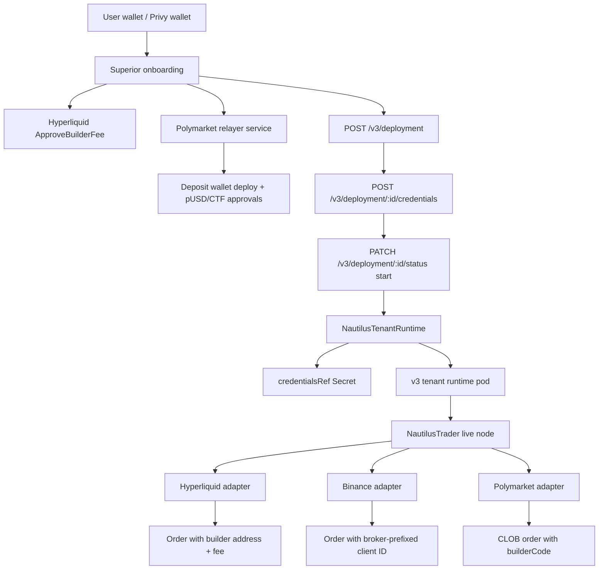

# Superior Trade V3 Runtime Attribution and Relayers

This guide captures the integration plan for running NautilusTrader inside the
Superior Trade v3 runtime with exchange attribution and relayer support for:

- Hyperliquid builder code attribution.
- Binance Link and Trade broker/referral attribution.
- Polymarket builder-code attribution and builder relayer operations.

Research date: 2026-07-07.

:::warning
This is an integration design guide for Superior Trade deployments. It references
NautilusTrader adapter surfaces and Superior Trade runtime files, but it is not a
general upstream exchange setup guide.
:::

## Superior v3 runtime path

Superior's v3 live deployment path is centered on a `NautilusTenantRuntime`
custom resource, not on one Kubernetes Deployment per strategy. The API embeds
active deployment artifacts into a tenant/wallet runtime and lets the runtime
operator reconcile the actual pods.

Relevant Superior files:

- `apps/api/src/v3/api/app.ts`
- `apps/api/src/v3/controller/reconciler.ts`
- `apps/api/src/v3/controller/deployment-submitter.ts`
- `apps/api/src/v3/domain/crds.ts`
- `apps/api/src/v3/domain/types.ts`
- `apps/agent-server/src/agent/tools/deployment.ts`

Current v3 deployment lifecycle:

1. Agent tool `polymarket_deployment_create` posts to `POST /v3/deployment`.
2. The API validates `deployment.config.instrument_id` as
   `<clobTokenId>.POLYMARKET`.
3. The initial plan uses `venueProfile = "polymarket-london"` and creates a
   pending deployment record with `apiVersion: "v3"`.
4. Agent tool `polymarket_deployment_credentials` posts only a user-owned
   `wallet_address` to `POST /v3/deployment/:id/credentials`. The v3 API rejects
   `private_key`.
5. On `PATCH /v3/deployment/:id/status` with `{"action":"start"}`, the API:
   - checks stored wallet credentials;
   - checks Polymarket readiness with `polymarketOnboardingBlockers(...)`;
   - groups running deployments by wallet;
   - provisions a credentials Secret named by
     `polymarketCredentialsSecretName(walletAddress)`;
   - submits one `NautilusTenantRuntime` per tenant/wallet runtime group.
6. Runtime logs are read from `GET /v3/deployment/:id/logs`.

The runtime CRD shape is:

```typescript
{
  apiVersion: "infra.superior.trade/v1alpha1",
  kind: "NautilusTenantRuntime",
  spec: {
    tenantId,
    region,
    clusterId,
    venueProfile,
    credentialsRef: { secretName },
    activeDeploymentIds,
    deployments: [
      { deploymentId, desiredState, code, config },
    ],
    tenantRuntimeImage,
    tenantRuntimeClassName,
    persistenceRef: { claimName },
  },
}
```

Design implication: exchange attribution config belongs in either the deployment
artifact `config` when it is public/non-secret, or the v3 credentials Secret when
it is sensitive. Relayer and builder-signing secrets should stay in API/server
services and should not be copied into `deployment.config`.

## Current adapter support

| Venue | Nautilus support today | Superior runtime work |
| --- | --- | --- |
| Hyperliquid | `HyperliquidExecClientConfig.include_builder_attribution` defaults to `True`; mainnet orders can include Nautilus builder attribution. | v3 runtime types already reserve `hyperliquid-tokyo`, but current v3 API deployment flow is Polymarket-only. Reuse the v3 runtime pattern when Hyperliquid v3 deployments are enabled. |
| Binance | Rust adapter prefixes generated `newClientOrderId` values with fixed Binance Link broker IDs for Spot and Futures, then decodes inbound IDs back to Nautilus order IDs. | v3 runtime types reserve `binance-tokyo`, but current v3 API deployment flow is Polymarket-only. Treat broker attribution as adapter-level behavior when Binance v3 deployments are enabled. |
| Polymarket | Execution config supports CLOB V2 credentials, `signature_type`, `funder`, and deposit-wallet signature type `3`, but the Python config does not yet expose `builderCode` or relayer API-key fields. | This is the active v3 runtime path. Add order-level builder-code injection for CLOB orders and keep relayer/deposit-wallet operations in Superior server-side services. |

## Hyperliquid builder codes

Hyperliquid builder codes are per-order attribution objects. The user must first
approve a maximum builder fee for a builder address with the `ApproveBuilderFee`
action signed by the user's main wallet, not by an agent/API wallet. Orders can
then carry a builder parameter shaped like `{"b": address, "f": number}`, where
`f` is denominated in tenths of a basis point. The current Hyperliquid docs also
state that active approvals are capped per user, builder fees are capped by
market type, and `maxBuilderFee` can be queried from the info endpoint.

Sources:

- [Hyperliquid builder codes](https://hyperliquid.gitbook.io/hyperliquid-docs/trading/builder-codes)
- [Hyperliquid builder approvals UI](https://app.hyperliquid.xyz/builderCodes)

### Nautilus integration points

Nautilus already has the runtime switch:

```python
from nautilus_trader.adapters.hyperliquid import HyperliquidExecClientConfig

config = HyperliquidExecClientConfig(
    include_builder_attribution=True,
)
```

Relevant files:

- `nautilus_trader/adapters/hyperliquid/config.py`
- `nautilus_trader/adapters/hyperliquid/factories.py`
- `docs/integrations/hyperliquid.md`

The factory forwards `include_builder_attribution` into
`get_cached_hyperliquid_http_client(...)`. The existing docs state that the
adapter omits builder attribution on testnet, vault trading, and explicit
opt-out. For Superior, the important boundary is that execution agents usually
hold agent/API wallet keys, while Hyperliquid approval must be signed by the
main wallet.

### Superior runtime plan

Superior already has onboarding and server-side checks around Hyperliquid
builder approval:

- `apps/web-server/src/lib/hl-chain.ts` reads `HL_BUILDER_ADDRESS` and
  `HL_BUILDER_FEE`.
- `apps/web-server/src/routes/onboarding.ts` handles builder-code readiness.
- `apps/api/src/routes/account-v2.ts` checks `maxBuilderFee` and reports builder
  status.
- `apps/web/hooks/use-referral-snapshot-pusher.ts` snapshots builder/referral
  state from browser Hyperliquid info calls.

Recommended runtime contract:

1. Store Superior's canonical Hyperliquid builder config server-side:

   ```bash
   HL_BUILDER_ADDRESS=0x...
   HL_BUILDER_FEE=0.04%
   NEXT_PUBLIC_HL_BUILDER_ADDRESS=0x...
   NEXT_PUBLIC_HL_BUILDER_FEE=0.04%
   ```

2. Before deploying a Hyperliquid strategy, verify:

   - the user's main wallet has approved `HL_BUILDER_ADDRESS`;
   - the approved max fee is at least the required builder fee;
   - the runtime key is either the main wallet key or an approved agent wallet;
   - when an agent wallet is used, Nautilus config includes
     `account_address=<main wallet address>`.

3. Generate Nautilus config with builder attribution enabled unless the product
   deliberately exposes an opt-out:

   ```python
   HyperliquidExecClientConfig(
       private_key="${HYPERLIQUID_PK}",
       account_address="${HYPERLIQUID_ACCOUNT_ADDRESS}",
       include_builder_attribution=True,
   )
   ```

4. If Superior needs its own non-Nautilus Hyperliquid builder address in order
   placement, add a Nautilus adapter extension instead of rewriting orders in the
   runtime:

   - `builder_address: str | None`
   - `builder_fee_tenth_bps: int`
   - `include_builder_attribution: bool`

   Keep the default behavior backwards-compatible: no explicit builder fields
   should preserve the current Nautilus zero-fee attribution behavior.

### Operational checks

- Reconcile approval state from `maxBuilderFee` at onboarding and again just
  before deployment.
- Keep builder approval separate from trading-key creation. A failed approval is
  an onboarding issue, not a Nautilus strategy error.
- Treat vault trading as unsupported for builder attribution unless Hyperliquid
  changes its approval model.
- Do not sign `ApproveBuilderFee` inside unattended live runtime pods.

## Binance broker/referral attribution

There are two different Binance concepts that are easy to confuse:

- Retail referral codes apply at account signup and are not an order-routing
  parameter.
- Binance Link and Trade/API-Agent broker attribution applies to API order flow
  and uses broker IDs, customer IDs, or broker-managed subaccounts depending on
  the partner product.

Nautilus' Binance adapter implements order-flow attribution through Link and
Trade broker ID prefixing on `newClientOrderId`, not through a signup referral
code. Binance's API-Agent docs show broker/customer-ID endpoints such as
`/fapi/v1/apiReferral/userCustomization`, `/fapi/v1/apiReferral/ifNewUser`, and
rebate-volume reporting endpoints for futures API-Agent use cases.

Sources:

- [Binance Link Program](https://www.binance.com/en/link)
- [Binance Futures API-Agent endpoints](https://binance-docs.github.io/apiAgent-API-EN/api_rebate_endpoints_futures_EN/)
- [Binance Developer Docs](https://developers.binance.com/en/dev-docs/catalog)

### Nautilus integration points

Relevant files:

- `crates/adapters/binance/src/common/consts.rs`
- `crates/adapters/binance/src/common/encoder.rs`
- `crates/adapters/binance/src/python/mod.rs`
- `docs/integrations/binance.md`

Nautilus defines static broker IDs:

```rust
pub const BINANCE_NAUTILUS_SPOT_BROKER_ID: &str = "TD67BGP9";
pub const BINANCE_NAUTILUS_FUTURES_BROKER_ID: &str = "aHRE4BCj";
```

The encoder emits `newClientOrderId` values with this shape:

```text
x-{BROKER_ID}-{signal}{base62_payload}
```

This preserves Nautilus `ClientOrderId` reversibility while fitting Binance's
36-character `newClientOrderId` limit. Inbound execution reports are decoded
before reaching the trading system.

### Superior runtime plan

1. Treat Binance attribution as automatic when the Rust Binance adapter is used.
   Runtime config should not expose a user-editable referral code.

2. If Superior becomes its own Binance Link partner, add explicit broker ID
   configuration to the adapter rather than forking order IDs in the runtime:

   ```rust
   binance_spot_broker_id: Option<String>
   binance_futures_broker_id: Option<String>
   ```

   The default should remain the Nautilus constants. Validation should enforce
   the broker-ID length and final `newClientOrderId` limit before submitting.

3. If Superior needs API-Agent account customization, implement it as a separate
   account-linking service, not as part of the strategy runtime:

   - collect or provision the broker/customer relationship before deployment;
   - call the API-Agent endpoint with server-held broker credentials;
   - persist the result in Superior account metadata;
   - let Nautilus continue submitting ordinary Binance orders.

4. For user-provided Binance API keys in `apps/api/src/routes/openapi.ts`, keep
   the existing secret references (`BINANCE_API_KEY`, `BINANCE_API_SECRET`) and
   pass them into the strategy pod. Do not add broker credentials to user pods
   unless the pod itself owns broker-management actions.

### Operational checks

- Verify live order reports return decoded Nautilus client order IDs.
- Track whether orders without a broker prefix are user-supplied client IDs, old
  orders, or fallback cases where the encoded ID would exceed Binance limits.
- Broker commission/rebate reporting should be pulled by backend jobs using
  Binance partner credentials, not strategy pods.

## Polymarket builder code and relayer

Polymarket separates builder attribution from gasless wallet operations:

- CLOB order attribution uses a public `builderCode` bytes32 value attached to
  each submitted order.
- Relayer operations use Relayer API keys or Builder API keys to deploy deposit
  wallets, set approvals, execute CTF operations, transfer tokens, and submit
  signed onchain transactions.

The current docs state that order attribution needs only the public builder code
on the order struct. Relayer requests use `RELAYER_API_KEY` and
`RELAYER_API_KEY_ADDRESS`, or builder HMAC headers such as
`POLY_BUILDER_API_KEY`, `POLY_BUILDER_TIMESTAMP`,
`POLY_BUILDER_PASSPHRASE`, and `POLY_BUILDER_SIGNATURE`.

Sources:

- [Polymarket Builder Program](https://docs.polymarket.com/builders/overview)
- [Polymarket Builder Code](https://docs.polymarket.com/builders/api-keys)
- [Polymarket Order Attribution](https://docs.polymarket.com/trading/orders/attribution)
- [Polymarket Gasless Transactions](https://docs.polymarket.com/trading/gasless)
- [Polymarket Relayer submit transaction](https://docs.polymarket.com/api-reference/relayer/submit-a-transaction)
- [Polymarket relayer API keys](https://docs.polymarket.com/api-reference/relayer-api-keys/get-all-relayer-api-keys)

### Nautilus integration points

Relevant files:

- `nautilus_trader/adapters/polymarket/config.py`
- `nautilus_trader/adapters/polymarket/factories.py`
- `nautilus_trader/adapters/polymarket/execution.py`
- `docs/integrations/polymarket.md`

Current Python config supports:

```python
PolymarketExecClientConfig(
    private_key="${POLYMARKET_PK}",
    signature_type=3,
    funder="${POLYMARKET_FUNDER}",
    api_key="${POLYMARKET_API_KEY}",
    api_secret="${POLYMARKET_API_SECRET}",
    passphrase="${POLYMARKET_PASSPHRASE}",
)
```

`signature_type=3` is the deposit-wallet / ERC-1271 flow. `funder` should be
the deposit wallet address. The factory passes these fields into
`py_clob_client_v2.client.ClobClient`.

What is missing for full Superior builder attribution is an adapter-level field
for `builderCode`. The Polymarket docs show `builderCode` as an order field;
the Nautilus Python config does not expose it today.

### Superior runtime plan

Superior already has a server-side relayer integration:

- `apps/api/src/v3/api/app.ts` owns the active v3 deployment lifecycle:
  `POST /v3/deployment`, `POST /v3/deployment/:id/credentials`, and
  `PATCH /v3/deployment/:id/status`.
- v3 credential submission stores wallet metadata only. It rejects
  `private_key`, verifies that the wallet is owned by the authenticated user,
  and records `{ status: "stored", exchange: "polymarket", walletAddress }`
  into deployment config.
- v3 start groups active deployments by wallet address and submits
  `NautilusTenantRuntime` resources named with
  `runtimeNameForTenantWallet(tenantId, walletAddress)`.
- The v3 runtime points at a Secret named
  `polymarketCredentialsSecretName(walletAddress)`. The credential
  provisioner should populate that Secret with the actual Nautilus/Polymarket
  trading credentials.
- `apps/api/src/polymarket/deposit-wallet.ts` creates a
  `@polymarket/builder-relayer-client` `RelayClient`.
- It supports local builder HMAC signing via:
  - `POLYMARKET_BUILDER_API_KEY`
  - `POLYMARKET_BUILDER_SECRET`
  - `POLYMARKET_BUILDER_PASSPHRASE`
- It supports remote builder signing via:
  - `POLYMARKET_BUILDER_SIGNER_URL`
  - `POLYMARKET_BUILDER_SIGNER_TOKEN`
- It uses `POLYMARKET_RELAYER_URL`, defaulting to
  `https://relayer-v2.polymarket.com`.
- It deploys deposit wallets and runs post-wrap allowances through
  `executeDepositWalletBatch(...)`.

Recommended split:

1. Keep relayer operations server-side in Superior.

   Strategy pods should not hold builder HMAC secrets, relayer API keys, or
   remote builder signer tokens. V3 runtime pods should receive only the
   credentials Secret needed to run Nautilus for that wallet group.

2. Add Superior's public builder code to v3 deployment config:

   ```bash
   POLYMARKET_BUILDER_CODE=0x...
   ```

   This value is public and can be included in `deployment.config`, unlike
   relayer HMAC secrets. Note that `apps/api/src/v3/domain/account.ts`
   currently has a placeholder `POLYMARKET_BUILDER_CODE =
   "superior-trade-polymarket"`; replace that with a real bytes32 builder code
   before wiring it into live orders.

3. Extend Nautilus Polymarket config and order submission:

   ```python
   class PolymarketExecClientConfig(...):
       builder_code: str | None = None
   ```

   Factory and execution behavior:

   - pass `builder_code` into `PolymarketExecutionClient`;
   - when creating CLOB orders, attach `builderCode=builder_code` unless the
     individual order already supplied a builder override;
   - validate that builder codes are `0x`-prefixed 32-byte hex values;
   - keep default `None` to preserve current behavior.

4. Generate runtime config for deposit-wallet trading:

   ```python
   PolymarketExecClientConfig(
       private_key="${POLYMARKET_PK}",
       signature_type=3,
       funder="${POLYMARKET_DEPOSIT_WALLET}",
       api_key="${POLYMARKET_API_KEY}",
       api_secret="${POLYMARKET_API_SECRET}",
       passphrase="${POLYMARKET_PASSPHRASE}",
       builder_code="${POLYMARKET_BUILDER_CODE}",
   )
   ```

   In v3 terms, the non-secret public fields belong in
   `NautilusTenantRuntime.spec.deployments[].config`; the private key and CLOB
   credentials belong in the Secret referenced by
   `NautilusTenantRuntime.spec.credentialsRef.secretName`.

5. Make onboarding responsible for:

   - deriving the deposit wallet address;
   - deploying the deposit wallet if not deployed;
   - wrapping funds to pUSD;
   - setting pUSD and CTF approvals;
   - persisting `POLYMARKET_DEPOSIT_WALLET` / `funder` for deployment;
   - creating or retrieving CLOB API credentials for the signer.

6. Keep CLOB API credentials separate from builder/relayer credentials:

   - CLOB credentials: per user/trading wallet, stored in the v3 credentials
     Secret and used by Nautilus.
   - Builder code: public attribution value, can be passed through
     `deployment.config`.
   - Builder HMAC or relayer API keys: Superior server secret, used only by
     relayer services.

### Proposed implementation order

1. Add `builder_code` to Nautilus Polymarket config and tests.
2. Attach `builderCode` in Polymarket order creation for Python adapter.
3. Add `POLYMARKET_BUILDER_CODE` to v3 deployment config generation for
   `venueProfile = "polymarket-london"`.
4. Update the v3 credentials provisioner to keep secrets in
   `polymarketCredentialsSecretName(walletAddress)` and keep public
   builder-code config in the deployment artifact.
5. Confirm Superior deposit-wallet service continues to own relayer operations.
6. Add an integration test that creates a mocked order payload and asserts the
   builder code is present.
7. Add a smoke test with a low-size Polymarket order in a controlled wallet
   after approvals and pUSD funding are present.

## Runtime data flow



## Secret handling

| Secret/value | Scope | V3 runtime? | Notes |
| --- | --- | --- | --- |
| `HL_BUILDER_ADDRESS` | Superior server config | Optional public mirror | Required for approval checks. |
| `HL_BUILDER_FEE` | Superior server config | Optional public mirror | Must match approval threshold. |
| `HYPERLIQUID_PK` | Per deployment | Yes | Main or agent wallet key. |
| `HYPERLIQUID_ACCOUNT_ADDRESS` | Per deployment | Yes when using agent wallet | Main wallet address for account queries. |
| Binance API key/secret | Per deployment | Yes | Ordinary trading credentials. |
| Binance broker credentials | Superior backend only | No | Needed only for API-Agent account management/reporting. |
| `POLYMARKET_BUILDER_CODE` | Public builder attribution | Yes, in deployment config | Safe to pass through the v3 artifact once it is a real bytes32 code. |
| `POLYMARKET_BUILDER_API_KEY` / secret / passphrase | Superior backend only | No | Used by relayer HMAC signing. |
| `RELAYER_API_KEY` / address | Superior backend only | No | Used for relayer API auth if chosen. |
| `POLYMARKET_PK` | Per wallet runtime Secret | Yes, via `credentialsRef` | Signer for CLOB order signing. |
| `POLYMARKET_FUNDER` | Per wallet runtime Secret or public deployment config | Yes | Deposit/proxy wallet address. |
| `POLYMARKET_API_KEY` / secret / passphrase | Per wallet runtime Secret | Yes, via `credentialsRef` | CLOB API credentials bound to the user's signer. |

## Open decisions

- Whether Superior should continue using Nautilus' Hyperliquid builder
  attribution or introduce explicit Superior builder fields in the adapter.
- Whether Binance attribution should remain Nautilus-branded or be changed to a
  Superior Binance Link broker ID after partner approval.
- Whether Polymarket builder code should be attached globally per execution
  client or overridable per order for multi-builder deployments.
- Whether Superior should standardize on Relayer API keys or Builder API HMAC
  headers for relayer requests. The current code supports builder HMAC and
  remote builder signing.

## Acceptance checklist

- Hyperliquid deployments refuse to start, or clearly warn, when required
  builder approval is missing.
- Hyperliquid agent-wallet deployments set `account_address` to the main wallet.
- Binance orders generated by Superior runtime include the expected broker
  prefix and reconcile back to original Nautilus order IDs.
- Polymarket deposit wallets are deployed and approved by Superior services
  before strategy deployment.
- Polymarket CLOB orders include `builderCode` when
  `POLYMARKET_BUILDER_CODE` is configured.
- Builder/relayer secrets never enter browser bundles or user strategy pods.
